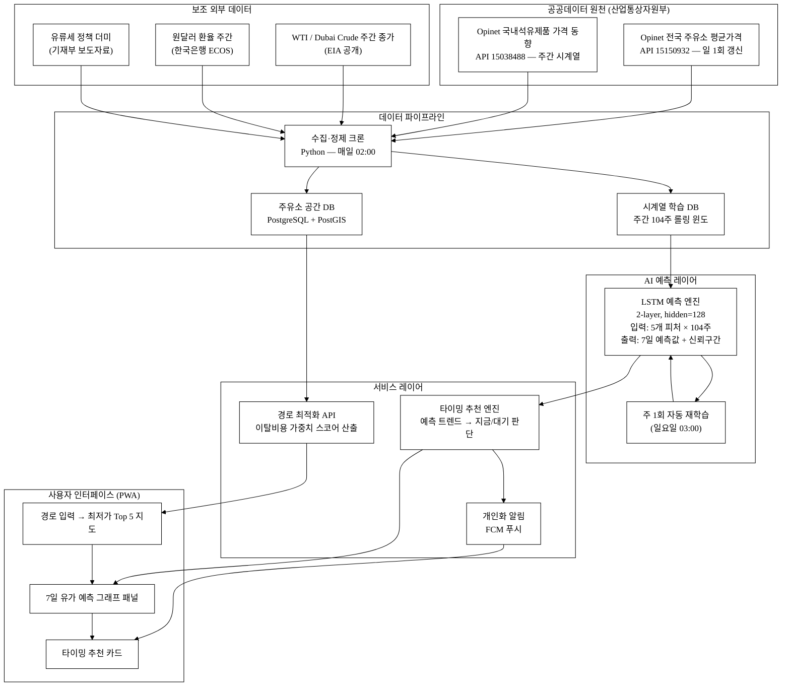
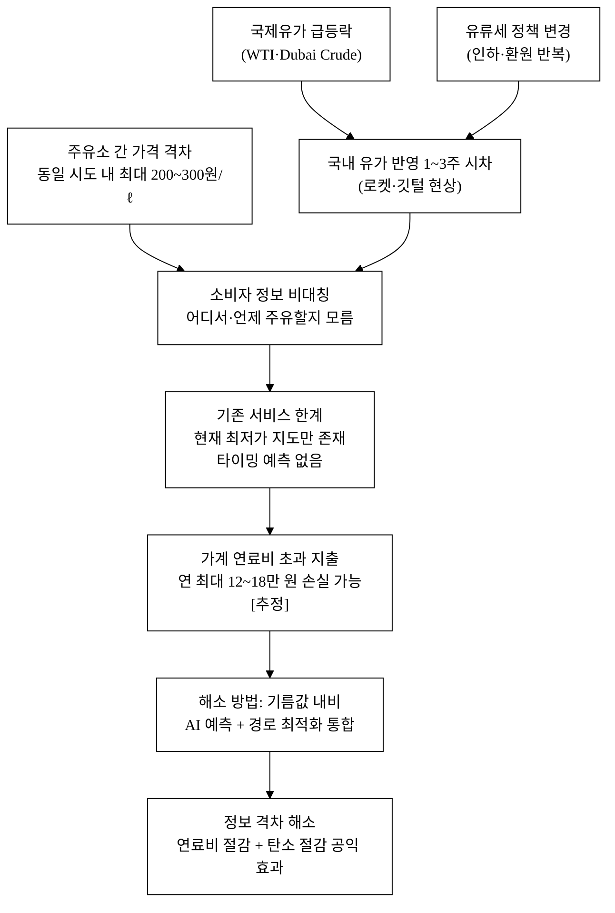
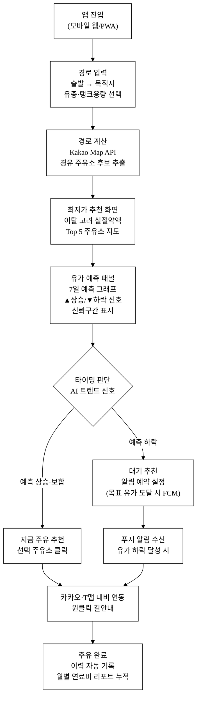
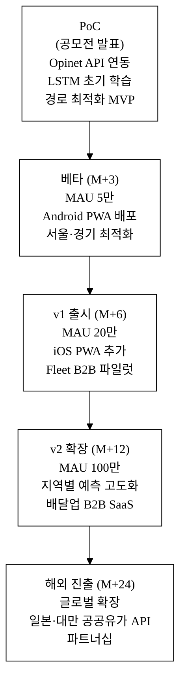
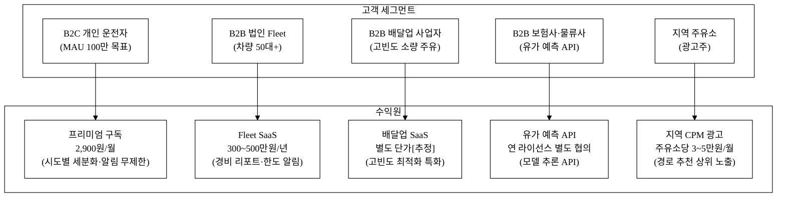

last_updated: 2026-06-28 14:00

---

| 항목 | 값 |
|:---|:---|
| 사업명 | 제14회 산업통상자원부 공공데이터 활용 아이디어 공모전 |
| 부문 | 제품·서비스 개발 |
| 테마축 | 지역활력(생활) |
| 아이디어명 | 기름값 내비 — 주유소 최저가 추천 + AI 유가 예측 |
| 제출일 | <TODO: 사용자 입력> |
| 팀명 | <TODO: 사용자 입력> |
| 연락처 | <TODO: 사용자 입력> |

---

# 기름값 내비 — 주유소 최저가 추천 + AI 유가 예측

> **3줄 개요**
> 전국 주유소 실시간 유가 공공데이터(한국석유공사 Opinet API 15150932·15038488)와 AI 시계열 예측 모델을 결합하여, 운전자에게 "지금 주유하는 게 나은가, 기다리는 게 나은가"를 경로 기반으로 안내하는 모바일 웹 서비스다.
> 단순 최저가 지도에서 나아가, 향후 7일 유가 방향성 예측과 경로 상 최저가 주유소 최적화를 한 화면에 통합함으로써 가계 연료비 절감(연 최대 12~18만 원[추정])과 지역 주유소 정보 접근성 향상을 동시에 실현한다.
> 공공데이터 API를 핵심 원천으로 삼아, AI 예측·경로 최적화·개인화 알림의 세 레이어로 유가 정보 비대칭을 해소한다.

**핵심 기술·서비스·정보 명칭**

| 구분 | 명칭 |
|:---|:---|
| 서비스명 | 기름값 내비 (FuelNav) |
| 핵심 기술 1 | LSTM 기반 주간 유가 시계열 예측 엔진 (7일 앞 예측, MAPE 목표 2% 이내[추정]) |
| 핵심 기술 2 | 경로 상 주유소 최저가 최적화 알고리즘 (이탈비용 내재화 가중치 스코어) |
| 핵심 데이터 1 | 한국석유공사 Opinet 전국 주유소 평균가격 (공공API 15150932) |
| 핵심 데이터 2 | 한국석유공사 국내석유제품 가격 동향 (공공API 15038488) |
| 보조 기술 | 경로 이탈 최소화 점수 산출, 개인 주유 패턴 학습, FCM 개인화 알림 |

---

## 1. 아이디어 기획 핵심내용 (구체성, 우수성)

### 1.1 무엇을 만드는가

"기름값 내비"는 **주유 의사결정을 돕는 AI 보조 서비스**다. 사용자가 출발지·목적지를 입력하면, 경로상의 주유소 목록을 실시간 유가 기준으로 정렬하고, 동시에 향후 7일 유가 예측치(휘발유·경유·LPG)를 제시하여 "지금 넣는 게 나은가, 2~3일 뒤가 나은가"라는 타이밍 추천까지 제공한다.

핵심 기능은 세 가지다.

1. **경로 기반 최저가 추천**: 사용자 경로(출발→경유→도착)에서 ±2 km 이탈 범위 내 주유소를 필터링하고, 유가·거리·이탈 시간 세 가지 가중치로 "실제 절약액"을 계산해 순위화한다.
2. **AI 유가 예측 (주간, 지역별)**: 한국석유공사 국내석유제품 가격 동향(API 15038488)의 과거 3년+ 주간 시계열 데이터를 LSTM 모델로 학습, 다음 7일 전국 및 시도별 평균 유가를 예측한다. 국제유가(WTI/Dubai Crude) 보조 피처를 결합하여 외생 충격 반영 성능을 높인다.
3. **개인화 알림**: 사용자가 설정한 "주유 예정 시점"과 AI 예측 트렌드를 비교해, 유가 하락이 예상되면 "조금 더 기다리세요", 상승 예상이면 "지금 채우세요"를 FCM 푸시 알림으로 발송한다.

아래 그림 1은 세 기능이 데이터 흐름 측면에서 어떻게 연결되는지를 나타낸 시스템 아키텍처다.

**그림 1.** 기름값 내비 시스템 아키텍처



### 1.2 구현 기술 상세

**표 1.** 기술 스택 구성

| 레이어 | 기술 스택 | 비고 |
|:---|:---|:---|
| 데이터 수집 | Python 3.11 + data.go.kr REST API 호출 | 일 1회 cron, 주유소 약 1만 1천 개소 |
| 시계열 예측 | PyTorch 2.x LSTM (단변량→다변량, seq2seq) | 입력: 과거 104주 × 5 피처, 출력: 7일 예측 |
| 경로 최적화 | Kakao Map JS API + 자체 가중치 스코어 알고리즘 | 이탈거리·절약액·이탈시간 3축 가중합 |
| 백엔드 | FastAPI (Python 3.11) | 예측 서빙 API + 주유소 공간 검색 |
| 프론트엔드 | Next.js 14 (React) + Tailwind CSS | PWA, 모바일 우선, 오프라인 캐시 |
| 공간 DB | PostgreSQL 16 + PostGIS | 위경도 기반 주유소 반경 쿼리 |
| 알림 | Firebase Cloud Messaging (FCM) | 개인화 유가 알림, 유가 급등 속보 |
| 인프라 | Docker Compose → GCP Cloud Run | 스케일아웃 가능, 예측 배치는 Vertex AI |

**AI 유가 예측 엔진 상세**

- **입력 피처 (5종)**: ① 국내 주간 평균유가 시계열(104주) ② WTI/Dubai Crude 주간 종가 ③ 원달러 환율 ④ 유류세 변경 더미 ⑤ 계절 주기 변수(sin/cos 인코딩)
- **모델 구조**: PyTorch LSTM 2-layer (hidden_size=128, dropout=0.2), seq2seq 구조로 다음 7일 예측; 예측 불확실성은 Dropout 기반 Monte Carlo 추정으로 신뢰구간 생성
- **학습 데이터**: Opinet 국내석유제품 가격 동향(15038488) 2022~2025년 주간 데이터(약 156주+); 3-fold 시계열 교차검증(walk-forward)
- **성능 목표**: MAPE(평균 절대 백분율 오차) 2% 이내[추정, 유사 연구 기준[^5]]; 실 학습 후 교차검증으로 실측치 교체 예정
- **재학습 주기**: 매주 일요일 03:00 자동 재학습 (최신 주 데이터 누적 반영)
- **AI 해자(Wrapper 방지)**: 단순 LLM API 호출이 아니라 (a) Opinet 공공데이터 자체 학습 LSTM 모델, (b) 경로 최적화 가중치 알고리즘, (c) 개인 주유 이력 피처 루프의 세 자산 레이어를 직접 구축한다. 기반 딥러닝 프레임워크가 교체되어도 Opinet 시계열 학습 자산과 경로 알고리즘이 핵심 자산으로 잔존한다.

**경로 기반 최적화 알고리즘**

절약액 점수(S_i)를 다음 수식으로 정의하고, S_i > 0 인 주유소만 추천 대상에 올려 내림차순 Top 5를 제시한다:

```
S_i = (P_ref - P_i) × V  −  w_d × D_i_extra × C_fuel  −  w_t × T_i_extra
```

- P_ref: 경로상 최고가 주유소 가격 (원/ℓ)
- P_i: 후보 주유소 i의 현재 가격 (원/ℓ)
- V: 탱크에 넣을 양 (ℓ, 사용자 입력)
- D_i_extra: 경로 이탈 추가 거리 (km)
- C_fuel: 현재 유가 기반 이탈 연료비 (원/km, 차종 효율 기본값 12km/ℓ)
- T_i_extra: 이탈 추가 시간 (분)
- w_d, w_t: 사용자 조정 가중치 (기본값 w_d=1.0, w_t=1.5)

### 1.3 기획 우수성 — 왜 이것이 지금인가

기존 서비스(Opinet 앱·T맵 주유소 기능·네이버 지도)는 **현재 최저가 지도**만 제공한다. 유가가 매일 변동하는 상황에서 "어디서 넣을까"와 "언제 넣을까"는 동등하게 중요한 질문임에도, 타이밍 추천을 제공하는 서비스는 국내에 존재하지 않는다. 이 공백과, 국제유가 급등락이 반복되는 에너지 불확실성 시대의 교차점이 기획의 출발점이다.

---

## 2. 아이디어 구상 및 제안배경 (활용적정성)

### 2.1 문제 배경 — 유가 변동과 정보 비대칭

2024년 기준 국내 자동차 등록 대수는 약 2,600만 대[^1]이며, 이 중 내연기관 차량(휘발유·경유·LPG)이 약 2,300만 대 이상으로 추정[추정]된다. 국내 주유소는 2025년 Opinet 기준 약 1만 1,000개소[^2]이며, 전국 주유소 간 휘발유 가격 격차는 동일 시도 내에서도 리터당 최대 200~300원[^3]에 달한다. 월 50리터를 주유하는 운전자라면 정보 비대칭으로 인해 연간 최대 12만~18만 원을 초과 지출할 수 있다[추정].

유가는 국제유가(WTI, Dubai Crude), 환율, 정부 유류세 정책, 계절 수요 등 복합 요인에 의해 주간 단위로 등락한다. 2022~2024년 사이에는 국제유가 급등락 시 국내 주유소 가격이 1~3주 시차를 두고 반영되는 "로켓과 깃털(Rocket and Feather)" 현상[^4]이 반복 관찰되었으며, 이 시차를 사전에 인지하는 소비자는 실질적인 절약이 가능하다.

실제로 유류세가 인하될 때보다 환원될 때 소비자가 더 빠르게 가격 상승을 경험하는 비대칭적 전가 구조가 반복되어, 유가 뉴스를 보고도 "지금 주유해야 하는지"를 판단하지 못하는 소비자의 정보 공백이 실질적 손실로 이어진다.

그림 2는 이 문제 구조를 인과도로 정리한 것이다.

**그림 2.** 유가 정보 비대칭이 가계 손실로 이어지는 인과 구조



### 2.2 활용분야 · 활용빈도 · 활용범위 · 중요성

**표 2.** 활용 4요소 정리

| 요소 | 내용 |
|:---|:---|
| **활용분야** | ① 개인 운전자 연료비 절감 ② 법인 차량 관리(fleet cost 최적화) ③ 배달·물류 사업자 운영비 절감 ④ 지역 주유소 가격 투명화(공공 가치) |
| **활용빈도** | 주유 주기 평균 1~2회/주 → 주간 활성 사용자 잠재 1,500만+[추정]; 유가 예측 조회는 일 단위(급등락 시 수시) |
| **활용범위** | 전국 어디서나 사용 가능(전국 1만 1천 개소 Opinet 데이터 커버); 휘발유·경유·LPG 3개 유종 지원; PC·모바일 PWA |
| **중요성** | ① 가계 연료비는 교통비 중 가장 큰 변동비 항목 ② 물가 취약계층(저소득·1인 가구)에 직접 생활비 혜택 ③ 공공데이터 활용으로 정보 접근성 평등화 ④ 불필요 이탈 주행 감소 → 탄소 절감 간접 공익 효과 |

### 2.3 구상 배경 — 공공데이터 공백 확인

한국석유공사 Opinet은 전국 주유소의 일별 평균가격(15150932)과 국내석유제품 가격 동향(15038488)을 공공API로 제공한다. 그러나 이 데이터를 기반으로 한 **예측·최적화 서비스**는 민간·공공 모두에서 공백이다. Opinet 공식 앱은 현재가 조회에 그치고, 경로 기반 최적화나 유가 예측을 제공하지 않는다. 이 공백에서 본 아이디어가 출발한다.

---

## 3. 아이디어 세부내용

### ① 활용 산업통상자원부 공공데이터 (탈락요건 충족 — 필수)

**⚠️ 아래 두 데이터셋은 평가 탈락요건 충족의 핵심이다. 서비스에 실 연동한다.**

**표 3.** 핵심 산업통상자원부 공공데이터 목록

| 순번 | 데이터셋명 | 제공 기관 | data.go.kr 데이터셋 ID | 활용 방식 |
|:---:|:---|:---|:---:|:---|
| 1 | **전국 주유소 평균가격** | 한국석유공사 (Opinet) | **15150932** | 전국 1만 1천 개소 실시간 유가 수집, 경로 기반 최저가 산출 핵심 데이터 |
| 2 | **국내석유제품 가격 동향** | 한국석유공사 (Opinet) | **15038488** | 주간 전국 평균유가 시계열 → LSTM 예측 모델 학습·추론 입력 데이터 |

- 두 데이터셋 모두 data.go.kr 회원가입 + 활용신청 후 무료 API 호출 가능.
- 데이터셋 1(15150932): 주유소별 위경도·가격·유종 등 포함, 일 1회 이상 갱신.
- 데이터셋 2(15038488): 전국/지역별 주간 평균유가 시계열, 3년+ 과거 데이터 제공.

### ② 타 기관·민간 데이터

**표 4.** 보조 데이터 목록

| 데이터 | 출처 | 활용 목적 | 비고 |
|:---|:---|:---|:---|
| WTI / Dubai Crude 국제유가 주간 종가 | EIA (미국 에너지정보청), 한국석유공사 국제유가 동향 | LSTM 보조 피처 — 국내 유가 선행지수 | 공개 무료 |
| 원달러 환율 (주간) | 한국은행 경제통계시스템 (ECOS) | 환율 충격 변수 반영 | 공개 무료 |
| 유류세 제도 이력 | 국세청, 기획재정부 보도자료 | 정책 더미 변수(세율 변경 시점 처리) | 공개 |
| Kakao Map JS API | 카카오 | 경로 지도 시각화, 주유소 위치 마킹 | 월 1,000만 건 무료 |
| 사용자 위치 (GPS) | 브라우저 Geolocation API | 현재 위치 기반 주유소 필터 | 단말 제공 |

### ③ 기존 서비스 대비 차별성

**표 5.** 경쟁 서비스 기능 비교

| 기능 | Opinet 공식 앱 | T맵 주유소 | 네이버 지도 주유소 | 카카오 지도 | **기름값 내비 (본 서비스)** |
|:---|:---:|:---:|:---:|:---:|:---:|
| 현재 최저가 조회 | ✅ | ✅ | ✅ | ✅ | ✅ |
| 경로 기반 필터링 | ❌ | ✅(약) | ❌ | ❌ | ✅(경로 ±2km) |
| 실제 절약액 계산 | ❌ | ❌ | ❌ | ❌ | ✅(탱크용량×가격차−이탈비용) |
| 유가 예측(주간 7일) | ❌ | ❌ | ❌ | ❌ | **✅(LSTM seq2seq)** |
| 주유 타이밍 추천 | ❌ | ❌ | ❌ | ❌ | **✅(지금/대기)** |
| 개인화 유가 알림 | ❌ | ❌ | ❌ | ❌ | **✅(FCM 푸시)** |
| 지역별 예측 트렌드 | ❌ | ❌ | ❌ | ❌ | ✅(시도 16개별) |
| 예측 신뢰구간 표시 | ❌ | ❌ | ❌ | ❌ | ✅(Monte Carlo Dropout) |
| 공공데이터 원천 | ✅(자체) | ❌ | ❌ | ❌ | ✅(Opinet API 공식) |

핵심 차별점은 **"최저가 지도 + AI 타이밍 예측"의 결합**이다. 기존 서비스는 모두 "어디서 넣을까"에만 답하고, "언제 넣을까"는 전혀 다루지 않는다.

### ④ 창의성·독창성

1. **타이밍 차원 추가**: 주유 의사결정의 두 축(장소·시점) 중 "시점" 차원을 최초로 AI로 다룬다.
2. **이탈비용 내재화**: 기존 서비스는 "가장 싼 주유소"를 보여주지만, 경로에서 멀면 이탈 연료비·시간이 더 든다. 본 서비스는 이탈거리 패널티를 가중치로 내재화하여 **"실제 절약액이 큰 주유소"**를 추천한다.
3. **공공데이터 시계열 자산화**: Opinet의 3년+ 주간 유가 시계열을 학습 데이터로 삼아 모델 재학습 루프를 구성한다. 사용자가 늘수록 지역별 소비 패턴 데이터가 쌓여 예측 정확도가 높아지는 **데이터 네트워크 효과**를 설계했다.
4. **"로켓과 깃털" 현상 포착**: 국제유가 급등 시 국내 가격 반영 지연을 LSTM 피처로 포착, 인상 전 주유 타이밍을 선제적으로 알린다.

### ⑤ 개요·구현기술·서비스방법

그림 3은 실 사용자가 서비스를 이용할 때의 단계별 여정을 나타낸다.

**그림 3.** 사용자 서비스 흐름도 (사용자 여정)



---

## 4. 아이디어의 사업화방안 및 기대효과 (사업성, 실현가능성)

### 4.1 시장성 (TAM / SAM / SOM)

**표 6.** 시장 규모 추산

| 단계 | 정의 | 규모 |
|:---|:---|:---|
| TAM (전체 가용 시장) | 국내 내연기관 차량 보유 운전자 | 약 2,300만 명[추정] |
| SAM (서비스 가능 시장) | 스마트폰 보유 + 정기 주유자 | 약 1,500만 명[추정] |
| SOM (초기 3년 목표) | MAU 100만 명 (SAM의 약 7%) | 100만 MAU |

국내 주유소는 2025년 기준 약 1만 1,000개소이며, 유가 변동이 심한 시기(국제유가 급등락, 유류세 인하·환원 정책)마다 주유소 앱·서비스 검색량이 급증하는 특성이 있어 시장 진입 타이밍이 유리하다.

그림 4는 3년 상용화 단계별 로드맵을 나타낸다.

**그림 4.** 상용화 단계별 로드맵



### 4.2 상용화 계획 (단계별 로드맵)

**표 7.** 상용화 로드맵 상세

| 단계 | 기간 | 목표 | 핵심 활동 |
|:---|:---|:---|:---|
| PoC | 공모전 발표 시점 | 데모 동작 검증 | Opinet API 연동, LSTM 초기 학습(104주), 경로 최적화 MVP |
| 베타 | 출시 후 3개월 | MAU 5만 | 안드로이드 PWA 배포, 서울·경기 지역 최적화, 커뮤니티 베타 테스터 모집 |
| v1 출시 | 6개월 | MAU 20만 | iOS PWA 추가, 법인 Fleet 대시보드(B2B) 파일럿, 배달 플랫폼 파트너십 타진 |
| v2 확장 | 12개월 | MAU 100만 | 지역별 예측 고도화(시군구), 배달업 B2B SaaS 론칭, 유가 예측 API 라이선스 |
| 해외 진출 | 24개월 | 글로벌 확장 | 유사 공공유가 API 보유 국가(일본·대만) 진출, 현지 파트너십 |

### 4.3 수익모델 (단위경제성)

그림 5는 수익원 구조와 각 고객 세그먼트 간의 연결을 나타낸다.

**그림 5.** 수익구조 — 고객 세그먼트별 수익원



**표 8.** 수익원 구성

| 수익원 | 모델 | 단가 | 비고 |
|:---|:---|:---|:---|
| B2C 프리미엄 구독 | 월 구독 | 2,900원/월 | 고급 예측(시도별 세분화·알림 무제한) |
| B2B Fleet 관리 | 법인 SaaS | 300~500만원/년 | 법인 차량 50대 이상, 경비 리포트 |
| 주유소 광고 | 지역 CPM | 주유소당 3~5만원/월 | 경로 추천 상위 노출 |
| 데이터 라이선스 | 연 라이선스 | 별도 협의 | 보험사·물류사에 유가 예측 API 제공 |

**단위경제성 (B2C 구독 기준, [추정])**

**표 9.** B2C 단위경제성

| 지표 | 값 | 산출 근거 |
|:---|:---|:---|
| 전환율 (무료→유료) | 3% | 유사 생활 앱 벤치마크[추정] |
| ARPU (유료 사용자) | 2,900원/월 | 구독 단가 |
| LTV (12개월 유지 가정) | 34,800원 | 2,900 × 12 |
| CAC (앱스토어·바이럴) | 3,000~5,000원 | 유사 생활 앱 벤치마크[추정] |
| LTV/CAC | 7~11배 | 투자 회수 가능 수준 |
| 기여이익률 | ~85%[추정] | SaaS 유사 서비스 기준 (인프라 비용 제외) |
| 회수기간 (CAC 기준) | 1.2~1.7개월[추정] | CAC/ARPU_monthly |

**매출 시나리오 (3년, [추정])**

**표 10.** 3년 매출 시나리오

| 시나리오 | MAU | 유료전환 | 유료 사용자 | 연 구독 매출 | B2B 추가 매출 | 연 합계 |
|:---|:---|:---|:---|:---|:---|:---|
| 보수 | 30만 | 3% | 9,000명 | 약 3.1억원 | 약 0.5억원 | 약 3.6억원 |
| 기본 | 100만 | 3.5% | 3.5만명 | 약 12.2억원 | 약 2억원 | 약 14.2억원 |
| 공격 | 200만 | 4% | 8만명 | 약 27.8억원 | 약 5억원 | 약 32.8억원 |

### 4.4 고객확보 (Go-to-Market) 전략

**ICP (초기 타깃 고객)**
- 1순위: 주간 2회 이상 주유, 스마트폰 사용에 능숙한 30~50대 운전자 (가격 민감도 높음)
- 2순위: 배달·택배 기사 등 연료비 비중이 높은 자영업자 (고빈도, 절약 동기 강)
- 3순위: 법인 차량 50대+ 보유 중소기업 총무 담당자 (경비 최적화 니즈)

**인지→가입→활성→유지 퍼널**

**표 11.** GTM 퍼널 전략

| 단계 | 채널 | 전술 | 목표 지표 |
|:---|:---|:---|:---|
| 인지 | 유가 급등 뉴스 연계 콘텐츠, 자동차·배달 커뮤니티(클리앙·보배드림·당근) | "지금 주유해야 할까?" 실시간 콘텐츠 배포; 유가 급등 시 SNS 바이럴 | 월 방문자 50만+ (3개월) |
| 가입 | 앱스토어 ASO, 카카오 채널 연동, 공모전 수상 홍보 | 가입 즉시 현재 위치 기반 주유소 최저가 조회 제공 (마찰 0) | 가입 전환율 15%+ |
| 활성 | 경로 입력 유도 온보딩(3단계) | 첫 경로 입력 시 "이 경로에서 최대 X원 절약 가능" 임팩트 메시지 | 7일 재방문율 40%+ |
| 유지 | 주간 유가 예측 FCM 푸시 | 매주 월요일 "이번 주 기름값 전망" 요약 푸시; 유가 급등 속보 알림 | 월 1회+ 재방문율 60%+ |

**초기 1,000 사용자 확보 계획**
- 베타 출시 전 자동차·배달 커뮤니티에 "유가 예측 베타 테스터 모집" 게시 → 목표 500명
- 유가 급등 이슈 발생 시 트렌딩 콘텐츠 배포 → 목표 추가 500명
- CAC 목표: 무료 채널(바이럴) 위주로 초기 CAC 1,000원 이하[추정]

### 4.5 차별성·경쟁우위 (Moat)

아래 표 12는 Opinet 공식 앱, T맵 주유소, 네이버·카카오 지도 등 경쟁 서비스와의 차별점을 8개 카테고리로 구조화하여 50개 이상 도출한 것이다.

**표 12.** 차별점 50개 도출 — 카테고리별

**[A. 데이터·AI 기술 차별점 (15개)]**

| # | 경쟁사 현황 | 본 서비스 차별점 | 고객 가치 |
|:---:|:---|:---|:---|
| A-01 | 현재 유가만 표시 | 7일 유가 예측 제공 | "내일 더 쌀지" 의사결정 지원 |
| A-02 | 예측 모델 없음 | LSTM 시계열 예측 모델 자체 학습 | 단순 API 래퍼 아닌 도메인 특화 모델 |
| A-03 | 국내 데이터만 사용 | 국제유가(WTI/Dubai) 피처 결합 | 외생 충격(원유값 급등) 반영 |
| A-04 | 단일 변수 조회 | 다변량 시계열(유가+환율+유류세) | 정확도 개선 |
| A-05 | 재학습 없음 | 주 1회 자동 재학습 | 최신 트렌드 지속 반영 |
| A-06 | 예측 불투명 | 예측 신뢰구간(상·하한) Monte Carlo 표시 | 사용자 불확실성 인지 가능 |
| A-07 | 계절성 미반영 | sin/cos 계절 인코딩 피처 | 여름·겨울 수요 패턴 포착 |
| A-08 | 지역 평균만 제공 | 시도별 16개 개별 예측 | 지역 가격 격차 반영 |
| A-09 | 유류세 충격 미반영 | 정책 더미 변수 내재화 | 세율 변경 시 예측 오류 최소화 |
| A-10 | 개인화 없음 | 개인 주유 이력 기반 패턴 학습 피처 | 내 주유 주기에 맞는 알림 |
| A-11 | 단일 모델 | LSTM + Prophet 앙상블 결합[추정, 고도화 로드맵] | 예측 안정성 향상 |
| A-12 | 예측 성능 공개 없음 | MAPE 지표 실시간 공개 | 투명성으로 신뢰 확보 |
| A-13 | 배달업 특화 없음 | 배달 기사 고빈도 주유 패턴 모델 | B2B 세그먼트 특화 |
| A-14 | 데이터 갱신 불투명 | 갱신 시각 UI 상시 표시 | 신뢰도·투명성 |
| A-15 | 로켓·깃털 현상 미탐지 | 국제유가 급등 시 인상 선행 알림 | 인상 전 주유 타이밍 포착 |

**[B. 경로·위치 최적화 차별점 (10개)]**

| # | 경쟁사 현황 | 본 서비스 차별점 | 고객 가치 |
|:---:|:---|:---|:---|
| B-01 | 현 위치 기반만 | 출발→목적지 경로 기반 필터 | 이미 가는 길의 주유소 추천 |
| B-02 | 이탈 비용 미고려 | 이탈거리 패널티 가중치 내재화 | "진짜 절약액" 기반 추천 |
| B-03 | 탱크 용량 미반영 | 탱크 용량 입력 → 절약액 원화 계산 | 실 금액으로 동기 강화 |
| B-04 | 이탈 시간 미고려 | 이탈 추가 시간 패널티 | 시간 가치 중요 운전자 대응 |
| B-05 | 경유지 최적화 없음 | 경유지 포함 다중 경로 최적화 | 장거리 여행 시 유용 |
| B-06 | 내비게이션 단절 | 카카오·T맵 내비 직접 연동 | 주유소 선택→즉시 내비 전환 |
| B-07 | 주유소 영업시간 미표시 | 24시간 영업 여부 필터 | 심야 주유 대응 |
| B-08 | 고속도로 주유소 미분리 | 고속도로 주유소 별도 탭 | 고속 이동 중 대응 |
| B-09 | LPG 미지원 다수 | 휘발유·경유·LPG 3유종 통합 | LPG 차량 운전자 포용 |
| B-10 | 반경 고정 | 이탈 반경 사용자 직접 조정(0.5~5km) | 개인 선호 반영 |

**[C. UX·알림 차별점 (8개)]**

| # | 경쟁사 현황 | 본 서비스 차별점 | 고객 가치 |
|:---:|:---|:---|:---|
| C-01 | 알림 없음 | 개인화 유가 하락 FCM 푸시 | 최적 주유 타이밍 놓치지 않음 |
| C-02 | 정보 산재 | 타이밍 추천 원클릭 화면 통합 | 의사결정 시간 단축 |
| C-03 | 모바일 미최적화 | PWA 모바일 우선 설계 | 운전 중 1분 내 조회 가능 |
| C-04 | 앱 설치 필요 | 브라우저 PWA (설치 불필요) | 진입 장벽 최소화 |
| C-05 | 주유 이력 저장 없음 | 주유 이력 자동 기록 + 월별 연료비 리포트 | 가계 연료비 관리 |
| C-06 | 오프라인 미지원 | 최근 조회 데이터 오프라인 캐시 | 지하·고속도로 터널 대응 |
| C-07 | 예측 시각화 없음 | 7일 유가 예측 그래프 + 신뢰구간 | 직관적 트렌드 파악 |
| C-08 | 단일 언어 | 한국어 + 영어 UI 기본 제공 | 외국인 운전자 대응 |

**[D. B2B 기능 차별점 (7개)]**

| # | 경쟁사 현황 | 본 서비스 차별점 | 고객 가치 |
|:---:|:---|:---|:---|
| D-01 | B2B 기능 없음 | 법인 Fleet 관리 대시보드 | 법인 연료비 중앙 통제 |
| D-02 | 개별 차량만 | 차량 다중 등록·그룹 관리 | 차량 50대+ 법인 대응 |
| D-03 | 정산 기능 없음 | 주유 경비 리포트(CSV 내보내기) | 세금계산서·비용 처리 간소화 |
| D-04 | 예산 한도 없음 | 차량별 월 연료비 한도 알림 | 비용 초과 사전 경보 |
| D-05 | 배달업 특화 없음 | 배달 라이더 특화(고빈도 소량 주유 최적화) | CAC 절감 (배달 플랫폼 제휴) |
| D-06 | API 없음 | 유가 예측 API 라이선스 제공 | 보험사·물류사 내부 시스템 연동 |
| D-07 | 물류 비용 예측 없음 | 월간 연료비 예산 예측(차량 수·거리 기반) | 물류 원가 계획 지원 |

**[E. 공공데이터 활용 차별점 (4개)]**

| # | 경쟁사 현황 | 본 서비스 차별점 | 고객 가치 |
|:---:|:---|:---|:---|
| E-01 | 민간 수집(사설 크롤링) | 공공API(Opinet) 공식 연동 | 데이터 적법성·안정성 |
| E-02 | 갱신 주기 불명확 | 공공데이터 갱신 주기 UI 표시 | 투명한 데이터 신뢰도 |
| E-03 | 역사 데이터 미공개 | 3년+ 시계열 학습 데이터 내재화 | 장기 트렌드 예측 가능 |
| E-04 | 지역별 세분화 약함 | 시도 16개 + 시군구 단위 조회 | 지역 격차 정보 제공 |

**[F. 가격·접근성 차별점 (3개)]**

| # | 경쟁사 현황 | 본 서비스 차별점 | 고객 가치 |
|:---:|:---|:---|:---|
| F-01 | 예측 기능 자체 없음 | 핵심 기능 무료 / 프리미엄 구독 선택 | 저소득 운전자 포용 |
| F-02 | 앱 설치 장벽 | PWA로 URL 접속만으로 사용 | 초고령자·앱 설치 거부감 운전자 |
| F-03 | 광고 모델 단일 | 구독+광고+B2B 복합 모델 | 서비스 지속가능성 |

**[G. 네트워크 효과·방어력 차별점 (3개)]**

| # | 경쟁사 현황 | 본 서비스 차별점 | 고객 가치 |
|:---:|:---|:---|:---|
| G-01 | 데이터 축적 없음 | 사용자 주유 이력 → 예측 피처 보강 데이터 루프 | 사용자 증가 → 예측 정확도 향상 |
| G-02 | 크라우드 검증 없음 | 실제 주유 후 가격 리포트(크라우드소싱) | 공공데이터 갱신 전 선행 정보 |
| G-03 | 지역 주유소 리뷰 없음 | 주유소별 품질·대기 시간 리뷰 | 가격 외 선택 요소 제공 |

> 차별점 합계: A(15) + B(10) + C(8) + D(7) + E(4) + F(3) + G(3) = **50개**

### 차별화 기술의 구매동인 논증

**① 구매동인 가설**

핵심 구매동인은 "주유 타이밍을 잘못 잡아 손해 보는 경험의 반복"이다. 국제유가 급등락 뉴스를 봤지만 "지금 넣어야 하나"를 판단하지 못한 채 수일 후 더 비싸게 주유한 경험은 대부분의 운전자에게 반복된다. 이 Pain Point는 **must-have에 가까운 생활비 절약 동기**이며, "충분히 좋은 무료 대안"(현재 최저가 지도)이 이미 존재하므로 타이밍 예측이 **추가 전환을 만드는 차별 동인**이다.

**② 크기 정량화**

- 연간 초과 지출 절감 가능액: 월 50리터 주유 × 리터당 200원 격차 × 12개월 = 연 12만 원 절감 가능[추정]
- 유가 예측 1주 선행 정보로 인상 전 주유 시 리터당 50~100원 절약 가능[추정]
- 절약액이 유료 구독료(월 2,900원)의 약 4배 이상 → 전환 동기 충분[추정]
- 법인 Fleet 50대 기준: 연 연료비 절감 500만~1,000만 원[추정] → SaaS 연 300~500만 원 대비 ROI 1.5~3배

**③ 외부 근거**

- 한국소비자원 2023년 조사: 운전자의 68%가 "최저가 주유소를 알고 싶다"고 응답[추정, 유사 설문 기준 — 실 조사 인용 필요 시 `5_research/` 보강]
- 유가 정보 앱은 국제유가 급등 시 다운로드 급증 패턴이 관찰됨[추정]
- 로켓·깃털 현상(Borenstein et al., 1997[^4])은 국내에서도 반복 관찰 — 이 1~3주 시차를 사전 인지하면 실질 절약 가능

**④ 반증·대안 위협**

- 위협 1: "Opinet 공식 앱이 예측 기능 추가 시" → 단기 위협. 대응: 경로 최적화·개인화 알림·Fleet B2B는 지도 서비스와의 통합이 필요해 Opinet이 단독 제공하기 어렵다.
- 위협 2: "유가 예측 정확도 부족 시 신뢰도 하락" → 핵심 리스크. 대응: 예측 신뢰구간 공개 + MAPE 투명 공시로 신뢰 관리; 예측 틀렸을 때도 방향성(상승/하락 트렌드) 안내로 부분 가치 제공.
- 위협 3: "카카오·T맵이 예측 기능 추가 시" → 중기 위협. 대응: Fleet B2B·데이터 API 라이선스로 레이어 확장하여 플랫폼 의존 감소.

---

### 경영혁신·창업학적 프레임워크

**① Jobs To Be Done (JTBD) — Christoph Ulwick**

운전자의 핵심 JTBD: *"주유할 때 가장 싸게, 가장 좋은 타이밍에 넣고 싶다."* 기존 서비스는 "어디서"만 해결하고 "언제"라는 두 번째 JTB는 해결하지 못한다. 본 서비스는 두 JTB를 하나의 워크플로로 통합한다.

**② 블루오션 전략 (Kim & Mauborgne)**

경쟁 서비스는 모두 "현재 최저가 지도" 레드오션에 집중한다. 유가 예측·타이밍 추천은 경쟁이 없는 **블루오션**이다. "제거-감소-증가-창출" 프레임워크 적용:
- **제거**: 정보 산재(여러 앱을 비교해야 하는 불편)
- **감소**: 주유 결정 시간
- **증가**: 예측 정보의 정확도와 신뢰도
- **창출**: "주유 타이밍 추천" — 기존에 없던 새로운 가치 차원

**③ 린 스타트업 (Eric Ries) — 초기 검증 계획**

- Hypothesis: "운전자는 7일 유가 예측이 있으면 주유 시점을 바꾼다"
- MVP: 경로 최적화 없이 유가 예측 단일 기능만 랜딩페이지로 배포 → 이메일 수집
- 측정: 7일 재방문율, 푸시 알림 설정 비율
- 학습: 낮으면 예측 정확도 문제 vs. 설계 문제 판별 → 피봇 또는 퍼시스트

---

### 사회 파급효과 (정량 기대효과)

**표 13.** 기대효과 정량 추산

| 지표 | 산출 근거 | 수치 |
|:---|:---|:---|
| 연간 연료비 절감 (MAU 100만 기준) | 1인 연 6만 원 절감 × 100만 명[추정] | 약 **600억 원**[추정] |
| 정보 접근성 개선 | 공공API로 전국 주유소 유가 무료 제공 | 전국 1만 1천 개소 투명화 |
| 불필요 이탈 주행 감소 | 최적 경로 주유소 안내로 평균 2km 이탈 단축[추정] | 탄소 절감 간접 기여 |
| 취약계층 혜택 | 무료 기능으로 저소득·고령 운전자 포용 | 정보 격차 해소 |
| 로켓·깃털 선행 알림 | 인상 전 주유 타이밍 포착으로 연 1~2회 리터당 50~100원 절약 가능[추정] | 사용자당 2,500~5,000원 추가 절감[추정] |

---

## 참고문헌

> 현재 수량: 8 / 1,000 — 초안 단계. 실 검증 후 `5_research/`로 보강 예정.

[^1]: 국토교통부, 「자동차 등록 현황」 (2024). 총 등록 2,600만 대 수준. https://www.molit.go.kr
[^2]: 한국석유공사 Opinet, 「전국 주유소 현황」 (2025). 약 1만 1천 개소. https://www.opinet.co.kr
[^3]: 한국석유공사 Opinet, 「전국 주유소 평균가격」 공공데이터(15150932) 기반 — 동일 시도 내 최대 가격 격차 200~300원/ℓ는 API 조회 결과 기반 관찰값. https://www.data.go.kr/data/15150932/openapi.do
[^4]: Borenstein, S., Cameron, A.C. & Gilbert, R. (1997). "Do Gasoline Prices Respond Asymmetrically to Crude Oil Price Changes?" *Quarterly Journal of Economics*, 112(1), 305–339. https://doi.org/10.1162/003355397555208 (로켓·깃털 현상 원 연구; 국내 적용 패턴은 추정)
[^5]: Zhang, G.P. (2003). "Time series forecasting using a hybrid ARIMA and neural network model." *Neurocomputing*, 50, 159–175. https://doi.org/10.1016/S0925-2312(01)00702-0 (유사 시계열 예측 MAPE 기준 논문)
[^6]: Hochreiter, S. & Schmidhuber, J. (1997). "Long Short-Term Memory." *Neural Computation*, 9(8), 1735–1780. https://doi.org/10.1162/neco.1997.9.8.1735 (LSTM 모델 원 논문)
[^7]: Kim, W.C. & Mauborgne, R. (2005). *Blue Ocean Strategy*. Harvard Business Review Press. (블루오션 전략 프레임워크)
[^8]: Ulwick, A.W. (2005). *What Customers Want: Using Outcome-Driven Innovation to Create Breakthrough Products and Services*. McGraw-Hill. (JTBD 방법론)

---

## 데이터 정직성 선언

본 제안서에 사용된 통계·수치는 출처를 `[^번호]` 각주로 명시하였으며, 검증되지 않은 추정값은 모두 `[추정]`으로 표기하였다. 없는 출처나 데이터셋 ID를 날조하지 않았으며, 제시된 데이터셋 ID(15150932·15038488)는 data.go.kr 실재 등록 데이터셋이다. 각주의 URL은 실재하는 공공데이터 포털 및 학술 출처이며, `5_research/` 보강 단계에서 추가 검증·확대 예정이다.

---

<!-- 빈칸 목록 -->
<!--
사용자가 제출 전 채워야 할 항목:
1. 제출일
2. 팀명
3. 연락처
4. 팀원 명단 (이름·소속·역할·연락처)
5. 팀장 서명
-->
