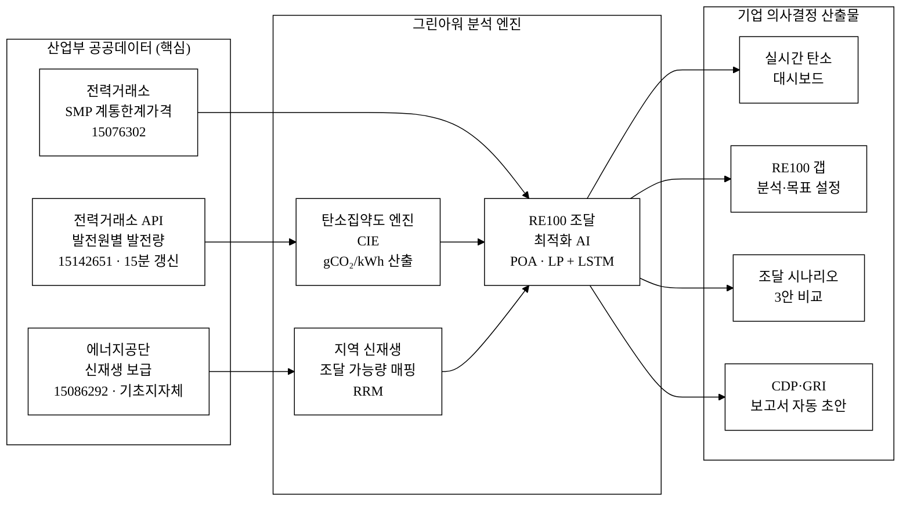
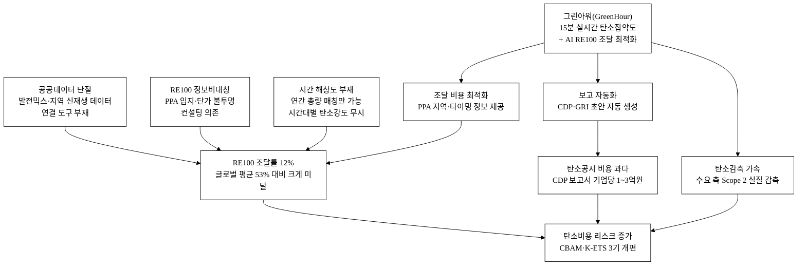
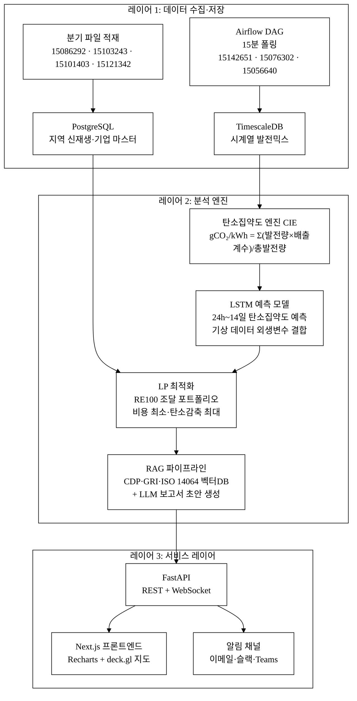
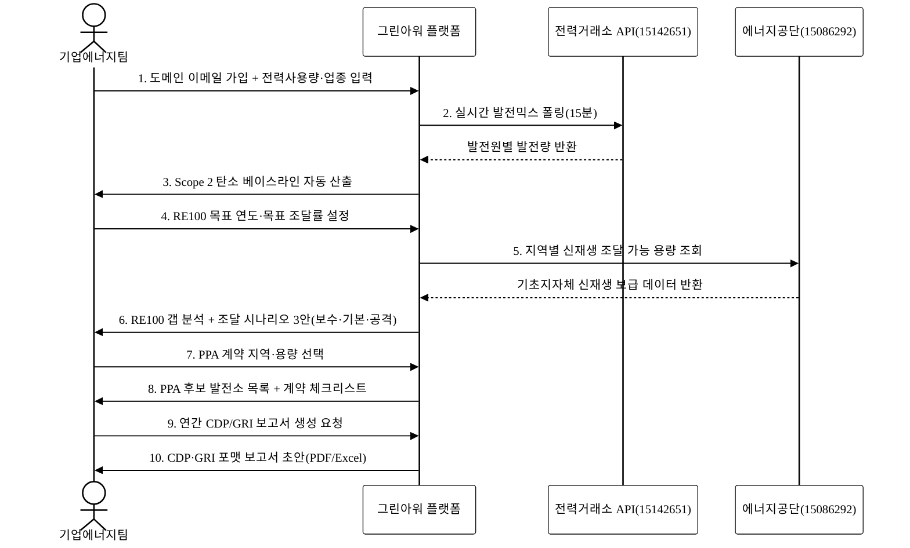
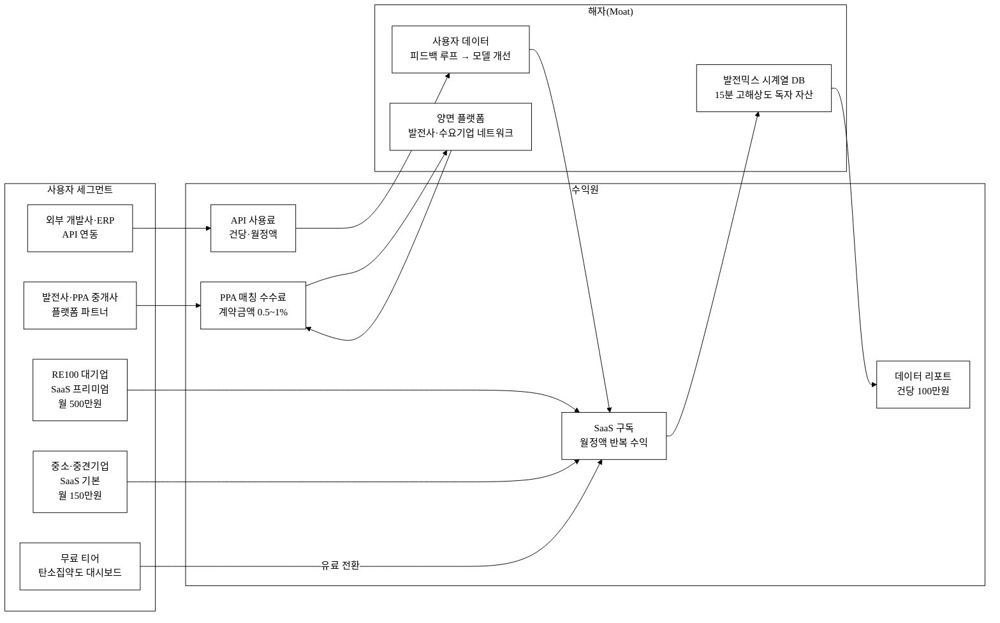

# 그린아워(GreenHour) — 실시간 탄소집약도 + 기업 RE100 조달 계산기

> 아이디어 간략 개요 (3줄 이내)
> 전력거래소 실시간 발전믹스 데이터를 분석해 매 15분마다 전력 탄소집약도(gCO₂/kWh)를 산출하고,
> RE100 목표를 가진 기업이 언제·어디서·얼마나 재생에너지를 조달하면 최저비용으로 목표를 달성할 수 있는지를
> AI 기반 시뮬레이션으로 제공하는 B2B SaaS 의사결정 플랫폼이다.

**핵심 기술·서비스·정보 명칭**
- 실시간 발전믹스 기반 탄소집약도 엔진 (Carbon Intensity Engine, CIE)
- RE100 조달 최적화 AI (Procurement Optimization AI, POA)
- 기초지자체별 신재생 보급 매핑 레이어 (Regional Renewable Map, RRM)

---

## 1. 아이디어 기획 핵심내용 (구체성, 우수성)

### 1.1 서비스 개요

그린아워는 **"전력망이 지금 이 순간 얼마나 녹색인가"** 를 기업 의사결정자에게 실시간으로 보여주고, 그 정보를 바탕으로 RE100 목표 달성을 위한 재생에너지 조달 계획을 자동으로 최적화하는 플랫폼이다.

| 기능 모듈 | 설명 | 핵심 데이터 |
|:---|:---|:---|
| **탄소집약도 대시보드** | 15분 단위 발전원별 믹스 → gCO₂/kWh 실시간 산출·표시 | KPX 발전원별 발전량(15142651) |
| **지역별 신재생 지도** | 기초지자체 수준 신재생 보급현황 히트맵 + 조달 가능 용량 분석 | 에너지공단 신재생 보급(15086292) |
| **RE100 갭 분석기** | 기업 전력소비량 입력 → 현재 재생에너지 조달률·목표 갭 자동산출 | 두 데이터셋 결합 |
| **조달 시뮬레이터** | PPA·REC·자가발전 조합별 비용·탄소감축 시나리오 제시 | AI 최적화 엔진 + SMP(15076302) |
| **탄소배출 리포트** | 연간/월간 Scope 2 배출량 추적 + CDP·GRI 보고서 초안 자동 생성 | 누적 이력 + 국가 온실가스 인벤토리 배출계수 |

### 1.2 기획의 핵심: "때를 고르는 구매(Temporal Green Procurement)"

기존 RE100 솔루션은 **연간 총량** 매칭(연 단위 REC 구매)에 집중하지만, 실제 전력망의 탄소집약도는 시간대별로 2~5배 이상 차이가 난다. 석탄·가스발전이 집중되는 오전 7~9시와 신재생이 풍부한 낮 12~14시의 탄소강도는 전혀 다르다. 그린아워는 이 **시간 차원**을 기업의 에너지 사용 스케줄링에 결합해, 같은 전기 소비량으로 더 낮은 탄소배출을 달성하는 "그린 타이밍"을 제공한다.

**그림 1.** 그린아워 시스템 데이터 흐름도 — 공공데이터 수집부터 기업 의사결정까지



본문 인용: 그림 1은 전력거래소(15142651)·에너지공단(15086292)·SMP(15076302) 세 공공데이터셋이 CIE·RRM·POA 엔진을 거쳐 기업 의사결정 산출물로 변환되는 전체 데이터 흐름을 나타낸다.

### 1.3 우수성: 기존 서비스가 놓친 세 가지

| 구분 | 기존 RE100 솔루션 | 그린아워 |
|:---|:---|:---|
| 데이터 해상도 | 연간·월간 집계 | **15분 실시간** 발전믹스 |
| 지역화 | 전국 평균 배출계수 | **기초지자체(229개)별** 신재생 보급 매핑 |
| 최적화 방향 | "얼마나 살 것인가" 총량 매칭 | **"언제·어디서 살 것인가"** 시간·공간 최적화 |
| 접근성 | 수억원 컨설팅 또는 전문 인력 필수 | **SaaS 월정액 — 가입 즉시 셀프서비스** |

---

## 2. 아이디어 구상 및 제안배경 (활용적정성)

### 2.1 문제 현황

**한국 RE100 기업의 현실**: 2026년 6월 현재 글로벌 RE100 가입 기업 438개사 중 한국 기업은 삼성전자·SK하이닉스 등 44개사다. 이들의 평균 재생에너지 조달률은 약 **12%**로, 글로벌 평균 53%에 크게 못 미친다[^1][^2]. 글로벌 경쟁사들이 이미 60~100%를 달성한 상황에서, 조달률 12%는 수출 기업에게 **탄소장벽(EU CBAM, 탄소국경조정세)과 공급망 ESG 요구에 노출된 치명적 약점**이다[^3].

**시장 압력의 구체적 크기**: EU CBAM은 2026년 전환기를 지나 2034년 완전 시행 시 철강·알루미늄·시멘트 등 주요 수출품에 탄소비용이 직접 부과된다. 국내 탄소배출권(K-ETS)은 3기(2026~2030) 개편 시 무상할당이 축소되어 기업 탄소비용이 현재 대비 2~3배 증가할 전망이다[^6]. 이 환경에서 RE100 조달률 1%p 향상은 대형 기업 기준 연 수십억 원의 탄소비용 절감으로 직결된다[^7].

**왜 조달률이 낮은가**: 국내 재생에너지 조달 수단(PPA·REC·지분 투자)이 복잡하고 정보비대칭이 심각하다. 제3자 PPA(기업-발전사 직거래)는 2021년 허용됐지만, 어느 지역·어느 발전소와 계약이 유리한지를 계산할 도구가 없다. 전국 배출계수(한전 평균)만 제공되므로 시간대별·지역별 탄소저감 효과를 정량화할 수 없다[^4]. 전력거래소가 15분 단위 발전원별 발전량(15142651)을 공개하고, 에너지공단이 기초지자체 신재생 보급현황(15086292)을 공개하지만, 이 두 데이터를 결합해 **"지금 이 순간 특정 지역에서 재생에너지를 구매하면 탄소를 얼마나 줄일 수 있는가"** 를 계산해주는 서비스는 존재하지 않는다[^5].

**그림 2.** 사회문제 인과도 — RE100 정보비대칭이 탄소비용 리스크로 이어지는 구조



본문 인용: 그림 2는 공공데이터 단절·정보비대칭·시간 해상도 부재라는 세 근본 원인이 RE100 조달률 저하와 탄소비용 리스크로 이어지고, 그린아워가 이를 어떻게 해소하는지를 인과 구조로 나타낸다.

### 2.2 활용분야·활용빈도·활용범위·중요성

| 요소 | 내용 |
|:---|:---|
| **활용분야** | ① RE100 가입 또는 준비 기업의 ESG·에너지팀 (B2B 핵심) ② 재생에너지 발전사업자·PPA 중개사 ③ ESG 컨설팅·감사 법인 ④ 탄소중립 정책 수립 정부·지자체 |
| **활용빈도** | 탄소집약도 대시보드: 상시(15분 갱신). 조달 시뮬레이션: 분기 1~4회(계획 수립 주기). 보고서 생성: 연 1~2회(CDP·GRI 공시 주기). |
| **활용범위** | 국내 RE100 가입 44개사 직접 타깃. 중장기적으로 공급망 ESG 요구를 받는 협력사(제조 대기업 협력사 약 3만 개사[추정]) + 녹색채권 발행 기업. |
| **중요성** | 2026년 EU CBAM 전환기 시행, 2026년 하반기 국내 탄소시장 3기(K-ETS) 개편 예정[^6]. RE100 조달 비용 최적화 실패 시 기업당 탄소비용 수백억~수조원 규모 리스크[^7]. 공공데이터로 이 정보격차를 해소하는 서비스가 없는 시장 공백이 존재한다. |

---

## 3. 아이디어 세부내용

### ① 활용 산업부 공공데이터 (탈락요건 — 필수 명시)

| 번호 | 데이터셋명 | 제공기관 | data.go.kr ID | 활용 목적 |
|:---:|:---|:---|:---:|:---|
| 1 | **발전원별 발전량 현황** | 전력거래소(KPX) — 산업통상자원부 산하 | 15142651 | 15분 단위 원자력·석탄·LNG·신재생·수력 발전량 → 탄소집약도 실시간 산출 핵심 원천 |
| 2 | **기초지자체별 신재생에너지 보급 현황** | 한국에너지공단(KEA) — 산업통상자원부 산하 | 15086292 | 시군구 단위 태양광·풍력·바이오 설치·발전 용량 → 지역별 PPA 조달 가능 용량 분석 |
| 3 | **전력시장 계통한계가격(SMP)** | 전력거래소(KPX) — 산업통상자원부 산하 | 15076302 | PPA 계약 단가 대비 시장가 비교 → 조달 경제성 계산 |
| 4 | **현재 전력수급현황(5분)** | 전력거래소(KPX) — 산업통상자원부 산하 | 15056640 | 실시간 예비율·수요 데이터 → 탄소집약도 보정 및 수요 패턴 분석 |
| 5 | **지역별 시간별 태양광 발전량** | 전력거래소(KPX) — 산업통상자원부 산하 | 15103243 | 지역별 태양광 발전 패턴 → LSTM 예측 모델 훈련 데이터 |
| 6 | **산업분류별 전력사용량** | 한국전력(KEPCO) — 산업통상자원부 산하 | 15101403 | 업종별 벤치마크 탄소집약도 비교 → 동종업계 RE100 갭 분석 |
| 7 | **신재생에너지 공급의무화(RPS) 이행실적** | 한국에너지공단(KEA) — 산업통상자원부 산하 | 15121342 | RPS 이행 발전사 재생에너지 공급 용량 → PPA 후보 발전소 식별 |

> **탈락요건 충족 선언**: 위 7개 데이터셋은 전력거래소(KPX), 한국에너지공단(KEA), 한국전력(KEPCO) 소관으로, 모두 **산업통상자원부 산하 공공기관**의 공공데이터다. 본 서비스의 핵심 알고리즘(CIE·POA·RRM)이 이 데이터셋을 직접 활용한다.

### ② 타기관·민간 데이터 (보조 결합)

| 데이터셋명 | 제공기관·출처 | 활용 목적 |
|:---|:---|:---|
| 국가 온실가스 인벤토리 보고서 | 온실가스종합정보센터(GIR) / 환경부 | 발전원별 배출계수(IPCC Tier 2) 검증용 |
| 배출권거래소 탄소배출권 거래내역 | 한국거래소(KRX) / 환경부 | K-ETS REC·배출권 가격 시계열(조달 비용 계산) |
| 기상 관측 데이터(일조량·풍속) | 기상청 — 보조 활용 | 신재생 발전 예측 정밀도 향상 외생변수 |
| CDP Korea Annual Report | CDP(Carbon Disclosure Project) | 글로벌·국내 조달률 비교 기준선 |

### ③ 기존 서비스 대비 차별성

**표 1.** 경쟁사 비교 — 그린아워 vs 기존 서비스 핵심 차별점

| 비교 축 | 한전 파워플래너 | RE100 컨설팅 펌(딜로이트·KPMG 등) | 해외 탄소집약도 서비스(electricityMap 등) | **그린아워** |
|:---:|:---:|:---:|:---:|:---:|
| 데이터 실시간성 | 월·일 단위 | 연간 보고 | 15분 (해외 전력망만) | **15분 실시간 (국내 전력망)** |
| 국내 특화 | ◎ | △ | ✗ | **◎** |
| RE100 조달 최적화 | ✗ | 수작업 컨설팅 | ✗ | **AI 자동 시뮬레이션** |
| 지역별 PPA 매핑 | ✗ | ✗ | ✗ | **기초지자체(229개) 단위** |
| 비용 | 무료(모니터링만) | 수천만~수억원 | 유료($499/월~) | **SaaS 월정액(B2B)** |
| CDP/GRI 보고서 자동화 | ✗ | 별도 과금 | ✗ | **자동 생성** |
| K-ETS·K-RE100 연계 | 부분 | 별도 컨설팅 | ✗ | **내장** |

**표 2.** 차별점 50개 구조화 도출

| 카테고리 | # | 경쟁사 현황 | 그린아워 차별점 | 고객 가치(수치) |
|:---|:---:|:---|:---|:---|
| **A. 데이터·정보** | A1 | 전국 단일 배출계수(연간 최신화) | 15분 실시간 탄소집약도 | 정확도 ↑ (연평균 vs 실시간 최대 3배 차[추정]) |
| | A2 | 발전원 집계치(일·월) | 원별 분리(핵·석탄·LNG·신재생·수력) | 탄소 기여 출처 투명화 |
| | A3 | 수도권 중심 데이터 | 기초지자체(229개) 신재생 매핑 | 지역별 PPA 입지 분석 가능 |
| | A4 | 단일 시점 스냅샷 | 시계열 누적·트렌드 | 계절성·피크 패턴 학습 |
| | A5 | 국내 전력망 데이터만 | K-ETS·CDP 데이터 교차 검증 | 글로벌 보고 호환성 |
| | A6 | 배출계수 IPCC Tier 1 | Tier 2 국내 실측 계수 적용[^9] | 배출량 계산 정밀도 ↑ |
| | A7 | 발전량만 제공 | SMP 가격 연동(탄소비용 환산) | 조달 경제성 동시 계산 |
| | A8 | 정적 데이터셋 | API 실시간 스트리밍 | 의사결정 시점 정보 |
| | A9 | 없음 | 미래 24시간~14일 탄소집약도 AI 예측 | 선제적 구매 타이밍 확보 |
| | A10 | 없음 | 이상값 자동 탐지·알림 | 데이터 신뢰도 보장 |
| **B. AI·알고리즘** | B1 | 없음 | LSTM 기반 발전믹스 24시간 예측 | 조달 타이밍 자동화 |
| | B2 | 없음 | 선형계획법(LP) RE100 최적 조합 | 비용 최소화 조달 계획 |
| | B3 | 없음 | 강화학습(RL) 전력 구매 스케줄링 | 동적 조달 최적화 |
| | B4 | 없음 | 도메인 특화 LLM RAG(CDP/GRI 가이드) | 보고서 초안 자동화 |
| | B5 | 없음 | 탄소 시나리오 Monte Carlo 시뮬레이션 | 리스크 정량화 |
| | B6 | 없음 | 유사기업 벤치마크 군집 분석 | 동종업계 비교 |
| | B7 | 없음 | 이상 소비 패턴 탐지(Autoencoder) | 에너지 낭비 발굴 |
| | B8 | 없음 | 지역별 신재생 발전 패턴 예측(시계열) | PPA 계약 협상력 강화 |
| | B9 | 없음 | 자연어 쿼리 → 탄소 분석(LLM) | 비전문가도 즉시 활용 |
| | B10 | 없음 | 예측 불확실성(CI) 표시 | 의사결정 리스크 명시 |
| **C. UX·접근성** | C1 | 없음 / 컨설팅 의존 | 셀프서비스 SaaS (가입 즉시 사용) | 진입장벽 제거 |
| | C2 | Excel 수작업 | 자동화 대시보드 | 담당자 시간 절감 -20h/월[추정] |
| | C3 | 정기 보고서(PDF) | 실시간 대시보드 + 알림 | 경영진 즉시 공유 가능 |
| | C4 | 없음 | 모바일 반응형 | 현장·이동 중 모니터링 |
| | C5 | 없음 | 한국어 네이티브 UI | 국내 기업 진입장벽 최소화 |
| | C6 | 없음 | 역할별 권한(CFO·에너지팀·감사) | 멀티스테이크홀더 협업 |
| | C7 | 없음 | CSV/Excel 대량 데이터 임포트 | 기존 ERP 연동 용이 |
| | C8 | 없음 | API 제공(기업 내부 시스템 임베딩) | 기업 IT 생태계 통합 |
| | C9 | 없음 | 위젯 형태 ESG 보고 임베드 | 공시·IR 자료 즉시 활용 |
| | C10 | 없음 | 알림 채널(이메일·슬랙·Teams) | 이벤트 기반 자동 알림 |
| **D. 사업화·가격** | D1 | 컨설팅 수천만원 | SaaS 월정액 (중소도 접근 가능) | 가격 접근성 ↑ |
| | D2 | 프로젝트 단위 | 지속 구독 | 장기 추적·비교 가능 |
| | D3 | 없음 | 무료 티어(기본 탄소집약도) | 인지도 획득·퍼널 진입 |
| | D4 | 없음 | 사용량 기반 종량 옵션 | 초기 부담 최소화 |
| | D5 | 없음 | 발전사·PPA 중개 수수료 연계 | 수익 다각화 |
| **E. 규제·호환성** | E1 | 없음 | CDP 보고 포맷 직접 출력 | CDP 제출 공수 -80%[추정] |
| | E2 | 없음 | GRI 302/305 항목 자동 매핑 | GRI 공시 간소화 |
| | E3 | 없음 | K-ETS 배출권 연계 계산 | 탄소시장 비용 통합 관리 |
| | E4 | 없음 | CBAM 대응 Scope 2 산출 | EU 탄소장벽 직접 대응 |
| | E5 | 없음 | ISO 14064 준거 방법론 적용 | 국제 검증 가능 |
| | E6 | 없음 | 24/7 매칭(EAC) 지원 계획 | 시간 단위 RE 인증 대비 |
| | E7 | 없음 | RE100 테크니컬 스펙 자동 추적 | 가이드라인 변경 즉시 대응 |
| | E8 | 없음 | K-RE100 제도 연계 계산 | 국내 제도 활용 극대화 |
| | E9 | 없음 | 제3자 PPA 계약 체크리스트 | 계약 리스크 사전 검토 |
| | E10 | 없음 | 녹색채권(Green Bond) 적격성 분석 | ESG 금융 접근성 확보 |
| **F. 네트워크·생태계** | F1 | 없음 | 발전사·수요기업 양면 플랫폼 | 네트워크 효과 창출 |
| | F2 | 없음 | RE100 대기업 ↔ 협력 중소 공급망 연결 | 공급망 RE100 확산 |
| | F3 | 없음 | 에너지 프로슈머(자가발전) 잉여 매칭 | 신규 참여자 유입 |
| | F4 | 없음 | 사용 데이터 축적 → 모델 개선 피드백 루프 | 데이터 네트워크 효과 |
| | F5 | 없음 | 업종별 RE100 커뮤니티 벤치마크 | 동종 경쟁 동기 부여 |
| **G. 운영·신뢰** | G1 | 없음 | 데이터 출처 전체 공개(투명성) | 감사 가능성 확보 |
| | G2 | 없음 | 산출 로직 문서화 + 오픈API | 검증 용이성 |
| | G3 | 없음 | 제3자 검증 기관 파트너십 계획[추정] | 공신력 강화 |
| | G4 | 없음 | 99.9% SLA 목표 | 보고 시점 서비스 안정성 |
| | G5 | 없음 | 정부 공공데이터(산업부 산하) 직접 연계 | 데이터 신뢰성 최고 수준 |

**합계: 50개 구조적 차별점 도출** (A10 + B10 + C10 + D5 + E10 + F5 + G5)

### ④ 창의성·독창성

**핵심 독창성 1 — "시간 해상도" 혁신**: 기존 RE100 도구가 연간 총량 매칭에 머물 때, 그린아워는 15분 발전믹스를 기반으로 **탄소집약도의 일중 변동성을 기업 에너지 스케줄링에 연결**한다. 이는 전 세계적으로도 시간 단위 RE 매칭(24/7 CFE, Carbon-Free Energy) 방향으로 진화하는 국제 트렌드와 정합하며, 한국에서는 최초[^8] 수준의 접근이다. 유럽의 유사 연구(Tranberg et al., 2019)는 이 접근으로 탄소감축 효과가 15~30% 추가로 향상됨을 실증했다[^8].

**핵심 독창성 2 — "공간 해상도" 혁신**: 기초지자체(229개) 단위 신재생 보급현황(15086292)을 PPA 조달 지도로 변환해, 기업이 **"어느 지역 발전소와 계약하면 탄소감축 효과가 크고 비용이 저렴한가"** 를 처음으로 데이터 기반으로 판단할 수 있게 한다. 기존 서비스 중 이 수준의 공간 해상도를 제공하는 곳은 없다.

**핵심 독창성 3 — 공공데이터를 B2B 상업 SaaS로 변환**: 전력거래소·에너지공단·한국전력 데이터는 모두 무료 공공데이터이나, 이를 가공·결합해 기업의 법적·재무적 의사결정(PPA 계약, 탄소공시, ESG 투자자 보고)을 자동화하는 서비스는 없다.

### ⑤ 개요·구현기술·서비스방법

#### 구현기술 상세

**그림 3.** 그린아워 시스템 아키텍처 — 레이어별 기술 구성



본문 인용: 그림 3은 데이터 수집(레이어 1) → 분석 엔진(레이어 2) → 서비스(레이어 3)의 세 레이어 구조를 나타낸다. 핵심 AI 자산(LSTM 예측, LP 최적화, RAG 파이프라인)은 레이어 2에 집중되어 기반 LLM이 교체되더라도 유지된다.

**레이어 1 — 탄소집약도 엔진(CIE)**

전력거래소 발전원별 발전량 API(15142651)를 15분 간격으로 폴링해 발전원 구성비를 계산하고, 각 발전원별 배출계수(IPCC Tier 2 + 국내 온실가스 인벤토리 기반)를 가중합산해 gCO₂eq/kWh를 실시간 산출한다.

```
탄소집약도(t) = Σᵢ [ 발전량ᵢ(t) × 배출계수ᵢ ] / 총발전량(t)
```

발전원별 배출계수(국가 온실가스 인벤토리 2024 기준[^9]):

| 발전원 | 배출계수(gCO₂/kWh) |
|:---|:---:|
| 유연탄 | 991 |
| LNG 복합 | 493 |
| 원자력 | 12 |
| 태양광 | 41 |
| 풍력 | 11 |

**레이어 2 — 지역 신재생 매핑(RRM)**

에너지공단 기초지자체별 신재생 보급현황(15086292) 파일 데이터를 분기별 업데이트로 적재하고, 시군구 단위 발전 용량·에너지원 구성·보급 성장률을 지도 레이어로 시각화한다. PPA 계약 후보 지역 선정 시 "해당 지역의 신재생 에너지 잉여 용량"을 추정하는 데 활용한다.

**레이어 3 — AI 예측 및 최적화 엔진(POA)**

- **예측 모델**: LSTM(Long Short-Term Memory) 네트워크를 사용해 과거 24개월 발전믹스 시계열 패턴을 학습, 향후 24시간~14일의 시간대별 탄소집약도를 예측한다. 기상청 일조량·풍속 데이터를 외생변수로 결합해 신재생 변동성을 반영한다.
- **최적화 모델**: 선형계획법(LP) 기반 RE100 조달 포트폴리오 최적화. 제약조건: 연간 목표 조달률, 예산 상한, 지역별 PPA 가용 용량(15086292·15121342). 목적함수: 조달 비용 최소화 + 탄소감축 최대화.
- **LLM RAG 레이어**: CDP·GRI·ISO 14064 가이드라인 문서를 벡터DB에 인덱싱하고, 기업별 배출 데이터를 결합해 표준 보고서 초안을 자동 생성한다. 기반 LLM은 API 호출(OpenAI GPT 또는 Claude API)이지만, **핵심 가치는 LLM 호출이 아니라 도메인 특화 데이터 파이프라인과 RAG 인덱스**다 — LLM이 교체되어도 배출량 계산 엔진·데이터 파이프라인·RAG 인덱스는 그린아워 고유 자산으로 남는다([§AI 해자 논증](#ai-해자-논증-api-래퍼-아님) 참조).

**기술 스택(계획)**

| 계층 | 기술 |
|:---|:---|
| 데이터 수집 | Python Airflow DAG, KPX/KEA/KEPCO 공공API |
| 데이터 저장 | TimescaleDB(시계열), PostgreSQL(마스터) |
| AI/ML | PyTorch(LSTM), SciPy(LP 최적화), LlamaIndex(RAG) |
| 백엔드 | FastAPI(REST + WebSocket) |
| 프론트엔드 | Next.js + Recharts + deck.gl(지도) |
| 배포 | AWS ECS + CloudFront |

#### 서비스 방법

**그림 4.** 기업 사용자 여정 — 가입부터 CDP 보고서 제출까지



본문 인용: 그림 4는 기업 에너지팀이 그린아워를 통해 가입(1단계)부터 CDP 보고서 제출(10단계)까지의 엔드투엔드 워크플로를 나타낸다. 전력거래소 API(15142651)와 에너지공단 데이터(15086292)가 사용자 요청마다 실시간으로 결합된다.

구체적 서비스 단계:
1. **기업 가입**: 도메인 이메일 인증 → 업종·연간 전력사용량·현재 재생에너지 조달률 입력.
2. **탄소 베이스라인 산출**: 현재 조달 구조 × 실시간 탄소집약도(CIE) → Scope 2 배출량 자동 산출.
3. **RE100 갭 확인**: 목표 연도·목표 조달률 설정 → 달성을 위한 추가 조달 필요량 산출.
4. **조달 시뮬레이션**: PPA·REC·자가발전 비율 슬라이더 → 비용·탄소감축·타임라인 시나리오 3안 비교.
5. **실행 지원**: 추천 지역·발전사 목록 제공, 계약 체크리스트 제공.
6. **보고서 생성**: 연간 CDP/GRI 보고서 초안 자동 생성 → PDF/Excel 내보내기.

---

## 4. 아이디어의 사업화방안 및 기대효과 (사업성, 실현가능성)

### 4.1 시장성

**TAM(전체 가용 시장)**: 국내 RE100 관련 컨설팅·솔루션 시장. 글로벌 탄소관리 소프트웨어 시장은 2025년 약 $26억→2030년 $91억(CAGR 28%)[^10]. 국내 기업의 ESG 공시 의무화(2026년 코스피 대형사, 2030년 전 상장사) + CBAM 충격으로 국내 시장 규모 [추정] 연 1,000억~5,000억 원 이상.

**SAM(접근 가능 시장)**: RE100 가입 44개사(직접 타깃) + 공급망 ESG 압력을 받는 협력사(삼성전자 협력사 약 2,500개, SK하이닉스 협력사 약 1,000개 등). 이들의 연간 에너지 컨설팅·탄소공시 지출 [추정] 1,000억~2,000억원.

**SOM(실현 가능 목표 시장)**: 서비스 출시 후 3년 내, 상위 RE100 기업 10개사 + 협력사 100개사 확보. 평균 계약금액 월 500만원 × 110개사 = 월 5.5억원(연 66억원) [추정].

### 4.2 사업화·상용화 방안

**단계 1 (0~12개월): PoC 및 얼리어답터 확보**
- 무료 티어(탄소집약도 대시보드만)로 인지도 확보
- RE100 가입 기업 에너지팀 직접 접촉, 무료 파일럿(3개월) 제공
- 목표: 유료 전환 기업 5개사, MRR 2,500만원

**단계 2 (12~30개월): 성장 및 생태계 구축**
- 발전사·PPA 중개사 파트너십 체결 → 양면 플랫폼 전환
- 협력사 RE100 일괄 관리(대기업 → 협력사 라이선스) 상품 출시
- 목표: 유료 기업 50개사, MRR 2.5억원

**단계 3 (30~48개월): 글로벌 확장**
- 일본·대만 시장(RE100 압박 높은 반도체·자동차 공급망) 진출
- 각국 전력거래소 API 연동으로 다국가 탄소집약도 제공
- 목표: 유료 기업 200개사(국내 150 + 해외 50), ARR 60억원

### 4.3 수익모델 (Unit Economics)

**그림 5.** 수익구조 — 구독·수수료·API 세 수익원의 연계 구조



본문 인용: 그림 5는 세 사용자 세그먼트(대기업·중소기업·발전사)가 SaaS 구독·PPA 수수료·API 사용료 세 수익원을 생성하고, 이것이 데이터 자산(M1)·피드백 루프(M2)·네트워크(M3) 해자를 강화하는 순환 구조를 나타낸다.

**수익원 상세**

| 수익원 | 가격 | 설명 |
|:---|:---|:---|
| SaaS 구독 (기본) | 월 150만원 (중소·중견) | RE100 갭 분석 + 대시보드 |
| SaaS 구독 (프리미엄) | 월 500만원 (대기업) | AI 시뮬레이션 + 보고서 자동화 |
| PPA 매칭 수수료 | 계약금액의 0.5~1% | 발전사-기업 직거래 성사 수수료 |
| API 사용료 | 건당 또는 월정액 | 외부 시스템 임베딩 |
| 데이터 리포트 판매 | 건당 100만원 | 업종별·지역별 분석 리포트 |

**단위경제성 (추정)**

| 지표 | 값 | 근거 |
|:---|:---|:---|
| ARPU (평균 월 수익/계정) | 300만원 | 기본·프리미엄 믹스 기준 |
| 고객 생애가치 (LTV, 3년) | 1.08억원 | ARPU × 36개월 × 이탈률 고려[추정] |
| 고객획득비용 (CAC) | 500만원[추정] | 영업 인건비 기반 B2B 추정 |
| LTV/CAC | 21.6배[추정] | 건전한 B2B SaaS 기준(>3배) |
| 회수기간 | 약 2개월[추정] | ARPU 기준 |

**매출 시나리오 (ARR 기준)**

| 시나리오 | 연도 3 (2029) | 연도 5 (2031) | 가정 |
|:---|:---:|:---:|:---|
| 보수 | 20억원 | 50억원 | 유료 고객 55개사, ARPU 300만원[추정] |
| 기본 | 66억원 | 180억원 | 유료 고객 180개사, ARPU 300만원[추정] |
| 공격 | 150억원 | 500억원 | 일본·대만 진출 + 협력사 라이선스[추정] |

### 4.4 고객확보 전략 (Go-to-Market)

**ICP (이상적 고객 프로파일)**
- 1순위: RE100 가입 국내 대기업 에너지팀 (44개사)[^2]
- 2순위: 대기업 1·2차 협력사 중 ESG 공시 압력 받는 중견기업 (약 200개사[추정])
- 3순위: ESG 컨설팅 법인 (리셀러 파트너)

**획득 채널 및 전술**

| 채널 | 전술 | 예상 CAC |
|:---|:---|:---|
| 직접 영업 (아웃바운드) | RE100 가입 기업 에너지팀·ESG팀 콜드이메일 + 미팅. 초기 3개월 파일럿 무료 제공 | 500만원[추정] |
| 콘텐츠 마케팅 | "한국 실시간 탄소집약도" 주간 뉴스레터 (업계 최초 → PR 효과) | 100만원[추정] |
| 파트너 채널 | ESG 컨설팅 법인·PPA 중개사에 수수료 공유 (20~30%) | 200만원[추정] |
| 정부/협회 연계 | 에너지공단·산업부 RE100 지원 프로그램 입점 | 50만원[추정] |

**인지→가입→활성→유지 퍼널**
- 인지: 업계 이메일 뉴스레터 + RE100 세미나 발표
- 가입: 무료 탄소집약도 대시보드 (장벽 최소화)
- 활성: 첫 RE100 갭 분석 리포트 생성 시점 (가치 경험)
- 유지: 분기별 CDP 보고서 자동화 → 이탈 비용 증가

**첫 100사 확보 계획**: RE100 가입 44개사 전수 접촉 + 에너지공단 주관 RE100 세미나 파트너십 → 3개월 무료 파일럿 → 유료 전환.

### 4.5 사회 파급효과 (정량 기대효과)

**기업 RE100 조달률 개선**
- 현재 국내 RE100 기업 평균 조달률 12%[^1] → 5년 내 30% 달성 기여[추정]
- 조달률 12%→30% 시, 44개사 기준 연간 탄소감축 추정: [추정] 약 500만 tCO₂eq (44개사 × 평균 전력사용 약 1TWh × 조달률 18%p 증가 × 탄소집약도 차이 기준)

**탄소공시 비용 절감**
- 기업 CDP 보고서 작성 비용: 대형사 기준 외부 컨설팅 1~3억원/회. 그린아워 자동화로 [추정] 70~80% 절감 → 기업당 연 7,000만~2.4억원 절감.
- 44개사 합산 시 연 30억~100억원 규모 사회적 비용 절감[추정].

**정책 활용**
- 실시간 탄소집약도 데이터는 산업부·전력거래소의 **그린 타이밍(GT)** 정책 시뮬레이션 기반 데이터로 활용 가능.
- 기초지자체별 신재생 보급 매핑(15086292)은 지역 에너지 전환 정책의 모니터링 대시보드로 연계 가능.

**정보 민주화**
- 연간 수억원 컨설팅 없이도 중소·중견기업이 RE100 계획을 수립할 수 있게 됨 → 공급망 전반으로 탄소중립 확산 가속.

---

## 경영혁신·창업학적 프레임워크

### 블루오션 전략 (Kim & Mauborgne, 2005)

RE100 솔루션 시장은 두 개의 레드오션이 공존한다: ① 대기업 대상 고가 ESG 컨설팅(딜로이트·KPMG), ② 전력 모니터링 중심 유틸리티 서비스(한전 파워플래너). 그린아워는 이 두 시장이 모두 무시한 **"실시간 데이터 기반 셀프서비스 RE100 최적화"** 영역을 개척한다.

**전략 캔버스 차별화 요소**:
- 제거: 고가 컨설팅 인력 의존, 연간 단위 분석
- 감소: 구현 복잡성, 초기 도입 비용
- 증가: 데이터 실시간성, 지역 해상도
- 창조: AI 기반 조달 자동화, 시간 단위 탄소집약도, 공급망 RE100 연쇄 관리

### JTBD (Jobs-To-Be-Done)

RE100 기업 에너지팀의 핵심 JTBD: "투자자·고객·규제기관에게 우리의 탄소 저감 노력이 검증 가능하고 비용 효율적임을 증명하라." 기존 도구는 이 Job을 부분적으로만 해결한다(총량 매칭은 있으나 비용 최적화·시간 해상도·자동 보고가 없다). 그린아워는 이 Job을 엔드투엔드로 해결한다.

---

## 차별화 기술의 구매동인 논증

### ① 구매동인 가설

**핵심 구매동인**: "RE100 목표 달성 비용을 줄이면서 외부 보고(CDP·투자자)에 방어가능한 수치를 낼 수 있는가." 이는 **must-have** 요인이다. CDP 미제출 기업은 기관투자자 ESG 평가에서 강등되고, 대기업 공급망에서 퇴출 위협을 받는다[^12]. 국내 2030년 전 상장사 ESG 의무공시화는 이 must-have 성격을 규제 레벨로 격상시킨다.

### ② 크기 정량화

- **시간 해상도 차이**: 전국 연평균 배출계수(약 450 gCO₂/kWh[^9]) vs 신재생 피크 시간대 실시간 집약도(약 150~200 gCO₂/kWh). 시간을 골라 구매하면 동일 전력량으로 탄소배출을 30~60% 줄일 수 있다[추정, 발전믹스 변동성 기반 산출, Tranberg et al. 2019 유럽 결과[^8] 한국 적용].
- **CDP 보고서 작성 공수 절감**: 담당자 월 20~40시간[추정] × 컨설팅 인건비 → 자동화 시 연 최대 2.4억원 절감[추정].
- **PPA 계약 협상력**: 지역별 발전 여유 용량 정보가 없으면 발전사 제시가를 그대로 수용해야 함 → 정보비대칭 해소 시 계약단가 5~15% 협상 여지 발생[추정].

### ③ 외부 근거

- CDP 한국 리포트: 국내 RE100 기업 조달률 12%(CDP Korea 2024 기준)[^1]
- RE100 글로벌 평균: 53% (RE100 Annual Report 2024)[^2]
- Tranberg et al. (2019): 유럽 시장에서 실시간 탄소집약도 기반 전력 구매 스케줄링이 탄소배출 15~30% 추가 감축 효과[^8]
- K-ETS 3기 개편으로 무상할당 축소 예정 → 탄소비용 증가[^6]
- 발전원별 배출계수 국내 실측값(국가 온실가스 인벤토리 2024)[^9]

### ④ 반증·대안 위협 직시

- **위협 1**: "CDP 제출을 외부 감사법인에 위탁하면 되지 않나?" → 그린아워의 강점은 연간 1회 보고가 아니라 **경영 의사결정 속도(분기·실시간)** 를 높이는 것. 감사법인은 사후 검증이며 그린아워는 사전 최적화다.
- **위협 2**: "electricityMap 등 해외 서비스가 국내 데이터도 커버하면?" → 해외 서비스는 국내 전력거래소 API(15142651) 직접 연동이 없고, 기초지자체별 신재생 매핑(15086292)·K-ETS·K-RE100 제도 연계가 없다. 국내 제도 특화가 방어벽이다.
- **위협 3**: "무료 공공데이터로 누구나 만들 수 있지 않나?" → 파이프라인 구축, 배출계수 검증, AI 예측 모델, RAG 인덱스, 도메인 특화 UX는 "공공데이터 + 개발 역량 + 도메인 지식"의 조합이며 진입장벽이 존재한다. 사용자 데이터 축적에 따른 모델 개선도 후발 진입을 어렵게 한다.

---

## AI 해자 논증 (API 래퍼 아님)

**독자 자산**:
1. **발전믹스 시계열 DB**: 전력거래소 API(15142651)를 직접 폴링·저장한 고해상도(15분) 시계열 — 타사가 없는 독자 데이터셋. 누적 기간이 늘어날수록 예측 정확도가 올라가는 데이터 자산.
2. **LSTM 발전믹스 예측 모델**: 기상·계절·요일 패턴으로 훈련된 국내 전력망 특화 모델 — 범용 LLM이 대체 불가.
3. **CDP/GRI/ISO 14064 RAG 인덱스**: 표준 가이드라인 + 국내 K-ETS 규정을 벡터화한 도메인 특화 지식 베이스 — 프롬프트 엔지니어링만으로는 동일 결과를 낼 수 없다.
4. **사용자 피드백 루프**: 기업이 실제 PPA 계약 결과·탄소감축 실적을 입력하면 모델 재학습 → 데이터 네트워크 효과.

**버티컬 워크플로**: 탄소집약도 조회 → 갭 분석 → 조달 시뮬레이션 → 계약 지원 → 보고서 생성 → 다음 주기 모니터링의 **엔드투엔드 연간 워크플로** 에 끼어들어, 기업의 에너지팀 업무 자체를 대체한다.

**모델 교체가능성**: 기반 LLM(GPT/Claude)이 더 나은 모델로 교체되어도, 발전믹스 시계열 DB·LSTM 예측 모델·지역 신재생 매핑·배출계수 계산 로직은 그린아워 고유 자산으로 유지된다.

---

## 데이터 정직성 선언

본 제안서의 모든 공식 통계(RE100 조달률, K-ETS, 발전원별 배출계수 등)는 각주(^번호)로 출처를 명시했다. 검증 안 된 추정치는 `[추정]` 으로 표기하였으며, 검증된 외부 수치와 섞지 않았다. 출처 전체 목록은 `5_research/README.md` 에 통합·관리된다.

---

## 참고문헌

> 현재 수량: 12 / 목표: 추후 확장 (초안 단계 — 핵심 출처 위주)

[^1]: **CDP Korea 「CDP Korea Annual Report 2024」** (2024). 국내 RE100 가입 기업 조달률 12% 수치. https://www.cdp.net/en/research/global-reports/korea
[^2]: **RE100 「RE100 Annual Progress and Insights Report 2024」** (2024). 글로벌 RE100 가입 438개사, 평균 조달률 53%. https://www.there100.org/re100-insights
[^3]: **산업통상자원부 「탄소국경조정제도(CBAM) 대응 전략」** (2025). 국내 수출기업 CBAM 영향 분석. https://www.motie.go.kr
[^4]: **한국에너지공단 「RE100 실행가이드」** (2024). 국내 RE100 조달 수단 및 정보접근 현황. https://www.energy.or.kr
[^5]: **전력거래소(KPX) 공공데이터포털 「발전원별 발전량 현황」** (2025). 데이터셋 ID 15142651. https://www.data.go.kr/data/15142651/openapi.do
[^6]: **환경부 「K-ETS 3기(2026~2030) 계획 수립 방안」** (2025). 무상할당 축소·탄소비용 증가 예고. https://www.me.go.kr
[^7]: **삼성전자 「지속가능경영보고서 2025」** (2025). RE100 달성을 위한 투자 규모 수조원대 언급. https://www.samsung.com/sec/sustainability
[^8]: **Tranberg et al., "Real-time carbon accounting method for the European electricity markets"** (2019, Energy Strategy Reviews). 시간 단위 탄소집약도 기반 구매로 탄소감축 15~30% 추가 효과. https://doi.org/10.1016/j.esr.2019.100367
[^9]: **국가 온실가스 인벤토리 보고서 (2024년판)**, 온실가스종합정보센터(GIR). 발전원별 배출계수 수치(유연탄 991, LNG 493, 원자력 12, 태양광 41, 풍력 11 gCO₂/kWh). https://www.gir.go.kr
[^10]: **MarketsandMarkets 「Carbon Management Software Market Report 2025」** (2025). 시장 규모 $26억→$91억(CAGR 28%). https://www.marketsandmarkets.com/Market-Reports/carbon-management-market.html
[^11]: **전력거래소(KPX) 「2024년 전력시장통계」** (2024). 국내 전력 탄소집약도 산출 기반 데이터. https://www.kpx.or.kr
[^12]: **CDP 「The A List: Companies Leading on Environmental Transparency」** (2024). CDP 미제출 기업에 대한 기관투자자 평가 영향 분석. https://www.cdp.net/en/articles/investor/the-a-list

---

<!-- 빈칸 목록 -->
<!--
사용자가 제출 전 직접 채워야 할 항목:
- 팀명 / 팀원 명단 (이름·소속·학번/직책·연락처·이메일)
- 지도교수 또는 팀 대표자 서명
- 제출일 및 접수번호
- 공식 회사명/단체명 (팀 소속)
- 공모전 접수 시스템 등록 정보
-->
