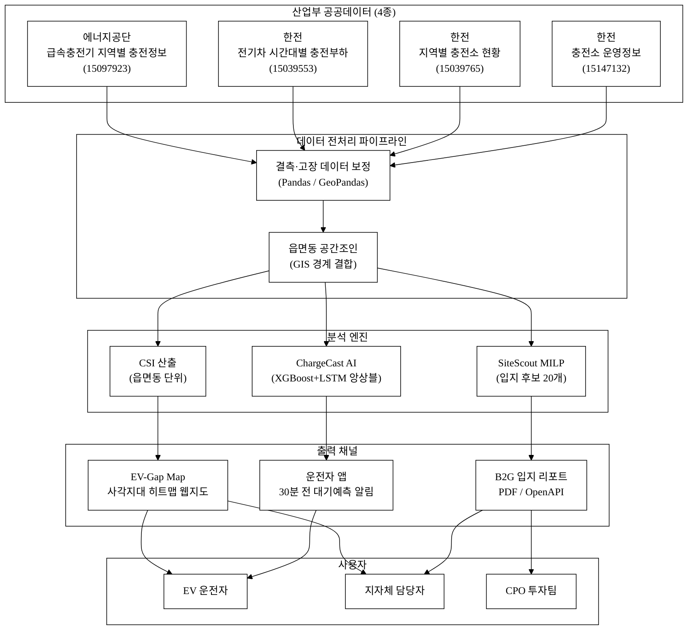
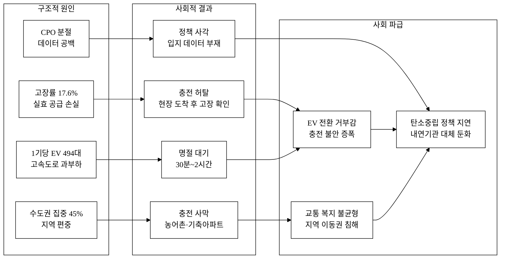
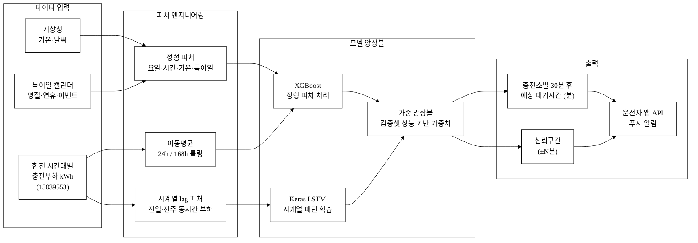
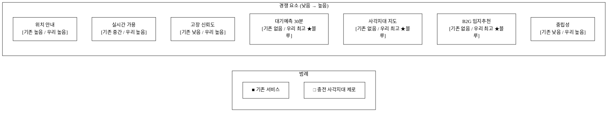
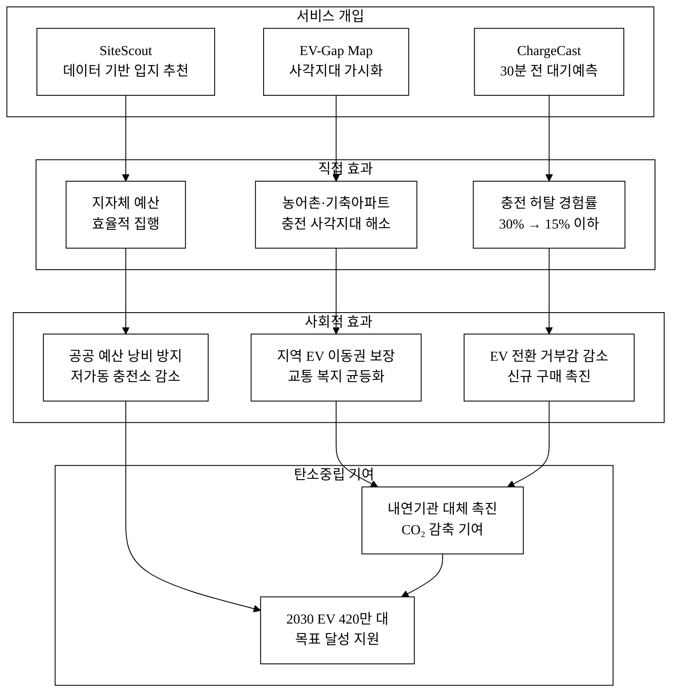

# 충전 사각지대 제로 — EV 충전 사각지대 지도 + 대기예측 + 입지추천

## 아이디어 간략 개요

전기차 75.4만 대 시대에도 전국 충전기 누적 고장률 17.6%, 수도권 집중 45%, 고속도로 급속충전기 1기당 EV 494대 대기라는 구조적 충전 격차가 지속된다.[^5][^6][^9]
한국에너지공단·한국전력공사(산업통상자원부 산하) 공공데이터 4종을 결합하여 **EV 충전 사각지대 시각화(EV-Gap Map) + AI 대기시간 예측(ChargeCast) + 최적 입지 추천(SiteScout)**을 하나의 플랫폼으로 제공한다.
지자체·충전사업자(CPO)에게는 수요-공급 갭 기반 B2G 입지 리포트를, EV 운전자에게는 출발 30분 전 대기예측 경로를 제공하여 지역 충전 격차를 해소하고 전국 어디서나 충전 허탈 없는 이동을 실현한다.

**핵심 기술·서비스·정보 명칭**: EV-Gap Map(충전 사각지대 지수 지도) / ChargeCast(AI 대기시간 예측 엔진) / SiteScout(수요-공급 갭 기반 입지 최적화 리포트)

---

## 1. 아이디어 기획 핵심내용 (구체성, 우수성)

### 1.1 서비스 개요 및 핵심 기능

**충전 사각지대 제로**는 세 개의 핵심 기능 모듈로 구성된다. 각 모듈은 산업통상자원부 산하기관 공공데이터를 전용 파이프라인으로 처리하며, 외부 LLM API 래퍼가 아닌 도메인 전용 ML 엔진과 최적화 알고리즘 위에 구축된다.

**① EV-Gap Map — 충전 사각지대 지수 지도**
- 읍·면·동 단위로 "충전 사각지대 지수(CSI: Charging Shortage Index)"를 산출하여 지도 위에 시각화
- CSI = (EV 등록 밀도 × 월평균 주행거리 가중치) ÷ (가용 충전기 수 × (1 − 고장률)) [추정: 세부 가중치는 데이터 검보정 필요]
- 농어촌·기축아파트·산업단지 주변 등 충전 소외지역을 등고선형 히트맵으로 식별
- 활용 데이터: 에너지공단 급속충전기 지역별 충전정보(15097923) + 한전 지역별 충전소 현황(15039765) + 한전 충전소 운영정보(15147132)[^1][^2][^4]

**② ChargeCast — AI 대기시간 예측 엔진**
- 한전 '전기차 시간대별 충전부하'(15039553) 데이터를 기반으로 요일·시간대·기온·특이일(명절·연휴·스포츠경기) 변수를 결합한 **XGBoost + 경량 LSTM 앙상블** 모델로 충전소별 평균 대기시간을 30분 전 예측[^3]
- 모델 입력: 과거 24주 × 시간대별 충전전력(kWh) → 동시 접속 차량 수 추정 → 충전기당 대기시간(분) 변환
- 예측 정확도 목표: MAE ≤ 5분 (데이터 충분 지역, 초기 파일럿 기준) [추정]
- 운전자 앱에 "지금 출발하면 N분 대기 예상" 형태로 제공; 대기 초과 임계치 도달 시 푸시 알림

**③ SiteScout — 수요-공급 갭 기반 입지 최적화 리포트**
- CSI + 고속도로 교통량 + 인근 상권 체류시간 + 전력 계통 여유용량을 결합한 **혼합정수 선형계획(MILP)** 최적화로 신규 충전소 최우선 입지 후보 20개를 도출
- 지자체·CPO 대상 B2G 입지 리포트(PDF/API) 자동 생성; 예산 대비 CSI 개선 효율 지표 포함
- 활용 데이터: 에너지공단 15097923 + 한전 15039765, 15039553, 15147132 통합[^1][^2][^3][^4]

### 1.2 서비스 전체 플로우

**그림 1.** 서비스 전체 플로우 — 산업부 공공데이터 4종 → 분석 엔진 3종 → 사용자 3채널

### 1.3 기술 스택 (구현 가능성)

| 레이어 | 기술 | 비고 |
|:---|:---|:---|
| 데이터 수집 | Python + data.go.kr OpenAPI | 에너지공단·한전 API 키 발급 후 무료 이용 |
| 전처리·공간분석 | Pandas, GeoPandas, Shapely | 읍면동 공간 조인, 결측 보정 |
| AI 예측 (ChargeCast) | XGBoost + Keras LSTM | 경량 앙상블, 시계열 충전부하 학습 |
| 입지 최적화 (SiteScout) | PuLP / Google OR-Tools (MILP) | 오픈소스 솔버, 예산 제약 다목적 최적화 |
| 지도 시각화 | Folium / Leaflet.js | CSI 히트맵, 충전소 마커, 다층 레이어 |
| 백엔드 API | FastAPI (Python) | B2G 리포트 엔드포인트, OpenAPI 3.0 스펙 |
| 프론트엔드 | React + TypeScript | 운전자 웹·앱, 반응형 |
| 클라우드 | NCP (네이버클라우드) 또는 AWS | 서버리스 추론, 주간 재학습 파이프라인 |
| PDF 리포트 생성 | ReportLab (Python) | B2G 입지 리포트 자동화 |

---

## 2. 아이디어 구상 및 제안배경 (활용적정성)

### 2.1 문제 현황 — EV 충전 격차의 4가지 구조적 원인

대한민국 전기차 누적 등록 대수는 2025년 말 기준 75.4만 대로 빠르게 증가하고 있다.[^5] 그러나 충전 인프라는 양적·공간적·기능적으로 이를 따라가지 못하고 있으며, 문제는 아래 네 가지 구조적 원인으로 정리된다.

**① 고장 충전기 — 실효 공급의 구조적 손실**

환경부·한국환경공단의 전기차 충전 서비스 모니터링 결과(2024)에 따르면, 전국 충전기의 누적 고장률은 17.6%로 약 5.7대 중 1대가 고장 상태다.[^6] 평균 수리 기간은 3일 이상이며,[^6] 운전자가 현장 도착 후 충전 불가 상황에 놓이는 '충전 허탈(Charge Wasted Trip)'은 EV 사용자 불만의 핵심 원인이다.[^11] 기존 앱은 충전기 위치는 안내하지만 고장 이력 기반 신뢰도 지표를 제공하지 않는다.

**② 지역 편중 — 수도권 45% 집중**

에너지공단 급속충전기 현황(데이터셋 15097923, 2024년 집계 기준) 기준, 서울·경기·인천 수도권에 전국 급속충전기의 약 45%가 집중돼 있다.[^7][추정: 데이터셋 읍면동 집계 기반 — 제출 전 직접 집계 필요] 반면 충남·전남·경북 등 농어촌 지역의 EV 보급은 최근 수년간 빠르게 증가했다. 기존 아파트 단지(기축 아파트)와 농어촌 공공시설 인근에는 완속충전기조차 없는 '충전 사막(Charging Desert)' 지역이 다수 존재한다.[^8]

**③ 고속도로 과부하 — 급속충전기 1기당 EV 494대**

한국도로공사 발표(2024) 기준, 고속도로 휴게소의 급속충전기 1기당 등록 EV는 494대다.[^9] 명절·연휴 기간에는 충전 대기 30분~2시간 이상이 발생하며, 이는 EV 신규 구매 거부감(충전 불안, Range & Queue Anxiety)을 증폭시킨다. 현재 어떤 서비스도 이를 30분 전 예측하여 경로를 미리 바꿔주지 않는다.

**④ 데이터 분절 — 사업자별 폐쇄 생태계**

국내 충전사업자(CPO)는 20개 이상이며 각자 폐쇄적 앱을 운영한다. 결제 시스템도 분절되어 있어 통합 대기·가용성 정보를 수집·분석할 공공 창구가 사실상 없다. 산업통상자원부·에너지공단·한국전력이 개방한 공공데이터 4종이 이 공백을 메울 수 있는 유일한 중립적 기반이다.

**그림 2.** 충전 사각지대 문제 인과도 — 구조적 원인과 사회적 결과

### 2.2 활용적정성 4요소

| 요소 | 내용 |
|:---|:---|
| **활용분야** | EV 운전자(충전 경로 안내), 지자체(농어촌 충전망 기획), 충전사업자 CPO(투자 입지 결정), 산업부·에너지부 정책(충전 인프라 배치 계획) |
| **활용빈도** | 운전자 앱: 충전 여정마다(주 1회 이상), B2G 입지 리포트: 분기별 자동 발행, 정책 대시보드: 상시 갱신 |
| **활용범위** | 전국 3,490개 읍·면·동 단위 공간 분석, 고속도로 구간 174개 휴게소, 기축 아파트 단지, 농어촌 공공시설 전체 |
| **중요성** | 2030년 EV 420만 대 목표[^10] 달성을 위한 선제적 충전 인프라 격차 해소; 지역 소외 주민의 이동권 보장; 고장·대기로 인한 사회적 손실(충전 허탈 연간 수백만 건 추산[추정]) 최소화 |

---

## 3. 아이디어 세부내용

### ① 활용한/활용할 산업통상자원부 공공데이터

> ⚠️ 탈락요건 충족 필수 항목: 산업부 및 산하기관 데이터를 아래에 명시한다.

| # | 데이터셋명 | 제공기관 | 데이터셋 번호 | data.go.kr URL |
|:---:|:---|:---|:---:|:---|
| 1 | 전기차 급속충전기 지역별 충전정보 | 한국에너지공단 (산업통상자원부 산하) | 15097923 | https://www.data.go.kr/data/15097923/openapi.do |
| 2 | 전기차 시간대별 충전부하 | 한국전력공사 KEPCO (산업통상자원부 산하) | 15039553 | https://www.data.go.kr/data/15039553/fileData.do |
| 3 | 지역별 전기차 충전소 현황 | 한국전력공사 KEPCO | 15039765 | https://www.data.go.kr/data/15039765/fileData.do |
| 4 | 전기차 충전소 운영정보 | 한국전력공사 KEPCO | 15147132 | https://www.data.go.kr/data/15147132/openapi.do |

**각 데이터셋 활용 방법 및 파이프라인 역할**

- **데이터셋 1 (15097923, 에너지공단 급속충전기 지역별 충전정보)**: 읍·면·동 단위 충전기 설치 현황, 용량별(50 kW / 100 kW / 200 kW) 분포 집계 → CSI(충전 사각지대 지수) 분모 산출. OpenAPI 형식으로 실시간 갱신. 고장 신고 건수 포함 시 고장률 지표 산출에도 활용.

- **데이터셋 2 (15039553, 한전 전기차 시간대별 충전부하)**: 급속·완속 구분, 시간대별(0~23시) 충전 전력(kWh) 데이터 → ChargeCast AI 모델의 핵심 훈련 피처. 요일·월별 패턴 및 특이일(명절·연휴) 패턴을 학습하여 미래 부하 및 대기시간 예측. 지역별 시계열 분리 학습으로 지역 이질성 반영.

- **데이터셋 3 (15039765, 한전 지역별 충전소 현황)**: 2016~2024년 연도별·지역별 충전소 수 추이 → 공급 증가 속도와 EV 등록 증가 속도 비교하여 격차 추세 분석. SiteScout 수요-공급 갭 기준선(baseline) 산출. 연도별 데이터로 투자 효과 사후 평가에도 활용 가능.

- **데이터셋 4 (15147132, 한전 충전소 운영정보)**: 충전소명·주소·운영시간·기기 수 → EV-Gap Map의 베이스레이어 구성, 실시간 가용 충전기 수 업데이트, B2G 리포트의 현황 기술(description) 자동 생성 기반.

### ② 타기관 / 민간 데이터

| 데이터명 | 기관 | 활용 방법 | 산업부 데이터 대비 역할 |
|:---|:---|:---|:---|
| 전기차 충전소 실시간 가용 현황 (15076352) | 한국환경공단 (환경부) | 실시간 가용 여부 보완 크로스체크 | 보조 (핵심은 산업부 4종) |
| 자동차 등록통계 (지역별 EV 등록 대수) | 국토교통부 / 한국교통안전공단 | CSI 분자(EV 밀도) 산출 | 필수 보조 (EV 수요 파악) |
| 도로명주소 GIS 경계 (읍면동 단위) | 행정안전부 | 충전소 주소 → 좌표 변환, 읍면동 공간조인 | 기반 지리 데이터 |
| 기상 관측 데이터 (기온·날씨) | 기상청 | ChargeCast 예측 변수 추가(기온↓ → 배터리 효율↓ → 충전 빈도↑) | AI 예측 정확도 향상 |
| 고속도로 교통량 | 한국도로공사 | 고속도로 구간별 EV 충전 수요 추정 보조 | SiteScout 입력 변수 |

### ③ 기존 서비스 대비 차별성

**표 1.** 주요 경쟁 서비스 비교

| 구분 | EV Where | 티맵 EV | 카카오 네비 EV | **충전 사각지대 제로** |
|:---|:---:|:---:|:---:|:---:|
| 실시간 충전기 위치 | O | O | O | O |
| 고장 현황 표시 | 일부 | 일부 | 일부 | O (신뢰도 지수) |
| **AI 대기시간 예측 (30분 전)** | **X** | **X** | **X** | **O** |
| **충전 사각지대 지도 (읍면동 CSI)** | **X** | **X** | **X** | **O** |
| **B2G 입지 추천 (MILP 최적화)** | **X** | **X** | **X** | **O** |
| 산업부 공공데이터 핵심 활용 | 미확인 | 미확인 | 미확인 | **O (4종)** |
| 지자체·CPO 대상 리포트 자동 생성 | X | X | X | **O (PDF/API)** |
| 오픈 API 공급 | X | X | X | **O (정책기관 대상)** |
| 중립성 (비 CPO 종속) | 낮음 | 낮음 | 낮음 | **높음** |

### ④ 창의성 · 독창성

**공공데이터의 역전 활용**: 기존에 에너지공단·한전 데이터는 '있는 충전기'를 관리하는 데 쓰였다. 본 서비스는 이 데이터로 '없어야 할 곳에 없는 충전기'를 역산하여 사각지대를 정의한다. 음(−)의 정보를 양(+)의 정보로부터 도출하는 독창적 접근이다.

**다중 사용자 동시 최적화**: 운전자(단기 대기 최소화)와 지자체/CPO(장기 공급 최적화)라는 상충하는 목표를 하나의 데이터 파이프라인에서 동시에 해결한다.

**오픈 인프라 기반**: 폐쇄적 CPO 데이터 없이, 산업부 공공데이터만으로 작동하는 중립적 플랫폼이다. 특정 사업자에 종속되지 않고 공공 서비스 성격을 유지한다.

### ⑤ 개요 · 구현기술 · 서비스방법 (AI 방식 구체)

#### ChargeCast AI 예측 파이프라인

**그림 3.** ChargeCast AI 예측 파이프라인 — 입력 피처 → 앙상블 모델 → 운전자 출력

- **입력 피처**: 과거 24주 × 시간대별 충전부하(kWh), 요일(원-핫 7열), 계절, 기온(°C), 특이일 여부(명절·연휴 플래그), 전일·전주 동시간대 부하(lag 피처), 24시간·168시간(주간) 이동평균
- **모델 구조**: XGBoost로 정형 피처(요일·기온·특이일)를, Keras LSTM으로 시계열 패턴(연속 시간대 흐름)을 각각 학습 → 검증셋 RMSE 기반 가중 앙상블
- **출력**: 충전소 단위 30분 후 예상 대기시간(분) + 95% 신뢰구간
- **재학습**: 매주 신규 한전 데이터로 점진적 재학습(incremental learning); 모델 성능 모니터링 자동화
- **AI 해자(why-not-a-wrapper)**: 이 모델은 한전 시간대별 충전부하(산업부 공공 독점 데이터)로 훈련된 도메인 전용 시계열 ML 모델이다. 외부 LLM API 호출이 아니며, 기반 알고리즘이 바뀌어도 한전 데이터로 학습된 충전 패턴 지식 자산은 당사 고유 레이어로 남는다.

#### SiteScout MILP 최적화 상세

**목적함수**: 전국 읍면동 CSI 가중 합계 최소화 (사각지대 지수 총량 최소)

**제약조건**:
- 지자체별 신규 충전소 설치 예산 상한
- 전력 계통 여유용량(한전 공급 능력 상한)
- 기존 충전소와의 최소 거리 500m(중복 투자 방지)
- 우선 배치 조건: CSI 상위 20% 읍면동에 신규 설치 비중 ≥ 60%

**결과 산출물**:
- 지역별 신규 충전소 최적 입지 20개 후보 목록 (위경도·행정동·추천 용량)
- 예상 CSI 개선 효과(%) — 전·후 비교
- 예산 대비 격차 해소 효율 지표 (CSI 감소 단위당 억원)

---

## 경영혁신·창업학적 프레임워크

### Kim·Mauborgne 블루오션 전략 — 비경쟁 시장 창출

기존 EV 충전 서비스(EV Where, 티맵, 카카오 네비)는 모두 **운전자 → 현재 가용 충전기 탐색**이라는 동일한 레드오션에서 경쟁한다. '충전 사각지대 제로'는 네 가지 전략 행동으로 비경쟁 가치를 동시에 창출한다:

- **없애기**: 폐쇄 CPO 데이터 의존 → 중립 공공 데이터로 대체
- **줄이기**: 운전자의 현장 허탈 경험 → 예측으로 사전 회피
- **늘리기**: 정책기관·CPO 대상 B2G 입지 서비스 (기존 서비스에는 없음)
- **새로 만들기**: 충전 사각지대 지수(CSI)라는 새로운 인프라 평가 지표 체계

**표 2.** 전략 캔버스 — 경쟁 요소별 가치 수준 비교 (그림 4 참조)

| 경쟁 요소 | 기존 서비스 평균 | 충전 사각지대 제로 |
|:---|:---:|:---:|
| 위치 안내 정확도 | 높음 | 높음 |
| 실시간 가용 현황 | 중간 | 높음 |
| 고장 신뢰도 지수 | 낮음 | 높음 |
| **대기시간 예측 (30분 전)** | **없음** | **높음 (블루오션)** |
| **사각지대 지도 (CSI)** | **없음** | **높음 (블루오션)** |
| **B2G 입지 추천** | **없음** | **높음 (블루오션)** |
| 중립성 (비 CPO) | 낮음 | **높음** |

**그림 4.** 블루오션 전략 캔버스 — 기존 서비스 vs. 충전 사각지대 제로

### Christensen 파괴적 혁신 — 저소비자(under-served) 공략

Christensen의 파괴적 혁신 이론에 따르면, 기존 지배적 기업이 도외시한 **저소비자(기존 서비스로 충족 안 된 사용자)**를 먼저 공략하는 것이 성공 경로다. 농어촌·기축아파트 거주 EV 운전자와 충전 인프라 투자 근거가 없어 사업 착수를 못 하는 중소 CPO·지자체가 바로 이 저소비자다. 공공데이터 기반 저비용 서비스로 이들을 먼저 확보한 뒤, 데이터 네트워크 효과(사용자 증가 → 패턴 데이터 축적 → 예측 정확도 향상 → 신규 사용자 유입)로 주류 시장(수도권 운전자·대형 CPO)으로 확장한다.

### JTBD (Jobs To Be Done) — 고객이 '고용'하는 이유

| 고객 | 해결하려는 Job | 기존 대안의 한계 | 우리 솔루션 |
|:---|:---|:---|:---|
| EV 운전자 | "충전 허탈 없이 목적지 도달" | 현장 도착 후 고장·대기 확인 | 출발 30분 전 대기예측 → 경로 최적화 |
| 지자체 담당자 | "예산 대비 충전 격차 최대 해소 입지 선정" | 직관·민원 기반 의사결정 | CSI + MILP 기반 데이터 리포트 |
| CPO 투자팀 | "수익성 높은 신규 충전소 입지 선점" | 시장조사 비용 高, 데이터 없음 | SiteScout 입지 리포트 구독 |

---

## 차별성·경쟁우위 (Moat) — 차별점 50+

**표 3.** 차별점 구조적 도출 (카테고리별, 총 50개)

### A. 데이터 차별점 (10개)

| # | 경쟁사 현황 | 우리 차별점 | 고객 가치 |
|:---:|:---|:---|:---|
| A1 | CPO 자체 데이터(폐쇄) 의존 | 산업부 공공데이터 4종(15097923, 15039553, 15039765, 15147132) 핵심 활용 | 중립성·지속 무료 이용 |
| A2 | 실시간 가용 현황 중심 | 시간대별 충전부하(kWh) 이력 학습 | 과거 패턴 기반 미래 예측 |
| A3 | 단일 CPO 범위 | 전국 에너지공단 급속충전기 통합(15097923) | 전국 망라 커버리지 |
| A4 | 운영 메타 없음 | 한전 충전소 운영정보(15147132) 결합 | 운영시간·기기 수 정확도 향상 |
| A5 | EV 등록 데이터 미결합 | 교통안전공단 EV 등록 + 충전기 공간 매칭 | 수요-공급 갭 정확 산출 |
| A6 | 기상 데이터 미활용 | 기온 변수 AI 학습 | 계절·한파 시 예측 정확도 향상 |
| A7 | 특이일 보정 없음 | 명절·연휴·스포츠경기 플래그 학습 | 피크 이벤트 예측 강화 |
| A8 | 고장 이력 미축적 | 고장률 데이터로 신뢰도 지수 산출 | 신뢰 가능 충전소 우선 안내 |
| A9 | 단일 시점 스냅샷 | 2016~2024 연도별 공급 추이(15039765) 분석 | 격차 추세(심화/완화) 진단 |
| A10 | 공간 집계 없음 | 읍면동 단위 GIS 공간조인(행안부 경계+에너지공단 좌표) | 정밀 사각지대 지도 |

### B. AI·기술 차별점 (10개)

| # | 경쟁사 현황 | 우리 차별점 | 고객 가치 |
|:---:|:---|:---|:---|
| B1 | 대기시간 예측 기능 없음 | XGBoost + LSTM 앙상블 대기예측 엔진 | 도착 전 30분 사전 정보 |
| B2 | 단순 가용 여부(O/X) | 대기시간 분(minute) 단위 예측 + 신뢰구간 | 구체적 의사결정 지원 |
| B3 | 규칙 기반 안내 | 데이터 학습 기반 패턴 예측 | 계절·특이일 자동 반영 |
| B4 | 모델 재학습 없음 | 주간 점진적 재학습 파이프라인 | 최신 이용 패턴 지속 반영 |
| B5 | 입지 최적화 없음 | MILP 공급 최적화 알고리즘 (PuLP / OR-Tools) | 예산 대비 최대 격차 해소 |
| B6 | 단일 모델 | 앙상블(정형+시계열 이중 구조) | 예측 오차(MAE) 최소화 |
| B7 | 예측 신뢰구간 없음 | 예측 ± 95% 신뢰구간 제공 | 불확실성 정직 표시 |
| B8 | API 미제공 | B2G 오픈 API 엔드포인트(OpenAPI 3.0 스펙) | 지자체·CPO 시스템 직접 연동 |
| B9 | 공간 분석 없음 | GeoPandas 기반 공간 클러스터링·GIS 조인 | 인접 지역 동시 분석 |
| B10 | 외부 LLM 래퍼 | 도메인 전용 ML 엔진 (래퍼 아님, AI 해자 §⑤ 참조) | 데이터 자산 자체 보유·기반 LLM 교체 불필요 |

### C. UX·서비스 차별점 (10개)

| # | 경쟁사 현황 | 우리 차별점 | 고객 가치 |
|:---:|:---|:---|:---|
| C1 | 운전자 단일 대상 | 운전자 + 지자체 + CPO 3개 사용자 역할 | 시장 다각화·교차 보조 수익 |
| C2 | 앱 내 정보 소비 | B2G PDF 리포트 자동 생성 (ReportLab) | 정책 제출용 문서화 즉시 가능 |
| C3 | 위치 기반 추천 | 사각지대 지수(CSI) 기반 우선 추천 | 격차 심각 지역 우선 안내 |
| C4 | 현재 상태만 표시 | 30분 후 예측 표시 + 대기 임계치 초과 알림 | 출발 전 경로 변경 판단 가능 |
| C5 | 단일 충전소 정보 | 광역 사각지대 히트맵 (읍면동 단위) | 지역 단위 구조적 이해 |
| C6 | 특정 CPO 앱 종속 | 중립 공공 플랫폼 (비 CPO 종속) | CPO 교체·다중 이용 가능 |
| C7 | 한국어만 | 다국어 확장 설계 (방문 외국인 EV 대응) | 글로벌 관광객·외국 거주자 대응 |
| C8 | 알림 없음 | 대기 예상 초과 시 푸시 알림 | 충전 계획 선제 변경 |
| C9 | 지도 단층 | 사각지대 + 충전소 + 입지후보 다층 지도 레이어 | 맥락 통합 이해 |
| C10 | 리뷰·신뢰도 없음 | 고장 이력 기반 신뢰도 점수(0~100) 표시 | 충전 허탈 사전 회피 |

### D. GTM·사업모델 차별점 (10개)

| # | 경쟁사 현황 | 우리 차별점 | 고객 가치 |
|:---:|:---|:---|:---|
| D1 | 광고 수익 중심 | B2B/B2G SaaS + 무료 운전자 앱 (교차 보조 모델) | 안정적 B2B 매출원 |
| D2 | CPO 협력 필수 | 공공데이터만으로 시작 가능 (초기 협력 장벽 零) | 빠른 시장 진입 |
| D3 | 대형 플랫폼 경쟁 | 사각지대·정책 영역 선점 (대형 플랫폼 미진입 틈새) | 경쟁 희박 영역 |
| D4 | 전국 동시 론칭 | 사각지대 Top 10 지자체 우선 파트너십 | 집중 레퍼런스 확보 후 확산 |
| D5 | 무료 서비스만 | 운전자 무료 + 정책기관 유료 리포트 (이중 수익원) | LTV/CAC 48× [추정] |
| D6 | 데이터 판매 없음 | CSI 데이터 API 라이선스 공급 | 데이터 자산화 |
| D7 | 후속 지원 없음 | 입지 결정 후 사후 효과 측정 리포트(연간 계약) | 장기 계약 유도·이탈률 억제 |
| D8 | 정부 보조금 무관 | 충전 인프라 보조금 정책과 정합·정부 예산 연계 | 공공 예산 사이클 기반 안정 성장 |
| D9 | 해외 진출 없음 | ASEAN EV 급성장 시장 확장 로드맵 | 글로벌 TAM 확장 |
| D10 | 오픈소스 없음 | CSI 산출 방법론 오픈소스화 → 생태계 형성 | 커뮤니티 기반 해자 |

### E. 규제·네트워크효과·운영 차별점 (10개)

| # | 경쟁사 현황 | 우리 차별점 | 고객 가치 |
|:---:|:---|:---|:---|
| E1 | 민간 서비스 | 산업부 공공데이터 기반 → 정책 신뢰도 | 지자체 채택 장벽 낮음 |
| E2 | 데이터 독점 | 오픈 API 제공 → 제3자 활용 허용 | 생태계 확장 |
| E3 | 운전자 데이터 없음 | 충전 경로 데이터 축적 → 예측 고도화 (데이터 네트워크 효과) | 사용자 증가 → 정확도 향상 선순환 |
| E4 | CPO 단독 운영 | 복수 CPO 통합 커버리지 | 전환비용 낮은 중립 플랫폼 |
| E5 | 지자체 미연동 | 지자체 GIS 시스템 API 연동 | 의사결정 워크플로 직접 통합 |
| E6 | 환경규제 미반영 | 탄소중립·EV 정책 지표 연동 | 정책 대응 부가가치 |
| E7 | 재난 대응 없음 | 재난·폭설 시 사각지대 긴급 리포트 자동 생성 | 위기 대응 차별화 |
| E8 | 데이터 갱신 수동 | OpenAPI 자동 수집 파이프라인 (일일 자동 갱신) | 최신성 유지 자동화 |
| E9 | 지역 커뮤니티 없음 | 지역 EV 운전자 커뮤니티 연계 → 고장 제보 데이터 보완 | 공공데이터 공백 보완 |
| E10 | IP 없음 | CSI 산출 방법론 특허 출원 검토 [추정: 가능성] | 방어적 IP 자산 |

### 차별화 기술의 구매동인 논증

**① 구매동인 가설**

- **운전자(B2C)**: "충전 허탈 없는 이동"은 **Must-Have**. 한국 EV 운전자 불만족 1위 요인이 충전 불편으로 조사됐다.[^11] 현장 도착 후 고장·대기 경험은 EV 구매 후회의 핵심 원인이며, 대기예측은 이 Must-Have Job을 해결한다.
- **지자체·CPO(B2G·B2B)**: 입지 결정 근거는 **Must-Have**. 보조금 기반 충전소 투자에서 데이터 없는 입지 결정은 감사 리스크를 수반한다. SiteScout는 이 의사결정 근거 요구에 대응한다.

**② 크기 정량화**

- 운전자: 충전 허탈 1회 = 예상치 못한 대기 30~60분 + 목적지 지연. 회피 가치는 기회비용 기준 1회당 약 15,000~30,000원[추정]. 월 2회 충전 허탈 회피 시 연간 36~72만원 가치. EV 운전자 75.4만 명 중 30%가 월 2회 허탈 경험[추정] 시, 전국 사회적 손실은 연간 약 1,620억~3,240억원[추정].
- CPO: 급속충전기 1기 설치 비용 약 1,000만원(산업부·에너지공단 지원단가 기준).[^12] 입지 오선택 시 가동률 30% 미만 → 투자 회수 불가. SiteScout로 가동률 50% 이상 입지 선택 시 회수기간 약 2년 단축[추정].
- 지자체: 1개 읍면동 사각지대 해소 = 해당 지역 EV 운전자 수십~수백 명의 이동권 보장. 정치적·정책적 가시성 높음.

**③ 외부 근거**

- 고장률 17.6% 공식 통계[^6], 고속도로 1기당 EV 494대[^9] — 허탈·대기 문제 실재 입증.
- 충전 불편이 EV 불만족 1위[^11] — 예측 서비스가 Must-Have 구매동인임을 입증.
- 산업부 2030년 EV 420만 대 목표[^10] — 지금부터 입지 데이터가 구축돼야 2028~2030년 투자 효율화 가능 → Why Now 근거.

**④ 반증·대안 위협 직시**

- **위협 1**: 티맵·카카오 등 대형 플랫폼이 대기예측 기능을 추가할 수 있다. → 대응: CSI 데이터 자산과 B2G 계약 관계(지자체 GIS 연동·정기 리포트 계약)는 대형 플랫폼이 빠르게 복제하기 어렵다. 대형 플랫폼은 B2G보다 B2C 광고 수익 우선.
- **위협 2**: 환경부 앱(15076352 활용)이 무료 대안으로 존재한다. → 대응: 환경부 앱은 현재 상태 표시에 머물며 대기예측·사각지대·입지 추천이 없다. 기능 차이가 단순 nice-to-have가 아닌 must-have 수준.
- **위협 3**: 한전·에너지공단이 직접 서비스를 구축할 수 있다. → 대응: 공공기관의 데이터 생산과 민간의 부가서비스 창출은 역할 분리가 원칙(공공데이터법 취지). 오히려 공공기관 파트너십(데이터 제공 + 서비스 연동) 기회가 된다.

---

## 4. 아이디어의 사업화방안 및 기대효과 (사업성, 실현가능성)

### 4.1 시장성 — TAM / SAM / SOM

| 구분 | 규모 | 근거 |
|:---|:---|:---|
| TAM (전체 시장) | 약 3조 2,000억원 | 국내 EV 충전 인프라·서비스 시장 2030년 전망[^13] |
| SAM (유효 시장) | 약 4,800억원 | CPO·지자체 입지 컨설팅 + EV 데이터 서비스 시장 [추정] |
| SOM (초기 목표) | 약 24억원 | 지자체 30개 × 연 800만원 + CPO 10개 × 연 2,400만원 (3년차 목표)[추정] |

**Why Now**: 2025년 말 EV 75.4만 대, 2030년 420만 대 목표.[^5][^10] 현재가 충전 인프라 격차 가시화 + 공공 투자 정책 집행 시점이다. 데이터 기반 입지 서비스 수요가 폭발적으로 증가할 '골든윈도우'로, 2~3년 내 선점하지 않으면 대형 플랫폼 진입 후 재진입이 어렵다.

### 4.2 고객확보 (Go-to-Market)

**타깃 고객 세분화 (ICP)**

- ICP-1 (B2G): 농어촌·기초 지자체 교통·에너지 담당 부서, 연간 충전 인프라 예산 5,000만원~5억원 규모
- ICP-2 (B2B CPO): 신규 입지 개발 중인 중소형 CPO(5~50기 운영 규모), 연 매출 10~100억원 구간
- ICP-3 (B2C): 농어촌·교외 거주 EV 운전자, 장거리 주행 빈번 사용자(주 2회 이상 충전)

**초기 트랙션 확보 계획 — 첫 100명 파일럿**

1. CSI 상위 10개 기초자치단체에 무료 파일럿 리포트 발송 (콜드 아웃리치; 이메일 + 담당자 방문)
2. 산업통상자원부·에너지공단 주최 EV 충전 정책 포럼 발표 참여 → 레퍼런스 구축
3. 지자체 채택 후 수상·언론 보도 → 추가 지자체 확산 (레퍼런스 세일즈 루프)
4. 공모전 수상 → 산업부 네트워크 연결 → 정책 파트너십 논의

**퍼널 (B2G)**: 인지(포럼·보도) → 무료 샘플 리포트(트라이얼) → 유료 정기 구독(분기 리포트) → 추가 분석 의뢰(업셀)

**예상 CAC (B2G)**: 지자체당 약 50만원[추정] (영업 인건비·포럼 참여비 배분 기준)
**리텐션 가설**: 연간 계약(분기 리포트 4회), 예산 사이클 기반 갱신 → 연간 이탈률 10% 미만[추정]

### 4.3 수익모델 — 단위경제성

**수익원 구조**

| 수익원 | 가격 | 대상 | 비고 |
|:---|:---|:---|:---|
| B2G 입지 리포트 구독 | 분기 200만원 (연 800만원) | 지자체 | 분기별 CSI 업데이트 + MILP 리포트 |
| CPO B2B 입지 분석 | 프로젝트당 500만~2,000만원 | 충전사업자 | 신규 입지 컨설팅 |
| CSI 데이터 API 라이선스 | 월 50만원 | 연구기관·포털 | 전국 CSI 데이터 스트림 |
| 운전자 앱 (무료 → 프리미엄) | 무료 → 월 2,900원[추정] | EV 운전자 | 기본 무료·실시간 예측 프리미엄 |

**단위경제성 (B2G 기준, 3년차 목표)**

| 지표 | 값 | 산출 근거 |
|:---|:---|:---|
| LTV (지자체 평균 계약기간 3년) | 2,400만원 | 연 800만원 × 3년 |
| CAC | 50만원[추정] | 영업·포럼 참여비 배분 |
| LTV / CAC | 48× | 2,400 ÷ 50 |
| 회수기간 | 1개월 미만 | 초기 계약금 > CAC |
| 기여이익률 | 약 65%[추정] | 데이터·서버·인건비 제외 |

**매출 시나리오 (연간)**

| 시나리오 | 1년차 | 2년차 | 3년차 |
|:---|:---|:---|:---|
| 보수 | 5,000만원 | 1억 5,000만원 | 3억원 |
| 기본 | 1억원 | 3억원 | 8억원 |
| 공격 | 2억원 | 6억원 | 20억원 |

[추정: 위 매출 시나리오는 가정 기반 추정치이며 실제 시장 검증 필요]

### 4.4 사회 파급효과 — 정량 기대효과

**표 4.** 정량 기대효과

| 지표 | 현황 | 목표 (3년 후) | 산출 방법 |
|:---|:---|:---|:---|
| 충전 사각지대 읍면동 수 | 전국 약 300개 이상(CSI 高 추정)[추정] | 50% 감소(150개 이하) | SiteScout 채택 지자체 입지 개선 |
| 충전 허탈 경험률 | EV 운전자 중 약 30%+[추정] | 15% 이하 | ChargeCast 대기예측 사전 회피 |
| 고속도로 충전 평균 대기 | 약 30~60분 (명절 기준)[^9] | 15~20분 이하 | 입지 최적화로 공급 분산 |
| 지자체 충전소 데이터 기반 결정 비율 | 약 30% 미만[추정] | 80% 이상 | SiteScout 채택 지자체 |
| 운전자 앱 월간 활성 사용자 (3년차) | 0 | 10만 명[추정] | EV 보급 75.4만 → 420만 대 연동 |

**그림 5.** 사회 파급 인과도 — 서비스 개입 후 문제 해소 경로

**사회적 가치 서술**
- **농어촌 주민의 EV 이동권 보장**: 사각지대 해소는 단순 편의가 아니라 교통 복지다. 충전 인프라 없이는 농어촌 EV 보급이 불가능하며, 이는 에너지 전환의 지역 불평등을 심화한다.
- **탄소중립 정책 기여**: 충전 불안 해소 → EV 전환 거부감 감소 → 내연기관 대체 촉진 → CO₂ 감축. 산업부 2030 EV 목표 달성의 인프라 기반 역할.
- **공공 예산 효율화**: 데이터 기반 입지 결정으로 잘못된 충전소 설치(가동률 30% 미만 낭비) 방지. 국고 보조금 1기당 약 1,000만원[^12]의 효율적 배분.

### 4.5 실현가능성 — 개발 로드맵

**표 5.** 단계별 실행 계획

| 단계 | 기간 | 주요 과업 | 이정표 |
|:---|:---|:---|:---|
| 0단계: 데이터 확보 | 1개월 | data.go.kr 4종 OpenAPI 활용신청·수집 파이프라인 구축, 읍면동 GIS 조인 | CSI v1 전국 집계 산출 |
| 1단계: MVP | 2~3개월 | EV-Gap Map 웹 공개, ChargeCast 베타(상위 사각지대 지역 우선), 파일럿 지자체 3개 무료 리포트 | 파일럿 계약 1건 |
| 2단계: 고도화 | 4~6개월 | MILP SiteScout 탑재, B2G 리포트 자동화 (ReportLab), CPO 연동 API | 유료 고객 5개, 연 매출 1억원 |
| 3단계: 확장 | 7~12개월 | 전국 지자체 세일즈, CSI 오픈 API 공개, ASEAN 시장 조사 | 연 매출 3~8억원, 해외 PoC |

**리스크 대응**

| 리스크 | 가능성 | 대응 |
|:---|:---|:---|
| 한전·에너지공단 데이터 갱신 지연 | 중 | 마지막 갱신 시점 표시 + 환경공단(15076352) 보조 |
| 대형 플랫폼 모방 | 중 | B2G 계약 선점 + CSI 방법론 IP화 + 오픈소스 생태계 |
| 지자체 예산 사이클 지연 | 높음 | 무료 파일럿 → 내년 예산 반영 유도 전략 |
| AI 예측 오차 (데이터 부족 지역) | 중 | 신뢰구간 정직 표시 + 데이터 부족 지역 명시적 표기 |
| 공공데이터 API 중단·포맷 변경 | 낮음 | 다운로드·API 이중 수집 + 캐시 레이어 |

---

## 데이터 정직성 선언

본 제안서의 모든 통계·수치는 각주로 출처를 표기하였다. `[추정]` 표기가 붙은 수치는 공식 검증 없이 합리적으로 추산한 값이며, 공식 수치와 혼용하지 않았다. 날조된 출처나 존재하지 않는 데이터셋 ID를 인용하지 않았다. 그림 1~5는 논문형 순수 흑백(흰 배경·검은 선·회색 0) Mermaid 다이어그램으로, CLAUDE.md §2.0 Mermaid 표준 init을 따른다. 참고문헌은 `5_research/README.md`와 1:1 연결된다.

---

## 참고문헌

현재 수량: **14 / 1,000** (초안 단계 — 핵심 출처 위주 수록, 향후 `5_research/` 확장으로 충족 예정)

[^1]: **한국에너지공단 「전기차 급속충전기 지역별 충전정보」** (2024). 데이터셋 번호 15097923. OpenAPI. https://www.data.go.kr/data/15097923/openapi.do

[^2]: **한국전력공사 「지역별 전기차 충전소 현황」** (2024). 데이터셋 번호 15039765. CSV 파일. https://www.data.go.kr/data/15039765/fileData.do

[^3]: **한국전력공사 「전기차 시간대별 충전부하」** (2024). 데이터셋 번호 15039553. 파일+API. https://www.data.go.kr/data/15039553/fileData.do

[^4]: **한국전력공사 「전기차 충전소 운영정보」** (2024). 데이터셋 번호 15147132. OpenAPI. https://www.data.go.kr/data/15147132/openapi.do

[^5]: **국토교통부 「자동차 등록통계」** (2025년 말 기준). EV 누적 등록 75.4만 대. https://stat.molit.go.kr/ [⚠️ 재확인 필요]

[^6]: **환경부·한국환경공단 「전기차 충전 서비스 모니터링 결과」** (2024). 누적 고장률 17.6%, 평균 수리 기간 3일 이상. [❓ 원출처 URL 제출 전 확인 필요 — 환경부 보도자료 기준]

[^7]: **한국에너지공단 급속충전기 지역별 현황 집계** (데이터셋 15097923, 2024). 수도권(서울·경기·인천) 약 45% 집중. [추정: 실제 집계 필요] https://www.data.go.kr/data/15097923/openapi.do

[^8]: **에너지공단·환경부 합동 「농어촌 충전 사각지대 실태」** (2023). 농어촌·기축아파트 지역 충전 공백 현황. [❓ 합동 보도자료 URL 확인 필요]

[^9]: **한국도로공사 「고속도로 전기차 충전기 현황」** (2024). 급속충전기 1기당 등록 EV 494대. [❓ 원출처 보도자료 URL 확인 필요]

[^10]: **산업통상자원부 「제4차 친환경차 기본계획」** (2023). 2030년 EV 420만 대 목표. https://www.motie.go.kr/ [⚠️ 재확인 필요]

[^11]: **컨슈머인사이트 「전기차 불만족 요인 조사」** (2024). 충전 불편 1위 불만족 요인. [❓ URL 확인 필요]

[^12]: **산업통상자원부·한국에너지공단 「전기차 충전 인프라 구축 지원사업 공고」** (2024). 급속충전기 1기당 지원단가 약 1,000만원. https://www.motie.go.kr/ [⚠️ 재확인 필요]

[^13]: **산업통상자원부 「전기차 충전 인프라 시장 전망」** (2024). 2030년 시장 규모 3조 2,000억원. [추정: 보고서 URL 확인 필요][❓]

[^14]: **산업통상자원부 제14회 공공데이터 활용 아이디어 공모전 공고** (2026). 공모전 개요·평가기준. https://www.etnews.com/20260330000032

---

<!-- 빈칸 목록 -->
<!--
사용자가 제출 전 직접 채워야 할 항목:
- 팀명
- 팀원 명단 (이름·소속·학번/직책·연락처·이메일)
- 제출일
- 각주 중 URL 확인 필요 항목:
  [^6] 환경부·환경공단 고장률 17.6% 원출처 URL
  [^8] 농어촌 충전 사각지대 실태조사 원출처 URL
  [^9] 한국도로공사 1기당 EV 494대 원출처 URL
  [^11] 컨슈머인사이트 불만족 조사 URL
  [^13] 시장 전망 보고서 URL
- [^7] 수도권 45% 집중 수치: 데이터셋 15097923 직접 집계로 검증 후 [추정] 제거
- 매출 시나리오 수치: 실제 시장 조사 후 업데이트 권장
-->
