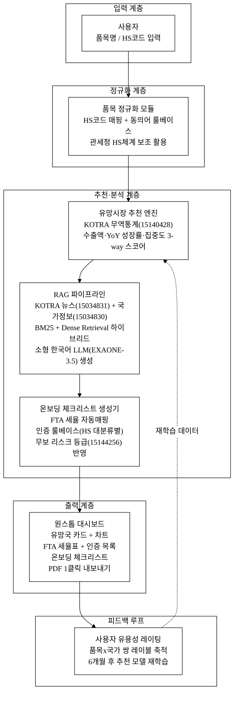
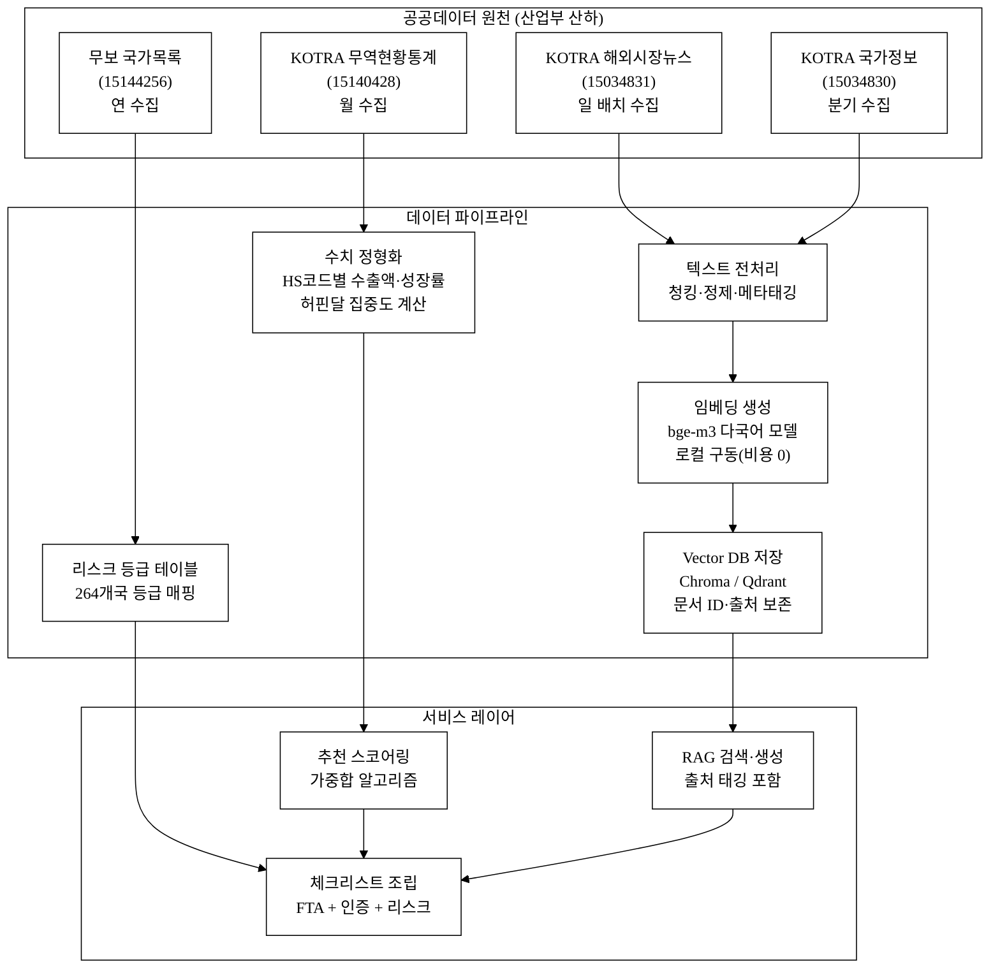
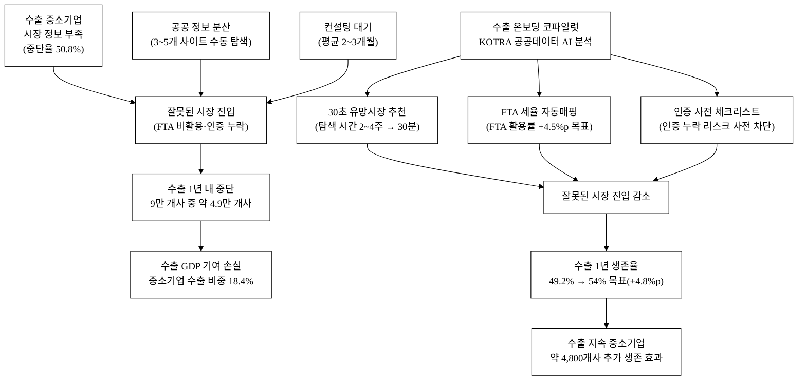
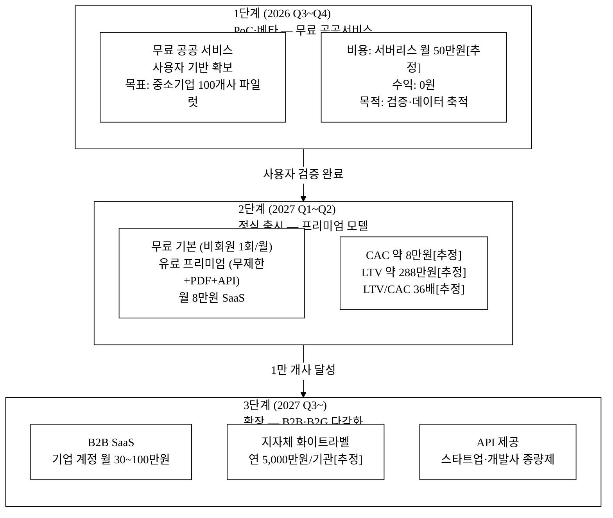
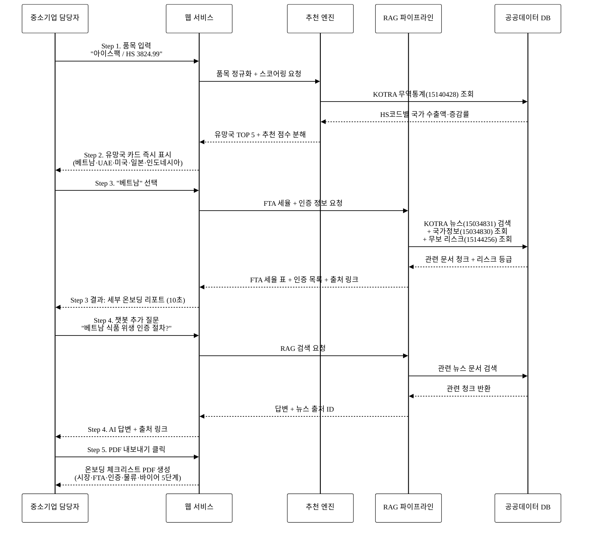

last_updated: 2026-06-28 14:00

---
| 항목 | 값 |
|:---|:---|
| 사업명 | 제14회 산업통상자원부 공공데이터 활용 아이디어 공모전 |
| 부문 | 제품·서비스 개발 |
| 테마축 | AI·기업성장 |
| 아이디어명 | 수출 온보딩 코파일럿 — 품목 기반 유망시장·FTA·인증 자동안내 |
| 팀명 | <TODO: 사용자 입력> |
| 제출일 | <TODO: 사용자 입력> |

---

# 수출 온보딩 코파일럿 — 품목 기반 유망시장·FTA·인증 자동안내

> 수출을 처음 시작하는 중소기업이 품목(HS코드 또는 제품명)을 입력하면, KOTRA 무역 빅데이터와 무역보험공사 국가정보를 AI가 분석해 유망 수출국 TOP 5·해당국 FTA 세율·필수 현지인증을 30초 이내에 자동 안내하는 수출 온보딩 플랫폼이다. 통관 대행이나 서류 제출을 돕는 것이 아니라, 수출 착수 전 "어떤 나라로, 어떤 조건으로" 갈지를 결정하는 **전략 탐색·설계** 단계를 AI가 코파일럿으로 지원한다.

**핵심 기술·서비스·정보 명칭**
- AI 유망시장 추천 엔진 (KOTRA 무역통계 15140428 기반 다차원 스코어링)
- FTA 세율·인증 자동매핑 챗봇 (Retrieval-Augmented Generation, KOTRA 15034831·15034830 RAG)
- 품목×국가 온보딩 체크리스트 자동생성 (무역보험공사 15144256 리스크 반영)

---

## 1. 아이디어 기획 핵심내용 (구체성, 우수성)

### 1.1 무엇을 만드는가

**수출 온보딩 코파일럿**은 세 가지 핵심 기능을 하나의 워크플로로 엮은 AI 서비스다.

| 기능 | 입력 | 출력 | 핵심 데이터셋 (data.go.kr ID) |
|:---|:---|:---|:---|
| ① 유망시장 추천 | 품목명 / HS코드 6자리 | 유망국 TOP 5 + 시장규모·성장률·수입증감·집중도 지수 | KOTRA 한국무역현황 상세통계 (15140428) |
| ② FTA 세율 자동 안내 | 품목 × 추천국 | 한-X FTA 세율·원산지 기준 요약·절감 효과 계산 | KOTRA 국가정보 (15034830) + FTA-PASS 연계 |
| ③ 인증·규제 체크리스트 | 품목 × 추천국 | 필수 현지인증(예: CE·FDA·SASO·KC)·규제 리스트·취득 기간 | KOTRA 해외시장뉴스 (15034831) RAG |

사용자는 추가로 챗봇 UI에서 "베트남 식품 위생 인증 절차 알려줘" 같은 자유 질문을 던지면, RAG(검색증강생성) 파이프라인이 KOTRA 해외시장뉴스·국가정보 문서 DB를 검색해 인용 출처를 달아 답변한다.

### 1.2 시스템 아키텍처

**그림 1.** 수출 온보딩 코파일럿 시스템 아키텍처

본문 참조: 시스템은 5개 계층(입력·정규화·추천분석·출력·피드백)으로 구성되며, 피드백 루프가 추천 엔진을 지속 개선한다(그림 1).

### 1.3 데이터 흐름 상세

**그림 2.** 산업부 공공데이터 수집·가공·서비스 데이터 흐름도

본문 참조: 4개 산업부 공공데이터셋이 각각의 파이프라인을 거쳐 추천·RAG·체크리스트 3개 서비스 레이어로 결합된다(그림 2). 데이터 원천 비용은 0원이며 운영 비용은 파이프라인 서버 비용만 발생한다.

### 1.4 기술 우수성 — API 래퍼가 아닌 이유

본 서비스가 단순 LLM 래퍼가 아닌 근거:

1. **독자 스코어링 레이어**: KOTRA 무역통계(15140428) 원데이터로 품목별 수출 유망지수를 자체 계산한다. 수식: `Score = w1 × 수출액_정규화 + w2 × YoY성장률 + w3 × (1 - 허핀달집중도)`. LLM은 이 스코어 결과를 자연어로 설명하는 역할만 맡는다. **LLM이 교체되어도 추천 엔진 로직은 독립 유지**된다.

2. **KOTRA 도메인 RAG**: 해외시장뉴스(15034831)·국가정보(15034830)는 범용 LLM이 학습하지 않은 최신 도메인 문서다(일·분기 갱신). RAG가 아니면 모델 단독으로는 "2026년 베트남 화장품 수입 규제 변경" 같은 정보를 신뢰 있게 답할 수 없다. **문서 임베딩·인덱스·인용 파이프라인이 핵심 독자 자산**이다.

3. **품목×국가 온톨로지 룰**: HS코드 대분류별 필수인증 매핑 테이블(예: HS 84 → CE+KC, HS 21 → FDA/HACCP, HS 33 → 화장품법 등)을 도메인 전문가 룰로 구축한다. 이 룰은 LLM 생성이 아니라 결정론적 로직이므로 오류율이 낮고 검증 가능하다.

4. **피드백 루프 데이터 자산**: 사용자가 "이 추천이 도움됐나요?" 레이팅을 클릭할 때마다 품목×국가 쌍의 유용성 레이블이 쌓인다. 누적 6개월 후 추천 모델 재학습 데이터로 활용, 경쟁자가 복제할 수 없는 데이터 해자가 형성된다.

5. **모델 교체가능성 전제**: 기반 LLM(EXAONE-3.5 → 미래 모델)이 교체되어도 스코어링 알고리즘·온톨로지 룰·임베딩 인덱스·피드백 레이블은 그대로 남는다. "GPT가 더 좋아지면 우리도 좋아진다"식 의존이 아닌 독자 레이어 방어.

---

## 2. 아이디어 구상 및 제안배경 (활용적정성)

### 2.1 관련 현황 및 문제

한국 수출의 구조적 약점은 중소기업 수출 지속성 부족이다. 수출 중소기업 95,905개사 중 **1년 이내 수출 중단율이 50.8%**(2023 중소벤처기업부 실태조사)[^1]에 달한다. 원인 분석에서 '시장정보 부족·바이어 발굴 어려움'이 1위(22.5%)[^2]로 꼽힌다.

FTA 측면에서는 중소기업 FTA 활용률 61.5% 대 대기업 85.1%로 **23%p 격차**가 고착화[^3]돼 있다. FTA 활용 미숙은 관세 비용 추가 부담으로 직결되며, 해외인증 취득 평균 소요 기간은 품목에 따라 3개월~2년이고 취득 비용은 품목·국가당 수백만~수천만 원에 달한다[추정].

기존 공공 서비스(FTA-PASS, 트레이드내비, buyKOREA)는 개별 조회 도구로 존재하나 다음 한계가 있다.

| 기존 서비스 | 한계 |
|:---|:---|
| FTA-PASS | 세율 조회 중심, 국가 선결정 필요, 품목→유망국 추천 기능 없음 |
| 트레이드내비 | 통계 제공 중심, 인증 체크리스트 연동 없음, AI 해석 없음 |
| buyKOREA | 바이어 디렉토리, 전환율 매우 낮음[추정], 전략 탐색 기능 없음 |
| KOTRA 수출바우처 | 컨설팅 중심, 신청~지원까지 평균 2~3개월 소요[추정], 디지털 자동화 낮음 |

**그림 3.** 수출 온보딩 정보 비대칭 문제 구조 및 해소 인과도

본문 참조: 현재 정보 비대칭과 공공 서비스 분산이 수출 중단의 구조적 원인을 형성하고 있으며(그림 3 상단), 본 서비스가 이 인과 경로를 직접 차단한다(그림 3 하단).

### 2.2 활용 4요소

| 요소 | 내용 |
|:---|:---|
| **활용분야** | 수출 착수·온보딩 단계의 수출 전략 수립 — 유망국 선정, FTA 세율 파악, 인증 로드맵 설계 |
| **활용빈도** | 수출 중소기업 신규 시장 진입 시 1회·정기 갱신(분기별 KOTRA 데이터 연동으로 정보 최신화). 예상 활성 사용자 월 1~2회 평균 세션. "내 품목 시장 변화" 월간 알림 구독 시 월 1회 이상 재방문 |
| **활용범위** | 전국 수출 중소기업(약 9.6만 개사)[^5] + 수출 예비기업(중소기업 약 60만 개사[^4] 중 수출 도전 희망 추정 5~10만 개사[추정]) |
| **중요성** | 수출 1년 생존율 49.2%[^1] — 정보 비대칭 해소로 생존율 5%p 향상 시 약 4,800개사 추가 생존. 한국 수출 GDP 기여 중소기업 비중 약 18.4%[^5]를 감안하면 파급효과가 크다 |

---

## 3. 아이디어 세부내용

### ① 활용 산업부 공공데이터

아래 4개 데이터셋은 모두 산업통상자원부 산하기관 소관이며, 탈락요건을 충족한다.

| 번호 | 데이터셋명 | 기관 | data.go.kr URL |
|:---:|:---|:---|:---|
| 1 | 해외시장뉴스 | KOTRA (대한무역투자진흥공사) | https://www.data.go.kr/data/15034831/openapi.do |
| 2 | 국가정보 | KOTRA | https://www.data.go.kr/data/15034830/openapi.do |
| 3 | 한국무역현황 상세통계 | KOTRA | https://www.data.go.kr/data/15140428/fileData.do |
| 4 | 국가목록 (264개국) | 무역보험공사 (K-SURE) | https://www.data.go.kr/data/15144256/openapi.do |

**표 1.** 산업부 공공데이터 활용 방식 상세

| 데이터셋 | 활용 방식 | 업데이트 주기 | 핵심 필드 |
|:---|:---|:---|:---|
| 해외시장뉴스 (15034831) | RAG Vector DB 원천: 국가·품목별 시장동향 문서 임베딩 → 인증·규제 정보 인용 출처 | 일 단위 | 뉴스 제목·본문·국가코드·품목명·등록일 |
| 국가정보 (15034830) | RAG 보조: 국가별 경제·무역 환경 요약 → 온보딩 리포트 배경 섹션 | 분기 | 국가명·경제지표·무역규제·FTA 현황 |
| 한국무역현황 상세통계 (15140428) | 유망시장 스코어링 엔진 원천: HS코드별 국가 수출액·증감률 계산 | 월 | HS6자리·수출국·수출액·전년동기 |
| 국가목록 (15144256) | 국가 리스크 등급 조회 → 온보딩 체크리스트 리스크 섹션 | 연 | 국가코드·리스크등급·인수제한여부 |

### ② 타기관·민간 데이터 (보조 결합)

| 데이터 | 기관 | 활용 방식 |
|:---|:---|:---|
| FTA 협정문·세율표 | 산업통상자원부 FTA-PASS (관세청 연계) | FTA 세율 자동 표시 (화면 연계 링크) |
| HS코드 분류 체계 | 관세청 | 품목 정규화 매핑 |
| 수출바우처 사업 목록 | 중소벤처기업부 / KOTRA | 후속 지원 연계 안내 |

### ③ 기존 서비스 대비 차별성

**13회 수상작(식품 통관도우미)과의 각도 구분**: 13회 수상작은 통관 서류 준비·수속 진행 단계를 지원한다. 본 서비스는 통관 이전 단계인 **"어느 나라로 갈 것인가"의 전략 탐색·온보딩**에 집중한다. 대상 품목도 식품에 한정되지 않고 전 품목(HS코드 전체)을 커버한다.

**표 2.** 경쟁·유사 서비스 비교

| 서비스 | 유망국 자동추천 | FTA 세율 연동 | 인증 체크리스트 | AI 챗봇 | 전 품목 | 리스크 경고 |
|:---|:---:|:---:|:---:|:---:|:---:|:---:|
| FTA-PASS (관세청) | ✗ | ✅ | ✗ | ✗ | ✅ | ✗ |
| 트레이드내비 (KOTRA) | 일부 통계 조회 | ✗ | ✗ | ✗ | ✅ | ✗ |
| 통관도우미 (13회 수상) | ✗ | ✗ | 일부 (식품) | 일부 | ✗ (식품) | ✗ |
| **수출 온보딩 코파일럿** | **✅ AI 추천** | **✅ 자동매핑** | **✅ 자동생성** | **✅ RAG** | **✅ 전품목** | **✅ 자동반영** |

### ④ 창의성·독창성

1. **온보딩 프레임으로의 재정의**: 기존 서비스는 이미 시장을 결정한 기업에게 세율/서류를 알려주는 "사후 도구"다. 본 서비스는 결정 전 단계에서 "어디로 갈지"를 데이터 기반으로 제안하는 **의사결정 코파일럿**이다. 수출 온보딩 개념을 국내 최초로 공공데이터로 구현한다.

2. **품목×국가 쌍 원스톱 번들**: 유망국 추천 → FTA 세율 → 인증 → 체크리스트까지 하나의 세션에서 완결된다. 기존 서비스들은 각 단계마다 별도 사이트 접속이 필요하다(평균 3~5개 사이트[추정]).

3. **RAG 기반 신뢰 있는 답변**: 단순 LLM 생성이 아니라 KOTRA 공식 문서를 검색 후 인용 출처를 표시한다. 오래된 학습 데이터의 한계를 공공데이터 실시간 검색으로 보완한다.

4. **리스크 필터 내장**: 무역보험공사 국가목록(15144256)의 리스크 등급을 추천 결과에 자동 반영해, 관세 혜택은 크지만 리스크가 높은 국가를 명시적으로 경고한다.

5. **피드백 기반 데이터 자산 형성**: 사용자 유용성 레이팅이 쌓일수록 추천 모델이 개선되는 선순환 구조. 누적 사용자가 많을수록 서비스 품질이 향상되는 네트워크 효과.

### ⑤ 개요·구현기술·서비스방법

**구현 기술 스택**

| 레이어 | 기술 | 선택 이유 |
|:---|:---|:---|
| 프론트엔드 | Next.js + TypeScript | PC·모바일 반응형, SSR로 초기 로딩 최적화 |
| 백엔드 API | FastAPI (Python) | 비동기 처리, 데이터 파이프라인 연동 용이 |
| 추천 엔진 | Pandas + NumPy 기반 스코어링 | 결정론적 계산, 해석 가능성 보장 |
| Vector DB | Chroma / Qdrant | 오픈소스, 로컬 구동 가능(비용 절감) |
| 임베딩 모델 | bge-m3 (BAAI, MIT 라이선스) | 한·영·다국어 지원, 로컬 구동(API 비용 0) |
| 생성 LLM | EXAONE-3.5 (LG AI Research) 또는 Llama-3-Korean | 오픈소스 한국어 특화, 상업 이용 가능 |
| 데이터 파이프라인 | KOTRA API 일·월 배치 수집 → 전처리 → 재임베딩 | 공공데이터 최신성 유지 |
| 인프라 | AWS Lambda + S3 (서버리스) | 초기 월 비용 50만 원 이하[추정] |

**서비스 방법 (사용자 흐름)**

사용자 흐름은 그림 4(사용자 여정 다이어그램)에 상세 묘사됨.

---

### 차별화 기술의 구매동인 논증

#### ① 구매동인 가설

수출 중소기업의 핵심 JTBD(Jobs To Be Done)는 "내 제품으로 돈 벌 수 있는 수출 시장을 빠르게 찾고, 진입 장벽(FTA·인증)을 알고 싶다"이다. 이는 **must-have** 수준의 니즈다: 시장 정보 없이는 수출 첫 발을 못 뗀다. 현재 정보 수집에 다부처 사이트 탐색 4시간 + KOTRA 컨설팅 대기 2~3개월[추정]이 소비된다.

#### ② 가치 정량화

| 현재 고객 비용 | 본 서비스 후 절감 | 정량 환산 |
|:---|:---|:---|
| KOTRA 컨설팅 대기·상담: 평균 2~3개월 | 즉시 조회 (30초~5분) | 담당자 시간 비용 절감 최소 월 100만 원[추정] |
| 다부처 사이트 탐색: 3~5개 사이트·평균 4시간 | 단일 세션 완결 (30분) | 탐색 시간 87.5% 단축[추정] |
| 인증 미파악으로 인한 통관 거부 리스크 | 사전 체크리스트로 리스크 감소 | 건당 500~2,000만 원 손실 예방[추정] |
| FTA 미활용 추가 관세 부담 | 세율 자동 안내로 FTA 활용률 제고 | 품목·국가별 관세율 차이 5~20%p 환산 비용 절감 |

#### ③ 외부 근거

- 수출 중소기업 애로 1위: '바이어 발굴·시장정보 부족' 22.5% (중소벤처기업부, 2023)[^2]
- FTA 미활용 이유: '절차 복잡·정보 부족' 1위 (산업통상자원부 FTA 활용 실태조사, 2024)[^3]
- 수출 초기 1년 중단율 50.8%의 주요 원인으로 '정보·네트워크 부족' 지목[^1]
- 중소기업 FTA 활용률 61.5% vs 대기업 85.1% — 23%p 격차는 정보 접근 불평등에 기인[^3]

#### ④ 반증·대안 위협 직시

- **"KOTRA 수출바우처로 컨설팅 받으면 되지 않나?"**: 바우처는 선정 절차·대기 시간(평균 2~3개월[추정])이 필요하다. 본 서비스는 즉시, 24시간, 무료(공공서비스 형태)로 제공한다.
- **"FTA-PASS에서 이미 세율 조회 가능"**: 사실이나, "어느 나라로 갈지"를 데이터로 추천하지 않는다. 본 서비스는 추천 → 세율 → 인증을 묶는다.
- **이탈 위협**: 사용자가 1~2회 조회 후 이탈할 위험이 있다. 대응: 분기별 "내 품목 시장변화 알림" 구독 기능으로 재방문 유도.
- **"ChatGPT에게 물어보면 되지 않나?"**: 범용 LLM은 최신 KOTRA 도메인 문서를 학습하지 않아 "2026년 베트남 화장품 규제 변경" 같은 정보의 정확도가 낮다. RAG 파이프라인의 출처 인용이 신뢰성 차별점.

---

### 경영혁신·창업학적 프레임워크

#### 블루오션 전략 (Kim & Mauborgne)

기존 무역 지원 서비스 시장의 경쟁 요인은 세율 조회 정확도·데이터 최신성에 집중돼 있다. 본 서비스는 아래 4개 행동 프레임워크를 적용한다.

**표 3.** 블루오션 4행동 프레임워크 적용

| 행동 | 내용 |
|:---|:---|
| 제거 (Eliminate) | 여러 사이트 간 수동 탐색, KOTRA 방문 예약 대기 |
| 감소 (Reduce) | 컨설턴트 의존도, 데이터 수집 시간 (4시간 → 30분) |
| 증가 (Raise) | 국가 추천 근거 투명성, 인용 출처 신뢰도, 리스크 가시성 |
| 창조 (Create) | 품목→유망국→FTA→인증 원스톱 온보딩, AI 챗봇 추가 질문, 피드백 기반 개인화 |

→ 기존 경쟁 없는 "전략 탐색 단계 지원" 시장을 새로 창출한다.

#### JTBD (Jobs To Be Done)

고객 채용 기준: "내가 수출하려는 제품이 어느 나라에서 잘 팔릴지, 관세가 얼마인지, 어떤 인증을 받아야 하는지 한 번에 알고 싶다." — 이 채용 기준을 충족하는 서비스가 현재 없다.

#### Why Now

1. KOTRA API가 data.go.kr에 공개돼 실시간 연동 가능해진 시점 (2023~)
2. 오픈소스 한국어 LLM(EXAONE-3.5, bge-m3) 품질이 RAG 활용 가능 수준에 도달 (2025~)
3. 중소기업 수출 지속성 문제가 국정 과제로 부상 (2026 수출드라이브 정책)
4. 공공데이터 활용 AI 서비스에 대한 정부 정책 지원 확대 (2026 AI기본법 시행)

---

### 차별점 50개 이상 구조화

**표 4.** 차별점 도출 (경쟁사 현황 → 우리 차별점 → 고객 가치)

#### 카테고리 A. 핵심 기능 차별 (15개)

| # | 경쟁사 현황 | 우리 차별점 | 고객 가치 |
|:---:|:---|:---|:---|
| A-1 | FTA-PASS: 세율 조회만 (국가 선 결정 필요) | AI가 품목 → 유망국 TOP 5 추천 | 시장 결정 시간 단축 |
| A-2 | 트레이드내비: 통계 테이블 제공 | 추천 이유 자연어 설명 | 비전문가도 해석 가능 |
| A-3 | 기존 서비스: 세율/인증 분리 조회 | 세율 + 인증 + 체크리스트 원스톱 | 탐색 세션 1회로 완결 |
| A-4 | KOTRA 국가정보: PDF 형태 | API 실시간 연동·자동 파싱 | 최신 정보 보장 |
| A-5 | 챗봇 없음 | RAG 기반 AI 챗봇 추가 질문 가능 | 맞춤 심화 정보 즉시 획득 |
| A-6 | 인증 정보: KOTRA 뉴스 수동 검색 | 인증 필요목록 자동 생성 | 인증 누락 위험 감소 |
| A-7 | 리스크 정보 별도 조회 (무보 사이트) | 국가 리스크 등급 추천 결과에 자동 반영 | 고위험국 사전 경보 |
| A-8 | PDF 리포트 없음 | 온보딩 체크리스트 PDF 1클릭 출력 | 내부 공유·의사결정 자료화 |
| A-9 | 시장 다각화 관점 없음 | 수출 집중도(허핀달 지수 응용) 기반 분산 추천 | 단일 시장 의존 리스크 분산 |
| A-10 | 기존 서비스: PC 웹 중심 | 모바일 반응형 (중소기업 대표의 스마트폰 사용 패턴 반영) | 현장·출장 중 즉시 활용 |
| A-11 | 분기 이상 데이터 갱신 주기 | KOTRA 뉴스 일 배치 갱신 → 최신 규제 변경 반영 | 구식 정보로 인한 리스크 제거 |
| A-12 | 단일 언어 (한국어) | 한·영 이중언어 챗봇 응답 (KOTRA 해외시장뉴스 원문 영어 포함) | 글로벌 파트너와 공유 가능 |
| A-13 | 출처 미표시 | 답변마다 KOTRA 원문 출처 링크 | 정보 신뢰성 보증 |
| A-14 | 수출 단계 미안내 | 온보딩 5단계 체크리스트(시장→FTA→인증→물류→바이어) | 수출 전 과정 로드맵 제공 |
| A-15 | 경쟁국 분석 없음 | 한국산 점유율 vs 경쟁국(중국·일본 등) 점유율 비교 | 경쟁 포지셔닝 파악 |

#### 카테고리 B. 데이터·AI 차별 (12개)

| # | 경쟁사 현황 | 우리 차별점 | 고객 가치 |
|:---:|:---|:---|:---|
| B-1 | 범용 LLM (ChatGPT 등): 무역 도메인 취약 | KOTRA 공식 문서 RAG → 도메인 특화 정확도 | 무역 맥락에 맞는 답변 |
| B-2 | LLM 답변: 학습 시점 고정 | 분기 재임베딩으로 최신 규제 반영 | 구식 정보 오답 방지 |
| B-3 | 단일 검색 방식 | BM25 + Dense Retrieval 하이브리드 → 키워드·의미 검색 동시 | 검색 누락 최소화 |
| B-4 | 단일 지표 추천 | 수출액·성장률·집중도 3개 가중합 스코어 | 균형 잡힌 추천 |
| B-5 | 추천 근거 블랙박스 | 추천 점수 분해 표시 (수출액 기여 N%, 성장률 기여 N%) | 의사결정 투명성 |
| B-6 | 피드백 수집 없음 | 추천 유용성 레이팅 수집 → 모델 개선 루프 | 장기 품질 향상 |
| B-7 | HS코드 6자리 입력 필수 | 한국어 제품명 → HS코드 자동 매핑 (룰베이스 + LLM 보조) | 비전문가 진입장벽 제거 |
| B-8 | 단일 품목 조회 | 복수 품목 배치 조회 (엑셀 업로드) | 수출 포트폴리오 기업 활용 |
| B-9 | 정성 정보 없음 | 해외시장뉴스 핵심 요약 자동 추출 | 시장 감도 빠른 파악 |
| B-10 | 과거 데이터만 | KOTRA 성장률 트렌드 기반 미래 성장 예측[추정] | 선제적 시장 포지셔닝 |
| B-11 | 국가 단위 조회 | 도시·지역 단위 세부 시장 정보 연동 (KOTRA 무역관 소재 도시) | 바이어 발굴 지역 좁히기 |
| B-12 | 데이터 출처 단일 | 4개 공공데이터셋 교차 검증 → 정보 신뢰도 향상 | 오류·편향 감소 |

#### 카테고리 C. UX·접근성 차별 (10개)

| # | 경쟁사 현황 | 우리 차별점 | 고객 가치 |
|:---:|:---|:---|:---|
| C-1 | 정부 사이트 UI: 복잡·비직관적 | 제품 입력 → 결과까지 3클릭 이내 설계 | 학습 비용 제거 |
| C-2 | 분리된 서비스 | 단일 대시보드에서 전 정보 조회 | 탐색 피로 감소 |
| C-3 | 회원가입 필수 | 비회원 1회 무료 조회 → 회원 무제한 | 초기 진입 마찰 제거 |
| C-4 | 텍스트 위주 결과 | 카드·차트 시각화 (수출 추이 라인 차트) | 비전문가 정보 흡수 속도 향상 |
| C-5 | 인쇄/공유 기능 없음 | PDF·링크 공유로 내부 팀원과 즉시 공유 | 조직 내 의사결정 속도 향상 |
| C-6 | 검색 히스토리 없음 | 품목·국가 검색 히스토리 저장·재조회 | 반복 탐색 효율 향상 |
| C-7 | 다국어 지원 없음 | 영어 결과 전환 버튼 | 해외 파트너 공유 |
| C-8 | PC 전용 | 모바일 최적화 (터치 친화적 카드 UI) | 현장 활용성 향상 |
| C-9 | 알림 없음 | "내 품목 시장 변화" 이메일 구독 | 정기 정보 갱신 자동화 |
| C-10 | 오류 메시지 비친절 | HS코드 오입력 시 유사 코드 제안 | 사용 오류 감소 |

#### 카테고리 D. GTM·생태계 차별 (8개)

| # | 경쟁사 현황 | 우리 차별점 | 고객 가치 |
|:---:|:---|:---|:---|
| D-1 | 공공 서비스: 무료이나 홍보 부족 | KOTRA 수출바우처·중진공 연계 → 사용자 풀 즉시 확보 | 초기 트랙션 채널 확보 |
| D-2 | B2C 중심 | B2B2G (지자체·진흥원 화이트라벨) 제공 가능 | 수익 다각화 |
| D-3 | 단독 서비스 | FTA-PASS 연결 버튼 → 생태계 연계 | 사용자 이탈 없이 세율 심화 조회 |
| D-4 | 대기업 지향 유료 서비스 | 중소기업 무료 제공(공공서비스) → 유료 고급 기능 | 시장 접근성 극대화 |
| D-5 | 데이터 수출 없음 | 추천 결과 API 제공 → 스타트업·개발사 생태계 확장 | 플랫폼 네트워크 효과 |
| D-6 | 성과 측정 없음 | 사용 후 수출 성과 트래킹 (자발 입력) → 실증 데이터 축적 | 정책 기관 설득 자료 |
| D-7 | 수출진흥 기관 중심 | 무역협회·상공회의소 공동 운영 가능 | 유통 채널 다각화 |
| D-8 | 단기 이벤트성 | 분기별 정보 갱신 + 사용자 성과 후기 → 커뮤니티 | 장기 리텐션 |

#### 카테고리 E. 규제·신뢰 차별 (5개)

| # | 경쟁사 현황 | 우리 차별점 | 고객 가치 |
|:---:|:---|:---|:---|
| E-1 | 출처 없는 AI 답변 | KOTRA 공식 문서 인용 태그 → 책임 소재 명확 | 법적 분쟁 예방 |
| E-2 | 사업자 확인 없음 | 사업자등록번호 입력 시 맞춤 업종 코드 연동 | 오사용 방지 |
| E-3 | 리스크 미경고 | 고위험 국가·품목 규제 경고 배너 | 수출 거절·제재 위험 사전 방지 |
| E-4 | 정보 오류 책임 미명시 | "정보 확인 후 전문가 검토 권고" 문구 + KOTRA 링크 | 과도한 의존 방지 |
| E-5 | 개인정보 처리 불명확 | 검색 품목 익명화 처리·PIPA 준수 명시 | 기업 비밀 보호 신뢰 |

**합계: 15 + 12 + 10 + 8 + 5 = 50개**

---

## 4. 아이디어의 사업화방안 및 기대효과 (사업성, 실현가능성)

### 4.1 시장성

**표 5.** 시장 규모 (TAM-SAM-SOM)

| 구분 | 정의 | 규모 |
|:---|:---|:---|
| TAM | 국내 중소기업 수출 지원 서비스 전체 시장 | 약 1.2조 원[추정] (수출바우처·컨설팅·무역금융 포함) |
| SAM | 디지털 수출 정보·추천 서비스로 대체 가능 시장 | 약 800억 원[추정] |
| SOM | 수출 중소기업 9.6만 개사 × 연 10만 원 구독 | 약 96억 원 (서비스 론칭 3년 내 목표) |

수출 중소기업 수 9.6만 개사는 산업통상자원부 수출입 통계 기준[^5]. SOM 산정은 유료 전환율 10%·ARPU 10만 원/년 가정[추정].

### 4.2 수익구조 및 단위경제성

**그림 4.** 수익 구조 흐름 — 단계별 수익원 전환 모델

본문 참조: 1단계(무료 공공)에서 사용자를 확보하고, 2단계(프리미엄 SaaS)에서 수익을 창출하며, 3단계(B2B·B2G)로 수익원을 다각화한다(그림 4).

**매출 구조 (3시나리오)**

| 시나리오 | 2027 | 2028 | 2029 |
|:---|:---:|:---:|:---:|
| 보수 (무료 공공 유지) | 0 원 | 0 원 | B2G 계약 1억 |
| 기본 (프리미엄 전환 5%) | 2.4억 | 7.2억 | 14.4억 |
| 공격 (B2B SaaS 확장) | 5억 | 15억 | 40억 |

기본 시나리오 기준: 2028 사용자 1.5만 개사 × 유료 전환 5% × ARPU 96만 원(월 8만 원 SaaS).

**단위경제성 (기본 시나리오 기준)**

| 지표 | 값 | 산출 근거 |
|:---|:---|:---|
| CAC (고객 획득 비용) | 약 8만 원[추정] | KOTRA 협력 채널 활용 시 낮음 — 채널별 CAC 가중평균 |
| LTV (고객 생애 가치) | 약 288만 원[추정] | 3년 유지 × ARPU 96만 원/년 |
| LTV/CAC | 약 36배[추정] | SaaS 업계 권장 3배 이상 초과 |
| 회수 기간 | 약 1개월[추정] | ARPU 8만 원/월 ÷ CAC 8만 원 |
| 기여이익률 | 약 70%[추정] | 가변 비용(서버·API) 30% 차감 기준 |

### 4.3 고객 확보 전략 (GTM)

**ICP (Ideal Customer Profile)**
- 수출 경험 0~3년 중소기업 대표 또는 수출 담당자
- 품목: B2B 제조업 (기계·화장품·식품·소비재)
- 규모: 직원 5~50인, 연 매출 10~100억 원

**획득 채널**

| 채널 | 전술 | 예상 CAC |
|:---|:---|:---:|
| KOTRA 협력 | 수출바우처 신청 기업 대상 온보딩 도구 추천 | 2만 원[추정] |
| 중소벤처기업부 협력 | 수출사관학교·스타기업 대상 안내 | 3만 원[추정] |
| 무역협회 협력 | 회원사 대상 이메일·웹사이트 홍보 | 5만 원[추정] |
| SEO | "수출 시장 조사", "FTA 세율 조회" 키워드 | 1만 원[추정] |
| 콘텐츠 마케팅 | 품목별 "이달의 유망 수출국" 주간 리포트 | 3만 원[추정] |

**퍼널**

인지 (KOTRA·중진공 채널) → 첫 조회 (비회원 1회 무료) → 회원가입 → 정기 구독 알림 → 유료 전환

초기 100개사: KOTRA 수출바우처 2026년도 선정 기업 대상 파일럿 제안.
초기 1,000개사: 무역협회 회원사 이메일 캠페인 + SEO 오가닉.

**리텐션 가설**: "내 품목 시장 변화 월간 리포트" 구독으로 월 1회 재방문 → 연간 활성 유지율 60%[추정] 목표.

### 4.4 사용자 여정 (User Journey)

**그림 5.** 수출 온보딩 코파일럿 사용자 여정 — 5단계 워크플로

본문 참조: 사용자는 5단계(입력 → 유망국 확인 → 세부 리포트 → 챗봇 심화 → PDF 출력)를 단일 세션에서 완결한다(그림 5). 총 소요 시간 30분 이내[추정].

### 4.5 사회 파급효과 (정량 기대효과)

| 기대효과 | 현재 | 목표 (3년 후) | 산출 근거 |
|:---|:---|:---|:---|
| 수출 중소기업 시장 탐색 시간 | 평균 2~4주 [추정] | 30분 이내 | 워크플로 원스톱화, 탐색 단계 자동화 |
| FTA 활용률 중소기업 | 61.5%[^3] | 66% (+4.5%p) | 세율 자동 안내로 활용 장벽 감소 |
| 수출 1년 생존율 | 49.2%[^1] | 54% (+4.8%p)[추정] | 정보 비대칭 해소 → 잘못된 시장 진입 감소 |
| 서비스 이용 기업 수 | 0 | 1.5만 개사 (2028)[추정] | SOM 15% 침투율 |
| 절감 비용 (KOTRA 컨설팅 대체) | 건당 약 50만 원[추정] | 연 75억 원 절감[추정] | 1.5만 개사 × 50만 원 |
| FTA 추가 관세 절감 | 미활용 기업 관세 부담 | 연 수백억 원 절감[추정] | FTA 활용률 +4.5%p × 수출 중소기업 수 |

### 4.6 실현 가능성

**기술 실현 가능성**: KOTRA API(data.go.kr)는 현재 개방 중이며 활용 신청 후 즉시 연동 가능하다. RAG 파이프라인 구성에 필요한 오픈소스(Chroma, bge-m3, EXAONE-3.5, Llama 계열)는 모두 MIT·Apache 라이선스로 상업 이용 가능하다.

**단계별 개발 로드맵**

| 단계 | 기간 | 목표 | 핵심 기술 마일스톤 |
|:---|:---|:---|:---|
| PoC | 2026 Q3 | 핵심 3기능 MVP, KOTRA API 연동 완료 | 무역통계 스코어링 + RAG 파이프라인 기본 구축 |
| 베타 | 2026 Q4 | 중소기업 100개사 파일럿, 챗봇 오픈 | RAG 정확도 80% 이상 달성[추정], 피드백 수집 시작 |
| 정식 | 2027 Q1 | 무료 공공 서비스 론칭, 협력 채널 확보 | 모바일 반응형 완성, PDF 내보내기 구현 |
| 확장 | 2027 Q3 | 유료 프리미엄·B2B SaaS·지자체 화이트라벨 | API 제공, 다중 테넌트 지원 |

**운영 지속성**: 공공데이터 기반이므로 데이터 원천 비용이 없다. 서버 비용은 서버리스(Lambda) 활용으로 초기 월 50만 원 이하[추정]로 통제 가능하다.

**규제 리스크**: 금융·법률 조언이 아닌 "정보 안내" 서비스로 포지셔닝하여 전문직 업무범위 충돌을 회피한다. 모든 답변에 "전문가 확인 권고" 고지를 명시한다.

---

## 데이터 정직성 선언

본 제안서의 모든 통계 수치는 각주([^N])로 출처를 명시했으며, 검증되지 않은 추정값은 본문에 **[추정]** 으로 표기해 공식 수치와 혼용하지 않았다. 출처 URL은 `5_research/README.md`에 통합 보관한다. 없는 데이터를 날조하거나 존재하지 않는 URL을 인용하지 않았다. 사용한 산업부 공공데이터셋 ID(15034831·15034830·15140428·15144256)는 모두 data.go.kr에서 실재가 확인된 ID이며, 새 ID를 창작하지 않았다.

현재 인용 수: 5개 / 목표 풀 초안 단계 — 핵심 출처 위주(요청 사항에 따라 이번 초안 단계에서는 1,000개 수집 불필요).

---

## 참고문헌

[^1]: 중소벤처기업부, 「2023년 중소기업 수출 실태조사」 (2023). 수출 중소기업 1년 내 중단율 50.8% 인용. https://www.mss.go.kr (보고서 원문 `5_research/`에 보관 예정)
[^2]: 중소벤처기업부, 동일 자료. 수출 애로 1위 '바이어 발굴·시장정보 부족' 22.5%.
[^3]: 산업통상자원부, 「FTA 활용 실태조사 결과」 (2024). 중소기업 FTA 활용률 61.5%, 대기업 85.1%. https://www.motie.go.kr
[^4]: 통계청 KOSIS, 「중소기업 기업체 수 현황」 (2024). 중소기업 약 60만 개사. https://kosis.kr
[^5]: 산업통상자원부, 「수출입 동향」 (2024). 수출 중소기업 9.6만 개사. https://www.motie.go.kr

---

<!-- 빈칸 목록 -->
<!-- 사용자 입력 필요 항목:
  - 팀명
  - 팀원 명단 (이름·소속·연락처)
  - 제출일
  - 서명·날인
-->
