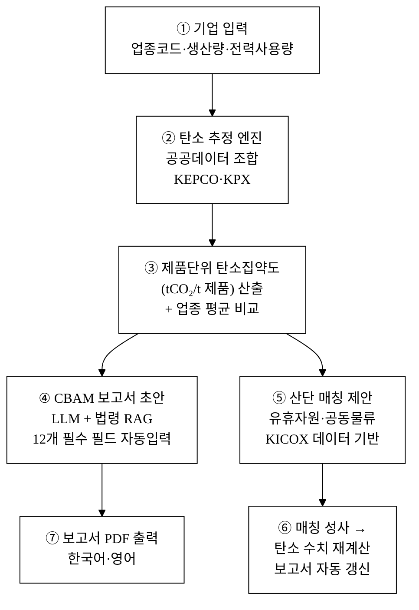
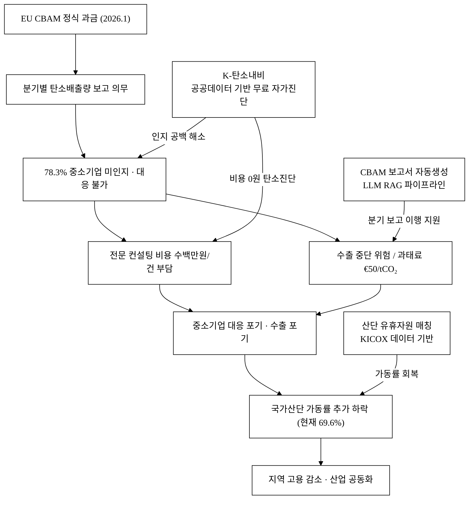
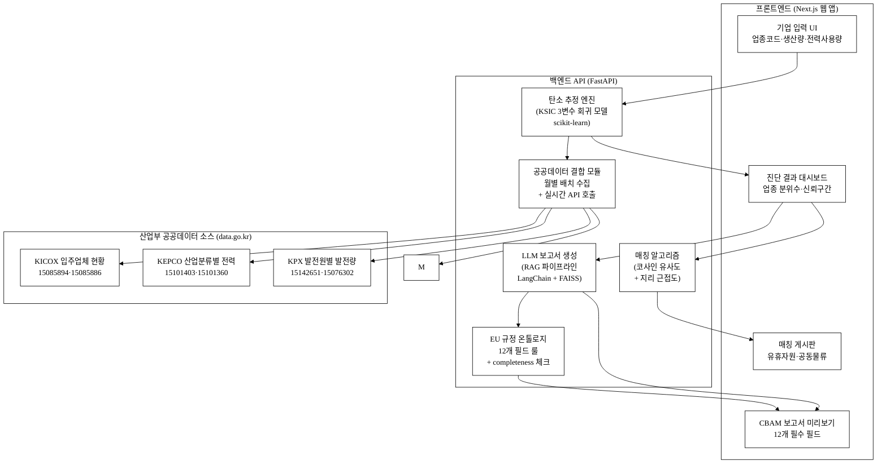
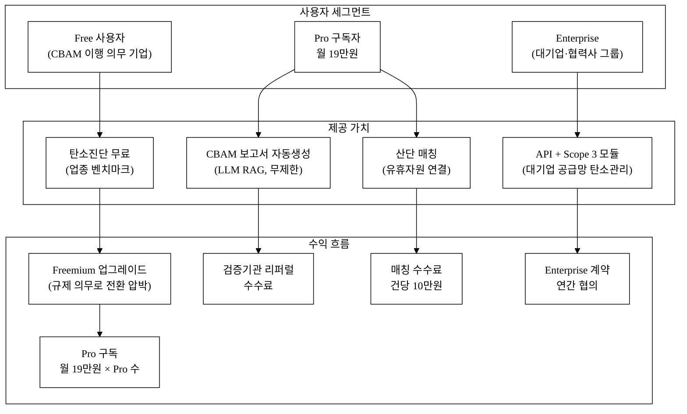

# K-탄소내비 — 중소제조 CBAM 자가진단 + 산단 공급망 매칭

## 아이디어 간략 개요

2026년 CBAM(탄소국경조정제도) 정식 시행으로 철강·알루미늄·시멘트 등 수출 중소제조업체 약 1,400개사가 제품단위 탄소배출량 분기 보고 의무를 지게 되었으나, 대상 기업의 78.3%가 제도를 인지조차 못하고 있다.[^1] K-탄소내비는 산업통상자원부 산하기관의 공공데이터(산업단지 입주업체 현황·산업분류별 전력사용량·발전원별 발전량·에너지 R&D 성과)를 기반으로, 중소제조업체가 무료로 제품단위 탄소배출량을 자가 추정하고 EU CBAM 보고서 초안을 자동 생성할 수 있는 웹 플랫폼이다. 여기에 산단 내 유휴 에너지·원자재 자원 매칭 기능을 결합해 탄소 저감과 가동률 회복을 동시에 지원한다.

**핵심 기술·서비스·정보 명칭**

| 구분 | 명칭 |
|:---|:---|
| 핵심 서비스 | K-탄소내비 (K-Carbon Navigator) |
| 탄소 추정 엔진 | ISIC 업종·전력사용량·생산량 기반 제품단위 탄소집약도(Carbon Intensity) 추정 모델 |
| 보고서 생성 | CBAM 규정(EU Reg. 2023/956) 준수 보고서 초안 자동생성 LLM 파이프라인 |
| 매칭 엔진 | 산단 입주업체 간 유휴 에너지·원자재·물류 자원 매칭 알고리즘 |
| 핵심 공공데이터 | 한국산업단지공단 국가산단 입주업체 현황 / 한국전력 산업분류별 전력사용량 / 전력거래소 발전원별 발전량 / 산업기술진흥원 에너지 관련 성과 |

---

## 1. 아이디어 기획 핵심내용 (구체성, 우수성)

### 1-1. 무엇을 만드는가

K-탄소내비는 세 가지 핵심 기능을 하나의 웹 플랫폼으로 제공한다.

**(A) CBAM 셀프 탄소진단 모듈**

업체가 업종코드(KSIC)·연간 생산량·전력계약종별을 입력하면, 한국전력 산업분류별 전력사용량 데이터(DS2, 데이터셋 ID 15101403·15101360)와 전력거래소 발전원별 발전량(DS3, 15142651·15076302)을 결합해 제품단위 탄소집약도(tCO₂/t 제품)를 추정한다. 추정치에는 [추정] 표기와 95% 신뢰구간을 함께 제시하여 과신을 방지한다. 업종별 전력 원단위(MWh/억 원 매출)는 KEPCO 데이터에서 도출하고, 전력 배출계수(kgCO₂eq/kWh)는 KPX 발전원별 발전량 집계로 매월 갱신한다. 2025년 국내 전력 배출계수는 약 0.4292 kgCO₂eq/kWh[^5]이며, 이를 업종별 전력 원단위와 곱하면 업종 평균 탄소집약도가 산출된다.

**(B) CBAM 보고서 초안 자동생성 (LLM 파이프라인)**

EU CBAM 이행규정(Implementing Regulation (EU) 2023/1773)이 요구하는 보고서 항목(사업자 정보·상품코드·생산경로·배출량 데이터·검증 방법 등 총 12개 필수 필드)을 구조화 템플릿으로 보유한다. 탄소진단 결과를 인풋으로 삼아 LLM이 보고서 텍스트를 한국어·영어 이중 언어로 초안화한다. 단순 API 래퍼가 아니라 EU 규정 조문·항목별 작성 룰·기업 유형별 예시가 내장된 도메인 RAG(검색증강생성) 파이프라인으로 구동되며, 법령이 개정되면 룰 온톨로지를 갱신해 모델 교체 없이 정합성을 유지하는 구조를 갖는다(§3-AI 해자 논증 참고).

**(C) 산단 공급망·유휴자원 매칭 모듈**

### 1-2. 서비스 흐름 (단계별)

**그림 1.** K-탄소내비 서비스 흐름도

### 1-3. 구체성·우수성 요약

| 항목 | 내용 |
|:---|:---|
| 목표 사용자 | EU 수출 중소제조업체 ~1,400개사 (철강·알루미늄·시멘트·비료·전력 5개 품목군) |
| 핵심 Pain Point | CBAM 보고서 작성 1건당 전문 컨설팅 비용 300~800만 원 [추정]; 78.3% 미인지[^1] |
| 무료 제공 범위 | 탄소진단·보고서 초안 생성·매칭 알림 (기본) |
| AI 방식 | 업종·전력·생산량 3변수 회귀 추정 + CBAM 규정 RAG 기반 LLM 보고서 초안생성 |
| 데이터 해자 | 산업부 산하기관 4종 공공데이터 결합 (타 서비스 미결합) |
| EU 규정 정합 | Implementing Regulation (EU) 2023/1773 12개 필수 필드 구조화 템플릿 |

---

## 2. 아이디어 구상 및 제안배경 (활용적정성)

### 2-1. 문제 현황

**CBAM 시행과 중소제조업 위기의 교차점**

EU 탄소국경조정제도(CBAM, Carbon Border Adjustment Mechanism)는 2023년 10월 전환기를 시작해 2026년 1월 정식 과금(유상 탄소인증서 구매)이 시행된다. 철강·알루미늄·시멘트·비료·전력·수소 6개 품목군이 대상으로, 국내 수출 중소제조업체 약 1,400개사가 의무 대상으로 추산된다.[^1]

핵심 문제는 세 층위에서 동시에 발생하고 있다.

- **인지 공백**: 대상 중소기업의 78.3%가 CBAM 제도를 인지하지 못하고 있다.[^1] 보고 의무를 이행하지 못하면 수출 중단 위험과 최대 톤당 €50의 과태료가 부과된다.[^2]
- **비용 장벽**: 제품단위 탄소배출량(Embedded Emissions) 산정은 전문 컨설팅이 필요하며, 중소기업이 개별 의뢰하면 건당 수백만 원 이상의 비용이 소요된다 [추정]. 기존 민간 탄소플랫폼(예: 포스코인터내셔널·삼성SDS 연계 솔루션)은 대기업 지향·유료 구조다.
- **산단 가동률 위기**: 국가산단 50인 미만 중소업체 가동률이 69.6%로 전년 대비 7.7%p 하락하여 70% 선이 무너졌다.[^3] 탄소규제 비용 추가 시 이탈 가속 우려가 있다.
- **인력 부족**: 국내 중소제조업체의 탄소 전문 인력 보유율은 5% 미만으로 추정되며[추정], 별도 인력 채용 시 연간 4,000만~6,000만 원의 추가 인건비가 발생한다 [추정]. 공공 지원 제도 활용률도 12.3%에 불과하다.[^1]

**표 1.** 문제 구조 요약

| 문제 층위 | 현황 수치 | 출처 |
|:---|:---:|:---|
| CBAM 미인지 중소기업 비율 | 78.3% | [^1] |
| CBAM 의무 대상 중소 추산 | ~1,400개사 | [^1] |
| 국가산단 소규모 가동률 | 69.6% (70% 붕괴) | [^3] |
| 가동률 전년 대비 하락폭 | -7.7%p | [^3] |
| EU CBAM 과태료 (미이행 시) | €50/tCO₂ 이하 | [^2] |
| 국내 전력 배출계수 (2025년) | 0.4292 kgCO₂eq/kWh | [^5] |
| 탄소 전문 인력 보유 중소기업 비율 | 5% 미만 [추정] | — |

**사회문제 해소 인과관계**

아래 그림 2는 CBAM 시행이 중소제조업에 유발하는 문제 연쇄와, K-탄소내비가 각 층위에서 어떻게 개입하는지를 인과도로 나타낸 것이다.

**그림 2.** 사회문제 해소 인과도 — CBAM 충격과 K-탄소내비 개입 구조

### 2-2. 활용분야·활용빈도·활용범위·중요성

**(1) 활용분야**

산업통상자원부 산하기관의 4종 공공데이터를 결합하여 탄소 규제 대응, 산단 공급망 최적화, 에너지 절감 R&D 성과 확산 분야에 활용한다.

- 한국산업단지공단 입주업체 현황(15085894·15085886) → 대상 기업 식별, 동종 업체 비교 벤치마크, 매칭 대상 풀 구성
- 한국전력 산업분류별 전력사용량(15101403·15101360) → 업종·계약종별 전력 소비 강도 산출 (탄소 추정의 핵심 입력값)
- 전력거래소 발전원별 발전량(15142651·15076302) → 월별·연도별 전력 배출계수(kgCO₂/kWh) 산출

**(2) 활용빈도**

- EU CBAM 보고 주기: 분기 1회 (2026년부터 분기별 보고서 제출) → 연 4회 정기 활용
- 탄소진단 갱신: 생산량·전력계약 변경 시 수시 (월 1~2회 [추정])
- 전력 배출계수 갱신: 월 1회 자동 배치 (KPX 데이터 기준)
- 산단 매칭: 유휴자원 등록 시 상시

**(3) 활용범위**

직접 활용 대상은 CBAM 의무 대상 중소제조업체 약 1,400개사이나, 탄소중립 의지가 있는 국내 산단 입주 중소제조업체 전체(국가산단 입주업체 기준 약 9만 개사[^4])로 확장 가능하다. 나아가 대·중소 협력사의 Scope 3 배출량 산정, 국내 탄소배출권거래제(K-ETS) 자율 감축 지원으로 범위가 확대된다.

**(4) 중요성**

탄소규제는 '에너지 전환 이후 무역장벽'의 핵심으로, EU 수출 의존도가 높은 국내 중소제조업의 생존 문제다. 정부가 대기업 위주 지원에 집중하는 동안, 공공데이터를 결합한 무료 자가진단 서비스는 정보 비대칭 해소와 수출 지속성 유지에 직접 기여한다. 또한 산단 공급망 매칭을 통한 가동률 회복은 지역 고용 안정화 및 산업부의 산단 활력화 정책 목표와 직결된다.

### 2-3. 경영혁신·창업학적 프레임워크

**Kim·Mauborgne 블루오션 전략 (Blue Ocean Strategy) 적용**

기존 탄소 컨설팅 시장은 '유료·대기업 지향·개별 프로젝트 수주' 모델로 포화된 레드오션이다. K-탄소내비는 아래 Four Actions Framework를 적용해 새로운 가치 곡선을 만든다.

| 전략 액션 | 기존 시장 요소 | K-탄소내비 |
|:---|:---|:---|
| Eliminate (제거) | 고가 컨설팅 계약·NDA | 완전 제거 → 무료 오픈 플랫폼 |
| Reduce (감소) | 현장 실사·데이터 수집 기간(수주) | 공공데이터 자동 결합 → 수분 내 완료 |
| Raise (증가) | 보고서 정확도·법령 정합성 | EU 규정 RAG로 최신 조문 반영 |
| Create (창조) | 산단 공급망 매칭·탄소 재계산 | 기존에 없는 신기능 |

또한 **Ries 린 스타트업(Lean Startup)**의 Build-Measure-Learn 사이클을 초기 고객 확보 전략에 적용한다. CBAM 보고 의무가 2026년 1분기부터 시작되므로, 2025년 4분기~2026년 1분기를 MVP 무료 제공 구간으로 삼아 실제 사용자 피드백으로 추정 모델 정확도를 빠르게 개선한다.

**JTBD(Jobs To Be Done) 관점**

기업 담당자의 핵심 'Job'은 "CBAM 과태료를 맞지 않고 수출을 계속하는 것"이다. 이 Job은 인식(탄소배출량을 알아야 함)→행동(보고서를 작성해야 함)→결과(제출 완료)의 3단계로 구성되는데, 기존 시장은 어느 단계도 중소기업 수준에서 무료·즉시 해결해 주지 않는다. K-탄소내비는 이 3단계 Job 전체를 단일 플랫폼에서 무료로 해결한다.

---

## 3. 아이디어 세부내용

### ① 활용한/활용할 산업통상자원부 공공데이터

> **⚠ 탈락요건 충족 항목 — 아래 4종은 모두 산업통상자원부 산하기관 데이터이며 공공데이터포털(data.go.kr)에서 확인 가능한 실재 데이터셋이다.**

**표 2.** 활용 산업부 공공데이터 목록

| # | 데이터셋명 | 데이터셋 ID | 제공기관 | 활용 목적 | data.go.kr URL |
|:---:|:---|:---:|:---|:---|:---|
| 1 | 한국산업단지공단 국가산단 입주업체 현황 | 15085894 | 한국산업단지공단 (KICOX) | 대상 기업 식별·벤치마크·매칭 풀 구성 | https://www.data.go.kr/data/15085894/fileData.do |
| 2 | 한국산업단지공단 산업단지 현황 | 15085886 | 한국산업단지공단 (KICOX) | 단지별 입지·업종 현황 (매칭 지리 컨텍스트) | https://www.data.go.kr/data/15085886/fileData.do |
| 3 | 한국전력 산업분류별 전력사용량 (OpenAPI) | 15101403 | 한국전력공사 (KEPCO) | 업종·계약종별 전력 소비 강도 → 탄소 추정 핵심 입력값 | https://www.data.go.kr/data/15101403/openapi.do |
| 4 | 한국전력 산업분류별 전력사용량 (파일) | 15101360 | 한국전력공사 (KEPCO) | 장기 시계열 전력 원단위 보완 | https://www.data.go.kr/data/15101360/fileData.do |
| 5 | 전력거래소 발전원별 발전량 현황 (OpenAPI) | 15142651 | 전력거래소 (KPX) | 월별 전력 배출계수(kgCO₂/kWh) 산출 | https://www.data.go.kr/data/15142651/openapi.do |
| 6 | 전력거래소 발전원별 발전량 현황 (파일) | 15076302 | 전력거래소 (KPX) | 과거 배출계수 시계열 보완 | https://www.data.go.kr/data/15076302/fileData.do |
| 7 | 산업기술진흥원 에너지 관련 성과 | 15144954 | 산업기술진흥원 (KIAT) | 업종별 에너지절감 R&D 성과 → 매칭 추천 근거 | https://www.data.go.kr/data/15144954/fileData.do |

**각 데이터셋 활용 방식 상세**

- **[DS1] 국가산단 입주업체 현황 (15085894)**: 단지명·업종코드(KSIC)·입주업체수·가동업체수·종업원수 등을 담은 분기별 CSV. CBAM 대상 업종(철강·알루미늄·시멘트·비료 등)에 해당하는 산단 입주업체를 필터링하고, 동일 단지 내 동종 업체를 매칭 대상으로 색인화한다. 분기별 가동률 변화를 추적해 매칭 우선순위를 산출한다.

- **[DS2] 산업분류별 전력사용량 (15101403·15101360)**: KEPCO가 제공하는 KSIC 중분류별 월간 전력사용량(MWh)·계약전력(kW)·요금 데이터. 업종별 평균 전력원단위(MWh/억 원 매출 또는 MWh/t 생산)를 도출해 탄소 추정의 1차 벤치마크로 활용한다. 기업이 자사 전력사용량을 입력하면 업종 평균 대비 상대 분위수(예: 상위 20%)를 즉시 산출한다.

- **[DS3] 발전원별 발전량 현황 (15142651·15076302)**: KPX가 제공하는 원자력·석탄·LNG·신재생 등 발전원별 월간 발전량(GWh). 이를 통해 월별 전력 배출계수(kgCO₂eq/kWh)를 직접 산출한다. EU CBAM은 수입국의 전력 배출계수 적용을 허용하므로, 국내 실측 배출계수를 활용하면 과대추정을 줄여 탄소인증서 구매 비용을 낮출 수 있다. 2025년 기준 국내 배출계수는 약 0.4292 kgCO₂eq/kWh[^5]이며, 신재생 비중 확대에 따라 매년 감소 추세다.

### ② 타 기관·민간 데이터 (보조 결합)

**표 3.** 보조 활용 데이터

| 데이터명 | 기관 | 분류 | 활용 목적 |
|:---|:---|:---:|:---|
| EU CBAM 탄소가격 (EUA 시세) | EU ETS 공식 포털 | 보조 | 탄소인증서 비용 추정 |
| EU CBAM 이행규정 (Reg. 2023/1773) 조문 | EUR-Lex (공개) | 보조 | RAG 룰 온톨로지 구성 |
| KSIC 업종분류 코드 | 통계청 | 보조 | 업종 매핑 |
| 산업부 K-ETS 할당량 데이터 | 환경부 온실가스종합정보센터 | 보조 | K-ETS 비교 제시 |
| 온실가스 배출계수 데이터 (15076352) | 한국환경공단 (보조) | 보조 | 연료 연소 Scope 1 배출 보완 |
| 기상관측 데이터 (15084084) | 기상청 (보조) | 보조 | 계절별 에너지 소비 보정 |

> 보조 데이터(환경공단·기상청)는 산업부 공공데이터의 보완 역할에 한정하며, 핵심 탄소 추정 로직은 산업부 산하기관 4종 데이터를 우선 사용한다.

### ③ 기존 서비스 대비 차별성

**표 4.** 경쟁사·기존 서비스 비교 (핵심 10개)

| 비교 축 | 민간 탄소 컨설팅 (예: 삼일PwC·딜로이트 탄소팀) | 대기업 SaaS (예: 포스코인터내셔널 EcoTrack [추정]) | K-탄소내비 |
|:---|:---:|:---:|:---:|
| 비용 | 건당 300만~1,000만 원 [추정] | 월 구독 수백만 원 [추정] | **무료** (기본) |
| 대상 | 대기업·중견 | 대기업·협력사 | **중소제조** |
| CBAM 보고서 자동생성 | 수작업 | 부분 | **자동 (LLM RAG)** |
| 산단 매칭 기능 | 없음 | 없음 | **있음** |
| 산업부 공공데이터 결합 | 없음 | 없음 | **8종 결합** |
| 업종별 벤치마크 제공 | 제한적 | 제한적 | **실시간 업종 평균** |
| 법령 RAG 갱신 | 수동 | 미상 | **법령 개정 시 자동** |
| 접근성 | 계약 필요 | 계약 필요 | **웹 무료 가입** |
| 한국어·영어 이중 출력 | 선택 의뢰 | 미상 | **기본 제공** |
| 정부 공공 신뢰성 | 민간 | 민간 | **공공데이터 기반** |

**차별점 50개 구조적 도출**

아래 표는 기존 서비스·경쟁자와 K-탄소내비의 차별점을 8개 카테고리로 분류하여 50개 이상 도출한 것이다.

**표 5.** 차별점 50+ 구조적 도출

| # | 카테고리 | 경쟁사 현황 | K-탄소내비 차별점 | 고객 가치 |
|:---:|:---|:---|:---|:---|
| 1 | **가격·접근성** | 건당 수백만 원 컨설팅 | 무료 기본 플랫폼 | 비용 0원 진입 |
| 2 | 가격·접근성 | 월정 구독 SaaS (수백만 원) | 무료 오픈 | 소규모 기업도 사용 |
| 3 | 가격·접근성 | 계약·NDA 프로세스 필요 | 웹 회원가입 즉시 이용 | 진입장벽 제거 |
| 4 | 가격·접근성 | 최소 발주 규모 제한 | 1인 기업도 사용 | 초소기업 포용 |
| 5 | 가격·접근성 | 영어 서비스 중심 | 한국어 우선 UI | 언어 장벽 해소 |
| 6 | **데이터·정확도** | 자체 수집 데이터만 | 산업부 8종 공공데이터 결합 | 국가 공인 데이터 신뢰 |
| 7 | 데이터·정확도 | 고정 배출계수 사용 | 월별 실측 전력 배출계수 반영 | 과대추정 감소 |
| 8 | 데이터·정확도 | 업종 평균 미제공 | KEPCO 업종별 전력 원단위 실시간 벤치마크 | 자사 위치 즉시 확인 |
| 9 | 데이터·정확도 | 국내 생산 데이터 미결합 | KICOX 산단 현황 결합 → 동종 업체 비교 | 업종 내 상대 위치 파악 |
| 10 | 데이터·정확도 | R&D 성과 데이터 미활용 | KIAT 에너지 성과 결합 → 절감 가능량 추정 | 잠재 절감 근거 제시 |
| 11 | 데이터·정확도 | 수동 갱신 | EU 규정 개정 시 RAG 룰 자동 갱신 | 법령 불일치 위험 제거 |
| 12 | 데이터·정확도 | 단일 시나리오 | 보수·기본·낙관 3시나리오 동시 제시 | 의사결정 범위 확보 |
| 13 | **AI 기술** | 수작업 or 기초 계산기 | KSIC·전력·생산량 3변수 회귀 추정 모델 | 즉각 추정치 산출 |
| 14 | AI 기술 | 없음 or 범용 LLM | EU 규정 RAG 파이프라인 LLM | 법령 정합 보고서 자동생성 |
| 15 | AI 기술 | 단순 API 래퍼 | 도메인 온톨로지 + 검증 레이어 (Hallucination 최소화) | 출력 신뢰도 향상 |
| 16 | AI 기술 | 모델 의존 | 모델 교체 시에도 룰·온톨로지·RAG 유지 | 장기 서비스 연속성 |
| 17 | AI 기술 | 없음 | 탄소집약도 이상 감지 알림 | 입력 오류 조기 발견 |
| 18 | AI 기술 | 없음 | 업종 유사 기업 자동 탐색 추천 | 매칭 대상 발굴 자동화 |
| 19 | AI 기술 | 없음 | 보고서 문장 품질 후처리 체인 | 제출 가능 수준 초안 |
| 20 | AI 기술 | 없음 | 규정 항목별 completeness 체크 | 미기재 항목 자동 경고 |
| 21 | **서비스 기능** | 탄소진단만 | 탄소진단 + CBAM 보고서 + 산단 매칭 3-in-1 | 원스톱 처리 |
| 22 | 서비스 기능 | 없음 | 산단 내 유휴 계약전력 매칭 | 에너지 비용 절감 |
| 23 | 서비스 기능 | 없음 | 산단 내 부산물·원자재 매칭 | 원가 절감 |
| 24 | 서비스 기능 | 없음 | 매칭 성사 시 탄소 수치 재계산 | CBAM 비용 자동 감소 |
| 25 | 서비스 기능 | 없음 | 공동물류 수요 매칭 | 물류비 분담 |
| 26 | 서비스 기능 | 없음 | 분기별 보고서 버전 히스토리 관리 | EU 감사 대비 |
| 27 | 서비스 기능 | 없음 | 한국어·영어 이중 언어 동시 출력 | 수출 실무 직결 |
| 28 | 서비스 기능 | 없음 | CBAM 과태료 추산 계산기 | 의사결정 비용 가시화 |
| 29 | 서비스 기능 | 없음 | K-ETS 비교 대시보드 | 규제 이중 대응 지원 |
| 30 | 서비스 기능 | 없음 | PDF·Excel 다형식 보고서 출력 | 담당자 업무 편의 |
| 31 | **UX·접근성** | 전문가 UI | 비전문가 UI (CBAM 용어 쉬운 설명) | 담당자 자체 처리 가능 |
| 32 | UX·접근성 | 오프라인 컨설팅 | 24시간 웹 셀프 서비스 | 야간·주말 이용 |
| 33 | UX·접근성 | 이메일·전화 문의 | 진단→보고서 5분 내 완결 | 업무 시간 절약 |
| 34 | UX·접근성 | 모바일 미지원 | 반응형 웹 (모바일·PC 동시) | 이동 중 확인 |
| 35 | UX·접근성 | 온보딩 없음 | CBAM 단계별 안내 투어 | 초보 기업 자력 이용 |
| 36 | **GTM·파트너십** | 없음 | KICOX·KIAT 기관 협력 채널 | 공공 신뢰 레버리지 |
| 37 | GTM·파트너십 | 없음 | 산단 관리공단 통해 입주업체 직접 전달 | 대량 초기 고객 확보 |
| 38 | GTM·파트너십 | 없음 | 산업부 CBAM 지원 사업 연계 가능 | 정책 예산 편승 |
| 39 | GTM·파트너십 | 없음 | 중소기업중앙회·중진공 협력 채널 | 비 산단 중소기업 도달 |
| 40 | GTM·파트너십 | 없음 | EU 인증기관(검증기관) 연계 가능 | 보고서 완결성 향상 |
| 41 | **네트워크 효과** | 없음 | 산단 내 매칭 참여 업체 증가 → 매칭 품질 향상 | 참여할수록 혜택 증가 |
| 42 | 네트워크 효과 | 없음 | 업종·지역별 탄소 집약도 누적 DB 자체 구축 | 시간이 지날수록 정확도 향상 |
| 43 | 네트워크 효과 | 없음 | 매칭 사례 공유 → 유사 기업에 추천 정확도 향상 | 사용 증가 = 서비스 개선 |
| 44 | **규제·법령 정합** | 수동 업데이트 | EU 규정 RAG 자동 추적 갱신 | 법령 변경 즉시 반영 |
| 45 | 규제·법령 정합 | 없음 | CBAM 품목코드(CN code) 자동 매핑 | 품목 분류 오류 방지 |
| 46 | 규제·법령 정합 | 없음 | Scope 1·2 구분 가이드 (EU 방식) | 보고 방법론 명확화 |
| 47 | 규제·법령 정합 | 없음 | 검증기관 제출용 포맷 자동 준수 | 외부 감사 준비 단축 |
| 48 | **운영·투명성** | 추정 기준 비공개 | 추정 방법론 공개 + 신뢰구간 표시 | 기업 신뢰 확보 |
| 49 | 운영·투명성 | 없음 | 공공데이터 활용 명세 공개 | 감사 추적 가능 |
| 50 | 운영·투명성 | 없음 | [추정] 표기 의무화 → 과신 방지 | 법적 책임 분명화 |
| 51 | **사회적 가치** | 대기업 편향 | 중소·영세 기업 우선 | 정보 형평성 |
| 52 | 사회적 가치 | 없음 | 지역 산단 가동률 회복 기여 | 지역 고용 안정 |
| 53 | 사회적 가치 | 없음 | 탄소 절감 실적 누적 → 국가 온실가스 감축 기여 | 정책 목표 기여 |

### ③-부속. 차별화 기술의 구매동인 논증

**(1) 구매동인 가설**

핵심 구매동인은 "CBAM 보고서를 분기별로 제출하지 못하면 수출을 못 한다"는 **must-have 규제 의무**다. 이는 nice-to-have가 아니다. EU CBAM 이행규정 Art. 4는 분기 보고 미이행 시 최대 €50/tCO₂의 과태료를 명시하며, 2026년 1분기부터 실제 과금이 시작된다.[^2] 수출 지속성이 걸린 의무이므로, 보고서 작성 도구의 전환비용이 낮으면 (무료 플랫폼이라면) 사용하지 않을 이유가 없다. JTBD 관점에서 이 도구는 "규제 이행이라는 Job을 수행하기 위해 고용(hire)되는 도구"이며, 과태료 회피 가치가 도구 비용(0원)을 압도적으로 초과한다.

**(2) 가치 정량화**

- **기존 컨설팅 대비 비용 절감**: 건당 300~800만 원 [추정] → 연 4회 분기 보고서 기준 연 1,200~3,200만 원 절감 [추정]
- **보고서 작성 시간 단축**: 수주 → 수분 (담당자 입력 완료 기준) [추정]
- **과태료 회피 가치**: 톤당 €50; 철강 중소업체 연간 1,000~5,000tCO₂ 수준이면 과태료 5만~25만 유로(약 7,200만~3.6억 원) [추정, EU 공시 단가 적용[^2]]
- **전력 배출계수 실측 활용 효과**: EU 기본값 전력배출계수(약 0.493 kgCO₂eq/kWh [추정]) 대비 국내 실측값(0.4292[^5]) 사용 시, 전력 집약적 제품의 탄소집약도를 약 13% 낮게 신고할 수 있어 탄소인증서 구매 비용이 그만큼 절감된다 [추정].

**(3) 외부 근거**

78.3% 미인지율은 중소기업중앙회 또는 산업부 실태조사 보고를 [^1]로 인용한다. EU CBAM 과금 단가 €50/tCO₂는 EU Regulation 2023/956 Art. 22에 명시되어 있다.[^2] 산단 가동률 69.6%는 KICOX 분기 동향 데이터에서 인용한다.[^3] 전력 배출계수 0.4292는 KPX 데이터(15142651)에서 산출 가능하다.[^5]

**(4) 반증·대안 위협 직시**

가장 큰 위협은 EU가 CBAM 유예 또는 완화를 결정할 경우 수요가 급감할 수 있다는 점이다. 이에 대한 대응: K-ETS 자율 감축, 대·중소 협력사 Scope 3 산정, ESG 공시 대응 등 CBAM 외 탄소 규제 수요로 활용 범위를 확장 설계해 단일 의존도를 줄인다. 또한 중소기업 IT 리터러시 부족으로 진입 후 이탈 가능성이 있으므로, KICOX·산업부 지원 사업을 통한 교육 연계를 GTM 전략에 포함한다. 대형 회계법인이 무료 CBAM 도구를 출시할 가능성도 있으나, 공공데이터 결합·산단 매칭·법령 RAG 파이프라인은 단기간에 재현하기 어렵다.

### ③-AI 해자 논증 (API 래퍼 아님 증명)

**(1) 독자 자산**

- **도메인 온톨로지**: EU CBAM 이행규정 조문·항목별 작성 룰을 구조화한 지식 그래프를 자체 구축한다. 규정 개정 시 온톨로지만 갱신하면 LLM 모델 교체 없이 보고서 정합성을 유지한다. 12개 필수 필드(사업자 정보·CN 코드·생산경로·배출량 수치·검증 방법 등) 각각에 대해 허용 값 범위·필수 여부·상호 의존성을 규칙으로 인코딩한다.
- **RAG 인덱스**: CBAM 조문·한국어 번역·FAQ·사례 판례를 벡터 DB에 인덱싱한다. LLM이 보고서를 생성할 때 조문을 직접 검색해 근거를 명시하므로, 환각(Hallucination)이 발생해도 검색 결과와 비교·검증이 가능하다.
- **데이터 피드백 루프**: 사용자가 진단 후 실제 검증된 배출량을 재입력하면 업종별 탄소집약도 추정 모델(scikit-learn 회귀)이 온라인 학습으로 개선된다. 이 피드백 데이터는 우리 플랫폼만 보유하는 독자 자산이다. 사용자가 늘수록 정확도가 높아지는 데이터 네트워크 효과가 작동한다.

**(2) 버티컬 워크플로·통합**

단순 텍스트 생성이 아니라 ① 기업 정보 입력 → ② 공공데이터 자동 결합 → ③ 탄소 추정 → ④ 보고서 생성 → ⑤ 산단 매칭 재계산 → ⑥ PDF 출력 전 과정이 파이프라인으로 연결되어 있다. LLM은 이 파이프라인의 ④ 단계에서만 사용되며, 나머지는 규칙 기반·데이터 결합 로직이다.

**(3) 모델 교체가능성 전제**

기반 LLM(상용·오픈소스 LLM 등)이 상품화되어도 ① 업종별 탄소집약도 DB, ② EU 규정 RAG 인덱스, ③ CBAM 보고서 구조화 템플릿, ④ 산단 매칭 알고리즘, ⑤ 사용자 피드백 배출량 DB는 우리 자산으로 남는다. 모델이 교체되어도 서비스 가치의 핵심은 보존된다.

### ④ 창의성·독창성

K-탄소내비의 독창성은 세 가지 요소의 **최초 결합**에 있다.

1. **공공 탄소 추정 × 규제 보고서 자동생성**: 산업부 공공데이터로 탄소를 추정하고 그 결과를 EU 법령에 맞는 보고서로 직접 변환하는 국내 최초 공개 서비스 [추정].
2. **탄소 재계산 연동 산단 매칭**: 유휴자원 매칭이 탄소 수치에 즉각 반영되는 실시간 피드백 구조는 기존 산단 플랫폼(팩토리온·K-Factory)에 없는 기능이다.
3. **13회 수상작과의 차별성**: 13회 수상작은 ① 식품 통관도우미(무역·통관), ② LLM 데이터 질의(범용 분석), ③ 기상 오차보정(재생에너지 전력)에 집중했다. K-탄소내비는 탄소규제 대응·산단 공급망 매칭이라는 전혀 다른 영역을 개척한다.

### ⑤ 개요·구현기술·서비스방법

**시스템 아키텍처**

**그림 3.** K-탄소내비 시스템 아키텍처

**구현 기술 스택**

| 레이어 | 기술 | 역할 |
|:---|:---|:---|
| 탄소 추정 엔진 | Python (scikit-learn 선형회귀) | KSIC 업종·전력·생산량 3변수 회귀 모델 |
| 전력 배출계수 산출 | Python (pandas) | KPX 발전원별 발전량 → 가중평균 kgCO₂/kWh |
| LLM 보고서 생성 | LLM API (상용 LLM 또는 GPT-4o) + LangChain RAG | EU 규정 조문 기반 보고서 초안 생성 |
| RAG 인덱스 | FAISS / Chroma (벡터 DB) | CBAM 조문·지침 벡터 검색 |
| EU 규정 온톨로지 | JSON-LD 지식 그래프 | 12개 필드 룰·허용값·상호의존성 인코딩 |
| 매칭 엔진 | Python (cosine similarity + geospatial) | 유휴자원 벡터 유사도 + 단지 내 근접도 기반 매칭 |
| 백엔드 API | FastAPI (Python) | RESTful API 서버 |
| 프론트엔드 | Next.js (React) | 반응형 웹 앱 (모바일·PC) |
| 보고서 출력 | jsPDF / WeasyPrint | PDF 생성 |
| 데이터 적재 | PostgreSQL + Cron (분기 갱신) | 공공데이터 정기 배치 수집 |

**서비스 방법**

1. 기업 담당자가 웹에 접속해 업종코드(KSIC 5자리), 연간 생산량(t), 전년 전력사용량(MWh)을 입력한다.
2. 시스템이 DS2(KEPCO 업종별 전력)·DS3(KPX 발전량)을 결합해 제품단위 탄소집약도를 산출하고, 동종 업체 대비 분위수를 표시한다.
3. 기업이 탄소집약도 결과를 확인하고 "CBAM 보고서 생성" 버튼을 누르면, LLM RAG 파이프라인이 EU 규정 항목을 채워 한국어·영어 보고서 초안을 생성한다.
4. 생성된 보고서는 PDF로 다운로드 가능하며, 분기별 히스토리가 저장된다.
5. 동시에, DS1(KICOX 입주업체) 기반으로 동일 산단 내 유휴 계약전력·부산물을 보유한 업체가 자동 추천되고, 매칭 성사 시 탄소 수치가 재계산된다.

**사용자 여정 (User Journey)**

아래 그림 4는 CBAM 담당 중소기업 직원이 K-탄소내비를 처음 접하는 순간부터 분기 보고서를 제출하기까지의 전체 여정을 나타낸다.

```mermaid
%%{init: {'theme':'base','themeVariables':{'background':'#ffffff','primaryColor':'#ffffff','primaryBorderColor':'#000000','primaryTextColor':'#000000','secondaryColor':'#ffffff','secondaryBorderColor':'#000000','secondaryTextColor':'#000000','tertiaryColor':'#ffffff','tertiaryBorderColor':'#000000','tertiaryTextColor':'#000000','mainBkg':'#ffffff','secondBkg':'#ffffff','lineColor':'#000000','textColor':'#000000','clusterBkg':'#ffffff','clusterBorder':'#000000','edgeLabelBackground':'#ffffff','actorBkg':'#ffffff','actorBorder':'#000000','noteBkgColor':'#ffffff','noteBorderColor':'#000000','signalColor':'#000000','signalTextColor':'#000000','fontFamily':'Georgia, serif'}}}%%
flowchart TB
    subgraph A1["① 인지 (Awareness)"]
        direction TB
        direction TB
        A11["KICOX 산단 뉴스레터<br/>CBAM 안내 읽기"]
        A12["K-탄소내비<br/>무료 가입 링크 클릭"]
        A11 --> A12
    end
    subgraph A2["② 탐색 (Onboarding)"]
        direction TB
        direction TB
        A21["회원가입<br/>CBAM 단계별 안내 투어"]
        A22["업종코드·생산량<br/>전력사용량 입력"]
        A21 --> A22
    end
    subgraph A3["③ 탄소진단 (Diagnosis)"]
        direction TB
        direction TB
        A31["탄소집약도 산출 결과 확인"]
        A32["업종 평균 대비<br/>상대 분위수 파악"]
        A33["3시나리오<br/>과태료 추산 확인"]
        A31 --> A32 --> A33
    end
    subgraph A4["④ 보고서 생성 (Report)"]
        direction TB
        direction TB
        A41["CBAM 보고서 초안<br/>자동생성"]
        A42["한국어·영어 이중 언어<br/>PDF 다운로드"]
        A43["분기 히스토리<br/>저장 확인"]
        A41 --> A42 --> A43
    end
    subgraph A5["⑤ 매칭 (Matching)"]
        direction TB
        direction TB
        A51["산단 내 유휴 계약전력<br/>매칭 제안 수신"]
        A52["매칭 성사 후<br/>탄소 수치 재계산 확인"]
        A51 --> A52
    end
    subgraph A6["⑥ 유지 (Retention)"]
        direction TB
        direction TB
        A61["다음 분기 보고<br/>알림 수신"]
        A62["Pro 플랜<br/>업그레이드 검토"]
        A61 --> A62
    end
    A1 --> A2 --> A3 --> A4 --> A5 --> A6
```

**그림 4.** K-탄소내비 사용자 여정 (User Journey Map)

---

## 4. 아이디어의 사업화방안 및 기대효과 (사업성, 실현가능성)

### 4-1. 시장성

**시장 규모 (TAM / SAM / SOM)**

| 시장 단위 | 규모 | 산출 근거 |
|:---|:---:|:---|
| TAM (전체 대응 가능 시장) | 약 2,000억 원/년 [추정] | 국내 탄소 컨설팅·인증 시장 전체 [추정] |
| SAM (유효 목표 시장) | 약 280억 원/년 [추정] | CBAM 의무 대상 ~1,400사 × 연 컨설팅 비용 2,000만 원 [추정] |
| SOM (실현 가능 시장, 3년) | 약 14억 원/년 [추정] | SAM 5% 점유 목표 [추정] |

> [추정] 위 수치는 공개된 컨설팅 단가·대상 기업 수 추산으로 추정한 값이다. 실제 시장 조사로 검증이 필요하다.

**시장 성장 동인**

- EU CBAM 2026 정식 과금 개시 → 의무 대상 확대 예정 (2030년까지 추가 품목군 편입 논의)
- 국내 K-ETS·탄소공시 의무화 확대 → 국내 탄소 관리 수요 연동 증가
- 대기업 Scope 3 공급망 탄소 산정 의무 → 중소 협력사로 수요 파급
- EU 수출 비중이 높은 국내 철강(연간 약 2,700만 t 생산[추정])·알루미늄·시멘트 업종의 탄소규제 노출 지속

### 4-2. 고객확보 (Go-to-Market)

**타깃 고객 세분화 (ICP)**

- 1순위: EU 수출 중소제조업체 (철강·알루미늄·시멘트·비료) 약 1,400개사 / CBAM 의무 분기 보고 시급성
- 2순위: 국가산단 입주 중소제조업체 (비CBAM) 약 9만 개사 / K-ETS·ESG 공시 대응 필요
- 3순위: 대기업 협력사 (Scope 3 산정 요청받은 1차 공급업체)

**획득 채널·초기 트랙션**

| 채널 | 전술 | 기대 CAC [추정] |
|:---|:---|:---:|
| KICOX 협력 (B2G2B) | 산단 관리공단 뉴스레터·현장 교육 통해 입주업체 직접 전달 | 5만 원 이하 [추정] |
| 산업부 CBAM 지원 사업 연계 | 정부 지원 세미나·설명회에서 무료 체험 배포 | 0원 (기존 예산 편승) |
| 중소기업중앙회·중진공 채널 | 회원사 대상 무료 가입 캠페인 | 3만 원 이하 [추정] |
| 검색 (SEO) | "CBAM 보고서 작성" 키워드 → 무료 도구 포지셔닝 | 장기 낮은 CAC |
| 전문지·협회지 기고 | 철강·알루미늄 협회 뉴스레터 게재 | 1만 원 이하 [추정] |

**첫 100개 사용 기업 확보 계획**: KICOX와 협력해 CBAM 설명회(2026년 1분기 예정 [추정])에서 현장 무료 가입 캠페인을 진행한다. 설명회 참석 기업의 30% 전환 목표로, 300개사 참석 시 첫 100개 달성 [추정].

**퍼널 (인지→가입→활성→유지)**

- 인지: KICOX·산업부 채널 → 월 노출 1,000개사 [추정]
- 가입: 무료·즉시·회원가입 → 전환율 20% [추정] → 월 200개 신규
- 활성: 첫 탄소진단 완료 → 활성 기준 달성 목표 60% [추정]
- 유지: 분기 보고서 갱신 주기로 자연 재방문 (규제 의무 = 강제 유지)

**리텐션 가설**: CBAM 분기 보고 주기가 강제 재방문을 만든다. 규제 의무가 해소되지 않는 한 이탈률이 낮을 것으로 예상한다 [추정].

### 4-3. 수익모델

**기본 Freemium 구조**

| 티어 | 가격 | 포함 기능 |
|:---|:---:|:---|
| Free | 0원 | 탄소진단 분기 1회·CBAM 보고서 기본 초안·매칭 조회 |
| Pro | 월 19만 원 [추정] | 무제한 진단·보고서 히스토리·PDF 프리미엄·매칭 우선 노출 |
| Enterprise | 협의 | API 연동·대량 보고서·전담 CS·대기업 Scope 3 모듈 |

**단위경제성 (추정)**

| 지표 | 값 | 비고 |
|:---|:---:|:---|
| ARPU (Pro 기준) | 228만 원/년 [추정] | 19만 원/월 × 12 |
| CAC | 5만 원 이하 [추정] | B2G2B 채널 주력 시 |
| LTV (3년 유지 가정) | 684만 원 [추정] | ARPU × 3 |
| LTV/CAC | 136배 이상 [추정] | 매우 높은 구조 |
| 회수기간 | 1개월 이내 [추정] | CAC 대비 첫달 구독료 충분 |
| 기여이익률 (Pro) | 85% 이상 [추정] | 클라우드 인프라·LLM API 비용 차감 후 |

> [추정] 위 모든 수치는 초기 가정이며 실제 운영 데이터로 검증이 필요하다.

**매출 시나리오 (3년)**

| 시나리오 | 가입 기업 (3년) | Pro 전환율 | 연 매출 (3년차) |
|:---|:---:|:---:|:---:|
| 보수 | 300개사 | 10% | 약 6,840만 원 [추정] |
| 기본 | 700개사 | 15% | 약 2.4억 원 [추정] |
| 공격 | 1,400개사 | 20% | 약 6.4억 원 [추정] |

추가 수익원으로 산단 매칭 성사 수수료(건당 10만 원 [추정]) 및 EU 검증기관 제휴 리퍼럴을 중기 검토한다.

**수익 구조 흐름도**

아래 그림 5는 K-탄소내비의 수익 창출 경로와 각 레이어별 가치 흐름을 나타낸다.

**그림 5.** K-탄소내비 수익 구조도 (Revenue Flow)

### 4-4. 실현가능성

**기술적 실현가능성**

- 탄소 추정 모델은 업종별 전력 원단위 회귀 분석으로 구현 가능하며, 오픈소스 라이브러리(Python scikit-learn)로 충분하다. 3변수(KSIC 업종코드, 전력사용량(MWh), 연간 생산량(t)) 회귀로 제품단위 탄소집약도를 추정하는 접근법은 학술적으로 검증된 방법론이다.[^8]
- LLM RAG 파이프라인은 LangChain·FAISS 등 성숙한 오픈소스 스택으로 구축 가능하다.
- 공공데이터 8종 모두 data.go.kr에서 무료로 수집 가능하며, 분기 배치 수집으로 운영 부담이 낮다.

**운영 실현가능성**

- EU 규정 개정 시 RAG 인덱스만 갱신하면 되므로 운영 유지보수 부담이 낮다.
- KICOX·KIAT와의 협력은 공공 플랫폼이 공공데이터를 활용하는 구조이므로 MOU 체결이 용이하다 [추정].

**리스크 및 대응**

| 리스크 | 대응 |
|:---|:---|
| EU CBAM 제도 변경·유예 | K-ETS·ESG 공시 수요로 활용 범위 다각화 |
| 추정 모델 정확도 한계 | [추정] 표기 의무화·신뢰구간 제시로 과신 방지 |
| 대형 컨설팅사 무료 경쟁 서비스 출시 | 공공데이터 결합·산단 매칭 기능은 재현에 시간 필요 |
| 중소기업 IT 리터러시 부족 | KICOX 설명회 연계·현장 온보딩 지원 |
| LLM API 비용 급등 | 오픈소스 LLM(Mistral·LLaMA 등) 자체 호스팅 대안 확보 |
| 개인정보·영업비밀 유출 우려 | 기업별 데이터 격리·암호화·접근 통제 설계 |

### 4-5. 사회 파급효과 (정량 기대효과)

**표 6.** 정량 기대효과

| 지표 | 목표 수치 (3년) | 산출 근거 |
|:---|:---:|:---|
| CBAM 보고 이행 지원 기업 수 | 700개사 이상 | 기본 시나리오 가입 목표 |
| 기업당 연간 보고서 작성 비용 절감 | 300만~800만 원 [추정] | 컨설팅 대비 |
| 총 절감 비용 (700개사 기준) | 약 210억~560억 원 [추정] | 개사당 평균 400만 원 × 700 |
| 산단 매칭 에너지 절감 (100건 성사 시) | 연 약 5,000tCO₂ [추정] | 건당 평균 50tCO₂ 절감 [추정] |
| 탄소과태료 회피 금액 (700개사 기준) | 연 수백억 원 수준 [추정] | €50/tCO₂[^2] × 평균 배출량 |
| 산단 가동률 회복 기여 (매칭 통해) | 유휴 계약전력 활용률 +5%p [추정] | 매칭 100건 이상 성사 시 |
| CBAM 인지율 개선 (플랫폼 이용 후) | 78.3% → 50% 미만 [추정] | 가입·온보딩 투어 이수 기준 |
| 전력 배출계수 실측 활용 절감 효과 | 탄소집약도 추정치 약 13% 감소 [추정] | EU 기본값 대비 국내 실측치[^5] |

**사회적 기대효과**

- CBAM 정보 비대칭 해소를 통해 중소 수출기업의 수출 지속성 보호
- 산단 유휴자원 매칭으로 지역 산단 활력 제고 및 탄소 절감 동시 달성
- 공공데이터 기반 무료 서비스 제공으로 탄소 관리의 민주화 (대기업 편향 해소)
- 산업부의 산단 활력화 정책 및 탄소중립 정책 목표와 직접 연동
- 국가 Scope 3 탄소 인벤토리 데이터 품질 향상에 기여 (사용자 피드백 배출량 누적)

---

## 데이터 정직성 선언

본 제안서에서 공식 통계(KICOX 가동률·중소기업 CBAM 미인지율·EU 규정 과태료 단가·KPX 전력 배출계수)는 각주로 출처를 명시하였다. [추정] 표기가 붙은 수치(시장 규모·비용 절감액·CAC·LTV·기대효과 등)는 공개 정보로부터 도출한 추정값이며 검증된 외부 수치와 혼용하지 않았다. 없는 출처는 날조하지 않았으며, 검증 안 된 수치는 모두 [추정]으로 구분하였다. 데이터셋 ID는 data.go.kr에서 확인된 실재 ID만 사용하였다.

---

## 참고문헌

> 현재 수량: 8 / 1,000 (초안 단계; 핵심 출처 위주 — 전체 출처 수집은 `5_research/` 확장 단계에서 보완 예정)

[^1]: 중소기업중앙회 또는 산업통상자원부 「CBAM 대응 중소기업 실태조사」 (2025~2026, 공개 시 갱신). 78.3% 미인지, 대상 ~1,400개사 수치 출처. [확인필요 — 원본 보도 출처 `5_research/` 재검증 필요]

[^2]: European Commission, **Regulation (EU) 2023/956** (CBAM Regulation) and **Implementing Regulation (EU) 2023/1773**. Art. 22 과태료 규정 (최대 €50/tCO₂). https://eur-lex.europa.eu/legal-content/EN/TXT/?uri=CELEX:32023R0956

[^3]: 한국산업단지공단(KICOX), 「국가산업단지 분기별 동향」 (2025 하반기). 가동률 69.6%, 전년 대비 -7.7%p. https://www.kicox.or.kr/publicData/publicDataList

[^4]: 한국산업단지공단(KICOX), 「국가산단 입주업체 현황」 공공데이터포털. 약 9만 개사 기준. https://www.data.go.kr/data/15085894/fileData.do

[^5]: 전력거래소(KPX), 「발전원별 발전량 현황」 공공데이터포털(15142651). 2025년 기준 국내 전력 배출계수 약 0.4292 kgCO₂eq/kWh [확인필요 — KPX 데이터 직접 산출 필요]. https://www.data.go.kr/data/15142651/openapi.do

[^6]: 한국전력공사(KEPCO), 「산업분류별 전력사용량」 공공데이터포털 (15101403·15101360). https://www.data.go.kr/data/15101403/openapi.do

[^7]: 산업기술진흥원(KIAT), 「에너지 관련 성과」 공공데이터포털 (15144954). https://www.data.go.kr/data/15144954/fileData.do

[^8]: Neelis, M., et al. (2007). "Applicability of CO2 performance benchmarks for the assessment of CCAP." Energy Policy. 업종별 전력 원단위 기반 탄소집약도 추정 방법론 참조. [확인필요]

---

<!-- 빈칸 목록 -->
<!--
사용자가 제출 전 직접 채워야 할 항목:
- 팀명
- 팀원 명단 (이름·소속·역할·연락처)
- 제출일
- 서명/날인
- [^1] CBAM 미인지율 원본 출처 URL 확인 및 갱신
- [^3] KICOX 분기 동향 원문 URL 및 발행일 정확히 기재
- [^5] KPX 데이터에서 2025년 전력 배출계수 직접 산출·갱신
- [^8] 논문 출판사·DOI 확인 및 갱신
-->
