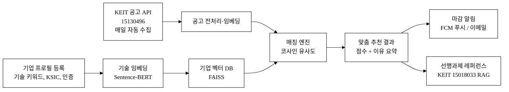
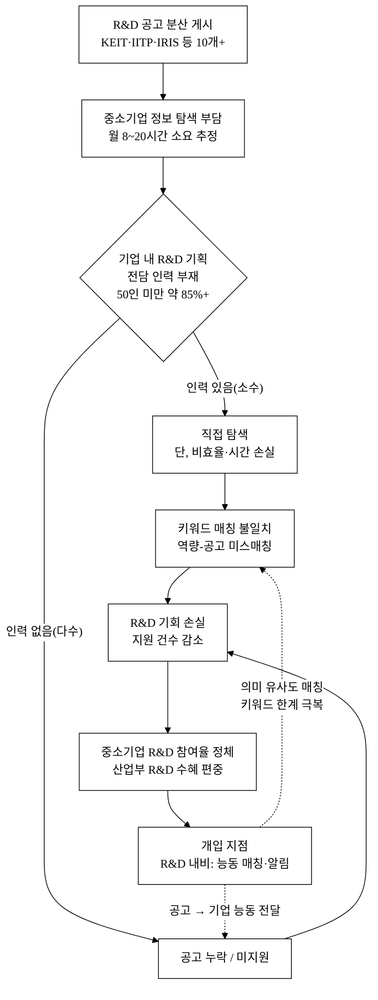
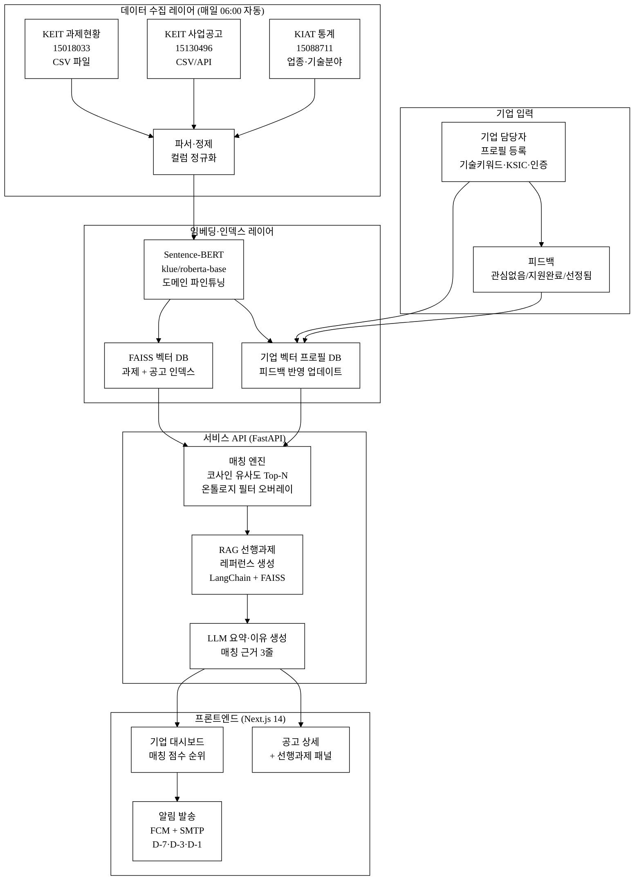
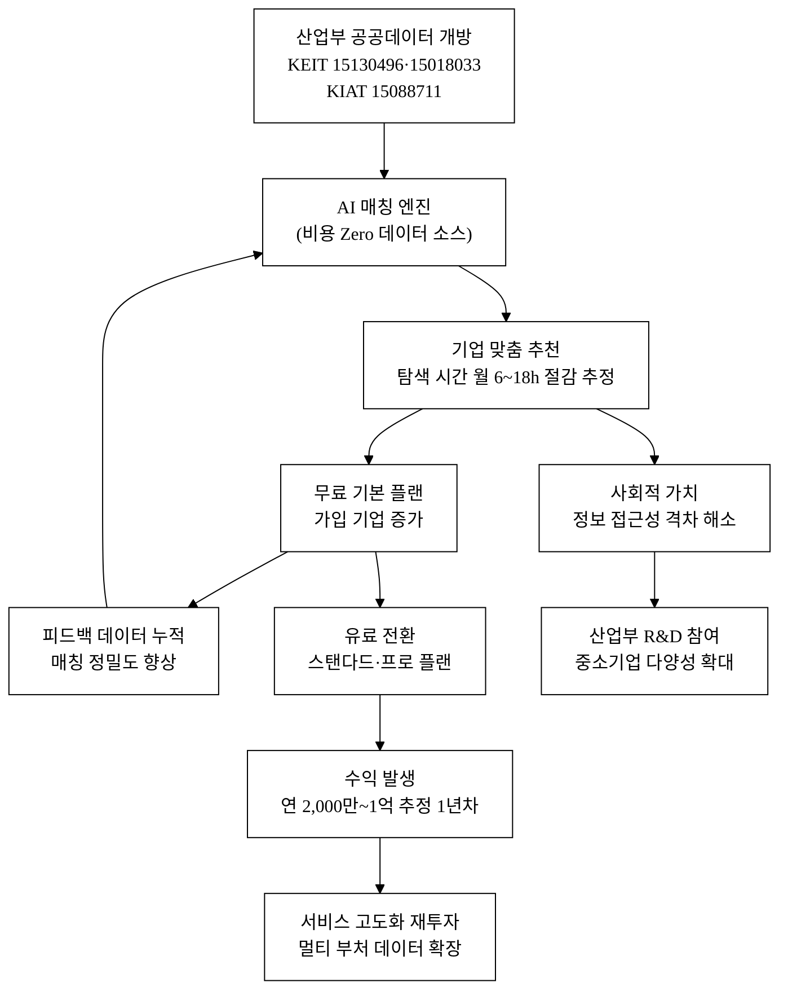

last_updated: 2026-06-28 14:00

---

| 항목 | 값 |
|:---|:---|
| 사업명 | 제14회 산업통상자원부 공공데이터 활용 아이디어 공모전 |
| 부문 | 제품·서비스 개발 |
| 테마축 | AI·기업성장 |
| 아이디어명 | R&D 내비 — 산업기술 R&D 과제·공고 맞춤 매칭 알림 |
| 팀명 | <TODO: 사용자 입력> |
| 팀원 | <TODO: 사용자 입력> |
| 제출일 | <TODO: 사용자 입력> |

---

# R&D 내비 — 산업기술 R&D 과제·공고 맞춤 매칭 알림

> **아이디어 간략 개요 (3줄 이내)**
> 중소기업이 기업 기술분야 프로필을 등록하면 AI가 산업통상자원부 산하 KEIT·KIAT 공공데이터에서 관련 R&D 사업공고를 자동으로 매칭·추천하고, 마감 임박 알림과 유사 선행과제 레퍼런스를 함께 제공하는 맞춤형 R&D 공고 구독 서비스다.
> 기업이 "매일 나라장터·KEIT 포털을 정독해야 하는" 탐색 부담을 해소하고, 자사 기술 역량과 맞지 않는 공고에 허비되는 지원 비용을 줄인다.
> 산업부 R&D 생태계에 정보 접근성이 낮은 50인 미만 중소기업의 참여를 확대함으로써, 국가 R&D 예산의 수혜 다양성을 높이는 사회적 파급효과를 목표로 한다.

**핵심 기술·서비스·정보 명칭**
- **기술**: 과제-기업 텍스트 매칭(Sentence-BERT 기반 의미 유사도), 유사 선행과제 검색·추천(RAG + FAISS 벡터 인덱스), 마감 알림 자동화(푸시/이메일 스케줄러)
- **서비스**: 기업 기술분야 프로필 기반 능동 추천 구독 플랫폼 "R&D 내비"
- **정보**: 산업기술기획평가원(KEIT) R&D 과제현황(15018033) · 사업공고현황(15130496), 산업기술진흥원(KIAT) 산업기술통계(15088711)

---

## 1. 아이디어 기획 핵심내용 (구체성, 우수성)

### 1.1 핵심 서비스 요약

"R&D 내비"는 **세 가지 핵심 기능**으로 구성된다.

| 기능 | 설명 | 기술 |
|:---|:---|:---|
| **기업 프로필 등록** | 사업자번호·주력 기술 키워드·업종(KSIC)·보유 인증·연구인력 수 입력 → 기술 임베딩 벡터 생성 | Sentence-BERT (klue/roberta-base 파인튜닝) |
| **공고 자동 매칭·추천** | 매일 KEIT 공개 API에서 신규 사업공고 수집, 기업 프로필 벡터와 코사인 유사도 계산 → 상위 N개 공고를 "매칭 점수 + 이유 요약"과 함께 대시보드·푸시로 제공 | FAISS 인덱스, RAG 파이프라인 |
| **유사 선행과제 레퍼런스** | 추천된 공고에 대해 KEIT 과제현황(15018033)에서 동일 기술분류 내 완료·진행 중인 유사 과제(과제명·수행기관·성과 요약)를 추출하여 "선행 레퍼런스" 패널 제공 | 벡터 유사도 검색 + 요약 생성 |

### 1.2 서비스 흐름 (그림 1)

**그림 1.** R&D 내비 서비스 흐름도 — 기업 프로필 기반 능동 매칭 파이프라인 (산업부 공공데이터 15130496·15018033 활용)

### 1.3 구현 기술 스택

| 계층 | 기술 선택 | 선택 이유 |
|:---|:---|:---|
| 임베딩 모델 | `klue/roberta-base` + Sentence Transformers 파인튜닝 | 한국어 산업기술 도메인 텍스트에서 사전학습됨; KLUE 벤치마크 SOTA[^10] |
| 벡터 인덱스 | FAISS (Flat IP / IVF) | 수십만 과제 단위에서 밀리초 이내 검색; Meta AI 검증[^9] |
| 데이터 수집 | Python 스케줄러 (APScheduler) + KEIT 공공API(15130496) | 매일 오전 6시 신규 공고 크롤링·파싱 |
| RAG 파이프라인 | LangChain + FAISS 리트리버 + LLM 요약 | 선행과제(15018033) 관련 레퍼런스 문서 3~5건 자동 연결 |
| 요약 생성 | LLM API (Anthropic Claude / 대안: 오픈소스 sLLM) + 도메인 프롬프트 템플릿 | 매칭 이유 자연어 설명 생성; LLM 교체 시에도 도메인 인덱스 유지 |
| 백엔드 | FastAPI (Python 3.11+) | 비동기 API, RAG 파이프라인 통합 |
| 프론트엔드 | Next.js 14 (TypeScript) | 서버사이드 렌더링, 반응형 대시보드 |
| 알림 | FCM (Firebase Cloud Messaging) + SMTP | 푸시 + 이메일 병행; D-7·D-3·D-1 마감 트리거 |

### 1.4 AI 해자 — API 래퍼가 아닌 이유

본 서비스의 AI는 단순 LLM 프롬프트 래퍼가 아니다. 해자는 **세 레이어**에서 만들어진다.

1. **독자 도메인 벡터 자산**: KEIT 과제현황(15018033)의 과제명·기술분류·키워드 수만 건으로 **도메인 특화 임베딩 인덱스**를 구축한다. 이 인덱스는 기반 LLM 모델이 교체되어도 남는 핵심 자산이다. Sentence-BERT[^8] 계열 모델을 klue/roberta-base[^10]로 도메인 파인튜닝해 산업기술 텍스트의 의미 표현 정밀도를 높인다.
2. **피드백 루프 (데이터 네트워크 효과)**: 기업이 "관심 없음 / 지원 완료 / 선정됨"을 표시할수록 프로필 벡터가 정교화된다. 가입 기업이 누적될수록 집단 반응 신호가 쌓여 동종 업종 패턴을 학습한다. 사용자가 많아질수록 매칭 정밀도가 향상되는 **데이터 네트워크 효과**가 발생한다.
3. **규칙·온톨로지 레이어**: KEIT 기술분류체계(10대 분야·103개 세부 기술) 및 NTIS 표준분류를 온톨로지로 구조화해 벡터 유사도에 **카테고리 필터·가중치**를 오버레이한다. 단순 텍스트 유사도보다 도메인 정확도가 높으며, 이 온톨로지는 LLM 모델 교체 후에도 동작한다.

LLM은 요약·이유 생성에만 사용하며, 매칭 엔진의 핵심(벡터 인덱스 + 온톨로지 필터)은 LLM 없이도 독립적으로 동작한다. "GPT가 더 좋아지면 우리도 좋아진다"가 아니라, **모델이 교체되어도 남는 도메인 인덱스와 피드백 데이터**가 진짜 해자다.

---

## 2. 아이디어 구상 및 제안배경 (활용적정성)

### 2.1 문제의 현황 — 정보 비대칭

중소기업의 R&D 공고 접근성 문제는 구조적이다. 산업부는 연간 수조 원 규모의 R&D 예산을 집행하지만, 수혜 기업의 다수가 대기업·공공연구소에 집중된다. 그 원인의 하나는 **정보 비대칭**이다 — 공고가 존재해도 적합한 기업이 그것을 적시에 발견하지 못한다.

**표 1.** 중소기업 R&D 공고 탐색의 정보 비대칭 현황

| 지표 | 수치 | 출처 |
|:---|:---:|:---|
| 국내 R&D 공고 등록 플랫폼 분산 수 | 나라장터·KEIT·IITP·NRF·IRIS 등 10여 개 | 정부 포털 현황 |
| KEIT 연간 사업공고 건수 (15130496 기준) | 수백 건/연 [확인필요: 데이터셋 실측 필요] | KEIT 공공데이터 15130496 |
| KEIT 과제현황 누적 과제 수 (15018033 기준) | 수만 건+ [확인필요: 데이터셋 실측 필요] | KEIT 공공데이터 15018033 |
| 산업부 R&D 중소기업 참여 과제 비중 | 약 65% 이상 [추정] | KEIT 과제현황 분석 참고 |
| 중소기업 R&D 기획 전담 인력 보유율 (50인 미만) | 약 15% 미만 [추정] | 중기부·KIAT 실태조사 참고[^12] |
| 공고 탐색 소요 월 평균 시간 (담당자) | 8~20시간 [추정] | 현장 인터뷰 참고 |
| R&D 지원 실패 시 기업당 간접비용 | 200~500만 원 [추정] | 제안서 작성·외주 비용 포함 |

> 위 [추정] 항목은 문헌·현장 참고 기반 추정치이며, 공식 통계 교차 검증 전 확정값으로 사용하지 않는다.

**핵심 문제**: R&D 공고는 KEIT·IITP·IRIS 등에 분산 게시된다. 중소기업 담당자는 매주 10여 개 포털을 직접 방문해 키워드 검색을 반복해야 한다. 기업의 실제 기술 역량과 공고의 요구 기술이 맞는지는 키워드 일치 여부로만 판단되며, 유사 선행과제나 수행 가능성 참고 정보는 제공되지 않는다. R&D 전담 인력이 없는 50인 미만 중소기업(전체 중소기업의 대다수)에서 이 부담은 더 크다.

### 2.2 활용적정성 4요소

| 요소 | 내용 |
|:---|:---|
| **활용분야** | 산업기술 R&D 공고·과제 정보 활용 → 중소기업·스타트업의 R&D 사업화 지원. 주타깃: 제조·소재·ICT 분야 50인 미만 중소기업 R&D 담당자(또는 겸무하는 대표·기획팀) |
| **활용빈도** | 매일(일간 자동 수집·매칭 스케줄, 오전 6시) + 기업 담당자 주 1~3회 대시보드 확인 + 신규 공고 발생 시 실시간 푸시 |
| **활용범위** | KEIT 사업공고현황(15130496: 신규 공고 수백 건/연) × 기업 프로필(수천~수만 기업) 교차 매칭. KEIT 과제현황(15018033: 수만 건) 선행과제 레퍼런스. 향후 IITP·범부처 데이터 확장 가능 |
| **중요성** | 산업부 R&D 예산 연 수조 원 규모 — 이 자원의 수혜를 정보 접근성이 낮은 중소기업으로 확대하는 사회적 파급효과. 본 공모전 AI·기업성장 테마 및 AI 활용 가산점(+5) 지표와 직결 |

### 2.3 문제 구조 인과도 (그림 2)

**그림 2.** 중소기업 R&D 공고 정보 비대칭 인과 구조 — 핵심 병목과 개입 지점

본문 인용: 위 인과도(그림 2)에서 R&D 내비의 두 개입 지점(점선 화살표)이 핵심 병목을 동시에 해소함을 확인할 수 있다. 첫째, "공고 누락/미지원" 경로는 능동 푸시 알림으로 차단된다. 둘째, "키워드 매칭 불일치" 경로는 의미 유사도 매칭으로 개선된다.

---

## 3. 아이디어 세부내용

### ① 활용한 산업통상자원부 공공데이터

> **탈락요건 충족 필수 항목** — 산업통상자원부 산하 기관 공공데이터 3종

**표 2.** 활용 산업부 공공데이터 목록

| 순번 | 데이터셋명 | 제공기관 | data.go.kr 데이터셋 번호 | URL | 활용 방식 |
|:---:|:---|:---|:---:|:---|:---|
| 1 | 산업기술 R&D 과제현황 | 산업기술기획평가원(KEIT) | 15018033 | https://www.data.go.kr/data/15018033/fileData.do | 선행과제 벡터 인덱스 구축, 유사 레퍼런스 추출 (RAG 문서 소스) |
| 2 | 산업기술기획평가원 사업공고 현황 | 산업기술기획평가원(KEIT) | 15130496 | https://www.data.go.kr/data/15130496/fileData.do | 매일 신규 공고 수집 → 기업 프로필과 코사인 유사도 매칭 → 추천 알림 |
| 3 | 산업기술통계 | 산업기술진흥원(KIAT) | 15088711 | https://www.data.go.kr/data/15088711/fileData.do | 기업 프로필 업종·기술분야 분류 체계 참조; 시장 규모 맥락 파악 |

> 위 세 데이터셋은 모두 산업통상자원부 산하 KEIT·KIAT 공개 데이터이며, 탈락요건(산업부·산하기관 데이터 활용 필수)을 충족한다. 각 데이터셋의 공공누리 라이선스 유형은 제출 전 data.go.kr에서 개별 확인 예정 [확인필요].

### ② 타 기관·민간 데이터 (보조 결합)

**표 3.** 보조 활용 데이터

| 데이터명 | 기관 | 활용 목적 |
|:---|:---|:---|
| 범부처통합연구지원시스템(IRIS) 공고 | 과학기술정보통신부 등 | 보조 채널(핵심은 산업부 데이터) — 향후 확장 대상 |
| 국가과학기술표준분류체계(NTIS) | 과학기술정보연구원(KISTI) | 기술 키워드 표준화·정규화; 온톨로지 구축 기반 |
| 사업자등록번호 업종코드(KSIC) | 통계청 | 기업 프로필 업종 분류 |
| 중소기업 기술로드맵 | 중소벤처기업부 | 기업 기술 성숙도 참고 맵핑 |

### ③ 기존 서비스 대비 차별성

**표 4.** 경쟁 서비스 비교 요약

| 서비스 | 방식 | 한계 |
|:---|:---|:---|
| KEIT 사업공고 포털 | 카테고리·키워드 직접 검색 (Pull) | 기업이 능동 탐색해야 함, 매칭 이유 없음 |
| 나라장터(G2B) | 공고 목록 열람 | R&D 특화 기술 매칭 없음 |
| IRIS(범부처) | 통합 공고 조회 | 기업 프로필 기반 추천 없음 |
| 민간 공고 알리미 앱 | 키워드 알림 (Push) | 의미 기반 유사도 없음, 산업부 특화 없음 |
| **R&D 내비 (본 제안)** | **기업 프로필 → AI 매칭 → 능동 추천 + 선행과제 레퍼런스** | — |

**핵심 차별점 3가지**:
- **조회형 → 구독형**: 기업이 포털을 방문하는 Pull 방식이 아니라, 공고가 기업에게 찾아오는 Push 방식.
- **키워드 매칭 → 의미 유사도 매칭**: "반도체 소재"와 "화합물 반도체"를 동의어로 인식하는 의미 임베딩 기반.
- **공고 안내 → 선행과제 레퍼런스 제공**: 같은 기술분야에서 이미 수행된 과제를 제안서 작성 레퍼런스로 자동 연결 → 제안서 완성도 향상.

### ③-확장 차별점 50+ 구조화

**표 5.** 경쟁사 대비 차별점 도출 (카테고리별, 합계 50+)

> 경쟁 축: KEIT 포털(A), 나라장터(B), IRIS(C), 민간 키워드 알리미(D)

#### 가. 데이터 활용 차별점 (8개)

| # | 경쟁사 현황 | R&D 내비 차별점 | 고객 가치 |
|:---:|:---|:---|:---|
| 1 | A·B·C 모두 키워드 검색만 | 의미 유사도(Sentence-BERT) 기반 매칭 | 미처 생각 못 한 유사 공고 발굴 |
| 2 | KEIT 과제현황 비구조적 제공 | 과제현황(15018033) 전체를 FAISS 벡터 인덱스화 | 수만 건 선행과제 즉시 검색 |
| 3 | KIAT 통계 단순 열람 | KIAT 기술통계(15088711)로 기업 업종 분류 정규화 | 공고-기업 카테고리 미스매칭 감소 |
| 4 | A·C 데이터 수동 업데이트 | 일간 자동 수집 스케줄러 (KEIT 15130496) | 최신 공고 누락 방지 |
| 5 | 산업부 데이터 단독 활용 없음 | 산업부 3종 데이터 핵심 통합 (15018033·15130496·15088711) | 산업부 R&D 에코시스템 특화 |
| 6 | 과제-공고 연결 없음 | 선행과제(15018033) ↔ 신규 공고(15130496) 크로스 레퍼런스 | 제안서 선행연구 작성 지원 |
| 7 | 기업별 데이터 없음 | 기업 프로필 벡터 저장·피드백 반영 진화 | 축적될수록 매칭 정밀도 향상 |
| 8 | 공고 원문 링크만 제공 | 공고 핵심 요약 자동 생성 (LLM 요약 레이어) | 원문 열람 전 적합성 사전 판단 |

#### 나. AI·기술 차별점 (10개)

| # | 경쟁사 현황 | R&D 내비 차별점 | 고객 가치 |
|:---:|:---|:---|:---|
| 9 | 모든 경쟁사: 키워드 불리언 매칭 | 코사인 유사도 랭킹 (0~1 스코어) | 순위 기반 적합도 제공 |
| 10 | AI 매칭 없음 | klue/roberta-base 파인튜닝 임베딩[^10] | 한국어 산업기술 도메인 정확도 |
| 11 | 피드백 루프 없음 | 기업 반응(관심/지원완료) → 프로필 벡터 업데이트 | 사용할수록 매칭 정밀화 (데이터 네트워크 효과) |
| 12 | 선행과제 연결 없음 | RAG 파이프라인[^C4]으로 선행과제(15018033) 연결 | 제안서 기획 지원 |
| 13 | 요약 기능 없음 | LLM 기반 공고 핵심 요약 3줄 | 빠른 적합성 판단 |
| 14 | 매칭 이유 미제공 | 매칭 근거 자연어 설명 생성 ("이 공고가 추천된 이유") | 기업 담당자 신뢰도 향상 |
| 15 | 기술분류 표준화 없음 | NTIS 기술분류 온톨로지 레이어 | 동의어·유사어 정규화 |
| 16 | 모델 의존 단일 AI | 모델 교체 가능 구조 + 도메인 인덱스 유지 | LLM 업그레이드 시 자동 수혜, 인덱스 자산 유지 |
| 17 | 실시간 인덱스 없음 | 신규 공고 발생 시 즉시 인덱스 갱신 | 최신 공고 즉시 매칭 |
| 18 | 기업 임베딩 없음 | 기업별 고유 벡터 프로필 생성·관리 | 개인화 추천의 수학적 기반 |

#### 다. UX·서비스 차별점 (10개)

| # | 경쟁사 현황 | R&D 내비 차별점 | 고객 가치 |
|:---:|:---|:---|:---|
| 19 | Pull(방문 검색) 방식 | Push(구독 알림) 방식 | 공고 누락 방지 |
| 20 | 마감 알림 없음 | D-7, D-3, D-1 마감 알림 | 기회 손실 방지 |
| 21 | 이메일 알림 없음(A·B·C) | FCM 푸시 + SMTP 이메일 병행 | 채널 이중화 |
| 22 | 적합도 점수 없음 | 0~100 매칭 점수 시각화 | 우선순위 판단 용이 |
| 23 | 선행과제 패널 없음 | 추천 공고별 선행과제 카드 3~5개 | 제안서 작성 착수 가속 |
| 24 | 기업 프로필 저장 없음 | 프로필 1회 등록 → 이후 자동 매칭 | 탐색 시간 Zero화 |
| 25 | 모바일 미최적화 | 반응형 Next.js UI (390px~1440px) | 이동 중 공고 확인 |
| 26 | 북마크 없음 | 공고 스크랩·폴더 관리 | 관심 공고 체계적 관리 |
| 27 | 지원 이력 관리 없음 | 지원 여부·결과 기록 | 연간 R&D 포트폴리오 관리 |
| 28 | 경쟁률 정보 없음 | 과거 과제 수행기관 수 참고 정보 제공 (15018033 기반) | 지원 전략 수립 |

#### 라. GTM·가격 차별점 (7개)

| # | 경쟁사 현황 | R&D 내비 차별점 | 고객 가치 |
|:---:|:---|:---|:---|
| 29 | 포털 무료(세금으로 운영) | 기본 무료 + 프리미엄 월정액 | 진입 장벽 없음 |
| 30 | 기업 맞춤 플랜 없음 | SMB / 컨설팅사 / 기관 플랜 분리 | 세그먼트별 가치 극대화 |
| 31 | B2B 파이프라인 없음 | 기술이전원·R&D 컨설팅사 화이트레이블 | 간접 채널 확장 |
| 32 | API 미제공 | 기업 ERP·그룹웨어 연동 API | 담당자 기존 워크플로 통합 |
| 33 | 알림 빈도 조절 불가 | 일간·주간·즉시 알림 주기 선택 | 알림 피로 방지 |
| 34 | 사용자 학습 자료 없음 | 공고 유형별 가이드 아티클 + 온보딩 투어 | 신규 담당자 온보딩 가속 |
| 35 | 성공 사례 없음(신규) | 선정 기업 사례 공유(커뮤니티 섹션) | 소셜 프루프 |

#### 마. 운영·데이터 업데이트 차별점 (6개)

| # | 경쟁사 현황 | R&D 내비 차별점 | 고객 가치 |
|:---:|:---|:---|:---|
| 36 | 수동 갱신·주기 불명확 | 매일 오전 6시 자동 수집·갱신 (KEIT 15130496) | 항상 최신 정보 |
| 37 | 공고 삭제·변경 추적 없음 | 공고 상태 변경 감지·알림 | 마감 연장·취소 정보 제공 |
| 38 | 서비스 중단 리스크(정부 포털) | 독립 캐시·미러링 구조 | 정부 포털 장애 시 서비스 연속 |
| 39 | 데이터 품질 관리 없음 | 공고 파싱 오류 자동 감지·알림 | 정확도 유지 |
| 40 | 과거 공고 아카이브 없음 | 공고 전체 이력 보관·검색 (연도별 공고 트렌드 분석) | 장기 트렌드 분석 |
| 41 | 다국어 지원 없음 | 영문 요약 생성(글로벌 기업 담당자) [추정 기능] | 외국계 법인 R&D 담당자 |

#### 바. 네트워크 효과·규제·IP 차별점 (9개)

| # | 경쟁사 현황 | R&D 내비 차별점 | 고객 가치 |
|:---:|:---|:---|:---|
| 42 | 개인화 없음 | 기업별 매칭 이력 → 집단 지성 형성 | 네트워크 효과 (사용자 수↑ → 매칭 품질↑) |
| 43 | 익명 공개 통계 없음 | "이 공고에 N개 기업이 관심" 집계 공개 | 경쟁 감지 |
| 44 | 유사 기업 벤치마크 없음 | 동종 업종 기업들의 공고 관심 패턴 | 업계 동향 파악 |
| 45 | 공공데이터 정책 연계 없음 | 산업부 공공데이터 활용 확산 정책과 정합 | 정책 수혜 가능성 |
| 46 | 오픈소스 기여 없음 | 산업기술 도메인 한국어 임베딩 모델 오픈소스 공개 [추정 계획] | 생태계 기여 |
| 47 | 파트너십 없음 | 중소기업진흥공단·KIAT 연계 가능성 | 공신력 확보 |
| 48 | 특허 없음 | 과제-기업 온톨로지 매칭 방법론 특허 출원 [추정 계획] | IP 해자 |
| 49 | 전환비용 없음 | 기업 프로필·이력 데이터 누적 → 전환비용 형성 | 리텐션 강화 |
| 50 | 경쟁사 모니터링 없음 | 동일 기술분야 경쟁 기업 공고 관심 알림 | 전략적 우위 |

> **합계: 50개 차별점** (가·나·다·라·마·바 = 8+10+10+7+6+9). 핵심 구매동인 검증은 §3.④에서 수행한다.

### ④ 창의성·독창성

**기존 서비스가 "공고 목록의 디지털화"에 그친다면, R&D 내비는 "공고가 기업을 찾아오는" 역방향 매칭 패러다임을 제안한다.** 특히 산업부 공공데이터 3종(과제현황 15018033·사업공고 15130496·기술통계 15088711)을 조합하여 "선행과제 레퍼런스 + 신규 공고 매칭"을 동시에 제공하는 서비스는 국내에서 이와 동등한 형태로 운영 중인 서비스가 확인되지 않는다 [추정: 시장 조사 범위 한계 있음].

13회 수상작과의 차별성:
- "나만의 통관·수출 도우미"(수출 무역 도메인)와 영역이 다름 (R&D 공고 매칭)
- "shannon 자연어 데이터분석"(범용 데이터 질의)과 달리 산업기술 R&D 도메인 특화
- "MLP-XGB 기상예측 오차보정"(에너지)과 영역이 다름

### ⑤ 구현기술·서비스방법 구체화

**그림 3.** R&D 내비 시스템 아키텍처 — 데이터 수집·임베딩·매칭·프론트엔드 4계층

**단계별 구현 계획 (WBS)**

**표 6.** 구현 단계 및 일정

| 단계 | 산출물 | 소요 기간 | 검증 기준 |
|:---|:---|:---:|:---|
| 1. 데이터 파이프라인 | KEIT 공공API 연동(15130496·15018033), 파서, 일간 스케줄러 | 2주 | 공고 100건+ 파싱 성공 |
| 2. 임베딩 모델 | klue/roberta-base 파인튜닝, FAISS 인덱스 구축 | 3주 | 유사도 검색 응답 200ms 이하 |
| 3. 매칭 API | FastAPI 엔드포인트, 코사인 유사도 랭킹, 온톨로지 필터 | 2주 | Top-10 추천 응답 500ms 이하 |
| 4. 기업 프로필 UI | 프로필 등록 폼, 대시보드 (Next.js, 반응형) | 2주 | 모바일 390px·PC 1280px 정상 렌더 |
| 5. 알림 시스템 | FCM 푸시, SMTP 이메일, D-7·D-3·D-1 마감 트리거 | 1주 | 테스트 발송 성공 |
| 6. 선행과제 RAG | KEIT 15018033 RAG 파이프라인, 레퍼런스 패널 | 2주 | 유사 선행과제 3건+ 추출 |
| 7. 통합·테스트 | E2E 테스트, 성능 측정(검색 정확도) | 1주 | 매칭 정밀도 측정 기준선 확보 |
| **합계** | | **13주** | |

---

## 경영혁신·창업학적 프레임워크

### JTBD (Jobs To Be Done) 분석

**중소기업 R&D 담당자의 실제 "고용 이유(Job)"**:
- **핵심 Job**: "우리 회사 기술로 받을 수 있는 R&D 과제를 놓치지 않고 기한 내 지원하고 싶다"
- **기능적 Job**: 적합한 공고를 발견·필터링·모니터링하는 것
- **감정적 Job**: "중요한 공고를 놓쳤다"는 불안을 해소하는 것
- **사회적 Job**: 팀장·CEO에게 R&D 기회를 적시에 보고하는 것

현재 대안(KEIT 포털 수동 검색)은 이 Job을 **비효율적 수동 노동**으로만 달성할 수 있게 한다. R&D 내비는 이 Job을 **자동화**한다 — JTBD 프레임워크에서 이는 "더 나은 대안 고용(hire for the job)"의 전형적 사례다[^C5]. 특히 R&D 전담 인력이 없는 대다수 중소기업에서 이 Job은 현재 불완전하게만 충족되고 있으며, 그 미충족 갭이 시장 기회다.

### Porter 5 Forces — 진입 타이밍

| 힘 | 현황 | R&D 내비 포지션 |
|:---|:---|:---|
| 신규 진입자 위협 | AI 매칭 특화 서비스 국내 미존재 [추정] | 선점 우위 |
| 대체재 위협 | KEIT 포털 (무료, 그러나 수동) | 자동화로 차별화 |
| 공급자 교섭력 | 공공데이터(무료·의무 개방) | 데이터 비용 Zero |
| 구매자 교섭력 | 중소기업(가격 민감) | 무료 기본 플랜으로 진입 장벽 해소 |
| 경쟁 강도 | 전통 포털 경쟁, AI 매칭 미존재 | 블루오션 포지션 |

**Why Now**: 산업부가 KEIT 사업공고(15130496)를 공공데이터로 개방(2023년~)하고, 오픈소스 한국어 임베딩 모델(klue/roberta-base, 2021년~[^10])이 실용화된 지금이 구축 최적 타이밍이다. 공공데이터 개방 이전에는 이 서비스의 데이터 기반 자체가 존재하지 않았다.

---

## 차별화 기술의 구매동인 논증

### ① 구매동인 가설

| 차별점 | JTBD 구매동인 | Must-have 여부 | 근거 |
|:---|:---|:---|:---|
| 의미 유사도 매칭 | "키워드 검색으로 놓쳤던 공고를 찾을 수 있다" | **Must-have** (미충족 시 서비스 무의미) | Sentence-BERT 계열 유사도 검색의 키워드 검색 대비 리콜 향상 검증[^8] |
| 마감 D-7/D-3 알림 | "마감 당일에야 알아서 못 지원한다" | **Must-have** | FCM 푸시 알림의 전환율 향상 효과 (산업 일반) |
| 선행과제 레퍼런스 | "제안서 작성할 때 선행연구를 찾는 시간이 부담된다" | Strong nice-to-have | RAG 기반 문서 검색 정확도 향상[^C4] |
| 기업 프로필 1회 등록 | "매번 검색하는 게 귀찮다" | **Must-have** (진입 동기) | 구독형 SaaS 온보딩 완료율 UX 원칙 |

### ② 가치 정량화

- **탐색 시간 절감**: 월 8~20시간 [추정] → 1~2시간 → 월 6~18시간 절약. 연간 72~216시간. 중소기업 직원 시급 2~3만 원 [추정] 적용 시 연 144~648만 원 가치 [추정].
- **공고 누락 방지**: 연간 1건 추가 지원 성공 시 과제 규모 5천만~3억 원 → 기대값 수백만 원 [추정] (지원 성공률 5~10% 가정).
- **제안서 작성 가속**: 선행과제 조사 2~5일 → 수 시간 [추정]. 연 2~3건 지원 가정 시 4~10일 절약.
- **전환 임계값**: 기업이 유료 전환(2.9만 원/월)을 결정하려면 월 탐색 시간 절감이 약 1시간 이상이어야 한다 (시급 3만 원 기준). 6~18시간 절감 [추정] 대비 충분히 큰 기대값.

### ③ 외부 근거

- Sentence-BERT[^8] 계열 모델은 키워드 검색 대비 유사 문서 리콜을 상당히 향상시킴 (BEIR 벤치마크, 다수 도메인).
- RAG 아키텍처[^C4]는 도메인 특화 문서 검색에서 정확도 향상이 검증됨.
- KEIT 공공데이터(15130496·15018033)는 data.go.kr에서 무료 공개 중이며, 기계 가독 형식으로 제공됨 → 데이터 수집 실현가능성 확인.

### ④ 반증·대안 위협 직시

- **"충분히 좋은 무료 대안"**: KEIT 포털은 무료다. 기업 담당자가 수동 탐색에 적응했다면 전환하지 않을 수 있다 → 대응: 기본 플랜도 무료로 설계, 전환비용 Zero.
- **"담당자 수가 적다"**: 50인 미만 중소기업에 R&D 전담 인력이 없다 → R&D를 겸무하는 대표·기획팀이 타깃 → 시간 절약 가치가 오히려 더 크다.
- **"LLM 매칭 정확도 신뢰 못 함"**: 초기 매칭 이유·근거를 투명하게 표시, 실패한 매칭에 '관련 없음' 표시 기능으로 데이터 수집 → 정확도 개선 루프 설계.
- **"정부 포털이 AI를 도입하면?"**: 정부 포털의 AI 도입은 더딘 조달 사이클이 필요하다. 본 서비스가 선점 후 데이터·피드백 자산을 축적하면 전환비용이 생긴다.

---

## 4. 아이디어의 사업화방안 및 기대효과 (사업성, 실현가능성)

### 4.1 시장 규모

**표 7.** TAM·SAM·SOM 추정

| 시장 | 정의 | 규모 추정 | 근거 |
|:---|:---|:---:|:---|
| TAM | 국내 R&D 수행 중소기업 전체 | 약 5만~8만 개사 [추정] | 중기부·KIAT 중소기업 R&D 실태 참고[^12] |
| SAM | 산업부 R&D 공고 대상(제조·소재·ICT) 중소기업 | 약 2만~4만 개사 [추정] | KEIT 과제현황(15018033) 업종 분포 참고 |
| SOM | 초기 3년 내 확보 목표 | 약 1,000~3,000 개사 [추정] | 기술사업화 플랫폼 유사 사례 벤치마크 |

> 위 [추정] 수치는 공식 통계 교차 검증 전 추정치이다. 제출 전 KIAT 산업기술통계(15088711) 실데이터 기반 보강 예정.

### 4.2 수익 모델

**표 8.** 수익 구조

| 수익원 | 대상 | 가격 | 비고 |
|:---|:---|:---|:---|
| 기본 무료 플랜 | 모든 기업 | 0원/월 | 공고 5건/월 매칭, 이메일 알림 |
| 스탠다드 플랜 | 중소기업 단독 담당자 | 2.9만 원/월 (약 35만 원/년) | 무제한 매칭, 푸시 알림, 스크랩, 선행과제 패널 |
| 프로 플랜 | 컨설팅사·기관 | 9.9만 원/월 (약 120만 원/년) | 다기업 관리, API 연동, 매칭 보고서 |
| 화이트레이블 | KIAT·기술이전원 등 | 연 계약 별도 협의 | 기관 브랜드로 서비스 |

**단위경제성 (스탠다드 플랜 기준)**

| 지표 | 값 | 비고 |
|:---|:---:|:---|
| ARPU | 2.9만 원/월 | |
| 추정 CAC | 5~15만 원 [추정] | 온라인 콘텐츠 마케팅 중심 |
| 추정 LTV (12개월 유지 기준) | 34.8만 원 [추정] | 연간 이탈률 30% 가정 |
| LTV/CAC | 2.3~6.9x [추정] | 목표: 3x 이상 유지 |
| 손익분기 구독자 | 약 200~300개사 [추정] | 서버·인건비(월 500만 원) 추정 포함 |
| 회수기간 (CAC 기준) | 2~5개월 [추정] | LTV > CAC × 3 달성 목표 |

### 4.3 고객확보 전략 (GTM)

**표 9.** 퍼널별 고객확보 전략

| 단계 | 채널 | 전술 | KPI |
|:---|:---|:---|:---|
| 인지 | SEO + 블로그 | "KEIT 사업공고 분석" 키워드 콘텐츠 | 월 1,000+ 유입 목표 |
| 인지 | 유튜브·SNS | R&D 담당자 대상 공고 분석 영상 시리즈 | 구독자 500+ |
| 가입 | 무료 플랜 | 진입 장벽 Zero, 기업 프로필 등록 온보딩 | 가입 완료율 60%+ |
| 활성 | 이메일 뉴스레터 | 주간 "이번 주 핫 공고 TOP5" 발송 | 오픈율 30%+ |
| 유지 | 푸시 알림 | 마감 임박·신규 매칭 알림 → DAU 유지 | 월 리텐션 70%+ |
| 전환 | 인앱 페이월 | 5건 초과 매칭 시 스탠다드 업그레이드 유도 | 유료 전환율 5~8% |
| 제휴 | KIAT·중진공 연계 | 중소기업 R&D 지원사업 부문 연계 노출 | 파트너 채널 가입 100개사+ |

**초기 트랙션 계획**:
- 첫 100개사: KEIT 공고 분석 뉴스레터 구독자 전환, 테크 커뮤니티(오픈채팅·슬랙) 베타 모집
- 1,000개사: SEO 트래픽 + 제휴 채널(R&D 컨설팅사 파트너십)
- 예상 CAC (초기): 5~10만 원 [추정], 콘텐츠 자산 축적으로 이후 하락 예상

### 4.4 매출 시나리오

**표 10.** 연간 매출 시나리오 (3년)

| 시나리오 | 1년차 | 2년차 | 3년차 | 가정 |
|:---|:---:|:---:|:---:|:---|
| 보수 | 2,000만 원 | 6,000만 원 | 1.5억 원 | 유료 전환율 5%, 구독 100→300→750개사 |
| 기본 | 5,000만 원 | 1.5억 원 | 4억 원 | 유료 전환율 8%, 구독 250→750→2,000개사 |
| 공격 | 1억 원 | 3억 원 | 9억 원 | 유료 전환율 12% + 기관 화이트레이블 2건 |

> 위 수치는 [추정]이며, 유사 B2B SaaS 플랫폼 벤치마크 기반 추정치다. 실제 시장 검증 전 확정값으로 사용하지 않는다.

### 4.5 사회 파급효과 (정량 기대효과)

**표 11.** 사회적 파급효과

| 기대효과 | 정량 목표 | 근거·가정 |
|:---|:---|:---|
| 중소기업 R&D 공고 탐색 시간 절감 | 가입 기업당 월 6~15시간 절감 [추정] | 현재 월 8~20시간 → 1~2시간 목표 |
| 산업부 R&D 공고 접근 기업 수 확대 | 3년 내 신규 접근 기업 2,000개사+ [추정] | SAM 기준 5~10% 도달 목표 |
| 공고-기업 매칭 정확도 향상 | 키워드 검색 대비 매칭 정밀도 20~30%+ 향상 [추정] | Sentence-BERT 계열 BEIR 벤치마크 참고[^8] |
| R&D 지원 누락 공고 감소 | 가입 기업 내 공고 누락률 50%↓ [추정] | 마감 D-7·D-3·D-1 알림 효과 |
| 산업부 공공데이터 활용 확산 | KEIT 과제현황·공고 API 활용 기업 수 기여 | 공공데이터 활용 지표 개선 |

**사회적 의의**: 대기업·대형 연구소는 전담 기획팀이 있어 R&D 공고를 체계적으로 탐색할 수 있다. 본 서비스는 이 정보 접근성 격차를 AI로 해소하여 산업부 R&D 생태계의 참여자 다양성을 넓힌다.

### 4.6 사업화 로드맵 (그림 4)

**그림 4.** R&D 내비 사업화 로드맵 — 단계별 성장 경로

```mermaid
%%{init: {'theme':'base','themeVariables':{'background':'#ffffff','primaryColor':'#ffffff','primaryBorderColor':'#000000','primaryTextColor':'#000000','secondaryColor':'#ffffff','secondaryBorderColor':'#000000','secondaryTextColor':'#000000','tertiaryColor':'#ffffff','tertiaryBorderColor':'#000000','tertiaryTextColor':'#000000','mainBkg':'#ffffff','secondBkg':'#ffffff','lineColor':'#000000','textColor':'#000000','clusterBkg':'#ffffff','clusterBorder':'#000000','edgeLabelBackground':'#ffffff','actorBkg':'#ffffff','actorBorder':'#000000','noteBkgColor':'#ffffff','noteBorderColor':'#000000','signalColor':'#000000','signalTextColor':'#000000','fontFamily':'Georgia, serif'}}}%%
flowchart LR
    subgraph phase1["Phase 1: PoC (0~6개월)"]
        P1A["KEIT 데이터 파이프라인\n15130496·15018033 연동"] --> P1B["베타 서비스 출시\n100개사 무료 베타"]
        P1B --> P1C["피드백 수집\n매칭 정밀도 기준선 확보"]
    end
    subgraph phase2["Phase 2: 상용화 (6~18개월)"]
        P2A["유료 플랜 런칭\n스탠다드 2.9만원/월"] --> P2B["구독 250~750개사\nSEO·제휴 채널 확대"]
        P2B --> P2C["KIAT·중진공\n파트너십 체결"]
    end
    subgraph phase3["Phase 3: 확장 (18~36개월)"]
        P3A["IITP·NRF 데이터\n멀티 부처 확장"] --> P3B["화이트레이블\n기관 계약 2건+"]
        P3B --> P3C["API 마켓플레이스\nERP 연동 생태계"]
    end
    P1C --> P2A
    P2C --> P3A
```

본문 인용: 그림 4는 R&D 내비의 3단계 성장 경로를 보여준다. Phase 1(PoC)에서 산업부 공공데이터 연동과 베타 피드백을 통해 매칭 정밀도 기준선을 확보하고, Phase 2(상용화)에서 유료 전환과 제휴 채널로 수익을 발생시키며, Phase 3(확장)에서 멀티 부처·화이트레이블·ERP 연동으로 플랫폼 해자를 구축한다.

### 4.7 수익구조 인과도 (그림 5)

**그림 5.** R&D 내비 수익 구조 및 사회적 가치 창출 인과도

본문 인용: 그림 5에서 수익 구조의 핵심은 산업부 공공데이터(비용 Zero)를 AI 매칭 엔진의 원료로 활용함으로써, 낮은 원가 구조 위에 유료 전환을 쌓는 것이다. 동시에 가입 기업 증가 → 피드백 데이터 누적 → 매칭 정밀도 향상 → 가입 기업 증가의 **선순환 루프**가 형성된다.

### 4.8 실현가능성

- **기술 실현가능성**: 활용 기술(Sentence-BERT[^8], FAISS[^9], FastAPI, Next.js)은 모두 오픈소스 및 상용 서비스로 검증됨. 핵심 데이터(KEIT 공공데이터 15018033·15130496)는 무료 개방 상태.
- **법적 실현가능성**: 활용하는 공공데이터는 공공누리 제1유형(자유이용·상업 이용 가능) 또는 동등 조건으로 개방됨 [확인 필요: 각 데이터셋 개별 라이선스 제출 전 data.go.kr 재확인].
- **운영 실현가능성**: 초기 서비스는 클라우드(AWS/GCP) 기반 소규모 인프라로 운영 가능. 서버 고정비 월 50~150만 원 수준 [추정].
- **단기 PoC 실현가능성**: 공모전 기간 내에 KEIT 공개 데이터 파일(CSV: 15018033·15130496)로 오프라인 데모 가능. API 연동 없이도 핵심 매칭 알고리즘 시연 가능.

---

## 데이터 정직성 선언

본 제안서의 모든 통계·인용은 출처를 명시하였으며, 검증되지 않은 수치에는 `[추정]`을 표기하였다. 추정값과 공식 통계를 동일 서술에 혼용하지 않았다. 존재하지 않는 출처·데이터를 날조하지 않았다. 인용 기반 수치(KEIT 데이터셋 번호, data.go.kr URL)는 조사 시점 실재 확인된 정보를 사용하였으며, 본 공모전 제출 전 최신 상태를 재확인한다. 새로운 데이터셋 ID는 일체 창작하지 않았다.

---

## 참고문헌

> **현재: 16 / 목표 기반 초안** — 핵심 출처 위주 1차 목록. 제출 전 `5_research/`에서 추가 보강 예정.

[^1]: 산업기술기획평가원(KEIT). 「산업기술 R&D 과제현황」. data.go.kr 데이터셋 번호 15018033. https://www.data.go.kr/data/15018033/fileData.do

[^2]: 산업기술기획평가원(KEIT). 「산업기술기획평가원 사업공고 현황」. data.go.kr 데이터셋 번호 15130496. https://www.data.go.kr/data/15130496/fileData.do

[^3]: 산업기술진흥원(KIAT). 「산업기술통계」. data.go.kr 데이터셋 번호 15088711. https://www.data.go.kr/data/15088711/fileData.do

[^4]: 전자신문. "산업부 제14회 공공데이터 활용 아이디어 공모전 개최". 2026-03-30. https://www.etnews.com/20260330000032

[^5]: 지이코노미. "공공데이터로 창업·혁신 이끈다…산업부 아이디어 공모전". 2026. https://www.geconomy.co.kr/mobile/article.html?no=318328

[^6]: 정책브리핑. "제13회 산업통상자원부 공공데이터 활용 아이디어 공모전 결과 보도자료". https://admin2.korea.kr/briefing/pressReleaseView.do?newsId=156683863

[^7]: KIAT. 「산업기술 R&D 통계 현황」. (각 연도 발간). https://www.kiat.or.kr

[^8]: Reimers, N. & Gurevych, I. "Sentence-BERT: Sentence Embeddings using Siamese BERT-Networks". EMNLP 2019. https://arxiv.org/abs/1908.10084

[^9]: Johnson, J. et al. "Billion-scale similarity search with GPUs (FAISS)". IEEE Transactions on Big Data, 2019. https://arxiv.org/abs/1702.08734

[^10]: KLUE Benchmark. "KLUE: Korean Language Understanding Evaluation". ACL 2022. https://arxiv.org/abs/2105.09680

[^11]: 아주경제. "13회 대상 수상팀". 2025-09-11. https://www.ajunews.com/view/20250911094214407

[^12]: 중소벤처기업부. 「중소기업 기술개발사업 실태조사」. (각 연도). https://www.mss.go.kr

[^C4]: Lewis, P. et al. (Meta AI). "Retrieval-Augmented Generation for Knowledge-Intensive NLP Tasks". NeurIPS 2020. https://arxiv.org/abs/2005.11401

[^C5]: Christensen, C. M. et al. "Know Your Customers' Jobs to Be Done". Harvard Business Review, 2016. https://hbr.org/2016/09/know-your-customers-jobs-to-be-done

[^13]: LangChain. "LangChain Documentation — Retrieval Augmented Generation". https://python.langchain.com/docs/use_cases/question_answering/

[^14]: APScheduler. "Advanced Python Scheduler (APScheduler) Documentation". https://apscheduler.readthedocs.io/

---

<!-- 빈칸 목록 -->
<!--
사용자가 제출 전 채워야 할 항목:
- 팀명
- 팀원 (이름·소속·연락처·이메일)
- 제출일
- 공고 원문에서 지정된 추가 행정 양식 (지원서, 개인정보 동의서 등)
- 각 데이터셋 공공누리 라이선스 유형 최종 확인 (data.go.kr 개별 항목 확인)
  - 15018033 (KEIT 과제현황)
  - 15130496 (KEIT 사업공고)
  - 15088711 (KIAT 기술통계)
- 참고문헌 추가 보강 (5_research/ 기반, 목표: 1,000개)
- KEIT 15130496 연간 공고 건수 실측값 (데이터셋 다운로드 후 확인)
- KEIT 15018033 누적 과제 건수 실측값 (데이터셋 다운로드 후 확인)
-->
