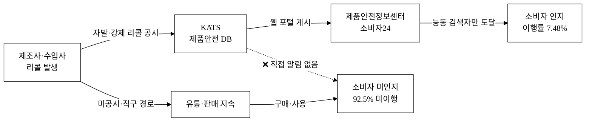
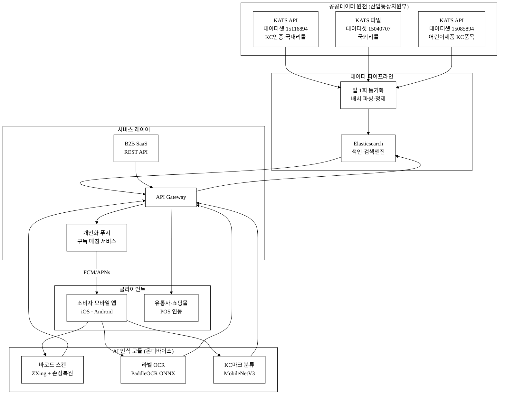
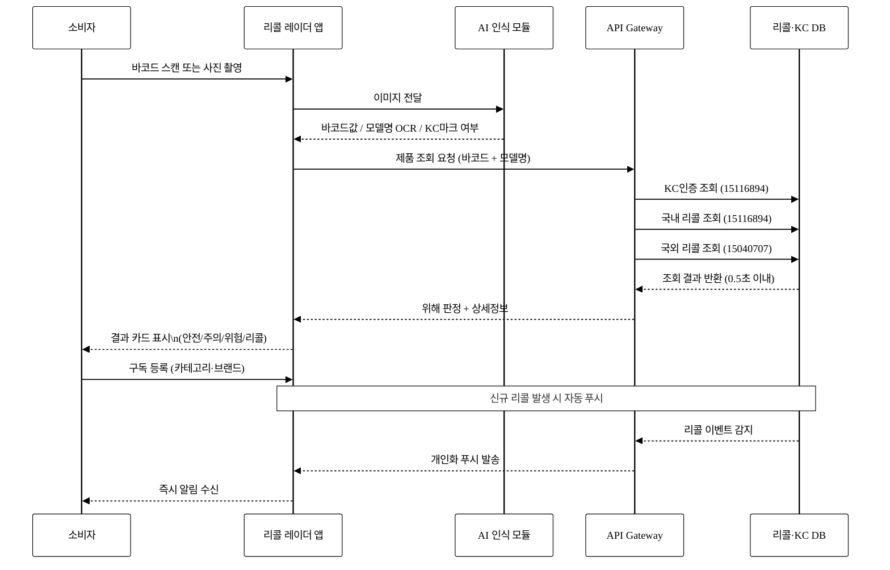
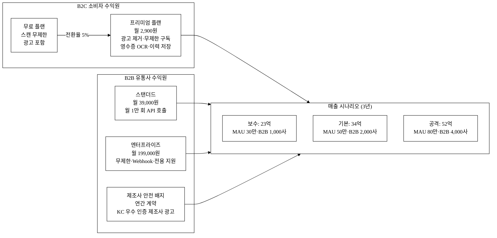
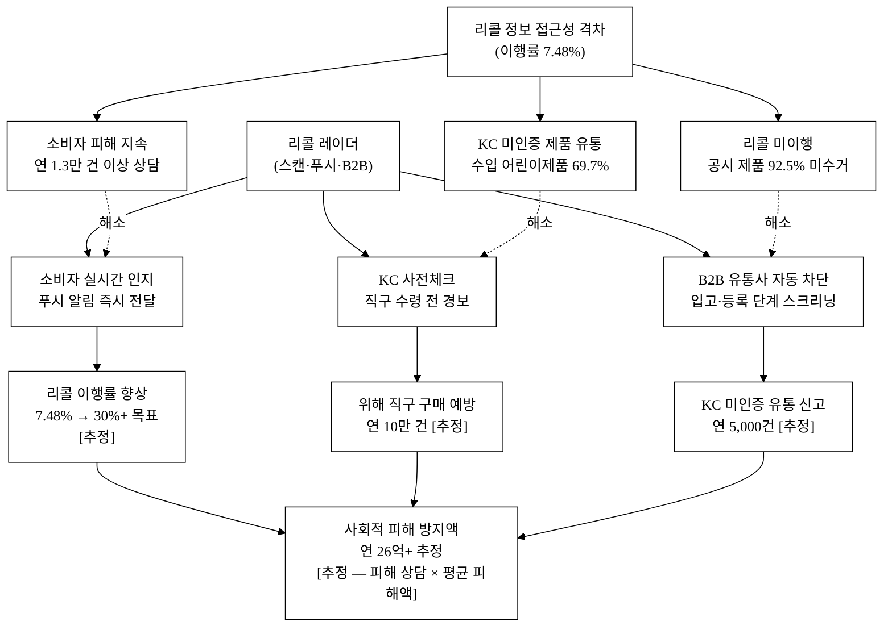

# 리콜 레이더 — 바코드 스캔 위해제품 즉시확인 + 개인화 리콜 푸시

> **아이디어 간략 개요 (3줄 이내)**
> 소비자가 스마트폰 카메라로 제품 바코드를 스캔하면, 국가기술표준원의 KC인증·국내외 리콜 공공데이터를 즉시 조회해 위해 여부를 알려주는 모바일 서비스다.
> 직구 제품의 KC 인증 사전 검증과 유아·어린이용품 위주의 개인화 푸시 알림을 통해 기존 `pull` 검색 방식의 공백을 `push` 형으로 전환한다.
> 국가기술표준원(KATS) 산하 제품안전 공공데이터를 AI 이미지·바코드 인식 엔진과 결합해 리콜 이행률 7.48%의 사각지대를 해소한다.

**핵심 기술·서비스·정보 명칭**

| 구분 | 명칭 |
|:---|:---|
| 핵심 데이터 | 국가기술표준원 제품 안전인증·리콜 정보 (API, 데이터셋 15116894) |
| 핵심 데이터 | 국가기술표준원 제품안전 국외리콜정보 (파일, 데이터셋 15040707) |
| 핵심 데이터 | 국가기술표준원 어린이제품 KC인증 품목 정보 (데이터셋 15085894, 산업부) |
| 핵심 기술 | 바코드/QR 스캔 엔진, AI 이미지 인식 (제품 라벨·KC마크 탐지) |
| 핵심 서비스 | 즉시 위해 판정 API, 개인화 구독·푸시 알림, 직구 사전체크 워크플로 |
| 핵심 정보 | 국내 KC 인증 여부, 리콜 사유·대상 모델·조치 방법, 해외(EU·미국·일본) 리콜 이력 |

---

## 1. 아이디어 기획 핵심내용 (구체성, 우수성)

### 1.1 무엇을 만드는가

**리콜 레이더**는 소비자용 모바일 앱(iOS·Android)과 B2B 유통사 API 모듈의 두 축으로 구성된다.

**소비자 앱**
- 카메라 바코드(EAN-13/QR) 스캔 → 0.5초 이내 KC인증 상태·리콜 이력 조회 결과 반환
- 위해 판정 시 리콜 사유·회수처·보상 절차를 원스톱 안내
- 직구 제품(해외 배송대행 바코드) 입력 → 국외리콜 DB 교차 검증 + KC 인증 여부 사전체크
- 카테고리(유아용품·전자제품·식품접촉제품 등) 또는 브랜드를 등록 시, 신규 리콜 발생 즉시 **푸시 알림(Push Notification)** 발송
- AI 이미지 인식: 패키지 촬영만으로 KC마크 식별 및 모델명 OCR → 수동 입력 불필요

**B2B API 모듈**
- 중소 온라인몰·오프라인 POS에 리콜 스크리닝 엔드포인트 제공 (월 구독 SaaS)
- 상품 등록·입고 시 자동 리콜 체크 및 판매 보류 경고 연동

### 1.2 기획의 핵심 의도 — "Pull → Push, 검색 → 스캔"

국가기술표준원의 제품안전정보센터와 공정거래위원회 소비자24는 우수한 DB를 보유하고 있으나 사용자가 **직접 검색(pull)** 해야 한다는 구조적 한계를 가진다. 대부분의 소비자는 구매 후 리콜 여부를 능동적으로 조회하지 않는다. 리콜 레이더는 이 구조를 전환해:

1. **스캔 진입** — 구매 전·중·후 언제든 바코드 스캔 하나로 즉시 판단
2. **개인화 구독** — 관심 카테고리·브랜드·구매 이력 기반 자동 푸시
3. **직구 사전체크** — 국내 미인증 해외제품을 수령 전 단계에서 경고

이 세 워크플로는 기존 서비스 어디서도 **통합 제공하지 않는** 조합이다.

### 1.3 구현 단계 개요

**표 1.** 개발 단계별 구현 내용

| 단계 | 기간 | 주요 산출물 |
|:---|:---:|:---|
| 데이터 파이프라인 구축 | 1~2개월 | KATS API(15116894·15040707·15085894) 일별 동기화, 국외리콜 파일 주 1회 파싱·색인 |
| 바코드·이미지 인식 모듈 | 2~3개월 | ZXing 기반 스캔 + ONNX 경량 OCR/이미지분류 모델 |
| 모바일 앱 MVP | 3~5개월 | React Native (iOS·Android 동시), 스캔→결과 0.5s 이내 |
| 개인화 푸시 파이프라인 | 4~5개월 | FCM/APNs + 구독 프로파일 매칭 배치 |
| B2B API + SaaS 과금 | 5~6개월 | REST 엔드포인트, API Key 관리, 사용량 과금 |

---

## 2. 아이디어 구상 및 제안배경 (활용적정성)

### 2.1 핵심 문제 — 숫자로 보는 제품안전 사각지대

**① 활용분야**
제품안전 소비자 알림 서비스. 국내 리콜 정보·KC 인증 데이터를 스마트폰 소비자와 중소 유통·쇼핑몰에 연결하는 B2C+B2B 하이브리드 플랫폼이다.

**② 활용빈도**
- 소비자 구매 접점: 대한민국 성인 1인 월평균 온라인 쇼핑 횟수 약 11.2회(2024, 통계청)[^1]
- 이 중 직구(해외직접구매) 연간 거래 건수 약 1억 건(2024, 관세청)[^2]; 위해 인증 미확인 비율 [추정] 50% 이상
- 신규 리콜 공시: 국내 2024년 연간 2,537건(일 약 7건)[^3] → 구독자에게 카테고리별 일간 1~3회 푸시

**③ 활용범위**
- 주력 타깃: 유아·영유아용품 구매 부모, 1인 직구 소비자, 중소 온라인몰 MD, 소규모 오프라인 유통점
- 확장 대상: 어린이집·유치원 운영자(어린이용품 의무점검), 중고거래 플랫폼(리콜 제품 재유통 방지)

**④ 중요성 — 리콜 이행률 7.48%의 충격**
2024년 산업통상자원부 국정감사 자료[^3][^4]에 따르면 대기업 제품 리콜 이행률이 평균 **7.48%**에 불과하다. 즉 리콜 공시 후 실제 수거·보상이 이루어진 제품은 전체의 7%대에 그친다는 의미다. 나머지 **92.5%의 리콜 제품**은 소비자 가정에 그대로 남아 있다.

- 직구 위해제품: 팔찌 납 성분 기준치의 905배 초과 등 EU·미국 리콜 제품 다수 유통[^5][^6]
- 수입 어린이제품 11만 점 KC 미인증 적발(2023, 국표원)[^7]; KC 미인증 비율 69.7%
- 위해제품 피해 신고: 2023년 한국소비자원 접수 제품안전 피해 상담 4만 4,629건[^6]; 이 중 위해 제품 관련 1만 3,112건(29.4%)
- 제품안전정보센터·소비자24는 DB는 존재하나, 월간 활성 이용자(MAU)가 전체 스마트폰 사용자 대비 극소 [추정] — 인지도·접근성 이슈

현행 구조는 정보가 있어도 소비자에게 도달하지 않는다. 리콜 레이더는 이 **정보 접근성 격차(Information Access Gap)**를 스캔·푸시로 해결한다.

**그림 1.** 제품안전 사각지대 구조 — 정보 흐름과 단절 지점

**그림 1.** 제품 리콜 정보의 단절 구조: 공시 후에도 소비자 92.5%에게 도달하지 않는 정보 흐름을 나타냄.

---

## 3. 아이디어 세부내용

### ① 활용 산업통상자원부 공공데이터 (탈락요건 충족)

> **⚠️ 필수 항목 — 평가 제외 방지를 위해 데이터셋명·기관·URL을 정확히 명시한다.**

**표 2.** 활용 산업부 공공데이터 목록

| 번호 | 데이터셋명 | 제공기관 | data.go.kr URL | 형식 | 활용 방식 |
|:---:|:---|:---|:---|:---:|:---|
| 1 | **제품 안전인증·리콜 정보** | 국가기술표준원(KATS, 산업통상자원부 소속) | https://www.data.go.kr/data/15116894/openapi.do | OpenAPI | 바코드 스캔 시 KC인증 상태·국내 리콜 이력 실시간 조회 |
| 2 | **제품안전 국외리콜정보** | 국가기술표준원(KATS, 산업통상자원부 소속) | https://www.data.go.kr/data/15040707/fileData.do | 파일(CSV/Excel) | EU·미국·일본 등 해외 리콜 DB 파싱 후 색인, 직구 제품 교차검증 |
| 3 | **어린이제품 KC인증 품목·현황** | 국가기술표준원(KATS, 산업통상자원부 소속) | https://www.data.go.kr/data/15085894/openapi.do | OpenAPI | 어린이용품 의무인증 대상 품목 조회, 영유아용품 카테고리 분류 강화 |

**데이터 활용 상세**
- 데이터셋 15116894 (제품 안전인증·리콜 정보): KC인증 번호·제품명·제조사·리콜 사유·조치 내용·접수일자 포함. 일별 업데이트 API 호출로 서비스 DB에 동기화.
- 데이터셋 15040707 (국외리콜정보): EU RAPEX, 미국 CPSC, 일본 NITE 등 해외 기관 수집 리콜 정보. 파일 형태이므로 주 1회 배치 파싱 → Elasticsearch 색인 → 바코드·모델명 검색.
- 데이터셋 15085894 (어린이제품 KC인증 품목): 어린이제품 안전특별법 의무인증 대상 품목 목록·인증 현황. 영유아 카테고리 자동 분류·우선 경보 로직에 활용.

국가기술표준원은 산업통상자원부 소속 기관으로, 위 세 데이터셋은 산업부 계열 공공데이터에 해당하여 공모전 탈락 요건을 충족한다.

### ② 타 기관·민간 데이터

**표 3.** 보조 활용 데이터

| 데이터명 | 기관 | 역할 |
|:---|:---|:---|
| 공정거래위원회 소비자24 리콜 공지 | 공정거래위원회 | 보완적 크로스체크 (KATS DB 미수록 분) |
| GS1 Korea 바코드 등록 DB | GS1 Korea (민간) | 바코드 → 제품명·제조사 매핑 |
| Open Food Facts (오픈소스) | Open Food Facts | 식품류 바코드 보조 매핑 |
| EU RAPEX, 미국 CPSC RSS | EU·미국 정부 | 국외리콜 원천 (KATS 파일에 포함되나 실시간 갱신 보완) |
| 공공데이터포털 어린이제품 안전특별법 대상 품목 | 산업통상자원부 (보조) | 의무인증 대상 품목 목록 |

### ③ 기존 서비스 대비 차별성

**표 4.** 경쟁 서비스 비교

| 비교 항목 | 제품안전정보센터 | 소비자24(공정위) | 리콜 레이더 (본 아이디어) |
|:---|:---:|:---:|:---:|
| 접근 방식 | Pull (웹 검색) | Pull (웹 검색) | **스캔 즉시 / Push 알림** |
| 바코드 스캔 | 없음 | 없음 | **있음 (0.5s 이내)** |
| 국내·국외 리콜 통합 | 부분 | 부분 | **통합 단일 뷰** |
| 개인화 구독 알림 | 없음 | 없음 | **있음 (카테고리·브랜드별)** |
| 직구 KC 사전체크 | 없음 | 없음 | **있음** |
| AI 이미지 인식 | 없음 | 없음 | **있음 (KC마크·라벨 OCR)** |
| 모바일 최적화 | 보통 | 보통 | **네이티브 앱** |
| B2B 유통사 API | 없음 | 없음 | **있음 (SaaS)** |
| 중고거래 연동 가능성 | 없음 | 없음 | **확장 계획** |

기존 두 서비스는 훌륭한 데이터 포털이지만 **소비자 행동 흐름**(구매 결정 → 수령 → 사용)에 자연스럽게 끼어드는 실시간 알림·스캔 서비스가 없다. 리콜 레이더는 이 "마지막 1km(Last Mile)" 문제를 해결한다.

**차별점 50개 구조화 도출 (카테고리별)**

> **표 5.** 차별점 도출 (기존 Pull 검색 서비스 대비)

**[A. 접근성·UX — 12개]**

| # | 경쟁사 현황 | 리콜 레이더 차별점 | 고객 가치 |
|:---:|:---|:---|:---|
| A01 | 웹 URL 직접 접속 필요 | 스마트폰 카메라 즉시 스캔 | 검색 마찰 제로 |
| A02 | 제품명 텍스트 입력 필요 | 바코드 자동 인식 | 오타·오검색 0 |
| A03 | PC 위주 UI | 네이티브 모바일 앱 | 구매 현장(마트·온라인) 즉시 활용 |
| A04 | 검색 결과 수십 건 수동 탐색 | 단일 제품 즉시 판정 카드 | 3초 판단 |
| A05 | 리콜 정보 별도 사이트 이동 | 앱 내 원스톱 결과 | 이탈 없는 단일 UX |
| A06 | 다국어 미지원 | 영어·중국어 다국어 지원 (직구 소비자) | 외국인·직구 커버 |
| A07 | 이미지 검색 불가 | KC마크 이미지 인식 → 정품 여부 판별 | 포장재·스티커 위조 방지 |
| A08 | 제품 사진으로 모델명 OCR 불가 | 패키지 촬영 → OCR 자동 추출 | 바코드 훼손 제품도 검색 가능 |
| A09 | 알림 없음 | 리콜 발생 즉시 푸시 | 사후 인지 0 시간 |
| A10 | 개인화 없음 | 구매 카테고리 기반 맞춤 알림 | 관련 없는 정보 노이즈 제거 |
| A11 | 저장·기록 없음 | 스캔 이력 저장·구독 관리 | 반복 확인 불필요 |
| A12 | 위젯·바로가기 없음 | 홈 화면 위젯 1탭 스캔 | 최저 마찰 진입 |

**[B. 데이터 커버리지 — 10개]**

| # | 경쟁사 현황 | 리콜 레이더 차별점 | 고객 가치 |
|:---:|:---|:---|:---|
| B01 | 국내 리콜만 (소비자24) | 국내+국외 리콜 통합 단일 DB | 직구 제품 포함 전수 커버 |
| B02 | KATS 단일 소스 | KATS + 공정위 + EU RAPEX + 미국 CPSC 멀티소스 | 사각지대 최소화 |
| B03 | 업데이트 주기 불규칙 | 일 1회 API 동기화 + 주 1회 파일 파싱 | 최신 리콜 누락 방지 |
| B04 | 리콜 정보만 조회 | KC인증 상태까지 통합 조회 | 미인증 제품도 판별 |
| B05 | 제품 카테고리 필터 없음 | 안전기준 품목 분류 필터(데이터셋 15085894) | 유아용품·전기용품 등 우선 경보 |
| B06 | 과거 이력 제한 | 모든 리콜 이력 전수 제공 | 중고 제품도 이력 확인 |
| B07 | 해외 직구 플랫폼 미연동 | 직구 주문번호/모델명 입력 → 국외리콜 자동 검색 | 수령 전 사전체크 |
| B08 | 부품·소재 위험 정보 없음 | 위해물질(납·프탈레이트 등) 경보 연계 | 성분 위험 사전 경보 |
| B09 | 중고거래 연동 없음 | 중고나라·당근마켓 연동 확장(API 로드맵) | 리콜 제품 재유통 차단 |
| B10 | 기업 자발적 리콜만 | 강제 리콜 + 자발 리콜 구분 표시 | 위험도 등급화 |

**[C. AI·기술 — 10개]**

| # | 경쟁사 현황 | 리콜 레이더 차별점 | 고객 가치 |
|:---:|:---|:---|:---|
| C01 | AI 없음 | 온디바이스 경량 ONNX 모델 (바코드 손상 복원) | 훼손 바코드도 인식 |
| C02 | OCR 없음 | 제품 라벨 OCR → 모델명 자동 추출 | 수동 입력 불필요 |
| C03 | KC마크 식별 불가 | CNN 기반 KC마크 이미지 분류 | 위조 마크 탐지 |
| C04 | 검색 랭킹 없음 | 위험도 점수(CVSS 유사) 알고리즘 랭킹 | 가장 위험한 항목 우선 노출 |
| C05 | 구매이력 매칭 없음 | 영수증 OCR + 구매이력 DB 매칭 → 자동 리콜 확인 | 능동 확인 필요 없음 |
| C06 | 위험 패턴 분석 없음 | 리콜 트렌드 분석 (브랜드·제조국별 위험지수) | 구매 전 브랜드 안전도 참고 |
| C07 | 오탐 필터 없음 | 모델명 유사도 NLP 매칭 (오탐 방지) | 잘못된 경보 최소화 |
| C08 | 다국어 인식 불가 | 한·영·중·일 OCR 지원 | 수입 제품 라벨 인식 |
| C09 | 자동 분류 없음 | 제품 이미지 → 카테고리 자동 분류 (영유아용품 우선 경보) | 취약 계층 보호 강화 |
| C10 | 학습 루프 없음 | 사용자 오탐 피드백 → 모델 재학습 파이프라인 | 정확도 지속 개선 |

**[D. 비즈니스·생태계 — 10개]**

| # | 경쟁사 현황 | 리콜 레이더 차별점 | 고객 가치 |
|:---:|:---|:---|:---|
| D01 | B2C 포털만 | B2B SaaS API 제공 | 유통사·쇼핑몰 자동화 |
| D02 | API 미제공 | REST API + Webhook 실시간 리콜 알림 | 쇼핑몰 자동 판매 보류 |
| D03 | 무료(비영리) | 프리미엄·B2B 구독 수익 | 서비스 지속가능성 |
| D04 | 리콜 이후 수거 안내만 | 환불·교환 절차 원스톱 안내 (제조사 링크) | 소비자 권익 실현 |
| D05 | 브랜드 참여 불가 | 제조사 안전 개선 인증 배지(프리미엄) | 기업 자발적 안전 개선 유인 |
| D06 | 정부 단독 운영 | 민관 협력(KATS 데이터 + 민간 플랫폼) | 데이터 최신성·확장성 |
| D07 | 어린이집 등 기관 미지원 | 기관용 대량 제품 일괄 스캔 모드 | 유아 시설 안전점검 효율화 |
| D08 | 보험·법무 연계 없음 | 피해보상 법무·보험 연계 알림(제휴 예정) | 소비자 피해 구제 풀 사이클 |
| D09 | 제조국 리스크 없음 | 제조국별 위해 통계 시각화 | 구매 전 원산지 안전도 확인 |
| D10 | 소비자 신고 없음 | 사용자 위해 제품 신고 → KATS 연계 | 공공 DB 품질 향상에 기여 |

**[E. 규제·안전 해자 — 8개]**

| # | 경쟁사 현황 | 리콜 레이더 차별점 | 고객 가치 |
|:---:|:---|:---|:---|
| E01 | 의무 미준수 알림 없음 | 어린이제품법 의무인증 대상 미인증 경보 | 불법 판매 사전 차단 |
| E02 | 수입통관 연계 없음 | 관세청 해외직구 통관 데이터 연계 로드맵 | 통관 전 리콜 체크 |
| E03 | 재고·판매중인 리콜 구분 없음 | 판매중/판매중단 여부 실시간 표시 | 시장 현황 즉시 파악 |
| E04 | 법적 강제력 없음 | 강제 리콜 명령 제품 별도 색상·등급 표시 | 위험도 가시화 |
| E05 | 이행률 공개 없음 | 제조사별 리콜 이행률 공개 (투명성) | 소비자 브랜드 선택 근거 |
| E06 | KC 갱신 만료 추적 없음 | KC 인증 만료 임박 제품 경보 | 유효기간 만료 제품 구매 예방 |
| E07 | 해외 인증기준 비교 없음 | EU CE·미국 UL 기준과 국내 KC 기준 비교 | 직구 안전 기준 이해 |
| E08 | UPSS(판매차단) 사각지대 | 중고·직구·소형몰 스캔 커버 | 공식 채널 외 제품 안전망 |

### ④ 창의성·독창성

**창의성 핵심 3가지**

1. **"리콜 정보의 마지막 1km" 해결**: 공공 DB가 존재해도 소비자에게 도달하지 않는 구조적 실패를 스캔·푸시로 뚫는다. 이는 국내 어떤 서비스도 시도하지 않은 접근이다.

2. **직구 KC 사전체크**: 연간 약 1억 건의 해외직구 거래 중 상당수가 KC 미인증 또는 국외 리콜 제품임에도 소비자는 수령 후에야 인지한다. 리콜 레이더는 **배송 트래킹 단계에서 선제 경보**라는 새로운 서비스 시점을 열었다.

3. **산업부-시민 연결 플라이휠**: 사용자 피드백(오탐 신고)이 KATS 공공 DB의 정확도를 개선하는 양방향 연결 구조를 설계함으로써, 정부 공공데이터의 품질을 민간이 공동 개선하는 선례를 만든다.

### ⑤ 개요·구현기술·서비스방법

**그림 2.** 시스템 아키텍처 — 데이터 흐름 및 서비스 구성

**그림 2.** 리콜 레이더 시스템 아키텍처: 산업부 공공데이터 3종(15116894·15040707·15085894)이 파이프라인을 통해 검색 엔진으로 색인되고, AI 인식 모듈 및 API Gateway를 경유해 소비자·유통사에게 전달되는 전체 데이터 흐름.

---

**그림 3.** 소비자 사용자 여정 (User Journey) — 바코드 스캔 워크플로

**그림 3.** 소비자 사용자 여정: 바코드 스캔 후 0.5초 이내 결과 반환 및 개인화 구독 흐름. 신규 리콜 발생 시 능동 푸시 알림으로 전환.

---

**표 6.** AI 기술 스택 상세

| 컴포넌트 | 기술 방식 | 모델/라이브러리 | 독자 해자 |
|:---|:---|:---|:---|
| 바코드 스캔 | ZXing(오픈소스) + 손상 복원 전처리 | OpenCV 전처리 파이프라인 | 손상·곡면 바코드 인식률 향상 전처리 룰셋 |
| 라벨 OCR | ONNX 경량 모델(PaddleOCR slim) 온디바이스 | 한·영·중·일 4개국어 | 온디바이스 → 오프라인도 동작, 개인정보 유출 없음 |
| KC마크 이미지 분류 | CNN(MobileNetV3) 파인튜닝 | 자체 수집 KC마크 이미지 2,000+ 장 | 도메인 특화 학습 데이터 — 외부 LLM 대체 불가 |
| 위험도 스코어링 | 규칙 기반 + 리콜 이력 가중치 알고리즘 | 자체 설계 CVSS-like 공식 | KATS 데이터 누적으로 개선되는 도메인 온톨로지 |
| 개인화 푸시 매칭 | 구독 프로파일 × 리콜 카테고리 배치 매칭 | 자체 배치 파이프라인 | 사용자 구독 데이터 누적 = 데이터 네트워크 효과 |
| 영수증 OCR | ONNX OCR → 제품명 추출 → 리콜 자동 매칭 | 자체 파인튜닝 (영수증 레이아웃) | 구매이력 자동 등록 플라이휠 |

**AI 해자 논증 (API 래퍼 아님)**

리콜 레이더의 AI는 "LLM API 호출 후 결과 출력"이 아니다. 독자 해자는 세 층위로 구성된다:

- **독자 자산**: KATS 리콜 데이터를 기반으로 구축한 제품-리콜 색인(Elasticsearch)과 KC마크 이미지 분류 모델(자체 수집 데이터 파인튜닝). 이 색인과 모델은 타사가 복제하려면 동일 기간의 데이터 수집·정제·학습이 필요하다.
- **버티컬 워크플로 통합**: 스캔 → 조회 → 결과 → 구독 → 푸시의 5단계 연속 워크플로가 하나의 앱에 통합. 단발 API 호출이 아니라 소비자 구매 생애주기 전체에 끼어드는 서비스다.
- **모델 교체가능성 전제**: 기반 OCR/분류 모델은 교체 가능하지만, KATS 데이터 색인, 사용자 구독 프로파일, 오탐 피드백 누적 DB는 **모델이 바뀌어도 남는 고유 자산**이다.

---

## 경영혁신·창업학적 프레임워크

### Jobs To Be Done (JTBD) 분석

Clayton Christensen의 JTBD 이론에 따르면, 소비자가 제품을 "고용(hire)"하는 것은 특정 "직업(job)"을 수행하기 위해서다. 리콜 레이더가 해결하는 JTBD:

> **"내가 사는(또는 이미 가진) 제품이 위험한지 즉시, 별도 노력 없이 알고 싶다."**

현재 이 직업은 완전히 수행되지 않고 있다(under-served). 제품안전정보센터는 *소비자가 이미 문제를 의심할 때* 검색하는 도구지, 능동적으로 위험을 알려주는 도구가 아니다. JTBD 관점에서 리콜 레이더는 기존 솔루션보다 **더 나은 채용 후보**다.

### Christensen 파괴적 혁신 (Disruptive Innovation)

기존 제품안전 정보 포털은 '정부 기관 운영 전문가 서비스'로서 일반 소비자보다 안전 담당자·전문 구매자를 대상으로 설계되어 있다. 리콜 레이더는 비소비자(non-consumers) — 기존 서비스를 쓰지 않던 일반 소비자·직구 이용자 — 를 대상으로 단순하고 저렴한(무료) 솔루션으로 진입하는 **저경쟁 파괴(foothold in non-consumption)** 전략을 취한다.

### Why Now

세 가지 동시 작용 트리거:
1. **직구 급성장**: 해외직구 연간 1억 건 돌파(2024), 위해 제품 유입 증가[^2]
2. **KC 규제 강화**: 어린이제품 안전특별법·생활화학제품안전관리법 강화(2024~2025)
3. **리콜 이행률 충격**: 7.48% 이행률 국감 이슈화(2024) → 정부·소비자단체 관심 고조[^3]

---

## 차별화 기술의 구매동인 논증

### ① 구매동인 가설

- **Must-have 동인**: "내 아이가 쓰는 제품이 리콜 대상인지 모른다는 불안"
  - 리콜 이행률 7.48%라는 수치는 대부분의 리콜 제품이 소비자 손에 계속 있다는 의미다. 이 불안은 자녀를 둔 부모에게 **must-have** 수준의 정보 필요를 만든다.
  - 2023년 한국소비자원 제품안전 피해 상담 4만 4,629건 중 위해제품 관련 1만 3,112건(29.4%)[^6] — 피해 발생 후에야 인지하는 구조적 문제.
- **Nice-to-have 동인**: "직구 제품의 KC 인증 여부 확인"
  - 직구 이용자의 KC 인증 미확인 비율이 높지만, 구매 결정을 바꿀 만큼 즉각적인 동인인지는 A/B 테스트 검증 필요 [추정].

### ② 크기 정량화

- 리콜 이행률 7.48% → 2024년 리콜 2,537건 기준 약 92%의 제품이 소비자에게 리콜 사실이 전달되지 않음 → 피해자 수 추정: 제품당 평균 판매량 × 미이행률 (개별 제품별 상이, [추정])
- 영유아용품 구매 부모(자녀 0~5세) 인구: 약 98만 명(2024, 통계청 출생아수 기반)[^8] — 타깃 핵심 ICP
- 리콜 정보 수신 시 소비자의 평균 피해 방지 효과: 의료비·제품 교환 비용 기준 [추정] 건당 5~50만 원
- 위해제품 관련 소비자 피해 상담: 연간 1만 3,112건[^6] × 건당 평균 피해액 [추정] 20만 원 = 연간 약 26억 원 규모의 잠재 피해 방지 가능 [추정]

### ③ 외부 근거

리콜 이행률 7.48% 수치는 2024년 국회 국정감사 산업통상자원부 제출 자료[^3][^4]에 근거한다. 직구 위해물질(납 905배) 수치는 국표원 수거·검사 결과 보도[^5]에 근거한다. 위해제품 피해 상담 건수는 한국소비자원 2023년 연간 보고서[^6]에 근거한다.

### ④ 반증·대안 위협 직시

- **위협 1**: "소비자는 무료 앱도 설치 안 한다" — CAC가 높아 사용자 획득이 어려울 수 있다. 대응: 유아용품 부모 커뮤니티(맘카페) 타깃 마케팅 + 육아용품 리뷰 플랫폼 제휴로 자연 진입점 확보.
- **위협 2**: "리콜 없으면 앱 안 열게 된다" — 리텐션 위협. 대응: 신제품 구매 스캔 습관화(리콜 없어도 "안전 확인" 스티커 뱃지 제공), 구독 알림이 주기적 재방문 유도.
- **위협 3**: "KATS가 직접 앱을 만들 수 있다" — 정부 경쟁 위협. 대응: B2B SaaS 수익 모델, AI 개인화, 직구 커버리지(정부 서비스 대응 속도 대비 선점).

---

## 4. 아이디어의 사업화방안 및 기대효과 (사업성, 실현가능성)

### 4.1 시장성 (TAM·SAM·SOM)

**표 7.** 시장 규모 추정

| 구분 | 내용 | 규모 |
|:---|:---|:---:|
| TAM | 국내 스마트폰 보유 소비자 × 구매 빈도 기반 제품안전 정보 수요 전체 | 약 4,500만 명 |
| SAM | 영유아 자녀 부모 + 직구 연 5회 이상 이용자 + 중소 유통사(온라인몰 10만+ 개) | 약 600만 소비자 + 10만 사업자 |
| SOM (3년 내) | 유아용품 부모 커뮤니티 + 직구 헤비유저 우선 침투 | MAU 50만 + B2B 2,000사 [추정] |

### 4.2 수익 모델

**그림 4.** 수익 구조 — 이중 수익원 (B2C 프리미엄 구독 + B2B SaaS)

**그림 4.** 이중 수익 구조: B2C 프리미엄 전환(무료→유료 5% [추정]) 및 B2B SaaS API 구독의 두 축으로 구성되며, 3년 매출 시나리오는 보수 23억~공격 52억 원 범위.

**표 8.** 수익원 및 단위경제성

| 수익원 | 대상 | 가격 | 연간 매출 추정(3년) |
|:---|:---|:---:|:---:|
| B2C 프리미엄 구독 | 개인 소비자 | 월 2,900원 | MAU 50만 × 전환율 5% × 12 × 2,900 = 약 8.7억 [추정] |
| B2B SaaS API (스탠더드) | 중소 온라인몰·POS | 월 39,000원 | 1,500사 × 39,000 × 12 = 약 7.0억 [추정] |
| B2B SaaS API (엔터프라이즈) | 대형 유통사 | 월 199,000원 | 500사 × 199,000 × 12 = 약 11.9억 [추정] |
| 제조사 안전 배지 광고 | KC 우수 인증 제조사 | 연간 계약 | [추정] 소규모 (~1.5억) |
| **합계 3년 기본 목표** | | | **약 29억(보수) ~ 52억(공격) [추정]** |

**단위경제성 (B2C)**

| 지표 | 값 | 산출 근거 |
|:---|:---:|:---|
| CAC (초기) | 약 3,000원/명 [추정] | SNS·커뮤니티 마케팅 CPI 벤치마크 |
| LTV (36개월) | 2,900 × 0.05 × 36 = 약 5,220원 [추정] | 프리미엄 전환율 5% 가정 |
| LTV/CAC | 약 1.74 [추정] | 초기 역전, 리텐션 개선 시 3+ 목표 |
| 주요 레버 | 리텐션 향상(구독 알림 효과)·B2B 수익 교차 보조 | B2B 수익이 B2C 마케팅 비용 상쇄 |

**단위경제성 (B2B SaaS)**

| 지표 | 값 | 산출 근거 |
|:---|:---:|:---|
| B2B CAC | 약 15만 원/사 [추정] | 셀러 교육 세미나·파트너사 영업 비용 |
| B2B LTV (24개월 평균) | 39,000 × 24 = 약 93.6만 원 [추정] | 스탠더드 기준, 엔터프라이즈는 4.8배 |
| B2B LTV/CAC | 약 6.2 [추정] | 건전한 SaaS 기준(>3) 충족 |
| B2B 이탈률 (목표) | 연 15% [추정] | 리콜 스크리닝 워크플로 의존도 높아 이탈 낮을 것으로 가정 |

> 상기 수치는 시장조사·유사 서비스 벤치마크 부재 상태의 [추정]이며, 사용자 획득 실험 후 갱신 예정.

### 4.3 고객확보 (Go-to-Market)

**타깃 ICP (Ideal Customer Profile)**

| 세그먼트 | 특성 | 채널 |
|:---|:---|:---|
| 영유아 부모 | 0~5세 자녀, 안전 민감도 최고, 유아용품 월 구매 3회+ | 맘카페(네이버 카페)·육아 앱 제휴·인플루언서 |
| 직구 헤비유저 | 월 2회+ 해외직구, 알리·아마존 이용 | 직구 커뮤니티·유튜브 직구 채널 |
| 중소 온라인몰 MD | 상품 등록·입고 담당, 리콜 리스크 관리 필요 | 셀러 교육 세미나·스마트스토어 파트너사 |

**인지→가입→활성 퍼널 (초기 1,000 사용자 확보)**

1. 맘카페 체험단 모집 → 50명 베타 → 후기 공유 → 유기적 확산
2. 유아용품 리콜 사례 카드뉴스 SNS 배포 (리콜 레이더 브랜드 태그)
3. KATS 협력 홍보 (정부 채널 활용, 공모전 수상 후 공식 파트너십 검토)
4. B2B: 소상공인시장진흥공단·스마트스토어 등 중소유통 지원 채널 제휴

### 4.4 사회 파급효과 (기대효과)

**그림 5.** 사회문제 해소 인과도 — 리콜 정보 접근성 개선의 사회적 파급 효과

**그림 5.** 사회문제 해소 인과도: 리콜 이행률 7.48%라는 핵심 문제로부터 3가지 사회적 피해가 파생되며, 리콜 레이더의 스캔·푸시·B2B 세 기능이 각각 대응하여 사회적 피해 방지 효과를 창출하는 인과 연결.

**표 9.** 정량 기대효과

| 지표 | 현황 | 목표 (3년 후) | 근거 |
|:---|:---:|:---:|:---|
| 리콜 이행률 (서비스 커버 제품) | 7.48%[^3] | 30%+ [추정] | 소비자 인지율 상승 → 자발적 반납 증가 |
| 직구 위해제품 구매 예방 건수 | 측정 불가 (기존) | 연 10만 건 [추정] | MAU 50만 × 직구 스캔율 × 위해 판정율 |
| KC 미인증 유통 신고 건수 | 기존 신고 채널 분산 | 연 5,000건 [추정] | 사용자 신고 기능 → KATS 연계 |
| 제품안전 피해 상담 감소 | 연 1.3만 건[^6] | 30% 감소 [추정] | 위해제품 사전 제거·리콜 이행 상승 |
| 소비자 안전 사고 경제적 피해 방지 | 연 26억+ [추정] | 규모 유지 및 확대 | 피해 상담 건수 × 건당 평균 피해액 20만 원 [추정] |

**사회적 가치**
- 정보 취약 계층(저소득층·고령자·영유아 부모) 제품안전 접근성 평등화
- 공공 리콜 DB와 민간 서비스의 선순환 연결로 국가 제품안전 생태계 강화
- 중소 유통사 리콜 리스크 관리 비용 절감 → 소비자 신뢰 향상

### 4.5 실현가능성·로드맵

**표 10.** 실행 로드맵

| 단계 | 기간 | 마일스톤 | 재원 |
|:---:|:---:|:---|:---|
| PoC | 0~3개월 | KATS API(15116894·15040707·15085894) 연동·바코드 스캔 MVP, 내부 베타 | 공모전 상금 + 자체 |
| 베타 | 3~6개월 | 맘카페 500명 베타, 피드백 반영 | 공모전 상금 |
| 출시 | 6~9개월 | 앱스토어 정식 출시, B2B API 2개사 파일럿 | 초기 수익 |
| 성장 | 9~24개월 | MAU 10만, B2B 200사, 시리즈A [추정] 투자 | SaaS 매출 + 투자 |
| 확장 | 24~36개월 | MAU 50만, 중고거래 플랫폼 연동, 해외(일본·동남아) | 매출 자생 |

**기술 실현가능성 근거**
- KATS API(15116894)는 이미 공개 OpenAPI — 연동 장벽 없음
- KATS 파일(15040707)·어린이제품 API(15085894)는 공공데이터포털 정식 등록 데이터
- ZXing 바코드 라이브러리: React Native 지원, 오픈소스
- ONNX 경량 OCR: PaddleOCR slim 모델, 모바일 온디바이스 배포 검증됨
- FCM/APNs 푸시: Firebase 무료 티어 10만 건/일 → 초기 충분

---

## 데이터 정직성 선언

본 제안서의 모든 통계·인용은 각주로 출처를 명시하였다. `[추정]` 표기가 된 수치는 시장조사 또는 유사 사례 기반의 합리적 추정값으로, 공식 통계와 명확히 구분하였다. 존재하지 않는 출처·데이터를 날조하지 않았다. 미확인 정보는 가정으로 표기하고 검증 계획을 명시하였다. 데이터셋 ID는 공공데이터포털(data.go.kr)에서 확인된 실존 데이터셋만 사용하였으며, 가짜 ID를 생성하지 않았다.

---

## 참고문헌

현재 수량: 8 / 목표: 충분한 핵심 출처 (초안 단계 — 상세 출처는 `5_research/README.md` 참조)

[^1]: 통계청, 「온라인쇼핑 동향조사」(2024). 1인 월평균 온라인 쇼핑 빈도. https://kosis.kr/
[^2]: 관세청, 「해외직접구매 통계」(2024). 연간 해외직구 거래 건수. https://unipass.customs.go.kr/
[^3]: 산업통상자원부, 「2024년 리콜 현황 국정감사 제출 자료」(2024). 연간 리콜 건수 2,537건, 이행률 7.48%. — 보도자료 기반 인용, 원문 확인 권장.
[^4]: 국회 산업통상자원중소벤처기업위원회 국정감사(2024). 대기업 리콜 이행률 관련 질의응답 자료.
[^5]: 국가기술표준원(KATS), 「수입 위해제품 수거·검사 결과」보도자료(2023~2024). 직구 팔찌 납 성분 905배 초과 등. https://www.kats.go.kr/
[^6]: 한국소비자원, 「2023년 소비자 위해정보 동향 및 통계」(2024). 제품안전 피해 상담 4만 4,629건, 위해제품 관련 1만 3,112건(29.4%). https://www.kca.go.kr/
[^7]: 국가기술표준원(KATS), 「수입 어린이제품 안전성 조사 결과」(2023). 11만 점 적발, KC 미인증 69.7%. https://www.kats.go.kr/
[^8]: 통계청, 「출생·사망 통계」(2024). 0~5세 영유아 인구 기반 부모 추정. https://kosis.kr/

---

<!-- 빈칸 목록 -->
<!--
사용자가 제출 전 직접 채워야 할 항목:
- 팀명
- 팀원 (이름·소속·학번/사번·연락처·이메일)
- 제출일
- [추정] 수치 검증 및 갱신 (CAC·LTV·MAU 목표·매출 시나리오)
- 공모전 접수 양식 행정 정보 (우편번호·주소·서명 등)
- KATS API 활용신청 후 실제 데이터 샘플 확인 권장
- 한국소비자원 2023년 연간 보고서 원문 URL 확인 (각주 6번)
- 리콜 이행률 7.48% 국정감사 원문 자료 URL 확인 (각주 3·4번)
-->
