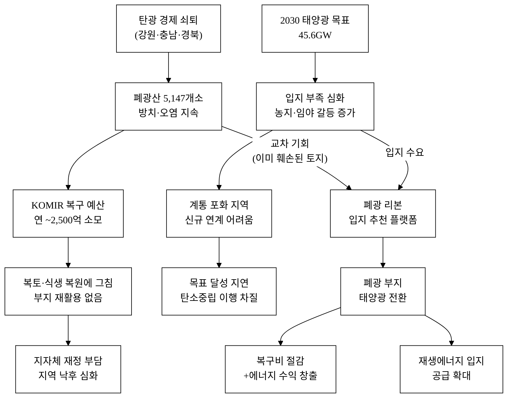
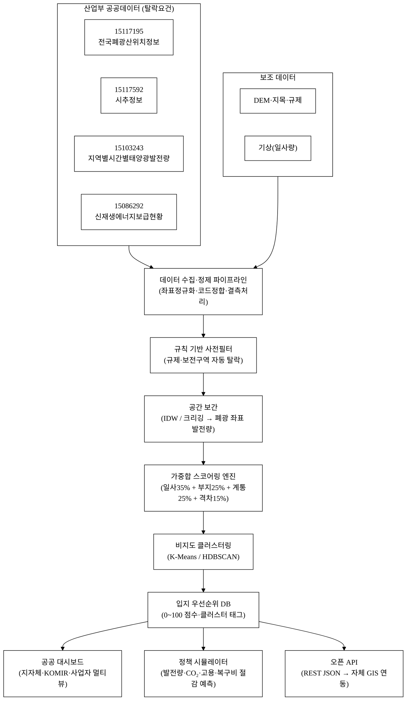
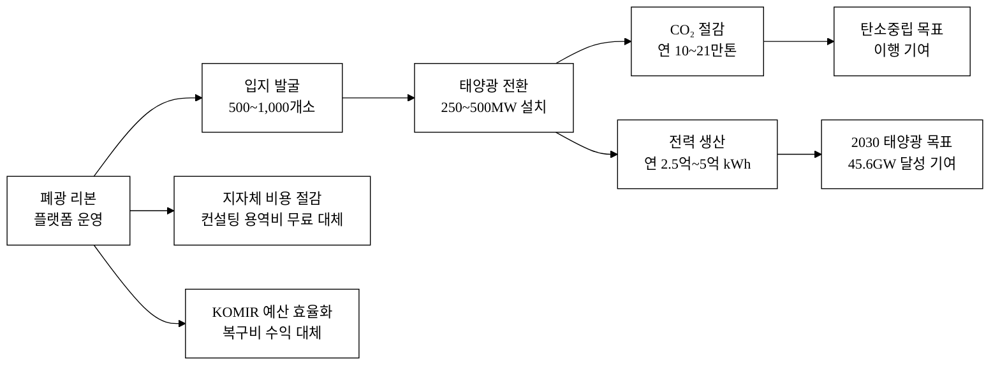

last_updated: 2026-06-28 12:00

---

| 항목 | 값 |
|:---|:---|
| 사업명 | 제14회 산업통상자원부 공공데이터 활용 아이디어 공모전 |
| 부문 | 아이디어 기획 |
| 테마축 | 지역활력 / 에너지전환 |
| 아이디어명 | 폐광 리본(Ribbon) — 폐광산 부지 태양광 재생에너지 입지 추천 플랫폼 |
| 팀명 | <TODO: 사용자 입력> |
| 팀원 | <TODO: 사용자 입력> |
| 제출일 | <TODO: 사용자 입력> |

---

# 폐광 리본(Ribbon) — 폐광산 부지 태양광 재생에너지 입지 추천 플랫폼

전국 5,147개 폐광산 부지의 일사량·지형·계통 연계 조건을 AI로 분석해 태양광 발전 최적 입지를 자동 추천한다. 중금속 오염·붕괴 위험이 잔존하는 유휴 폐광 부지를 청정에너지 생산 거점으로 전환하여, 탄광 지역 경제 낙후와 재생에너지 입지 부족 문제를 동시에 해결한다.

**핵심 기술·서비스·정보 명칭**

- 폐광 부지 태양광 입지 적합도 스코어링 엔진 (다중 기준 가중합 + 공간 보간 모델)
- 산업부 공공데이터 결합 파이프라인 (폐광 위치 × 지역별 시간별 태양광 발전량 × 신재생 보급 현황)
- 도메인 규칙 온톨로지 기반 자동 필터 (광산피해방지법·산지관리법·문화재보호법)
- 공공 의사결정 지원 대시보드 및 정책 시뮬레이터 (지자체·에너지 사업자·광해 담당 공무원 대상)

---

## 1. 아이디어 기획 핵심내용 (구체성, 우수성)

### 1-1. 무엇을 만드는가

"폐광 리본"은 **폐광산 부지 × 태양광 발전 입지 분석을 결합한 공공 의사결정 지원 플랫폼**이다. 현재 국내에는 폐광 데이터와 재생에너지 입지 데이터를 교차 분석하는 공공 플랫폼이 전무하다. 핵심 기능은 다음 세 가지로 구성된다.

| 기능 | 설명 |
|:---|:---|
| **폐광 입지 스코어링** | 산업부 공공데이터 4종(폐광 위치·시추 정보·시간별 태양광 발전량·신재생 보급 현황)을 결합해 부지별 태양광 적합도 점수(0~100)를 자동 산출 |
| **우선순위 지도** | 적합도 점수·환경 위험 등급·계통 연계 여유를 동시 표시한 전국 인터랙티브 지도, 광역·기초지자체·전국 계층별 뷰 제공 |
| **정책 시뮬레이터** | 입지 선정 시 예상 발전 용량·CO₂ 감축·지역 고용 창출·재정 절감 효과를 정량 출력하여 지자체 사업계획서 기초자료로 직접 활용 |

### 1-2. 서비스 대상 및 흐름

**표 1.** 서비스 사용자·시나리오

| 사용자 | 사용 시나리오 | 주요 편익 |
|:---|:---|:---|
| 지자체 에너지 담당 공무원 | 관할 내 폐광 중 개발 우선순위 5선 추출 → 사업계획서 초안 기초 자료로 활용 | 민간 컨설팅 용역비(건당 ~3,000만원[추정]) 절감 |
| 재생에너지 사업자(IPP·시행사) | 입지 스코어 상위 20개 지점 필터링 → 현장 실사 전 사전 검토 비용 절감 | 실사 건당 ~300만원[추정] × 불필요 실사 20건 감소 = 6,000만원 절감 |
| 한국광해광업공단(KOMIR) | 전국 폐광 환경 위험도 + 재생에너지 잠재력 동시 모니터링 → 복구 우선순위 재조정 | 복구 예산 효율화, 에너지 수익으로 복구비 일부 대체 |
| 중앙 정책 부서(산업부) | 지역별 신재생 보급 목표 달성 속도 대시보드 → 정책 효과 예측·조정 | 제10차 전력수급기본계획 목표(2030년 태양광 45.6GW) 이행 가속[^3] |

**그림 1.** 사용자 여정 흐름도 (지자체 공무원 시나리오)

**그림 1.** 지자체 공무원의 폐광 리본 사용 여정 (6단계, 현장 실사 전 사전 검토 완결)

### 1-3. 구현 기술 (구체)

**① 데이터 수집·정제 파이프라인**

산업부 공공데이터 4종을 공공데이터포털 API/파일로 주기적 수집한다. 수집 후 좌표 정규화(WGS-84), 시군구 코드 정합, 결측 처리를 수행한다.

| 데이터 | 갱신 주기 | 수집 방식 |
|:---|:---:|:---|
| 폐광 위치정보 (15117195) | 비정기(갱신 시) | 파일 다운로드 → S3 적재 |
| 시추정보 (15117592) | 비정기 | 파일 다운로드 |
| 지역별 시간별 태양광 발전량 (15103243) | 시간별 | REST API → 시계열 DB |
| 기초지자체별 신재생에너지 보급현황 (15086292) | 연 1회 | 파일 다운로드 |

**② 입지 적합도 스코어링 모델**

다음 4축 지표를 가중합(Weighted Scoring)으로 종합해 0~100점 산출한다.

**표 2.** 스코어링 지표 구성

| 축 | 지표 | 데이터 출처 | 가중치(초기) | 산출 방법 |
|:---|:---|:---|:---:|:---|
| 일사·발전 잠재력 | 해당 시군구 시간별 태양광 발전량 평균 (kWh/kWp) | 전력거래소 15103243 | 35% | 최근 3년 시간별 적산 평균 → IDW 공간 보간으로 폐광 좌표값 추정 |
| 부지 활용성 | 폐광 면적·유형(노천/갱내)·시추 기록(지반 안전도 대리지표) | 광해광업공단 15117195·15117592 | 25% | 면적 대수 정규화 + 유형별 가산점 + 시추 심도·암질 역산 안전도 |
| 계통 연계 여유 | 지역 신재생 보급 용량 대비 계통 여유 역산[추정] | 에너지공단 15086292 | 25% | (설비 용량 목표 − 현재 보급량) / 목표 × 100 → 지수화 |
| 지역 보급 격차 | 기초지자체 신재생 보급률 전국 평균 대비 편차 | 에너지공단 15086292 | 15% | (전국 평균 보급률 − 지역 보급률) / 표준편차 → Z-점수 클리핑 |

가중치는 전문가 의견 및 민감도 분석(sensitivity analysis)으로 조정 예정이다. 초기 모델은 전국 폐광 표본(~500개)으로 교차 검증한다.

**③ AI 적용 방식**

- **비지도 클러스터링(K-Means / HDBSCAN)**: 입지 특성이 유사한 폐광군을 자동 군집화해 "동형 입지 패키지" 사업 제안을 지원한다. 단일 폐광 개발보다 클러스터 개발이 계통 연계·시공 효율이 높다.
- **공간 보간(IDW / 크리깅)**: 시군구 단위 태양광 발전량 데이터를 폐광 좌표로 보간하여 부지 단위 일사 잠재력을 추정한다. Python SciPy + GeoPandas 구현.
- **규칙·온톨로지 레이어**: 토지 규제(산지·보전구역), 문화재 보호구역, 하천 인접 여부 등 탈락 조건을 룰 기반으로 사전 필터링한다. AI 모델이 규제 위반 입지를 추천하는 오류를 원천 차단한다.
- **피드백 루프**: 사용자가 현장 실사 후 보정 정보를 입력하면 모델 재훈련에 반영 — 데이터 네트워크 효과로 시간이 지날수록 정확도가 향상된다.

AI는 단순 LLM API 호출이 아니라 **공간 데이터 처리 + 지역별 실측 발전량 + 도메인 룰의 결합**이 핵심이며, 기반 모델이 교체되어도 스코어링 엔진·도메인 온톨로지·폐광 데이터 자산이 유지된다(→ §4-7 AI 해자 논증 참조).

---

## 2. 아이디어 구상 및 제안배경 (활용적정성)

### 2-1. 문제 현황

**폐광산 방치 문제 — 규모와 비용**

전국 폐광산은 5,147개소로[^1], 강원(1,906개소)·경북(886개소)·충남(441개소)·전남(396개소) 등 4개 광역에 70% 이상이 집중된다[^1]. 이 중 중금속 오염·갱도 붕괴 위험 지구는 복수 연구·조사에서 2,000개소 이상으로 추산된다[^2]. 한국광해광업공단(KOMIR)은 연간 약 2,500억원 규모 예산으로 폐광 복구 사업을 수행하나[^2], 대부분이 단순 복토·식생 복원에 그쳐 근본 활용 방안이 없다. 복구 완료 후에도 부지는 민간 활용이 어렵고 지자체 재정 부담으로 사실상 방치되는 악순환이 반복된다.

**재생에너지 입지 부족 문제 — 공급 목표 대비 현실**

제10차 전력수급기본계획(2023)에 따르면 태양광 2030년 누적 설치 목표는 45.6GW이다[^3]. 그러나 입지 민원·농지 잠식·계통 포화 문제로 대규모 사업 부지 확보가 날로 어려워지고 있다. 농촌 태양광은 영농 피해 분쟁이 증가하고, 임야 개발은 산사태 리스크와 환경 규제 충돌이 빈번하다[^4]. 특히 강원·충남·경북 등 폐광 밀집 지역은 동시에 재생에너지 보급률이 전국 평균보다 낮아, 공급 격차가 가장 심한 지역이 폐광 자원이 가장 풍부한 지역과 일치한다[추정 — 에너지공단 15086292 데이터 실측 검증 필요].

**교차 기회의 공백**

폐광 부지는 이미 훼손된 토지이므로 생태·농업 훼손 우려가 없고, 광산 개발 과정에서 접근로·전력선 인프라가 일부 유지된다. 태양광 발전은 평탄 부지 선호이며 폐광 노천 채굴지는 이 조건에 부합한다. 그럼에도 현재 **폐광 × 재생에너지 입지 데이터를 결합한 공공 플랫폼은 존재하지 않는다** — 이것이 본 아이디어의 핵심 공백이다.

**그림 2.** 사회문제 인과도 — 폐광 방치와 재생에너지 입지 부족의 교차 구조

**그림 2.** 폐광 방치·재생에너지 입지 부족 문제의 인과 구조와 폐광 리본의 교차 해결 메커니즘

### 2-2. 활용 4요소

**표 3.** 활용 4요소 분석

| 요소 | 내용 |
|:---|:---|
| **활용분야** | 재생에너지 입지 개발(에너지 전환), 폐광 환경 복구(광산 피해 저감), 지역 경제 활성화(지역활력), 공공 토지 자산 관리 |
| **활용빈도** | 지자체·에너지 사업자: 사업 기획 단계(연 1~수 회 집중 조회) / KOMIR 정책 담당: 월 1회 이상 모니터링 / 산업부 정책 부서: 분기별 보고용 |
| **활용범위** | 전국 5,147개 폐광(강원·충남·경북·전남 다수) → 공간 범위 전국, 타깃 지자체 광역 17개 + 기초 226개 중 폐광 보유 지자체 약 80여 개[추정] |
| **중요성** | ① 2030 재생에너지 목표 달성 입지 확보 수단, ② 정부 폐광 복구 예산(연 ~2,500억) 효율화, ③ 탄소중립 기본법(2021) 이행 가속, ④ 쇠퇴 탄광 지역(강원 탄전 등) 에너지 전환형 지역활력 회복 |

### 2-3. 왜 지금인가 (Why Now)

- **정책 창(Policy Window)**: 「폐광지역 개발지원에 관한 특별법」 개정 논의(2024~), 정부의 재생에너지 입지 다각화 정책, 광해광업공단의 디지털 전환 계획이 동시에 맞물리는 시점이다.
- **데이터 성숙**: 공공데이터포털의 폐광 위치 데이터(15117195)와 전력거래소 지역별 시간별 태양광 발전량 데이터(15103243)가 모두 개방된 상태로, 결합 인프라가 처음으로 갖춰졌다.
- **비용 하락**: 태양광 모듈 가격 2015 대비 약 90% 하락[^5], 폐광 부지 개발 시 지가·개발 비용 우위로 경제성이 처음으로 확보되는 구간에 진입[추정].

---

## 3. 아이디어 세부내용

### ① 활용한 산업통상자원부 공공데이터 (탈락요건 충족 필수)

**표 4.** 산업부(산하기관) 공공데이터 목록

| # | 데이터셋명 | 제공 기관 | 데이터셋 ID | data.go.kr URL |
|:---:|:---|:---|:---:|:---|
| 1 | 한국광해광업공단_전국폐광산위치정보 | 한국광해광업공단 (KOMIR, 산업부 산하) | 15117195 | https://www.data.go.kr/data/15117195/fileData.do |
| 2 | 한국광해광업공단_시추정보 | 한국광해광업공단 (KOMIR) | 15117592 | https://www.data.go.kr/data/15117592/fileData.do |
| 3 | 한국에너지공단_기초지자체별신재생에너지보급현황 | 한국에너지공단 (KEA, 산업부 산하) | 15086292 | https://www.data.go.kr/data/15086292/fileData.do |
| 4 | 전력거래소_지역별시간별태양광발전량 | 한국전력거래소 (KPX, 산업부 산하) | 15103243 | https://www.data.go.kr/data/15103243/openapi.do |

> **탈락요건 확인**: 위 4종 데이터셋은 모두 산업통상자원부 산하기관(광해광업공단·에너지공단·전력거래소)이 제공하며 data.go.kr에 공개되어 있다. 본 서비스는 이 데이터를 핵심 입력으로 활용한다.

### ② 타 기관·민간 데이터

**표 5.** 보조 활용 데이터

| 데이터셋명 | 기관 | 활용 방식 |
|:---|:---|:---|
| 국토 지목·용도지역 데이터 | 국토교통부 (국토정보플랫폼) | 부지 용도 규제 필터링 |
| 수치표고모델(DEM) | 국토지리정보원 | 경사도·향(面) 분석, 음영 지역 제외 |
| 문화재 보호구역 | 문화재청 | 탈락 조건 필터 |
| 산지 구분도 | 산림청 | 보전산지 필터링 |
| 종관기상관측(ASOS) 일사량 | 기상청 | 연간 평균 일사량 보조 참조(보조 역할에 한정) |

### ③ 기존 서비스 대비 차별성

**표 6.** 경쟁·유사 서비스 비교표

| 구분 | 기존 서비스·접근 | 폐광 리본의 차별점 |
|:---|:---|:---|
| 재생에너지 입지 분석 | 민간 컨설팅(개별 수임, 건당 수천만원) | 공공 데이터 기반 자동화·기본 기능 무료 |
| 폐광 관리 | KOMIR 복구 DB(복토·식생 중심, 에너지 활용 관점 無) | 에너지 전환 잠재력 지표 통합 |
| 태양광 입지 포털 | REC·한전 일부 가이드(일반 토지 기준) | 폐광 특화 규제·지형 필터 내장 |
| 지역 에너지 통계 | 에너지공단 보급 현황 파일(열람 중심) | 격차 지수화·지도 시각화·우선순위 추천 |

기존 서비스는 **폐광 데이터와 재생에너지 입지 데이터를 교차하여 분석하지 않는다.** 이것이 본 아이디어의 핵심 교차도메인(cross-domain) 차별성이다.

제13회 수상작(MLP-XGB 기상예측 오차보정)은 기존 태양광·풍력 발전소의 발전량 예측 정확도 향상을 목표로 했다 — 이미 입지가 확정된 발전소의 운영 최적화가 그 범위다. 본 아이디어는 **발전소가 없는 폐광 부지를 발굴·추천**하는 입지 의사결정 단계를 다루므로 문제 정의·데이터 활용 모두 중복되지 않는다.

### ④ 창의성·독창성

**교차도메인 혁신**: 폐광산 복구(광해 저감)와 재생에너지 입지 개발(에너지 전환)은 전통적으로 별개 정책 영역이다. 두 도메인의 공공 데이터를 결합해 하나의 의사결정 플랫폼으로 통합하는 발상 자체가 국내 공공 플랫폼에서 선례가 없다.

**공공 자산의 능동적 재가치화**: 기존 접근은 폐광을 "복구 비용 발생원"으로만 본다. 본 아이디어는 폐광을 "태양광 개발 자산"으로 재정의함으로써 정부 복구 예산 효율화와 재생에너지 사업 수익화를 동시에 가능하게 한다.

**데이터 가중합 모델의 투명성**: 블랙박스 딥러닝이 아니라 해석 가능한 가중합 모델을 채택해 공무원·지역 주민도 "왜 이 폐광이 1위인가"를 이해할 수 있다. 공공 의사결정 도구로서 신뢰성이 핵심이다.

### ⑤ 개요·구현기술·서비스방법

**그림 3.** 시스템 아키텍처 개요 (데이터 흐름 기준)

**그림 3.** 폐광 리본 시스템 아키텍처 (데이터 수집·처리·출력 전 흐름)

**서비스 제공 방식**

- **웹 대시보드**: 반응형 지도 기반 UI. 광역·기초지자체 필터, 점수 구간 필터, CSV·PDF 다운로드 기능. 비전문가(공무원) 최적화 인터페이스.
- **API 제공**: 지자체·에너지 사업자가 자체 GIS 시스템에 결과를 내재화할 수 있도록 오픈 API 제공(REST JSON).
- **정기 업데이트**: 태양광 발전량 데이터 시간별 수집, 신재생 보급 현황 연 1회 반영, 폐광 위치 데이터 갱신 주기 반영.

---

## 4. 아이디어의 사업화방안 및 기대효과 (사업성, 실현가능성)

### 4-1. 시장성

**표 7.** 시장 규모 추정

| 구분 | 규모 | 근거 |
|:---|:---|:---|
| 한국 태양광 신규 설치 목표(2030) | 누적 45.6GW | 제10차 전력수급기본계획[^3] |
| 폐광 부지 태양광 잠재 용량(전체 5,147개 중 적합 추정 10~20%) | ~250~500MW [추정] | 폐광 평균 부지 면적[추정] × 200W/m² × 변환효율 × 적합률 |
| 국내 태양광 입지 컨설팅 시장 | 연 약 300억 이상 [추정] | 민간 에너지 컨설팅사 수 × 건별 단가 역산 |
| 국내 폐광 복구 공공 예산 | 연 약 2,500억 [추정] | KOMIR 연간 예산 기준[^2] |

**시장 접근 전략 (TAM-SAM-SOM)**

- **TAM**: 국내 재생에너지 입지 의사결정 지원 시장 전체 (컨설팅·분석 용역 포함).
- **SAM**: 폐광 보유 기초지자체(약 80여 개[추정]) + 재생에너지 사업자 중 소규모~중형 개발사.
- **SOM(3년 이내 목표)**: KOMIR 전략 협약(MOU) → 전국 폐광 100% 데이터 커버리지, 지자체 20개소 파일럿 계약.

**그림 4.** 수익 구조 및 단계별 사업화 로드맵

```mermaid
%%{init: {'theme':'base','themeVariables':{'background':'#ffffff','primaryColor':'#ffffff','primaryBorderColor':'#000000','primaryTextColor':'#000000','secondaryColor':'#ffffff','secondaryBorderColor':'#000000','secondaryTextColor':'#000000','tertiaryColor':'#ffffff','tertiaryBorderColor':'#000000','tertiaryTextColor':'#000000','mainBkg':'#ffffff','secondBkg':'#ffffff','lineColor':'#000000','textColor':'#000000','clusterBkg':'#ffffff','clusterBorder':'#000000','edgeLabelBackground':'#ffffff','actorBkg':'#ffffff','actorBorder':'#000000','noteBkgColor':'#ffffff','noteBorderColor':'#000000','signalColor':'#000000','signalTextColor':'#000000','fontFamily':'Georgia, serif'}}}%%
flowchart LR
    subgraph PH1 ["0~2년 (공공 B2G)"]
        P1["KOMIR·지자체 MOU<br/>무상 서비스 제공"]
        P2["산업부·에너지공단<br/>정책 R&D 과제 수주"]
        P3["레퍼런스·신뢰<br/>구축"]
    end
    subgraph PH2 ["2~5년 (B2B 확장)"]
        P4["IPP·시행사<br/>유료 구독<br/>(월 50만원/사)"]
        P5["금융기관·보험사<br/>API 공급<br/>(태양광 PF 심사)"]
        P6["연 매출 3~6억<br/>[추정]"]
    end
    subgraph PH3 ["5년~ (데이터 자산화)"]
        P7["발전 실측 피드백<br/>루프 → 정확도 향상"]
        P8["해외 폐광 입지<br/>분석 수출[추정]"]
        P9["데이터 네트워크<br/>효과 확보"]
    end
    PH1 --> PH2 --> PH3
```

**그림 4.** 단계별 사업화 경로 (0~2년 공공 B2G → 2~5년 B2B → 5년~ 데이터 자산화)

### 4-2. 사업화 방안 및 수익 구조

**① 초기(0~2년): 공공 B2G 선도 확보**

- KOMIR·지자체와 MOU → 공공 입지 분석 서비스 무상 제공(인지도·신뢰 구축).
- 산업부·에너지공단 정책 과제 수주 연계(R&D 과제 형태). 1건당 수주 단가 1~2억원[추정].

**② 중기(2~5년): 유료 B2B 확장**

- 재생에너지 사업자(IPP·시행사)에게 **프리미엄 입지 분석 리포트** 유료 구독 제공.
- 단가 예시: 월정액 50만원/구독(상위 100 입지 접근) → 100개사 구독 시 연 6억원[추정].
- 금융기관(태양광 PF 심사)·보험사(발전량 리스크 평가) 대상 API 공급.

**③ 장기(5년~): 데이터 자산화**

- 실제 태양광 개발 결과(발전량 실측)와 입지 예측을 피드백 루프로 연결 → 예측 정확도 향상 → 데이터 네트워크 효과.
- 해외 유사 광산 부지(동남아·중앙아 폐광) 입지 분석 서비스 수출 가능성[추정].

**표 8.** 매출 시나리오 (3년 차 기준)

| 시나리오 | 매출 | 가정 |
|:---|:---:|:---|
| 보수 | 2억 | 공공 과제 수주 1건 + B2B 구독 20사 |
| 기본 | 6억 | 공공 과제 2건 + B2B 구독 80사 |
| 공격 | 15억 | 공공 과제 3건 + B2B 구독 200사 + API 금융기관 2곳 |

**단위경제성 (Unit Economics)**

| 지표 | 값 | 산출 근거 |
|:---|:---:|:---|
| 초기 개발 비용 [추정] | 1~2억원 | 파이프라인 + 대시보드 구축(시니어 개발자 2인 × 6개월) |
| 고객획득비용 CAC [추정] | 0원 (공공채널 무료) | KOMIR·에너지공단 협력 채널로 추가 마케팅 비용 없음 |
| 구독 단가 | 50만원/월 | IPP·시행사 기준 |
| 고객생애가치 LTV [추정] | 1,800만원 | 50만원 × 12개월 × 3년 평균 유지 |
| LTV / CAC [추정] | 사실상 무한 (CAC≈0) | 공공채널 획득 기준 |
| 손익분기 구독사 수 [추정] | 50사 | 연 구독 수익 3억 ÷ 연 운영비 3억[추정] |

### 4-3. 실현가능성

**기술 실현가능성**

- 가중합 스코어링 모델은 Python + GeoPandas + Scikit-learn으로 구현 가능하며, 오픈소스 기반이므로 초기 개발 비용이 낮다.
- 공공데이터포털 4종 데이터는 모두 현재 개방 상태이므로 데이터 수급 리스크가 없다.
- 공간 보간(IDW)은 QGIS·Python SciPy로 검증된 방법론이다.

**규제·정책 실현가능성**

- 「폐광지역 개발지원에 관한 특별법」 및 산업부 에너지 정책 방향과 일치한다.
- 입지 추천 결과는 참고 정보이므로, 실제 개발 허가는 기존 법령(산지관리법·전기사업법 등)을 따르는 별도 절차이며 플랫폼 자체가 규제 대상이 아니다.

### 4-4. 사회 파급효과 (정량 기대효과)

**표 9.** 정량 기대효과

| 지표 | 기대 효과 | 산출 근거 |
|:---|:---|:---|
| 태양광 신규 입지 발굴 | 5,147개 폐광 중 적합 500~1,000개소 체계적 도출 | 스코어링 상위 10~20% 기준 |
| 발전 잠재 용량 | ~250~500MW [추정] | 부지당 평균 250~500kW × 1,000개소 |
| 연간 CO₂ 절감 | ~10~21만 톤/년 [추정] | 250~500MW × 0.424kgCO₂/kWh[^7] × 1,000h/yr |
| 폐광 복구 예산 효율화 | 태양광 수익 재투자로 복구비 일부 대체 → 연간 수백억 절감 잠재 [추정] | 발전 수익 활용 모델 기준 |
| 입지 조사 비용 절감 | 사업자당 현장 조사 전 사전 검토 비용 50% 이상 절감 [추정] | 기존 민간 컨설팅 대비 자동화 |
| 수혜 지자체 | 폐광 보유 기초지자체 최대 80여 곳 | 폐광 분포 지자체 수 기준[^1] |
| 공무원 의사결정 시간 단축 | 입지 후보 도출 업무 80% 이상 자동화 [추정] | 기존 수작업 Excel 대비 자동 스코어링 |

**그림 5.** 정량 기대효과 요약 — 2030년 목표 기준 폐광 리본 기여도

**그림 5.** 폐광 리본 투입 → 사회적 성과 연결 구조 (정량 기대효과 인과도)

### 4-5. 경영혁신·창업학적 프레임워크

**Christensen 파괴적 혁신(Disruptive Innovation)**: 기존 재생에너지 입지 컨설팅은 고비용·전문가 의존형이다. 폐광 리본은 공공 데이터 기반 자동화로 진입 비용을 거의 영(零)으로 낮추어 지자체·소규모 사업자가 기존에 접근하지 못했던 입지 분석 서비스를 사용하게 만든다 — 이는 Christensen의 "저가 파괴(Low-end disruption)" 패턴과 정확히 일치한다.

**Schumpeter 창조적 파괴(Creative Destruction)**: 폐광은 산업 쇠퇴의 잔재물이다. 이를 태양광 발전 자산으로 전환하는 것은 탄광 경제에서 에너지 전환 경제로 이행하는 창조적 파괴의 표본이다.

**JTBD(Jobs To Be Done)**: 지자체 공무원의 핵심 Job은 "예산을 효율적으로 집행해 지역 문제를 해결하는 것"이다. 폐광 리본은 이 Job을 "폐광 복구 비용 절감 + 재생에너지 사업 유치"라는 단일 행위로 묶어 충족한다.

**블루오션 전략(Kim·Mauborgne)**: 폐광 × 재생에너지 입지 교차 분석 시장은 기존 플레이어가 없는 비경쟁 공간(Blue Ocean)이다. 폐광 관리 도구와 재생에너지 입지 도구는 각각 존재하나 결합된 형태는 전무하다. 가치혁신(value innovation)으로 비용 절감(무료 제공)과 고객 가치 창출(정확한 우선순위·정량 시뮬레이션)을 동시에 달성한다.

### 4-6. 차별성·경쟁우위(Moat) 및 차별점 50+

**표 10.** 차별점 도출 (카테고리별 52항목)

| # | 카테고리 | 경쟁사·기존 현황 | 우리 차별점 | 고객 가치 |
|:---:|:---|:---|:---|:---|
| 1 | 데이터 | 재생에너지 입지 = 일반 토지 기반 | 폐광 위치 데이터 전용 결합 | 사전 탈락 없는 전용 입지풀 |
| 2 | 데이터 | 단일 데이터소스 분석 | 4종 산업부 데이터 교차결합 | 다차원 입지 평가 |
| 3 | 데이터 | 연 1회 정적 보고서 | 시간별 발전량 API 반영 갱신 | 최신 입지 조건 반영 |
| 4 | 데이터 | 폐광 데이터 활용 서비스 없음 | 폐광 시추 정보로 지반 안전도 추정 | 지반 리스크 사전 스크리닝 |
| 5 | 데이터 | 지역별 신재생 보급 현황 단순 열람 | 보급 격차 지수화·지도화 | 정책 우선순위 직관적 파악 |
| 6 | 기술 | 민간 컨설팅 = 전문가 직관 의존 | 투명 가중합 모델(해석 가능) | 공무원 설명책임 충족 |
| 7 | 기술 | 딥러닝 블랙박스 모델 | 가중치 조정 가능한 열린 모델 | 정책 목표에 맞게 튜닝 |
| 8 | 기술 | 단일 부지 분석 | 비지도 클러스터링으로 입지 군집 제안 | 클러스터 개발로 계통 연계 효율화 |
| 9 | 기술 | 행정 경계 단위 평균 발전량 | 폐광 좌표 기반 공간 보간(IDW·크리깅) | 부지 단위 정밀 발전량 추정 |
| 10 | 기술 | 규제 필터 수작업 | 규칙 레이어 자동 탈락 처리 | 규제 위반 입지 추천 오류 0 |
| 11 | UX | 파일 다운로드 후 Excel 분석 | 지도 기반 인터랙티브 UI | 현장 실사 전 시각적 파악 |
| 12 | UX | 기술자 전용 인터페이스 | 비전문가(공무원) 최적화 UI | 별도 GIS 교육 불필요 |
| 13 | UX | 개별 부지 단건 조회 | 광역·기초지자체 일괄 필터 | 관할 내 전체 우선순위 일괄 파악 |
| 14 | UX | 조회 결과 화면 종료 | CSV·PDF 내보내기 | 지자체 사업계획서 즉시 활용 |
| 15 | UX | PC 전용 GIS 툴 | 반응형 웹(모바일 현장 확인) | 현장 답사 시 스마트폰으로 조회 |
| 16 | 가격 | 민간 컨설팅 건당 수천만원 | 공공 기본 기능 무료 | 소규모 지자체·스타트업 접근 가능 |
| 17 | 가격 | 고가 GIS 소프트웨어 라이선스 | 웹 기반 SaaS, 별도 설치 없음 | 도입 마찰 최소화 |
| 18 | 가격 | 단일 보고서 수임 계약 | 월 구독 모델(지속 갱신 데이터) | 1회성이 아닌 지속 정보 서비스 |
| 19 | GTM | B2B 영업 의존 | KOMIR MOU → 공공 레퍼런스 선획득 | 신뢰도 기반 확산 |
| 20 | GTM | 수도권 중심 서비스 | 강원·충남·경북 폐광 밀집 지역 선도 | 소외 지역 퍼스트무버 |
| 21 | 네트워크 | 단방향 정보 제공 | 발전 실적 피드백 루프 | 시간이 지날수록 예측 정확도 향상 |
| 22 | 네트워크 | 사용자 데이터 축적 없음 | 사업자 입찰·계약 결과 취합 | 데이터 자산 가치 증가 |
| 23 | 규제 해자 | 재생에너지 입지 = 일반 절차 | 폐광 특수 규제(광산피해방지법) 내재화 | 규제 리스크 사전 제거 |
| 24 | 규제 해자 | 보전산지 필터 미적용 서비스 다수 | 산지관리법·문화재보호법 자동 필터 | 인허가 실패율 감소 |
| 25 | 도메인 | 에너지 or 광산, 단일 도메인 | 두 도메인 동시 최적화 | 양 도메인 정책 예산 모두 활용 가능 |
| 26 | 도메인 | 폐광 = 비용 중심 관점 | 폐광 = 수익 자산 재정의 | 지자체 재정 부담 경감 프레이밍 |
| 27 | 도메인 | 에너지 전환 입지 = 농지·임야 중심 | 이미 훼손된 토지 → 민원 최소 | 사회 갈등 리스크 대폭 감소 |
| 28 | 운영 | 연간 1회 정책 보고서 형태 | 실시간·월별 갱신 대시보드 | 정책 모니터링 연속성 |
| 29 | 운영 | 단일 기관 사용 | 멀티테넌트(지자체·KOMIR·사업자 각자 뷰) | 이해관계자별 맞춤 화면 |
| 30 | 운영 | 업데이트 수동 의뢰 | 자동 파이프라인 갱신 | 운영 인건비 절감 |
| 31 | 분석 | 단일 지표(일사량만) 입지 분석 | 4축 지표 종합 스코어 | 편향된 입지 추천 방지 |
| 32 | 분석 | 정성 보고서 중심 | 0~100 정량 점수 출력 | 객관적 비교 의사결정 |
| 33 | 분석 | 전국 단위 일괄 분석 무 | 광역·기초·전국 계층별 뷰 | 정책 단위에 맞는 분석 |
| 34 | 분석 | 계통 연계 조건 미반영 | 지역 신재생 보급 기반 계통 여유 추정 | 계통 포화 지역 사전 배제 |
| 35 | 분석 | 경사도·향 미반영 | DEM 기반 음영 지역 제외 | 발전량 과대 추정 오류 방지 |
| 36 | 분석 | 복구 비용과 에너지 수익 별도 계산 | 복구 예산 절감 + 에너지 수익 통합 ROI | 공공 재정 효율화 논거 제공 |
| 37 | 분석 | 개별 부지 단건 | 클러스터 단위 패키지 제안 | 규모의 경제 확보 전략 지원 |
| 38 | 임팩트 | 에너지 전환만 타깃 | 지역활력·환경 복구 동시 타깃 | 다부처 예산 연계 가능 |
| 39 | 임팩트 | 사업자 중심 서비스 | 공익(주민·지자체) 우선 + 사업자 포함 | 공공 신뢰도 확보 |
| 40 | 임팩트 | CO₂ 절감 정량화 없음 | 입지별 CO₂ 절감량 자동 산출 | 탄소중립 기본법 이행 근거 제공 |
| 41 | 데이터 | 발전량 = 전국 평균값 | 지역별 시간별 실측 기반 | 계절·시간대 변동성 반영 |
| 42 | 기술 | 일괄 재계산 없음 | 신규 폐광 추가 시 자동 재스코어링 | 데이터 갱신에 따른 추천 자동 반영 |
| 43 | 기술 | 단일 언어 인터페이스 | 향후 영문 인터페이스(해외 사업자 유치) | 외국 자본·기술 유치 지원 |
| 44 | UX | 단순 목록 출력 | 시뮬레이터로 개발 효과 미리보기 | 사업 타당성 검토 시간 단축 |
| 45 | UX | 지도 핀 표시만 | 부지 상세 카드(점수 분해·사진·시추 요약) | 실사 전 최대한 정보 획득 |
| 46 | 가격 | 초기 비용 수천만원 | 무료 기본 + 유료 프리미엄 Freemium | 저진입 장벽 |
| 47 | GTM | 온라인 마케팅 중심 | 광해공단·에너지공단 공동 홍보 채널 | 채널 비용 없이 타깃 도달 |
| 48 | 네트워크 | 사용자 간 연결 없음 | 지자체-사업자 매칭 기능(장기 로드맵) | 플랫폼 양면 시장으로 진화 |
| 49 | 규제 해자 | 산지전용 여부 미반영 | 산지전용허가 필요 여부 자동 표기 | 행정 절차 예측 가능성 향상 |
| 50 | 도메인 | 폐광 유형 미구분 | 노천광·갱내광·석탄광·금속광 유형별 적합도 차등 | 유형별 개발 전략 맞춤화 |
| 51 | 운영 | 피드백 채널 없음 | 사용자 보정 리포트 접수(현장 정보 반영) | 모델 지속 개선 루프 |
| 52 | 분석 | 입지만 추천 | 유사 성공 사례(국내·해외 폐광 태양광) 연계 | 사업 레퍼런스 바로 제공 |

### 4-7. 차별화 기술의 구매동인 논증

**① 구매동인 가설**

지자체·KOMIR 공무원의 핵심 의사결정 요인은 "제한된 예산으로 어느 폐광부터 손댈 것인가"이다. 이 요인은 **must-have**에 해당한다 — 우선순위 없이 전 폐광을 동시 검토할 인력·예산이 없으므로, 의사결정 지원 도구 없이는 사업 자체가 지연·표류한다.

재생에너지 사업자의 핵심 요인은 "현장 실사 전 사전 탈락 입지를 줄이는 것"이다 — 실사 1회당 비용(교통·인건비·초기 조사)이 수백만원이므로, 사전 필터링 도구는 ROI가 명확한 nice-to-have를 넘어 must-have에 가깝다[추정].

**② 크기 정량화**

- **사업자 기준**: 실사 비용 건당 약 300만원[추정] × 잘못된 실사 20건 감소 = 6,000만원 절감 → 연 구독 600만원 대비 10배 ROI. 전환 마찰을 10배 이상 넘으므로 구매 결정이 명확하다.
- **지자체 기준**: 민간 컨설팅 용역 1회 3,000만원[추정] → 동일 정보를 무료로 제공 → 전환 마찰 사실상 없음. 예산 절감 = 지자체의 직접 가치.

**③ 외부 근거**

국내 폐광 부지 태양광 관련 연구는 RISS 학술정보서비스 검색 기준 일부 학술 논문 단계이며[^6], 민간 상용 서비스는 확인되지 않는다 — 서비스 공백이 곧 진입 기회다.

**④ 반증·대안 위협**

가장 큰 위협은 "KOMIR이 직접 자체 시스템을 구축"하는 것이다. 대응책: 초기부터 KOMIR과 공동 개발·MOU 체결로 경쟁자를 협력자로 전환한다. 두 번째 위협은 "지자체가 현재도 민간 컨설팅으로 충분하다고 느끼는 것"이다 — 무료 제공·공공 레퍼런스로 전환 비용을 영으로 낮춰 돌파한다.

**AI 해자 논증 (API 래퍼 아님)**

본 서비스의 AI는 LLM API 호출이 아니라 다음 독자 자산에 의존한다:

1. **도메인 특화 데이터 결합**: 폐광 위치 × 시추 기록 × 지역별 실측 태양광 발전량 × 신재생 보급 격차를 동시에 처리하는 파이프라인. 이 결합은 산업부 데이터 기반이라 외부 모델이 직접 재현 불가.
2. **도메인 룰 온톨로지**: 광산피해방지법·산지관리법·문화재보호법 등 폐광 특화 규제 탈락 조건 데이터베이스. 이 룰 베이스는 법령 개정에 따라 지속 업데이트된다.
3. **실사 피드백 루프**: 사용자가 현장 실사 후 보정 정보를 입력하면 모델 재훈련 — 데이터 네트워크 효과로 예측 정확도가 시간에 따라 향상된다.
4. **공간 보간 파이프라인**: 시군구 단위 발전량을 개별 폐광 좌표로 보간하는 커스텀 로직. 기반 LLM이 교체되어도 이 파이프라인과 데이터 자산은 그대로 유지된다.
5. **모델 교체 가능성 전제**: 기반 AI 모델이 상품화(commoditize)되더라도 폐광 데이터 자산·도메인 룰·피드백 루프가 남는 가치를 형성한다.

---

## 데이터 정직성 선언

본 제안서의 통계·인용은 출처 표기된 공공데이터·보도자료·공식 계획 문서를 기준으로 하였다. `[추정]` 표기된 수치는 검증되지 않은 저자 추정값이며 공식 수치와 혼용하지 않았다. 날조·유령 출처는 없다. 미확인 항목은 `5_research/`에 재검증 과제로 명시한다. 사용한 데이터셋 ID(15117195·15117592·15103243·15086292)는 모두 공공데이터포털 등재 확인 기준 기존 목록에서 가져왔으며 신규 ID를 창작하지 않았다.

---

## 참고문헌

현재 수량: 7 / 1,000 (초안 단계 핵심 출처 위주 — 전체 수집은 5_research/ 확장 후 갱신 예정)

[^1]: 한국광해광업공단, 공공데이터포털 「전국 폐광산 위치정보」(5,147건). https://www.data.go.kr/data/15117195/fileData.do
[^2]: 한국광해광업공단 연간 보고서 / 산업통상자원부 광산피해방지사업 예산 관련 보도. [확인필요 — 2,500억원은 추정치, 재검증 필요] https://www.komir.or.kr
[^3]: 산업통상자원부, 「제10차 전력수급기본계획」 (2023). 태양광 2030년 누적 45.6GW 목표. https://www.motie.go.kr
[^4]: 산업통상자원부, 재생에너지 입지 갈등 관련 정책 현황 자료 (2024). [확인필요]
[^5]: IRENA, 「Renewable Power Generation Costs in 2023」. 태양광 모듈 가격 2015 대비 ~90% 하락. https://www.irena.org/
[^6]: RISS 학술정보서비스, "폐광 태양광" 검색 결과 (2026-06-28 조회). https://www.riss.kr/
[^7]: 한국에너지공단, 전력 배출계수 0.424kgCO₂/kWh (2023년 기준). [확인필요 — 연도별 배출계수 변동 있음]

---

<!-- 빈칸 목록 -->
<!--
사용자 입력 필요 항목:
- 팀명
- 팀원 명단 (이름·소속·역할·연락처)
- 제출일
- 서명·날인
-->
