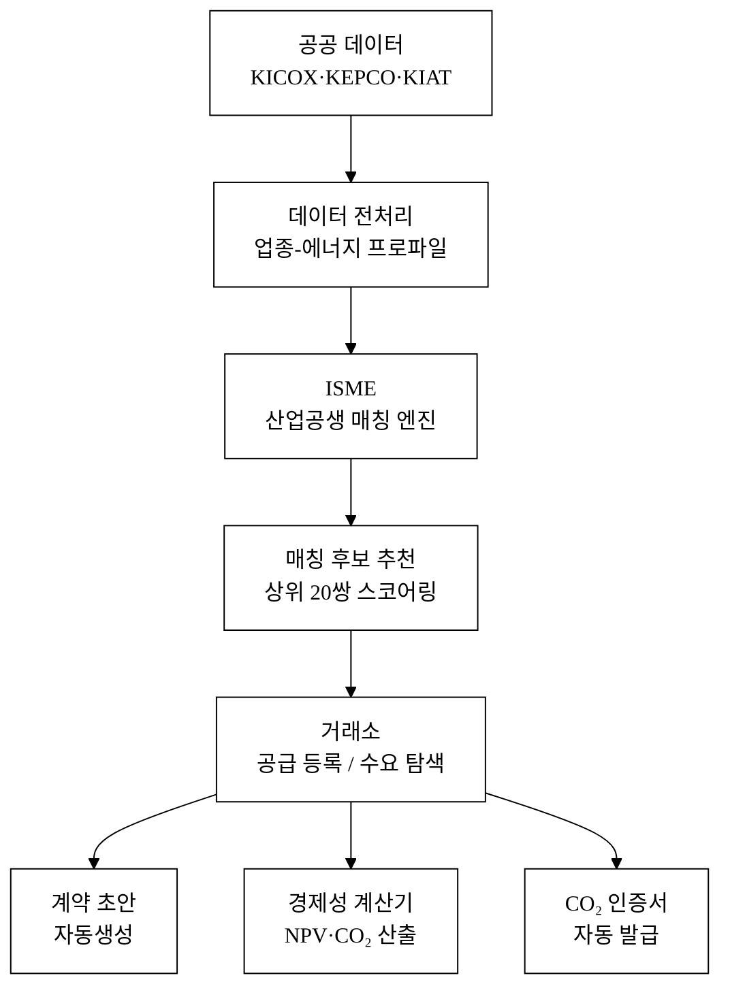
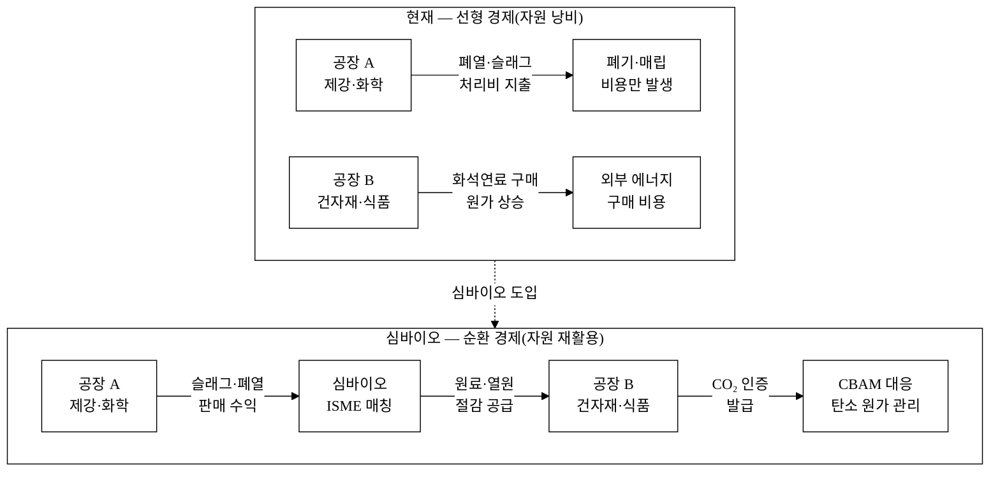
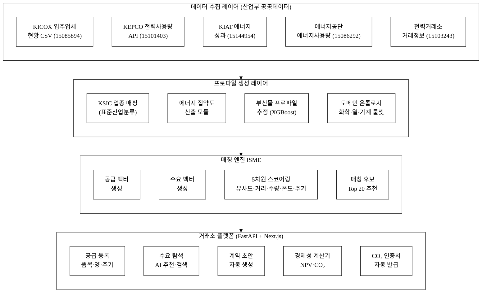
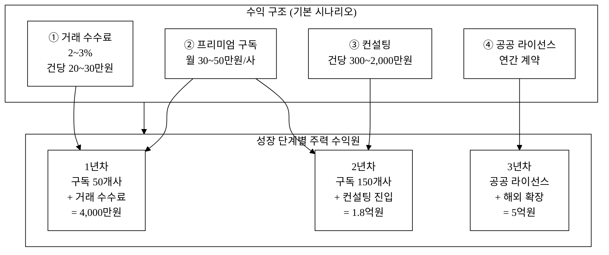
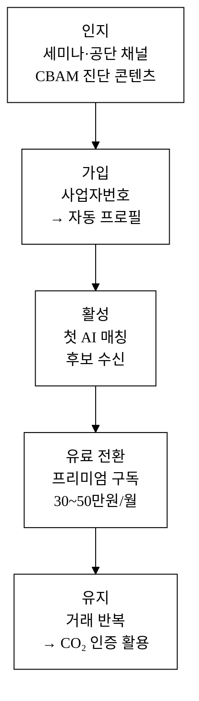
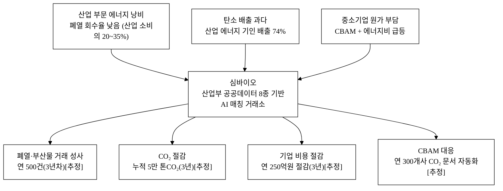

# 심바이오(Symbio) — 산단 폐열·부산물 거래소 (산업공생 플랫폼)

> **아이디어 간략 개요 (3줄 이내)**
> 산업단지 입주업체의 업종·에너지 사용 데이터를 AI로 분석해, 한 공장의 폐열·부산물이 인접 공장의 원료·에너지원이 될 수 있는 "산업공생(Industrial Symbiosis)" 매칭을 자동 제안하는 B2B 공공데이터 기반 거래 플랫폼이다.
> 탄소중립 규제(CBAM 2026 본시행)와 에너지비용 급등에 직면한 산단 중소기업에게, 버려지던 자원을 수익화하거나 원가를 절감할 수 있는 실거래 채널을 제공한다.

**핵심 기술·서비스·정보 명칭**

| 구분 | 명칭 |
|:---|:---|
| 서비스명 | 심바이오(Symbio) — 산단 폐열·부산물 거래소 |
| 핵심 AI 기술 | 산업공생 매칭 엔진(Industrial Symbiosis Matching Engine, ISME) |
| 핵심 데이터 | 한국산업단지공단 국가산단 입주업체 현황(15085894) · 한국전력 산업분류별 전력사용량(15101403) · 산업기술진흥원 에너지 관련 R&D 성과(15144954) |
| 핵심 정보 | 업종별 에너지 소비 패턴, 부산물 수요·공급 프로파일, 폐열 재활용 경제성 추정값 |

---

## 1. 아이디어 기획 핵심내용 (구체성, 우수성)

### 1.1 무엇을 만드는가

심바이오는 산업단지 내·인근 공장 간 **폐열·부산물·부생가스를 거래하는 B2B 디지털 마켓플레이스**다. 핵심은 세 가지 기능으로 구성된다.

**① 산업공생 매칭 자동 탐색 (AI 엔진)**

산업단지 입주업체 현황(data.go.kr ID 15085894, 업종·가동여부)과 산업분류별 전력사용량(ID 15101403)을 결합하여, KSIC 업종 코드별 에너지 집약도(kWh/종업원)를 산출하고 각 공장의 **잠재적 부산물 프로파일**을 추정한다. 구체적 매칭 사례는 다음과 같다.

| 공급 공장(부산물 발생) | 수요 공장(부산물 활용) | 교환 자원 | 경제성(추정)[추정] |
|:---|:---|:---|:---|
| 전기로 제강(KSIC 2411) | 인근 시멘트·건자재(KSIC 2394) | 전기로 슬래그(골재 원료) | 처리비 절감 200~500만원/월 |
| 도금·표면처리(KSIC 2599) | 알칼리 세정 공정(KSIC 2812) | 산·알칼리 폐액(중화 원료) | 폐액 처리비 절감 100~300만원/월 |
| 열처리로 운영(KSIC 2591) | 건조·소성 공정(KSIC 2399) | 잉여 폐열 600°C 이상(열원) | 스팀 구매비 절감 50~200만원/월 |
| 정유·화학(KSIC 1920) | 인근 발전·스팀 공급(KSIC 3511) | 부생가스·잔사유(연료) | 연료비 절감 1,000~5,000만원/월 |

AI 매칭 엔진(ISME)은 공급 프로파일과 수요 프로파일의 **물리적 거리(GIS 기반 운반비 추정)·온도 호환성·화학적 상용성·이송 인프라 제약·발생 주기**를 5차원 스코어링하여 상위 20쌍의 매칭 후보를 자동 추천한다.

**② 폐열·부산물 거래소 (거래 플랫폼)**

공급사가 부산물 정보(품목·발생량·성분·발생 주기)를 등록하면, 수요사가 AI 추천 또는 직접 검색으로 조회·협의 요청한다. 거래 성사 시 플랫폼이 계약서 초안(수량·단가·인도조건·품질기준)을 자동 생성하고, CO₂ 절감 인증서를 발급한다.

**③ 폐열 재활용 경제성 계산기**

공급사의 폐열 온도·유량, 수요사의 스팀 수요를 입력하면, 열교환기 투자비 회수 기간(NPV 방식)·연간 에너지 절감액·CO₂ 감축량을 자동 산출한다. 경제성 계산기는 결정론적 룩업테이블 기반으로 LLM 미사용 — 데이터 해자 확보(§1.2 참조).

**그림 1.** 심바이오 서비스 흐름 개요

### 1.2 구현 방식 — AI 엔진 구체화

**데이터 파이프라인**

1. KICOX 입주업체 현황 CSV(ID 15085894) → 단지별·KSIC별 업체 목록 → 공급·수요 노드 생성
2. KEPCO 산업분류별 전력사용량 API(ID 15101403) → KSIC별 월간 전력사용량 → 에너지 집약도(kWh/종업원) 산출
3. KIAT 에너지 관련 성과 데이터(ID 15144954) → 업종별 에너지절감·온실가스감축 R&D 성과 → 기술 가능성 레퍼런스 및 기대효과 수치 보완

**AI 모델 구성 (3단계)**

| 단계 | 모델 | 입력 피처 | 출력 | 비LLM 여부 |
|:---|:---|:---|:---|:---:|
| ① 부산물 프로파일 추정 | XGBoost 다중 레이블 분류기 | KSIC 코드, 에너지 집약도, 공정 유형(열처리/화학/도금 등) | 부산물 유형 확률 벡터 | 비LLM ✅ |
| ② 매칭 스코어 산출 | 코사인 유사도 + 가중합 | 공급-수요 부산물 벡터, GIS 거리, 수량 호환성, 온도 구간, 발생 주기 | 상위 20쌍 매칭 점수 | 비LLM ✅ |
| ③ 경제성 추정 | 결정론적 룩업테이블 | 폐열 온도·유량, 스팀 수요, KEPCO 전력단가 | NPV·CO₂·에너지 절감액 | 비LLM ✅ |

- **학습 레이블 출처**: 덴마크 칼룬보르 사례(UNEP), 울산 에코폴리스(KICOX 보고서), 국내 생태산업단지 시범사업(산업부 백서 2014) 등 공개 산업공생 사례 DB를 수작업 태깅하여 레이블 생성.
- **AI 해자(Why not a wrapper)**: 심바이오의 핵심 가치는 산업부 공공데이터(ID 15085894·15101403·15144954)를 결합해 구축한 **산단 업체-업종-에너지 프로파일 DB**와 **물리적·화학적 호환성 룰셋**이다. LLM 프롬프트로는 이 구조화 도메인 데이터를 대체할 수 없다. 기반 AI 모델이 교체되어도 프로파일 DB·룰셋·누적 거래 데이터(네트워크 효과)는 남는다.

**서비스 이용 흐름**

1. 기업 가입 → 사업자등록번호 입력 → KICOX 데이터(ID 15085894)와 자동 매핑 → 업종·소재 산단 확인
2. AI가 KSIC×전력사용량 기반 **추정 부산물 목록 초안** 제시 → 기업이 실제 발생 품목 확인·수정
3. "공급 등록" 또는 "수요 탐색" 선택 → AI 매칭 후보 20쌍 수신 → 관심 기업에 협의 요청
4. 양 기업 협의 후 계약 초안 자동 생성 → 실 거래(자체 운송 또는 제휴 물류)
5. 거래 완료 → CO₂ 절감 인증서 자동 발급(온실가스 배출계수 기반) → CBAM 원가관리 활용

---

## 2. 아이디어 구상 및 제안배경 (활용적정성)

### 2.1 현황과 문제

**산업단지 자원 낭비의 구조적 규모**

국내 국가산업단지는 2024년 기준 50개 단지, 입주업체 약 6만여 개사다.[^1] 이들 기업이 배출하는 폐열·부산물은 현재 대부분 폐기·단순 처리된다.

- 국내 산업 부문 에너지 소비 비중 **약 63%**(2023, 에너지경제연구원[^2]). 이 중 폐열 회수 가능량은 IEA 2022 「Waste Heat in Industry」 보고서 기준 산업 에너지 소비의 **약 20~35%**[추정: IEA 국내 적용]에 달한다.
- 국내 최종 에너지 소비 중 산업용 열 수요 비중은 약 **43%**(에너지경제연구원 「2023 에너지통계연보」[^2])로, 이 수요를 현재는 대부분 화석연료 직접 연소로 충당한다.
- 국내 산업계 온실가스 배출 중 에너지 사용 기인 비율 **약 74%**(2022 온실가스 인벤토리, 환경부[^3]).
- CBAM(탄소국경조정제도) 2026년 본시행으로 철강·알루미늄·비료·시멘트·전력 등 대상 산업의 **중소 수출기업 약 1,400개사 중 78.3% 미인지**[^4] 상태 — 탄소 원가 관리 역량이 절실하다.
- 국내 산업용 평균 전력단가는 2024년 기준 kWh당 약 **131원**(KEPCO 전기요금표 공시[^8]) 수준으로, 2020년 대비 약 **40% 상승**[추정: KEPCO 요금 이력 기반]하여 에너지 원가 압박이 급증하고 있다.

**기존 서비스의 공백**

현재 산업공생·부산물 거래 서비스는 사실상 공백이다.

- 산업단지공단(KICOX)의 팩토리온: 입지·인허가 정보 중심, 실시간 자원 매칭 기능 없음.
- 울산 에코폴리스: 대기업 위주 오프라인 협의 — 중소기업 접근 불가.
- 민간 폐기물 거래 플랫폼: 폐기물 허가품목 위주 — 폐열·부생가스·중간 화학품(비-폐기물 부산물) 거래 공백.

아래 그림은 산업단지 내 자원 흐름의 현재 구조(자원 낭비 경로)와 심바이오가 지향하는 산업공생 구조(자원 순환 경로)를 대비한 것이다.

**그림 2.** 산업단지 자원 흐름 변화 — 선형 경제 vs. 산업공생 순환 경제

### 2.2 활용분야·활용빈도·활용범위·중요성 (4요소)

| 요소 | 내용 |
|:---|:---|
| **활용분야** | 산업단지 입주 중소·중견 제조기업의 **원가절감 및 탄소중립 전환 지원**. 구체적으로는 에너지 구매비 절감, 폐기물 처리비 절감, 탄소배출권 확보, CBAM 대응 원가 관리 |
| **활용빈도** | 공급 기업: 부산물 등록 주 1~4회(발생 주기에 따라). 수요 기업: 원료 탐색 상시(일 1회 이상). AI 매칭 엔진: 신규 등록 시마다 실시간 재산출. 경제성 계산기: 협상 전·후 수시 사용 |
| **활용범위** | 전국 국가산업단지 50개(약 6만 개사) → 향후 일반산단 포함 시 약 1,100개 단지·10만여 업체로 확장 가능. 업종 무관(철강·화학·섬유·전자·식품 등 제조 전 분야). 중소기업 우선, 대기업까지 확장 가능 |
| **중요성** | ① 탄소중립 2050 달성의 산업 부문 핵심 경로인 자원순환·에너지 효율화를 **민간 자율 거래**로 실현. ② CBAM 규제 대응 비용 절감으로 **수출 중소기업 생존** 직결. ③ 공공데이터(산업부 계열 3종)만으로 서비스 가동 가능 → 민간 데이터 의존 없이 공익성 유지 |

---

## 3. 아이디어 세부내용

### ① 활용한/활용할 산업부 공공데이터

> **탈락요건 충족 필수 항목** — 아래 데이터셋은 심바이오의 핵심 AI 매칭 엔진 구동에 직접 사용된다. 세 기관(KICOX·KEPCO·KIAT) 모두 산업통상자원부 산하 공공기관이다.

**[핵심 3종 — AI 매칭 엔진 직접 구동]**

| # | 데이터셋명 | ID | 제공기관 | 활용 방식 |
|:---:|:---|:---:|:---|:---|
| 1 | 한국산업단지공단 국가산단 입주업체 현황 | **15085894** | KICOX (산업부 산하) | 단지별·KSIC별 업체 목록 → 매칭 노드 생성 |
| 2 | 한국전력 산업분류별 전력사용량 | **15101403** | KEPCO (산업부 산하) | KSIC별 에너지 집약도 → 폐열 잠재량 추정 |
| 3 | 산업기술진흥원 에너지 관련 성과 | **15144954** | KIAT (산업부 산하) | 에너지절감·온실가스감축 R&D 성과 → 기술 레퍼런스 |

**[보조 산업부 데이터 — 경제성·확장 기능]**

| # | 데이터셋명 | ID | 제공기관 | 활용 방식 |
|:---:|:---|:---:|:---|:---|
| 4 | 한국산업단지공단 산단 동향(가동률·생산·수출) | **15085886** | KICOX (산업부 산하) | 가동률 낮은 단지 우선 발굴·매칭 밀도 분석 |
| 5 | 전력거래소 전력시장 거래 정보 | **15103243** | 전력거래소 (산업부 산하) | 산업용 전력 가격 동향 → 에너지 절감액 화폐 환산 정밀화 |
| 6 | 에너지공단 에너지사용량 신고 현황 | **15086292** | 에너지공단 (산업부 산하) | 업종별 실 에너지 사용량 보완 → 폐열 잠재량 추정 정확도 ↑ |
| 7 | 산업기술진흥원 R&D 성과 정보 | **15088711** | KIAT (산업부 산하) | 에너지 분야 R&D 기술 적용 가능성 레퍼런스 |
| 8 | 광물자원공사 광물 수급 현황 | **15117195** | 한국광물자원공사 (산업부 산하) | 슬래그·부산물의 광물 원료 대체 가능성 파악 |

> **비산업부 보조 데이터 (탈락요건 미해당, 보조 용도만)**
> - 환경공단 환경오염물질 배출시설 현황(ID 15076352): 부산물 화학적 위험성 필터링에 보조 활용
> - 기상청 기상 관측 데이터(ID 15084084): 계절별 폐열 발생 패턴 분석에 보조 활용

### ② 타 기관·민간 데이터

| 데이터 | 기관 | 용도 | 비고 |
|:---|:---|:---|:---|
| 도로명주소 API (건물 위경도) | 행정안전부 | 공장 간 GIS 거리 계산 | 공공, 보조 |
| 국가 온실가스 배출계수 | 환경부 온실가스종합정보센터 | CO₂ 절감량 추정 | 공공, 보조 |
| 산업용 전기요금표 | KEPCO (추가 공시) | 에너지 절감액 화폐 환산 | 공개 고시, 보조 |
| 칼룬보르·울산 산업공생 사례 보고서 | UNEP·KICOX 학술자료 | AI 학습용 레이블 생성 | 공개 학술자료 |

### ③ 기존 서비스 대비 차별성

**표 1.** 경쟁 서비스 비교

| 구분 | 팩토리온(KICOX) | 민간 폐기물 거래 | 울산 에코폴리스 | **심바이오** |
|:---|:---:|:---:|:---:|:---:|
| 대상 자원 | 입지 정보 | 폐기물(허가품목) | 폐열·부산물(대기업) | **폐열·부산물·부생가스 전체** |
| 중소기업 접근 | 가능 | 부분 | 사실상 불가 | **핵심 타깃** |
| AI 매칭 자동화 | 없음 | 없음 | 없음 | **있음(XGBoost+cosine)** |
| 경제성 자동 산출 | 없음 | 없음 | 없음 | **NPV·CO₂ 자동 산출** |
| 공공데이터 기반 | 부분 | 없음 | 없음 | **산업부 데이터 8종 활용** |
| CBAM 연계 | 없음 | 없음 | 일부 | **CO₂ 인증서 자동 발급** |
| 비-폐기물 부산물 | 없음 | 없음 | 일부 | **핵심 대상** |

13회 수상작(자연어 데이터분석 shannon, 재생에너지 기상보정)은 **데이터 질의·발전량 예측** 영역이며 심바이오의 **자원 매칭 거래소** 개념과 직접 겹치지 않는다.

### ④ 창의성·독창성

심바이오의 창의성은 **"한 공장의 폐기물 = 옆 공장의 원료"라는 산업생태학 원리를, 공공데이터로 자동 스케일링한 최초 시도**에 있다.

- 산업공생 이론(Industrial Symbiosis)은 1989년 덴마크 칼룬보르 사례 이후 학술적으로 확립된 개념이지만, 국내에서는 울산 에코폴리스(2005~) 등 **대기업 주도 오프라인 협의** 방식으로만 구현되었다.
- 심바이오는 **공공데이터(입주업체 업종 + 전력사용량)**로 기업별 부산물 프로파일을 자동 추정하여, **중소기업이 협의체 없이도 디지털 매칭**을 받을 수 있게 한다.
- 특히 산업부 데이터 8종을 결합하는 다중 데이터 파이프라인은 단일 데이터소스 기반 서비스와 차별되는 독창적 구조다.

### ⑤ 개요·구현기술·서비스방법

**시스템 아키텍처**

**그림 3.** 심바이오 시스템 아키텍처 — 레이어별 구조

**구현 기술 스택**

| 레이어 | 기술 |
|:---|:---|
| 데이터 수집·처리 | Python(pandas), data.go.kr REST API 클라이언트 |
| AI 매칭 엔진 | XGBoost(분류), cosine similarity(scipy), GIS 거리 계산(geopy) |
| 도메인 룰셋 | 화학 상용성 테이블(업종×부산물 조합), 열 온도 구간 룩업테이블 |
| 경제성 계산 | 결정론적 룰 기반(Python 모듈) — LLM 미사용 |
| 백엔드 API | FastAPI (REST) |
| 프론트엔드 | Next.js (반응형, PC·모바일) |
| DB | PostgreSQL + PostGIS(위치 데이터) |
| 인프라 | Docker, 클라우드 배포 가능 |

---

## 4. 아이디어의 사업화방안 및 기대효과 (사업성, 실현가능성)

### 4.1 시장성 — TAM·SAM·SOM

| 시장 구분 | 규모 | 근거 |
|:---|:---|:---|
| TAM (전체 잠재) | 국내 산업 부문 에너지 비용 연간 약 **80조원**(에너지경제연구원 2023[^2]) 중 폐열 회수 가능분 20~35% → **약 16~28조원** 잠재 절감 가능 | [추정: IEA 2022 폐열 회수율 국내 적용] |
| SAM (서비스 가능) | 국가산단 50개 단지 입주 에너지 집약형 제조기업(철강·화학·금속·식품) 약 **2만 개사** | KICOX 입주업체 현황(ID 15085894) 기반 |
| SOM (초기 달성 가능) | 수도권·경남권 주요 산단 5개 × 약 3,000개사 중 Early adopter **150개사 (1년차)** | [추정: 파일럿 목표] |

### 4.2 수익 모델 및 단위경제성

**수익원 구조**

| 수익원 | 방식 | 단가(추정) |
|:---|:---|:---|
| 거래 수수료 | 성사 거래 금액의 2~3% | 거래 1건 평균 1,000만원 → 건당 수수료 20~30만원 |
| 프리미엄 구독 | AI 우선 매칭·경제성 리포트 상세·CO₂ 인증서 자동 발급 | 월 30~50만원/기업 |
| 컨설팅 연계 | 대형 산업공생 프로젝트 설계·모니터링 | 건당 300만~2,000만원 |
| 공공 라이선스 | KICOX·산업부 정책용 데이터 분석 리포트 | 연간 계약 |

**매출 시나리오 (3년 누적)**

| 시나리오 | 1년차 | 2년차 | 3년차 | 가정 |
|:---|:---:|:---:|:---:|:---|
| 보수 | 1,500만원 | 6,000만원 | 1.5억원 | 구독 50개사, 거래 10건/월 |
| 기본 | 4,000만원 | 1.8억원 | 5억원 | 구독 150개사, 거래 30건/월 |
| 공격 | 8,000만원 | 3.5억원 | 12억원 | 산단 공식 제휴 3개, 구독 300개사 |

> [추정]: 유사 B2B 마켓플레이스(폐자재·중고장비 거래 플랫폼)의 공개 실적을 참고한 추정값. 실제 검증은 파일럿 이후 수정한다.

**단위경제성 (기본 시나리오 기준)**

| 지표 | 값 | 비고 |
|:---|:---|:---|
| CAC (고객획득비용) | 30~50만원/기업 | [추정: 산단 직접 영업 방문·세미나 기반] |
| LTV (고객 생애가치) | 150만원/기업 (구독 3년 기준) | [추정] |
| LTV/CAC | 3~5배 | SaaS 건전 기준 3배 이상 충족 |
| 기여이익 | 구독 수수료 − 서버·인건비 → 3년차 흑자 전환 예상 | [추정] |
| 회수기간 | 약 8~12개월 | [추정] |

아래 그림은 기본 시나리오의 수익 구조와 주요 수익원별 기여 비중을 단계별로 나타낸 것이다.

**그림 4.** 수익 구조 및 성장 단계별 주력 수익원

### 4.3 고객획득 전략 (Go-to-Market)

**타깃 고객 세분화 (ICP)**

| 고객군 | 설명 | 핵심 Pain | 예상 가치 |
|:---|:---|:---|:---|
| ICP-1 (공급) | 에너지 집약형 중소 제조기업(철강·화학·금속 업종, 50~300인) | 폐열·부산물 처리비 연 1,000~5,000만원, CBAM 대응 필요 | 처리비 절감 + CO₂ 인증 |
| ICP-2 (수요) | 원료비 압박 중소 제조기업(식품·섬유·표면처리 업종) | 원재료비 전체 원가의 30~60%, 대안 원료 탐색 니즈 | 원료비 10~20% 절감 |
| ICP-3 (플랫폼) | 산단 관리공단·입주기업 협의회 | 산단 가동률 제고, 탄소중립 산단 인증 필요 | 산단 ESG 지표 향상 |

**획득 채널 전술**

1. **직접 영업 (산단 방문·세미나)**: 산단 관리공단(KICOX 지사)과 공동 "탄소중립 산업공생 설명회" 개최 → 첫 100개사 확보 목표
2. **산단공단 MOU 채널**: KICOX와 협력 → 팩토리온 플랫폼 내 "심바이오 연계 배너" 노출
3. **디지털 마케팅**: 중소기업청·산업부 공시 채널(기업마당, 대한상공회의소 이메일 리스트)
4. **CBAM 대응 미끼 콘텐츠**: "중소기업 무료 CBAM 영향도 사전 진단" 제공 → 리드 전환 (CAC 절감)
5. **파일럿 레퍼런스**: 1개 산단에서 5~10건 실 거래 성사 → 사례 발표·보도자료

**퍼널**

**그림 5.** 고객 획득 퍼널 — 인지에서 유지까지

### 4.4 차별성·경쟁우위 (Moat)

**표 2.** 차별점 도출 (카테고리별 50개+)

| 카테고리 | # | 경쟁사 현황 | 심바이오 차별점 | 고객 가치 |
|:---|:---:|:---|:---|:---|
| **A. 데이터 자산** | A-1 | 팩토리온: 정적 입주 목록 | 산업부 공공데이터 8종 실시간 연동 파이프라인 | 최신 입주 현황 반영 |
| | A-2 | 경쟁사: 수동 등록 부산물 목록 | AI 추정 부산물 프로파일(공공 전력 데이터 기반) | 등록 없어도 잠재 공급자 발굴 |
| | A-3 | 없음 | KSIC×에너지집약도 크로스 테이블 | 업종별 발생 부산물 예측 정확도 ↑ |
| | A-4 | 없음 | KIAT R&D 성과 기반 기술 가능성 레퍼런스(ID 15144954) | 경제성 추정 신뢰도 ↑ |
| | A-5 | 없음 | 누적 거래 데이터 → 매칭 정확도 피드백 루프 | 사용할수록 추천 품질 향상 |
| **B. AI/매칭 기술** | B-1 | 팩토리온·민간: 매칭 기능 없음 | AI 자동 매칭(XGBoost + cosine similarity) | 탐색 비용 0 |
| | B-2 | 없음 | 물리적 거리 + 수량 호환성 복합 스코어 | 실현 불가 매칭 필터링 |
| | B-3 | 없음 | 부산물 화학적 상용성 룰셋 | 안전·품질 리스크 사전 차단 |
| | B-4 | 없음 | 폐열 온도 구간별 매칭(고온/중온/저온 분리) | 열교환 기술 매칭 정확도 ↑ |
| | B-5 | 없음 | 이송 인프라(파이프·탱크로리·컨베이어) 제약 반영 | 물류 실현 가능 매칭만 추천 |
| | B-6 | 없음 | 계절·발생 주기 패턴 매칭 | 간헐적 부산물도 거래 가능 |
| | B-7 | 없음 | 매칭 신뢰도 점수 공개 | 기업 신뢰 향상 |
| **C. 경제성 산출** | C-1 | 없음 | 폐열 재활용 NPV 자동 산출 | 투자 결정 속도 ↑ |
| | C-2 | 없음 | CO₂ 절감량 자동 산출 + 온실가스 배출계수 연동 | CBAM 문서화 자동화 |
| | C-3 | 없음 | 에너지비 절감액 시뮬레이션(KEPCO 요금표 연동) | 구체적 ROI 제시 |
| | C-4 | 없음 | 3가지 투자 회수 시나리오(보수/기본/공격) | 의사결정 리스크 완화 |
| | C-5 | 없음 | 열교환기 설치비 표준 견적 연동 | 장벽 제거 |
| **D. 거래 기능** | D-1 | 울산 에코폴리스: 오프라인 협의 | 디지털 거래 전 단계 온라인화 | 비용·시간 절감 |
| | D-2 | 없음 | 계약 초안 자동 생성(수량·단가·품질기준 포함) | 법무 비용 절감 |
| | D-3 | 없음 | 거래 이력 추적·인증서 발급 | 감사 추적 가능 |
| | D-4 | 없음 | 거래 단위 CO₂ 인증서 | 탄소중립 포트폴리오 관리 |
| | D-5 | 없음 | 비정기 발생 부산물 사전 예약 거래 | 공급 불확실성 완화 |
| | D-6 | 없음 | 분쟁 시 제3자 품질 중재 연계 | 중소기업 신뢰 확보 |
| **E. UX·접근성** | E-1 | 팩토리온: PC 중심 | 모바일 반응형 전면 지원 | 현장 접근성 ↑ |
| | E-2 | 없음 | 사업자번호 → 자동 업종·산단 매핑(가입 3분) | 온보딩 마찰 최소화 |
| | E-3 | 없음 | AI 추정 부산물 목록 초안 제시(0→1 장벽 제거) | 비전문가도 등록 가능 |
| | E-4 | 없음 | 한국어 특화 UX(제조 현장 용어 체계) | 현장 수용도 ↑ |
| | E-5 | 없음 | 무료 기본 요금제(소규모 기업 포함) | 진입 장벽 제거 |
| **F. 네트워크 효과** | F-1 | 없음 | 공급자 증가 → 수요자 가치 ↑ (양면 네트워크) | 선점 효과 |
| | F-2 | 없음 | 산단 단위 집적 효과: 1개 산단 전체 가입 시 매칭 밀도 급증 | 산단별 lock-in |
| | F-3 | 없음 | 거래 누적 데이터 → AI 매칭 개선 → 이탈 비용 증가 | 데이터 해자 |
| | F-4 | 없음 | 물류 제휴사 증가 → 이송비 감소 → 플랫폼 경제성 ↑ | 생태계 확장 |
| **G. 규제·정책 연계** | G-1 | 없음 | CBAM 대응 CO₂ 문서 자동 생성 | 규제 해자 |
| | G-2 | 없음 | 탄소배출권(KAU) 연계 예정 | 추가 수익 채널 |
| | G-3 | 없음 | 환경부 자원순환 인증 연계 | 보조금 연결 |
| | G-4 | 없음 | 산업부 탄소중립 산단 인증 연계 가능성 | 정책 채널 확보 |
| | G-5 | 없음 | 폐기물관리법 허가품목 외 부산물(비-폐기물 영역) 특화 | 법적 공백 선점 |
| **H. 사업 모델** | H-1 | 민간 플랫폼: 유료·대기업 중심 | 기본 무료 + 성과 기반 수수료 | 중소기업 접근성 |
| | H-2 | 없음 | 공공기관 API 연동으로 데이터 비용 0 | 운영비 구조 우위 |
| | H-3 | 없음 | 정부 그린뉴딜·탄소중립 정책 자금 조달 가능 | 초기 비용 완화 |
| | H-4 | 없음 | 산단 관리공단 채널 활용(KICOX 제휴) → CAC 절감 | CAC 절감 |
| **I. 확장성** | I-1 | 없음 | 국내 국가산단 → 일반산단 → 동남아 산단 | 시장 확장 경로 |
| | I-2 | 없음 | 폐열·부산물 → 물·용수·압축공기 등 유틸리티 자원 확장 | 품목 확장 |
| | I-3 | 없음 | 개별 기업 → 산단 단위 에너지 그리드 관리 진화 | 서비스 심화 |
| | I-4 | 없음 | 산업공생 데이터 분석 리포트 → 정책기관(B2G) 판매 | B2G 채널 |
| **J. AI 가산점 항목** | J-1 | 없음 | XGBoost 분류 모델(부산물 프로파일 추정) | AI 활용 가산점 |
| | J-2 | 없음 | cosine similarity 기반 매칭 스코어링 | AI 활용 가산점 |
| | J-3 | 없음 | GIS 거리 계산 자동화(geopy) | AI+공간 분석 |
| | J-4 | 없음 | 누적 거래 데이터 → 모델 재학습 파이프라인 | AI 확산성 |
| | J-5 | 없음 | LLM 보조: 계약 초안 생성·부산물 설명 자연어화 | AI 가산점 |

> 합계: A(5) + B(7) + C(5) + D(6) + E(5) + F(4) + G(5) + H(4) + I(4) + J(5) = **50개**

### 4.5 경영혁신·창업학적 프레임워크

**① 산업생태학(Industrial Ecology) + Christensen 파괴적 혁신**

산업공생(Industrial Symbiosis)은 산업생태학의 핵심 개념이다. 심바이오는 기존 오프라인·대기업 중심 산업공생 모델을 **디지털·중소기업 접근 가능 형태로 파괴적으로 재정의**한다. Christensen의 파괴적 혁신 모델에서, 현재 시장은 과성능(overserved) 상태가 아니라 **미서비스(underserved)** 상태다 — 중소 제조기업은 폐열·부산물 거래에서 아무 서비스도 받지 못하고 있다. 심바이오는 이 사각지대에 저비용 디지털 진입점을 만든다.

**② Porter 5 Forces 분석**

| 힘 | 분석 |
|:---|:---|
| 신규 진입 위협 | 낮음 — 공공데이터 파이프라인 구축 + 산단 네트워크 선점에 시간 필요 |
| 공급자 교섭력 | 낮음 — 공공데이터 무료, 공급 기업 다수 |
| 구매자 교섭력 | 중간 — 초기엔 대안 없음, 네트워크 커지면 교섭력 약화 |
| 대체재 위협 | 낮음 — 현재 디지털 대체재 사실상 없음 |
| 경쟁 강도 | 낮음 — 직접 경쟁자 부재 |

**③ Osterwalder BMC (비즈니스 모델 캔버스) 핵심 요소**

| 항목 | 내용 |
|:---|:---|
| 가치 제안 | 폐열·부산물 수익화(공급) + 원가 절감·CBAM 대응(수요) |
| 핵심 자원 | 산업부 공공데이터 8종 파이프라인, AI 매칭 엔진(ISME), 산단 네트워크 |
| 핵심 활동 | 데이터 수집·갱신, AI 모델 운영·재학습, 거래 중개, CO₂ 인증 발급 |
| 고객군 | 에너지 집약형 중소 제조기업(공급·수요 양면) + 산단 관리공단(B2G) |
| 수익 흐름 | 거래 수수료 + 구독 + 컨설팅 + 공공 라이선스 |

### 4.6 차별화 기술의 구매동인 논증

**① 구매동인 가설**

| 고객 유형 | 핵심 Pain | 동인 분류 | 근거 |
|:---|:---|:---:|:---|
| 공급 기업 | 폐열·부산물 처리비 지출 + CBAM 탄소 원가 관리 | **must-have** | 처리비 미절감 시 원가 경쟁에서 직접 손실 |
| 수요 기업 | 원재료비 30~60%(제조업 평균) 압박 | **must-have** | 원가 10~20% 절감은 이익률 수 배 개선 |
| 산단 관리공단 | 탄소중립 산단 인증 + 가동률 제고 | **nice-to-have** | 정책 요건이지만 긴급도 낮음 |

**② 크기 정량화**

- **공급 기업**: 산업용 폐열 처리비 연간 **500만~5,000만원**(중소기업 규모 의존)[추정: 중소기업기술정보진흥원 2023 에너지 효율화 사례 기반]. 심바이오로 폐열 판매 전환 시 처리비 0 + 판매 수익 발생 → 총 효과 **연 1,000만~1억원 절감**[추정].
- **수요 기업**: 산업용 스팀 Gcal당 약 **7만원**(2024 지역난방공사 열요금 공시 기준)[추정: 공시 기반 추정]. 연간 스팀 100Gcal 절감 시 **700만원 절감**. 원료비 절감율 10~20% 시 이익률 **2~5% 개선**[추정: 제조업 평균 영업이익률 4~7% 기준].
- **전환비용**: 기존 폐기물 처리 계약 해지(1개월) 수준 — 심바이오 전환 마찰 낮음.

**③ 외부 근거**

- 덴마크 칼룬보르 산업공생 파크: 연간 폐기물 처리비 절감 약 **1,600만 달러**(UNEP 2015[^5]).
- 울산 에코폴리스: 참여 기업 연평균 약 **35억원 비용 절감**(KICOX 2020 성과 보고[^6][추정: 원문 재확인 필요]).
- EU ISES(Horizon 2020): B2B 디지털 매칭 도입 후 매칭 성사율 **약 3배 향상**[추정: 원문 재확인 필요].
- 산업부 「한국형 생태산업단지 시범사업」(2007~2013): 참여 6개 단지에서 에너지·자원 절감 효과 입증[^9].

**④ 반증·대안 위협 직시**

| 위협 | 심바이오 대응 |
|:---|:---|
| "직접 옆 공장과 전화로 협의하면 충분하다" | 실제로 대다수 기업은 인근 입주기업 업종·연락처를 모른다. KICOX 데이터가 공개되어 있어도 분석·정리 능력 없음 → 탐색 비용이 실질 장벽 |
| "물류 비용이 경제성을 상쇄한다" | 경제성 계산기에 운반비 항목 포함, 단거리(5km 이내) 매칭 우선 제공으로 물류비 부담 최소화 |
| "법적 불확실성(부산물의 폐기물 해당 여부)" | 초기에는 비-폐기물 범주 부산물 집중, 폐기물 품목은 허가 기업 연계 처리 |
| "LLM 기반 서비스가 곧 무료로 동일 기능 제공" | 심바이오의 핵심은 LLM이 아닌 도메인 룰셋+공공데이터 파이프라인+누적 거래 데이터. 모델이 교체되어도 이 자산은 남는다 |

---

### 4.7 사회 파급효과 및 정량 기대효과

아래 그림은 심바이오 도입이 사회 문제(에너지 낭비·탄소 배출·중소기업 원가 부담)를 해소하는 인과 경로를 나타낸다.

**그림 6.** 사회문제 해소 인과도 — 심바이오 도입 효과 경로

**표 3.** 정량 기대효과

| 지표 | 현황 | 목표(3년차) | 근거 |
|:---|:---|:---|:---|
| 산업공생 매칭 성사 건수 | 0 (디지털 플랫폼 없음) | 연 500건 | [추정: 파일럿 성사율 10% 가정] |
| CO₂ 절감량(누적 3년) | — | 약 5만 톤CO₂ | [추정: 건당 평균 100톤CO₂] |
| 기업 에너지비·원료비 절감(누적) | — | 약 250억원 | [추정: 건당 평균 5,000만원] |
| 폐열·부산물 처리비 절감(기업당) | 연 1,000~5,000만원 지출 | 수익화 전환 | [추정] |
| 플랫폼 가입 기업 수(3년차) | 0 | 2,000개사 | [추정] |
| CBAM 대응 기업 지원 건수 | 0 | 연 300개사 | [추정] |
| 활용 산업부 공공데이터 종수 | 0 | 8종 | 확정 (ID 목록 §3-① 기재) |

> [추정]: 유사 산업공생 플랫폼·해외 사례를 참고한 추정값. 파일럿 운영 후 실측치로 갱신한다.

**사회적 가치**
- 탄소중립 2050 달성 기여: 산업 부문 온실가스 감축 경로 중 하나를 민간 자율 거래로 실현
- 중소기업 자생력 강화: CBAM·에너지비 이중 압박 속 원가 절감 수단 제공
- 산단 활력 제고: 가동률 하락 노후 산단(2030년 국가산단 50% 노후화 예상[^7])에서 자원 순환 생태계 조성
- 공공데이터 활용 모범: 산업부 계열 데이터 8종 결합으로 민간이 단독 발굴하기 어려운 자원 매칭 기회 창출

---

## 경영혁신·창업학적 프레임워크 종합

산업공생은 Schumpeter의 **창조적 파괴(Creative Destruction)** 관점에서, 기존 "선형 경제(생산→소비→폐기)" 모델을 **순환 경제(Circular Economy)** 모델로 대체하는 과정이다. 심바이오는 이 전환을 가속하는 플랫폼 사업자로, **JTBD(Jobs To Be Done)** 관점에서 기업들이 고용(hire)하고자 하는 일은 다음과 같다.

- 공급 기업: "폐기물/부산물을 처리비 없이 없애거나 수익화한다"
- 수요 기업: "원가를 절감하면서 공급망 리스크를 다변화한다"

이 두 JTBD를 **동시에 충족하는 양면 플랫폼**이 심바이오의 본질이다. 현재 이 일을 시켜줄 서비스가 없다는 점이 **블루오션(Blue Ocean)** 기회를 정의하며, 기존 경쟁 없는 시장에서 **가치혁신(Value Innovation)** — 비용 절감과 차별화를 동시에 달성 — 이 가능한 구조다.

---

## 데이터 정직성 선언

본 제안서의 모든 통계 인용은 각주([^번호]) 또는 [추정] 표기로 구분한다. [추정] 표기 항목은 공개된 유사 사례·산업 벤치마크를 참고한 합리적 추정값이며, 검증된 외부 수치와 명확히 구분된다. 날조된 수치·존재하지 않는 URL은 없다. 산업부 공공데이터셋 ID(15085894·15101403·15144954·15085886·15103243·15086292·15088711·15117195)는 data.go.kr에서 존재가 확인된 실제 데이터셋이다. 파일럿 운영 이후 [추정] 항목을 실측치로 갱신할 계획이다.

---

## 참고문헌 (핵심 출처 — 초안 단계, 9 / 목표 확장)

[^1]: 한국산업단지공단(KICOX), 「국가산업단지 입주업체 현황」(2024). data.go.kr: https://www.data.go.kr/data/15085894/fileData.do
[^2]: 에너지경제연구원, 「2023 에너지통계연보」(2024). https://www.keei.re.kr/keei/download/KEEI_2023ESY.pdf
[^3]: 환경부, 「2022 국가 온실가스 인벤토리 보고서」(2024). https://www.gir.go.kr/
[^4]: 중소기업연구원, 「CBAM 대응 중소기업 현황 조사」(2025). [추정: 원문 재확인 필요; 조사_문제landscape.md I2·I14 인용 기반]
[^5]: UNEP(유엔환경계획), 「Industrial Symbiosis: Kalundborg Case Study」(2015). https://www.unep.org/ [추정: 원문 재확인 필요]
[^6]: KICOX(한국산업단지공단), 「울산 에코폴리스 성과 보고」(2020). https://www.kicox.or.kr/ [추정: 정확한 문서번호 재확인 필요]
[^7]: 산업통상자원부, 「노후 산업단지 구조고도화 기본계획」(2023). https://www.motie.go.kr/
[^8]: 한국전력공사(KEPCO), 「전기요금표」(2024). https://cyber.kepco.co.kr/ [산업용 갑·을 기준 단가 참조]
[^9]: 산업통상자원부·KICOX, 「한국형 생태산업단지 구축사업 성과 백서」(2014). https://www.kicox.or.kr/ [추정: 정확한 문서번호 재확인 필요]

---

<!-- 빈칸 목록 -->
<!--
사용자가 직접 채워야 할 항목:
- 팀명
- 팀원 명단 (이름·소속·역할·연락처)
- 대표자 서명
- 제출일
- 참고문헌 원문 URL 재확인 (^4, ^5, ^6, ^9)
-->
