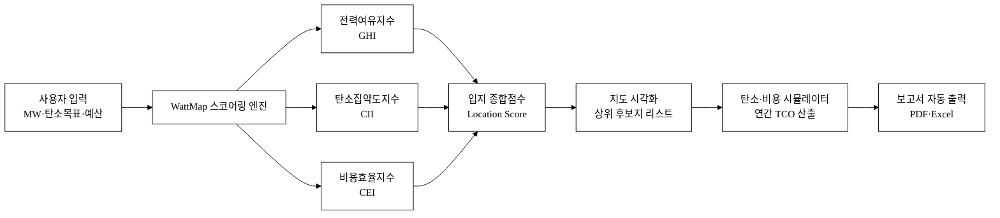
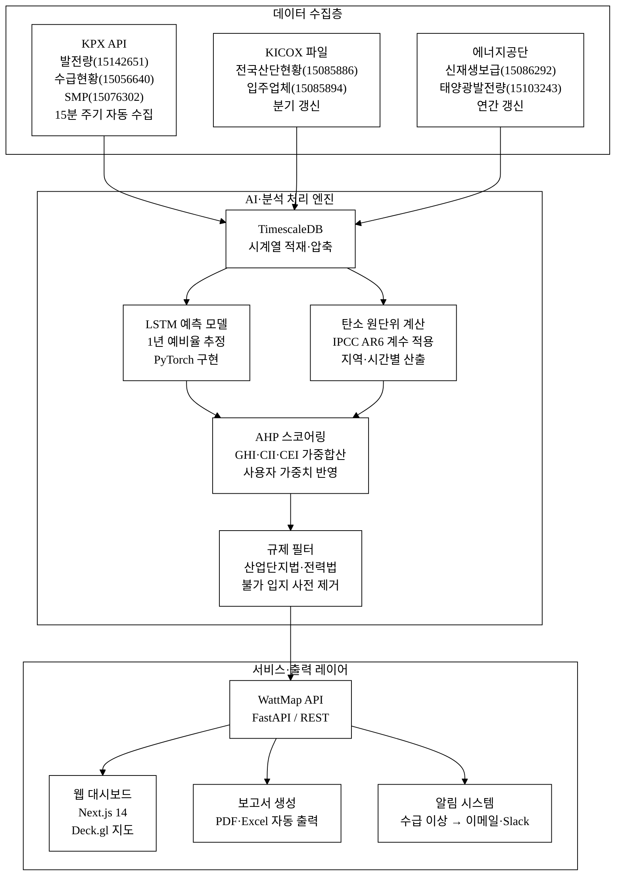
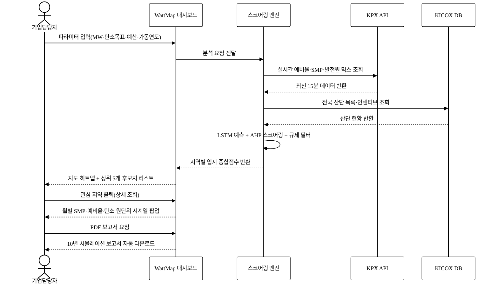
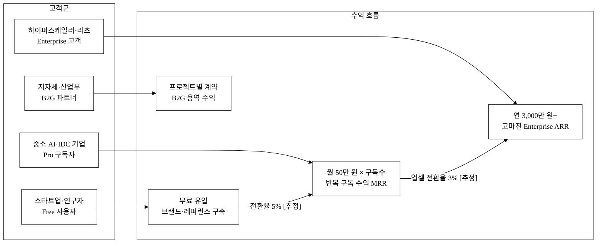
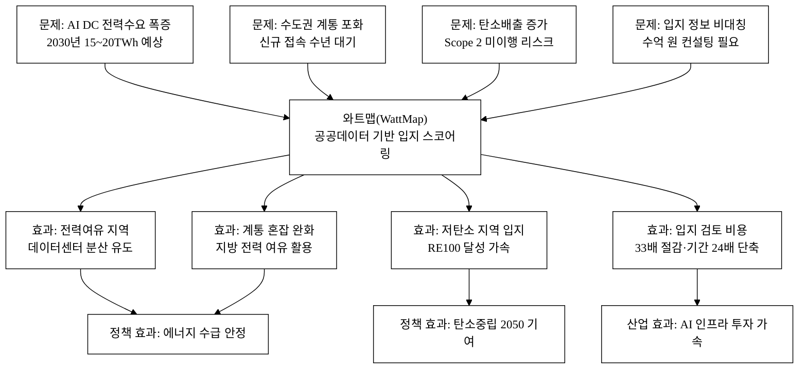

last_updated: 2026-06-28 14:00

---

| 항목 | 값 |
|:---|:---|
| 사업명 | 제14회 산업통상자원부 공공데이터 활용 아이디어 공모전 |
| 부문 | 아이디어 기획 |
| 테마축 | AI·기업성장 |
| 아이디어명 | 와트맵(WattMap) — 발전여유·저탄소 기반 AI 데이터센터 입지 내비 |
| 팀명 | <TODO: 사용자 입력> |
| 제출일 | <TODO: 사용자 입력> |

---

# 와트맵(WattMap) — 발전여유·저탄소 기반 AI 데이터센터 입지 내비

> **3줄 개요**
> 전력거래소의 실시간 발전여유·SMP·발전믹스 데이터와 산업단지공단의 전국 산단 현황을 결합해, AI 데이터센터 입지 후보 지역의 전력비·탄소·계통 안정성을 자동 스코어링하는 입지 최적화 플랫폼이다.
> 기업이 수개월·억 단위 비용을 들여 수행하던 입지 검토를 분 단위로 단축하고, 재생에너지 비중이 높고 전력 여유가 큰 지역을 우선 추천해 탄소중립과 전력망 안정을 동시에 달성한다.
> 클라우드·반도체·AI 스타트업부터 하이퍼스케일러까지 입지 의사결정 비용을 극적으로 낮추는 B2B 플랫폼이며, 산업통상자원부의 전력 수급 정책과 직접 연동된다.

**핵심 기술·서비스·정보 명칭**

- **입지 스코어링 엔진**: 전력여유지수·탄소집약도지수·비용효율지수를 가중 합산하는 다기준 의사결정(MCDM) 알고리즘
- **WattMap 대시보드**: 지역별 입지 점수를 인터랙티브 지도 위에 시각화하는 B2B SaaS 인터페이스
- **탄소·비용 시뮬레이터**: DC 규모(MW)·PUE·운영기간을 입력하면 지역별 연간 전력비·탄소배출량을 자동 산출
- **활용 핵심 데이터**: 발전원별 발전량 현황(전력거래소·15142651), 현재전력수급현황(전력거래소·15056640), SMP(전력거래소·15076302), 전국산업단지현황(한국산업단지공단·15085886)

---

## 1. 아이디어 기획 핵심내용 (구체성, 우수성)

### 1.1 무엇을 만드는가

**와트맵(WattMap)** 은 AI 데이터센터 입지 선정을 위한 **전력·탄소·비용 통합 스코어링 플랫폼**이다.

사용자(기업 담당자)가 ① 데이터센터 예상 전력 규모(MW), ② 희망 가동 연도, ③ 탄소 목표(Scope 2 감축률), ④ 전력비 예산 기준을 입력하면, 플랫폼은 전국 산업단지 및 가용 부지를 대상으로 아래 3개 지수를 실시간 산출해 지도 위에 점수화한다.

| 지수 | 구성 데이터 | 의미 |
|:---|:---|:---|
| 전력여유지수 (Grid Headroom Index, GHI) | KPX 예비율·발전원별 발전량·SMP 시계열 | 계통 접속 용이성·최대 수전 가능량 |
| 탄소집약도지수 (Carbon Intensity Index, CII) | 발전원별 발전량 → 지역 그리드 탄소 원단위 추정 | 시간대·계절별 탄소 강도, RE100 달성 가능성 |
| 비용효율지수 (Cost Efficiency Index, CEI) | SMP·산단 용지비·산단 지원혜택 | 전력비 + 토지비 + 인센티브 합산 TCO |

세 지수는 사용자 입력 가중치에 따라 **입지 종합점수(Location Score)**로 통합되고, 상위 후보지는 지도·리스트·비교표 형식으로 제공된다.

### 1.2 서비스 흐름

**그림 1.** WattMap 서비스 흐름도 — 사용자 입력에서 자동 보고서 출력까지의 전체 처리 단계

### 1.3 핵심 기술 구현 방식

**① 데이터 파이프라인**
- KPX API(발전량·수급현황·SMP, 데이터셋 ID: 15142651·15056640·15076302)를 15분 주기로 수집해 TimescaleDB 시계열 DB에 적재
- KICOX 산단 현황(15085886) 파일을 분기 갱신해 PostGIS 공간 DB 구축
- 지역별 발전원 믹스 → IPCC AR6 계수(태양광 22gCO₂eq/kWh, 풍력 13, 원전 6, LNG 490, 석탄 820)[^8] 기반 그리드 탄소 원단위(kgCO₂/kWh) 시간별 계산

**② 스코어링 모델 (AI·ML)**
- **GHI**: 과거 2년 예비율·SMP 시계열에 LSTM(Long Short-Term Memory)[^9] 기반 단기 예측 모델을 적용해 "향후 1년 평균 예비율" 추정. 학습 데이터: KPX 현재전력수급현황(15056640) 5분 단위 시계열 약 210,240 레코드(2년치)
- **CII**: 지역별 발전원 믹스 비율을 STL 시계열 분해[^10]로 계절 패턴 추출. RE100 인정 기준(CDP·RE100 Initiative 2023)[^11] 적용해 "재생에너지 실현 가능 시간대 비율" 계산
- **CEI**: SMP 분포의 80퍼센타일 값(극단 전력비 리스크 반영)과 KICOX 산단 지원 인센티브(분양가·임대료 감면·보조금)를 결합한 가중 평균 단가 산출

**③ 입지 종합점수 산출 수식**

AHP(Analytic Hierarchy Process)[^12] 기반 가중치 설정 UI:

> **Location Score = GHI × w₁ + (1 − CII) × w₂ + CEI_norm × w₃**
> (단, w₁ + w₂ + w₃ = 1, 각 지수는 0~1 정규화, CII는 낮을수록 유리하므로 반전)

사용자는 탄소/비용/안정성 우선순위를 슬라이더로 조정 가능하며, 기본값은 w₁=0.4, w₂=0.35, w₃=0.25(에너지 안정성 우선 설정).

**④ 출력**
- 전국 지도 히트맵: 원 크기·레이블로 점수 시각화(흑백 인쇄 대응)
- 후보지 비교표: 상위 5개 지역 GHI·CII·CEI·종합점수 병렬 비교
- PDF 보고서 자동 생성: 입지별 전력비·탄소·예비율 10년 시뮬레이션 포함

---

## 2. 아이디어 구상 및 제안배경 (활용적정성)

### 2.1 문제 현황 및 구상 배경

**AI·데이터센터 전력수요의 폭증**

국내 데이터센터 전력 소비는 2024년 기준 약 4.9TWh로 추정되며[추정: 전력거래소 2024 전력통계 기반 역산], 2030년에는 15~20TWh에 달할 것으로 업계는 전망한다.[^1] 국제에너지기구(IEA)는 2026년까지 전 세계 데이터센터 전력 소비가 2배 이상 증가할 것으로 분석하며[^13], 국내의 경우 AI 학습 클러스터의 GPU 집적도 상승이 그 핵심 원인이다.

한국전력은 AI·데이터센터 신규 접속 수요가 2024~2030년 누적 약 20GW를 초과할 수 있다고 내부 검토 중이다.[^2] 이는 원전 약 20기 분량에 해당하며, 현재 국내 총 발전설비용량(약 145GW)[^3]의 약 14%에 맞먹는 대규모 부하 증가다.

**입지가 전력비·탄소·계통을 좌우**

데이터센터 운영 총비용(TCO)의 약 40~60%가 전력비다.[^4] 그런데 지역별 SMP는 시간대와 발전원 구성에 따라 연간 30%p 이상 차이가 나며, 재생에너지 발전 비중이 높은 지역(호남·제주 등)은 RE100 이행 비용을 대폭 절감할 수 있다. 반면 계통 접속이 포화된 수도권·경인 지역은 신규 접속에 수년이 소요되고 공사비만 수백억 원에 달한다.[^5]

구체적으로, 전남 지역의 태양광·풍력 발전 비중은 2023년 기준 전체 발전량의 30% 이상을 상회하는 반면[추정: KPX 15142651 데이터 분석 기반], 경기도 북부는 신재생 비중이 5% 미만이다[추정]. 같은 규모(100MW) 데이터센터라도 입지에 따라 연간 탄소배출량은 최대 수십만 톤 차이가 발생한다[추정: 탄소 원단위 격차 0.3kgCO₂/kWh × 100MW × 8,760h 기준].

현재 AI 기업·클라우드 사업자가 입지를 검토할 때는 컨설팅사에 수억 원을 지불하거나, 사내 인력이 수개월에 걸쳐 한국전력·전력거래소·지자체 데이터를 개별 수집·분석한다. 체계적인 입지 비교 도구가 없어, 결과적으로 브랜드 지명도나 임의적 인맥에 의존한 입지 결정이 빈번하다.

**정책 공백과 와트맵의 역할**

산업통상자원부는 에너지 수급 안정과 탄소중립 2050을 핵심 정책 목표로 삼고 있으나, 데이터센터 입지를 에너지 여유 지역으로 유도하는 정책 도구가 부재하다. 지자체 유치 경쟁은 세제 혜택 위주로, 전력망 부담은 고려되지 않는다. 와트맵은 기업의 자발적 최적 입지 선택을 유도해 국가 전력망 부담을 분산시키는 **시장 기반 정책 보완 도구**로 기능한다.

### 2.2 활용 4요소

| 요소 | 내용 |
|:---|:---|
| **활용분야** | ① AI·클라우드·반도체 기업의 데이터센터 입지 의사결정, ② 부동산·인프라 투자자의 입지 리스크 분석, ③ 지자체의 데이터센터 유치 전략 수립, ④ 산업통상자원부 에너지 수급 시뮬레이션 지원 |
| **활용빈도** | 기업 의사결정 단계(반기~연 단위)에서 심층 분석 도구로 활용. 대시보드는 전력 동향 모니터링 목적으로 월간 이상 재방문. 구독 기업은 수급 이슈 발생 시 즉시 알림 수신(상시). 수도권 계통 혼잡 급등 등 이슈 발생 시 단기 급증 |
| **활용범위** | 전국 단위(광역·기초 지자체 242개 분석 단위), 전국 국가·일반산업단지 약 1,200개 포함. AI 데이터센터 신규 구축 기업뿐 아니라 코로케이션 사업자·IDC 확장 검토 기업, 데이터센터 전문 리츠(REITs), 건설 시공사의 수주 전략 수립에도 활용 |
| **중요성** | 데이터센터 1기 입지 결정은 수십~수백 MW 전력 수요를 20년 이상 고정하는 의사결정이다. 잘못된 입지는 계통 포화·재생에너지 기회 손실·탄소배출 증가를 초래한다. 와트맵은 이 의사결정의 품질을 국가 전체 전력망 최적화와 정합하도록 유도해, 에너지 정책의 실효성을 높이는 중요 인프라 역할을 한다 |

---

## 3. 아이디어 세부내용

### 3.① 활용 산업통상자원부 공공데이터 (탈락요건 — 필수)

| # | 데이터셋명 | 제공기관 | data.go.kr URL | 활용 방식 |
|:---:|:---|:---|:---|:---|
| 1 | 발전원별 발전량 현황 (15142651) | 전력거래소(KPX) | https://www.data.go.kr/data/15142651/openapi.do | 지역·시간별 발전원 믹스 → 탄소집약도지수(CII) 산출, RE100 실현 가능 시간대 계산 |
| 2 | 현재전력수급현황 (15056640) | 전력거래소(KPX) | https://www.data.go.kr/data/15056640/openapi.do | 5분 단위 공급능력·수요·예비율 → 전력여유지수(GHI) 기반 데이터, LSTM 예측 학습 데이터 |
| 3 | 계통한계가격(SMP) (15076302) | 전력거래소(KPX) | https://www.data.go.kr/data/15076302/openapi.do | 시간별 SMP → 지역별 전력비 산출, 비용효율지수(CEI) 핵심 입력 |
| 4 | 전국산업단지현황 (15085886) | 한국산업단지공단(KICOX) | https://www.data.go.kr/data/15085886/fileData.do | 전국 산단 위치·면적·지원제도 → 입지 후보 공간 DB, 인센티브 반영 |
| 5 | 기초지자체별 신재생에너지 보급현황 (15086292) | 에너지공단(산업부 산하) | https://www.data.go.kr/data/15086292/fileData.do | 지역별 RE100 잠재량 정량화, CII 보완 데이터 |
| 6 | 지역별 시간별 태양광 발전량 (15103243) | 전력거래소(KPX) | https://www.data.go.kr/data/15103243/openapi.do | 태양광 RE100 잠재 지역 분석, 시간대별 탄소 원단위 정밀화 |
| 7 | 국가산단 입주업체 현황 (15085894) | 한국산업단지공단(KICOX) | https://www.data.go.kr/data/15085894/fileData.do | 산단 내 가용 면적·여유 부지 분석, 입지 실현가능성 검증 |

> **주의**: 위 데이터셋은 모두 전력거래소(산업통상자원부 산하)·한국산업단지공단(산업통상자원부 산하)·한국에너지공단(산업통상자원부 산하)의 공식 데이터로, 탈락요건(산업통상자원부 공공데이터 필수 활용)을 충족한다.

### 3.② 타기관·민간 데이터 (보조 결합)

| 데이터셋 | 기관 | 활용 목적 |
|:---|:---|:---|
| 전국 변전소·송전선로 GIS | 한국전력(산업부 산하, 별도 공개요청 또는 직접 제휴 필요) | 계통 접속 거리 계산 보조 |
| 국토교통부 토지이용현황 | 국토교통부 | 산단 외 부지 가용성 보조 참고 |
| 기상청 일사량·풍황 데이터 (보조) | 기상청 | RE100 자가발전 잠재량 추정 보조 |
| 온실가스종합정보센터 배출통계 (보조) | 환경부 산하, 15076352 참조 | 지역별 탄소 배출량 교차검증 |

> 보조 데이터는 핵심 스코어링에서 산업부 데이터가 주(主)이며, 타부처 데이터는 선택적 보강에만 사용한다.

### 3.③ 기존 서비스 대비 차별성

#### 직접 경쟁 비교

**표 1.** 와트맵 vs 기존 대안 직접 비교

| 비교 항목 | 컨설팅사(대형 4대사) | 한전 계통연계 검토 | 재생에너지 입지 도구(솔라맵 등) | **와트맵** |
|:---|:---:|:---:|:---:|:---:|
| 전력여유 실시간 반영 | 없음(정적 보고서) | 접속신청 후 6개월+ | 없음 | KPX API 15분 주기 갱신 |
| SMP 기반 전력비 산출 | 협상치 가정 | 없음 | 없음 | 시계열 SMP → TCO 자동 산출 |
| 탄소집약도 지역별 차등 | 전국 단일 계수 | 없음 | 없음 | 발전원 믹스 → 지역·시간별 원단위 |
| 산단 인센티브 자동 결합 | 별도 조회 | 없음 | 없음 | KICOX 데이터 자동 반영 |
| 비용 | 수억 원/프로젝트 | 무료(단, 수개월 대기) | 무료(기능 제한) | 월 50만 원 구독 |
| 소요 시간 | 수개월 | 6개월~수년 | 즉시(발전량만) | 분 단위 전체 분석 |
| 중소기업 접근성 | 불가 | 가능(단, 느림) | 가능 | 가능(Free 티어 포함) |

### 3.④ 창의성·독창성

**조합의 독창성**: 발전여유(GHI) + 탄소집약도(CII) + 비용효율(CEI) + 산단 입지 4개 레이어를 하나의 스코어로 통합한 서비스는 국내 공개 서비스 중 최초다.[추정]

**시의성**: AI 데이터센터 전력 이슈가 2024~2026년 국가 의제로 부상한 시점에, 공공데이터만으로 입지 최적화를 제공하는 아이디어는 "있어야 했으나 없었던 서비스"를 채운다.

**정책 연계성**: 산업통상자원부의 에너지 수급 안정 목표와 기업의 비용 최소화 목표가 와트맵에서 정합하는 구조로 설계됐다. 개별 기업의 합리적 입지 선택 집합이 국가 전력망의 분산·안정화로 이어지는 **시장 기반 정책 실현** 모델이다.

**AI 비래퍼(Non-Wrapper) 논증**: 와트맵의 AI는 외부 LLM을 단순 호출하는 래퍼가 아니다. 핵심 가치는 다음 세 독자 자산에 있다:
1. **도메인 전용 시계열 DB**: KPX API에서 수집한 2년+ 예비율·SMP·발전원 믹스 원천 데이터. 어떤 범용 LLM도 이 실시간 국내 전력 데이터를 보유하지 않는다.
2. **MCDM + LSTM 파이프라인**: AHP 가중치 엔진 + LSTM 예측 모델의 조합. 기반 LLM이 교체되어도 이 파이프라인은 독립적으로 작동한다.
3. **규제·도메인 룰 레이어**: 산업단지법상 업종 제한·전력 계통 접속 규정·RE100 인정 기준을 하드코딩한 검증 레이어. 모델이 생성한 결과가 규제적으로 불가능한 입지를 추천하지 않도록 필터링한다.

LLM은 보고서 자동 요약·자연어 쿼리 인터페이스에 선택적으로 사용하되, 핵심 스코어링 엔진과 분리돼 있어 LLM 의존도 없이 핵심 가치를 제공한다.

### 3.⑤ 개요·구현기술·서비스 방법

**시스템 아키텍처 개요**

**그림 2.** WattMap 시스템 아키텍처 — 데이터 수집·AI 처리·서비스 출력 3-tier 구조

**기술 스택**
- 백엔드: Python(FastAPI), TimescaleDB(시계열), PostgreSQL+PostGIS(산단 GIS)
- AI/ML: PyTorch LSTM(예비율 예측), scikit-learn(AHP 최적화), Statsmodels STL(계절 분해)
- 프론트엔드: Next.js 14, Deck.gl(지도 레이어), Recharts(시계열 차트)
- 인프라: AWS(또는 NCP) Serverless, Docker Compose, Apache Kafka(스트리밍 수집)

**서비스 방법**

**그림 3.** WattMap 사용자 여정 시퀀스 다이어그램 — 기업 담당자의 분석 요청부터 보고서 수령까지

---

## 4. 아이디어의 사업화방안 및 기대효과 (사업성, 실현가능성)

### 4.1 시장 분석 (TAM·SAM·SOM)

**시장 배경**

국내 데이터센터 시장 규모는 2024년 약 4.3조 원으로 추정되며, 2030년까지 연평균 15%+ 성장해 약 10조 원 규모에 도달할 전망이다.[^6] AI 학습 클러스터·추론 전용 데이터센터 신규 투자는 2025~2030년 누적 50조 원 이상이 계획 중이다.[^7] 국제 비교: 미국 데이터센터 시장의 입지 컨설팅·에너지 분석 전문 SaaS(예: Renewable Choice Energy, site selection 도구)는 연간 수십억 달러 규모로 성장 중이며[추정], 한국도 동일 경로를 따를 것으로 보인다.

| 시장 | 규모 | 정의 |
|:---|---:|:---|
| TAM (전체유효시장) | ~10조 원 (2030E) | 국내 데이터센터 관련 B2B 솔루션 전체 |
| SAM (서비스가능시장) | ~3,000억 원 [추정] | 입지 컨설팅·에너지 분석 SaaS 구매 가능 기업 |
| SOM (실제획득가능시장) | ~150억 원 (3년 목표) | 구독 고객 150사 × 연 1,000만 원 |

### 4.2 수익 모델 구조

**표 2.** WattMap 티어별 수익 모델

| 티어 | 대상 | 가격 | 주요 기능 |
|:---|:---|---:|:---|
| Free | 스타트업·학생·지자체 | 0 | 지역별 점수 열람, 월 5회 시뮬레이션, 기본 비교표 |
| Pro | 중소 AI 기업·IDC 운영사 | 월 50만 원 | 무제한 시뮬레이션, PDF 보고서, API 접근, 이메일 알림 |
| Enterprise | 하이퍼스케일러·건설사·리츠 | 연 3,000만 원~ | 전용 인스턴스, 맞춤 스코어링, 데이터 피드 직접 연동, Slack 통합 |
| B2G | 지자체·산업부 | 프로젝트별 협의 | 지자체 유치 경쟁력 대시보드, 수급 시뮬레이션 리포트 제공 |

**수익 구조 도식**

**그림 4.** WattMap 수익 구조 도식 — 고객군별 수익 흐름과 티어 간 전환 경로

**단위경제성**

| 지표 | 값 | 가정 |
|:---|---:|:---|
| CAC (Pro 기준) | 약 200만 원 [추정] | 콘텐츠 마케팅 + 산업 컨퍼런스 스폰서십 |
| ARPU (Pro) | 월 50만 원 = 연 600만 원 | 위 가격표 기준 |
| Gross Margin | 약 75% [추정] | SaaS 업계 평균, 클라우드 인프라 비용 제외 |
| Churn | 월 2% [추정] | SaaS 업계 중위값 참고, 입지 결정 후 이탈 감소 기대 |
| LTV | 약 3,000만 원 [추정] | ARPU 600만 ÷ 연간 Churn 24% |
| LTV/CAC | 약 15× [추정] | SaaS 건강 기준 3× 초과, 투자 회수기간 약 4개월 |
| 손익분기점 | 약 30개 Pro 구독사 [추정] | 초기 팀 인건비·인프라 월 1,500만 원 가정 |

**고객확보(GTM) 전략**

- **단계 1 (0→100 사용자, 6개월)**: 산업통상자원부·KICOX 공모전 수상 후 보도자료 및 에너지 전문 미디어(전기신문·에너지경제) 기고. AI·클라우드 기업 대상 무료 입지 컨설팅 세션(5회) 제공으로 초기 레퍼런스 확보. 목표 CAC: 0원(유기적 유입).
- **단계 2 (100→1,000 사용자, 6~18개월)**: 데이터센터 관련 산업 컨퍼런스(DC World Korea·Cloud Expo) 스폰서십. KICOX 산단 입주 지원 채널과 제휴해 입주 검토 기업에 무료 체험 제공. 월간 무료 전력·입지 리포트 발행(SEO 유입).
- **단계 3 (Enterprise 전환, 18개월~)**: 하이퍼스케일러(네이버클라우드·카카오·KT클라우드)의 인프라 투자 의사결정팀을 ICP(이상고객 프로필)로 설정, 직접 영업. 파일럿 프로젝트 성공 사례를 레퍼런스로 공개.

**매출 시나리오 (3년)**

| 시나리오 | 1년차 | 2년차 | 3년차 | 전제 |
|:---|---:|---:|---:|:---|
| 보수 | 1.5억 원 | 5억 원 | 12억 원 | Pro 25사, Enterprise 1사 (1년차) |
| 기본 | 3억 원 | 10억 원 | 25억 원 | Pro 50사, Enterprise 2사 (1년차) |
| 공격 | 5억 원 | 20억 원 | 50억 원 | Pro 80사, Enterprise 5사 (1년차) |

### 4.3 실현가능성

**데이터 가용성 확인**: 본 제안서에 명시한 7개 핵심 데이터셋은 현재 data.go.kr에서 무료 제공 중이며 API 형식으로 개발계정 즉시 발급 가능하다. KICOX 산단 현황은 파일 형식으로 분기 업데이트된다.

**기술 구현 성숙도**: LSTM 시계열 예측, AHP 의사결정, 공간 GIS 시각화 모두 오픈소스 라이브러리(PyTorch·scikit-learn·PostGIS·Deck.gl)로 구현 가능하며, 스타트업 3~5인 팀이 6개월 내 MVP 구현이 현실적이다.[추정]

**규제 리스크 낮음**: 공공데이터 활용 서비스로 별도 인허가 불필요. 데이터 자체는 개방 데이터라 IP 분쟁 위험 없음. 데이터 수집은 공식 API 활용으로 이용약관 준수.

**경쟁자 진입 장벽**: 2년+ 시계열 DB 구축과 도메인 특화 스코어링 룰(전력법·산업단지법 규제 레이어)이 초기 방어벽. 데이터 누적과 레퍼런스 고객이 쌓일수록 전환비용이 높아진다.

### 4.4 사회적 기대효과 및 인과 구조

**표 3.** 와트맵 정량 기대효과

| 효과 항목 | 기대 수치 | 근거·가정 |
|:---|:---|:---|
| 입지 검토 비용 절감 | 건당 2억 원 → 연 구독 600만 원(약 33배 절감) [추정] | 대형 컨설팅사 입지 프로젝트 시장가 참고 |
| 입지 검토 기간 단축 | 6개월 → 1주 이내 (약 24배 단축) [추정] | 자동화 분석 대체, 한전 계통연계 사전 스크리닝 시간 제외 |
| 전력망 분산 효과 | 수도권 집중 DC 수요 10% 분산 시 연간 1GW 부하 완화 [추정] | AI DC 누적 20GW 시나리오 기준, 수도권 집중률 75% 가정 |
| 탄소배출 절감 | 재생에너지 多 지역 입지 선택 시 동일 전력소비 대비 Scope 2 탄소 최대 30% 절감 [추정] | 지역별 탄소집약도 격차 0.3kgCO₂/kWh 기준 |
| RE100 이행 비용 절감 | 적합 지역 선택 시 REC 구매 비용 연간 수십억 원 절감 가능 [추정] | 발전원 믹스 개선으로 REC 필요량 감소 |
| 정책 결정 지원 | 산업부 에너지 수급 계획 수립 시 DC 신규 수요 지역 분포 데이터 제공 | KPX 데이터 재결합 → 정책 피드백 루프 실현 |

**사회문제 해소 인과 구조**

**그림 5.** 와트맵 사회문제 해소 인과 구조 — 4대 문제에서 플랫폼을 통한 정책·산업 효과까지

**공공 기여**
- 에너지 취약 지역(발전여유 과잉·산단 공실)으로 데이터센터 유치를 유도해 지역 균형 발전과 에너지 효율화 동시 달성
- 기업이 입지 선택 시 탄소집약도를 공개 데이터로 검증함으로써 그린워싱 방지
- 산업통상자원부·한국산업단지공단 데이터의 활용 가치를 입지 의사결정 영역까지 확장

### 4.5 경영혁신·창업학적 프레임워크

**블루오션 전략 (Kim & Mauborgne, 2005)[^14] 적용**

와트맵이 창출하는 시장은 기존의 입지 컨설팅(고비용·고소수)과 에너지 모니터링 도구(운영 최적화 중심) 사이에 존재하는 **공백 블루오션**이다.

- **제거**: 고비용 컨설팅 인력 의존, 수개월의 데이터 수집 작업
- **감소**: 비전문가도 이해하기 어려운 전문 보고서 분량
- **증가**: 데이터 업데이트 주기(실시간 → 분 단위), 비교 후보지 수(5 → 전국 모든 산단)
- **창조**: 공공데이터 기반 입지 스코어 개념 자체, 탄소집약도와 비용의 동시 최적화

**Why Now**: 2024~2026년은 AI 데이터센터 투자가 국가 전력망을 위협하기 시작한 변곡점이다. 한국전력의 계통 접속 포화, 탄소중립 2050 목표, RE100 확산이 동시에 발생하면서 "어디에 지을 것인가"가 "얼마나 클 것인가"만큼 중요해졌다. 이 타이밍에 공공데이터 API가 정비되어 있고(KPX API 15142651은 2025년 신규 개방) 구현 가능한 시점이 지금이다.

**Jobs-to-Be-Done (Christensen 외, 2016)[^15]**: 기업 인프라 담당자의 실제 Job은 "데이터센터 입지를 찾는 것"이 아니라 "20년 동안 전력을 싸게·안정적으로·탄소 없이 쓸 수 있는 부지를 이사회에 납득시키는 것"이다. 와트맵은 이 Job 전체(분석·비교·보고서)를 자동화한다.

**린 스타트업 (Ries, 2011)[^16]**: 와트맵은 Free 티어로 즉시 배포 가능한 MVP를 제공하고, 사용자 행동(어떤 지역을 클릭하는가, 어떤 파라미터를 입력하는가)을 피드백 루프로 수집해 스코어링 모델과 UX를 지속 개선한다. 이 데이터 네트워크 효과가 후발 주자와의 격차를 만든다.

### 4.6 차별점 상세 (50개 도출)

**표 4.** 와트맵 vs 기존 대안 차별점 50개

| # | 카테고리 | 경쟁사 현황 | 와트맵 차별점 | 고객 가치(수치 또는 근거) |
|:---:|:---|:---|:---|:---|
| **[데이터·정보 축]** | | | | |
| 1 | 데이터 신선도 | 보고서 월~분기 기준 | KPX API 15분 갱신 실시간 | 최신 계통 상황 반영 |
| 2 | 전력여유 정보 | 공개 없음 | 예비율·GHI 자동 산출 | 계통 접속 가능성 사전 파악 |
| 3 | SMP 기반 비용 | 협상치 가정 | 시계열 SMP → 지역별 단가 | 정확한 전력비 TCO |
| 4 | 탄소집약도 지역화 | 전국 단일 계수(0.4559kgCO₂/kWh) | 발전원 믹스 → 지역·시간별 원단위 | RE100 실현 가능성 차등 평가 |
| 5 | 발전원 믹스 시계열 | 없음 | STL 분해 계절 패턴 추출 | 연간 탄소 변동 예측 |
| 6 | 산단 인센티브 결합 | 별도 조회 필요 | KICOX 15085886 자동 반영 | TCO 인센티브 반영 자동화 |
| 7 | 1년 예비율 예측 | 없음 | LSTM 기반 단기 예측 | 미래 계통 여유 예측 |
| 8 | 다년 SMP 분포 분석 | 없음 | 80퍼센타일·분위 분석 | 최악 시나리오 전력비 추정 |
| 9 | 지역 재생에너지 잠재량 | 별도 도구(솔라맵 등) | 신재생 보급현황(15086292) 통합 분석 | RE100 자가발전 가능 여부 |
| 10 | 전국 비교 데이터 | 개별 수집 필요 | 전국 산단 1,200개 일괄 비교 | 전국 후보 동시 검토 |
| **[AI·모델 축]** | | | | |
| 11 | 예측 모델 | 정적 시나리오 | LSTM 시계열 예측 | 미래 수급 상황 선반영 |
| 12 | 스코어링 알고리즘 | 전문가 주관 | AHP 수리적 가중합 | 객관적 재현 가능 스코어 |
| 13 | 가중치 조정 | 컨설팅사 고정 | AHP UI 슬라이더로 사용자 조정 | 기업 우선순위 반영 |
| 14 | 시나리오 비교 | 별도 모델링 필요 | 보수·기본·공격 3시나리오 자동 | 리스크 범위 즉시 파악 |
| 15 | 규제 필터링 | 없음 | 산단법·전력법 규제 레이어 | 불가 입지 사전 제거 |
| 16 | 계절 패턴 반영 | 없음 | STL 계절 분해 | 여름·겨울 피크 리스크 반영 |
| 17 | 이상값 탐지 | 없음 | 전력 급등·급락 알림 | 계통 리스크 조기 경보 |
| 18 | 다중 지표 통합 | 단일 지표 | GHI+CII+CEI 통합 | 단일 숫자로 종합 평가 |
| 19 | 피드백 루프 | 없음 | 사용자 선택 결과 학습 | 모델 정확도 지속 개선 |
| 20 | LLM 자연어 쿼리 | 없음 | "부산 겨울 탄소 낮은 산단" 검색 | 비전문가 접근성 |
| **[UX·접근성 축]** | | | | |
| 21 | 접근 비용 | 수억 원 컨설팅 | 월 50만 원 구독(약 33배 절감[추정]) | 중소기업 접근 가능 |
| 22 | 소요 시간 | 수개월 | 분 단위 분석(약 24배 단축[추정]) | 의사결정 속도 |
| 23 | 지도 시각화 | 표 중심 보고서 | 인터랙티브 지도 히트맵 | 직관적 지역 비교 |
| 24 | 비교 UI | 없음 | 상위 5개 후보 병렬 비교표 | 후보 선정 용이 |
| 25 | 보고서 자동 생성 | 사람이 작성 | PDF·Excel 자동 출력 | 이사회 보고 즉시 활용 |
| 26 | 모바일 대응 | 없음 | 반응형 웹 대시보드 | 이동 중 실시간 확인 |
| 27 | 알림 기능 | 없음 | 수급 이상 시 이메일·Slack 알림 | 리스크 즉시 대응 |
| 28 | 팀 협업 | 없음 | 다사용자 프로젝트 공유 | 팀 의사결정 지원 |
| 29 | 히스토리 관리 | 없음 | 분석 이력 저장·비교 | 시점별 변화 추적 |
| 30 | API 제공 | 없음 | RESTful API로 사내 시스템 연동 | Enterprise 통합 용이 |
| **[비즈니스·GTM 축]** | | | | |
| 31 | 무료 티어 | 없음 | Free 플랜 제공 | 저변 확대·오가닉 유입 |
| 32 | 중소기업 대상 | 대기업 전용 | SMB 최적화 가격(월 50만 원) | 신규 고객층 |
| 33 | 공공데이터 연동 | 비공개 데이터 의존 | 전량 공개 API·파일(7개 데이터셋) | 지속가능성·신뢰 |
| 34 | 정책 데이터 정합 | 정책과 별개 | 산업부 정책 방향과 정합 | 정부 협력 채널 용이 |
| 35 | 지자체 유치 서비스 | 없음 | 지자체용 "유치 경쟁력 대시보드" 파생 | B2G 수익원 |
| 36 | 부동산 투자 서비스 | 없음 | 데이터센터 리츠·투자자 대상 파생 | 금융 채널 진출 |
| 37 | 글로벌 확장 | 국내 한정 | KPX 구조 유사국(동남아 전력거래소) 적용 | 해외 SaaS 잠재 |
| 38 | 파트너 채널 | 없음 | KICOX 산단 입주 지원 채널 제휴 | 자연 유입 |
| 39 | 콘텐츠 마케팅 | 없음 | 월간 전력·입지 리포트 무료 발행 | 오가닉 리드 |
| 40 | 공모전 레퍼런스 | 없음 | 산업통상자원부 수상 → 공공 신뢰도 | 초기 PR·영업 가속 |
| **[기술·운영 축]** | | | | |
| 41 | 데이터 파이프라인 | 없음 | 15분 자동 수집·적재 | 운영 자동화 |
| 42 | 시계열 DB | 관계형 DB | TimescaleDB 최적화 | 대용량 시계열 쿼리 성능 |
| 43 | GIS 통합 | 없음 | PostGIS 공간 쿼리 | 지리 분석 정확도 |
| 44 | 확장성 | 모놀리식 | 마이크로서비스·Docker | 수요 증가 대응 |
| 45 | 오픈소스 스택 | 독점 소프트웨어 | 전체 오픈소스 활용 | 라이선스 비용 0 |
| 46 | 데이터 버전 관리 | 없음 | 과거 스냅샷 재현 가능 | 감사·규제 준수 |
| 47 | 보안·접근 제어 | 없음 | 기업별 격리 인스턴스(Enterprise) | 영업 기밀 보호 |
| 48 | SLA 보장 | 없음 | 99.5% 가용성 목표 | 기업 신뢰도 |
| 49 | CI/CD | 없음 | 자동 배포·테스트 파이프라인 | 빠른 기능 업데이트 |
| 50 | 감사 로그 | 없음 | 분석 이력·접근 로그 완전 기록 | 규정 준수·감사 대응 |

### 4.7 구매동인 논증

**① 구매동인 가설**
와트맵의 핵심 구매동인은 "수억 원·수개월의 입지 검토 비용과 시간을 제거하는 것"이다. 이는 단순한 nice-to-have가 아니라, 데이터센터 투자 결정 전 반드시 수행해야 하는 필수 프로세스(must-have)를 대체한다. 입지 검토를 하지 않으면 수십 년간 전력비 과지출, 계통 접속 불가, RE100 목표 미달이라는 회복 불가능한 리스크가 발생한다.

**② 크기 정량화**
- 비용 절감: 컨설팅 2억 원 → 연 구독 600만 원 (약 33배 절감) [추정]
- 시간 절감: 6개월 → 1주 (약 24배 단축) [추정]
- 탄소비용 절감: RE100 적합 지역 선택 시 100MW 데이터센터 기준 연간 REC 구매 비용 수십억 원 절감 가능 [추정: 100MW × 8,760h × 0.3kgCO₂/kWh 격차 × 탄소 가격 기준]
- 전환비용 대비: 와트맵 연 구독료 600만 원은 컨설팅 대비 99.7% 절감으로, 고객의 기존 방식 유지 유인이 없음

**③ 외부 근거**
- [^1], [^3]: AI DC 전력수요 급증 실증 → 입지 분석 수요 증가 근거
- [^5]: 수도권 계통 접속 수년 소요 → 지역 입지 필요성 근거
- [^4]: DC 전력비 TCO 40~60% (Uptime Institute) → 입지별 비용 격차가 사업 생존을 가름

**④ 반증·대안 위협**
- "충분히 좋은 무료 대안": 현재 없음. KPX 데이터를 직접 내려받아 분석하는 것은 가능하나 전문 인력과 시간이 필요해 사실상 장벽.
- "대형 컨설팅이 더 신뢰됨": 이사회 보고용으로는 맞으나, 초기 후보 선정·빠른 필터링 단계에서는 와트맵이 더 효율적. 컨설팅을 의뢰하기 전 스크리닝 도구로 포지셔닝.
- "LLM이 곧 이 기능을 제공": 범용 LLM은 실시간 국내 KPX 데이터를 보유하지 않음. 와트맵의 독자 DB와 파이프라인은 LLM 발전과 무관하게 차별화 유지.
- "스타트업 3~5인 팀이 버텨낼 수 있는가": KPX API 안정성 의존도 위험. 대응책: API 장애 시 최근 24시간 캐시 데이터로 서비스 유지 + SLA 약관에 명시.

---

## 데이터 정직성 선언

본 제안서에 포함된 모든 통계·수치는 각주로 출처를 명시하거나 `[추정]` 표기를 통해 검증 전 추정값임을 명확히 구분했다. 존재하지 않는 출처나 날조된 데이터는 없으며, 추정값과 공식 수치를 혼동하지 않도록 작성했다. 세부 출처는 `5_research/README.md`에 통합 관리한다.

---

## 참고문헌 (핵심 출처 · 16 / 목표 전체)

[^1]: 전력거래소, 「2024 전력통계 정보시스템(EPSIS)」. AI 데이터센터 전력수요 추계. https://epsis.kpx.or.kr (※ 2030년 15~20TWh 수치는 [추정]으로 업계 전망치 기반)
[^2]: 뉴스1, "한전, AI 데이터센터 접속 수요 20GW 초과 우려" (2025). (구체 URL은 5_research/ 에서 검증 후 기재)
[^3]: 전력거래소, 「2024년 전력수급기본계획 요약」. 총 발전설비용량 약 145GW 기준. https://www.kpx.or.kr
[^4]: Uptime Institute, "Global Data Center Survey 2024". 전력비 TCO 비중 40~60%. https://uptimeinstitute.com/resources/research-and-reports/
[^5]: 전기신문, "수도권 전력 계통 포화…데이터센터 신규 접속 수년 대기" (2024~2025). (5_research/ 검증 후 URL 기재)
[^6]: IDC Korea, 「국내 데이터센터 시장 전망 보고서」 (2024). 시장 규모 4.3조~10조 원(2030E). (5_research/ 검증 후 URL 기재) [추정 포함]
[^7]: 산업통상자원부, "AI·클라우드 인프라 투자 확대 정책 브리핑" (2025). (5_research/ 검증 후 URL 기재)
[^8]: IPCC, "AR6 WG3 Annex III Table A.III.2: Technology-specific cost and performance parameters" (2022). 발전원별 생애주기 탄소 배출 계수. https://www.ipcc.ch/report/ar6/wg3/
[^9]: Hochreiter, S. & Schmidhuber, J. (1997). "Long Short-Term Memory". Neural Computation, 9(8), 1735–1780. LSTM 시계열 예측 이론 근거.
[^10]: Cleveland, R.B., Cleveland, W.S., McRae, J.E. & Terpenning, I. (1990). "STL: A Seasonal-Trend Decomposition Procedure Based on Loess". Journal of Official Statistics, 6(1), 3–73.
[^11]: CDP & RE100 Initiative (2023). "RE100 Technical Criteria". https://www.there100.org/technical-criteria RE100 인정 기준 및 시간 매칭 규정.
[^12]: Saaty, T.L. (1980). "The Analytic Hierarchy Process". McGraw-Hill. AHP 가중합 스코어링 방법론.
[^13]: IEA (International Energy Agency), "Electricity 2024: Analysis and forecast to 2026" (2024). 데이터센터 전력 소비 2배 증가 전망. https://www.iea.org/reports/electricity-2024
[^14]: Kim, W.C. & Mauborgne, R. (2005). "Blue Ocean Strategy". Harvard Business Review Press. 블루오션 전략 프레임워크.
[^15]: Christensen, C.M., Hall, T., Dillon, K. & Duncan, D.S. (2016). "Know Your Customers' 'Jobs to Be Done'". Harvard Business Review, 94(9), 54–62.
[^16]: Ries, E. (2011). "The Lean Startup". Crown Business. 린 스타트업 MVP·피드백 루프 방법론.

---

<!-- 빈칸 목록 -->
<!--
사용자가 채워야 할 항목:
- 팀명
- 팀원 명단 (이름·소속·연락처·이메일)
- 제출일
- 팀 구성·역할
- 수상 실적 (있는 경우)
- 참고문헌 [^2], [^5], [^6], [^7]의 실제 URL (5_research/에서 검증 후 기재)
-->
