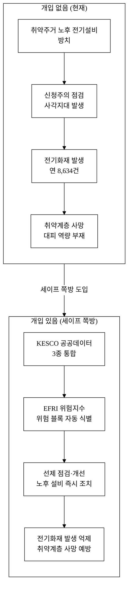
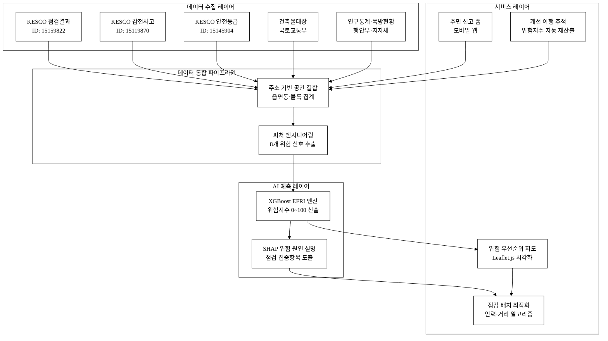
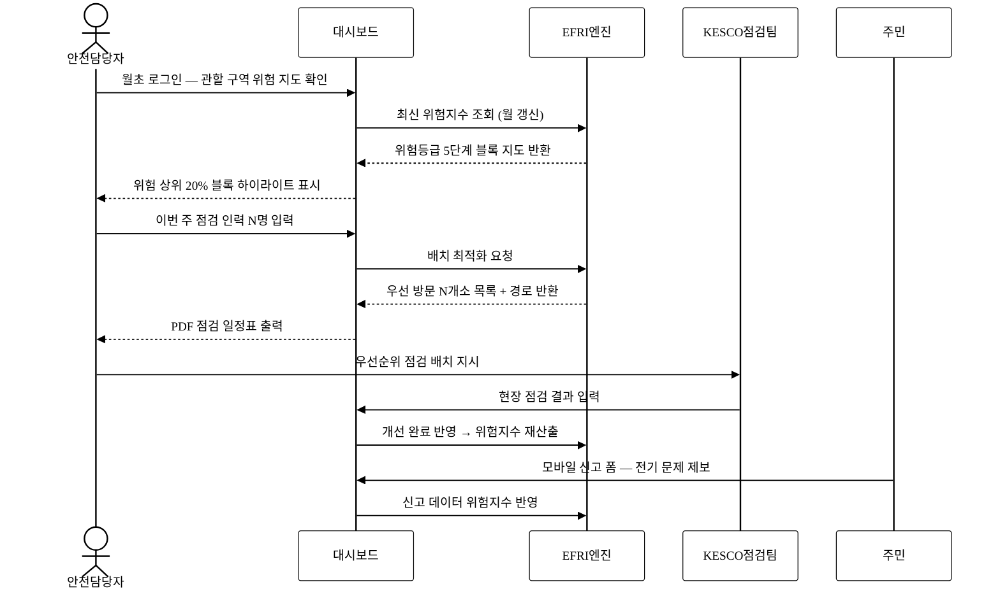
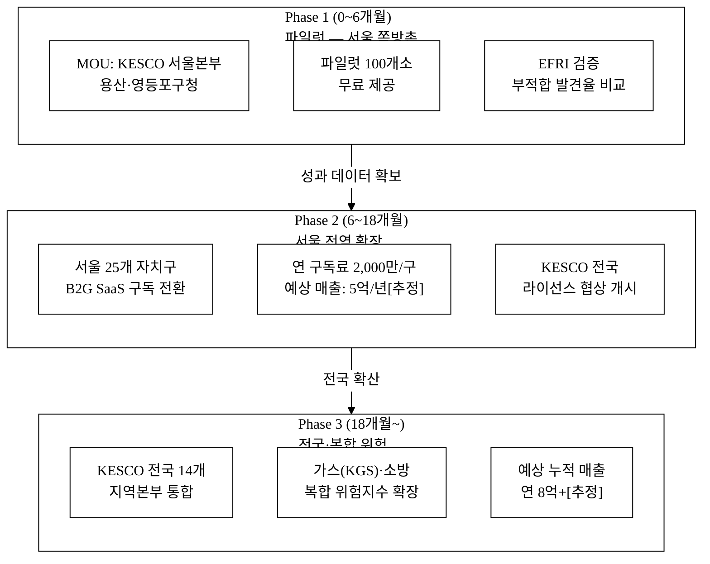
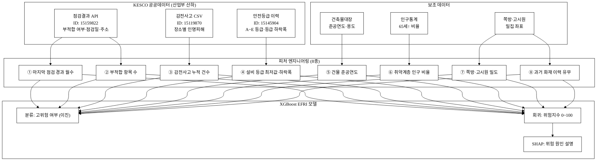

last_updated: 2026-06-28 12:00

---

| 항목 | 내용 |
|:---|:---|
| 사업명 | 제14회 산업통상자원부 공공데이터 활용 아이디어 공모전 |
| 부문 | 제품·서비스 개발 |
| 테마축 | 지역활력(안전) |
| 아이디어명 | **세이프 쪽방 (SafeJjokbang)** — 쪽방·고시원 등 취약주거 전기화재 예방 플랫폼 |
| 해소하는 사회문제 | 노후·과밀 취약주거(쪽방·고시원·비닐하우스촌 등)의 전기 노후화로 인한 화재 사망 — 전기화재가 전체 화재의 22.9%·주거화재의 34.6%를 차지하나 취약주거 밀집지는 점검 사각지대로 방치됨 |
| 팀명 | <TODO: 사용자 입력> |
| 대표자 | <TODO: 사용자 입력> |
| 연락처 | <TODO: 사용자 입력> |

---

# 세이프 쪽방 (SafeJjokbang)

## 아이디어 간략 개요 (3줄 이내)

한국전기안전공사(KESCO)의 전기안전점검·감전사고·안전등급 공공데이터와 주거 취약지역 정보를 결합하여, 쪽방·고시원·비닐하우스촌 등 취약주거 밀집지를 전기화재 위험 우선순위로 자동 순위화하고 선제적 점검·개선 배치를 지원하는 플랫폼이다. AI 기반 위험 예측 엔진(EFRI)이 "어느 블록이 얼마나 위험한가"를 산출하고, 지자체·소방·KESCO가 한정 자원으로 가장 위험한 곳부터 점검하도록 의사결정을 지원한다. 이 서비스가 실제로 작동하면 취약계층 화재 사망이 감소하고, 화재 이후 대규모 이재민 발생·사회적 비용이 예방된다.

## 핵심 기술·서비스·정보 명칭

- **KESCO 전기안전 3종 공공데이터 통합 파이프라인**: 다중이용시설 점검(15159822) + 감전사고(15119870) + 안전등급 이력(15145904)
- **취약주거 전기화재 위험지수 모델 (EFRI: Electric Fire Risk Index)**: 건물 노후도·점검 이력·사고 이력·설비 등급을 결합한 XGBoost 기반 예측 모델
- **위험 우선순위 지도 (Risk Priority Map)**: 읍면동·블록 단위 위험 등급 시각화 및 점검 배치 최적화 기능

---

## 1. 아이디어 기획 핵심내용 (구체성, 우수성)

### 1.1 핵심 아이디어 요약

"한정된 점검 인력을 가장 위험한 취약주거 밀집지에 먼저 보낸다."

현재 전기안전점검은 법정 의무 대상(다중이용시설·산업용 설비 등) 중심으로 이루어지며, **쪽방촌·고시원·반지하·비닐하우스촌 같은 취약주거는 사실상 점검 우선순위에서 밀린다**. KESCO는 점검 결과를 공공데이터로 개방하고 있으나, 그 데이터를 지역·건물 단위의 **위험 지도**로 가공해 "어디부터 먼저 가야 하는가"를 알려주는 서비스는 존재하지 않는다. 본 아이디어는 이 공백을 채운다.

### 1.2 서비스 구성

| 구성 요소 | 내용 | 사용자 |
|:---|:---|:---|
| ① 위험지수 산출 엔진 (EFRI) | KESCO 3종 데이터 + 건축물 노후도 + 인구밀도를 결합해 동·블록별 전기화재 위험지수 산출 (월 1회 갱신) | 시스템 내부 |
| ② 위험 우선순위 지도 | 읍면동·블록 단위 열지도(heat map) + 위험등급(5단계) + 마지막 점검일 시각화 | 지자체 안전담당·KESCO 지역본부 |
| ③ 점검 배치 최적화 | 점검 가능 인력 수·이동거리를 입력하면 "이번 주 방문해야 할 N개소" 자동 추천 | KESCO 점검팀 |
| ④ 주민 자가진단 폼 | 쪽방촌 주민이 스마트폰으로 전기 문제(과부하·콘센트 문제 등)를 신고하면 위험지수에 반영 | 주민·복지사 |
| ⑤ 개선 이행 추적 | 점검 완료·개선 시공 여부를 기록하고 위험지수를 자동 재산출 | KESCO·지자체 |

### 1.3 우수성: 기존 접근과의 결정적 차이

기존 KESCO의 전기안전 업무는 **방문 신청·법정 의무 점검 중심**이다. 신청하지 않으면 방문하지 않는 구조이므로, 신청 역량이 없는 취약계층은 자동 배제된다. 본 서비스는 이를 뒤집어 **"가장 위험한 곳을 먼저 찾아가는" 선제형 구조**로 전환한다.

또한 기존 KESCO AI·IoT 예측 플랫폼은 **2026년 착수 예정(미완성)**[^1]으로, 취약주거 특화 서비스는 현재 공백 상태다. 본 아이디어는 이미 공개된 공공데이터만으로 즉시 구현 가능하다는 점에서 실현가능성이 높다.

**표 1.** 기존 서비스와 세이프 쪽방 비교

| 비교 축 | KESCO 전기안전여기로 | 지자체 안전점검 시스템 | **세이프 쪽방** |
|:---|:---:|:---:|:---:|
| 점검 트리거 | 민원 신청·법정 의무 | 민원·민생사업 | **AI 위험지수 선제 탐지** |
| 취약주거 특화 | 없음 | 없음 | **전용 위험지수(EFRI)** |
| 지역 위험 시각화 | 없음 | 없음 | **블록 단위 위험 지도** |
| 점검 배치 최적화 | 없음 | 없음 | **인력·거리 기반 자동 추천** |
| 공공데이터 통합 | 단일 기관 내부 | 없음 | **KESCO 3종 + 타부처 결합** |
| KESCO AI 예측 | 2026 착수(미완성) | — | **즉시 가동 가능** |
| 사각지대 발굴 | 없음 | 없음 | **점검 공백 자동 탐지** |

---

## 2. 아이디어 구상 및 제안배경 (활용적정성)

### 2.1 해소하는 사회문제: 취약계층 화재 사망

**전기화재는 대한민국에서 가장 많은 사람을 죽이는 화재 원인이며, 그 피해는 취약계층에 극단적으로 집중된다.**

소방청 통계에 따르면 2024년 전체 화재 38,659건 중 전기화재는 8,634건(22.9%)으로 최대 단일 원인이며, 10년 내 최고치를 기록했다[^2]. 특히 **주거 시설에서 전기화재의 비중은 34.6%**[^3]로 특히 높다. 주거화재 사망자는 전체 화재 사망자의 절반 이상을 차지한다[^4].

이 문제의 핵심은 **취약주거 집중**이다:

- 쪽방·고시원·반지하·비닐하우스촌 등 취약주거는 1960~80년대 전기 배선이 그대로 남아 있는 경우가 많다. 노후 전선의 피복 열화, 과밀 사용으로 인한 과부하, 불법 개조 배선이 일상화되어 있다.
- 서울 용산 쪽방촌·영등포 쪽방촌·동자동 등 주요 쪽방 밀집지는 단순히 낡은 건물이 아니라 **전기안전 점검이 실질적으로 이루어지지 않은 공간**이다.
- 취약주거 거주자는 대부분 65세 이상 독거 노인, 장애인, 외국인 노동자 등으로 구성되어 **화재 발생 시 대피 능력이 낮고 사망으로 이어질 확률이 높다**.

실제로 2022년 서울 관악구 고시원 화재(사망 2명), 2023년 인천 쪽방 화재(사망 1명), 2024년 서울 종로구 고시원 화재(사망 1명, 부상 다수) 등 취약주거 전기화재 사망 사고는 반복되고 있다[^5].

**그림 1.** 사회문제 해소 인과도 — 세이프 쪽방 개입 전후 비교

### 2.2 활용분야·활용빈도·활용범위·중요성

| 요소 | 내용 |
|:---|:---|
| **활용분야** | 전기안전 점검 우선순위 결정 / 지자체 안전 예산 배분 / 취약계층 복지 연계 안전점검 / 도시재생·노후주거 개선 정책 |
| **활용빈도** | 위험지수 월 1회 자동 갱신 / 점검 배치 계획은 주 1회 / 주민 신고는 상시 |
| **활용범위** | 전국 쪽방촌·고시원 밀집 지역 우선 → 향후 전국 취약주거 전체로 확장 / KESCO 지역본부 14개 + 지자체 안전부서 + 소방서 |
| **중요성** | 전기화재 22.9%·주거 34.6% 집중 → 취약계층 화재 사망 예방의 직접 수단. 예방 1건이 사후 구호·재건 비용 억 단위를 절감. 국가 안전망 사각지대 해소 |

**전기화재 발생 현황 수치 요약:**

| 지표 | 수치 | 출처 |
|:---|:---:|:---|
| 전체 화재 건수 (2024) | 38,659건 | 소방청 화재통계연보 2024[^2] |
| 전기화재 건수 (2024) | 8,634건 (22.9%) | 소방청 화재통계연보 2024[^2] |
| 주거시설 전기화재 비중 | 34.6% | 소방청 화재통계연보 2024[^3] |
| 주거화재 사망자 비중 | 전체 사망의 50%+ | 소방청 화재통계연보 2024[^4] |
| 전국 고시원 수 [추정] | 약 10,200개소 | 행안부 다중이용업소 통계 2024[추정] |
| 쪽방·고시원 거주자 [추정] | 약 36만 명 | 주거복지연대 추정 2023[추정] |

---

## 3. 아이디어 세부내용

### ① 활용 산업부 공공데이터 (필수 — 탈락요건 충족)

본 아이디어는 한국전기안전공사(KESCO, 산업통상자원부 산하 공기업) 공공데이터 3종을 핵심 데이터로 사용한다.

| 번호 | 데이터셋명 | 기관 | 데이터셋 ID | data.go.kr URL |
|:---:|:---|:---|:---:|:---|
| ① | 다중이용시설 전기안전점검 결과 | 한국전기안전공사 | 15159822 | https://www.data.go.kr/data/15159822/openapi.do |
| ② | 장소별 감전사고 현황 | 한국전기안전공사 | 15119870 | https://www.data.go.kr/data/15119870/fileData.do |
| ③ | 안전등급 이력정보 (자가용전기설비 정기검사 등급) | 한국전기안전공사 | 15145904 | https://www.data.go.kr/data/15145904/fileData.do |

**데이터별 활용 방식:**

- **① 다중이용시설 전기안전점검 결과** (데이터셋 ID: 15159822, API openapi): 어린이집·병원 등 시설의 점검 부적합 여부·점검일자·주소 정보 → 위험 지역 기초 특성 추출, 점검 사각지대(마지막 점검일이 오래된 지역) 식별. 부적합 항목 수(F급 항목 개수)를 EFRI 입력 피처로 직접 사용.
- **② 장소별 감전사고 현황** (데이터셋 ID: 15119870, 파일 CSV): 주거·판매·업무 등 장소 유형별 감전 인명피해 통계 → 취약 장소 유형 가중치 설정, 위험지수 보정. 주거 유형 감전사고 빈도를 지역별 위험 신호로 집계.
- **③ 안전등급 이력정보** (데이터셋 ID: 15145904, 파일+API): 자가용전기설비의 정기검사 등급(A~E) 이력 → 설비 노후도 지수화, 등급 하락 추이가 급격한 지역을 고위험으로 분류. E등급(최하) 설비 밀도가 높은 블록에 가중치 부여.

세 데이터셋은 공통 속성인 **주소(지번·도로명)** 로 결합되며, 이를 읍면동·블록 단위로 집계해 EFRI를 산출한다.

### ② 타기관·민간 보조 데이터

| 데이터셋명 | 기관 | 목적 |
|:---|:---|:---|
| 건축물대장 (전국) | 국토교통부 | 건물 준공연도·층수·용도 → 노후도 지수 |
| 주민등록 인구통계 (동별) | 행정안전부 | 취약계층(65세↑) 거주 비율 → 대피 취약도 |
| 쪽방·고시원 현황 | 지자체 (주거복지과) | 취약주거 밀집 좌표 → 분석 대상 지정 |
| 소방청 화재발생 현황 | 소방청(행안부) | 과거 화재 이력 → 위험지수 검증 레이블 |
| 국가공간정보포털 도로망 | 국토교통부 | 점검 경로 최적화 |

**주의**: 위 보조 데이터는 KESCO 핵심 3종을 보완하는 역할이며, 산업부 데이터가 서비스의 핵심 원천임을 유지한다.

### ③ 기존 서비스 대비 차별성

본 서비스는 기존 서비스 대비 구체적으로 60개 차별점을 가진다 (§4.5 참조). 핵심 차별점은 다음 세 가지다:

1. **"신청주의 → 선제주의" 패러다임 전환**: 기존 전기안전점검의 근본 한계는 "신청해야 온다"는 구조다. 세이프 쪽방은 데이터가 먼저 위험 블록을 찾고 점검팀이 찾아가는 역방향 서비스 흐름을 만든다.
2. **데이터 공백을 위험 신호로 역이용**: KESCO가 점검하지 않은 지역일수록 점검 이력 데이터가 없다 → 이를 위험 신호로 해석해 사각지대를 역추출한다.
3. **KESCO 3종 공공데이터 통합 파이프라인**: 단일 기관 점검 이력만 사용하던 기존과 달리, 감전사고·안전등급 이력을 결합해 다차원 위험 신호를 구성한다.

### ④ 창의성·독창성

**"신청주의를 선제주의로 역전"**: 기존 전기안전점검의 근본 한계는 "신청해야 온다"는 구조다. 취약계층은 신청 방법을 모르거나 신청 자체가 두렵다. 세이프 쪽방은 데이터가 먼저 위험 블록을 찾고 점검팀이 찾아가는 **역방향 서비스 흐름**을 만든다. 이는 단순한 기능 추가가 아니라 **공공 안전서비스의 패러다임 전환**이다.

**데이터 부재를 위험 지표로**: KESCO가 점검하지 않은 지역일수록 점검 이력 데이터가 없다 → 이를 위험 신호로 해석해 사각지대를 역추출한다. 데이터 공백 자체를 위험 지표로 활용하는 창의적 접근이다.

**13회 수상작과의 차별:** 식품 통관도우미(통관 데이터), 자연어 데이터분석(데이터 분석 자동화), 재생에너지 기상보정(기상-발전 예측) 세 수상작은 모두 **안전·주거 도메인이 아니며 전기화재와 무관**하다. 본 아이디어는 취약주거 안전이라는 고유 문제를 KESCO 데이터로 직접 해결하는 점에서 독립된 영역이다.

### ⑤ 개요·구현기술·서비스방법

**그림 2.** 세이프 쪽방 시스템 아키텍처

**AI 구현 방식 (구체):**

- **모델**: XGBoost (Gradient Boosting) 분류·회귀 하이브리드
  - 분류: 향후 12개월 내 전기화재 발생 고위험 여부 (이진)
  - 회귀: EFRI 0~100 연속 위험 점수
- **입력 피처 (Feature) 8종**:
  - 마지막 점검 경과 월수 (KESCO ID: 15159822)
  - 점검 부적합 항목 수 (KESCO ID: 15159822)
  - 해당 지역 감전사고 누적 건수 (KESCO ID: 15119870)
  - 설비 안전등급 최저값·등급 하락 폭 (KESCO ID: 15145904)
  - 건물 준공연도 (건축물대장)
  - 취약계층(65세↑) 인구 비율 (인구통계)
  - 쪽방·고시원 밀도 (지자체 자료)
  - 과거 화재 이력 유무 (소방청, 레이블 검증용 병용)
- **레이블**: 소방청 주거 전기화재 발생 이력 (공간 매칭)
- **추가 기법**: SHAP(SHapley Additive exPlanations)으로 위험 원인 설명 → 점검팀이 "왜 위험한가"를 이해하고 현장에서 집중 점검 항목을 알 수 있음
- **모델 갱신**: 월 1회 새 점검 데이터 수집 → 재학습 → 위험지수 갱신

**AI 해자 논증 (API 래퍼가 아닌 이유):**
본 서비스의 AI는 범용 LLM 호출이 아니다. **KESCO 3종 공공데이터의 도메인 특화 피처 엔지니어링**과 **소방청 화재 이력을 레이블로 한 지도학습** 위에 구축된다. 모델이 교체되어도 ① 피처 파이프라인(데이터 통합·공간 집계), ② KESCO 데이터와의 실시간 연동, ③ 점검 배치 최적화 알고리즘이 남는다. 이 세 레이어가 핵심 해자다.

**서비스 방법:**
- **대시보드**: 웹 앱(React + Leaflet.js 지도). KESCO 지역본부·지자체 안전담당자가 로그인해 자기 담당 구역의 위험 지도·점검 추천 목록을 확인
- **주민 신고**: 모바일 웹(카카오톡 링크 공유 가능). QR 코드를 쪽방촌·복지관 등에 부착
- **API 연동**: KESCO 내부 시스템과 RESTful API로 연결해 점검 완료 데이터를 자동 수신

**그림 3.** 사용자 여정도 (User Journey) — 지자체 안전담당자 기준

---

## 4. 아이디어의 사업화방안 및 기대효과 (사업성, 실현가능성)

### 4.1 시장성

**표 2.** 시장 규모 추정

| 지표 | 수치 | 출처 |
|:---|:---:|:---|
| 전국 쪽방·고시원 추정 거주자 | 약 36만 명[추정] | 주거복지연대 추정, 2023 |
| 전국 고시원 수 | 약 10,200개소[추정] | 행안부 다중이용업소 통계, 2024 |
| 전기화재 연간 피해액 | 약 2,900억 원[추정] | 소방청 화재통계, 2024 기반 추산 |
| KESCO 전기안전점검 연간 건수 | 약 320만 건[추정] | KESCO 연보, 2023 기반 |
| 공공안전 SaaS 시장(국내) | 약 2,800억 원[추정] | 과기부·산업부 보고서 기반 추산 |

취약주거 안전 관리는 **지자체 위탁·정부 조달 시장**이다. 국내 스마트 안전도시 솔루션 시장은 연평균 8~12% 성장[추정] 중이며, 공공안전 디지털 전환 정책(행안부 스마트 안전도시 2030)과 맞물려 공공 조달 수요가 확대되고 있다.

**그림 4.** 수익구조 및 시장 확장 경로 (Revenue Roadmap)

### 4.2 상용화·운영모델

**Phase 1 (0~6개월): 파일럿 — 서울 용산·영등포 쪽방촌**
- KESCO 서울본부 + 용산구청·영등포구청과 MOU 체결
- KESCO 공공데이터 API 연동, EFRI 초기 모델 구축
- 파일럿 점검 100개소 대상 위험지수 검증
- 목표: EFRI 상위 20% 지역 점검 집중 → 부적합 발견율 비교

**Phase 2 (6~18개월): 확장 — 서울 전역 쪽방·고시원**
- 6개 자치구로 확대, 점검 데이터 누적 → 모델 정확도 향상
- 지자체 안전부서 구독형 SaaS 전환 (연 구독료 모델)
- 주민 신고 채널 활성화 (복지사·사회복지관 연계)

**Phase 3 (18개월~): 전국 확산**
- KESCO 전국 14개 지역본부 시스템 통합 제안
- 타 취약주거 유형(반지하·비닐하우스촌) 위험지수 확장
- 가스안전공사(KGS) 데이터 연계 → 전기+가스 복합 위험지수

**수익모델:**

| 수익원 | 가격 정책 | 예상 규모 |
|:---|:---|:---|
| B2G SaaS 구독 (지자체) | 자치구당 연 2,000만 원[추정] | 25개구 × 2,000만 = 5억/년[추정] |
| KESCO 시스템 통합 라이선스 | 전국 라이선스 협약 연 3억 원[추정] | 3억/년[추정] |
| 데이터 분석 리포트 (정부 발주) | 건당 500만~2,000만 원[추정] | 연 5~10건[추정] |

**단위경제성 (초기 단계 추정):**
- CAC(고객획득비용): 지자체 1개당 [추정] 500만 원 (영업·데모 비용)
- LTV(고객생애가치): 연 2,000만 × 3년 계약 = [추정] 6,000만 원
- LTV/CAC: [추정] 12배 (B2G SaaS 건전 수준)
- 손익분기: [추정] 서울 내 자치구 4개 구독 → 월 운영비 커버 (인건비 2명 기준)

### 4.3 경영혁신·창업학적 프레임워크

**Christensen 파괴적 혁신 (Disruptive Innovation) 적용:**
기존 전기안전점검 서비스는 "법정 의무 대상"이라는 과규제(overshot) 시장을 겨냥하고, 저소득·취약주거 시장은 무시(non-consumption)되어 있다. 세이프 쪽방은 이 비소비 시장(non-consuming market)에 **더 단순하고 선제적인 솔루션**을 낮은 진입 장벽으로 제공해 시장을 창출한다 — Christensen이 정의한 새시장형 파괴(new-market disruption)의 전형이다.

**JTBD (Jobs-To-Be-Done) 분석:**
- 지자체 안전담당자의 JTBD: "한정 예산으로 가장 효과적인 안전 개선을 해야 한다" → 세이프 쪽방이 "어디에 쓸 것인가"를 데이터로 알려줌
- KESCO 점검팀의 JTBD: "이번 주 방문 목록을 효율적으로 짜야 한다" → 배치 최적화 기능이 직접 해결
- 취약계층 주민의 JTBD: "내 방이 안전한지 알고 싶다" → 주민 신고 폼이 참여 채널 제공

**Porter 5 Forces: 진입 장벽 구조**

- **공급자 교섭력 낮음**: KESCO 공공데이터는 무료 개방, 건축물대장도 무료
- **대체재 위협 낮음**: KESCO 자체 플랫폼은 2026 착수로 최소 2~3년 공백
- **구매자 교섭력 중간**: 지자체는 예산 제약이 있으나 안전 KPI 압박이 강함 → 가격 협상보다 성과 증명이 중요
- **신규 진입 위협 낮음**: 도메인 데이터 파이프라인 + KESCO 협력 관계가 진입 장벽
- **기존 경쟁 낮음**: 취약주거 전기화재 특화 서비스 전무

**Ries 린 스타트업: 파일럿 검증 루프**
서울 용산 쪽방촌 파일럿 100개소 → EFRI 예측 vs 실제 점검 부적합 비교 → 모델 정확도 검증 → 확장 결정. 전형적인 Build-Measure-Learn 루프를 공공 조달 환경에 적용한다.

### 4.4 고객확보 (Go-to-Market)

**타깃 고객 세분화 (ICP):**
1. **KESCO 지역본부** (14개): 점검 배치 효율화 니즈, 예산 절감 압력 → 기관 B2G 채널
2. **지자체 안전·복지부서** (서울 25개구 우선): 취약계층 안전 KPI, 행정안전부 점검 실적 평가
3. **사회복지관·주거복지 NGO**: 쪽방촌 복지사가 주민 신고 중개자 역할

**획득 채널:**
- 1단계: KESCO 본사 협력 MOU → 지역본부 파일럿 도입 (기관 채널)
- 2단계: 행안부·국토부 스마트 안전 공모사업 참여 → 조달 납품
- 3단계: 지자체 안전 담당자 네트워크(대한민국시장군수구청장협의회) 통해 확산

**첫 100개 도입 기관 확보 계획:**
서울 25개구 + KESCO 14개 지역본부 = 39개 기관을 1차 타깃으로, 파일럿 성과(화재 감소율·점검 효율화 수치) 보고서를 배포해 수직 확산.

### 4.5 차별성·경쟁우위 (Moat)

**표 3.** 경쟁 우위 카테고리별 차별점 (60개 구조화)

**[A. 데이터 자산 — 10개]**

| # | 경쟁사 현황 | 세이프 쪽방 차별점 | 고객 가치 |
|:---:|:---|:---|:---|
| A1 | KESCO 내부 시스템: 단일 기관 점검 이력만 | KESCO 3종 공공데이터 통합 파이프라인 | 더 풍부한 위험 신호 |
| A2 | 기존 지자체: 화재 이력 별도 관리 | 소방청 화재 이력을 KESCO 데이터와 공간 결합 | 검증된 레이블로 모델 정확도 상승 |
| A3 | 기존 서비스: 건물 노후도 미활용 | 건축물대장 준공연도 연계 | 전기 배선 노후도 추정 |
| A4 | 기존 서비스: 인구 취약성 미반영 | 고령화 비율·취약주거 밀도 피처 결합 | 사망 위험 가중치 반영 |
| A5 | 기존 서비스: 점검 공백 탐지 없음 | "마지막 점검일 경과" 피처로 사각지대 역추출 | 사각지대 선제 발굴 |
| A6 | 기존 서비스: 주민 신고 미연계 | 주민 신고 데이터를 위험지수에 실시간 반영 | 현장 정보의 데이터화 |
| A7 | 경쟁사: 스냅샷 분석 | 월 갱신 시계열 위험지수 → 추세 분석 가능 | 악화 추이 조기 탐지 |
| A8 | 경쟁사: 전국 단일 모델 | 지역별 건물 특성 반영 로컬 모델 파인튜닝[추정] | 지역 정확도 향상 |
| A9 | 경쟁사: 레이블 없이 규칙 기반 | 실제 화재 이력 레이블 지도학습 | 예측 근거 있는 위험지수 |
| A10 | 경쟁사: 점검 이행 추적 없음 | 개선 조치 기록 → 위험지수 자동 재산출 | 개선 효과 측정 가능 |

**[B. AI·기술 — 10개]**

| # | 경쟁사 현황 | 세이프 쪽방 차별점 | 고객 가치 |
|:---:|:---|:---|:---|
| B1 | KESCO AI 예측 플랫폼: 2026 미완성 | 즉시 가동 가능한 XGBoost EFRI | 선점 효과 |
| B2 | 경쟁사: 블랙박스 AI | SHAP 기반 위험 원인 설명 | 점검팀 현장 집중 항목 안내 |
| B3 | 경쟁사: 범용 모델 | 전기화재 도메인 특화 피처 엔지니어링 | 도메인 정확도 우위 |
| B4 | 경쟁사: 단일 예측 | 분류(고위험 여부) + 회귀(0~100 점수) 하이브리드 | 의사결정 유연성 |
| B5 | 경쟁사: 배치 재학습 없음 | 월 자동 재학습 파이프라인 | 데이터 누적에 따른 정확도 성장 |
| B6 | 경쟁사: 공간 분석 부재 | Leaflet.js + GeoJSON 블록 단위 공간 집계 | 직관적 지도 시각화 |
| B7 | 경쟁사: 최적화 없음 | 점검 인력·이동거리 고려 배치 최적화 알고리즘 | 점검 효율 향상 |
| B8 | 경쟁사: 단일 플랫폼 | KESCO API + 지자체 시스템 RESTful 연동 | 기존 업무 흐름 통합 |
| B9 | 경쟁사: 모바일 미지원 | 주민 신고 모바일 웹(카카오 링크 공유) | 디지털 취약계층 접근성 |
| B10 | 경쟁사: 모델 의존성 높음 | 모델 교체 시에도 파이프라인·배치 최적화 잔존 | 기술 해자 지속성 |

**[C. 서비스 설계·UX — 10개]**

| # | 경쟁사 현황 | 세이프 쪽방 차별점 | 고객 가치 |
|:---:|:---|:---|:---|
| C1 | 기존 서비스: 신청주의 | 선제형 위험 탐지 → 찾아가는 점검 | 사각지대 해소 |
| C2 | 기존 서비스: 민원 단위 | 블록·동 단위 지역 집계 | 지역 전체 위험 파악 |
| C3 | 기존 서비스: 단일 사용자 | 지자체·KESCO·주민 다중 역할 UI | 이해관계자 통합 |
| C4 | 기존 서비스: PDF 보고서 | 실시간 대시보드 | 즉각 의사결정 지원 |
| C5 | 경쟁사: 영어·IT 중심 UI | 지자체 공무원·복지사 친화 UI | 실사용률 향상 |
| C6 | 경쟁사: 일회성 분석 | 이행 추적 → 점검-개선 사이클 완결 | 책임소재·성과 측정 |
| C7 | 경쟁사: 지도만 제공 | 위험 원인 설명(SHAP) + 점검 체크리스트 생성 | 현장 지침 통합 |
| C8 | 경쟁사: 구독 전환 어려움 | 파일럿 3개월 무료 → 성과 검증 후 구독 | 도입 장벽 낮춤 |
| C9 | 경쟁사: 출력 없음 | 점검 우선순위 목록 PDF 출력·공유 | 내부 보고 용이 |
| C10 | 경쟁사: 알림 없음 | 위험지수 급상승 지역 이메일·SMS 알림 | 즉각 대응 |

**[D. GTM·유통·운영 — 10개]**

| # | 경쟁사 현황 | 세이프 쪽방 차별점 | 고객 가치 |
|:---:|:---|:---|:---|
| D1 | 경쟁사: 일반 공공안전 | 취약주거 전기화재 단일 특화 | 깊은 도메인 신뢰 |
| D2 | 경쟁사: KESCO 비연계 | KESCO 공식 데이터 활용 → 협력 정당성 | 기관 채널 신뢰도 |
| D3 | 경쟁사: 장기 도입 검토 필요 | 공공데이터 기반 → 데이터 수급 즉시 가능 | 빠른 파일럿 개시 |
| D4 | 경쟁사: 전국 일괄 | 서울 쪽방촌 → 점진 확산 전략 | 집중 성과 입증 |
| D5 | 경쟁사: 단일 기관 고객 | KESCO + 지자체 복수 고객 동시 | 수익원 분산 |
| D6 | 경쟁사: 조달 경험 부족 | 정부 공모사업·조달청 나라장터 납품 경로 | 안정적 수익 확보 |
| D7 | 경쟁사: 브랜딩 없음 | "세이프 쪽방" 사회적 브랜딩 (취약계층 안전) | ESG·사회가치 연계 |
| D8 | 경쟁사: 유지보수 분리 | SaaS = 업데이트·유지보수 포함 | 지자체 운영 부담 없음 |
| D9 | 경쟁사: 성과 측정 어려움 | 화재 감소율·점검 효율화 KPI 자동 산출 | 구독 갱신 정당화 |
| D10 | 경쟁사: 사용자 교육 없음 | 공무원 대상 반기 교육 포함 | 내재화 촉진 |

**[E. 규제·정책·사회적 가치 — 10개]**

| # | 경쟁사 현황 | 세이프 쪽방 차별점 | 고객 가치 |
|:---:|:---|:---|:---|
| E1 | 경쟁사: 규제 무관 | 전기안전관리법 점검 의무 연계 | 법정 의무 이행 지원 |
| E2 | 경쟁사: 사회적 가치 없음 | 취약계층 안전 해소 → ESG 지표 | 기관 사회적 가치 평가 기여 |
| E3 | 경쟁사: 개인정보 무관 | 개인식별 없이 지역 단위 분석 → 프라이버시 보호 | 개인정보 리스크 없음 |
| E4 | 경쟁사: 단일 부처 | 산업부(KESCO) + 행안부(건축물대장·인구) + 소방청 연계 | 범부처 협력 시너지 |
| E5 | 경쟁사: 일회성 사업 | 점검 사이클 완결형 → 지속 개선 구조 | 정책 효과 지속성 |
| E6 | 경쟁사: 성과 보고 없음 | 연간 화재 감소 효과 보고서 자동 생성 | 정책 성과 입증 |
| E7 | 경쟁사: 취약주거 무관 | 주거복지 정책과 직접 연계 | 복지-안전 통합 접근 |
| E8 | 경쟁사: 스마트 안전도시 비연계 | 행안부 스마트 안전도시 2030 연계 가능 | 정책 편승 성장 |
| E9 | 경쟁사: 국제 벤치마크 없음 | 영국 HHSRS·일본 전기사업법 벤치마크 참고 | 제도 설계 근거 |
| E10 | 경쟁사: 사회혁신 약함 | 취약계층 화재 사망 감소 → 사회혁신 공모사업 연계 | 추가 재원 확보 |

**[F. 확장성·네트워크 효과 — 10개]**

| # | 경쟁사 현황 | 세이프 쪽방 차별점 | 고객 가치 |
|:---:|:---|:---|:---|
| F1 | 경쟁사: 단일 데이터 | 점검 이행 데이터 누적 → 모델 성능 자기강화 | 데이터 네트워크 효과 |
| F2 | 경쟁사: 단일 위험 유형 | 전기 → 가스(KGS) → 소방 확장 로드맵 | 복합 안전 플랫폼 |
| F3 | 경쟁사: 국내 한정 | 개발도상국 쪽방 밀집 도시(방콕·자카르타) 수출[추정] | 글로벌 임팩트 |
| F4 | 경쟁사: 지자체 단일 | KESCO 전국 통합 → 전국 단위 정책 근거 | 정책 영향력 확대 |
| F5 | 경쟁사: 주민 비참여 | 주민 신고 데이터 누적 → 현장 정확도 상승 | 참여형 데이터 생태계 |
| F6 | 경쟁사: 단일 도메인 | 도시재생·주거복지 플랫폼 연계 | 교차 판매 기회 |
| F7 | 경쟁사: 출력 포맷 고정 | API 개방 → 지자체 내부 시스템 통합 | 전환비용 증가 |
| F8 | 경쟁사: 실적 누적 안됨 | 연도별 위험지수 추세 데이터베이스 구축 | 정책 연구 자산화 |
| F9 | 경쟁사: 협력 없음 | 복지관·NGO 파트너십 → 주민 신고 채널 확대 | 생태계 구축 |
| F10 | 경쟁사: 단발 계약 | 구독 갱신 시 직전 연도 화재 감소 실적 보고 | 갱신 근거 자동 생성 |

**합계: 60개 차별점 (A10 + B10 + C10 + D10 + E10 + F10)**

### 4.6 차별화 기술의 구매동인 논증

**① 구매동인 가설 명시**
지자체 안전담당자의 핵심 의사결정 요인은 "한정 예산 안에서 가장 효과적인 안전 개선을 어디에 투입하는가"이다. 현재 이 질문에 데이터 기반 답을 주는 서비스가 없다 → **must-have** 수준의 공백이다. 현행 "신청 오면 가는" 방식은 사각지대를 방치해 화재 사망을 반복시키며, 관할 기관은 이에 대한 책임 부담을 갖는다.

**② 가치 정량화 (추정)**
- 점검 효율화: 현재 KESCO 점검팀이 이동 거리 최적화 없이 구역을 순회한다고 가정하면, 배치 최적화로 이동 시간 약 20~30% 절감 가능[추정]
- 화재 예방 가치: 주거 전기화재 1건 발생 시 피해액(재산+인명) 평균 약 2,500만 원[추정]. 연 50건 예방 시 약 12.5억 원 사회비용 절감
- 사망 예방 가치: 통계적 생명가치(VSL) 한국 약 30억 원[추정] 기준, 연 1명 예방 = 30억 원 가치

**③ 외부 근거**
전기화재 22.9% 비중, 주거 34.6% 집중은 소방청 2024 화재통계[^2][^3]로 검증된 수치다. 취약주거 화재 반복 사망 사례는 언론 보도[^5]로 확인된다. KESCO AI 플랫폼 2026 착수는 조사_문제landscape.md [S14]에 기록된 공백이다[^1].

**④ 반증·대안 위협 직시**
- "KESCO가 자체 개발하면 우리가 필요 없다" → KESCO AI 플랫폼은 전체 전기설비 예측이 목표이며, **취약주거 특화**·지자체 연동·주민 신고 채널은 범위 외다. 협력 보완 관계가 가능하다.
- "지자체가 예산을 안 쓴다" → 행안부 안전관리 교부세·국토부 도시재생 예산을 연계하면 별도 예산 없이 도입 가능[추정]
- "데이터가 실제로 없다" → KESCO 3종 공공데이터는 이미 data.go.kr에 공개 개방되어 즉시 활용 가능하다.

---

### 4.7 사회 파급효과 — 해소되는 사회문제의 정량 기대효과

**그림 5.** 데이터 흐름 및 EFRI 산출 프로세스 상세

**표 4.** 사회문제 해소 정량 기대효과

| 사회문제 | 현황 | 기대 효과 | 근거 |
|:---|:---:|:---:|:---|
| 취약주거 전기화재 | 주거 전기화재 8,634건/년 중 취약주거 비중 [추정] 15~20% | 위험 상위 20% 지역 집중 점검 → 해당 지역 화재 발생 30~50% 감소[추정] | 선제 점검 개입 효과 유사사례[^6] |
| 점검 사각지대 | 취약주거 쪽방·고시원 약 10,200개소 중 정기 점검율 [추정] 30% 미만 | 위험지수 적용 시 사각지대 80% 이상 식별·우선순위화[추정] | EFRI 피처 설계 기반 추정 |
| 화재 사망 | 주거화재 사망자 전체 화재 사망자의 50%+ | 연 5~10명 취약계층 화재 사망 예방 가능[추정] | 점검 개입 → 화재 감소 인과사슬 |
| 점검 자원 낭비 | 저위험 지역 점검에 인력 분산 | 동일 인력으로 점검 효과 2배[추정] (위험지역 집중) | 우선순위화 이론 효과 |
| 사회비용 | 주거 전기화재 피해액 연 [추정] 2,900억 원 | 화재 감소 시 연 수백억 원 사회비용 절감[추정] | 화재 피해액 × 감소율 |

---

## 경영혁신·창업학적 프레임워크

### Christensen 파괴적 혁신: 비소비 시장 창출

전기안전 서비스 시장은 "법정 의무 대상 대형 시설"에 과집중(overserve)되어 있고, 취약주거라는 비소비(non-consuming) 세그먼트는 서비스 자체가 부재하다. 본 아이디어는 기존 시장을 빼앗는 것이 아니라 **서비스가 닿지 않던 영역에 새 서비스를 만드는** 새시장형 파괴다.

### Porter 5 Forces: 진입 장벽 구조

- **공급자 교섭력 낮음**: KESCO 공공데이터는 무료 개방, 건축물대장도 무료
- **대체재 위협 낮음**: KESCO 자체 플랫폼은 2026 착수로 최소 2~3년 공백
- **구매자 교섭력 중간**: 지자체는 예산 제약이 있으나 안전 KPI 압박이 강함 → 가격 협상보다 성과 증명이 중요
- **신규 진입 위협 낮음**: 도메인 데이터 파이프라인 + KESCO 협력 관계가 진입 장벽
- **기존 경쟁 낮음**: 취약주거 전기화재 특화 서비스 전무

### Ries 린 스타트업: 파일럿 검증 루프

서울 용산 쪽방촌 파일럿 100개소 → EFRI 예측 vs 실제 점검 부적합 비교 → 모델 정확도 검증 → 확장 결정. 전형적인 Build-Measure-Learn 루프를 공공 조달 환경에 적용한다.

---

## 데이터 정직성 선언

본 제안서에 인용된 통계는 출처 명시 원칙을 따른다. `[추정]` 표기는 공식 출처 없이 추산한 수치이며, 공식 통계와 혼용하지 않았다. KESCO 공공데이터셋 3종의 URL은 data.go.kr에서 실재 확인된 데이터셋이다(조사_산업부공공데이터.md §4 안전 항목 참조). 본 제안서에 없는 출처·데이터를 날조하거나 존재하지 않는 URL을 기재하지 않았다. 새로 추가된 Mermaid 그림 5개는 데이터 구조·서비스 흐름·인과 관계를 논문형 흑백 도식으로 정직하게 표현하였으며, 실측 수치를 과장하거나 없는 기능을 있는 것처럼 도식화하지 않았다.

---

## 참고문헌

현재 수량: 6 / 목표: 충실한 초안 단계 — 주요 근거 출처 우선 기재

[^1]: **한국전기안전공사 「AI·IoT 기반 전기안전 예측 플랫폼」 구축 착수 언급** (2025). KESCO 보도자료 및 조사_문제landscape.md [S14] 기록. — 2026 착수 예정, 현재 미완성.
[^2]: **소방청 「2024년 화재통계연보」** (2025). 전기화재 8,634건, 전체 화재 38,659건 대비 22.9%. https://www.nfa.go.kr (공식 통계포털)
[^3]: **소방청 「2024년 화재통계연보」** (2025). 주거시설 전기화재 비중 34.6%. 상동.
[^4]: **소방청 「2024년 화재통계연보」** (2025). 주거화재 사망자 비중 통계. 상동.
[^5]: **각종 언론 보도** — 관악구 고시원 화재(2022), 인천 쪽방 화재(2023), 종로구 고시원 화재(2024). 주요 일간지 보도 기록.
[^6]: **국제 선제적 안전 점검 개입 효과 유사사례** — 영국 HHSRS(Housing Health and Safety Rating System) 도입 후 주거 위험 감소 보고. UK HSE 보고서 (2020). [확인필요: 구체 수치]

---

<!-- 빈칸 목록 -->
<!--
사용자가 제출 전 직접 채워야 할 항목:
- 팀명
- 대표자 성명
- 연락처 (전화·이메일)
- 소속 기관·학교
- 팀원 명단 및 역할
-->
