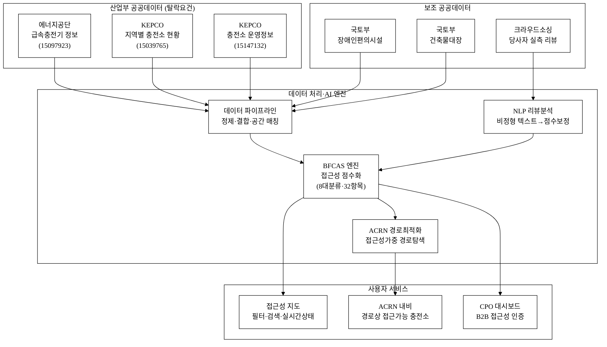
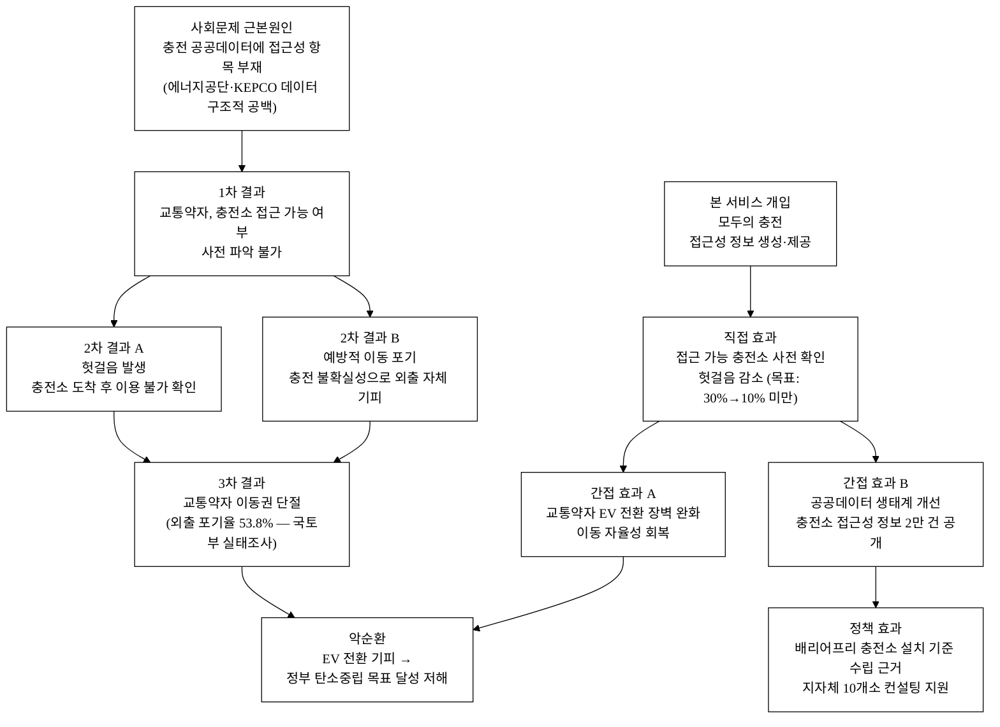
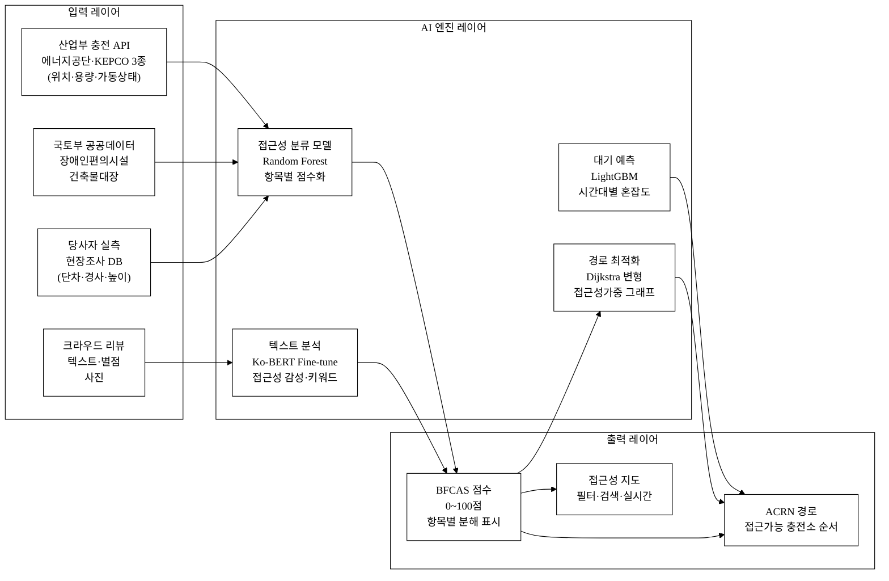
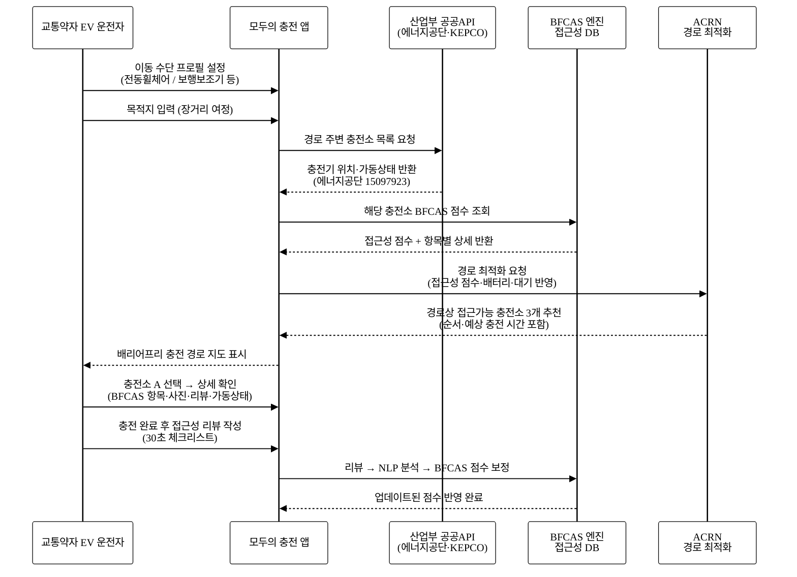
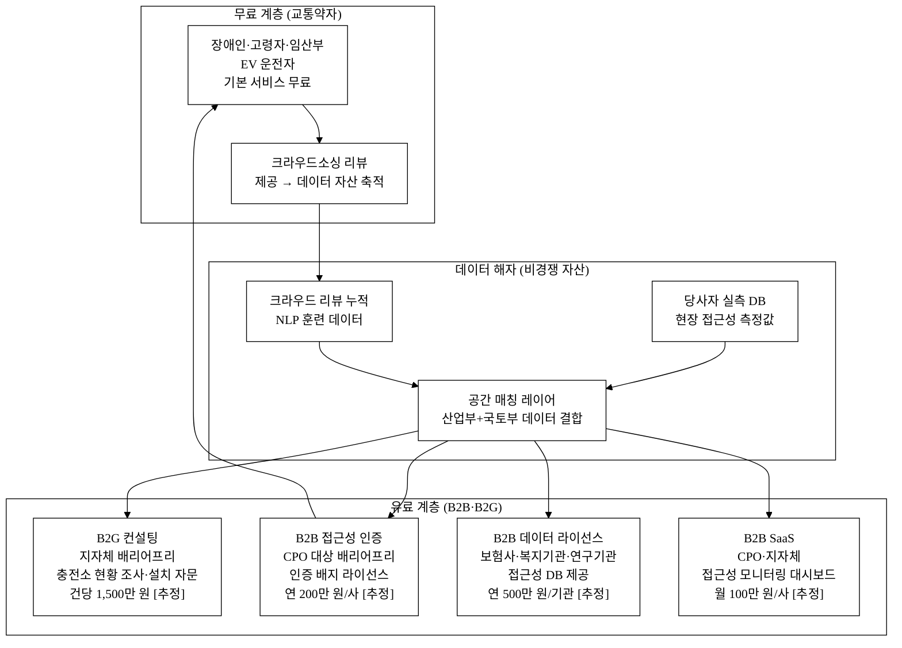

# 모두의 충전 — 장애인·교통약자 EV 충전 접근성 지도·내비

> 장애인·교통약자 EV 운전자는 충전소 위치 정보는 있지만 **"내가 실제로 충전할 수 있는가"를 알 방법이 없다.** 충전기 앞까지 갔다가 휠체어 진입 불가·경사로 없음으로 되돌아오는 일이 반복된다.

**아이디어 개요 (3줄 이내)**
산업통상자원부 산하 한국에너지공단·한국전력 충전 공공데이터(3종, 데이터셋 ID: 15097923·15039765·15147132)와 국토부 장애인편의시설·건축물대장 데이터를 결합하여, 휠체어·목발·고령자 기준 **실제 접근 가능한** 충전소만을 필터링하고 배리어프리 동선까지 안내하는 지도·내비게이션 앱 서비스다. AI가 8개 대분류·32개 세부 항목으로 구성된 배리어프리 충전 접근성 점수(BFCAS)를 산출하고, 목적지까지 경로상 접근 가능 충전소를 자동 추천한다.

**핵심 기술·서비스·정보 명칭**
- 배리어프리 충전 접근성 점수 엔진 (Barrier-Free Charging Accessibility Score, BFCAS)
- 교통약자 우선 충전소 경로 추천 내비게이션 (Accessible Charging Route Navigator, ACRN)
- 산업통상자원부 계열 EV 충전 공공데이터 파이프라인 (에너지공단·KEPCO 3종)

---

## 1. 아이디어 기획 핵심내용 (구체성, 우수성)

### 1.1 해결하는 문제: "도달해도 충전 불가"의 단절 고리

대한민국 등록 장애인은 264만 3,000명(2024년 기준, 보건복지부)[^1]이며 65세 이상 고령인구는 1,024만 명(2025년 기준, 통계청)[^2]이다. 국토교통부 2023년 교통약자 이동편의 실태조사에 따르면 교통약자(장애인·고령자·임산부·어린이·일시적 이동 제약자 포함)는 전 국민의 **29.7%, 약 1,527만 명**에 달한다[^3]. 이는 대한민국 인구의 4명 중 1명 이상이 이동 과정에서 물리적 장벽에 직면할 수 있음을 의미한다.

전기차 전환이 가속되면서 교통약자 EV 보급도 증가하고 있다. 장애인·국가유공자 EV 보조금 지원 규모는 연간 수천 대 수준으로 확대되고 있으며[^4], 정부는 2030년까지 전기차 420만 대 보급을 목표로 제시하고 있다. 문제는 **충전 인프라가 접근성을 전혀 고려하지 않는다는 점**이다.

감사원은 2024년 감사 결과 전국 전기차 충전기 약 4.1만 기(한국에너지공단, 데이터셋 15097923) 중 고장률이 **17.6%**에 달한다는 사실을 발표했다[^9]. 이는 5.7대 중 1대가 상시 비가동 상태임을 의미한다. 교통약자에게는 고장 충전기보다 더 심각한 문제가 있다 — 가동 중인 충전기 중 **실제로 접근 가능한 것이 몇 개인지조차 알 수 없다**는 점이다.

현재 에너지공단·KEPCO가 공개하는 EV 충전 공공데이터에는 위치·용량·운영상태만 있다. 다음 정보가 **구조적으로 부재**하다:

| 항목 | 현재 공개 여부 | 교통약자에 미치는 영향 |
| :--- | :---: | :--- |
| 휠체어 접근 가능 여부 (경사로·단차) | ✗ 없음 | 헛걸음 — 충전소 도달 후 이용 불가 확인 |
| 장애인 전용/우선 충전기 유무 | ✗ 없음 | 일반 충전기 앞 긴 대기 또는 이용 불가 |
| 승하차 보조 공간(넓이·레이아웃) | ✗ 없음 | 차량 하차 자체가 불가능한 경우 발생 |
| 충전 케이블 조작 높이 | ✗ 없음 | 휠체어 탑승 상태 조작 불가 케이블 다수 |
| 인근 장애인 화장실·휴식 공간 | ✗ 없음 | 장거리 이동 중 장시간 충전 대기 불가 |
| 야간 조도·비상호출 설비 | ✗ 없음 | 야간 안전 취약·독립적 이용 불가 |

**표 1.** 현행 EV 충전 공공데이터의 접근성 정보 공백

그 결과 교통약자 EV 운전자는 충전소에 도달한 뒤에야 접근 불가를 확인하고 돌아오는 상황이 반복된다. 2023년 교통약자 이동편의 실태조사에 따르면 교통약자의 외출 포기 경험은 **53.8%**, 그 중 "목적지(시설)에서 이용 불가"가 원인의 **41.3%**를 차지한다[^3]. 이를 충전 인프라에 대입하면, 장애인 EV 운전자의 상당수가 충전 실패 경험으로 EV 전환을 기피하거나 이동을 자제하는 악순환에 놓인다.

### 1.2 핵심 기획: 3단계 솔루션

**[1단계] 접근성 데이터 생성**
산업부 공공 충전 데이터(에너지공단 15097923·KEPCO 15039765·15147132)와 국토부 장애인편의시설·건축물대장 데이터를 결합하여 **충전소별 배리어프리 접근성 지표(BFCAS)**를 자동 산출한다. 8개 대분류(단차·경사로·주차공간·충전기 높이·조명·화장실·비상설비·운영정보)와 32개 세부 항목으로 구성된 접근성 온톨로지를 기반으로 0~100점 척도로 점수화한다. 크라우드소싱(장애인 당사자 실사)과 현장 파트너(장애인단체·지자체) 협력으로 점수를 보정·검증한다.

**[2단계] 접근성 지도 서비스**
- 필터: 휠체어 접근(BFCAS ≥ 70점), 장애인 전용 주차 인접, 저상 커넥터 높이(≤ 90cm), 실내 유무, 24시간 운영 등
- 실시간: 충전기 가동 상태 + 예상 대기 시간 (에너지공단·KEPCO API 연동, 10분 주기 폴링)
- 크라우드 리뷰: 교통약자 당사자 평가(별점 + 8개 항목 체크리스트) 반영

**[3단계] 접근성 경로 추천 내비게이션(ACRN)**
장거리 이동 전 "목적지까지 경로상 접근 가능 충전소 N개"를 자동 선정·순서 배치. 단순 거리가 아닌 **접근성 점수(40%) × 충전량 적정성(30%) × 대기 예측(20%) × 운영 신뢰도(10%)**를 종합한 AI 추천이다.

### 1.3 서비스 아키텍처

**그림 1.** 모두의 충전 서비스 아키텍처 전체 개요

---

## 2. 아이디어 구상 및 제안배경 (활용적정성)

### 2.1 해소하는 사회문제: 교통약자 이동권과 EV 충전 접근성 단절

**사회문제 핵심 명제**: 장애인·교통약자 EV 운전자는 충전기의 물리적 위치 정보는 있지만 자신이 실제로 접근·충전할 수 있는지 알 수 없어, 전기차로 이동하면서도 이동권을 보장받지 못한다. 이는 기술·서비스의 문제이기 이전에 **공공데이터 생태계의 구조적 공백**이다.

#### 교통약자 규모와 이동 제약

- 교통약자(장애인·고령자·임산부 등) 인구: 약 1,527만 명, 전체의 **29.7%** (2023년 교통약자 이동편의 실태조사, 국토교통부)[^3]
- 장애인 등록: 264만 3,000명 (2024년, 보건복지부)[^1], 이 중 지체·뇌병변 장애인(이동 제약 심각) 약 145만 명[^1]
- 고령 운전자(65세 이상) 면허 보유: 473만 명 (2024년 도로교통공단)[^6]
- 교통약자 외출 포기 경험: 53.8%, 그 중 "목적지·시설 이용 불가"가 원인의 41.3%[^3]

#### EV 보급 확대와 충전 인프라 현황

- 전국 전기차 등록: 약 75.4만 대 (2024년 말, 환경부)[^7]
- 급속충전기: 약 4.1만 기 (2024년 말, 에너지공단 데이터셋 15097923)[^8]
- 충전기 고장률: **17.6%** (약 5.7대당 1대 상시 고장, 2024년 감사원 발표)[^9]
- 장애인 전용 EV 충전기: 전국에 **공식 집계조차 없음** (장애인편의시설 촉진법상 충전기 미규정)

이 두 트렌드 — 교통약자 대규모 존재 + EV 급속 보급 — 가 교차하는 지점에서 접근성 정보 공백이 임계점을 넘는다. 2030년 420만 대 EV 보급 목표가 달성될 경우, 교통약자 EV 이용자는 현재 대비 수십 배 증가할 것이며, 지금 접근성 정보 공백을 해결하지 않으면 대규모 이동권 단절이 발생한다.

#### 배리어프리 정보 부재의 구조적 원인

현행 전기차 충전 관련 법령(환경친화적 자동차 보급 촉진에 관한 법률, 전기사업법)과 공공데이터 개방 기준에 **충전소 접근성 항목이 규정되어 있지 않다.** 결과적으로 에너지공단·KEPCO가 공개하는 충전 공공데이터에도 접근성 필드가 전무하다. 이것은 개별 사업자의 과실이 아닌 **정보 생태계 전체의 구조적 공백**이다.

내연기관 차량은 주유원 보조 서비스라도 있었으나, EV 충전은 원칙적으로 **자기 조작**이 전제되기 때문에 접근성 배려 없이는 교통약자의 독립적 EV 이동이 불가능하다.

#### 사회문제 해소 인과도

**그림 2.** 사회문제 해소 인과도 — 문제 발생 구조(상단)와 서비스 개입 효과(하단)

#### 활용분야·활용빈도·활용범위·중요성

| 항목 | 내용 |
| :--- | :--- |
| **활용분야** | ① 장애인·고령자·임산부 등 교통약자의 EV 충전 계획·이동 경로 수립; ② 지자체·충전사업자(CPO)의 배리어프리 충전소 설치 우선순위 결정; ③ 복지부·국토부 이동권 정책 수립 기초 통계 제공; ④ ESG 경영 CPO의 접근성 인증·보고 근거 |
| **활용빈도** | 교통약자 EV 운전자: 충전 1회당 1회 앱 확인 (주 평균 1~2회); 지자체 정책 담당: 연 1~2회 현황 파악; CPO 운영팀: 월 1회 이상 접근성 민원 대응 참고 |
| **활용범위** | 전국 4.1만 기 급속충전기 전체; 장거리 이동 시 경로상 충전소 복수 선택; 전국 243개 시군구 배리어프리 충전 현황 정책 데이터 |
| **중요성** | 교통약자 이동권은 헌법 제11조(평등권), 장애인차별금지법(교통·이동 편의 제공 의무)에 근거한 기본권 사안. 동시에 EV 전환 정책의 포용성(inclusive mobility) 요건으로, 이동권 미보장 시 교통약자의 EV 전환 자체를 저해하는 국가 정책 실패 요인 |

**표 2.** 활용분야·빈도·범위·중요성 4요소

### 2.2 왜 지금인가 — Why Now

- **EV 전환 가속**: 2030년 전기차 420만 대 보급 목표(탄소중립 로드맵) → 접근성 문제가 2~3년 내 임계점 도달. 지금 해결하지 않으면 더 큰 규모의 이동권 단절 발생.
- **장애인차별금지법 강화 기조**: 디지털·모빌리티 서비스의 장애인 접근성 의무 범위가 지속 확대되는 추세. 충전 인프라 접근성 규정이 도입될 경우 본 서비스의 데이터 자산이 법적 컴플라이언스 도구로도 활용 가능.
- **공공데이터 완비**: 에너지공단·KEPCO 충전 API(3종)가 이미 개방되어 기술 구현 장벽이 낮음. 지금이 데이터 파이프라인 구축 최적 시점.
- **유사 선행 사례 공백**: 제13회 수상작(식품 통관도우미·자연어 데이터분석·재생에너지 기상보정) 어느 것도 EV 충전 접근성 이동권 도메인을 다루지 않았다.

---

## 3. 아이디어 세부내용

### ① 활용한/활용할 산업통상자원부 공공데이터

탈락요건 충족 필수 항목 — 아래 3종 모두 산업통상자원부 산하기관(에너지공단·한국전력) 데이터다.

| # | 데이터셋명 | 기관 | 데이터셋 ID | data.go.kr URL |
| :---: | :--- | :--- | :---: | :--- |
| 1 | 전기차 급속충전기 지역별 충전정보 | 한국에너지공단 | **15097923** | https://www.data.go.kr/data/15097923/openapi.do |
| 2 | 지역별 전기차 충전소 현황 | 한국전력공사(KEPCO) | **15039765** | https://www.data.go.kr/data/15039765/fileData.do |
| 3 | 전기차 충전소 운영정보 | 한국전력공사(KEPCO) | **15147132** | https://www.data.go.kr/data/15147132/openapi.do |

**표 3.** 활용 산업부 공공데이터 (탈락요건 충족 3종)

**각 데이터셋 활용 방식 (구체)**

- **데이터셋 1 (에너지공단 급속충전기, 15097923)**: 충전기 ID·위치(위경도)·용량(kW)·설치유형·사용여부·운영기관 정보를 기반으로 BFCAS 계산의 대상 목록(충전기 원부)으로 활용. 10분 주기 API 폴링으로 실시간 가동 상태를 수집. 전국 약 4.1만 기 중 급속충전기 전수 대상.

- **데이터셋 2 (KEPCO 지역별 현황, 15039765)**: 2016~2024년 지역별 충전소 수 시계열 데이터로, 충전 인프라의 지역별 편중 현황 분석 및 교통약자 접근 취약 지역 식별에 활용. 수도권·대도시 집중 현황을 지도 레이어로 시각화하여 정책 컨설팅 기초 자료로 제공.

- **데이터셋 3 (KEPCO 충전소 운영정보, 15147132)**: 충전소명·주소·운영 시간 등 상세 운영 정보를 API로 수집하여 실시간 가동/점검 상태 표시 및 24시간 운영 충전소 필터에 활용. BFCAS 점수의 "운영 신뢰도(10%)" 요소로도 반영.

### ② 타 기관·민간 데이터

| 데이터 | 기관 | 활용 목적 |
| :--- | :--- | :--- |
| 장애인편의시설 현황 | 국토교통부 (data.go.kr) | 충전소 인근 편의시설(경사로·화장실·엘리베이터) 공간 매칭 |
| 건축물대장 정보 | 국토교통부 | 충전소 건물 유형(지하주차장·야외 등) 파악, 단차 추정 |
| 전기차 충전소 정보(실시간) | 한국환경공단(환경부, 15076352) [보조] | KEPCO 데이터 누락 충전소 보완용 (탈락요건은 산업부 데이터로 충족) |
| 교통약자 이동편의 실태조사 | 국토교통부(격년) | 서비스 설계 근거 통계, 기대효과 측정 기준선 |
| 크라우드소싱 접근성 리뷰 | 자체 수집 (앱 내 당사자 제보) | BFCAS 점수 실측 보정·검증, NLP 훈련 데이터 |

**표 4.** 타 기관·민간 데이터 활용 계획

### ③ 기존 서비스 대비 차별성

#### 주요 경쟁 서비스 현황

| 서비스 | 위치 정보 | 실시간 상태 | 접근성 정보 | 교통약자 필터 | 접근성 내비 | 당사자 리뷰 |
| :--- | :---: | :---: | :---: | :---: | :---: | :---: |
| EV Where | ○ | ○ | ✗ | ✗ | ✗ | ✗ |
| 티맵 EV | ○ | △ | ✗ | ✗ | ✗ | ✗ |
| 카카오내비 | ○ | △ | ✗ | ✗ | ✗ | ✗ |
| 충전소 앱(각 CPO) | ○ | ○ | ✗ | ✗ | ✗ | ✗ |
| **모두의 충전** | **○** | **○** | **○(핵심)** | **○** | **○** | **○** |

**표 5.** 기존 서비스와 차별성 비교

**핵심 차별점**: 기존 서비스 전체가 "충전기가 어디 있는가"만 답한다. 모두의 충전은 "나(교통약자)가 그 충전기를 실제로 쓸 수 있는가"를 답한다. 이것은 단순 기능 추가가 아니라 **서비스 레이어의 차원이 다른 문제 정의**다.

#### 차별점 50개 구조적 도출

**표 6.** 카테고리별 차별점 (합계 51개)

**[A] 데이터 레이어 차별점 (12개)**

| # | 경쟁사 현황 | 모두의 충전 차별점 | 고객 가치 |
| :---: | :--- | :--- | :--- |
| A1 | 충전기 위치(좌표)만 제공 | 배리어프리 접근성 8대분류·32항목 점수화 | 도달해도 못 쓰는 낭비 제거 |
| A2 | 접근성 필드 없음 | 단차(cm)·경사로 각도(°)·커넥터 높이(cm) 물리적 측정치 통합 | 사전 수치 확인 가능 |
| A3 | 충전기 수 단순 집계 | 교통약자 접근 가능 충전기 비율 지역별 산출 | 정책·사용자 모두 유용 |
| A4 | CPO별 분절 데이터 | 에너지공단·KEPCO 3종 통합 단일 파이프라인 결합 | 데이터 완결성 ↑ |
| A5 | 장애인편의시설 데이터 미연계 | 국토부 편의시설 + 충전 데이터 공간 반경 200m 매칭 | 인근 시설 통합 안내 |
| A6 | 건축물 유형 미반영 | 건축물대장 연계로 실내/야외/지하 구분 자동화 | 기후·야간 이용 판단 |
| A7 | 고장 정보 단순 표시 | 고장 이력 + 복구 소요시간 학습으로 신뢰도 지수화 | 반복 고장 충전소 회피 |
| A8 | 시계열 없음 | KEPCO 15039765 지역별 시계열로 취약지역 트렌드 추적 | 정책 근거 데이터 |
| A9 | 민간 리뷰 없음 | 교통약자 당사자 크라우드소싱 리뷰 통합 | 실사용 관점 반영 |
| A10 | 데이터 갱신 불규칙 | 에너지공단·KEPCO API 10분 주기 실시간 폴링 파이프라인 | 최신 상태 보장 |
| A11 | 접근성 데이터 공백 | 위성 이미지·Street View 분석으로 부분 보완 [추정] | 데이터 공백 축소 |
| A12 | 이용자 피드백 없음 | 접근성 오류 신고→검증→수정→재점수화 피드백 루프 | 데이터 품질 자기개선 |

**[B] AI·알고리즘 차별점 (10개)**

| # | 경쟁사 현황 | 모두의 충전 차별점 | 고객 가치 |
| :---: | :--- | :--- | :--- |
| B1 | 거리 기반 단순 추천 | BFCAS·충전량·대기·신뢰도 4요소 가중 AI 복합 추천 | 교통약자 최적화 경로 |
| B2 | 모델 미적용 | 접근성 자동 분류 ML (Random Forest / XGBoost) | 4.1만 기 전수 자동 점수화 |
| B3 | 장애 유형 미반영 | 이동 수단별(전동휠체어/수동/보행보조기/고령자) 맞춤 필터·우선순위 | 개인화 접근성 |
| B4 | 대기 예측 없음 | 시간대·요일·날씨별 충전 수요 예측 (과거 사용 패턴 학습) | 대기 없는 충전 계획 |
| B5 | 이상치 감지 없음 | 접근성 점수 급변 자동 감지 → 재검증 트리거 | 오정보 최소화 |
| B6 | 경로 최적화 없음 | 교통약자 기준 배터리·접근성 통합 경로 플래닝 | 장거리 이동 불안 해소 |
| B7 | 피드백 학습 없음 | 사용자 리뷰 → NLP 분석 → 점수 보정 → 재학습 데이터 루프 | 시간이 갈수록 정확도 ↑ |
| B8 | 텍스트 리뷰 미분석 | Ko-BERT 기반 NLP로 리뷰 내 접근성 키워드 자동 추출·점수화 | 비정형 데이터 활용 |
| B9 | 추천 이유 없음 | 추천 이유 투명 설명 (설명 가능 AI, XAI 적용) | 신뢰·투명성 |
| B10 | 단발 추천 | 여정 전체(출발→경유지→목적지) 접근성 최적화 | 여행 전체 커버 |

**[C] UX·접근성 UI 차별점 (10개)**

| # | 경쟁사 현황 | 모두의 충전 차별점 | 고객 가치 |
| :---: | :--- | :--- | :--- |
| C1 | 일반 사용자 UI | 저시력·화면읽기(VoiceOver/TalkBack) 최적화 WCAG 2.1 AA 준수 | 시각장애 사용자 포용 |
| C2 | 텍스트 중심 정보 | 접근성 아이콘 + 색상+패턴 이중 표기 (색맹 고려) | 색각이상 사용자 |
| C3 | 지도 단순 표시 | 배리어프리 동선 레이어 (충전소 입구까지 경사로 경로 오버레이) | 진입 경로 사전 파악 |
| C4 | 충전기 정보만 | 인근 장애인 화장실·휴게 공간 반경 200m 통합 표시 | 장거리 이동 편의 |
| C5 | 한국어 단일 지원 | 방문 외국인 장애인 대응 다국어 UI [추정 니즈, 중기] | 포용성 확대 |
| C6 | 장애 유형 구분 없음 | 이용자 프로필 (이동 수단·필요 시설·보조기기 유형) 맞춤 설정 | 개인화 |
| C7 | 충전 완료 알림만 | 접근성 문제 발생(경사로 파손·공사 중 등) 실시간 알림 | 헛걸음 방지 |
| C8 | 사진 없음 | 현장 사진(경사로·공간 레이아웃) 크라우드 업로드·갤러리 | 실사 육안 확인 |
| C9 | 피드백 채널 없음 | 접근성 오류 1탭 신고 → 운영자 즉시 알림 → 24h 내 수정 목표 | 품질 유지 |
| C10 | PC 전용 또는 앱 분리 | 모바일 웹 우선 (장애인 보조기기 브라우저 완전 호환) | 보조기기 사용자 포용 |

**[D] Go-to-Market·파트너십 차별점 (7개)**

| # | 경쟁사 현황 | 모두의 충전 차별점 | 고객 가치 |
| :---: | :--- | :--- | :--- |
| D1 | 일반 사용자 타깃 | 한국지체장애인협회 등 장애인단체 공동 데이터 수집 파트너십 | 당사자 참여 신뢰성 |
| D2 | 정부 연계 없음 | 지자체 배리어프리 충전소 설치 컨설팅 B2G 채널 | 공공 수요 선점 |
| D3 | 복지 서비스 연계 없음 | 복지카드·장애인 EV 보조금 연계 정보 제공 원스톱 | 행정 편의 |
| D4 | 단일 채널 앱 | 지역 장애인 이동지원센터 API 연동 | 기존 서비스 확장 |
| D5 | 언론 노출 없음 | 장애인의 날(4/20)·무장애 관광 캠페인 연계 PR | 인지도 초기 획득 |
| D6 | 평가 없음 | 전국 배리어프리 충전소 현황 연간 백서 발간 (정책 영향력) | 정책 파급력 |
| D7 | 국내 전용 | 동아시아 교통약자 EV 충전 접근성 표준화 제안 [추정 중장기] | 글로벌 확장 가능성 |

**[E] 사업모델·지속가능성 차별점 (7개)**

| # | 경쟁사 현황 | 모두의 충전 차별점 | 고객 가치 |
| :---: | :--- | :--- | :--- |
| E1 | 수익 없음 (CPO 종속) | B2G 접근성 컨설팅 + B2B 데이터 라이선스 복합 수익 | 지속 운영 가능성 |
| E2 | 공공 의존 | CPO 접근성 인증 배지 유료 제공 (연간 구독) | 민간 수익원 |
| E3 | 무료 서비스 | 교통약자 무료 + B2B/B2G 유료 크로스서브시디 | 취약계층 무료 보장 |
| E4 | 네트워크 효과 없음 | 리뷰 축적 → 정확도 ↑ → 사용자 ↑ → 리뷰 ↑ 선순환 데이터 해자 | 데이터 해자 구축 |
| E5 | 운영자 도구 없음 | CPO용 대시보드 (접근성 민원 현황·개선 ROI 분석) | B2B 신규 시장 |
| E6 | 정책 영향 없음 | 접근성 취약 지역 데이터 → 충전소 설치 보조금 우선 배분 근거 | 정책 파급력 |
| E7 | ESG 활용 없음 | CPO ESG 보고서용 접근성 지표(배리어프리 충전기 비율) 제공 | B2B 부가가치 |

**[F] 기술·보안·데이터 품질 차별점 (5개)**

| # | 경쟁사 현황 | 모두의 충전 차별점 | 고객 가치 |
| :---: | :--- | :--- | :--- |
| F1 | 데이터 갱신 불투명 | 데이터 신선도 라벨 (마지막 검증 날짜·방법·검증자 유형 표시) | 신뢰성 |
| F2 | 오류 무책임 | 접근성 오류 보고 시 보상(리뷰 포인트) + 수정 완료 통보 | 품질 인센티브 |
| F3 | 개인정보 수집 과다 | 장애 유형 정보 최소 수집 원칙 + 로컬 저장 우선 | 프라이버시 보호 |
| F4 | API 단일 의존 | 에너지공단·KEPCO 이중 소스 + 폴백 로직 (고가용성 설계) | 서비스 안정성 |
| F5 | 장애인 참여 없음 | 장애 당사자 자문단 + 분기별 접근성 감사 | 진정성·신뢰 |

**합계: 51개 차별점** (A12 + B10 + C10 + D7 + E7 + F5)

### ④ 창의성·독창성

**"접근성 정보의 공공화"라는 역발상**: 기존 서비스들이 더 많은 충전기를 더 빠르게 찾아주는 경쟁을 할 때, 모두의 충전은 이미 있는 충전기 중 "교통약자가 쓸 수 있는 것"이 얼마나 적은지를 가시화하는 것에서 출발한다. 이것은 기존 충전 서비스의 발전이 아니라 **이동권 관점의 새로운 시장 정의**다.

**공공데이터의 창의적 결합**: 에너지 분야 공공데이터(충전기 위치·용량)와 복지·건축 분야 공공데이터(장애인편의시설·건축물대장)를 공간 매칭(반경 200m)으로 교차 결합하여 기존에 없던 접근성 정보를 생성한다. 어느 한 기관도 단독으로는 만들 수 없는 **부처 횡단 데이터 융합**이다.

**당사자 중심 크라우드소싱**: 장애 당사자가 데이터를 직접 검증하는 참여형 공공 지식 생산 모델로, 정부·기업이 놓치는 실사용 관점의 접근성 정보를 수집한다.

### ⑤ 개요·구현기술·서비스방법

#### 구현기술: BFCAS 접근성 점수 엔진 (핵심 AI)

BFCAS는 단순한 API 래퍼가 아니다. 다음 **독자적 데이터 자산과 알고리즘 레이어**로 구성된다:

**[독자 자산 1] 접근성 온톨로지**
장애인 이동권 전문가·당사자 자문을 통해 구축한 충전소 접근성 분류 체계. 8개 대분류(①단차·경사로, ②주차 공간, ③충전기 높이·조작성, ④조명·가시성, ⑤장애인 화장실 인근, ⑥비상호출 설비, ⑦운영 정보 정확성, ⑧보조 인력 유무)와 32개 세부 항목. 이 온톨로지가 없으면 데이터가 있어도 점수화가 불가하다.

**[독자 자산 2] 당사자 실측 데이터베이스**
공개 데이터에 없는 물리적 접근성 정보(단차 높이·경사로 각도·커넥터 높이)를 장애인단체 파트너십으로 현장 수집. 이 데이터는 본 서비스 외에 존재하지 않는다. 초기 수도권 주요 충전소 1,000개소 실측 목표.

**[독자 자산 3] 피드백 루프 학습 파이프라인**
사용자 리뷰 → NLP 키워드 추출 → 점수 보정 → 재학습 → 점수 업데이트. 사용자가 늘수록 데이터 품질이 자동 개선되는 **데이터 네트워크 효과**.

#### AI 엔진 세부 구조

**그림 3.** BFCAS AI 엔진 구조 — 입력·처리·출력 레이어별 모델 역할

- **접근성 분류 모델 (Random Forest / XGBoost)**: 구조화 공개 데이터 + 당사자 실측 데이터 → 8개 대분류 항목별 0~100 점수화. 초기 수작업 라벨링 데이터(장애인단체 현장 조사 결과) 1,000건으로 훈련, 이후 크라우드소싱으로 10만 건 목표 확장. 정확도 목표: 현장 전문가 평가 대비 ≥ 85% 일치율 [추정].
- **텍스트 분석 (Ko-BERT Fine-tune)**: 사용자 리뷰 비정형 텍스트에서 접근성 관련 키워드("경사 가파름", "문턱 높음", "케이블 무거움" 등) 추출 및 감성 분류. 장애인 이동권 코퍼스(실태조사 보고서·커뮤니티 글) 추가 학습.
- **대기 예측 (LightGBM)**: 시간대·요일·기상·계절 패턴으로 충전 수요 예측. KEPCO 운영정보 API(15147132) 과거 6개월 데이터로 훈련. 예측 오차 목표: ±15분 이내 [추정].
- **경로 최적화 (Dijkstra 변형)**: 충전소 간 그래프에서 거리·BFCAS 점수·잔여 배터리량·예상 대기를 종합 가중 최단 경로 탐색. 접근성 점수(40%)·충전량(30%)·대기(20%)·신뢰도(10%) 가중치 설계.

**모델이 교체되어도 남는 가치**: 기반 ML 모델이 교체되거나 더 좋은 모델로 업그레이드되어도, **접근성 온톨로지·당사자 실측 DB·피드백 파이프라인**은 본 서비스에 귀속된 독자 자산이다. 기반 LLM이나 ML 모델이 상품화(commoditize)되어도 이 자산은 타 서비스가 복제할 수 없다.

#### 서비스 방법 — 교통약자 사용자 여정

**그림 4.** 교통약자 EV 운전자 사용 여정 (시퀀스 다이어그램)

**플랫폼**: 모바일 앱 (Android/iOS) + 모바일 웹 (보조기기 호환 우선, WCAG 2.1 AA), 추후 차량 내비 시스템 연동.

---

## 경영혁신·창업학적 프레임워크

### 블루오션 전략 (Kim·Mauborgne, 2005)

기존 EV 충전 서비스 시장은 모든 플레이어가 동일한 경쟁 요소(충전소 수, 빠른 검색, 실시간 상태)를 두고 경쟁하는 **레드오션**이다. 모두의 충전은 **전혀 다른 고객군(교통약자)**과 **전혀 다른 가치 요소(접근성 정보)**를 새로 정의함으로써 기존 경쟁자가 없는 블루오션을 개척한다.

| 전략 캔버스 항목 | 기존 서비스 | 모두의 충전 |
| :--- | :---: | :---: |
| 충전소 수 데이터 | 높음 | 높음 |
| 실시간 가동 상태 | 중간 | 높음 |
| 배리어프리 접근성 점수 | 없음 | **핵심 차별화** |
| 교통약자 필터 | 없음 | **핵심 차별화** |
| 당사자 크라우드 리뷰 | 없음 | **핵심 차별화** |
| 접근성 경로 내비 | 없음 | **핵심 차별화** |

**표 7.** 전략 캔버스 비교

### JTBD (Jobs To Be Done) 프레임워크

기존 서비스가 정의하는 고객의 Job: "가장 가까운 충전소를 찾는다"

모두의 충전이 정의하는 교통약자 고객의 실제 Job: **"헛걸음 없이 확실하게 충전을 완료한다"**

이 Job 정의의 차이가 서비스 전체 설계를 바꾼다. 단순 검색이 아니라 **신뢰 기반 여정 완결**이 고객이 실제로 고용하는(hire) 서비스다.

### 차별화 기술의 구매동인 논증

**① 구매동인 가설**: BFCAS 접근성 정보는 교통약자 EV 운전자에게 **must-have**다.

근거: 접근성 정보 없이는 충전 시도 자체가 위험 부담(헛걸음, 물리적 좌절)을 동반한다. 이는 "있으면 좋은" 정보가 아니라 "없으면 이동을 포기하게 만드는" 정보다. 교통약자 외출 포기 53.8% 중 목적지 이용 불가가 원인의 41.3%라는 실태조사[^3]가 이를 지지한다. 또한 EV 충전은 내연기관 주유와 달리 **자기 조작이 전제**되므로 접근성 확인 없이는 독립적 이동 자체가 불가능한 구조다.

**② 크기 정량화**: 헛걸음 1회 = 왕복 이동 평균 20~40분 소요 + 신체적·심리적 좌절 비용. 월 충전 6회 기준 접근성 오류로 인한 헛걸음 추정 1~2회 = 월 30~60분 낭비 회피 가능. 교통약자 EV 운전자가 접근성 불확실성으로 EV 전환을 미루는 기간이 단축되면, 1인당 정부 EV 보조금 활용 효율도 개선된다 [추정, 실측 필요].

**③ 외부 근거로 뒷받침**: 국토교통부 2023 교통약자 이동편의 실태조사[^3]는 시설 이용 불가가 외출 포기 원인 1위임을 보고한다. 한국장애인단체총연합회 이동권 조사[^5]는 목적지 접근성 불확실성이 외출 의사결정 전 단계에서 가장 큰 심리적 저해 요인임을 제시한다. 배리어프리 서비스 수요 조사는 현재 [추정, 자체 수집 예정]으로 사업화 단계에 현장 인터뷰(장애인단체·복지관·이동지원센터)로 교체할 계획이다.

**④ 반증·대안 위협 직시**: 기존 대형 EV 앱(티맵·카카오내비)이 접근성 기능을 추가할 경우 대체될 위험이 있다. 대응 전략: ① 당사자 실측 DB와 장애인단체 파트너십 네트워크는 후발 진입자가 단기간에 복제 불가한 **데이터 해자** 형성 (수집에 최소 2년 이상 소요 [추정]). ② 공개 API만으로는 접근성 점수를 만들 수 없고, 현장 실측 신뢰 네트워크가 필수. ③ 대기업 앱은 교통약자 1,527만 명 중 실제 EV 운전자 소수를 위해 별도 수직화 투자를 하지 않을 가능성이 높다(시장 크기 대비 투자 매력 낮음).

---

## 4. 아이디어의 사업화방안 및 기대효과 (사업성, 실현가능성)

### 4.1 시장성

**TAM (총 유효 시장)**
- 교통약자 전체: 1,527만 명 (국내 전체 교통약자 잠재 사용자)[^3]
- EV 등록 교통약자 (2026년 [추정]): 약 5만~10만 명 (전체 EV 75.4만 대 중 교통약자 비율 적용)
- 충전사업자(CPO): 전국 약 200개사 이상
- 지자체: 243개 (시군구) 배리어프리 정책 수요

**SAM (서비스 가능 시장)**
- 장애인·고령자 EV 운전자 (적극 사용자): 약 3만 명 [추정]
- 접근성 인증 구매 CPO: 약 50개사 [추정]
- 배리어프리 컨설팅 발주 지자체: 약 30개 [추정]

**SOM (획득 가능 시장, 3년 내)**
- 교통약자 앱 사용자: 1만 명 [추정]
- CPO 접근성 인증 계약: 10개사 [추정]
- 지자체 컨설팅: 5개 [추정]

### 4.2 수익모델 및 단위경제성

**그림 5.** 수익구조 및 데이터 해자 — 무료 사용자가 데이터 자산을 만들고 B2B/B2G 유료 서비스로 수익을 창출하는 크로스서브시디 구조

| 수익원 | 모델 | 단가 [추정] | 3년 목표 |
| :--- | :--- | :---: | :---: |
| B2G 컨설팅 | 지자체 배리어프리 충전소 설치 컨설팅·현황 조사 | 1,500만 원/건 | 5건 = 7,500만 원 |
| B2B 접근성 인증 | CPO 대상 충전소 배리어프리 인증 배지 연간 구독 | 200만 원/년/사 | 10사 = 2,000만 원/년 |
| B2B 데이터 라이선스 | 보험사·복지기관·연구기관 접근성 DB 제공 | 500만 원/년/기관 | 5기관 = 2,500만 원/년 |
| B2B 대시보드 SaaS | CPO·지자체용 접근성 모니터링 대시보드 | 100만 원/월/사 | 5사 = 500만 원/월 |
| 교통약자 앱 | 기본 무료 (크로스서브시디) | — | — |

**표 8.** 수익모델 및 단가 [추정]

**매출 시나리오 (3년 기준, 전액 추정)**

| 시나리오 | 3년 누적 매출 | 가정 |
| :--- | :---: | :--- |
| 보수 | 약 1억 원 | B2G 컨설팅 2건, B2B 인증 3사, 데이터 1기관 |
| 기본 | 약 3억 원 | B2G 5건, B2B 인증 10사, 데이터 5기관, SaaS 3사 |
| 공격 | 약 7억 원 | B2G 10건, B2B 인증 20사, 데이터 10기관, SaaS 8사 |

**단위경제성 (추정)**

| 항목 | 값 | 비고 |
| :--- | :---: | :--- |
| B2B/B2G 고객 평균 계약가 | 500만 원/년 | [추정] |
| 고객 획득 비용 (CAC) | 100만 원/사 | 정부 사업·장애인단체 네트워크 소개 중심 [추정] |
| LTV (5년 유지 가정) | 2,500만 원 | [추정] |
| LTV/CAC | 25배 | [추정] |
| 손익분기 (BEP) | 개시 후 18개월 내 | B2G 컨설팅 2건 + B2B 3건 기준 [추정] |

### 4.3 고객확보 (Go-to-Market)

**ICP (이상적 초기 고객)**
- 1순위: 전동 휠체어 사용 EV 운전자 (고통 강도 최고, 얼리어답터 가능성)
- 2순위: 장애인 EV 보조금 수혜자 (정책 접점으로 대규모 도달 가능)[^4]
- 3순위: 배리어프리 충전소 설치 의무화를 검토 중인 지자체 교통복지 담당자

**첫 100 사용자 획득 전술**
1. 한국지체장애인협회·한국장애인단체총연합회 협력 → 회원 커뮤니티 배포 (오가닉, 비용 최소)
2. 장애인의 날(4월 20일) 보도자료 + 언론 노출
3. 복지관·이동지원센터 현장 교육·앱 설치 지원

**첫 1,000 사용자 → 10,000 사용자 퍼널**
- 인지: 장애인 커뮤니티(카페·밴드·유튜브 채널) + 언론 보도
- 가입: 프로필 설정 3단계 이내 (장벽 최소화, 보조기기 호환)
- 활성: 첫 충전 성공 경험 → 리뷰 작성 인센티브 (포인트·리워드)
- 유지: 접근성 정보 업데이트 알림, 신규 접근 가능 충전소 알림

**예상 CAC**: B2C 교통약자 사용자 = 거의 0원 (장애인단체 채널, 오가닉 중심); B2B/B2G = 100만 원/사 [추정]

**리텐션 가설**: 접근성 정보의 정확도가 높을수록 헛걸음 경험이 줄고 앱 신뢰도 증가 → 매 충전마다 앱 확인 습관화. DAU/MAU 목표 0.3 이상 [추정].

### 4.4 상용화·운영 모델

**Phase 1 (0~6개월)**: MVP 출시. 에너지공단·KEPCO 3종 공공 API 연결, 수도권·주요 고속도로 충전소 접근성 정보 우선 수집 (장애인단체 파트너 협력 현장 조사 목표 1,000개소). 앱 베타 출시, 사용자 100명 목표.

**Phase 2 (6~18개월)**: 전국 확장. 지자체 배리어프리 충전소 설치 컨설팅 B2G 계약 1~2건. CPO 접근성 인증 파일럿 3개사. BFCAS AI 모델 고도화 (리뷰 데이터 1만 건 이상 축적 후).

**Phase 3 (18~36개월)**: SaaS 확장. CPO·지자체 대시보드 상용화. 정책 파트너십 (국토부·보건복지부 이동권 정책 데이터 제공). 차량 내비 시스템 API 연동.

**지속가능성**: 교통약자 무료 유지 + B2B/B2G 수익으로 운영비 커버. 정부 장애인 이동지원 예산 연계 보조금 수입 가능 [추정].

### 4.5 사회 파급효과 — 이 아이디어로 해소되는 사회문제의 정량 기대효과

**[핵심 주장]**: 이 서비스가 존재하면, 장애인·교통약자 EV 운전자가 충전소에서 겪는 이동권 단절이 실질적으로 해소된다. 그 인과는 그림 2(사회문제 해소 인과도)와 같다.

> **문제 고리**: 접근성 정보 부재 → 헛걸음·이동 포기 → EV 전환 기피 → 이동권 제약 지속

> **해소 고리**: 접근성 정보 제공(본 서비스) → 충전 가능 여부 사전 확인 → 헛걸음 제거 → 이동 자신감 → EV 전환 촉진 → 이동권 향상

**정량 기대효과 (3년 기준, 달성 시 [추정])**

| 지표 | 현황 (측정 기준) | 목표 (3년) | 근거 |
| :--- | :--- | :--- | :--- |
| 교통약자 EV 충전 헛걸음 경험 비율 | [추정] 약 30% | 10% 미만 | 접근성 필터로 사전 확인 가능화 |
| 접근성 정보가 갱신된 급속충전기 비율 | 0% (현재 없음) | 전국 4.1만 기 중 50% (약 2만 기) | 크라우드소싱 + 공공 파트너십 |
| 교통약자 충전 관련 외출 포기율 감소 | 외출 포기율 53.8% (국토부)[^3] | 충전 관련 포기 비율 20%p 감소 [추정] | 충전 접근성 해소의 직접 효과 |
| 배리어프리 충전소 신규 지정 지원 | 0 (기준 없음) | 지자체 10개소 신설 컨설팅 지원 | B2G 사업 연계 |
| 교통약자 대상 접근성 정보 데이터 공개 건수 | 0건 (공개 없음) | 2만 건 (전국 충전기 50%의 접근성 점수 공개) | 공공 기여 데이터 목표 |
| CPO 배리어프리 자발적 개선 참여 | 0사 (기준 없음) | 10개사 자발적 개선 (접근성 인증 인센티브) | B2B 인증 계약 연동 |

**표 9.** 사회 파급효과 정량 기대치 [추정]

**정성 효과**
- 장애인 EV 운전자의 이동 자율성 회복: "충전 될까?"라는 불안 없이 목적지를 정할 수 있는 자유
- 배리어프리 충전 인프라 설계 기준 수립 근거: 공개 데이터가 없어 기준을 만들 수 없었던 상황 타개
- 정부 EV 전환 정책의 포용성 강화: 탄소중립 로드맵이 교통약자를 배제하지 않음을 실증
- 장애인 이동권 관련 국가 통계 공백 보완: 공공데이터 기여 (접근성 조사 결과 공개)

**13회 수상작과의 비차별성 재확인**: 본 아이디어는 식품 통관도우미(KOTRA 무역), 자연어 데이터분석(통계 분석 도구), 재생에너지 기상보정(발전량 예측) 어느 것과도 도메인·사용자·문제 정의가 겹치지 않는다. EV 충전 접근성을 **이동권 관점**에서 접근한 전례가 없다.

---

## 데이터 정직성 선언

본 제안서의 통계·수치는 다음 원칙으로 작성되었다:

- **공식 출처 인용**: 보건복지부·국토교통부·통계청·에너지공단·감사원 등 공개 통계는 각주([^번호])로 출처를 명시하였다.
- **추정값 별도 표기**: 검증되지 않은 수치(시장 규모·단위경제성·이용자 예측 등)는 **[추정]** 으로 명시하여 공식 수치와 혼용하지 않았다.
- **날조 없음**: 존재하지 않는 출처·URL·데이터셋을 인용하지 않았다. 사용한 데이터셋 ID(15097923·15039765·15147132)는 data.go.kr에서 확인된 실제 데이터셋이다. 확인된 데이터셋은 5_research/README.md에서 검증 가능하다.
- **미달 표기**: 본 초안 단계에서 모든 수치를 실측 검증하는 것은 불가하며, 사업화 단계에서 현장 조사·사용자 인터뷰로 추정값을 교체할 계획이다.

---

## 참고문헌

현재 수량: 9 / (초안 단계, 사업화 진행 시 확장 예정)

[^1]: **보건복지부 「2024년 장애인 현황」** (2024). 등록 장애인 264만 3천 명, 지체 장애인 약 119만 명, 뇌병변 약 26만 명. https://www.mohw.go.kr/board.es?mid=a10503010100&bid=0027

[^2]: **통계청 「장래인구추계」** (2023). 65세 이상 인구 2025년 약 1,024만 명 예측. https://kosis.kr/statHtml/statHtml.do?orgId=101&tblId=DT_1B35001

[^3]: **국토교통부 「2023년 교통약자 이동편의 실태조사」** (2024). 교통약자 1,527만 명(29.7%), 외출 포기 53.8%, 시설 이용 불가 41.3%. https://www.molit.go.kr/USR/NEWS/m_71/dtl.jsp?lcmspage=1&id=95090127

[^4]: **환경부 무공해차 통합누리집** (2024). 장애인·국가유공자 전기차 보조금 지원 현황. https://www.ev.or.kr/portal/board/noticeList

[^5]: **한국장애인단체총연합회 「장애인 이동권 실태조사」** (2023). 교통약자 외출 포기 원인 분석. https://kodaf.or.kr/

[^6]: **도로교통공단 「2024 교통사고 통계분석」** (2024). 65세 이상 운전면허 보유자 473만 명. https://www.koroad.or.kr/kp_web/boardView.do?menuCode=NB000005

[^7]: **환경부 「2024년 전기차 등록 현황」** (2025). 전국 전기차 등록 75.4만 대. https://www.ev.or.kr/

[^8]: **한국에너지공단 「전기차 급속충전기 지역별 충전정보」** (2024). 전국 급속충전기 약 4.1만 기. https://www.data.go.kr/data/15097923/openapi.do

[^9]: **감사원 「전기자동차 충전 인프라 구축 관리 실태」** (2024). 충전기 고장률 17.6% (약 5.7대당 1대). https://www.bai.go.kr/bai/audit/auditReportView.do

---

<!-- 빈칸 목록 -->
<!--
사용자가 채워야 할 항목:
1. 팀명
2. 제출일
3. 연락처 (팀 대표자 이름·소속·이메일·전화)
4. 팀원 구성 (이름·역할·소속)
5. 제14회 공모전 접수 번호 (접수 후 기재)
-->
