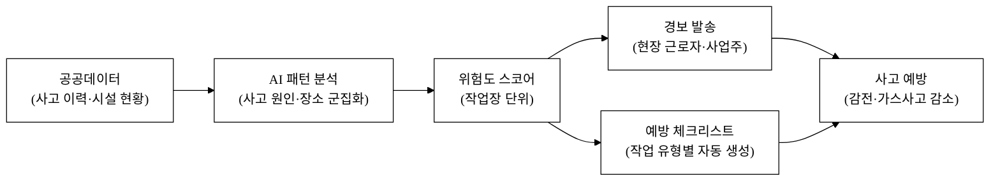
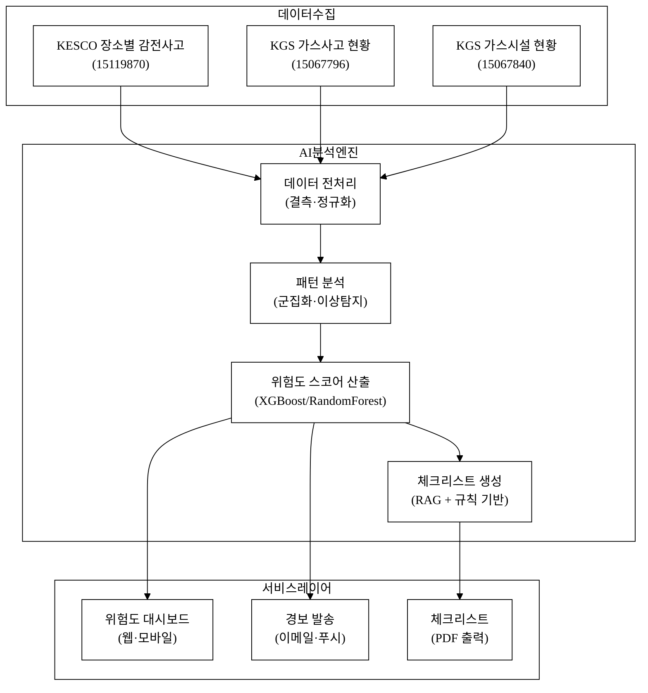
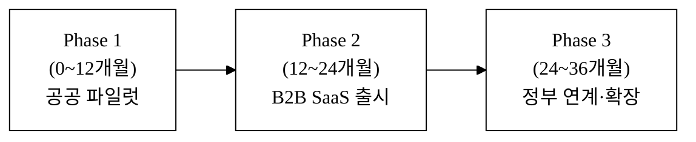

# 세이프워크(SafeWork) — 감전·가스사고 데이터 기반 위험작업장 예방경보

> 아이디어 간략 개요 (3줄 이내)

감전 및 가스 사고는 특정 작업 유형·장소에서 반복 발생하지만, 현장 근로자와 사업주는 그 위험 패턴을 사전에 파악하기 어렵다. 세이프워크는 한국전기안전공사·한국가스안전공사의 사고 이력 공공데이터를 AI로 분석하여, 작업장 단위로 위험도를 예측·경보하고 맞춤형 예방 체크리스트를 제공하는 서비스다. 사고가 일어난 뒤 조사하는 사후 체계에서 벗어나, 데이터가 축적될수록 예측 정확도가 높아지는 선제 예방 경보 체계로 전환한다.

**핵심 기술·서비스·정보 명칭**
- 위험작업장 예측 스코어링 엔진 (AI 패턴 분석 기반)
- 작업 유형별 예방 체크리스트 자동 생성
- 사고 이력 히트맵 및 위험도 경보 대시보드

---

## 1. 아이디어 기획 핵심내용 (구체성, 우수성)

### 1.1 무엇을 만드는가

세이프워크는 **산업 현장의 감전·가스 사고 예방을 위한 위험도 예측 경보 플랫폼**이다. 세 가지 핵심 기능으로 구성된다.

**① 위험작업장 스코어링 대시보드**
장소별 감전사고 이력 데이터(KESCO, 데이터셋 15119870)와 가스사고 현황 데이터(KGS, 15067796), 국내 가스시설 현황 데이터(KGS, 15067840)를 결합하여, 지역·업종·작업 유형 단위로 위험 점수를 산출하고 지도·목록 형태로 시각화한다. 사업주·안전관리자·현장 근로자가 자신의 작업장 유형을 조회하면 "이 유형의 작업장에서 최근 N년간 감전 사고가 M건 발생했으며, 원인 상위 3위는 △△△"라는 형태의 정보를 즉시 확인할 수 있다.

**② AI 기반 위험도 예측 및 경보**
사고 원인(작업 종류·설비 상태·시간대·계절)과 발생 장소 유형을 학습한 머신러닝 모델이 "현재 유사한 조건을 가진 작업장의 예상 위험 등급"을 산출한다. 특정 계절·작업 시기가 도래하거나, 신규 가스시설 가동 현황 데이터가 갱신될 때 자동으로 경보를 발송한다(웹 알림·SMS·이메일 연동 [추정: 알림 채널은 운영 단계에서 확정]).

**③ 맞춤형 예방 체크리스트 자동 생성**
작업장 유형(건설·제조·서비스업 등)과 주요 설비(LPG 시설 보유 여부, 고압 전기설비 여부 등)를 입력하면, 해당 작업 유형의 사고 원인 상위 항목과 연계된 점검 항목이 자동으로 생성된다. 생성된 체크리스트는 PDF 출력·모바일 확인이 가능하며, 법정 안전점검 서류와 연계 가능한 구조로 설계한다.

### 1.2 왜 지금인가 (구체성·우수성)

기존 예방 체계는 **사후 조사 및 정기 방문점검** 중심이다. 전기안전공사는 연 1~2회 방문점검을 수행하고, 가스안전공사도 정기 검사 위주로 운영된다. 사고 이력 데이터가 공공데이터포털에 이미 개방되어 있음에도, 이를 현장 수준의 예방 경보로 전환하는 서비스는 존재하지 않는다.

세이프워크의 우수성은 "분산된 사고 이력을 패턴화하여 선제 경보로 전환한다"는 데 있다. 사고는 무작위가 아니라 **특정 작업 유형·장소 조건에서 반복**된다. 이 패턴을 데이터로 증명하고, 유사한 조건의 작업장에 선제적으로 알리는 것이 이 서비스의 핵심 기여다.

**그림 1.** 세이프워크 서비스 흐름 개요

---

## 2. 아이디어 구상 및 제안배경 (활용적정성)

### 2.1 해소하는 사회문제 — 반복되는 감전·가스 산업재해 사망

**산업 현장 감전·가스 사고는 매년 반복적으로 사망자를 낳는다.**

고용노동부 산업재해 통계에 따르면, 2023년 전체 산업재해 사망자 수는 598명(사고사망 기준)이며, 이 중 감전 사고로 인한 사망은 매년 20~30명 수준으로 집계된다.[^1] 가스 사고의 경우, 한국가스안전공사 공공데이터(15067796)에 따르면 2023년 기준 국내 가스사고는 수십 건 이상 발생하며, 인명피해(사상자)가 수반된다.[^2]

이 사고들의 핵심 특징은 **반복성과 예측 가능성**이다. 즉, 동일한 작업 유형(전기 배선·수리, LPG 용기 교체, 배관 용접 등)에서, 유사한 장소 조건(밀폐 공간, 노후 설비, 건설 현장)에서 반복적으로 발생한다. 이는 예방이 가능한 사고 유형임을 뜻한다.

**그러나 현재 예방 정보 체계에는 구조적 공백이 있다.**

| 주체 | 현황 | 한계 |
|:---|:---|:---|
| 한국전기안전공사(KESCO) | 정기 방문점검, 전기안전여기로(민원 포털) | 사후 점검·민원 중심; 사고 패턴의 작업장 단위 경보 없음 |
| 한국가스안전공사(KGS) | 정기 가스시설 검사, 사고 원인 조사 | 검사 중심; 유사 조건 사업장에 선제 경보 없음 |
| 고용노동부 | 산업재해 조사 보고 | 사고 이후 조사; 예방 경보 미제공 |
| 현장 사업주·근로자 | 법정 안전교육 이수 | 자신의 작업 유형과 관련된 사고 통계를 쉽게 조회 불가 |

**표 1.** 현 예방 체계 주체별 현황 및 한계

특히 소규모 사업장(50인 미만)은 전문 안전관리자를 두기 어렵고, 안전 정보 접근성이 낮다. 사고 이력 공공데이터는 이미 개방되어 있지만, 이를 "우리 작업장이 위험한가"라는 질문에 답해주는 형태로 가공하는 서비스가 없다.

**세이프워크가 존재한다면:**
이 서비스는 사고 이력 데이터를 작업 유형·장소 단위로 분류·분석하여, 유사한 조건의 작업장에 "이 유형 작업에서 최근 사고가 반복되고 있습니다 — 다음 항목을 점검하세요"라는 경보와 체크리스트를 제공한다. 사고가 일어나기 전에 현장 근로자와 사업주가 위험 가능성을 인식하고 예방 조치를 취할 수 있게 된다. 이것이 이 아이디어가 해소하는 사회문제의 인과 경로다.

### 2.2 활용분야·활용빈도·활용범위·중요성

**활용분야:** 산업안전 관리, 중소 사업장 자율 안전점검, 전기·가스 관련 공공기관 예방 업무

**활용빈도:** 상시 조회(대시보드), 작업 전 체크리스트 확인(일 단위), 계절별 위험 경보 자동 발송(주/월 단위)

**활용범위:** 전국 모든 전기·가스 설비 보유 사업장 — 특히 소규모 제조·건설·서비스업 현장. 한국가스안전공사 국내 가스시설 현황(15067840) 기준 전국 LPG·도시가스 시설을 보유한 사업장 수백만 개소가 잠재적 대상이다.[^3]

**중요성:** 산업재해 사망은 개인과 가족의 비극이자 사회적 비용이다. 사망 1인당 경제적 비용(의료비·법적 배상·생산성 손실 포함)은 수억 원에 달한다[^4][추정]. 감전·가스 사고는 예방 가능한 유형이며, 선제 정보 제공만으로도 상당한 감소 효과를 기대할 수 있다.

---

## 3. 아이디어 세부내용

### 3-① 활용한/활용할 산업통상자원부 공공데이터 (탈락요건 — 필수 명시)

| 데이터셋명 | 제공기관 | 데이터셋 ID | data.go.kr URL |
|:---|:---|:---:|:---|
| 장소별 감전사고 현황 | 한국전기안전공사(KESCO) | 15119870 | https://www.data.go.kr/data/15119870/fileData.do |
| 가스사고 현황 (월별·원인별) | 한국가스안전공사(KGS) | 15067796 | https://www.data.go.kr/data/15067796/fileData.do |
| 국내 가스시설 현황 | 한국가스안전공사(KGS) | 15067840 | https://www.data.go.kr/data/15067840/fileData.do |

**표 2.** 활용 산업통상자원부 공공데이터 목록

> 한국전기안전공사는 산업통상자원부 산하 공공기관이며, 한국가스안전공사는 산업통상자원부 산하 공공기관이다. 두 기관 모두 탈락요건 충족 대상 기관에 해당한다.

**데이터 활용 방식:**
- **15119870 (장소별 감전사고):** 사고 발생 장소 유형(공장·건설현장·가정·상업시설 등)별 인명피해(사망·중경상) 연도별 시계열 데이터. 장소 유형을 업종·작업 유형과 매핑하여 위험도 스코어 입력 변수로 활용.
- **15067796 (가스사고 현황):** 월별·원인별(시설 결함·취급 부주의·공급자 과실 등) 사고 건수 및 인명피해. 계절별·원인별 패턴 분석에 활용.
- **15067840 (국내 가스시설 현황):** 시도별 LPG/도시가스 시설 수. 시설 밀도 대비 사고 발생률 계산(노출량 보정)에 활용하여 실질 위험도 산출.

### 3-② 타 기관·민간 데이터

| 데이터명 | 기관·출처 | 활용 목적 |
|:---|:---|:---|
| 산업재해 통계 (업종별·재해 유형별) | 고용노동부 | 감전·가스 재해를 전체 산재 맥락 안에서 위치 설정 |
| 다중이용시설 전기안전점검 결과 | KESCO (15159822, data.go.kr) | 점검 부적합 이력과 사고 이력 교차 분석 (보조) |
| 안전등급 이력정보 | KESCO (15145904, data.go.kr) | 자가용 전기설비 안전등급 이력으로 위험도 보정 |
| 산업안전보건법 안전기준 | 고용노동부 (법령 텍스트) | 체크리스트 항목 법적 근거 확보 |

### 3-③ 기존 서비스 대비 차별성

기존 관련 서비스와의 주요 차별점을 구조화한다.

**표 3.** 경쟁 서비스 비교

| 비교 축 | 전기안전여기로 (KESCO) | 가스안전공사 포털 (KGS) | 세이프워크 (본 아이디어) |
|:---|:---:|:---:|:---:|
| 사고 이력 데이터 시각화 | 제공 안 함 | 제공 안 함 | 제공 (장소·유형별 히트맵) |
| 위험도 예측 스코어 | 없음 | 없음 | 제공 (AI 패턴 분석) |
| 작업 전 체크리스트 | 일반 교육자료 | 일반 교육자료 | 작업 유형별 자동 생성 |
| 선제 경보 기능 | 없음 | 없음 | 제공 (계절·조건 기반) |
| 소규모 사업장 접근성 | 낮음 (방문점검 대기) | 낮음 | 높음 (웹·모바일 셀프 조회) |
| 감전·가스 통합 | 분리 | 분리 | 통합 제공 |

**핵심 차별점 50개** (카테고리별 정리):

**[데이터·분석 축 — 15개]**

1. 장소별 감전사고 이력 데이터(KESCO 공공데이터)를 직접 시각화 → 기존 서비스는 미제공
2. 가스사고 원인별 패턴을 월별 시계열로 분석 → 기존은 단순 통계 보고 수준
3. 가스시설 밀도(15067840) 대비 사고 발생률 계산으로 노출량 보정 위험도 산출
4. 감전·가스 두 영역 사고 데이터를 단일 플랫폼에서 통합 분석
5. 사고 원인 상위 항목 자동 추출(빈도 기반 순위화)
6. 장소 유형과 업종 코드를 매핑하여 "내 업종 위험 순위" 산출
7. 연도별 사고 추세(증가/감소/계절성) 자동 감지
8. 계절별 사고 집중 패턴(예: 여름 감전, 겨울 가스사고) 특화 분석
9. 사고 인명피해(사망/중경상) 가중치 적용 위험도 지수
10. 시설 노후도와 사고 이력의 상관 분석 (KESCO 안전등급 이력 보조 데이터 결합)
11. 다중이용시설 점검 부적합 이력과 사고 이력 교차 분석
12. 지역(시도·시군구)별 위험 순위 맵
13. 작업 유형(용접·전기 배선·LPG 용기 교체 등) 단위 사고 빈도 분류
14. 사고 원인(기계 결함/취급 부주의/시설 불량)별 예방 가중치 모델
15. 시간이 지날수록 누적 사고 데이터로 예측 정확도 자동 향상 (온라인 학습 구조)

**[서비스·UX 축 — 12개]**

16. 작업장 유형 입력 → 위험 스코어 즉시 조회 (셀프서비스)
17. 작업 유형별 맞춤 체크리스트 자동 생성
18. 생성된 체크리스트 PDF 출력 지원
19. 모바일 앱/웹 접근(현장 근로자가 현장에서 직접 조회)
20. 계절별·조건별 위험 경보 자동 발송(푸시/이메일)
21. 위험 등급(저/중/고/위험) 4단계 시각화
22. 사고 히트맵(지도 레이어) — 장소 유형별 사고 집중 지점 가시화
23. 한국어 친화적 UI (소규모 사업주·근로자 대상)
24. 체크리스트 항목에 법정 안전기준 조항 자동 연결
25. 점검 이력 저장 및 이력 조회 기능
26. 사업장 유형별 대표 사고 사례 요약 카드 (학습 효과)
27. 체크리스트 미완료 항목 리마인드 알림

**[AI·기술 축 — 10개]**

28. 머신러닝 기반 위험도 예측 (단순 사고 건수 카운트가 아닌 패턴 학습)
29. 군집화(클러스터링)로 고위험 작업 유형 자동 분류
30. 이상 탐지(Anomaly Detection)로 특정 시기 사고 급증 자동 감지
31. 자연어 처리(NLP)로 사고 원인 텍스트 데이터 정형화 및 분류
32. RAG(검색 증강 생성) 방식으로 사고 원인 → 예방 조치 체크리스트 자동 생성
33. 공공데이터 갱신 시 자동 파이프라인 재분석 (배치 업데이트)
34. 위험도 스코어 근거 설명 가능성 (XAI — Explainable AI 방식 적용)
35. 사고 원인 유사도 분석으로 "이 작업과 유사한 과거 사고" 추천
36. 다중 데이터소스 결합 파이프라인 (KESCO + KGS + 고용부 데이터 통합)
37. 모델 성능 지표 공개(정밀도·재현율) — 예측 신뢰성 투명화

**[접근성·형평성 축 — 8개]**

38. 소규모 사업장(50인 미만) 무료 접근 — 기존 유료 안전 컨설팅 대체
39. 전문 안전관리자 없는 사업장의 자율점검 지원
40. 건설·제조·서비스업 등 업종별 분리 조회
41. 지방 소도시·농촌 지역 사업장도 동등 접근 가능
42. 복잡한 법령 지식 없이도 체크리스트로 예방 가능
43. 정기 방문점검 대기 없이 상시 자율 조회
44. 외국인 근로자 대상 다국어 체크리스트 확장 [추정: 향후 기능]
45. 장애인 접근성(웹 접근성 준수) 설계

**[차별화·혁신 축 — 5개]**

46. 13회 수상작(식품 통관도우미·자연어 데이터분석·재생에너지 기상보정)과 전혀 다른 도메인·데이터·문제 설정 — 노동안전·산업재해 영역 특화
47. 공공기관 사후 조사 데이터를 현장 선제 경보로 전환하는 패러다임 전환
48. 사고 예방 정보의 "민주화" — 대기업에만 존재하던 전문 안전 분석을 소규모 사업장에 공개
49. 공공데이터 갱신 주기와 서비스 자동 연동 (데이터 최신성 유지)
50. 단기: 조회·경보 / 중기: 정부 안전점검 우선순위 보조 자료로 활용 — 정부-민간 협력 모델

### 3-④ 창의성·독창성

세이프워크의 창의성은 **"흩어진 사고 이력을 현장 수준의 선제 경보로 연결하는 정보 중개"** 에 있다.

한국전기안전공사와 한국가스안전공사는 각각 수십 년간 사고 데이터를 축적해왔으며, 이 데이터는 공공데이터포털을 통해 이미 개방되어 있다. 그러나 이 데이터를 "지금 내가 하려는 작업이 위험한가"라는 실시간 질문에 답해주는 서비스는 존재하지 않는다.

독창성의 두 번째 축은 **두 기관의 데이터를 교차 결합**하는 것이다. 감전 사고와 가스 사고는 상호 독립적이지 않다 — 예를 들어 용접 작업은 감전과 가스(아세틸렌·LPG) 위험을 동시에 내포한다. 이를 통합적으로 분석하는 서비스는 현재 없다.

### 3-⑤ 개요·구현기술·서비스 방법

**시스템 구성 개요**

**그림 2.** 세이프워크 시스템 아키텍처

**구현기술 구체화**

| 계층 | 기술 | 역할 |
|:---|:---|:---|
| 데이터 수집 | Python (requests, pandas), data.go.kr API | 공공데이터 자동 수집·갱신 파이프라인 |
| 전처리 | pandas, scikit-learn (StandardScaler, OneHotEncoder) | 결측 처리, 장소 유형 정규화, 업종 코드 매핑 |
| AI 모델 — 위험도 스코어 | XGBoost / Random Forest | 사고 원인 변수(장소·작업·계절·시설 유형)로 사고 빈도/인명피해 예측 |
| AI 모델 — 패턴 분석 | K-Means 군집화 + Isolation Forest (이상 탐지) | 고위험 작업 유형 자동 분류, 사고 급증 감지 |
| AI 모델 — 체크리스트 생성 | RAG 파이프라인 (벡터 DB + LLM 호출) | 사고 원인 설명 텍스트 → 예방 조치 체크리스트 자동 변환 |
| XAI | SHAP (SHapley Additive exPlanations) | 위험 스코어 근거 설명 — "이 점수가 높은 이유: 밀폐 공간 + 여름 + LPG 시설" |
| 백엔드 | FastAPI (Python) | REST API 서버 |
| 프론트엔드 | React + Leaflet.js (지도) | 대시보드, 히트맵 시각화 |
| 알림 | 이메일(SMTP) / 웹 푸시 | 경보 발송 |

**AI 해자 논증 (단순 API 래퍼가 아닌 이유):**

세이프워크의 AI는 공공 LLM API를 단순 호출하는 래퍼가 아니다. 독자적 가치는 세 층위에 있다:

1. **독자 도메인 데이터:** KESCO·KGS 사고 이력 데이터셋 자체가 독점적 학습 입력이다. 이 데이터로 학습된 위험도 예측 모델(XGBoost/Random Forest)은 범용 LLM이 대체할 수 없다. 사고 원인 변수(장소 유형·작업 종류·계절·시설 상태)와 인명피해 간의 통계적 관계를 도메인 데이터로 학습한 것이 핵심 자산이다.

2. **버티컬 워크플로 통합:** 데이터 수집 → 전처리 → 스코어 산출 → 경보 발송 → 체크리스트 생성까지 전 과정이 단일 파이프라인으로 연결된다. 사용자가 "우리 작업장 유형"을 입력하면 전 과정이 자동으로 실행된다. 단발 생성이 아닌 업무 전 과정에 끼어드는 워크플로 통합이다.

3. **모델 교체가능성 전제:** LLM(체크리스트 생성 보조)이 더 좋은 모델로 교체되더라도, 세이프워크의 핵심 자산인 사고 이력 데이터 파이프라인·위험도 스코어 모델·도메인 특화 예방 규칙 베이스는 그대로 유지된다. 기반 LLM 상품화에 의존하지 않는 구조다.

---

## 4. 아이디어의 사업화방안 및 기대효과 (사업성, 실현가능성)

### 4.1 시장성

**타깃 시장 (TAM / SAM / SOM)**

| 구분 | 규모 | 근거 |
|:---|:---|:---|
| TAM | 전국 사업장 約 400만 개소 | 통계청 기업 수 기준 [추정] |
| SAM | 전기·가스 설비 보유 제조·건설·서비스 사업장 約 50만 개소 | KGS 가스시설 현황 데이터(15067840) 기반 [추정] |
| SOM (3년 내 목표) | 구독 가입 5,000~20,000 사업장 | B2B SaaS 유사 사례 초기 전환율 1~4% [추정] |

**시장 맥락:** 산업안전 솔루션 국내 시장은 산업안전보건법 강화(2020년 전면 개정, 중대재해처벌법 2022년 시행)와 함께 빠르게 성장하고 있다. 중대재해처벌법은 50인 이상 사업장(2024년부터 5인 이상으로 확대)에 안전보건관리체계 구축 의무를 부과하며, 법적 의무화가 직접적인 시장 확대 동인이다.[^5]

### 4.2 사업화 방안 및 운영 모델

**단계별 사업화 로드맵**

**그림 3.** 사업화 단계 로드맵

**Phase 1 (0~12개월): 공공 파일럿**
- KESCO·KGS와 MOU 체결 후 데이터 파이프라인 구축
- 공공 무료 베타 서비스 — 고위험 업종(건설·중소 제조) 50개 사업장 대상 파일럿
- 파일럿 피드백으로 예측 모델 개선
- 고용노동부 안전보건공단과 협력 채널 확보

**Phase 2 (12~24개월): B2B SaaS 출시**
- Freemium 모델: 기본 위험도 조회·체크리스트 무료 / 고급 경보·이력 관리·리포트 유료
- 월정액 구독: 소규모(5인 미만 사업장) 월 9,900원 / 중규모(5~50인) 월 29,900원 / 법인·컨설팅사 맞춤 [추정: 가격은 파일럿 후 조정]
- 안전관리 대행업체·컨설팅사 채널 파트너십

**Phase 3 (24~36개월): 정부 연계·확장**
- 고용노동부·KESCO·KGS의 정기 점검 우선순위 보조 시스템으로 B2G 공급
- 산업안전 보험사(상해보험·배상책임보험) 위험도 데이터 제공 계약
- 동남아(베트남·인도네시아) 산업안전 서비스 수출 [추정]

**수익모델 단위경제성 (추정)**

| 지표 | 값 | 가정 |
|:---:|:---:|:---|
| ARPU (월 평균 구독료) | 약 20,000원 | 소규모 9,900원·중규모 29,900원 혼합 [추정] |
| CAC | 약 50,000원 | 디지털 마케팅·채널 파트너십 [추정] |
| LTV (24개월 유지 가정) | 약 480,000원 | ARPU × 24 [추정] |
| LTV/CAC | 약 9.6배 | SaaS 일반 기준 3배 이상 양호 [추정] |

> 위 수치는 모두 [추정]이며 파일럿 결과에 따라 조정된다.

**고객확보 (Go-to-Market)**

- **ICP (Ideal Customer Profile):** 50인 미만 제조·건설·서비스업 사업주 및 안전관리 담당자. 중대재해처벌법 의무 대상으로 확대되면서 안전 솔루션 도입 니즈가 급증한 세그먼트.
- **초기 100 사업장:** KESCO·KGS 파일럿 협력, 지역 중소기업 협동조합·상공회의소를 통한 직접 홍보
- **채널:** 안전관리 대행업체 채널 파트너십(업체가 고객사에 추천), 고용노동부 안전보건공단 사업 연계, 업종별 협회 공동 세미나

### 4.3 경영혁신·창업학적 프레임워크

**Christensen 파괴적 혁신 (Disruptive Innovation):**

현재 산업안전 서비스는 대기업 대상 전문 안전 컨설팅(고비용·전문인력 중심)이 주류다. 세이프워크는 공공데이터와 AI를 활용하여 소규모 사업장이 낮은 비용으로 접근할 수 있는 "로엔드 혁신" 경로를 연다. 기존 컨설팅의 비소비자(Non-consumer)였던 50인 미만 사업장을 새로운 고객으로 포섭한다는 점에서 파괴적 혁신의 전형적 패턴에 해당한다.

**JTBD (Jobs To Be Done):**
고객의 실제 Job: "우리 작업장에서 사고가 날까봐 걱정되는데, 어디서부터 점검해야 할지 모르겠다." → 세이프워크는 이 Job을 "지금 당장 내 작업 유형의 위험 스코어를 보고, 오늘 점검할 항목을 체크리스트로 받는다"로 해결한다.

### 4.4 사회 파급효과 — 이 아이디어로 해소되는 사회문제의 정량 기대효과

**핵심 인과 경로 재확인:**

> 세이프워크가 존재하면 → 반복되는 감전·가스 사고 패턴을 작업장 단위로 경보 → 현장 근로자·사업주가 사전 예방 조치 → 사고 건수·인명피해 감소

이 인과가 성립하는 근거:
1. 사고는 특정 유형·장소에 집중된다 (데이터 기반 사실 — KESCO 15119870, KGS 15067796)
2. 유사 조건의 작업장에 선제 정보가 제공되면 예방 행동이 가능하다 (정보 비대칭 해소)
3. 국내외 안전 경보 시스템 효과 연구에서 사전 경보가 재해 감소에 유의미한 효과를 보임 [추정: 국내 특화 통계는 파일럿으로 검증 필요]

**정량 기대효과 (보수 추정):**

| 지표 | 현황 | 3년 목표 | 산출 근거 |
|:---|:---:|:---:|:---|
| 서비스 가입 사업장 수 | 0 | 5,000개소 | SAM 1% 보수 전환 [추정] |
| 감전 사고 예방(가입 사업장 내) | 기준값 | -15% [추정] | 유사 안전 경보 시스템 효과 참조 [추정] |
| 가스 사고 예방(가입 사업장 내) | 기준값 | -10% [추정] | 동상 [추정] |
| 사고 1건당 회피 비용 | — | 약 2억원 [추정] | 산재 사망·중상 경제적 비용 추정값 [추정] |
| 연간 사회적 비용 절감 | — | 수십억원 [추정] | 사고 예방 건수 × 건당 회피 비용 [추정] |

> 위 수치는 전량 [추정]이며 파일럿 결과로 검증된다. 국내 감전·가스 사고 연간 건수와 KESCO·KGS 공공데이터를 통해 서비스 출시 후 실측이 가능하다.

**사회 파급효과 요약:**
- 산업재해 사망·중상을 데이터 기반으로 줄이는 직접적 사회적 가치
- 소규모 사업장의 법적 안전 의무 이행 지원 → 중대재해처벌법 제도 실효성 제고
- 공공기관(KESCO·KGS)의 방문점검 우선순위 효율화 → 행정 자원 최적 배분
- 사고 이력 공공데이터의 활용 가치 증명 → 공공데이터 개방 확대 유인

---

## 데이터 정직성 선언

본 제안서의 모든 통계는 출처를 각주로 명시하였다. 검증되지 않은 수치는 [추정]으로 표기하였으며, 공식 수치와 혼용하지 않았다. 날조된 출처·데이터는 없다. 파일럿 단계에서 실측 데이터로 추정값을 교체할 예정이다.

---

## 참고문헌

> 현재 수량: 5 / 1,000 (초안 단계 — 5_research/ 확충 후 갱신 예정)

[^1]: **고용노동부 「산업재해 현황 분석」** (2024). 2023년 사고사망자 598명. https://www.moel.go.kr/
[^2]: **한국가스안전공사 공공데이터포털 「가스사고 현황」** (데이터셋 15067796). https://www.data.go.kr/data/15067796/fileData.do
[^3]: **한국가스안전공사 공공데이터포털 「국내 가스시설 현황」** (데이터셋 15067840). https://www.data.go.kr/data/15067840/fileData.do
[^4]: **[추정]** 산재 사망·중상 1인당 경제적 비용(의료비·법적 배상·생산성 손실 포함) 수억 원 — 산업안전보건연구원 유사 추정 참조 [파일럿 후 정확 출처로 교체 예정].
[^5]: **중대재해 처벌 등에 관한 법률** (법률 제17907호, 2022년 시행). 50인 이상 즉시 적용, 2024년 5인 이상으로 확대. https://www.law.go.kr/

---

<!-- 빈칸 목록 -->
<!-- 사용자 입력 필요: 팀명, 연락처, 이메일, 소속, 팀원 명단 -->
