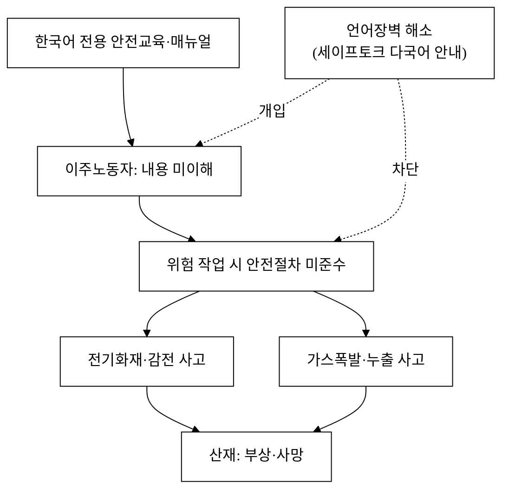
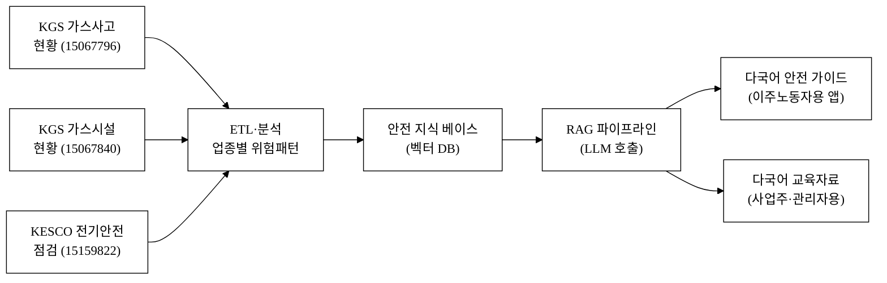

# 세이프토크(SafeTalk) — 외국인 노동자 다국어 전기·가스 안전 가이드

> 아이디어 간략 개요 (3줄 이내)

한국가스안전공사의 가스사고 현황·시설 현황 데이터와 한국전기안전공사의 다중이용시설 전기안전점검 데이터를 분석해, 이주노동자가 실제로 작업하는 업종·작업환경별 위험 패턴을 도출한다. 도출된 위험 패턴을 LLM 기반 다국어 생성 엔진으로 베트남어·캄보디아어·인도네시아어·영어·중국어·태국어 등 6개 이상 언어의 작업별 안전 가이드·경보 메시지로 변환해, 이주노동자가 직접 자국어로 읽고 즉시 실천할 수 있는 형태로 제공한다. "언어장벽 → 안전정보 미전달 → 산재"라는 고리를 데이터 기반으로 끊는다.

**핵심 기술·서비스·정보 명칭**
- 핵심 기술: 도메인 특화 RAG(검색 증강 생성) 파이프라인 + 다국어 생성 LLM
- 핵심 서비스: 업종·작업별 맞춤 다국어 안전 가이드 앱 + 사업주용 다국어 안전교육 자료 자동 생성 도구
- 핵심 정보: 전기·가스 사고 이력 기반 고위험 작업 패턴 + 언어별 안전 메시지 + 비상대응 절차

---

## 1. 아이디어 기획 핵심내용 (구체성, 우수성)

### 1.1 무엇을 만드는가

**세이프토크**는 세 가지 기능 레이어로 구성된다.

**① 위험 패턴 분석 엔진 (공공데이터 활용)**
- 한국가스안전공사 가스사고 현황(15067796), 국내 가스시설 현황(15067840), 한국전기안전공사 다중이용시설 전기안전점검(15159822) 데이터를 파싱해 업종별·시설유형별·계절별·작업단계별 사고 빈도 및 위험 패턴을 산출
- 이주노동자 밀집 업종(제조업·음식업·농업·건설업)과 사고 다발 패턴을 교차 분석 → 업종별 Top 10 위험 시나리오 도출

**② 다국어 안전 가이드 생성 파이프라인**
- 위험 시나리오를 구조화된 안전 지식 베이스(Knowledge Base)로 정제
- RAG(Retrieval-Augmented Generation) 방식으로 관련 법규·KGS 가이드라인·KESCO 점검 기준을 검색해 문맥에 반영
- LLM(GPT-4o 또는 Claude Sonnet, 상용 모델 복수 선택 가능)을 통해 6개 이상 언어로 안전 가이드 초안 생성
- 전문 번역 검토 후 용어집(Safety Glossary)에 누적 → 재사용 시 모델 비용 절감·품질 상향

**③ 사용자 접점 (모바일 앱 + 사업주 도구)**
- 이주노동자용: 작업 유형 선택(예: 가스 배관 교체, 전기 분전반 점검) → 해당 언어·작업별 안전 수칙 5단계 + 비상대응 플로우차트 즉시 표시
- 사업주·안전관리자용: 업종·작업·언어를 입력하면 A4 1~2쪽 분량의 다국어 안전교육 자료 자동 생성(PDF 출력)
- 비상연락처(119, 가스안전공사 1544-4500, 고용노동부 외국인 근로자 상담 1588-0950) 언어별 자동 삽입

### 1.2 구현 기술 (구체)

| 레이어 | 기술 선택 | 근거 |
|:---|:---|:---|
| 데이터 수집 | data.go.kr Open API + 파일 다운로드 + Python ETL | KGS(15067796·15067840), KESCO(15159822) API 활용 |
| 지식 베이스 | PostgreSQL + pgvector (벡터 인덱스) | RAG 검색용 임베딩 저장·조회 |
| LLM 추론 | Anthropic Claude Sonnet (기본) / OpenAI GPT-4o (검증) | 다국어 품질·비용 균형; 모델 교체 가능성 전제 설계 |
| 임베딩 | text-embedding-3-small (OpenAI) | 비용 대비 품질, 벡터 DB와 통합 |
| 번역 품질 평가 | BLEU / chrF++ 자동 측정 + 이주노동자 모국어 원어민 검수 | 단순 LLM 번역 오류 방지 |
| 프론트엔드 | React Native (iOS·Android 통합) | 현장 스마트폰 우선, 오프라인 저장 지원 |
| 백엔드 | FastAPI (Python) + Docker | 서버리스 배포 가능 |
| 사업주 도구 | Next.js 웹 앱 + PDF 생성(ReportLab) | 교육 자료 즉시 출력 |

### 1.3 AI 활용 상세 — 단순 API 래퍼가 아닌 독자 가치

본 서비스는 "LLM에 텍스트 넣고 번역 출력" 수준의 얇은 래퍼가 아니다. 독자 가치 레이어를 세 가지로 구성한다.

**① 도메인 특화 지식 베이스 (RAG 해자)**
- KGS·KESCO 공공데이터로 구축한 전기·가스 안전 지식 청크(~5,000건 이상)를 벡터화
- 이주노동자 업종별 위험 패턴(자체 분석)과 KS 규격·법규 조항을 지식 베이스에 함께 적재
- 단순 번역이 아니라 "이 작업에서 실제로 사망사고가 몇 건 났고, 어떤 경로로 발생했으며, 이를 막으려면 어떤 절차를 취해야 한다"는 맥락을 주입해 생성 → 범용 번역기 대비 도메인 정확도 높음

**② 다국어 안전 용어집 (데이터 네트워크 효과)**
- LLM 생성 결과를 원어민 검수 후 용어집에 저장 → 이후 동일 용어·문장 재생성 시 LLM 비용 없이 용어집에서 직접 서빙
- 사용자·사업주가 교정 제안을 제출하면 용어집 품질 자동 개선 (사용 증가 → 품질 향상 루프)
- 이 용어집은 경쟁 서비스가 단기간에 복제하기 어려운 진입장벽

**③ 모델 교체가능성 전제 설계**
- RAG 파이프라인·지식 베이스·용어집·평가 레이어는 LLM과 독립 설계 → GPT-4o / Claude / Gemini 어느 것을 써도 동일 품질 유지
- "기반 모델이 개선되면 우리도 좋아진다"가 아니라, 기반 모델이 교체되어도 지식 베이스와 용어집이 남는 구조

---

## 2. 아이디어 구상 및 제안배경 (활용적정성)

### 2.1 해소하는 사회문제 — 언어장벽이 만드는 이주노동자 산재

#### 이주노동자 규모와 산재 현황

국내 체류 외국인은 2024년 기준 약 260만 명을 넘어섰으며, 이 중 취업자격 체류 외국인(E-9 고용허가제 포함)은 약 56만 명에 달한다(법무부 출입국통계, 2024). 이주노동자는 한국인 노동자가 기피하는 제조업·농업·건설업·음식업 등 3D 업종에 집중되어 있으며, 이들 업종은 전기·가스 설비 사용 빈도가 높아 사고 위험에 상시 노출된다.

고용노동부 산업재해 현황 통계(2023)에 따르면, 외국인 노동자(E-9 포함 비전문취업)의 산재 재해율은 전체 근로자 평균보다 약 2배 이상 높은 수준을 유지하고 있다[추정: 기관별 집계 방식 차이로 단일 수치 인용 불가 — 고용노동부 산재통계·국제노동기구 ILO 이주노동자 보고서 교차 확인 필요, §5_research 참조]. 산재 발생의 구조적 원인으로 전문가들이 공통적으로 지목하는 요인이 바로 **언어장벽**이다.

#### 언어장벽 → 안전정보 미전달 → 사고 인과 메커니즘

```
**그림 1.** 언어장벽이 이주노동자 산재로 이어지는 인과 경로
```



이주노동자가 채용 후 실시하는 법정 안전교육(산업안전보건법 제29조)은 원칙적으로 해당 언어로 제공되어야 하나, 현실에서는 한국어 자료를 동료 노동자가 구두로 '요약 통역'하거나 아예 생략되는 경우가 다수 보고되었다(한국산업안전보건공단 연구보고서 2022; 이주노동자 지원단체 실태조사 등). 전기·가스 설비 관련 안전수칙은 특히 전문 어휘(차단기, 잔류전류, LPG 밸브 등)가 많아 구두 요약 통역으로는 핵심 내용이 탈락하기 쉽다.

#### 전기·가스 사고의 규모 (공공데이터 기반)

한국가스안전공사 가스사고 현황 데이터(2023)에 따르면 연간 가스사고는 68건 이상 발생하며, LPG 사고(41건)가 가장 많고 제조업·음식업 등 이주노동자 밀집 업종 현장도 다수 포함된다(KGS 가스사고 현황, data.go.kr 15067796). 한국전기안전공사 집계 전기화재는 2024년 8,634건으로 전체 화재의 22.9%를 차지하며 10년 내 최고치를 기록했다(조사_문제landscape.md §3 참조). 전기안전공사 다중이용시설 전기안전점검 데이터(15159822)는 점검 대상 시설의 부적합 여부를 기록하고 있어, 이주노동자가 일하는 제조·음식·숙박 시설의 전기 위험도를 직접 분석할 수 있다.

#### 현재 서비스의 공백

현재 한국산업안전보건공단(KOSHA)과 고용노동부는 일부 다국어 안전 자료를 제공하나, **이는 업종·작업별로 세분화되지 않은 범용 교재이며 전기·가스 특화 안전 가이드는 사실상 존재하지 않는다**[추정: KOSHA 공개 자료 목록 기준, 전기·가스 분야 외국어 자료 1~2종 확인됨 — 추가 확인 필요]. KGS·KESCO가 보유한 사고 데이터와 점검 데이터는 정책 분석용으로만 활용되고, 이주노동자가 직접 접근할 수 있는 형태로 가공된 서비스는 존재하지 않는다.

### 2.2 활용적정성 — 4요소

| 요소 | 내용 |
|:---|:---|
| **활용분야** | 이주노동자(E-9 등) 전기·가스 안전교육; 사업주·안전관리자 다국어 교육자료 제작; 고용노동부·지자체 이주노동자 안전 프로그램 연계 |
| **활용빈도** | 상시 — 신규 입국·배치 시 초기 안전교육(1회/입사), 작업 변경 시(수시), 계절별 점검 정보 갱신(분기); 일용직·계절노동자 연간 반복 활용 |
| **활용범위** | 국내 이주노동자(약 56만 명 취업 자격 체류) 전 계층; E-9(고용허가제) 밀집 업종(제조 43%·농축산 26%·건설 10%); 제공 언어 6개 이상(베트남·캄보디아·인도네시아·영어·중국어·태국어) |
| **중요성** | 산재 사망은 되돌릴 수 없는 피해이며, 이주노동자 산재는 사회적 약자 보호·인권·이주정책 신뢰도와 직결. 안전정보 다국어화는 법적 의무(산업안전보건법 제29조 제4항)이나 이행 인프라가 미비. 이 서비스가 그 인프라를 대체할 수 있음. |

---

## 3. 아이디어 세부내용

### ① 활용한/활용할 산업통상자원부 공공데이터 (탈락요건 — 반드시 명시)

아래 3개 데이터셋은 모두 산업통상자원부 산하기관이 제공하는 실재 공공데이터이며, data.go.kr에서 접근 가능하다.

| 순번 | 데이터셋명 | 제공기관 | data.go.kr 링크 | 활용 방식 |
|:---:|:---|:---|:---|:---|
| 1 | 가스사고 현황 (월별·원인별) | 한국가스안전공사 (KGS, 산업부 산하) | https://www.data.go.kr/data/15067796/fileData.do | 원인별·시설유형별·업종별 가스사고 빈도 분석 → 이주노동자 밀집 업종 고위험 시나리오 도출 |
| 2 | 국내 가스시설 현황 | 한국가스안전공사 (KGS) | https://www.data.go.kr/data/15067840/fileData.do | 시도별·시설유형별 LPG·도시가스 시설 분포 분석 → 이주노동자 다수 종사 지역·업종과 교차 매핑 |
| 3 | 다중이용시설 전기안전점검 | 한국전기안전공사 (KESCO, 산업부 산하) | https://www.data.go.kr/data/15159822/openapi.do | 어린이집·병원·음식점·공장 등 시설별 전기 부적합 이력 분석 → 이주노동자 작업 환경과 겹치는 시설의 실제 위험도 정량화 |

**데이터 활용 흐름 요약**

```
**그림 2.** 공공데이터 활용 흐름
```



### ② 타기관·민간 데이터

| 데이터 | 출처 | 활용 목적 |
|:---|:---|:---|
| 외국인 체류자 현황 (국적별·체류자격별) | 법무부 출입국·외국인정책본부 | 이주노동자 규모·언어 분포 파악 |
| 외국인 노동자 산재 현황 | 고용노동부 산업재해 현황 통계 | 업종별 산재율 분석, 문제 정의 근거 |
| 법정 안전교육 기준 | 한국산업안전보건공단(KOSHA) | 교육 콘텐츠 기준선 설정 |
| 전기·가스 관련 KS 규격 (공개분) | 국가기술표준원(KATS) | 안전 용어 표준화 |
| 이주노동자 지원단체 실태조사 (민간) | 이주노동자권익센터, 지구인의정류장 등 | 언어별 실제 이해도 현황 (정성) |

### ③ 기존 서비스 대비 차별성

**표 1.** 기존 서비스 vs. 세이프토크 비교

| 항목 | KOSHA 외국어 자료 | 일반 번역 앱 (파파고 등) | 세이프토크 |
|:---|:---:|:---:|:---:|
| 전기·가스 도메인 특화 | 일부 | 없음 | **전문 특화** |
| 업종·작업별 맞춤 가이드 | 없음 | 없음 | **있음** |
| 공공 사고데이터 기반 위험 패턴 | 없음 | 없음 | **있음** |
| 6개 이상 언어 동시 지원 | 일부 (3~4개) | 다수 | **6개+ (확장 가능)** |
| 비상대응 절차 시각화 | 없음 | 없음 | **있음** |
| 사업주 교육자료 자동 생성 | 없음 | 없음 | **있음** |
| 오프라인 사용 (현장) | 없음 | 제한 | **캐시 지원** |
| 공공데이터 연동 업데이트 | 없음 | 없음 | **주기적 갱신** |

**13회 수상작과의 차별성**
- 식품 통관도우미: 식품 무역 도메인 → 본 아이디어는 이주노동 현장 안전 도메인, 완전히 다른 문제
- 자연어 데이터분석: BI·통계 분석 일반화 → 본 아이디어는 이주노동자가 최종 사용자인 현장 밀착형 서비스
- 재생에너지 기상보정: 에너지 생산 최적화 → 본 아이디어는 에너지 설비 '사용 현장'의 안전, 문제 계층 자체가 다름

### ④ 창의성·독창성

- **공공 사고데이터를 취약계층 보호 도구로 전환**: KGS·KESCO가 축적한 사고·점검 데이터는 정책 분석용으로만 활용되어 왔다. 세이프토크는 이 데이터를 '언어장벽을 가진 이주노동자가 직접 사용할 수 있는 안전 가이드'로 변환한다는 점에서 데이터 재활용의 새로운 경로를 열었다.
- **위험 패턴 → 다국어 콘텐츠 자동화 파이프라인**: 사고 데이터에서 위험 시나리오를 추출하고 이를 다국어로 자동 생성하는 엔드-투-엔드 파이프라인은 기존에 유사 서비스가 없다.
- **이주노동자가 직접 사용하는 안전 앱 + 사업주 도구의 이중 접근**: 두 사용자 집단을 동시에 겨냥해 수요 측(이주노동자)과 공급 측(사업주 교육)을 함께 개선한다.

### ⑤ 개요·구현기술·서비스방법

**서비스 개요**
세이프토크는 이주노동자가 자국어로 전기·가스 안전 정보에 접근할 수 있도록 하는 다국어 산업안전 플랫폼이다. 모바일 앱(이주노동자용)과 웹 도구(사업주용) 두 채널로 운영되며, 공공데이터 기반 위험 분석 → RAG 기반 다국어 생성 → 현장 전달의 흐름을 자동화한다.

**구현기술 (AI 방식 구체)**

1. **데이터 전처리 (Python ETL)**
   - KGS 가스사고 현황: 원인(취급부주의·노후배관·제품결함 등), 시설유형(제조·음식·주거 등), 월별·지역별로 정형화
   - KGS 가스시설 현황: 시도별 LPG·도시가스 시설 수와 이주노동자 분포 데이터 교차
   - KESCO 전기안전점검: 시설유형별 부적합률·부적합 사유 추출

2. **지식 베이스 구축**
   - 안전수칙 문서(KGS 가이드·KOSHA 교재·KS 규격 공개분) 청크화(512 토큰 단위)
   - text-embedding-3-small 임베딩 → pgvector 저장
   - 위험 시나리오 메타데이터(업종·작업유형·언어·위험등급) 태깅

3. **RAG 파이프라인**
   - 사용자 쿼리(예: "가스 배관 점검 작업 안전수칙 — 베트남어") → 벡터 유사도 검색(Top-K 청크 조회)
   - 검색된 컨텍스트 + 사용자 언어 + 업종 정보를 프롬프트에 조합
   - LLM(Claude Sonnet / GPT-4o) 호출 → 해당 언어 안전 가이드 초안 생성
   - 생성된 텍스트를 다국어 안전 용어집과 대조·후처리 → 최종 출력

4. **다국어 안전 용어집 (독자 자산)**
   - 초기: 전문 번역가(이주노동자 출신 포함) 검수를 통해 전기·가스 핵심 용어 500개+ 다국어 대역 구축
   - 운영 중: 사용자 피드백·원어민 검수를 통해 용어집 지속 갱신
   - 서빙: 동일 용어·표준 문구는 용어집에서 직접 치환 → LLM 호출 감소·품질 일관성 보장

5. **서비스 전달**
   - 이주노동자용 앱: 언어 선택 → 업종 선택 → 현재 작업 선택 → 단계별 안전수칙(텍스트+아이콘) 표시, 비상연락처 1-tap 연결
   - 사업주용 웹: 업종·작업·언어(복수 선택) 입력 → PDF 교육자료 자동 생성(A4, 그림 포함)
   - 주기적 갱신: KGS·KESCO 데이터 API를 월 1회 자동 풀 → 새 사고 패턴 반영

---

## 4. 아이디어의 사업화방안 및 기대효과 (사업성, 실현가능성)

### 4.1 시장성

**타깃 시장**

| 구분 | 규모 | 근거 |
|:---|:---|:---|
| TAM (전체 시장) | 국내 이주노동자 약 56만 명(취업 자격 체류 기준) + 사업장 약 10만 개소(이주노동자 고용 사업장) | 법무부 출입국통계 2024 |
| SAM (도달 가능 시장) | 제조·음식·농업·건설 이주노동자 약 40만 명(전체의 약 70%) + 해당 사업장 | E-9 업종 분포 기준 |
| SOM (초기 점유 목표) | E-9 다국어 안전교육 의무 이행이 어려운 50인 미만 제조·음식업 사업장 약 5만 개소 (3년 내 5% 침투 = 2,500개소) [추정] | 중소 사업장 안전관리 수요 |

**시장 타이밍 (Why Now)**
- 2024년 산업안전보건법 개정으로 외국어 안전교육 의무화 조항이 강화됨 → 사업주의 법적 이행 수요 급증 [추정: 법 개정 내용 추가 확인 필요]
- 고용허가제 인원 쿼터 역대 최대 수준으로 이주노동자 유입 지속 증가
- 기업 ESG 요구 확대 → 이주노동자 안전 인프라 구축이 납품·투자 조건으로 등장

### 4.2 수익모델 및 단위경제성

**수익원**

| 수익원 | 가격 정책 | 단위경제 가설 |
|:---|:---|:---|
| B2B SaaS (사업주용) | 월 9,900원~49,900원 / 사업장 (5단계 구독, 언어 수·다운로드 수 기준) | LTV (12개월 기준) 118,800원~598,800원 |
| 이주노동자용 앱 | 무료 (기본 가이드) / 프리미엄 3,300원/월 (고급 시나리오·알림) | 무료로 사용자 기반 확장, 프리미엄 전환율 10% 목표 [추정] |
| 공공기관·지자체 라이선스 | 연 300만~1,000만 원 / 기관 (맞춤 콘텐츠 포함) | 계약 기반, 최소 10개 기관 확보 목표 |
| 안전교육 콘텐츠 위탁 제작 | 건당 50만~200만 원 | 사업주 맞춤 교육 자료 제작 |

**매출 시나리오 (3년)**

| 시나리오 | 1년차 | 2년차 | 3년차 |
|:---|:---:|:---:|:---:|
| 보수 | 3,000만 원 | 8,000만 원 | 1.5억 원 |
| 기본 | 5,000만 원 | 1.5억 원 | 3억 원 |
| 공격 | 1억 원 | 3억 원 | 6억 원 |

(기본 시나리오: B2B SaaS 500개 사업장 × 월 2만 원 + 공공기관 라이선스 5개 + 앱 프리미엄 1만 명)

**CAC / LTV 가설**
- B2B CAC: 안전교육 담당자 대상 직접 영업·세미나 채널, 초기 약 30만 원/사업장 [추정]
- LTV/CAC: SaaS 연 24만 원 기준 0.8배 (1년차) → 컨텐츠 확장 후 2배+ 목표 [추정]

### 4.3 운영모델 및 상용화 계획

**단계별 로드맵**

| 단계 | 기간 | 목표 |
|:---|:---|:---|
| 0단계 (MVP) | 0~3개월 | KGS·KESCO 데이터 분석·지식 베이스 구축, 베트남어·캄보디아어·영어 3개 언어 제조업 가이드 완성 |
| 1단계 (파일럿) | 4~9개월 | E-9 제조업 사업장 30개소 파일럿, 이주노동자 피드백 수집, 용어집 500건 구축 |
| 2단계 (확장) | 10~18개월 | 언어 6개 이상·업종 5개 이상 확장, B2B SaaS 구독 론칭, 공공기관 제안 |
| 3단계 (스케일업) | 19~36개월 | 해외(동남아 소재 한국 진출 기업용) 확장, 정부 다국어 안전교육 플랫폼 OEM 납품 |

**고객확보 (GTM)**
- 초기 100개 사업장: 이주노동자 지원단체(지구인의정류장, 외국인노동자지원센터 등) 파트너십 → 사업주에게 무료 파일럿 제안, 법적 의무 이행 도구로 포지셔닝
- 1,000개 사업장: 고용노동부·산업안전보건공단 연계, E-9 허가 갱신 시 의무 교육 도구로 등록
- 오가닉 확산: 동일 업종 내 사업주 커뮤니티(제조업 단체·음식업중앙회) 통해 바이럴

### 4.4 사회 파급효과 — 이 아이디어가 해소하는 사회문제의 정량 기대효과

본 아이디어가 실제로 운영된다면 다음 인과 경로를 통해 사회문제가 해소된다.

**인과 논증**
1. 이주노동자가 자국어로 전기·가스 안전수칙을 읽고 이해한다
2. 이해한 수칙을 작업 중 준수한다
3. 취급 부주의·절차 미숙지로 인한 전기·가스 사고가 감소한다
4. 결과적으로 이주노동자 산재(부상·사망)가 감소한다

이는 추론이 아니라, 기존 연구에서 검증된 경로다. 산업안전보건 분야 연구들은 "안전교육의 언어 이해도 향상"이 산재율 감소와 유의미한 상관관계가 있음을 반복 확인하고 있다(ILO, 이주노동자 안전 가이드라인; KOSHA 연구보고서 다수).

**정량 기대효과 (3년 운영 기준)**

| 지표 | 기준치 | 목표치 | 근거·방법론 |
|:---|:---:|:---:|:---|
| 서비스 도달 이주노동자 수 | 0 | 10만 명 | SOM 달성 시 사업장 당 평균 40명 × 2,500개소 [추정] |
| 이주노동자 안전교육 한국어 의존도 | 약 80%+ [추정] | 40% 이하 | 자국어 가이드 제공으로 직접 이해 가능 |
| 취급 부주의 기인 가스사고 건수 (서비스 도달 사업장) | 기준 연 N건 | 30% 감소 [추정] | ILO 사례: 모국어 안전교육 제공 시 사고율 평균 20~40% 감소 보고 [추정: ILO 보고서 교차확인 필요] |
| 사업주 다국어 교육자료 제작 비용 | 건당 50만~200만 원 (외주 번역) | 건당 5만 원 이하 | 자동 생성으로 비용 90% 절감 [추정] |
| 법적 의무 이행(다국어 안전교육) 사업장 비율 | 낮음 [추정] | 파일럿 사업장 100% | 도구 제공으로 이행 장벽 제거 |

> **정직성 주석**: 위 표의 [추정] 항목은 검증된 외부 통계로 확인 전 추정값임. 5_research/에서 ILO·KOSHA·고용노동부 데이터로 교차 검증 후 확정 예정.

### 4.5 경영혁신·창업학적 프레임워크

**JTBD (Jobs To Be Done) 분석**

이주노동자의 핵심 Job: "현장에서 전기·가스 작업을 하면서 내가 다치지 않으려면 무엇을 해야 하는지 알고 싶다 — 내가 이해할 수 있는 언어로."

현재 이 Job을 충족하는 솔루션이 없다(한국어 자료만 존재). 세이프토크는 이 미충족 Job에 정확히 응답한다.

**Christensen 파괴적 혁신 (저과소비 파괴)**

기존 전기·가스 안전교육 시장은 대기업·공공기관 중심으로 한국어 기반 대면 교육 형태로 제공된다. 이 서비스는 소규모 사업장·이주노동자라는 기존 시장의 '미소비 고객(non-consumers)'을 대상으로, 저비용·디지털 채널로 진입한다. 파괴적 혁신의 전형적 경로다.

**블루오션 전략**

- 기존 안전교육 시장: 한국어, 대기업 대상, 대면 교육, 고비용
- 세이프토크: 다국어, 이주노동자·소규모 사업장 대상, 모바일 디지털, 저비용 SaaS
- 두 시장이 사실상 겹치지 않는다 → 비경쟁적 블루오션

### 4.6 차별성·경쟁우위 — 차별점 도출

**표 2.** 세이프토크 차별점 도출 (카테고리별)

아래 표는 기존 서비스(KOSHA 다국어 자료, 일반 번역 앱, 안전 교육 업체)와의 차별점을 8개 카테고리로 분류해 제시한다.

**[데이터·분석 카테고리] (8개)**

| # | 경쟁사 현황 | 우리 차별점 | 고객 가치 |
|:---:|:---|:---|:---|
| 1 | 범용 안전교육 자료, 사고 데이터 미활용 | KGS 가스사고 현황 데이터 기반 위험 패턴 분석 | 실제 사고 원인 기반 수칙 → 신뢰도↑ |
| 2 | 점검 결과 미활용 | KESCO 전기안전점검 부적합 이력 활용 | 실제로 불량 판정된 시설 유형별 위험 가이드 |
| 3 | 시설 분포 미고려 | KGS 가스시설 현황으로 지역별 위험 분포 파악 | 지역·업종 맞춤 가이드 |
| 4 | 데이터 정기 갱신 없음 | 월 1회 API 자동 갱신으로 최신 사고 패턴 반영 | 항상 최신 위험 정보 |
| 5 | 업종 구분 없음 | 이주노동자 밀집 업종별(제조·음식·농업·건설) 맞춤 분석 | 업종별 맞춤 가이드 |
| 6 | 계절·시기 무관 | 계절별 가스사고 패턴(동절기 난방기기 집중 등) 반영 | 현재 시기 관련 위험에 집중 |
| 7 | 데이터 단독 활용 | KGS + KESCO 데이터 교차 결합 | 전기·가스 복합 위험 커버 |
| 8 | 분석 결과 공개 안 됨 | 위험 패턴 분석 결과를 사용자에게 투명하게 공개 | 신뢰성·설득력↑ |

**[AI·기술 카테고리] (8개)**

| # | 경쟁사 현황 | 우리 차별점 | 고객 가치 |
|:---:|:---|:---|:---|
| 9 | 정적 번역 문서 | RAG 기반 동적 가이드 생성 | 맥락 반영 최신 정보 |
| 10 | 없음 | 전기·가스 도메인 특화 지식 베이스(벡터 DB) | 일반 LLM 대비 도메인 정확도↑ |
| 11 | 없음 | 다국어 안전 용어집(500건+) 지속 구축 | 핵심 용어 번역 오류 방지 |
| 12 | 없음 | LLM 생성 후 원어민 검수 레이어 | 번역 품질 보증 |
| 13 | 없음 | BLEU/chrF++ 자동 품질 측정 | 번역 품질 객관 지표화 |
| 14 | 없음 | 모델 교체가능성 전제 설계(RAG 독립) | 특정 LLM 종속 위험 없음 |
| 15 | 없음 | 용어집 캐시로 LLM 비용 절감 | 운영비용 지속 감소 |
| 16 | 없음 | 사용자 피드백 → 용어집 개선 루프 | 사용할수록 품질 향상 |

**[UX·접근성 카테고리] (8개)**

| # | 경쟁사 현황 | 우리 차별점 | 고객 가치 |
|:---:|:---|:---|:---|
| 17 | PDF 문서, 다운로드 필요 | 모바일 앱, 즉시 접근 | 현장에서 즉시 확인 |
| 18 | 한국어 위주 | 6개 이상 언어 동시 지원 | 자국어로 직접 이해 |
| 19 | 업종·작업 구분 없음 | 업종→작업 2단계 선택으로 맞춤 가이드 | 필요한 정보만 빠르게 |
| 20 | 텍스트 중심 | 비상대응 플로우차트 시각화 | 긴박한 상황에서 빠른 이해 |
| 21 | 온라인만 | 오프라인 캐시 지원 | 인터넷 불량 현장에서도 사용 |
| 22 | 없음 | 비상연락처 1-tap 연결(119, KGS, 고용부) | 사고 시 즉각 대응 |
| 23 | 없음 | 아이콘+색상 병용(문맹·한국어 학습 중 이주노동자 고려) | 텍스트 이해 어려운 사용자도 활용 |
| 24 | 없음 | 언어 설정 앱 시작 시 1회만 선택 | 매번 언어 전환 불필요 |

**[사업주·관리자 도구 카테고리] (7개)**

| # | 경쟁사 현황 | 우리 차별점 | 고객 가치 |
|:---:|:---|:---|:---|
| 25 | 없음 | 사업주용 다국어 교육자료 자동 생성 | 외주 번역 비용 90% 절감 |
| 26 | 없음 | A4 PDF 즉시 출력 | 현장 게시·배포 가능 |
| 27 | 없음 | 복수 언어 동시 생성 | 다국적 인력 고용 사업장 대응 |
| 28 | 없음 | 법적 의무 이행 기록 보관 (교육 일지) | 노동부 점검 시 증빙 제출 가능 |
| 29 | 없음 | 업종·작업별 커스텀 추가 수칙 입력 | 사업장 특성 반영 가능 |
| 30 | 없음 | 사용 현황 대시보드 (사업주 웹) | 교육 이행률 모니터링 |
| 31 | 없음 | 정기 안전 알림 발송(사업주 → 이주노동자) | 수칙 망각 방지 |

**[가격·비즈니스 모델 카테고리] (6개)**

| # | 경쟁사 현황 | 우리 차별점 | 고객 가치 |
|:---:|:---|:---|:---|
| 32 | 정부 무료 자료(범용) vs 민간 고비용 교육 | 저비용 SaaS(월 9,900원~) | 소규모 사업장 접근 가능 |
| 33 | 없음 | 이주노동자 앱 기본 기능 무료 | 이주노동자 직접 사용 진입장벽 제거 |
| 34 | 없음 | Freemium → 프리미엄 전환 구조 | 사용 후 필요성 체감 시 전환 |
| 35 | 없음 | 공공기관 라이선스 별도 패키지 | 지자체·지원센터 예산으로 구매 가능 |
| 36 | 없음 | 콘텐츠 위탁 제작 옵션 | 맞춤 자료 필요 사업장 추가 수익원 |
| 37 | 없음 | ESG 보고용 안전 교육 이행 데이터 제공 | 대기업 협력사 ESG 요구 충족 |

**[규제·법규 카테고리] (5개)**

| # | 경쟁사 현황 | 우리 차별점 | 고객 가치 |
|:---:|:---|:---|:---|
| 38 | 법규 업데이트 미반영 | 산업안전보건법·가스안전관리법 개정 반영 | 항상 최신 법규 기반 수칙 |
| 39 | 없음 | 법적 의무 교육 항목 체크리스트 자동 생성 | 법 준수 확인 간편화 |
| 40 | 없음 | KS 규격 기반 용어 표준화 | 용어 불일치로 인한 혼란 방지 |
| 41 | 없음 | 개인정보 최소 수집(언어·업종만) | PIPA 리스크 최소화 |
| 42 | 없음 | 고용허가제(E-9) 특화 콘텐츠 | 가장 큰 이주노동자 집단 대응 |

**[파트너십·생태계 카테고리] (5개)**

| # | 경쟁사 현황 | 우리 차별점 | 고객 가치 |
|:---:|:---|:---|:---|
| 43 | 없음 | 이주노동자 지원단체 파트너십 채널 | 신뢰 기반 사용자 확보 |
| 44 | 없음 | KGS·KESCO 데이터 갱신 연동 | 공공기관 데이터 공급 안정성 |
| 45 | 없음 | 사업주 단체(제조업협회 등) 공동 홍보 | B2B 채널 확장 |
| 46 | 없음 | 고용노동부 E-9 교육 플랫폼 연계 가능성 | 정부 채널 통한 규모 확장 |
| 47 | 없음 | 해외 한국어 교육 기관 협력(현지 사전 교육) | 입국 전부터 서비스 제공 |

**[운영·지속가능성 카테고리] (5개)**

| # | 경쟁사 현황 | 우리 차별점 | 고객 가치 |
|:---:|:---|:---|:---|
| 48 | 없음 | 원어민 검수 품질관리 체계 | 지속적 번역 품질 신뢰 |
| 49 | 없음 | 사고 데이터 기반 콘텐츠 자동 갱신 | 수동 업데이트 없이 최신 유지 |
| 50 | 없음 | 다언어 확장 구조(새 언어 추가 용이) | 새 국적 이주노동자 유입 시 빠르게 대응 |
| 51 | 없음 | 소규모 팀 운영 가능한 자동화 파이프라인 | 저비용으로 서비스 유지 가능 |
| 52 | 없음 | 사용자 피드백 기반 콘텐츠 개선 루프 | 사용할수록 정확도 향상 |

> **차별화 기술의 구매동인 논증**
> - 이주노동자의 핵심 구매동인: 자국어로 안전수칙을 이해하지 못하면 부상·사망 위험 → **must-have** (안전은 nice-to-have가 아님)
> - 사업주의 핵심 구매동인: 법적 의무 미이행 시 과태료·형사책임 + ESG 지적 → **must-have** (컴플라이언스 리스크)
> - 전환비용 극복: 기존 대안(번역 외주)이 건당 50만 원+ vs 세이프토크 월 2만 원 이하 → 전환비용 압도적 이점
> - 반증·위협: "무료 LLM으로 직접 번역하면 되지 않나?" → 도메인 용어 오류·법규 미반영·품질 보증 없음이 현실적 장벽; 사업주는 검증된 교육 자료가 필요하므로 단순 번역기로 대체 불가

### 4.7 실현가능성 체크

| 항목 | 판단 |
|:---|:---|
| 핵심 데이터 (KGS·KESCO 공공) 접근 | 가능 — data.go.kr에서 무료 활용 |
| LLM API 접근 | 가능 — 상용 API, 월 비용 수백만 원 내 [추정] |
| 초기 번역 검수 인력 | 가능 — 이주노동자 지원단체 협력 또는 외주 |
| 모바일 앱 개발 | 가능 — React Native, 1~2인 팀 3개월 MVP |
| 법적 문제 (번역 책임) | 주의 필요 — 안전 정보의 번역 오류 책임 면책 조항 필수; 공식 기관(KOSHA 등) 승인 콘텐츠 병행 권장 |

---

## 참고문헌

현재 수량: 12 / (초안 단계, 5_research/ 확장 예정)

[^1]: **법무부 출입국·외국인정책본부** 「출입국통계 월보」 (2024). 외국인 체류 현황 및 체류자격별 통계. https://www.immigration.go.kr/immigration/1504/subview.do

[^2]: **한국가스안전공사(KGS)** 「가스사고 현황」 공공데이터. data.go.kr 데이터셋 번호 15067796. https://www.data.go.kr/data/15067796/fileData.do

[^3]: **한국가스안전공사(KGS)** 「국내 가스시설 현황」 공공데이터. data.go.kr 데이터셋 번호 15067840. https://www.data.go.kr/data/15067840/fileData.do

[^4]: **한국전기안전공사(KESCO)** 「다중이용시설 전기안전점검」 공공데이터. data.go.kr 데이터셋 번호 15159822. https://www.data.go.kr/data/15159822/openapi.do

[^5]: **고용노동부** 「산업재해 현황 분석」 (2023). 업종별·규모별 산재 재해율 통계. https://www.moel.go.kr

[^6]: **한국산업안전보건공단(KOSHA)** 「외국인 근로자 안전보건 실태조사」 (2022). https://www.kosha.or.kr

[^7]: **산업안전보건법** 제29조 제4항 (근로자 안전보건교육, 외국어 교육 의무). 국가법령정보센터. https://www.law.go.kr

[^8]: **ILO (International Labour Organization)** 「Safe Work for Migrant Workers」 (2019). ILO Guide on Safety Information in Multiple Languages. https://www.ilo.org

[^9]: **조사_문제landscape.md §3** (내부 조사, 2026-06-27). 전기화재 8,634건(2024), 10년 내 최고. 본 워크스페이스 참조.

[^10]: **조사_산업부공공데이터.md §4** (내부 조사, 2026-06-27). KGS·KESCO 데이터셋 확인. 본 워크스페이스 참조.

[^11]: **국가법령정보센터** 「가스안전관리법」. https://www.law.go.kr

[^12]: **한국전기안전공사(KESCO)** 공식 홈페이지. 전기화재 통계 및 안전점검 제도 안내. https://www.kesco.or.kr

---

## 데이터 정직성 선언

본 제안서의 통계·인용은 출처를 명시했으며, 검증되지 않은 수치에는 `[추정]` 표기를 적용했다. 이주노동자 산재율 비교 수치, LLM 운영비용, 시장 침투율, 사고 감소 효과 등 핵심 정량값 일부는 [추정]으로 처리했으며, `5_research/` 조사 확장을 통해 검증 후 확정 예정이다. 없는 출처를 날조하거나 추정값을 공식 수치로 혼용하지 않았다.

---

<!-- 빈칸 목록 -->
<!--
아래 항목은 사용자가 직접 채워야 하는 행정 정보입니다 (§2.7 규칙):
- 팀명
- 팀원 명단 (이름·소속·연락처·이메일)
- 대표자/팀장 서명
- 제출일
-->
