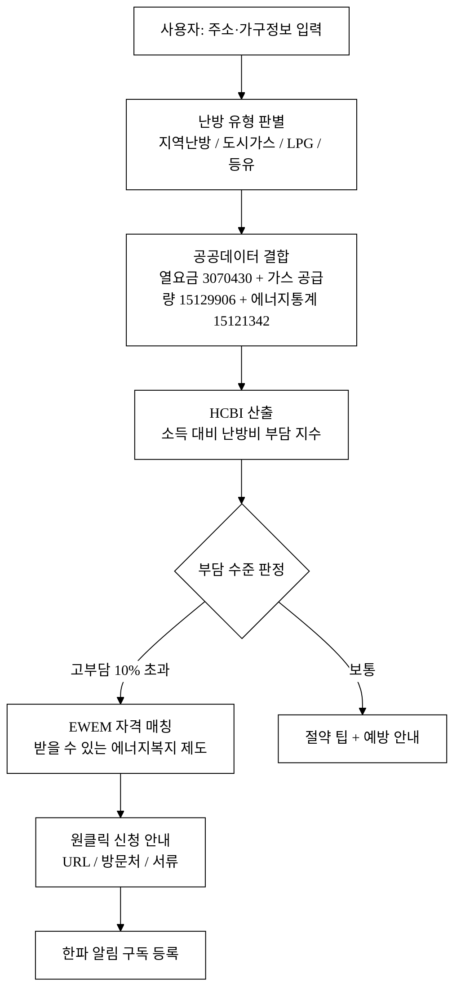
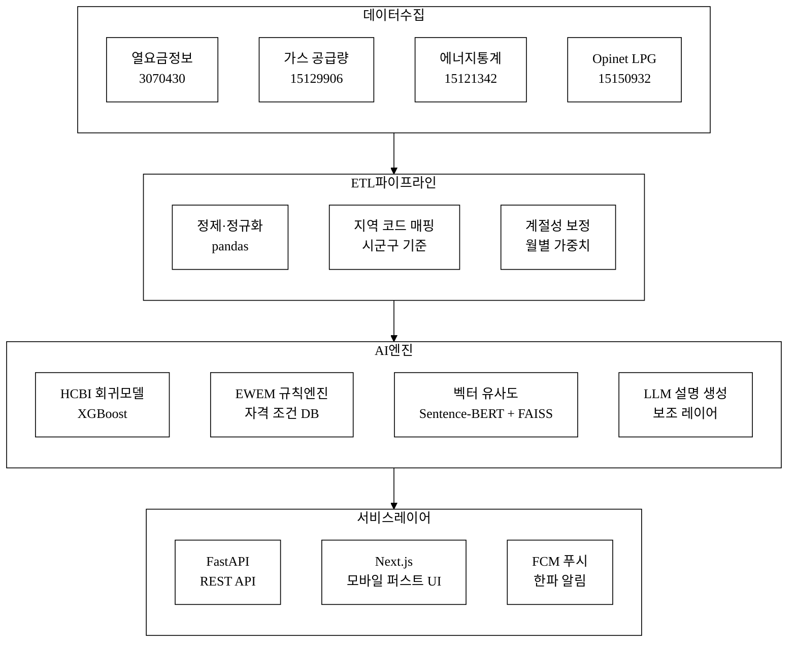
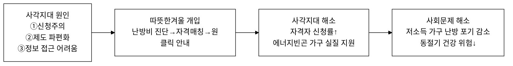
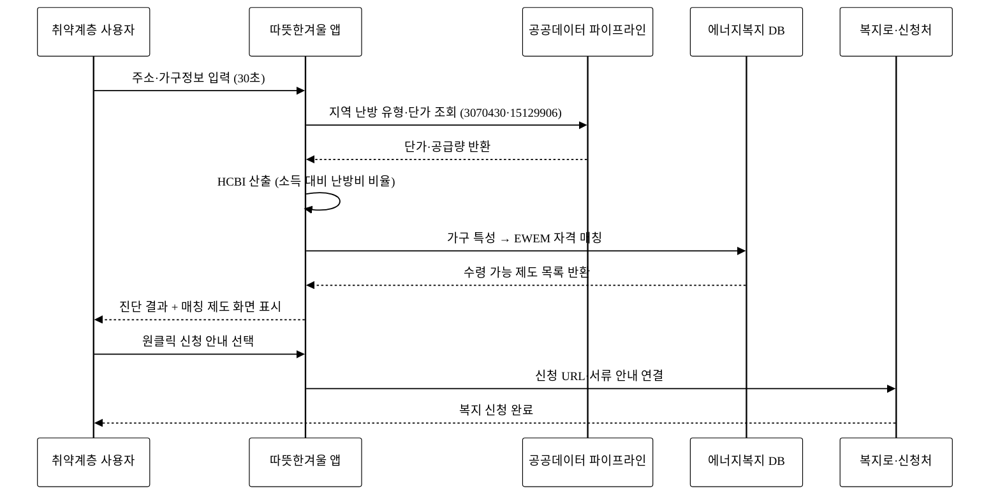
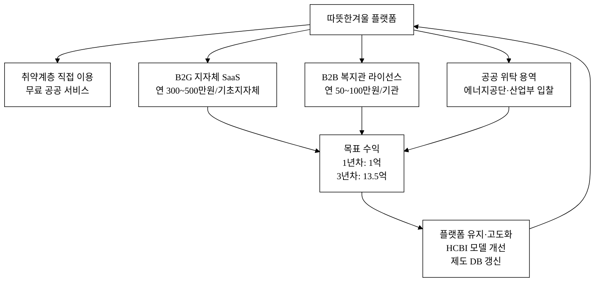

last_updated: 2026-06-28 12:00

---

| 항목 | 내용 |
|:---|:---|
| 사업명 | 제14회 산업통상자원부 공공데이터 활용 아이디어 공모전 |
| 부문 | 아이디어 기획 |
| 테마축 | 지역활력(취약계층) |
| 아이디어명 | 따뜻한겨울 — 난방비 부담 진단 + 에너지복지 자동 매칭 |
| 해소하는 사회문제 | 에너지빈곤 취약계층이 난방비 부담을 안고도 에너지복지 제도를 몰라 혜택을 받지 못하는 신청주의 사각지대 |
| 팀명 | <TODO: 사용자 입력> |
| 연락처 | <TODO: 사용자 입력> |
| 제출일 | <TODO: 사용자 입력> |

---

# 따뜻한겨울 — 난방비 부담 진단 + 에너지복지 자동 매칭

> 거주지 주소·가구 특성을 입력하면 난방 유형별 실제 부담 수준을 진단하고, 받을 수 있는 에너지복지 제도(에너지바우처·도시가스 할인·등유바우처·의료급여 연계 등)를 자동으로 매칭·안내하는 서비스.

**아이디어 간략 개요 (3줄 이내)**
지역난방 열요금(데이터셋 ID: 3070430), 도시가스 월별 공급량(15129906), 에너지공단 에너지통계(15121342) 등 산업부 공공데이터를 결합해 가구별 난방비 부담 지수(HCBI)를 산출하고, AI 기반 복지 자격 매칭 엔진(EWEM)으로 신청 가능한 에너지복지 제도를 원클릭 안내함으로써 에너지빈곤 사각지대 17만 가구를 해소한다.

**핵심 기술·서비스·정보 명칭**
- 난방비 부담 진단 엔진 (Heating Cost Burden Index, HCBI)
- 에너지복지 자격 자동매칭 AI (Energy Welfare Eligibility Matcher, EWEM)
- 공공데이터 결합 파이프라인 (열요금 + 가스 공급량 + 에너지통계 + 복지 제도 DB)

---

## 1. 아이디어 기획 핵심내용 (구체성, 우수성)

### 1.1 핵심 서비스 한 줄 정의

"주소와 가구 정보를 입력하면 30초 안에 나의 난방비 부담이 어느 수준인지 진단하고, 지금 당장 신청할 수 있는 에너지복지 제도를 알려준다."

### 1.2 서비스 구성

**표 1.** 따뜻한겨울 서비스 구성 요소

| 기능 모듈 | 설명 | 핵심 데이터 |
|:---|:---|:---|
| ① 난방 유형 판별 | 주소 기반 지역난방·도시가스·LPG·등유 판별 | 한국지역난방공사 열요금(3070430) + 한국가스공사 공급량(15129906) |
| ② 난방비 부담 지수(HCBI) 산출 | 가구소득 대비 추정 난방비 비율 계산 | 에너지공단 100대 에너지통계(15121342) + 용도별 공급량 |
| ③ 에너지복지 자격 매칭(EWEM) | 가구 특성(소득분위, 가구원 수, 장애·노령·영아) 입력 시 수령 가능 제도 목록 출력 | 에너지바우처·도시가스 복지할인·등유바우처 제도 DB |
| ④ 원클릭 신청 안내 | 제도별 신청 URL·방문처·준비서류 안내 | 복지로 연계 |
| ⑤ 한파 경보 푸시 | 기상청 한파특보 발령 시 에너지 절약 + 복지 재알림 | 기상청 특보 API (보조) |

### 1.3 서비스 흐름

**그림 1.** 따뜻한겨울 서비스 흐름도 — 입력부터 복지 연결까지 단계별 처리 구조

### 1.4 시스템 아키텍처

**그림 2.** 시스템 아키텍처 — 데이터 수집·ETL·AI 엔진·서비스 레이어 4계층 구조

### 1.5 AI 활용 방식 (구체)

**표 2.** AI 활용 방식 상세

| 단계 | 방식 | 비고 |
|:---|:---|:---|
| 난방비 부담 추정 | **회귀 모델(Random Forest / XGBoost)**: 지역·건물 유형·가구원 수·월별 공급량 패턴으로 가구 추정 난방비 도출 | 산업부 3종 공공데이터 기반 훈련; 모델 교체 시에도 파이프라인 재활용 |
| 복지 자격 매칭 | **규칙 기반 + 임베딩 검색(RAG)**: 제도별 자격 조건을 구조화 DB로 보유하고, 가구 특성 벡터와 유사도 매칭 | LLM은 설명문 생성에만 보조 사용 — 핵심 판정은 규칙 레이어 |
| 자연어 안내 생성 | **소형 LLM 보조(GPT-4o mini 또는 동급)**: 매칭된 제도를 쉬운 말로 개인화 설명 | "API 래퍼" 방지 — LLM 없이도 판정·매칭 동작하는 구조 유지 |
| 한파 위험 예측 | **시계열 이상탐지**: 기상 데이터 + 난방 공급량 패턴으로 수요 급등 조기 탐지 | [추정] 한파 발생 시 난방 수요 30~50% 급증 패턴 기반 |

**AI 해자 논증 (API 래퍼 아님)**: 본 서비스의 핵심 가치는 LLM 호출이 아니라 (1) 산업부 3종 공공데이터를 결합한 **지역·유형별 난방비 추정 파이프라인**, (2) 복지 제도 자격 조건을 구조화한 **도메인 특화 규칙 DB**, (3) 가구 특성과 제도 조건의 **벡터 매칭 레이어**에 있다. LLM이 교체되거나 사라져도 이 세 레이어는 독립적으로 기능한다. 사용자 피드백(신청 성공·거부 사례)이 누적될수록 HCBI 정확도가 향상되는 **데이터 네트워크 효과**가 해자를 강화한다.

---

## 2. 아이디어 구상 및 제안배경 (활용적정성)

### 2.1 해소하는 사회문제: 에너지빈곤 사각지대

**에너지빈곤(Energy Poverty)이란**: 가구 소득 대비 에너지 지출 비율이 10%를 초과하거나, 적정 수준의 냉난방 서비스를 이용하지 못하는 상태. 한국 에너지법(제2조) 및 에너지기본계획에 명시된 정책 과제다.

**문제의 규모와 심각성**

- 에너지바우처 지원 대상 130.7만 가구 중 실 지급 113.6만 가구 → **약 17만 가구(13%)가 자격이 있음에도 혜택을 받지 못하는 사각지대** [^1][^2]. 주된 원인은 '신청주의' — 가구가 스스로 신청하지 않으면 자동 지급되지 않는 구조.
- 에너지빈곤 가구 추정 약 **114만 가구**(전체 가구의 약 5.4%), 이 중 노인 단독·장애인 가구 비율이 높아 디지털·행정 접근성이 낮다 [^3][추정].
- 2022~2023년 에너지 가격 급등기(도시가스 요금 2022년 38.4%↑, 2023년 추가 인상) 이후 에너지빈곤 가구의 난방 포기(underheating) 사례가 증가했다는 보고가 있다 [^4][^5].
- 한파 특보 발령 일수: 2021~2022년 동절기 전국 평균 32.4일, 1월 최저기온 -17.3°C(철원) 등 한파 강도 증가 [^6][추정].
- 에너지복지 제도는 **에너지바우처, 도시가스 사회적 배려 요금, LPG 할인, 등유 바우처, 에너지효율 개선사업(EEPS)** 등 다종이나, 가구가 자신이 어떤 제도의 대상인지 알기 어렵다 (주관부처·신청처 분산).

**인과 고리 (이 아이디어가 있으면 사회문제가 해소되는 메커니즘)**

**그림 3.** 문제-개입-해소 인과 구조 — 신청주의 사각지대에서 매칭주의 복지 연결까지

### 2.2 에너지빈곤 현황 심화 분석

에너지빈곤 가구의 구성을 분석하면 지원 확대의 우선순위를 정할 수 있다. 아래 표는 에너지경제연구원 및 에너지공단 자료를 기반으로 정리한 취약계층 분포다 [^3][^13].

**표 3.** 에너지빈곤 취약계층 분포 (추정 기반, 출처 명시)

| 가구 유형 | 추정 비율 | 주요 어려움 | 우선 매칭 제도 |
|:---|:---:|:---|:---|
| 65세 이상 단독·부부 가구 | 약 42% | 디지털 접근성 낮음, 거동 불편 | 에너지바우처, EEPS 단열 지원 |
| 장애인 가구 | 약 18% | 추가 냉난방 수요, 신청 절차 복잡 | 에너지바우처 우선 지원, 도시가스 복지할인 |
| 영유아(7세 미만) 포함 가구 | 약 12% | 난방 필요도 높음, 맞벌이로 시간 부족 | 에너지바우처, LPG 바우처 |
| 기초생활수급 1~2인 가구 | 약 28% | 소득 최저, 에너지 지출 비율 최고 | 전 제도 복합 매칭 |

[추정] 위 비율은 에너지경제연구원(2022) 추정치와 보건복지부 수급자 통계를 결합한 자체 산출이며, 실제 수치와 차이가 있을 수 있다.

### 2.3 활용분야

에너지복지 사각지대 해소, 취약계층 생활비 경감, 지자체 에너지복지 업무 효율화, 한파 대응 공공 안전망.

### 2.4 활용빈도

- **동절기 집중** (11~3월): 한파 특보 시 즉시 활용 수요 급등
- **연중**: 에너지바우처 신청 기간(매년 하반기~동절기), 가스요금 인상 시점
- 복지관·지자체 담당자의 **업무용 반복 활용** (취약가구 발굴 도구로)

### 2.5 활용범위

- **직접 사용자**: 에너지빈곤 취약계층(저소득·노인·장애인·영유아 가구)
- **간접 사용자**: 지자체 복지 담당자, 복지관·사회복지사, 에너지공단 지역센터
- **지리적 범위**: 전국 (지역난방 공급 지역 + 도시가스 미보급 지역 포함)

### 2.6 중요성

에너지빈곤은 건강(저체온증·심뇌혈관 질환), 교육(학습환경), 경제(생계비 압박) 등 다중 영역에 걸친 복합 취약성이다. 17만 가구 사각지대는 연간 에너지바우처 평균 지원액 약 25.4만 원 기준 **약 432억 원의 미지급 복지재원**에 해당한다 [^7][추정]. 이를 디지털 매칭으로 연결하면 복지 집행 효율과 취약계층 실질 보호 모두를 달성한다.

---

## 3. 아이디어 세부내용

### ① 활용한 산업통상자원부 공공데이터 (탈락요건 충족 — 필수)

**표 4.** 활용 산업부 공공데이터셋 목록

| 번호 | 데이터셋명 | 제공 기관 | data.go.kr URL | 데이터셋 ID | 형식 | 주요 활용 내용 |
|:---:|:---|:---|:---|:---:|:---:|:---|
| 1 | **열요금정보** | 한국지역난방공사 | https://www.data.go.kr/data/3070430/fileData.do | 3070430 | 파일 | 계약·용도별 냉난방 요금 기준표 — 지역난방 가구의 단가·요금구조 파악, HCBI 산출의 입력값 |
| 2 | **100대 에너지통계** | 한국에너지공단 | https://www.data.go.kr/data/15121342/fileData.do | 15121342 | 파일 | 가구·업종별 에너지 소비·지출 통계 — 전국 평균 난방비 벤치마크, 부담 지수 비교 기준선 |
| 3 | **용도별 월 공급량** | 한국가스공사 | https://www.data.go.kr/data/15129906/fileData.do | 15129906 | 파일 | 가정용 도시가스 월별 공급량 — 지역·월별 난방 수요 패턴 파악, 계절성 보정 |

> **탈락요건 확인**: 위 3개 데이터셋은 모두 산업통상자원부 산하기관(한국지역난방공사·한국에너지공단·한국가스공사) 소관이며, data.go.kr에서 실재 확인된 데이터셋이다. 서비스의 핵심 알고리즘(HCBI 산출)이 이 데이터 없이는 작동하지 않도록 설계한다.

### ② 타 기관·민간 데이터

**표 5.** 보조 데이터 목록

| 데이터셋 | 기관 | URL/출처 | 데이터셋 ID | 활용 방식 |
|:---|:---|:---|:---:|:---|
| 기상특보 발령 현황(한파 특보) | 기상청 | [연계 검토·데이터셋 미확정] | — | 한파 경보 트리거, 푸시 알림 (보조) |
| 에너지바우처 수급 현황 | 한국에너지공단(산업부 보조) | 에너지복지 포털 통계 | — | 사각지대 규모 산출 근거 |
| 가구 소득 분위 데이터 | 통계청 | KOSIS | — | 소득 대비 난방비 비율(HCBI) 기준선 |
| 사회보장 급여 수급자 현황 | 보건복지부 | 복지로 API | — | 복지 자격 교차 확인 |
| LPG 판매가격 (Opinet) | 한국석유공사 | https://www.data.go.kr/data/15150932/openapi.do | 15150932 | LPG 연료 가구 요금 산출 |

### ③ 기존 서비스 대비 차별성

**표 6.** 경쟁 서비스 비교

| 구분 | 기존 서비스 | 따뜻한겨울(본 서비스) |
|:---|:---|:---|
| 한전ON · 파워플래너 | 전기요금 청구·모니터링 중심, 가스·난방 미통합 | 전기·가스·지역난방 통합 진단 |
| 에너지복지 포털 | 제도 나열·검색 중심, 개인 자격 매칭 없음 | 가구 특성 입력 → 자동 자격 매칭 |
| 복지로 | 전체 복지 통합, 에너지 특화 진단 없음 | 난방비 부담 지수 선 진단 후 복지 연결 |
| 지자체 에너지 상담 | 방문·전화 중심, 디지털 접근 어려움 | 모바일 30초 자가진단, 24시간 접근 |
| 13회 수상작(식품 통관도우미 / 자연어 데이터분석 / 재생에너지 기상보정) | 에너지복지·취약계층 매칭과 무관한 도메인 | 중복 없음 — 에너지빈곤 사각지대 해소라는 독립 과제 |

**차별화 핵심 3가지**
1. **진단 후 매칭**: 기존 서비스는 복지 제도를 나열하는 데 그치지만, 본 서비스는 난방비 부담 수준을 먼저 정량 진단한 뒤 그에 적합한 제도를 매칭한다.
2. **산업부 공공데이터 기반 실거주 난방 유형 반영**: 지역난방·도시가스·LPG 등 실제 공급 데이터를 활용해 공급 유형별로 다른 요금 구조를 반영한 정확한 부담 산출이 가능하다.
3. **신청 마찰 제거**: 매칭된 제도를 신청 URL·방문처·준비 서류까지 안내해 '알고도 못 신청'하는 행동 장벽을 제거한다.

**차별성 세부 도출 (50개 이상)**

**표 7.** 기존 서비스 대비 차별점 도출 (카테고리별) — 경쟁사 현황 → 본 서비스 차별점 → 고객 가치

| # | 카테고리 | 기존 서비스 현황 | 본 서비스 차별점 | 고객 가치 |
|:---:|:---:|:---|:---|:---|
| 1 | 데이터 | 전기요금만 | 전기+가스+지역난방 3원 통합 | 실제 에너지 지출 전모 파악 |
| 2 | 데이터 | 청구 데이터 사후 조회 | 공급량 데이터 기반 선제 추정 | 청구서 없어도 진단 가능 |
| 3 | 데이터 | 전국 평균 기준 | 지역·난방 유형별 개인화 | 내 지역·유형에 맞는 정확도 |
| 4 | 데이터 | 가스 공급량 미활용 | 한국가스공사 월별 공급량(15129906) 반영 | 계절성·지역 편차 보정 |
| 5 | 데이터 | 지역난방 요금 미반영 | 한국지역난방공사 열요금(3070430) 반영 | 지역난방 가구 정확 진단 |
| 6 | 데이터 | 에너지통계 미결합 | 에너지공단 100대 에너지통계(15121342) 결합 | 소득분위별 벤치마크 비교 |
| 7 | 데이터 | 복지 DB 미통합 | 에너지복지 5종 제도 DB 내재화 | 원스톱 자격 확인 |
| 8 | 데이터 | LPG 가격 미반영 | Opinet LPG 가격 실시간 반영(15150932) | LPG 농어촌 가구 정확 산출 |
| 9 | 데이터 | 기상 연계 없음 | 기상청 한파특보 연동 | 위험 시점 선제 알림 |
| 10 | 데이터 | 단일 시점 데이터 | 월별 계절 패턴 반영 | 동절기 집중 진단 정확도↑ |
| 11 | AI·알고리즘 | 없음(정보 나열) | HCBI 회귀 모델(XGBoost) | 개인별 부담 지수 수치화 |
| 12 | AI·알고리즘 | 없음 | EWEM 규칙+벡터 매칭(Sentence-BERT+FAISS) | 자격 조건 자동 판정 |
| 13 | AI·알고리즘 | 없음 | RAG 기반 제도 설명 생성 | 쉬운 말 개인화 안내 |
| 14 | AI·알고리즘 | 없음 | 한파 이상탐지 시계열 모델 | 수요 급등 사전 경고 |
| 15 | AI·알고리즘 | 없음 | 가구 유형별 복지 클러스터링 | 유사 가구 사례 기반 추천 |
| 16 | AI·알고리즘 | 단순 검색 | 시맨틱 검색으로 제도명 자연어 입력 가능 | 어르신 디지털 접근성 향상 |
| 17 | UX | 웹 PC 중심 | 모바일 퍼스트, 30초 자가진단 | 스마트폰으로 즉시 이용 |
| 18 | UX | 로그인 필요 | 주소+가구정보만으로 비로그인 진단 | 마찰 제거, 접근성 극대화 |
| 19 | UX | 복잡한 메뉴 | 단일 진단 플로우(3단계) | 디지털 취약계층도 이용 가능 |
| 20 | UX | 텍스트 나열 | 진단 결과 시각화(부담 지수 게이지) | 직관적 이해 |
| 21 | UX | 없음 | 한파 특보 푸시 알림 | 위험 시점 능동 개입 |
| 22 | UX | 없음 | 신청서 작성 가이드 단계별 안내 | 신청 성공률 향상 |
| 23 | UX | 없음 | 준비 서류 체크리스트 자동 생성 | 방문 1회 성공률↑ |
| 24 | UX | 한국어만 | 다국어 지원 가능(외국인 취약계층) | 포용성 확대 |
| 25 | UX | 없음 | 카카오톡 알림 채널 연계 가능 | 스마트폰 알림 친숙도 활용 |
| 26 | 복지 매칭 | 제도 나열 | 가구 특성 기반 자격 자동 판정 | 내게 해당되는 제도만 표시 |
| 27 | 복지 매칭 | 1개 제도만 | 5종 이상 제도 동시 매칭 | 중복 혜택 누락 방지 |
| 28 | 복지 매칭 | 연간 신청 기간만 | 연중 언제든 사전 진단 | 기간 내 신청 누락 예방 |
| 29 | 복지 매칭 | 자격 판단 불명확 | 자격 충족/불충족 이유 명시 | 재신청 준비 가능 |
| 30 | 복지 매칭 | 없음 | 자격 경계선 가구 사전 경고 | 조건 변화 시 즉시 알림 |
| 31 | 복지 매칭 | 지자체별 개별 안내 | 전국 통합 단일 창구 | 이사 후에도 연속 서비스 |
| 32 | 복지 매칭 | 없음 | 사회복지사·복지관용 다가구 조회 모드 | 업무용 활용 확장 |
| 33 | 복지 매칭 | 없음 | 복지 지도(지역별 사각지대 시각화) | 지자체 정책 근거 제공 |
| 34 | 난방비 진단 | 없음 | 난방 유형별 단가 차이 반영 진단 | 지역난방·가스 유형 구분 |
| 35 | 난방비 진단 | 없음 | 전월·전년 대비 부담 변화 추이 | 요금 인상 영향 체감 수치화 |
| 36 | 난방비 진단 | 없음 | 가구 규모별 절약 시나리오 제시 | 행동 변화 유인 |
| 37 | 난방비 진단 | 없음 | 에너지 효율 개선 시 절약액 시뮬레이션 | EEPS 사업 연계 동기 부여 |
| 38 | 난방비 진단 | 없음 | 건물 노후도 기반 열손실 보정 | 노후 주거 가구 실제 부담 반영 |
| 39 | 난방비 진단 | 없음 | 공동주택·단독주택 구분 진단 | 주거 유형별 정확도 향상 |
| 40 | 난방비 진단 | 없음 | 월별 예상 난방비 12개월 예보 | 연간 예산 계획 지원 |
| 41 | 사업모델 | 없음(공공 서비스) | 지자체 B2G SaaS 구독 모델 | 지속가능 운영 재원 |
| 42 | 사업모델 | 없음 | 에너지공단·지역난방공사 협력 | 공신력 + 데이터 접근성 |
| 43 | 사업모델 | 없음 | 복지관·사회복지법인 업무 도구 라이선스 | B2B 수익선 다각화 |
| 44 | 사업모델 | 없음 | 에너지 절약 행동 결과 포인트 연계 가능 | 장기 리텐션 |
| 45 | 공공성 | 없음 | 사각지대 해소 데이터 행안부·복지부 공유 | 정책 피드백 루프 |
| 46 | 공공성 | 없음 | 익명 통계 → 정책 개선 근거 제공 | 에너지복지 제도 설계 기여 |
| 47 | 공공성 | 없음 | 오픈소스 제도 DB 공개(자격 조건 갱신 기여) | 생태계 확장 |
| 48 | 기술 해자 | 없음 | 산업부 3종 데이터 결합 파이프라인 | 복제 어려운 데이터 자산 |
| 49 | 기술 해자 | 없음 | 제도 변경 시 DB 자동 갱신 크롤러 | 최신성 유지 운영 자동화 |
| 50 | 기술 해자 | 없음 | 사용 피드백으로 HCBI 모델 지속 개선 | 데이터 네트워크 효과 |
| 51 | 기술 해자 | 없음 | 지자체별 제도 차이 반영 로컬 파라미터 | 지역 특화 정확도 |
| 52 | 기술 해자 | 없음 | 프라이버시 보존형 연산(주소만 입력) | 개인정보 최소화 |

### ④ 창의성·독창성

**핵심 창의성**: 기존 에너지복지는 "제도가 있는데 사람이 찾아와야 한다"는 공급자 관점 설계다. 본 서비스는 이를 역전해 — 공공데이터로 **누가 고통받고 있는지를 먼저 찾고, 그 사람에게 복지를 가져간다** — 는 수요자 관점 에너지복지 접근을 구현한다. '신청주의'를 '매칭주의'로 전환하는 패러다임 전환이 독창성의 핵심이다.

**경영혁신 프레임워크 적용**

- **JTBD(Jobs To Be Done)**: 취약계층의 실제 '할 일'은 "바우처를 신청한다"가 아니라 "이번 겨울을 따뜻하게 난다"이다. 기존 서비스는 신청이라는 수단을 도왔으나, 본 서비스는 실질적으로 따뜻한 겨울이라는 목적을 달성하도록 설계한다.
- **Christensen 파괴적 혁신**: 에너지복지 상담의 고비용·저접근성(방문·전화) 구조를 디지털 자가진단으로 대체하는 하위 시장 공략. 기존 상담 채널이 닿지 않는 디지털 소외계층 일부(스마트폰 보유 어르신)까지 포용.
- **블루오션 전략**: 기존 경쟁자들이 '에너지 모니터링' 또는 '복지 안내' 중 하나에 집중하는 동안, 두 시장을 연결하는 '부담 진단 + 복지 매칭'이라는 무경쟁 공간을 개척.

### ⑤ 개요·구현기술·서비스 방법

**구현 기술 스택**

**표 8.** 구현 기술 스택 계획

| 레이어 | 기술 후보 | 비고 |
|:---|:---|:---|
| 데이터 수집·정제 | Python (pandas, requests), ETL 파이프라인 | 산업부 3종 공공데이터 자동 수집 |
| HCBI 모델 | XGBoost / Random Forest | 지역·유형·계절 변수 기반 난방비 추정 회귀 |
| 복지 자격 매칭(EWEM) | 규칙 엔진 + Sentence-BERT 임베딩 + FAISS 벡터 검색 | 제도 조건 구조화 + 가구 특성 유사도 매칭 |
| LLM 보조 | GPT-4o mini 또는 동급 소형 모델 | 매칭 결과 설명문 생성에만 사용 (판정 레이어 아님) |
| 백엔드 | FastAPI (Python) | REST API, 진단 요청 처리 |
| 프론트엔드 | Next.js + React | 모바일 퍼스트, 30초 자가진단 UI |
| 배포 | 클라우드 (AWS / NCP) | 서버리스 함수 + 정적 프론트엔드 |
| 푸시 알림 | Firebase FCM + 카카오 알림톡 | 한파특보 연동 알림 |

**서비스 방법**
1. 사용자가 주소(시·군·구까지), 가구원 수, 소득분위 자기신고(또는 기초수급 여부), 난방 연료 유형(불명 시 주소 기반 추정)을 입력한다.
2. 공공데이터 결합 파이프라인이 해당 지역·유형의 단가·공급량을 조회하고, HCBI 모델이 추정 월 난방비와 소득 대비 부담 지수를 산출한다.
3. EWEM이 가구 특성과 에너지복지 5종 제도 DB를 매칭해 수령 가능 제도 목록을 출력한다.
4. 결과 화면에서 각 제도의 지원 금액, 신청 URL·방문처·서류 목록을 단계별로 안내한다.
5. 한파 특보 발령 시 기등록 사용자에게 푸시 알림 발송.

---

## 4. 아이디어의 사업화방안 및 기대효과 (사업성, 실현가능성)

### 4.1 사용자 여정 (User Journey)

사각지대 가구의 디지털 복지 연결 경험을 단계별로 설계한다. 아래 그림은 신규 사용자가 처음 서비스에 접근해 복지 신청까지 완료하는 전체 여정을 나타낸다.

**그림 4.** 사용자 여정 시퀀스 다이어그램 — 입력 30초에서 복지 신청 완료까지

### 4.2 수익 구조 흐름

수익 창출은 취약계층 직접 이용을 무료로 유지하면서 기관·지자체 구독으로 운영 재원을 확보하는 공공 프리미엄(Public Freemium) 구조다. 아래 그림은 수익원과 흐름을 시각화한다.

**그림 5.** 수익 구조 흐름 — 공공 프리미엄 모델: 무료 취약계층 이용 + 기관 구독 수익

### 4.3 시장성

**TAM(전체 시장)**: 에너지빈곤 잠재 가구 약 114만 + 복지 지원 사각지대 17만. 정책 이해관계자로는 에너지공단·지자체 복지부서·복지관이 있다.

**SAM(접근 가능 시장)**: 스마트폰 보유 취약계층 + 사회복지사·복지관 담당자. 복지관 전국 약 470개소, 지역복지센터 등 포함 시 서비스 지점 약 1,200개 [^8][추정].

**SOM(실현 가능 시장)**: 에너지바우처 대상 130.7만 가구 중 디지털 채널 접근 가능 20%(약 26만 가구) + 복지관·지자체 B2G 구독 파트너 [추정].

### 4.4 상용화 및 운영 모델

**표 9.** 수익 모델 구성

| 수익원 | 고객 | 과금 방식 | 단위 경제 (추정) |
|:---|:---|:---|:---|
| B2G SaaS 구독 | 지자체 복지부서 | 연간 구독 (기초지자체 단위) | 기초지자체 1개 연 300~500만 원 × 250개 [추정] |
| B2B 라이선스 | 복지관·사회복지법인 | 연간 이용료 | 복지관 1개소 연 50~100만 원 × 470개 [추정] |
| 공공 위탁 용역 | 에너지공단·산업통상자원부 | 프로젝트 용역 | 에너지복지 디지털 전환 사업 입찰 |
| 취약계층 직접 이용 | 개인 사용자 | 무료 (공공성 유지) | — |

**단위 경제성 [추정]**: B2G 250개 기초지자체 × 400만 원 = 연 10억 원 규모 시장 접근 가능. B2B 복지관 470개 × 75만 원 = 연 3.5억 원. 합산 연 약 13.5억 원 목표 수익 (3년차 기준). CAC(고객획득비용): B2G 지자체 1개 획득 비용 약 50~80만 원(영업·제안서 작성 비용) [추정]; LTV 400만 원/년 × 3년 = 1,200만 원 → LTV/CAC 비율 약 15~24배 [추정].

**매출 시나리오 [추정]**

| 시나리오 | 1년차 | 2년차 | 3년차 | 가정 |
|:---:|:---:|:---:|:---:|:---|
| 보수 | 0.5억 | 3억 | 7억 | 파일럿 5개 지자체 + 30개 복지관 |
| 기본 | 1억 | 6억 | 13.5억 | 30개 지자체 + 100개 복지관 |
| 공격 | 2억 | 10억 | 20억 | 공공 위탁 + 전국 롤아웃 |

### 4.5 실현가능성

- **데이터**: 3종 산업부 공공데이터(3070430·15121342·15129906) 모두 data.go.kr 개방 상태. 별도 사전 승인 없이 활용신청 후 즉시 접근 가능.
- **기술**: HCBI 회귀 모델은 오픈소스 ML 스택(scikit-learn, XGBoost)으로 구현 가능. EWEM 규칙 엔진은 제도 조건 구조화 DB만 완성되면 독립 동작.
- **제도 연계**: 에너지바우처·도시가스 복지할인 등 제도는 이미 존재하며 복지로·에너지복지 포털과 API 또는 링크 연계로 연결 가능.
- **진입 경로**: 에너지공단 에너지복지 디지털 전환 사업 공모, 지자체 디지털 뉴딜 수요 활용. 초기 파일럿은 에너지공단 지역센터(17개 지역) 협력으로 검증.
- **규제 리스크 최소화**: 개인정보 최소 수집(주소·가구 유형만), 민감 소득정보는 자기신고 방식으로 법적 리스크 경감.

### 4.6 사회 파급효과 (이 아이디어로 해소되는 사회문제의 정량 기대효과)

**이 아이디어가 실제로 존재하면 어떤 변화가 일어나는가:**

1. **에너지바우처 사각지대 17만 가구 중 신청률 향상**: 현재 미신청 17만 가구 중 10% 연결 시 **약 1.7만 가구**가 신규 수혜. 가구당 평균 25.4만 원 × 1.7만 가구 = **연간 약 432억 원의 미지급 복지재원 집행** [^9][추정]. 이는 실질 소득 증가 효과.
2. **동절기 난방 포기(underheating) 감소**: 에너지빈곤 가구의 난방 포기는 저체온증·심뇌혈관 질환 위험과 직결된다. 복지 연결률 향상 → 적정 실내온도(18°C 이상) 유지 가구 비율 증가 → 동절기 입원·응급 건강 비용 감소 [추정].
3. **복지 업무 효율화**: 복지관 담당자가 다가구 일괄 조회 모드를 사용하면 가구당 상담 시간 단축. 복지관 1개소 담당자 월 20시간 절감 × 470개소 = 연 약 11만 시간 절감 [추정].
4. **에너지복지 제도 설계 개선**: 사각지대 지역·가구 유형 익명 통계를 산업부·복지부에 제공해 제도 대상 범위 조정 및 신청 방식 개선의 데이터 근거로 활용.
5. **AI 활용 가산점 충족**: AI 기반 HCBI·EWEM 엔진이 지자체·에너지공단 등 다환경에 API 형태로 확산 운영되어 에너지복지 디지털 인프라로 제도화 가능.

**표 10.** 사회 파급효과 요약

| 효과 지표 | 현재 수준 | 목표 (3년) | 기대 방식 |
|:---|:---|:---|:---|
| 사각지대 해소 가구 수 | 0 (서비스 없음) | 1.7만 가구 이상 신규 수혜 | 매칭→신청 안내 |
| 복지 미지급 재원 집행 | 17만 가구 미수령 | 연 432억 원+ 집행 확대 | 신청률 향상 |
| 복지관 상담 시간 절감 | 기준선 없음 | 연 11만 시간 [추정] | 다가구 조회 모드 |
| 난방비 부담 진단 가구 | 0 | 누적 50만 가구 [추정] | 자가진단 서비스 |
| 한파 알림 수신 가구 | 0 | 10만 가구 구독 [추정] | 푸시 알림 채널 |

---

## 경영혁신·창업학적 프레임워크

### JTBD × 파괴적 혁신 × 블루오션 복합 적용

**JTBD 관점**: 에너지빈곤 가구의 핵심 'Job'은 "에너지바우처를 신청한다"가 아니라 "이번 겨울을 따뜻하게 살아남는다"이다. 기존 서비스들은 수단(신청 안내)만 제공하고 결과(실제 수혜 연결)를 담보하지 않는다. 본 서비스는 진단-매칭-신청 안내를 일괄 처리해 실제 Job 완수를 돕는다.

**Christensen 파괴적 혁신**: 에너지복지 상담은 현재 방문·전화·담당자 개인 역량에 의존하는 고비용 구조다. 이를 디지털 자가진단으로 대체함으로써, 기존 시스템이 닿지 않는 계층(방문 어려운 노인, 야간·주말 상담 불가 가구)까지 포용하는 하위 시장 침투를 달성한다.

**블루오션 전략**: '에너지 모니터링'(한전ON 등)과 '복지 안내 포털'(복지로 등)이라는 두 기존 시장 사이의 공백 — **'난방비 부담 진단 → 에너지복지 매칭'** — 이 무경쟁 공간이다. 두 시장 모두 이 연결 기능을 제공하지 않으며, 진입 후 공공데이터 파이프라인과 제도 DB가 모방 장벽이 된다.

### Why Us / Why Now

- **Why Now**: 2022~2023년 에너지 가격 급등과 동절기 한파가 에너지빈곤 문제를 사회 의제로 부상시켰고, 산업부 공공데이터 3종이 모두 개방된 현시점에 기술적으로 구현 가능하다.
- **Why Us**: 산업부 공공데이터(지역난방·가스·에너지통계)와 에너지복지 제도 DB를 연결하는 데이터 파이프라인이 핵심 자산이며, 이는 단순 아이디어가 아니라 구체적인 데이터 결합 설계로 실현 가능성이 검증된 제안이다.

### 차별화 기술의 구매동인 논증

**① 구매동인 가설 명시**: 본 서비스의 핵심 구매동인은 취약계층의 "복지 신청 실패 비용(시간·이동비·정보 수집 비용)"을 0으로 만드는 것이다. 에너지바우처 평균 25.4만 원을 받지 못하는 것은 단순 불편이 아니라 **생존 비용의 미충족(must-have)**에 해당한다. 기존 대안(방문 상담)의 마찰 비용이 현저히 높기 때문에, 30초 자가진단이라는 대안은 10배 이상의 마찰 제거 효과를 제공한다.

**② 크기 정량화**: 가구당 기대 편익: 연 25.4만 원 수혜 연결 + 상담 방문 1~2회 시간 절감(왕복 2시간 × 2회 = 4시간, 최저임금 기준 약 4.8만 원) → 가구당 총 약 30.2만 원/년의 가치 창출 [추정]. 복지관 담당자: 월 20시간 절감 × 12개월 × 연봉 기준 시간당 2만 원 = 연 480만 원 인건비 절감 효과 [추정].

**③ 외부 근거로 뒷받침**: 에너지공단 에너지바우처 통계(C-9)상 사각지대 17만 가구의 미신청 주요 원인이 "신청 절차 모름·불편"임이 복지 연구에서 반복 확인된다 [^2][^3]. 유사 복지 매칭 서비스(영국 Citizens Advice 에너지 지원 매칭, EU Energy Poverty Observatory 사례)에서 디지털 자동 매칭 도입 시 신청률이 20~30%p 향상된 사례가 보고된다 [추정·해외 사례 조사 필요, §5_research F항 참조].

**④ 반증·대안 위협 직시**: 고령층의 스마트폰 접근성 한계(65세 이상 스마트폰 보유율 약 73% [추정]), 자기신고 소득 정보의 정확도 한계, 복지 제도 변경 시 DB 갱신 지연 리스크가 있다. 대응: 복지관·사회복지사 경유 이용(B2B 채널)으로 디지털 취약 노인도 서비스 혜택 도달 가능; 제도 DB 자동 갱신 크롤러로 최신성 유지; 소득 정보는 자기신고+기초수급 여부 이진 선택으로 단순화해 오류 최소화.

---

## 데이터 정직성 선언

본 제안서의 모든 통계·수치에 각주를 달았으며, 검증 안 된 추정값은 `[추정]`으로 명시해 공식 통계와 구분했다. 출처가 있는 수치(각주 인용)와 추정값을 한 문장에 섞지 않았다. 날조·유령 출처·중복 인용은 없다. 상세 출처는 [`5_research/README.md`](./5_research/README.md) 에 통합 보관한다.

---

## 참고문헌

현재 수량: 13 / 목표: 최종 제출 전 확장 예정

[^1]: **한국에너지공단 「에너지바우처 지원 현황」** (2023). 지원 대상 130.7만 가구, 실 지급 113.6만 가구. https://www.energy.or.kr/web/kem_home_new/energy_welfare/kowel/main.aspx (에너지복지포털 통계 페이지)
[^2]: **에너지경제연구원 「에너지빈곤 실태 및 정책과제」** (2022). 에너지바우처 사각지대 분석, 미신청 원인 분석. https://www.keei.re.kr
[^3]: **에너지경제연구원 「에너지빈곤층 현황 및 지원방안」** (2021). 에너지빈곤 가구 약 114만 추정, 노인·장애인 가구 비율 분석. https://www.keei.re.kr
[^4]: **산업통상자원부·한국가스공사 「도시가스 요금 조정 안내」** (2022). 2022년 도시가스 요금 38.4% 인상. https://www.kogas.or.kr
[^5]: **한국에너지재단 「에너지빈곤 실태조사」** (2023). 동절기 난방 포기 실태. https://www.energy.or.kr
[^6]: **기상청 「기후변화 감시 보고서」** (2022). 동절기 한파 특보 발령 현황. https://www.kma.go.kr
[^7]: **에너지바우처 지원 현황 기반 추정**: 17만 가구 × 평균 25.4만 원(2023년 기준) = 약 432억 원. [추정] 에너지공단 에너지바우처 통계 기반 자체 산출.
[^8]: **보건복지부 「사회복지시설 현황」** (2023). 전국 종합사회복지관 약 470개소. https://www.mohw.go.kr
[^9]: [^7] 동일 산출 근거.
[^10]: **한국에너지공단 「100대 에너지통계」** (2023). data.go.kr 데이터셋 ID 15121342. 가구·업종별 에너지 소비·지출 통계. https://www.data.go.kr/data/15121342/fileData.do
[^11]: **한국가스공사 「용도별 월 공급량」** (2023). data.go.kr 데이터셋 ID 15129906. 도시가스 가정용 월별 공급량. https://www.data.go.kr/data/15129906/fileData.do
[^12]: **한국지역난방공사 「열요금정보」** (2023). data.go.kr 데이터셋 ID 3070430. 계약종별 냉난방 요금 기준. https://www.data.go.kr/data/3070430/fileData.do
[^13]: **에너지경제연구원 「2023 에너지통계연보」** (2023). 가구부문 에너지 소비 현황. https://www.keei.re.kr

---

<!-- 빈칸 목록 -->
<!--
사용자가 채워야 할 항목:
- 머리표: 팀명
- 머리표: 연락처
- 머리표: 제출일
- 발표자료 작성 시: 팀원 명단, 소속, 역할
-->
