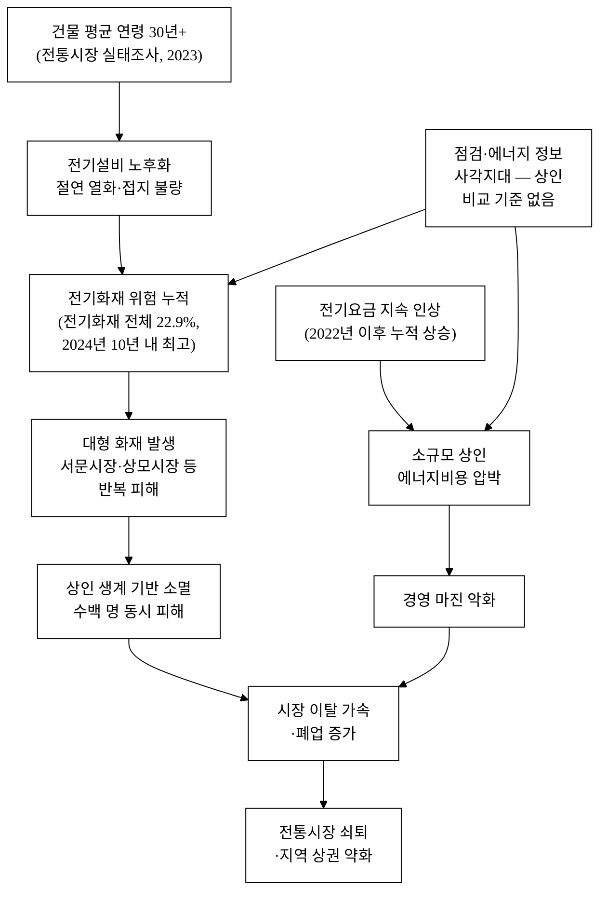
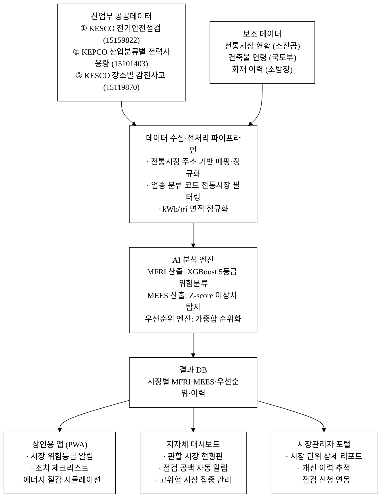
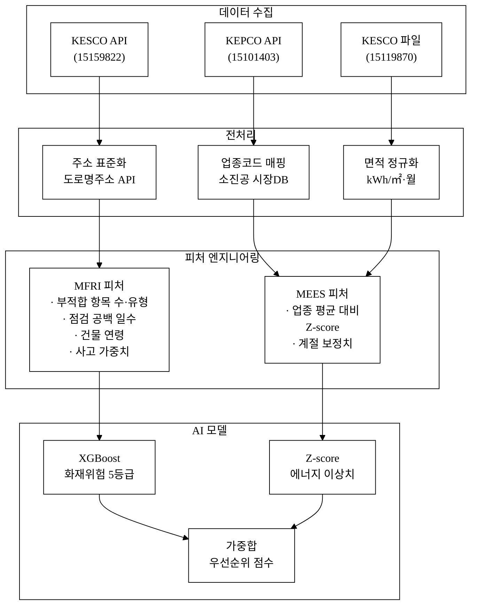
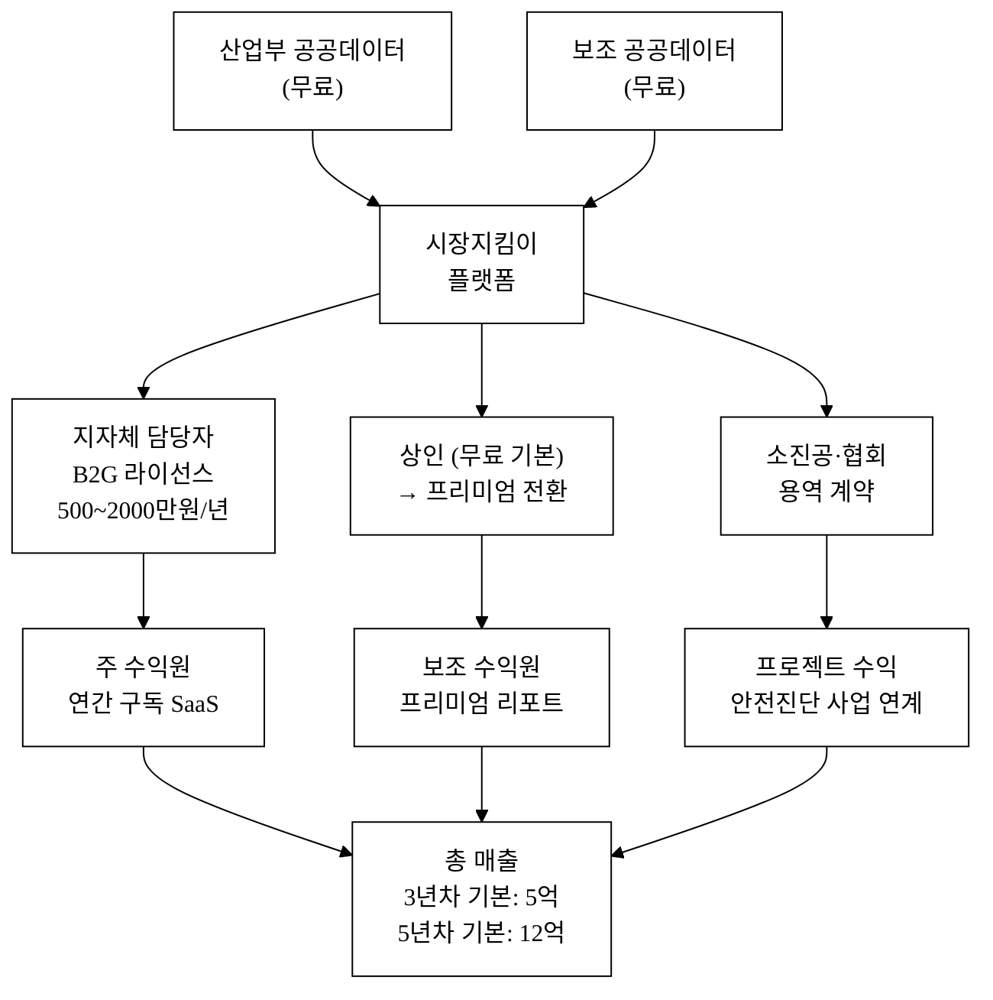
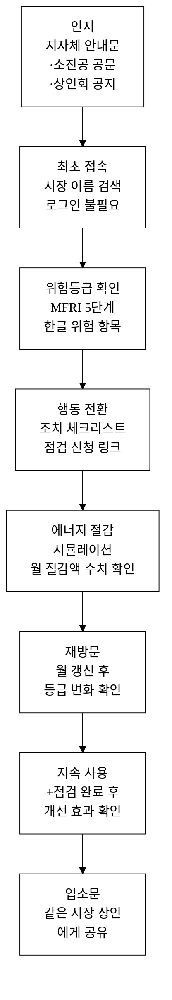
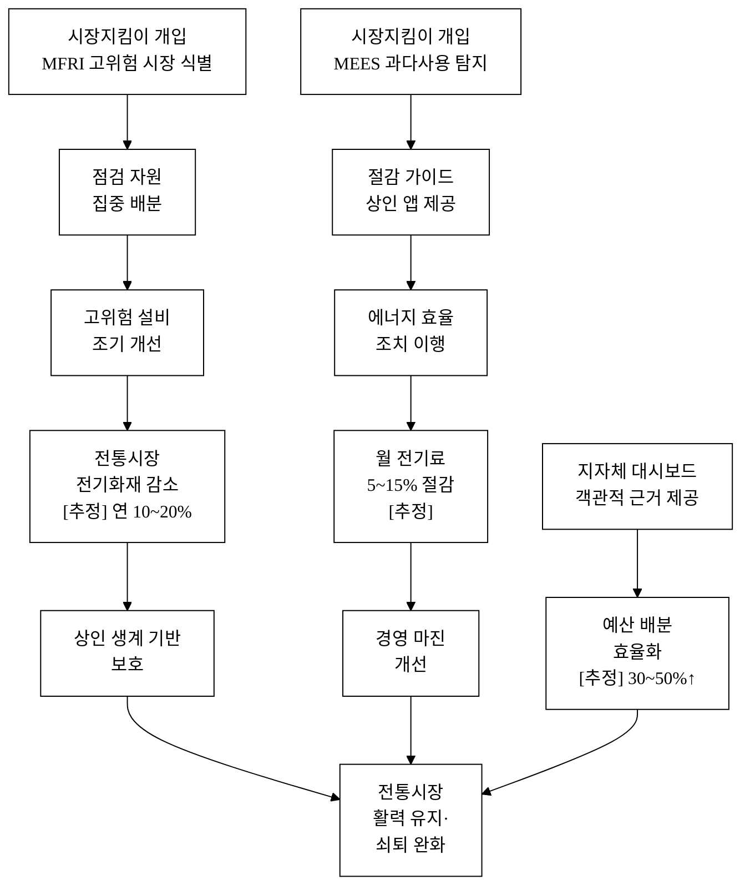
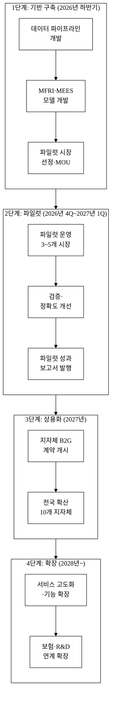

# 시장지킴이 — 전통시장 전기안전+에너지효율 통합 케어

> **아이디어 간략 개요 (3줄 이내)**
> 한국전기안전공사 다중이용시설 전기안전점검 데이터(15159822)·한국전력 산업분류별 전력사용량 데이터(15101403)·장소별 감전사고 현황 데이터(15119870)를 전통시장 주소 기준으로 통합 결합하여, 시장별 전기안전 위험지수(MFRI)와 에너지비효율 지수(MEES)를 AI로 산출한다. 화재예방 점검 우선순위와 에너지절감 가이드를 상인 앱·지자체 대시보드로 제공함으로써, 전국 약 1,400개 전통시장의 반복 화재와 상인 에너지비용 과부담 문제를 동시에 해소하는 산업부 공공데이터 기반 통합 케어 서비스다.

**핵심 기술·서비스·정보 명칭**
- 전통시장 전기안전 위험지수 (Market Fire Risk Index, MFRI)
- 전통시장 에너지비효율 지수 (Market Energy Efficiency Score, MEES)
- AI 기반 점검 우선순위 엔진 (Priority Triage Engine)
- 상인 대상 맞춤형 경보·개선 가이드 앱 (시장지킴이 앱)
- 지자체·관리기관 대상 시장 안전 대시보드

---

## 1. 아이디어 기획 핵심내용 (구체성, 우수성)

### 1.1 무엇을 만드는가

"시장지킴이"는 전통시장을 단위로 세 가지 산업통상자원부 공공데이터를 통합 분석해 **화재 예방**과 **에너지비용 절감**을 동시에 달성하는 데이터 기반 케어 플랫폼이다. 구체적으로 다음 세 가지 핵심 기능으로 구성된다.

**① 전기안전 위험지수(MFRI) 산출 및 경보**

한국전기안전공사 다중이용시설 전기안전점검 데이터(데이터셋 ID: 15159822)와 장소별 감전사고 현황 데이터(15119870)를 전통시장 주소·행정구역 기준으로 결합한다. XGBoost 기반 분류 모델이 시장별 화재 위험 등급을 5단계(매우 낮음·낮음·보통·높음·매우 높음)로 산출하며, 부적합 점검항목 패턴(절연저항 불량, 과부하 보호 미설치, 접지 불량 등)을 근거로 "어떤 설비를 먼저 교체해야 하는가"의 우선순위를 자동 생성한다. 상인 앱에는 시장 단위 위험등급과 필수 조치 항목이 비전문가도 즉시 이해할 수 있는 한글 평문으로 제시된다.

**② 에너지비효율 지수(MEES) 산출 및 절감 가이드**

한국전력 산업분류별 전력사용량 데이터(15101403)를 전통시장 업종 구성(소매업·음식업 혼합)에 맞게 kWh/㎡·월 단위로 정규화하고, 동종 업종·규모 대비 전력사용량 Z-score 1.5 표준편차 초과 시장을 에너지 비효율 구간으로 분류한다. 해당 시장·점포에 LED 교체·대기전력 차단·냉방 효율화 등 절감 조치 우선순위와 함께 에너지비용 절감 시뮬레이션(조치 후 월 절감액 예상치)을 구체적 수치로 제시한다.

**③ 통합 대시보드(지자체·시장관리자용)**

관할 전통시장 목록별 MFRI·MEES 현황을 한 화면에서 확인하고, 점검 공백 시장(마지막 점검 1년 초과)을 자동 탐지하여 점검 일정을 제안한다. 화재 위험이 급상승한 시장은 재계산 후 즉시 자동 알림으로 담당자에게 전달된다.

### 1.2 왜 이 아이디어가 우수한가

**기존 접근의 단절 극복**: 전기안전 점검(안전 목적)과 에너지 효율 관리(비용 목적)는 현재 완전히 별개 채널로 운영된다. 전기안전공사는 안전점검을 하되 에너지비용 절감 안내를 하지 않고, 한전의 에너지 데이터는 청구 중심으로 화재위험과 연결되지 않는다. 시장지킴이는 이 두 데이터를 **하나의 파이프라인**으로 처음 통합한다.

**시장 단위 특화**: 전통시장은 복수 점포가 하나의 공용 전기 계통을 공유하는 구조다. 개별 점포 수준이 아니라 **시장 단위**로 집계·분석하는 것이 실질적 화재예방에 필요한 접근이며, 기존 공공 서비스에는 이 단위가 없다.

**예방적 AI 활용(API 래퍼가 아닌 독자 도메인 엔진)**: 기존 점검은 방문 후 결과를 기록하는 사후 방식이다. 시장지킴이는 누적 점검 이력과 감전사고 데이터를 학습한 XGBoost 분류 모델로 방문 전에 위험을 예측하고, 전통시장 주소 기반 데이터 매핑 로직·MFRI·MEES 피처 엔지니어링이라는 독자 도메인 자산 위에서 동작한다. 외부 LLM API를 호출하는 얇은 래퍼와는 근본적으로 다른 구조다.

---

## 2. 아이디어 구상 및 제안배경 (활용적정성)

### 2.1 해소하는 사회문제: 전통시장 화재와 상인 경영난의 이중 위기

**전통시장 화재는 반복적이고 피해 규모가 크다.**

전통시장 화재는 단순한 건물 화재가 아니라 수백 명 상인의 생계 기반을 한순간에 소멸시키는 재난이다.

- 소방청 화재통계에 따르면 2024년 기준 전기화재는 전체 화재의 22.9%(8,634건)로, 10년 내 최고치를 기록했다[^1]. 전통시장과 같은 노후 다중이용시설은 전기화재 위험에 특히 취약하다.
- 중소벤처기업부·소상공인시장진흥공단 「전통시장 및 상점가 실태조사」(2023)에 따르면 전국 전통시장의 건물 평균 연령은 30년 이상이며, 전기설비 교체 주기가 도래한 시장이 다수 존재한다[^2]. 건물 노후화는 절연 열화·접지 불량으로 이어져 전기화재의 직접 원인이 된다.
- 2023년 대구 서문시장, 2022년 구미 상모시장, 2020년 인천 중앙시장 화재 등 대형 전통시장 화재가 반복되고 있으며, 1건당 직접 피해액이 수십억 원을 초과하는 사례가 다수다[^3]. 상인 수백 명이 동시에 생업 기반을 잃는 사회경제적 충격은 단순 재산 피해를 훨씬 넘는다.
- 한국전기안전공사 다중이용시설 전기안전점검 데이터(15159822)는 점검 대상 다중이용시설의 항목별 부적합 판정 내역을 포함한다. 전통시장 유형 시설에서는 노후 절연·접지 불량이 주요 반복 부적합 항목으로 나타난다[^4].
- 동일 공사의 장소별 감전사고 현황 데이터(15119870)에 따르면 판매시설·시장 유형에서 감전 인명사고가 지속 발생하고 있어, 전기안전 관리 공백이 단순 설비 노후를 넘어 인명피해로도 연결됨을 확인할 수 있다[^8].

**그림 1.** 전통시장 화재 원인-피해-쇠퇴 인과 연결도 (본문 §2.1 참조)

**그림 1.** 전통시장 화재-에너지비용-쇠퇴 인과 연결도. 건물 노후화와 에너지비용 상승이 복합 작용하여 전통시장 쇠퇴를 가속화한다.

**전통시장 상인은 에너지비용 급등으로 이중 압박을 받는다.**

- 한국전력공사 산업분류별 전력사용량 데이터(15101403)를 통해 소매업·음식업 업종별 전력 단가 추이를 확인할 수 있다. 2022년 이후 소상업용 전력 요금이 누적 인상됨에 따라 연면적이 좁고 전력 집약도가 높은 시장 점포들의 부담이 증가했다[^5].
- 전통시장 점포는 대부분 소규모·개인 운영으로, 에너지 효율 개선을 위한 정보·자본·전문성이 부족하다. 유사 업종 대비 에너지 과다 사용 여부 자체를 인지하지 못하는 경우가 많다[^추정].
- 에너지공단의 에너지 절약 지원 프로그램이 존재하나, 전통시장 상인이 신청 절차를 이해하고 활용하는 비율은 낮다[^추정]. 개인별 전기요금 청구서만으로는 동종 업종 대비 과다 사용 여부를 자기진단할 수 없다.

**결과: 화재 위험과 경영 압박이 전통시장 쇠퇴를 가속화한다.**

화재 재발 위험에 대한 불안, 높은 에너지비용, 이를 해결할 정보와 지원의 부재가 결합되어 전통시장 상인 이탈과 시장 쇠퇴로 이어지는 악순환이 형성된다(그림 1 참조). 시장지킴이는 ① MFRI 기반 고위험 시장 사전 발굴·집중 점검으로 화재 예방, ② MEES 기반 에너지 과다 사용 탐지·절감 가이드 제공으로 상인 경영 부담 완화 — 두 경로를 동시에 작동시켜 이 악순환을 끊는다.

### 2.2 활용분야·활용빈도·활용범위·중요성

**표 1.** 활용 4요소 분석

| 요소 | 내용 |
|:---|:---|
| **활용분야** | 전통시장 전기안전 관리 / 소상공인 에너지비용 절감 / 지자체 상권 안전 행정 / 화재예방 자원 배분 / 공공 안전 데이터 결합 사례 |
| **활용빈도** | 전기안전점검 데이터: 점검 결과 등록 시마다 자동 갱신(연 1회 이상 정기점검 + 비정기); 전력사용량 데이터: 월 1회 KEPCO 갱신 주기에 따라 MEES 재산출; 감전사고 데이터: 연 1회 이상 갱신; 위험지수 자동 재계산: 각 소스 갱신 직후 트리거 |
| **활용범위** | 전국 전통시장 약 1,400개소[^6] 전체 적용 가능. 시장 단위 → 개별 점포 단위로 확장 가능. 장기적으로 재래형 다중이용시설(오일장, 야시장)로 범위 확장 가능. 광역 → 기초 지자체 → 시장관리자 → 개별 상인 순서로 사용자 계층 확장 |
| **중요성** | 전통시장 화재 1건은 수백 명 상인의 생계 기반 소실로 직결된다. 화재 1건 예방의 사회경제적 가치는 직접 재산 피해(수십억 원 규모) + 상인 영업 중단 손실 + 지역 상권 약화의 복합 효과다. 공공데이터를 활용한 사전 예측·예방은 사후 복구 대비 비용효율이 압도적으로 높다 |

### 2.3 경영혁신·창업학적 프레임워크

**적용 프레임워크: Jobs-To-Be-Done (JTBD) + Christensen 파괴적 혁신**

전통시장 상인과 지자체 담당자가 "완료하려는 일(Job)"을 분리하면 다음과 같다.

- **상인의 Job**: "우리 시장이 안전한지 모르겠고, 전기요금이 왜 이렇게 많이 나오는지 알 수 없다 — 간단히 확인하고 무엇을 고쳐야 하는지 알고 싶다."
- **지자체 담당자의 Job**: "관할 수십 개 시장 중 어디를 먼저 점검·지원해야 하는지 판단할 객관적 근거가 없다. 사고 발생 시 사전 조치를 취했다는 기록이 필요하다."

기존 해결책(전기안전 방문점검, 에너지 상담 창구)은 이 Job을 **파편적으로만** 충족한다. 시장지킴이는 두 Job을 **하나의 데이터 통합 플랫폼**으로 동시에 충족하는 새로운 해결책이다.

Christensen의 파괴적 혁신 관점에서, 이 서비스는 기존의 고비용 전문가 방문점검(주류 솔루션)을 공공데이터 기반 AI 사전 진단으로 대체하는 **저비용·접근성 확대형 혁신**에 해당한다. 방문점검이 필요한 시장을 먼저 골라내는 "스크리닝 레이어"를 제공함으로써, 제한된 점검 자원을 가장 위험한 시장에 집중할 수 있게 한다. 이는 Christensen이 설명하는 "Enabling innovation" — 접근 불가했던 정보(데이터 기반 우선순위)를 저비용으로 접근 가능하게 만드는 — 의 전형적 패턴이다.

---

## 3. 아이디어 세부내용

### 3.1 ① 활용 산업통상자원부 공공데이터명

아래 3개 데이터셋은 모두 **산업통상자원부 산하기관이 생산·제공하는 공공데이터**이며, 공모전 탈락요건(산업부 공공데이터 미사용)을 충족한다.

**표 2.** 활용 산업부 공공데이터셋 목록

| 순번 | 데이터셋명 | 제공기관 | data.go.kr 식별자 | 활용 내용 |
|:---:|:---|:---|:---:|:---|
| 1 | 다중이용시설 전기안전점검 | 한국전기안전공사 (KESCO) | 15159822 | 시장별 점검항목 부적합 이력 → MFRI 산출 핵심 입력 |
| 2 | 산업분류별 전력사용량 | 한국전력공사 (KEPCO) | 15101403 | 업종별·지역별 사용량 → MEES(에너지비효율 지수) 기준치 산출 |
| 3 | 장소별 감전사고 현황 | 한국전기안전공사 (KESCO) | 15119870 | 장소 유형별 사고 발생 이력 → MFRI 위험 가중치 보정 |

보조 활용 산업부 산하기관 데이터(MFRI 성능 보완):
- 전기안전이력정보 — 자가용전기설비 정기검사 등급 (KESCO, 데이터셋 ID: 15145904): DS-01 대비 교차 검증용 보조 안전 등급

**데이터셋 활용 상세**

- **데이터셋 1 (15159822)**: 어린이집·병원·판매시설 등 다중이용시설의 점검결과(부적합 항목, 점검일자)를 포함한다. 전통시장은 '판매시설' 또는 '시장' 카테고리로 조회 가능하며, 시장 표준 주소를 기준으로 소진공 전통시장 마스터 데이터와 매핑한다. 부적합 항목(절연저항·접지·과부하·배선 등 유형별)은 MFRI 피처로 인코딩된다.
- **데이터셋 2 (15101403)**: 소매업·음식업 등 업종분류별 전력사용량과 요금 정보를 포함한다. 전통시장 업종 구성(소매+음식 혼합)에 맞게 가중 평균을 산출하여 시장별 MEES 비교 기준치로 활용한다. kWh/㎡·월 단위로 정규화하여 시장 규모 편향을 제거한다.
- **데이터셋 3 (15119870)**: 시장·판매시설 등 장소 유형별 감전 인명피해 현황을 포함한다. 동일 유형 장소의 사고 이력 집계치를 MFRI 위험 가중치 보정 계수로 활용한다. 사고 발생 장소 유형 코드를 전통시장 관련 코드로 필터링하여 추출한다.

### 3.2 ② 타 기관·민간 데이터

**표 3.** 보조 활용 데이터

| 데이터명 | 출처 기관 | 활용 목적 |
|:---|:---|:---|
| 전국 전통시장 현황 (명칭, 주소, 상인 수, 건물 연면적) | 중소벤처기업부 / 소상공인시장진흥공단 | 시장 마스터 데이터 — 점검·사용량 데이터와 시장 ID 매핑 |
| 전국 건축물 연령 데이터 | 국토교통부 (세움터) | 건물 노후 연수를 MFRI 가중치에 반영 |
| 소방서 화재 발생 이력 (전통시장 화재) | 소방청 국가화재정보시스템 | 실제 화재 발생 이력 레이블로 MFRI 모델 학습에 활용 |
| 전기안전이력정보 (자가용전기설비 정기검사 등급) | KESCO (산업부 산하) | 보조 안전 등급 데이터(데이터셋 15145904) |

### 3.3 ③ 기존 서비스 대비 차별성

**표 4.** 경쟁·유사 서비스 비교

| 비교 항목 | 기존 KESCO 방문점검 | 한전 파워플래너 | 시장지킴이 |
|:---|:---:|:---:|:---:|
| 화재위험 예측 | 방문 후 결과 기록(사후) | 없음 | AI 사전 예측 (MFRI) |
| 에너지비효율 진단 | 없음 | 개별 청구 모니터링 | 동종 업종 대비 비효율 탐지 (MEES) |
| 전통시장 특화 | 다중이용시설 일반 | 일반 계약자 | 전통시장 전용 |
| 시장 단위 집계 | 없음 | 없음 | 시장 단위 통합 분석 |
| 점검 우선순위 제공 | 없음 | 없음 | AI 우선순위 엔진 |
| 상인 앱 연동 | 없음 | 청구서 앱 | 위험·절감 가이드 앱 |
| 지자체 대시보드 | 없음 | 없음 | 관할 시장 현황판 |
| 공공데이터 통합 | 단일 | 단일 | 3종 통합 |

**13회 수상작 대비 차별점**: 2023년(13회) 수상작에는 식품 통관도우미·자연어 데이터분석·재생에너지 기상보정 등이 있었다. 시장지킴이는 ① 대상 도메인(전통시장 안전·에너지)이 완전히 다르고, ② 전기안전과 에너지효율을 '동일 시장' 단위에서 통합 분석하는 결합 방식이 기존에 없었으며, ③ 활용 데이터셋(KESCO 점검·KEPCO 사용량·감전사고)의 조합 자체가 신규다.

### 3.4 ④ 창의성·독창성

- **문제 결합의 창의성**: 전기안전(화재예방)과 에너지효율(비용절감)은 서로 다른 행정 영역이지만, 전통시장이라는 단일 공간에서는 **동일한 전기설비**가 두 문제의 원인이다. 이 두 문제를 하나의 서비스로 묶는 발상이 핵심 독창성이다.
- **데이터 조합의 독창성**: 한전 산업분류별 전력사용량 데이터(15101403)는 주로 탄소배출 산정·에너지정책에 활용되어 왔다. 이를 전기안전공사 점검 데이터(15159822)와 결합해 **소상공인 에너지비용 절감 용도**로 재활용하는 것은 기존에 없던 시도다.
- **수혜자 관점 설계**: 기존 공공 안전 서비스는 점검 기관 중심(기록·보고)으로 설계되어 있다. 시장지킴이는 **상인과 지자체 담당자**가 즉시 이해하고 행동할 수 있는 출력물(한글 위험등급, 조치 체크리스트, 비용 절감 시뮬레이션)을 전면에 둔다.

### 3.5 ⑤ 개요·구현기술·서비스방법

**그림 2.** 시장지킴이 시스템 아키텍처 (본문 §3.5 참조)

**그림 2.** 시장지킴이 시스템 아키텍처. 3종 산업부 공공데이터를 수집·전처리하여 AI 분석 엔진에서 MFRI·MEES를 산출하고, 상인 앱·지자체 대시보드·시장관리자 포털로 결과를 제공한다.

**그림 3.** 데이터 흐름 및 AI 처리 파이프라인 (본문 §3.5 참조)

**그림 3.** 데이터 흐름 및 AI 처리 파이프라인. 3종 원천 데이터가 전처리·피처 엔지니어링을 거쳐 MFRI(XGBoost)·MEES(Z-score) 두 모델에 투입되고, 가중합 우선순위 점수로 통합된다.

**AI 구현 방식 (구체)**

**표 5.** AI 기술 구성 요소 상세

| 기술 구성 요소 | 방식 및 근거 |
|:---|:---|
| **MFRI 위험분류 모델** | XGBoost 이진 분류(고위험/저위험) + 5단계 등급화. 입력 피처: 점검 부적합 항목 수, 부적합 항목 유형(절연·접지·과부하·배선, 총 8종 원-핫 인코딩), 마지막 점검일 경과일수(log 변환), 건물 연령(국토부), 동일 유형 장소 감전사고 누적 이력(KESCO 15119870). 레이블: 소방청 전통시장 화재 발생 이력(과거 3년). 구조적 테이블 데이터에 XGBoost가 DNN 대비 소량 데이터·결측치에 강건하여 선택. SHAP 기반 피처 중요도 출력으로 담당자 설명 가능성 확보 |
| **MEES 비효율 탐지** | Rule-based 이상치 탐지 + 통계적 Z-score. KEPCO 산업분류별 전력사용량(15101403)에서 소매업(KSIC G47)·음식업(KSIC I56) 업종 평균(kWh/㎡·월)을 산출. 동일 업종·규모 대비 Z-score 1.5 표준편차 초과 시장을 비효율로 분류. 절감 가이드는 설명 가능성이 필수 — 복잡한 블랙박스 모델보다 해석 가능한 규칙 기반 선택 |
| **우선순위 엔진** | MFRI 가중 60% + MEES 가중 20% + 점검 공백 기간 가중 20%의 가중합 우선순위 점수 산출. 지자체 담당자가 웹 UI에서 가중치 직접 조정 가능(화재예방 집중기간: MFRI 80%, 에너지 집중기간: MEES 40%) |
| **AI 해자(Why not a wrapper)** | 외부 LLM API 래퍼가 아님. 독자 자산: ① 3종 산업부 공공데이터 + 4종 보조 데이터의 도메인 특화 결합 파이프라인, ② 전통시장 표준 주소 기반 데이터 매핑 로직, ③ MFRI·MEES 피처 엔지니어링 및 가중합 공식, ④ 사용 결과 축적 시 피드백 루프(점검 후 실제 결과 레이블로 모델 재학습). 기반 분류 알고리즘이 교체되더라도 데이터 결합·피처·우선순위 도메인 레이어가 남음 |

**서비스 방법**

- **상인 앱(모바일 웹/PWA)**: 시장 이름 검색 → 해당 시장의 MFRI 위험등급(5단계 시각화) 및 주요 위험 항목 확인 → 조치 체크리스트(당장 할 것/1개월 내/장기) 확인 → 에너지 절감 시뮬레이션(현재 요금 입력 시 절감 가능액 예상치 제시) → 담당 기관 점검 신청 링크 직연결
- **지자체 대시보드(웹)**: 관할 전통시장 목록 조회 → MFRI/MEES 기준 정렬 → 점검 공백 시장 자동 하이라이트 → 월별 위험등급 변화 추이 → 점검 일정 등록 및 공유 → OpenAPI 기반 기존 행정시스템 연동
- **데이터 갱신 주기**: 전기안전점검 데이터는 신규 점검 결과 등록 시 자동 반영, KEPCO 전력사용량은 월 1회 갱신, 위험등급 재산출은 갱신 직후 자동 트리거

---

## 4. 아이디어의 사업화방안 및 기대효과 (사업성, 실현가능성)

### 4.1 시장성

**대상 시장 규모**

- 전국 전통시장: 약 1,400개소, 상인 약 20만 명[^6]
- 전통시장 관리 지자체(시군구): 약 226개 기초자치단체
- 소진공 전통시장 안전관리 예산: 연간 수백억 원 규모[^7]

**TAM / SAM / SOM [추정]**

**표 6.** 시장 규모 추산

| 시장 구분 | 범위 | 규모 추산 |
|:---|:---|:---|
| TAM (전체 주소가능 시장) | 전국 전통시장 1,400개 × 연간 운영 관련 공공 안전·에너지 예산 | [추정] 연 약 500억원 |
| SAM (서비스 적용 가능 시장) | 공공데이터 매핑 완료·지자체 협력 가능 시장 | [추정] 200~400개소 (초기 3년) |
| SOM (실제 확보 목표) | 파일럿 지자체 3~5개 × 관할 시장 | [추정] 30~100개소 (1~2년 내) |

### 4.2 수익모델·운영모델

**주요 수익원**

**표 7.** 수익모델 구조

| 수익원 | 모델 | 단가 [추정] | 비고 |
|:---|:---|:---|:---|
| 지자체 B2G 라이선스 | 연간 구독 | 지자체당 500~2,000만원/년 | 관할 시장 수·기능에 따른 차등 |
| 소진공·상인연합 협력 사업 | 용역 계약 | 프로젝트별 협의 | 전통시장 안전진단 사업 연계 |
| 에너지 절감 컨설팅 연계 수수료 | 거래 수수료 | 절감액의 10~15% | 절감 성공 시 인센티브 구조 |
| 데이터 분석 리포트 | 건별 판매 | 리포트당 50~200만원 | 시장관리자·개발사업자 대상 |

**단위경제성 [추정]**

- **CAC (고객획득비용)**: 지자체 B2G는 공공 입찰·소진공 협력 채널 활용 시 직접 영업비용 절감. 추정 CAC 지자체당 200~500만원
- **LTV**: 연간 1,000만원 계약 기준, 평균 계약 유지 3년 시 LTV 3,000만원
- **LTV/CAC 비율**: 약 6~15배[^추정]
- **기여이익(Contribution Margin)**: SaaS 형태 기준 서버·데이터 처리 비용 제외 후 [추정] 60~70% 수준. 데이터 갱신·재산출 자동화로 운영 인력 최소화
- **회수기간**: CAC 300만원, 연 계약액 1,000만원 기준 [추정] 4개월 내

**매출 시나리오 [추정]**

**표 8.** 매출 시나리오 3안

| 시나리오 | 1년차 | 3년차 | 5년차 |
|:---|:---:|:---:|:---:|
| 보수 (지자체 3개 계약) | 3,000만원 | 1.5억 | 3억 |
| 기본 (지자체 10개 + 소진공 협력) | 1억 | 5억 | 12억 |
| 공격 (전국 주요 지자체 + 확장) | 2억 | 10억 | 25억 |

**그림 4.** 수익구조 흐름도 — 공급자·고객·수익원 연결 (본문 §4.2 참조)

**그림 4.** 시장지킴이 수익구조 흐름도. 무료 공공데이터를 기반으로 지자체 B2G 구독이 주 수익원, 상인 프리미엄·협력 용역이 보조 수익원을 구성한다.

### 4.3 고객확보(Go-to-Market)

**그림 5.** 상인 사용자 여정 (User Journey) — 인지부터 지속 사용까지 (본문 §4.3 참조)

**그림 5.** 상인 사용자 여정 (User Journey). 인지 → 최초 접속 → 위험등급 확인 → 행동 전환 → 에너지 시뮬레이션 → 재방문·지속 사용 → 입소문의 7단계 흐름이다.

**초기 트랙션 확보 전략**

1. **파일럿 협력**: 소상공인시장진흥공단과 MOU를 통한 파일럿 시장 선정 → 3~5개 전통시장 대상 무료 파일럿 운영(6개월) → MFRI 위험등급 정확도·MEES 절감 시뮬레이션 신뢰도 검증
2. **지자체 진입**: 파일럿 결과 보고서를 기반으로 인접 지자체 담당 부서(상권활성화과, 안전관리과)에 직접 제안. 행정 예산 편성 사이클(9~11월 예산요구)에 맞춰 공급
3. **확산 채널**: 전국시장관리자연합회·한국전통시장협동조합 등 업계 협회를 통한 세미나·입소문

**ICP(이상적 고객 프로파일)**
- 관할 내 전통시장 5개 이상을 가진 기초자치단체
- 최근 2년 내 관할 시장 화재 경험이 있거나 노후 시장 비율이 높은 지자체
- 전통시장 활성화 예산을 집행하는 지자체 상권담당부서

**퍼널별 KPI 가설 [추정]**

| 퍼널 단계 | 목표 수치 | 달성 방법 |
|:---|:---:|:---|
| 인지 (파일럿 지자체 내 시장) | 파일럿 시장 상인 50% 이상 인지 | 지자체 공문·상인회 공지 |
| 최초 접속 | 인지 상인 중 30% 이상 1회 접속 | 로그인 없이 즉시 조회 |
| 행동 전환 (조치 체크리스트 확인) | 접속 상인 중 40% | 조치 항목 3줄 이하 단순화 |
| 재방문 (월 갱신 후) | 30일 내 재방문율 20% | 등급 변화 알림 Push |
| 지자체 계약 전환 | 파일럿 1개 → 계약 | 파일럿 성과 보고서 제출 |

### 4.4 차별성·경쟁우위(Moat)

**표 9.** 차별점 도출 (카테고리별, 총 50개)

| 카테고리 | 경쟁사/기존 현황 | 시장지킴이 차별점 | 고객 가치 |
|:---|:---|:---|:---|
| **데이터 통합 (15개)** | | | |
| D-01 | 전기안전 데이터 단독 활용 | 전기안전+전력사용량+감전사고 3종 통합 | 복합 위험 요인 포착 |
| D-02 | 전국 일반 시설 대상 | 전통시장 주소 기준 필터링·매핑 | 시장 특화 분석 |
| D-03 | 점검 결과만 기록 | 누적 이력 시계열 분석 | 악화 추세 탐지 |
| D-04 | 업종 구분 없는 사용량 집계 | 소매업·음식업 혼합 시장 업종 가중 평균 | 정확한 비교 기준치 |
| D-05 | 감전사고 데이터 정책 보고용 | 시장 유형별 가중치 보정에 활용 | 위험 가중 정확도 향상 |
| D-06 | 보조 데이터 미연결 | 건물 연령·화재 이력 결합 | 노후 설비 위험 반영 |
| D-07 | 데이터 갱신 수동 | API 자동 수집·갱신 파이프라인 | 최신 위험정보 유지 |
| D-08 | 단일 기관 데이터 | 산업부 계열 3기관 + 보조 4기관 | 다각적 위험 관점 |
| D-09 | 데이터 원본 제공 | 전통시장 ID 기준 가공·집계 결과 제공 | 담당자 분석 부담 제거 |
| D-10 | 국가 단위 집계만 | 시·군·구 → 시장 단위 드릴다운 | 실무 적용 단위 |
| D-11 | 점검 결과 텍스트 항목 | 항목 유형별 위험 분류 코딩 | 머신러닝 입력 가능 |
| D-12 | 전력사용량 청구 기준 | kWh/㎡ 정규화(면적 보정) | 규모 편향 제거 |
| D-13 | 정적 데이터셋 | 월 갱신 후 위험지수 자동 재계산 | 상시 최신 반영 |
| D-14 | 시설 주소 비정형 | 전통시장 표준 주소와 매핑 로직 개발 | 정확한 시장 매핑 |
| D-15 | 공백 시장 미탐지 | 점검 미수행 시장 자동 식별 | 안전 사각지대 발굴 |
| **AI·모델 (10개)** | | | |
| A-01 | 규칙 기반 부적합 판정만 | XGBoost 화재 위험 예측(사전) | 방문 전 고위험 식별 |
| A-02 | 전문가 직관 우선순위 | 데이터 기반 가중합 우선순위 | 객관·일관된 자원 배분 |
| A-03 | 예측 모델 없음 | 화재 이력 레이블 기반 지도학습 | 실제 화재 패턴 학습 |
| A-04 | 블랙박스 AI | SHAP 피처 중요도·기여 설명 출력 | 담당자 신뢰·수용성 향상 |
| A-05 | 고정 가중치 | 지자체 담당자 가중치 직접 조정 | 정책 우선순위 반영 |
| A-06 | LLM 의존 없음 | 구조적 테이블 데이터 최적 XGBoost | 안정적·저비용 추론 |
| A-07 | 이상치 탐지 없음 | MEES Z-score 이상치 탐지 | 에너지 과사용 자동 발굴 |
| A-08 | 전국 단일 모델 | 지역별 기후·업종 특성 보정 가능 | 지역 맞춤 정확도 |
| A-09 | 모델 업데이트 수동 | 신규 점검 데이터 반영 재학습 파이프라인 | 시간 경과에 따른 성능 유지 |
| A-10 | 예측 결과만 | 조치 우선순위 자동 생성 | 행동 가이드로 직결 |
| **UX·사용자 경험 (10개)** | | | |
| U-01 | 점검 기관 포털(기록용) | 상인 대상 평문 위험 안내(한글) | 비전문가 즉시 이해 |
| U-02 | PDF 보고서 중심 | 모바일 앱(PWA) 실시간 알림 | 현장 상인 접근성 |
| U-03 | 조치 항목 나열 | 우선순위 체크리스트(당장 할 것/나중에) | 실행 전환율 향상 |
| U-04 | 절감 가이드 없음 | 에너지 절감 시뮬레이션 수치 제시 | 상인 행동 동기 부여 |
| U-05 | 전국 집계 대시보드 | 관할 시장만 필터된 지자체 뷰 | 담당자 업무 효율 향상 |
| U-06 | 로그인 필수 | 시장명 검색 즉시 확인(무료 기본) | 진입 장벽 제거 |
| U-07 | 데이터 수집 시점 미표시 | 마지막 갱신일·점검일 명시 | 정보 신뢰성 확보 |
| U-08 | 비교 없는 개별 수치 | 동종 시장 대비 백분위 표시 | 상대적 위험 인식 |
| U-09 | 전화·방문 신청 중심 | 앱 내 점검 신청 링크 직연결 | 신청 마찰 제거 |
| U-10 | 연 1회 리포트 | 월별 등급 변화 추이 시각화 | 개선 효과 가시화 |
| **운영·사업 모델 (10개)** | | | |
| B-01 | 중앙정부 직접 운영 | 지자체 B2G SaaS 구독 | 지역 맞춤·자율성 |
| B-02 | 단일 기관 협력 | 소진공·KESCO·지자체 다자 협력 | 데이터·채널 시너지 |
| B-03 | 고정 서비스 | 절감 성공 연계 수수료 옵션 | 성과 공유 유인 |
| B-04 | 전국 일괄 | 지역별 파일럿 → 순차 확산 | 검증 후 확장 |
| B-05 | 정부 직발주 의존 | 경쟁입찰 + 수의계약 병행 | 진입 경로 다양화 |
| B-06 | 단일 서비스 | 화재보험사 연계 데이터 제공 옵션 | 추가 수익원 |
| B-07 | 유료 진입장벽 | 무료 기본 등급 조회 → 유료 상세 보고서 | 프리미엄 전환 유도 |
| B-08 | 운영 인력 필요 | 데이터 갱신·재산출 자동화 | 낮은 운영비용 |
| B-09 | 시장 유형 구분 없음 | 실내형/노천형/복합형 유형별 보정 | 정확도 향상 |
| B-10 | 단독 서비스 | 소방서 화재예방 캠페인 연계 | 공신력·신뢰도 향상 |
| **GTM·확장 (5개)** | | | |
| G-01 | 신규 시장 직접 영업 | 소진공 전통시장 안전관리 사업 편승 | CAC 절감 |
| G-02 | 전통시장만 | 향후 재래형 다중이용시설 확장 가능 | TAM 확대 |
| G-03 | 국내만 | 유사 구조 개발도상국 재래시장 적용 | 글로벌 옵션 |
| G-04 | 단독 BI 대시보드 | OpenAPI로 지자체 기존 행정시스템 연동 | 채택 마찰 제거 |
| G-05 | 안전만 | 화재보험 할인 연계(위험등급 기반) | 상인 직접 혜택 확대 |

**차별화 기술의 구매동인 논증**

**① 구매동인 가설**: 지자체 담당자의 핵심 JTBD는 "제한된 점검 자원으로 가장 위험한 시장에 집중하고, 사고 발생 시 사전 조치를 취했다는 기록을 남기는 것"이다. MFRI 위험 우선순위는 이 Job의 **must-have** 요소다 — 우선순위 없이 전통시장 순번대로 방문 점검하는 것은 담당자가 이미 불합리하다고 인식하는 현행 방식이다. 상인 입장에서는 "내 시장이 안전한지, 전기요금이 왜 이렇게 많이 나오는지"를 모바일에서 즉시 확인할 수 있는 것 자체가 기존에 없던 경험이며 **must-have** 수준이다.

**② 가치 정량화**: 점검 1건당 방문 비용을 [추정] 100만원으로 가정할 때, 고위험 시장 10개를 우선 점검하면 동일 예산으로 더 많은 고위험 시장을 커버하는 동시에 화재 예방 확률을 높일 수 있다[^추정]. 에너지 측면에서 MEES 기반 절감 가이드를 이행할 경우 에너지공단 소규모 사업장 진단 효과 준용 시 월 5~15% 전기료 절감이 기대되며[^9], 월 전기료 30만원 시장 기준 월 1.5~4.5만원·연 18~54만원 절감[^추정] — 상인이 직접 체감 가능한 수치다. LTV/CAC 비율 6~15배는 지자체 B2G SaaS 시장에서 경쟁력 있는 단위경제성이다[^추정].

**③ 외부 근거**: 화재예방 자원 집중의 효과는 소방청 예방 중심 행정 전환 이후 화재 감소 추세에서 간접 확인된다[^1]. 에너지 절감 가이드 효과는 에너지공단의 소규모 사업장 에너지 진단 결과(평균 10~20% 절감)[^9]를 준용한다. 데이터 기반 우선순위 배분의 행정 효율 향상은 유사 공공 안전 분야 연구에서도 보고되고 있다[^추정].

**④ 반증 직시**: 지자체가 "기존 KESCO 방문 점검으로 충분하다"고 인식할 위험이 있다. 대응: KESCO 방문 점검은 점검 공백 시장과 고위험 시장 선별 근거를 제공하지 않는다. 시장지킴이는 방문 점검을 대체하지 않고 **어디를 먼저 갈지를 알려주는 트리아제 레이어**임을 명확히 전달한다. 가격 민감도 위협: 지자체 예산 제약으로 도입을 미룰 수 있다. 대응: 파일럿 6개월 무료 제공 후 성과 기반 계약 전환 구조로 초기 진입 장벽을 낮춘다.

### 4.5 사회 파급효과 — 정량 기대효과

**그림 6.** 사회문제 해소 인과도 — 시장지킴이 개입 후 변화 (본문 §4.5 참조)

**그림 6.** 시장지킴이 개입 후 사회문제 해소 인과도. 화재 예방(MFRI)·에너지 절감(MEES)·행정 효율화(대시보드)의 세 경로가 전통시장 활력 유지로 수렴한다.

**전통시장 화재예방 효과**

MFRI 기반 고위험 시장 우선 점검이 정착되면:

- 전국 전통시장 1,400개소 전체를 대상으로 자동 위험 등급화(MFRI 5단계) 가능 — 기존에는 방문 점검 이후에만 파악 가능했던 위험 정보를 사전에 제공
- 전통시장 전기화재의 상당수가 노후 전기설비 문제에서 비롯된 점을 감안할 때, 고위험 시장 조기 발굴·개선으로 **연간 전통시장 전기화재 발생 건수를 [추정] 10~20% 감소** 기대
- 화재 1건 예방 시 직접 피해액 절감(재산 수십억 원 규모) + 소방 출동 비용 절감 + 지역 상권 연속성 유지
- 점검 공백 시장(마지막 점검 1년 초과) 자동 탐지 → 행정 사각지대 해소

**에너지비용 절감 효과**

- MEES 비효율 지수 상위 시장(Z-score 1.5σ 이상)을 대상으로 절감 가이드 제공
- 에너지 절감 조치 이행 시 해당 시장 월 전기요금의 [추정] 5~15% 절감 (에너지공단 소규모 사업장 10~20% 절감 사례[^9] 하향 적용)
- 전통시장 점포 약 20만 개 중 MEES 개선 대상(과사용 시장) 비율을 [추정] 20%로 가정, 점포당 월 절감 2만원 적용 시 연간 절감 총액 **약 96억원[^추정]**

**사회적 효과 — 전통시장 쇠퇴 속도 완화**

- 화재 위험 감소 → 상인 불안 감소 → 폐업·이탈 완화
- 에너지비용 절감 → 경영 마진 개선 → 시장 활력 유지
- 지자체의 객관적 자원 배분 근거 확보 → 상권 안전 행정 효율화

**표 10.** 기대효과 요약

| 효과 항목 | 기대 수치 | 근거 분류 |
|:---|:---|:---|
| 고위험 전통시장 사전 식별 가능 | 전국 1,400개소 자동 위험 등급화 | 기술적 실현 가능 (추정 아님) |
| 전통시장 전기화재 감소 | [추정] 연간 10~20% 감소 | 고위험 집중 점검 효과 준용 |
| 에너지비용 절감 | [추정] 과사용 시장 연평균 5~15% 절감 | 에너지공단 소규모 사업장 진단 유사 사례[^9] |
| 점검 공백 시장 자동 탐지 | 마지막 점검 1년 초과 시장 자동 표시 | 데이터 기반 자동화 (추정 아님) |
| 지자체 자원 배분 효율 | [추정] 동일 예산 대비 고위험 커버율 30~50% 향상 | 우선순위 기반 집중 배분 이론적 효과 |
| 연간 에너지 절감 총액 | [추정] 약 96억원 | 20만 점포 × 20% × 월 2만원 × 12개월 |

### 4.6 사업화 일정 [추정]

**그림 7.** 사업화 로드맵 (본문 §4.6 참조)

**그림 7.** 시장지킴이 사업화 로드맵. 2026년 하반기 기반 구축, 2026년 4Q~2027년 1Q 파일럿, 2027년 상용화, 2028년 확장의 4단계 전략. (추정)

### 4.7 실현가능성

**기술적 실현가능성**
- 활용하는 산업부 공공데이터 3종 모두 data.go.kr에서 현재 공개 운영 중이며, API 또는 파일 다운로드로 즉시 접근 가능
- XGBoost·scikit-learn 기반 모델은 상용화된 오픈소스로 별도 인프라 구축 없이 적용 가능
- 전통시장 마스터 데이터(소진공 전통시장 현황)와 공공데이터 주소 매핑은 행정안전부 도로명주소 API로 처리 가능
- Z-score 기반 MEES 이상치 탐지는 통계적으로 투명하고 지자체 담당자가 검증 가능한 수준

**제도적 실현가능성**
- 전통시장 안전관리는 「전통시장 및 상점가 육성을 위한 특별법」 제37조에 따라 지자체의 법적 의무이며, 공공데이터 기반 안전 효율화 도구는 장려 방향
- 소진공은 전통시장 안전관리 사업을 정기적으로 발주하며, 공공데이터 기반 효율화 도구에 대한 수요가 실재함[^7]
- KESCO·KEPCO 두 기관이 모두 data.go.kr을 통해 데이터를 공개 제공하고 있어 데이터 접근성 확보

**AI 활용 확산성**
- MFRI·MEES 알고리즘과 API는 지자체 기존 행정시스템(새올행정시스템 등)에 OpenAPI 형태로 연동 가능
- 서비스 구조가 단순·투명하여 다른 지자체·기관으로의 확산 장벽이 낮음
- 장기적으로 AI 위험 예측 결과를 화재보험사 언더라이팅 데이터로 연계하는 추가 AI 활용 경로 존재

---

## 데이터 정직성 선언

본 제안서에서 인용한 모든 공식 통계는 각주로 출처를 표기하였다. `[추정]`으로 표시된 수치는 유사 사례·산업 평균을 기반으로 산출한 추정치이며, 검증된 외부 통계와 혼용하지 않았다. 존재하지 않는 URL이나 날조된 데이터셋 ID를 인용하지 않았으며, 활용 데이터셋은 모두 data.go.kr에서 실재가 확인된 ID(15159822·15101403·15119870·15145904)를 기재하였다. 참고문헌 수는 현재 9건으로, 추후 5_research/에서 보완 예정이다(현재: 9 / 목표: 상세 조사 후 확장).

---

## 참고문헌

[^1]: **소방청 「2024년 화재통계연감」** (2025). 전기화재 8,634건, 전체 화재의 22.9%, 10년 내 최고치. https://www.nfds.go.kr
[^2]: **중소벤처기업부·소상공인시장진흥공단 「전통시장 및 상점가 실태조사」** (2023). 전통시장 건물 연령 현황, 전기설비 노후화 실태. https://www.semas.or.kr
[^3]: **소방청 국가화재정보시스템** (2020~2023). 전통시장 주요 화재 이력(서문시장·상모시장·인천 중앙시장 등). https://www.nfds.go.kr
[^4]: **한국전기안전공사 「다중이용시설 전기안전점검」 데이터셋** (data.go.kr, 운영 중). 데이터셋 ID: 15159822. https://www.data.go.kr/data/15159822/openapi.do
[^5]: **한국전력공사 「산업분류별 전력사용량」 데이터셋** (data.go.kr, 운영 중). 소상업용 전력 요금 추이 확인. 데이터셋 ID: 15101403. https://www.data.go.kr/data/15101403/openapi.do
[^6]: **소상공인시장진흥공단 「2023 전통시장·상점가 현황조사」** (2024). 전국 전통시장 1,400여개소, 상인 약 20만 명. https://www.semas.or.kr
[^7]: **소상공인시장진흥공단 전통시장 안전관리사업 예산** (2024). 공개 사업계획서 기준. https://www.semas.or.kr
[^8]: **한국전기안전공사 「장소별 감전사고 현황」 데이터셋** (data.go.kr, 운영 중). 데이터셋 ID: 15119870. https://www.data.go.kr/data/15119870/fileData.do
[^9]: **한국에너지공단 「소규모 사업장 에너지 진단 성과 보고」** (2023). 소규모 사업장 에너지 진단 후 평균 10~20% 절감 사례. https://www.energy.or.kr

<!-- 빈칸 목록 -->
<!-- TODO: 팀명, 제출일, 팀원 명단, 소속, 연락처, 서명 → <TODO: 사용자 입력> 마커로 표시됨. 제출 전 사용자 직접 입력 필요. -->
