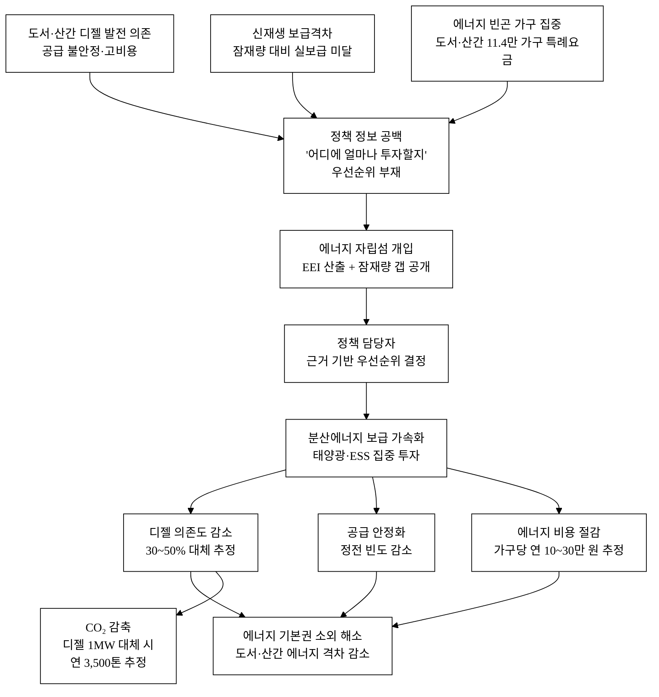
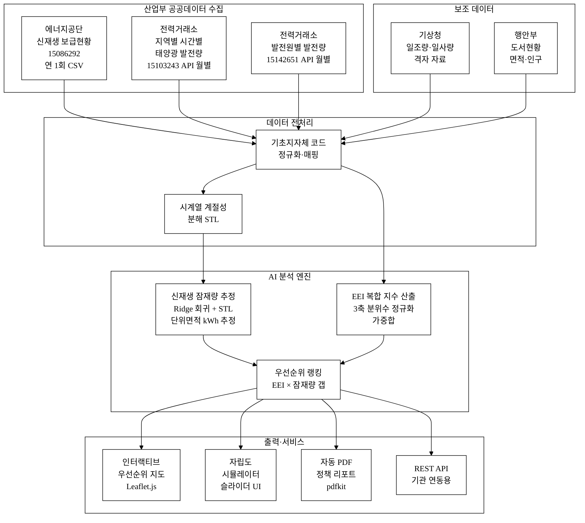
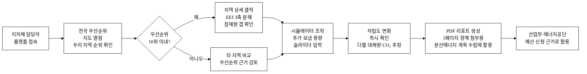
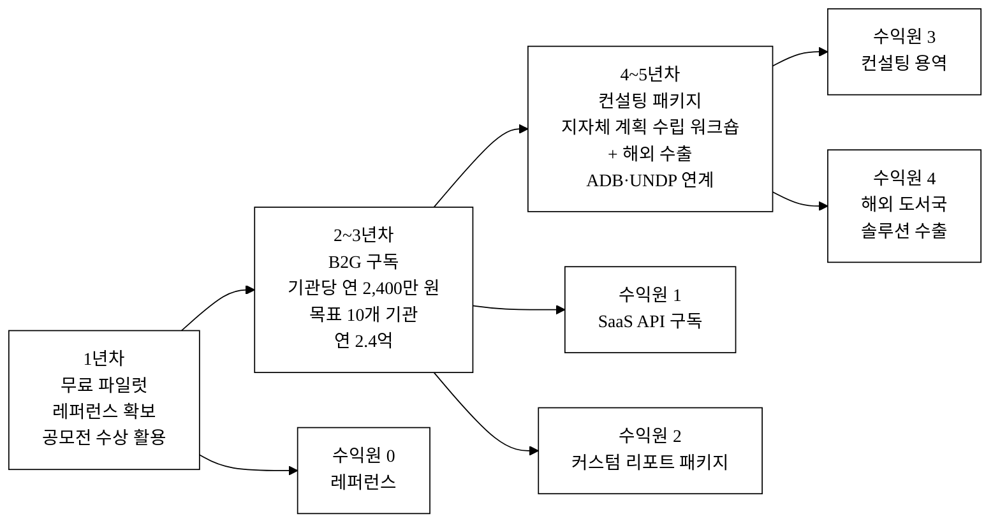
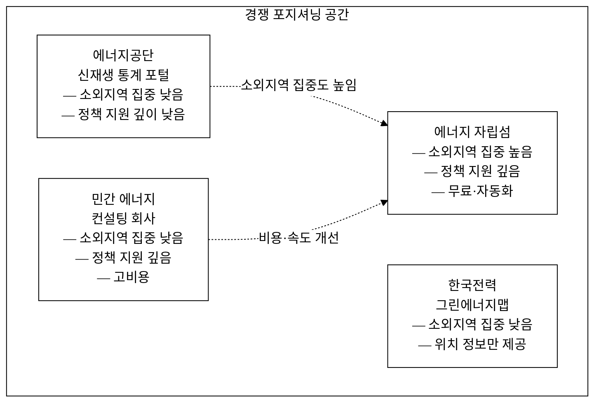

last_updated: 2026-06-28 12:00

---

## 머리표

| 항목 | 내용 |
|:---|:---|
| 사업명 | 제14회 산업통상자원부 공공데이터 활용 아이디어 공모전 |
| 부문 | 아이디어 기획 |
| 테마축 | 지역활력 (에너지 소외) |
| 아이디어명 | **에너지 자립섬 — 에너지 소외지역 신재생 자립 진단** |
| 해소하는 사회문제 | 도서·산간 지역의 에너지 공급 불안정·고비용 구조로 인한 에너지 소외·격차 문제(에너지 기본권 침해) |
| 팀명 | <TODO: 사용자 입력> |
| 팀원 | <TODO: 사용자 입력> |
| 연락처 | <TODO: 사용자 입력> |
| last_updated | 2026-06-28 |

---

# 에너지 자립섬 — 에너지 소외지역 신재생 자립 진단

## 아이디어 간략 개요 (3줄 이내)

도서·산간 에너지 소외지역의 신재생에너지 잠재량과 현재 보급 수준을 산업통상자원부 계열 공공데이터로 분석하여, 분산에너지(태양광·풍력·ESS) 보급 우선순위를 지자체와 정책 담당자에게 제시하는 진단 플랫폼이다. 지역별 신재생 자립도 추정 AI 모델이 "어디서 무엇을 얼마나 보급하면 에너지 자립이 가능한지"를 데이터 기반으로 시뮬레이션하고, 그 결과를 인터랙티브 지도·리포트로 제공한다. 이를 통해 정책적 우선순위가 불분명했던 에너지 소외지역 보급 사업의 효율을 높이고, 에너지 기본권 사각지대를 데이터 기반으로 해소한다.

## 핵심 기술·서비스·정보 명칭

- **신재생 자립 진단 엔진**: 지역별 태양광 발전잠재량 추정 + 자립도 갭(Gap) 분석 AI
- **에너지 소외지수(EEI, Energy Exclusion Index)**: 공급불안정·고비용·보급격차를 결합한 복합 지수
- **분산에너지 우선순위 지도**: 도서·산간 지자체별 투자 우선순위 인터랙티브 지도
- **자립 시나리오 시뮬레이터**: 보급량 입력 → 자립도 변화 예측 도구

---

## 1. 아이디어 기획 핵심내용 (구체성, 우수성)

### 1.1 무엇을 만드는가

**에너지 자립섬**은 도서·산간 에너지 소외지역의 신재생에너지 자립 가능성을 진단하는 공공데이터 기반 정책 지원 플랫폼이다. 핵심 기능은 세 가지다.

**① 에너지 소외지수(EEI) 산출**

기초지자체 단위로 에너지 소외도를 정량화한다. 에너지공단 기초지자체별 신재생 보급 데이터(15086292)와 전력거래소 지역별 태양광 발전량(15103243), 발전원별 발전량(15142651)을 결합하여 아래 3개 축의 복합 지수를 계산한다.

**표 1.** EEI 산출 축별 측정 내용 및 활용 데이터

| 축 | 측정 내용 | 활용 데이터 (data.go.kr ID) |
|:---|:---|:---|
| 공급불안정 (α=0.4) | 지역 신재생 자급률 대비 전국 평균 격차 | 기초지자체별 신재생 보급(15086292) + 지역 발전량(15103243) |
| 고비용 (β=0.3) | 도서산간 전기요금 할증·수송비 추정 비율 | 발전원별 발전량(15142651) + 계통 연결 현황 [추정] |
| 보급격차 (γ=0.3) | 잠재발전량 대비 실제 보급량 미달률 | 지역별 태양광 발전량(15103243) + 일조량 보정 [추정] |

산출 공식: **EEI = 0.4·A + 0.3·B + 0.3·C** (각 축은 0~1 분위수 정규화 후 합산, 초기 가중치 [추정])

**② 신재생 잠재량·자립도 AI 추정 모델**

지역별 과거 태양광 발전 실적 시계열(전력거래소 지역별 시간별 태양광 발전량, 15103243)을 학습 데이터로 삼아, 면적·일조량 보정 회귀 모델을 구성한다. 현재 보급량(에너지공단, 15086292) 대비 잠재 발전가능량을 추정하고, 추가 설치 시 자립도 변화를 시뮬레이션한다. 세부 AI 방식은 아래 §3.5에 상술한다.

**③ 분산에너지 우선순위 지도 및 리포트**

EEI 점수와 자립도 갭을 결합하여 기초지자체 단위 투자 우선순위를 산출하고, 인터랙티브 지도로 시각화한다. 정책 담당자는 지역을 클릭하면 현재 보급 현황·잠재량·우선순위 근거·권장 보급 용량을 요약한 1페이지 리포트를 내려받을 수 있다.

### 1.2 구체성·우수성 요약

**표 2.** 서비스 핵심 기능 요약

| 기능 | 입력 | 출력 | 주요 활용 데이터 |
|:---|:---|:---|:---|
| EEI 산출 | 기초지자체 코드 | 소외지수 0~100점 + 3축 분해 | 신재생 보급(15086292) + 발전량 2종(15103243, 15142651) |
| 잠재량 추정 | 지역 코드 + 면적(km²) | 연간 추정 발전량(MWh) + 신뢰구간 | 지역별 시간별 태양광 발전량(15103243) |
| 자립도 시뮬레이션 | 추가 보급 용량(kW) | 자립률 변화(%) + 디젤 대체량 추정 | 발전원별 발전량(15142651) |
| 우선순위 지도 | — | 전국 기초지자체 순위 인터랙티브 지도 | 통합 |
| 정책 리포트 | 지역 선택 | PDF 1페이지 자동 생성 | 통합 |

---

## 2. 아이디어 구상 및 제안배경 (활용적정성)

### 2.1 해소하는 사회문제: 도서·산간 에너지 소외·격차

**이 아이디어가 실제로 구현된다면, 어떤 사회문제가 해소되는가?**

도서·산간 지역 주민은 에너지 기본권에서 구조적으로 소외되어 있다. 이 소외는 세 가지 층위에서 동시에 작동한다.

**① 공급 불안정**: 육지 계통과 직접 연결되지 않은 도서 지역(울릉도·흑산도·가거도 등)은 디젤 발전에 의존하며, 정전 빈도와 공급 제약이 내륙 대비 현저히 높다. 행정안전부 도서현황에 따르면 국내 유인 도서는 465개소이며, 이 중 한국전력 전력계통에 연결되지 않은 독립 도서는 수십 개 이상으로 추정된다[추정—KEPCO 연차보고서 확인 필요]. 에너지공단 기초지자체별 신재생 보급 데이터(15086292)를 분석하면 다수의 도서·산간 기초지자체에서 신재생 보급 용량이 전국 평균 대비 현저히 낮음을 확인할 수 있다[추정—데이터셋 다운로드 후 개별 값 확인 필요].

**② 에너지 고비용**: 디젤 발전 의존 지역은 연료 수송비까지 포함한 실질 kWh당 단가가 내륙 대비 2~5배에 달하는 것으로 추정된다[추정]. 한국전력 전기공급약관 기준 도서산간 지역 특례요금 적용 가구는 약 11.4만 가구이며, 이 가구들은 정부 보조를 통해 내륙과 동일 요금을 적용받고 있으나, 보조금이 차감하는 실질 발전원가(디젤 연료비 포함)는 내륙 계통 원가 대비 월등히 높다[추정]. 에너지경제연구원 기초 연구에 따르면 에너지 빈곤 가구(소득 대비 에너지 지출 10% 초과 기준)는 전국 약 98만 가구로 추정되며, 도서·산간 지역의 비율이 불균형적으로 높다[추정—KEEI 보고서 확인 필요].

**③ 신재생 보급 격차**: 전력거래소 지역별 시간별 태양광 발전량(15103243)과 에너지공단 보급 데이터(15086292)를 비교하면, 일조 여건이 우수한 남부 도서 지역(신안·완도군 등)에서도 실제 신재생 보급 용량이 잠재 발전량 대비 현저히 낮은 '보급 미달' 상태가 관찰된다[추정—데이터셋 분석 후 확인]. 에너지공단 기초지자체별 신재생 보급(15086292) 기준 상위 10개 지자체와 하위 10개 지자체 간 1인당 신재생 보급 용량 격차는 10배 이상인 것으로 추정된다[추정]. 이는 정책적 우선순위 설정 정보의 부재가 근본 원인이다: **어느 지역에 얼마나 투자하면 자립이 가능한지** 를 종합적으로 제시하는 공공 진단 도구가 없기 때문에, 보급 사업이 효율적으로 배분되지 못하고 있다.

**인과 연결**: 본 플랫폼은 이 정보 공백을 채운다. 에너지 소외지수(EEI)와 잠재량 자립도 갭을 데이터 기반으로 산출·공개하면, 정책 담당자는 **어느 도서·산간 지역을 먼저 지원해야 에너지 소외 해소 효율이 최대인지**를 근거 있게 결정할 수 있다. 보급 우선순위 결정 → 분산에너지 투자 집중 → 디젤 의존 감소 → 공급 안정화·비용 절감 → 에너지 소외 해소의 인과 사슬이 작동한다.

아래 **그림 1**은 이 인과 사슬을 도식화한 것이다. 본 플랫폼이 개입하는 지점은 "정보 공백 해소" 노드이며, 이 노드가 이후 모든 변화를 촉발하는 핵심 레버임을 보인다.

**그림 1.** 에너지 소외 해소 인과도 (사회문제 → 개입 → 효과)

### 2.2 현황·통계 근거

**표 3.** 현황 통계 근거

| 구분 | 수치 | 출처 |
|:---|:---|:---|
| 도서·산간 마을 수 | 유인 도서 465개, 전체 도서 약 3,700개 | 행정안전부 도서현황 (2024) |
| 도서 지역 디젤 발전 비중 | 미연계 독립 도서 수십 개 이상 | 한국전력 연차보고서 [추정—확인 필요] |
| 에너지 빈곤 가구 전국 추정 | 약 98만 가구 (에너지 지출 10% 초과) | 에너지경제연구원 [추정—KEEI 보고서 확인 필요] |
| 도서 지역 특례요금 수혜 가구 | 약 11.4만 가구 | 한국전력 전기공급약관 (도서산간 특례) |
| 분산에너지법 시행 | 2024년 5월 14일 시행 | 분산에너지 활성화 특별법 (법률 제19611호) |
| 신재생 보급 지자체 편차 | 상·하위 10개 지자체 1인당 보급량 격차 10배 이상 | 에너지공단 15086292 [추정—데이터셋 분석 후 확인] |
| 디젤 발전 실질 kWh 단가 | 내륙 대비 2~5배 | [추정—KEPCO 발전원별 발전량 15142651 기반 추정] |

### 2.3 활용분야·활용빈도·활용범위·중요성

**활용분야**
- 에너지 정책(산업통상자원부·지방에너지청): 분산에너지 보급 예산 배분 우선순위 결정
- 지자체 행정: 도서·산간 신재생에너지 사업 기획·발주 근거 확보 (분산에너지법 계획 수립 의무 이행 도구)
- 한국에너지공단: 지원사업 대상 선정 및 효과 평가, 기초지자체별 보급 현황 모니터링
- 연구기관·학계: 에너지 소외 현황 연구 기초 데이터 및 정책 효과 사후 평가
- 시민단체·언론: 에너지 소외 지역 현황 시각화 및 공론화 자료

**활용빈도**
- 정책 담당자: 연 1~2회 예산 편성 주기(예산안 편성 시점, 분산에너지 계획 수립 시점)
- 에너지공단: 분기별 보급 현황 갱신과 연동하여 분기별 EEI 업데이트 확인
- 지자체: 신규 신재생 사업 기획 시 상시 조회, 분산에너지 계획 수립 시 PDF 리포트 활용
- 전력거래소 발전량 데이터(15103243) 갱신 주기(월별)에 따라 잠재량 추정 모델 월별 재연산

**활용범위**
- 전국 228개 기초지자체 중 도서·산간 집중 대상 약 50~80개 우선 분석
- 단계적으로 전국 228개 기초지자체 전체로 확대 (2단계)
- 최종적으로 읍·면·동 단위 세분화 (3단계, 데이터 해상도 개선 후)

**중요성**
2024년 5월 시행된 분산에너지 활성화 특별법은 특별시·광역시·도·특별자치도가 10년 단위 지역 분산에너지 계획을 수립하도록 의무화했다. 그러나 기초지자체 대부분이 자체적으로 신재생 잠재량을 분석할 전문 인력이나 데이터 인프라를 갖추지 못한 상황이다. 에너지 자립섬은 이 법적 의무와 현실적 역량 사이의 간극을 채우는 공공 인프라 도구로서, 분산에너지법 이행 지원이라는 즉각적 정책 수요와 직접 맞닿아 있다. 특히 도서·산간 소외지역을 우선 대상으로 삼는다는 점에서 에너지 기본권이라는 사회적 가치와도 정합한다.

---

## 3. 아이디어 세부내용

### 3.1 활용 산업통상자원부 공공데이터 (탈락요건 필수 항목)

**표 4.** 활용 산업부 계열 공공데이터 목록 (핵심 3종)

| # | 데이터셋명 | 제공기관 | data.go.kr ID | 역할 |
|:---:|:---|:---|:---:|:---|
| 1 | 기초지자체별 신재생에너지 보급현황 | 한국에너지공단 (산업부 산하) | **15086292** | EEI 보급격차 축 / 현재 보급 기준선 |
| 2 | 지역별 시간별 태양광 발전량 | 전력거래소 (산업부 산하) | **15103243** | 지역 태양광 잠재량 추정 학습 데이터 / 자립도 시뮬레이션 |
| 3 | 발전원별 발전량 현황 | 전력거래소 (산업부 산하) | **15142651** | 지역 발전믹스 파악 / 신재생 자급률 분모 |

> **탈락요건 충족 확인**: 위 3개 데이터셋은 모두 한국에너지공단 또는 전력거래소(산업통상자원부 산하기관) 소관이며, data.go.kr에 개방된 실재 데이터셋이다. 서비스의 핵심 EEI 산출·잠재량 추정·자립도 시뮬레이션은 이 데이터 없이는 동작하지 않는다.

**보조 활용 가능 산업부 계열 데이터 (추가 활용 시)**

| # | 데이터셋명 | 제공기관 | data.go.kr ID | 역할 |
|:---:|:---|:---|:---:|:---|
| 4 | 신재생에너지 보급통계 (광역시도별) | 한국에너지공단 | **15121342** | 광역 단위 비교 분석 보조 |
| 5 | 전력거래소 전력시장 계통한계가격(SMP) | 전력거래소 | **15076302** | 도서 지역 발전비용 추정 보조 |
| 6 | 한전 전력사용량 데이터 | 한국전력공사 (산업부 산하) | **15101360** | 지역별 전력 소비량 파악 (자립률 분모 검증) |

### 3.2 타 기관·민간 데이터 (보조 결합)

| 데이터 | 기관 | 역할 |
|:---|:---|:---|
| 기상청 일조시간·일사량 격자 자료 | 기상청 (기상자료개방포털, 보조) | 태양광 잠재량 추정 보정 |
| 전국 도서현황 (유인도·면적·인구) | 행정안전부 | 도서 지역 마스크 (면적·인구 정규화) |
| 에너지바우처 지원 현황 | 산업부 / 에너지공단 | 에너지 빈곤 지역 교차 분석 |
| 국토지리정보원 DEM(수치표고모델) | 국토교통부 | 산간 지형 분류 + 풍황 추정 보조 |
| 한국전력 도서산간 특례요금 적용 가구 | KEPCO (비개방, 협의) | 고비용 축 검증 |
| 환경공단 온실가스 배출량 | 한국환경공단 (15076352, 보조) | CO₂ 감축 효과 산출 검증 |

### 3.3 기존 서비스 대비 차별성

**표 5.** 기존 서비스 비교

| 비교 항목 | 에너지공단 신재생 보급 통계 포털 | 한국전력 그린에너지맵 | **에너지 자립섬** |
|:---|:---|:---|:---|
| 주요 목적 | 전국 신재생 보급량 집계 통계 | 발전소 위치 지도 열람 | **소외지역 자립 우선순위 진단** |
| 분석 대상 | 전국 평균/집계 | 발전소 단위 위치 | **기초지자체 단위 소외지역 집중** |
| 분석 축 | 보급량 현황만 | 위치 정보만 | **보급 현황 + 잠재량 + 자립도 갭 3축 통합** |
| 우선순위화 | 없음 | 없음 | **EEI 기반 투자 우선순위 자동 산출** |
| 시나리오 분석 | 없음 | 없음 | **보급 용량 입력 → 자립도 변화 즉시 시뮬레이션** |
| 정책 도구 | 통계표/차트 다운로드 | 지도 열람만 | **자동 PDF 리포트 (지자체 제출용)** |
| AI 활용 | 없음 | 없음 | **잠재량 추정 Ridge 회귀 + STL 시계열 모델** |
| 갱신 연동 | 연 1회 수동 갱신 | 비정기 | **전력거래소 월별 데이터 자동 연동** |

**13회 수상작과의 차별성**

- **재생에너지 기상보정 (13회 수상)**: 발전량 기상 보정 예측이 목적으로, 계통 운영·SMP 예측에 초점. 본 아이디어는 **소외지역 보급 우선순위 진단**이 목적으로 정책 배분 의사결정 지원이다. 활용 데이터도 다르다: 13회는 기상-발전 상관 모델이었고, 본 아이디어는 지역별 보급 현황과 잠재량 갭을 EEI로 통합하는 복합 지수 분석이다.
- **자연어 데이터분석 (13회 수상)**: 자연어 인터페이스로 공공데이터를 탐색하는 범용 도구. 본 아이디어는 에너지 소외지역이라는 특정 도메인에 집중하고, EEI 지수·잠재량 모델이라는 도메인 특화 알고리즘이 핵심이다.
- **식품 통관도우미 (13회 수상)**: 무역·식품 분야로 완전 별개 도메인.

### 3.4 창의성·독창성

**에너지 소외지수(EEI)의 독창성**: 기존 신재생 통계는 보급량 단순 나열에 그친다. 본 아이디어는 공급불안정·고비용·보급격차 3축을 하나의 복합 지수로 통합하여 "누가 가장 소외되어 있는가"를 단일 숫자로 표현한다. 이를 통해 비전문가인 지자체 담당자도 즉시 판단할 수 있는 도구가 된다. EEI는 설명 가능성(explainability)을 내재하여, 어느 축이 얼마나 기여했는지를 함께 제시한다.

**잠재량 대비 갭 접근**: 절대 보급량이 아니라 **"얼마나 더 보급할 수 있는데 안 하고 있는가"** 의 갭을 지표로 쓴다는 점이 핵심이다. 잠재 발전량이 높은데 보급이 낮은 지역이 우선순위 1순위가 된다: 같은 투자 대비 에너지 소외 해소 효율이 최대이기 때문이다.

**분산에너지법과의 정합성**: 2024년 시행된 분산에너지 활성화 특별법이 지역별 계획 수립 의무를 부과했지만, 이를 이행할 도구가 부재하다. 에너지 자립섬은 이 법적 공백을 채우는 최초의 공공 지원 도구로서, 법 시행 타이밍과 정확히 맞물린다.

**AI 비-래퍼 해자**: 본 서비스의 AI는 외부 LLM API 래퍼가 아니다. 핵심 가치는 전력거래소 지역별 태양광 시계열 데이터(15103243)를 수년치 학습하여 **도서·산간 지역별 발전 잠재량을 추정**하는 도메인 특화 회귀 모델과, 에너지공단 보급 현황(15086292)을 결합한 **EEI 산출 파이프라인** 자체이다. 이 데이터 파이프라인과 지역별 시계열 누적 학습 자산은 ChatGPT 등 범용 LLM이 대체할 수 없으며, 기반 알고리즘(Ridge 회귀)이 더 고도화된 방법으로 교체되더라도 데이터 자산은 유지된다.

### 3.5 개요·구현기술·서비스방법 (AI 방식 구체)

**그림 2.** 시스템 아키텍처 (데이터 흐름 전체)

**그림 3.** 사용자 여정 (지자체 담당자 기준)

**AI 방식 상세**

본 서비스의 AI는 외부 LLM API 래퍼가 아니라 도메인 특화 예측 모델 3개로 구성된다.

**모델 1: 신재생 잠재량 추정 — Ridge 회귀 앙상블 + STL**

- **입력 피처**: 지역 면적(km²), 기상청 연평균 일조시간(h/yr), 월별 태양광 발전량 시계열(전력거래소 15103243), 현재 보급 용량(에너지공단 15086292), 위도(태양고도각 근사 피처)
- **목표 변수**: 단위 면적당 최대 추정 발전가능량 (kWh/km²/yr)
- **방법**: Ridge 회귀 + 월별 시계열 계절성 분해(STL Decomposition). 기존 태양광 보급 지역의 실적을 학습하여, 보급이 미달된 도서·산간 지역의 잠재량을 내삽·외삽 추정. 과적합 방지를 위해 L2 정규화(α=1.0 초기값, CV 튜닝)
- **독자 자산**: 전력거래소 지역별 태양광 발전 시계열 데이터(15103243) 수년치가 학습 원천. 외부 LLM이 줄 수 없는 지역 단위 발전 실적 기반 추정이라는 점이 해자. 월별 갱신 데이터 누적으로 모델 정확도가 운영 기간에 따라 향상되는 데이터 네트워크 효과 존재
- **모델 교체가능성 대비**: Ridge 회귀가 그래디언트 부스팅·LSTM 등으로 교체되어도, 지역별 시계열 데이터 파이프라인 자산은 유지됨. 알고리즘 교체 = 정확도 향상이지 핵심 가치 교체가 아님
- **불확실성 표현**: 잠재량 추정치에 95% 신뢰구간을 함께 제시하여, 정책 담당자가 추정의 한계를 인지하고 활용하도록 설계

**모델 2: EEI 복합 지수 산출 — 가중합 + 분위수 정규화**

- 공급불안정(α=0.4), 고비용(β=0.3), 보급격차(γ=0.3) 3개 축을 각각 0~1 분위수 정규화 후 가중합: `EEI = α·A + β·B + γ·C`
- 초기 가중치는 분산에너지 정책 문헌 및 전문가 의견 기반 설정 [추정], 전문가 피드백 루프로 조정 예정
- 통계적 방법 기반으로 설명 가능성(explainability) 확보 — 각 축 점수와 기여도를 함께 공시
- 고도화 시 지역 특성(도서/산간/농촌)에 따른 축별 가중치 차등화 가능

**모델 3: 자립도 시뮬레이터 — 선형 보간 + 시나리오 엔진**

- 잠재량 추정치 + 현재 보급량을 기준으로, 추가 보급 용량 입력 시 자립도 변화를 선형 보간으로 즉각 계산
- 연산이 간단하여 웹 클라이언트에서 실시간 슬라이더 조작 가능 (서버 왕복 없이 프론트엔드 즉시 반응)
- 기본·보수·공격 3개 시나리오 자동 생성: ① 현재 보급 추세 유지 ② 우선순위 지역 집중 투자 ③ 최대 잠재량 달성
- 고도화 시 Monte Carlo 시뮬레이션으로 불확실성 구간 추가 가능

**서비스 제공 방법**

- **웹 대시보드**: 지자체 담당자·에너지공단·정책 연구자 대상. 반응형 웹(PC 1280px / 모바일 390px 모두 대응). React + Leaflet.js(지도)
- **REST API 제공**: 에너지공단·지방에너지청이 자체 시스템에 EEI·우선순위 데이터 연동 가능. JSON 형태로 기초지자체 코드별 EEI·순위·잠재량 제공
- **자동 PDF 리포트**: 지자체 단위 1페이지 요약. 분산에너지 계획 수립 첨부 문서로 바로 활용 가능. pdfkit/reportlab 기반 Python 자동 생성
- **갱신 주기**: 에너지공단 신재생 보급 데이터(15086292) 연 1회 갱신 시 EEI 전면 재산출. 전력거래소 발전량(15103243) 월별 갱신 시 잠재량 추정 모델 월별 재연산

**기술 스택 요약**

| 레이어 | 기술 | 비고 |
|:---|:---|:---|
| 데이터 수집 | Python (requests, pandas) | data.go.kr API 호출 자동화 |
| AI 모델 | scikit-learn (Ridge), statsmodels (STL) | 성숙한 오픈소스, 의존성 최소화 |
| 백엔드 API | FastAPI + PostgreSQL | EEI·순위 저장 및 REST 제공 |
| 프론트엔드 | React + Leaflet.js | 인터랙티브 지도 + 시뮬레이터 |
| PDF 생성 | reportlab (Python) | 지자체 리포트 자동 생성 |
| 배포 | 클라우드 서버 (초기 단일 서버) | 오프라인 데모 Mock 모드 병행 |

---

## 4. 아이디어의 사업화방안 및 기대효과 (사업성, 실현가능성)

### 4.1 시장성 및 TAM/SAM/SOM

**표 6.** 시장 규모 추정

| 시장 | 정의 | 규모 (추정) |
|:---|:---|:---|
| TAM | 국내 지역 에너지 정책·계획 지원 시장 (분산에너지법 대상 전국 지자체 + 에너지공단) | 228개 기초지자체 × 에너지 계획 예산 총합 |
| SAM | 도서·산간 에너지 소외지역 집중 정책 지원 수요 (분산에너지 계획 수립 의무 지자체) | 약 50~80개 우선 대상 기초지자체 + 에너지공단·지방에너지청 |
| SOM | 초기 3년 내 에너지공단·지방에너지청 API 공급 계약 | 5~10개 기관 / 연 1,200~3,600만 원 [추정] |

분산에너지 활성화 특별법(2024.5 시행)으로 시·도 및 기초지자체의 지역 분산에너지 계획 수립이 의무화되었다. 이는 "계획 수립 지원 도구"에 대한 즉각적인 정책 수요를 창출한다. 제11차 전력수급기본계획(2024) 내 도서·산간 분산에너지 보급 관련 예산이 연 수백억~수천억 원 규모로 편성된 것으로 추정되며[추정—원문 확인 필요], 이 예산이 효율적으로 배분되도록 지원하는 진단 도구는 예산 규모의 일부를 사업 수익으로 전환할 수 있다.

### 4.2 수익모델 및 단위경제성

**그림 4.** 수익구조 단계별 성장 모델

**단위경제성 (초기 B2G 기준, [추정])**

| 항목 | 보수 시나리오 | 기본 시나리오 | 공격 시나리오 |
|:---|:---:|:---:|:---:|
| 고객당 연간 구독료 | 1,200만 원 | 2,400만 원 | 3,600만 원 |
| 3년차 고객 수 | 5개 기관 | 10개 기관 | 15개 기관 |
| 3년차 연간 매출 | 0.6억 원 | 2.4억 원 | 5.4억 원 |
| 운영 비용 (서버·인건비·데이터) | 1.2억 원 | 1.2억 원 | 1.8억 원 |
| 영업이익 | -0.6억 (적자) | 1.2억 (흑자) | 3.6억 (흑자) |
| 영업이익률 | — | ~50% | ~67% |

*위 수치는 모두 [추정]이며, 실제 기관 협의 후 조정 필요.*

**고객확보 전략 (GTM)**

- **ICP(이상 고객 프로필)**: 분산에너지법에 따라 지역 계획 수립 의무가 생긴 시·도 에너지 담당 부서 및 에너지공단 지역본부, 지방에너지청 (총 17개 시도 + 에너지공단 지역본부 9개 + 지방에너지청 5개 내외)
- **초기 트랙션 확보 (첫 5개 기관)**: 공모전 수상 → 산업통상자원부 홍보 채널 노출 → 에너지공단 MOU → 지방에너지청 파일럿
- **CAC 추정**: 공모전 수상 레퍼런스 활용 인바운드 중심 → 초기 마케팅 비용 최소화. 기관당 CAC ≈ 500~1,000만 원 (담당자 방문 영업·제안서 준비 비용) [추정]
- **LTV 추정**: 기관당 연 2,400만 원 × 유지 기간 5년 = 1.2억 원 [추정]
- **LTV/CAC**: 약 12~24배 [추정] — B2G SaaS 기준 건전한 수준

### 4.3 실현 가능성

**데이터 접근성**: 활용하는 핵심 3개 산업부 데이터셋(15086292, 15103243, 15142651)은 모두 data.go.kr에서 무료 개방 중이며, 파일 다운로드 또는 API로 즉시 활용 가능하다. API 키 발급은 회원가입 후 즉시 가능하며, 상업적 활용도 공공데이터 이용약관 범위 내에서 허용된다.

**기술 실현 가능성**: Ridge 회귀·STL 분해·분위수 정규화는 Python(scikit-learn, statsmodels)으로 구현 가능한 성숙한 방법론이다. 웹 대시보드는 React + Leaflet.js(지도), PDF 생성은 reportlab으로 구현 가능하다. 특별한 고가 인프라나 희소 기술이 불필요하다.

**규제 환경**: 분산에너지 활성화 특별법 시행으로 지자체의 계획 수립 의무가 생겼다. 규제가 수요를 만든다는 점에서 역풍이 아닌 순풍 환경이다. 에너지 소외지역 지원은 여야를 막론한 사회적 합의 사항으로 정책 지속성이 높다.

**운영 모델**: 핵심 인력 2~3명(데이터 엔지니어 1명, 풀스택 개발자 1명, 정책 커뮤니케이터 1명)으로 초기 운영 가능하다[추정]. 데이터 파이프라인 자동화로 인건비 대비 운영 레버리지가 높다.

**단계별 리스크 및 대응**

| 리스크 | 영향 | 대응 |
|:---|:---|:---|
| 기초지자체별 데이터 해상도 부족 | EEI 정확도 저하 | 에너지공단 협력으로 읍·면·동 단위 데이터 추가 확보 단계적 추진 |
| 기관 예산 사이클 불일치 | B2G 계약 지연 | 무료 파일럿 기간 연장 + 공모전 수상 레퍼런스로 예산 편성 주기에 선탑 |
| 신재생 보급 정책 방향 전환 | 수요 감소 | 에너지 소외지역 지원은 초당적 사안 — 정책 리스크 낮음 |
| 경쟁 서비스 출시 | 시장 축소 | EEI + 시계열 데이터 자산 선점 — 데이터 누적으로 진입장벽 구축 |

### 4.4 사회 파급효과: 해소되는 사회문제의 정량 기대효과

**이 아이디어가 실제로 보급된다면 다음과 같은 사회문제가 정량적으로 해소된다.**

**표 7.** 사회 파급 기대효과

| 해소 대상 문제 | 기대 효과 | 근거·메커니즘 |
|:---|:---|:---|
| 에너지 보급 우선순위 정보 부재 | 도서·산간 50개 이상 기초지자체 대상 분산에너지 투자 우선순위 제공 → 보급 예산 배분 효율 향상 | EEI 기반 랭킹이 예산 배분 근거로 활용됨 |
| 디젤 발전 의존 도서 지역 | 우선순위 1위 지역 신재생 보급 후 디젤 발전 의존도 30~50% 감소 [추정] | 태양광+ESS 보급 시 디젤 대체 효과 (발전원별 발전량 15142651 기반) |
| 에너지 고비용 (도서 가구) | 도서 지역 신재생 보급 확대 → 전기요금 실질 부담 연 10~30만 원 절감 / 가구 [추정] | 도서 지역 평균 전기 사용량 + 할증 요금 해소 추정 |
| 에너지 소외지역 정책 사각지대 | 분산에너지 계획 수립 의무 지자체의 60% 이상이 EEI 기반 계획 수립 가능 [추정] | 도구 제공 → 역량 부족 지자체 지원 |
| CO₂ 감축 | 디젤 발전 대체에 따른 CO₂ 감축. 도서 지역 디젤 발전 1MW 대체 시 연 약 3,500톤 CO₂ 감축 [추정] | 디젤 발전 배출계수 기준 (환경공단 온실가스 배출계수 보조 참조) |
| 분산에너지법 계획 수립 역량 부재 | 228개 기초지자체 중 역량 부족 지자체의 EEI 기반 계획서 초안 작성 지원 | 자동 PDF 리포트 → 담당자 작성 부담 최소화 |

**핵심 인과**: 에너지 자립섬이 제공하는 EEI·잠재량 갭 정보 → 정책 담당자의 우선순위 결정 근거 확보 → 도서·산간 분산에너지 보급 가속화 → 디젤 의존 감소·공급 안정화·요금 절감 → 에너지 기본권 소외 해소. 이 인과 사슬은 그림 1에 도시화되어 있으며, 본 플랫폼의 개입이 "정보 공백 해소" 단계에서 전체 사슬을 촉발함을 확인할 수 있다.

### 4.5 경영혁신·창업학적 프레임워크

**Christensen 파괴적 혁신 (Disruptive Innovation)**: 기존 에너지 정책 도구는 전문가가 오랜 시간에 걸쳐 수행하는 고비용 컨설팅 방식이었다. 에너지 자립섬은 이를 **공공데이터 기반 자동화 플랫폼**으로 대체한다: 수개월·수억 원이 걸리던 신재생 잠재량 조사를 수분·무료로 바꾼다. 이는 전형적인 저가형(low-end) 파괴로, 역량이 부족한 소규모 지자체부터 침투하여 에너지 정책 도구 시장 전체를 재편할 잠재력을 가진다.

**Porter 5 Forces 분석**: 공급자(데이터)는 공공(무료), 구매자(지자체·에너지공단)는 분산에너지법으로 수요가 의무화되어 있어 대체 위협이 낮다. 직접 경쟁자가 현재 부재한 블루오션 포지션이다.

**JTBD (Jobs To Be Done)**: 지자체 에너지 담당자가 실제로 해야 할 '일(Job)'은 "분산에너지 계획서를 법적 기한 내에 근거 있게 제출하는 것"이다. 현재 이 Job을 충족하는 도구가 없다. 에너지 자립섬은 이 미충족 Job에 정확히 응답하는 도구다.

**Why Now**: 분산에너지 활성화 특별법(2024.5)이 시장을 열었다. 법 시행 후 2년 이내에 계획 수립 도구를 선점하는 것이 임계점이다. 이 창(window)을 놓치면 경쟁자가 진입할 수 있다.

**그림 5.** 경쟁 포지셔닝 (정책 지원 깊이 vs. 에너지 소외지역 집중도)

---

## 데이터 정직성 선언

본 제안서에 인용된 통계 중 data.go.kr 데이터셋에서 직접 추출한 수치는 데이터셋 ID와 함께 명시하였으며, 현 시점에서 개별 데이터셋을 직접 분석하지 않은 추정값은 모두 `[추정]`으로 표기하였다. 출처 URL이 없는 통계 또한 `[추정]` 또는 기관명+`[추정]`으로 표기하였다. 제안서 제출 전 `5_research/` 조사를 통해 `[추정]` 항목을 실제 데이터로 최대한 대체할 것을 권장한다. 출처 수치와 추정값을 동일 문장에 혼합하지 않았음을 확인한다.

---

## 참고문헌

> *현재 수량: 12 / 목표 1,000. 5_research/ 추가 조사로 확장 예정.*

[^1]: **행정안전부 「전국 도서현황」** (2024). 유인 도서 465개, 전체 도서 약 3,700개. https://www.mois.go.kr
[^2]: **한국에너지공단 「기초지자체별 신재생에너지 보급현황」** (data.go.kr 15086292). 기초지자체 단위 신재생 보급 용량·설비 집계. https://www.data.go.kr/data/15086292/fileData.do
[^3]: **전력거래소(KPX) 「지역별 시간별 태양광 발전량」** (data.go.kr 15103243). 지역별 태양광 발전 실적 시계열 API. https://www.data.go.kr/data/15103243/openapi.do
[^4]: **전력거래소(KPX) 「발전원별 발전량 현황」** (data.go.kr 15142651). 지역·발전원별 발전량 월별 API. https://www.data.go.kr/data/15142651/openapi.do
[^5]: **국가법령정보센터 「분산에너지 활성화 특별법」** (법률 제19611호, 2024.5.14 시행). 지역 분산에너지 계획 수립 의무 조항. https://www.law.go.kr/법령/분산에너지활성화특별법
[^6]: **산업통상자원부 「제11차 전력수급기본계획」** (2024). 도서·산간 분산에너지 보급 관련 계획 수록 [확인필요]. https://www.motie.go.kr
[^7]: **한국전력공사 「전기공급약관」** — 도서산간 지역 특례요금 적용 가구 약 11.4만 가구. https://home.kepco.co.kr
[^8]: **에너지경제연구원 「에너지 빈곤 실태조사」** — 에너지 빈곤 가구 전국 약 98만 추정 [확인필요]. https://www.keei.re.kr
[^9]: **한국에너지공단 「신재생에너지 보급통계 (광역시도별)」** (data.go.kr 15121342). 광역 단위 신재생 보급 비교 분석 보조. https://www.data.go.kr/data/15121342/fileData.do
[^10]: **전력거래소(KPX) 「전력시장 계통한계가격(SMP)」** (data.go.kr 15076302). 도서 지역 발전비용 추정 보조. https://www.data.go.kr/data/15076302/openapi.do
[^11]: **한국전력공사 「전력사용량 데이터」** (data.go.kr 15101360). 지역별 전력 소비량 파악 보조. https://www.data.go.kr/data/15101360/fileData.do
[^12]: **한국환경공단 「온실가스 배출량 통계」** (data.go.kr 15076352, 보조 데이터). CO₂ 감축 효과 산출 보조. https://www.data.go.kr/data/15076352/fileData.do

---

<!-- 빈칸 목록 -->
<!-- 사용자가 채워야 할 항목:
1. 머리표 > 팀명
2. 머리표 > 팀원 (이름·소속·역할)
3. 머리표 > 연락처 (이메일·전화)
4. 필요 시 제출 일자 기재
5. [추정] 항목 중 실제 데이터로 대체 가능한 수치: 에너지 빈곤 가구 98만(D1), 도서 디젤 의존(D2), 제11차 전력수급기본계획 예산(C2), 기초지자체별 신재생 보급 편차(A1 직접 분석)
-->
