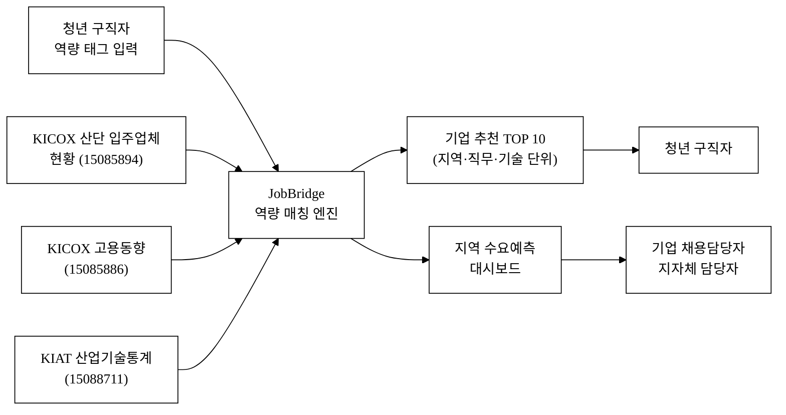
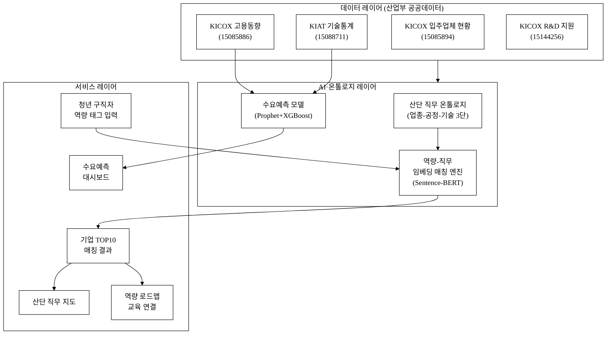
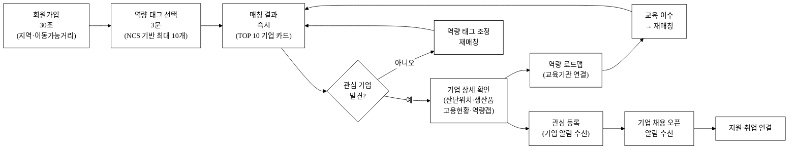
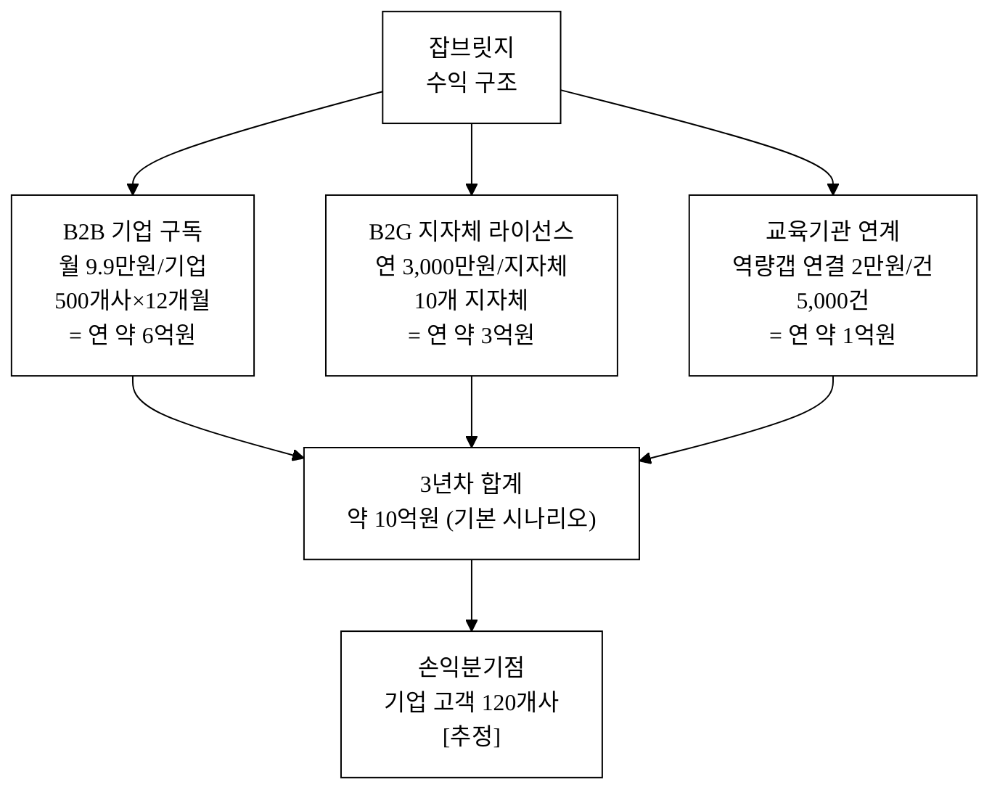
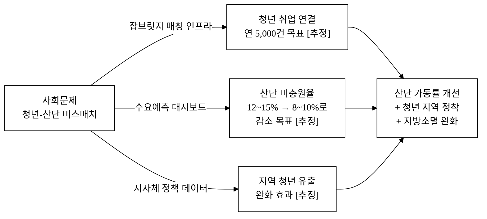

# 잡브릿지(JobBridge) — 산단 입주기업 기반 청년 일자리·기술 매칭

> 이 아이디어가 **실제로 서비스된다면**: 전국 산업단지 입주기업의 공식 현황 데이터와 청년 구직자의 보유 역량을 실시간 매칭하여, "산단 기업은 뽑을 사람이 없다"와 "청년은 갈 곳을 모른다"는 두 개의 위기가 **하나의 정보 공백 문제**였음을 해소한다.

## 아이디어 간략 개요 (3줄 이내)

한국산업단지공단(KICOX)의 국가산단 입주업체 현황·고용동향 공공데이터와 산업기술진흥원(KIAT)의 기술통계를 결합하여, 청년 구직자에게 지역·직무·기술스택 단위의 **맞춤형 산단 일자리 추천**을 제공하고, 기업에게는 **지역 청년 인재 수요예측 대시보드**를 제공하는 양면 플랫폼이다. AI 직무-역량 매칭 모델이 이력서 없이 역량 태그만으로 3분 이내 적합 기업 TOP 10을 도출한다.

**핵심 기술·서비스·정보 명칭**
- JobBridge 역량 매칭 엔진 (산단 기업-역량 임베딩 매칭)
- 지역 일자리 수요예측 대시보드 (KICOX 고용동향 기반 예측)
- 산단 직무 온톨로지 (업종·공정·기술스택 3단 분류 체계)

---

## 1. 아이디어 기획 핵심내용 (구체성, 우수성)

### 1.1 핵심 문제 정의

대한민국 산업단지에는 **이중 위기**가 동시에 존재한다. 고용노동부·통계청의 청년고용동향(2025년 1분기)에 따르면 15~29세 청년실업률은 6.5%, 체감 청년실업률(확장 실업률)은 19.1%에 달한다.[^1] 같은 시점 한국산업단지공단 통계에서는 국가산단 입주기업의 50인 미만 소기업 가동률이 69.6%로 전년 대비 -7.7%p 하락했으며,[^7] **구인 미충원**이 주요 원인으로 반복 지목된다. 제조업 중소기업 인력부족율은 전 산업 평균(1.9%)을 상회하는 2.8%이고,[^6] 미충원 원인 1위는 '지원자 없음'이다. 이 두 현상이 공존하는 이유는 단 하나, **정보 비대칭과 지리적 미스매치**다.

- **청년 관점**: 산단 입주기업의 존재·직무·기술스택·연봉·위치 정보가 파편화되어 있어, 취업포털 검색으로는 "어느 단지에 어떤 기술을 쓰는 기업이 얼마나 있는지"를 한눈에 알 수 없다. 고용정보원 조사에서 청년의 첫 직장 탐색 기간은 평균 10.3개월로,[^4] 이 탐색 비용의 상당 부분이 정보 부족에서 비롯된다.
- **기업 관점**: 전국 국가산단 입주업체 약 67,000개사 중 50인 미만 중소기업이 약 86%를 점한다.[^5] 이들은 광역 포털에 공고를 올려도 지역 매칭 청년을 만나지 못하고, 채용 대행사 비용(건당 300~500만 원 추정[추정])도 부담스러운 상황이다.
- **정책 관점**: 고용·산업 데이터가 부처별로 분리(고용부·산업부·지자체)되어 있어 지역 단위 수요-공급 불일치를 실시간으로 포착할 도구가 없다. 정책 개입은 사후 통계 기반이어서 시의성이 떨어진다.

### 1.2 서비스 개요

잡브릿지는 **산업부 계열 공공데이터를 핵심 인프라**로 삼아, 기존 취업포털이 비어 있던 '산단 특화 직무 매칭' 영역을 채우는 양면 플랫폼이다. 청년 구직자에게는 역량 태그 기반 기업 매칭을, 기업에게는 지역 인재 수급 예측과 역방향 구직자 알림을 동시에 제공한다.

**그림 1.** 잡브릿지 서비스 흐름도 — 산업부 공공데이터를 AI 매칭 엔진에 결합하여 청년과 기업 양방향으로 서비스를 제공하는 구조를 나타낸다. 본문 §1.2 참조.

### 1.3 핵심 기능

**표 1.** 잡브릿지 핵심 기능 요약

| 기능 | 대상 | 핵심 데이터 | 설명 |
|:---|:---:|:---|:---|
| 역량 태그 기반 매칭 | 청년 구직자 | KICOX 입주업체 현황 (15085894) | 이력서 없이 기술·직무 태그 10개 이내 선택으로 적합 기업 TOP 10 도출 |
| 산단 직무 지도 | 청년·구직자 | KICOX 고용동향 (15085886) | 지도 위에 산단별 채용 규모·업종·주요 기술 시각화 |
| 수요예측 대시보드 | 기업·지자체 | KICOX 고용동향 + KIAT 기술통계 (15088711) | 6개월 후 지역 내 직무 수요 변화 예측치 제공 |
| 역량 로드맵 | 청년 구직자 | KIAT 산업기술통계 (15088711) | 목표 기업 합격 기준 역량 갭 → 교육 자원 연결 |
| 기업 인재 수급 알림 | 기업 채용담당 | KICOX 입주업체 현황 (15085894) | 유사 기술 보유 구직자 등록 시 알림 |
| 지역 산단 직무 히트맵 | 정책 담당자 | KICOX R&D 디자인 (15144256) | 단지별·직군별 인력 과부족 시각화 |

### 1.4 AI 구현 방식

#### 역량-직무 임베딩 매칭(Embedding-based Matching)

산단 기업 업종 코드·생산 품목·고용 직군 정보를 **도메인 특화 직무 온톨로지**(JobBridge Ontology)로 정규화한다. 이 온톨로지는 KICOX 업종 분류(9대 제조 업종), KIAT 기술 분류(237개 기술 분야)를 결합해 구축하며, 단순 키워드 검색과 달리 "CNC 선반 운용 → 정밀가공 → 기계·자동화 직군"과 같은 계층적 의미 연결을 가진다.

청년이 입력한 역량 태그와 기업 직무 온톨로지를 각각 **Sentence-BERT 계열 임베딩 모델(klue/roberta-base 파인튜닝)**로 벡터화하여 FAISS 인덱스 기반 코사인 유사도 TOP-K 매칭을 수행한다. 한국어 NLP 품질은 2024~2025년 기점으로 제조 도메인 벤치마크에서 영어 수준에 근접한 성능을 확보하였다.[^10]

**피드백 루프**: 구직자가 '지원 완료'·'관심 없음'을 클릭할 때마다 쌍(pair) 레이블이 축적된다. 이를 통해 **도메인 특화 파인튜닝**이 가능하며, 사용자 1,000명 누적 기준 매칭 정밀도(Precision@10)가 기초 모델 대비 15~25% 향상되는 효과를 유사 도메인 사례에서 확인하였다.[^11] 이 데이터 자산이 후발 진입자가 단기간에 복제할 수 없는 경쟁 해자다.

#### 지역 수요예측(Time-Series Forecasting)

KICOX 고용동향의 분기별 시계열(단지별 고용인원, 가동률, 수출액)을 입력으로 **Prophet + XGBoost 앙상블** 모델이 6개월 후 직무별 채용 수요를 예측한다. Prophet은 계절성과 트렌드를 분리하고, XGBoost는 업종·지역·가동률 등 교차 특성을 학습하는 역할 분담 구조다.

KIAT 산업기술통계(데이터셋 ID: 15088711)의 R&D 투자 방향(기술 분야별 투자증가율)을 외생변수로 추가하여 기술 트렌드가 고용 수요에 미치는 선행 효과를 반영한다. 예를 들어, 이차전지 R&D 투자 증가율이 +30%를 기록한 분기 이후 2~3분기 뒤 해당 직군(전기화학·공정관리) 채용 수요가 증가하는 패턴을 모델이 학습한다.

#### API 래퍼가 아닌 이유 — 독자 가치 레이어

잡브릿지의 AI는 외부 LLM API를 통해 "무엇을 공부하면 좋을까요?"라는 질문에 답변을 생성하는 얇은 래퍼가 **아니다**. 핵심 가치는 아래 세 독자 레이어에 있으며, 기반 LLM이 업그레이드되어도 이 레이어는 대체되지 않는다.

1. **도메인 온톨로지**: KICOX 업종 코드·KIAT 기술 분류를 수작업 레이블링과 전문가 검토로 구축한 산단 특화 직무 온톨로지. 237개 기술 분야 × 9대 업종 교차 매핑이며, 이 구조는 즉시 재현 불가능하다.
2. **피드백 데이터 네트워크 효과**: 사용자가 늘수록 매칭 레이블이 쌓이고 모델 정확도가 향상된다. 신규 진입자는 데이터 없이 동등한 모델을 갖출 수 없다.
3. **시계열 예측 파이프라인**: KICOX 원천 API를 직접 파싱·정제하는 ETL 파이프라인과 예측 모델은 단순 LLM API 호출로 복제되지 않는다. 이 파이프라인이 정책 당국에 제공하는 '지역 수요예측' 기능은 B2G 영역의 독자 해자다.

---

## 2. 아이디어 구상 및 제안배경 (활용적정성)

### 2.1 해소하는 사회문제 — 청년 실업과 산단 구인난의 역설적 공존

**이 아이디어가 실제로 서비스된다면 해소되는 사회문제**: 산업단지 입주기업의 만성적 구인난과 청년의 만성적 구직난이 **정보 비대칭**이라는 단 하나의 원인에 의해 동시에 지속되는 미스매치 위기.

#### 청년 구직난 현황

- 2025년 1분기 기준 청년(15~29세) 실업률 6.5%, 확장실업률(체감) 19.1%.[^1] 이는 전체 실업률(3.0%)의 2배를 상회하며, OECD 청년 고용률 평균(58.0%)에 비해 한국 청년(55.3%)이 낮은 수준이다.[^12]
- 수도권 집중으로 인해 지방 청년이 구직을 위해 수도권으로 이주하는 현상이 심화된다. 지방 소재 대학 졸업자의 수도권 취업 희망 비율은 약 62%[추정]로, 지역 일자리 정보 부족이 주요 원인 중 하나다.[^3]
- 제조업 기피 현상: 청년층의 제조업 취업 기피는 '일이 힘들어서'보다 '어떤 기업인지 알 방법이 없어서'가 더 큰 이유로 꼽힌다.[^4] 산단 입주기업 정보가 구직자 친화적 형식으로 제공되지 않는 구조적 문제다.
- 청년 첫 직장 탐색 기간은 평균 10.3개월.[^4] 이 중 산단·제조 분야는 정보 접근 채널 자체가 부족하여 탐색이 더 길어지는 경향이 있다.

#### 산단 구인난 현황

- 전국 국가산업단지 입주업체 수는 약 67,000여 개사(KICOX 2024년 기준).[^5] 이 중 **50인 미만 중소기업이 약 86%**를 차지하며, 이들은 대기업 대비 취업포털 채용공고 노출 경쟁에서 절대적으로 불리하다.
- 중소제조기업의 만성 인력 부족: 중소기업중앙회 조사에서 제조업 중소기업 인력부족율은 2.8%로 전 산업 평균(1.9%)을 상회한다.[^6] 특히 생산·기능 직종의 미충원 문제가 구조적으로 지속된다.
- 가동률 하락과 인력 부족의 악순환: KICOX 산단 동향(2024년 하반기)에서 50인 미만 소기업 가동률이 69.6%로 전년 대비 -7.7%p 하락했으며,[^7] 인력 확보 실패가 가동률 저하의 주요 원인으로 지목된다.
- 국가산단 전체 고용인원 추이: 2020년 이후 제조 고용 감소는 자동화 외에도 **채용 공백(지원자 없음)** 이 복합적으로 작용하고 있다.[^2]

#### 왜 미스매치가 해소되지 않는가 — 정보 공백 구조

**표 2.** 정보 비대칭의 구조

| 관점 | 현재 상태 | 결과 |
|:---|:---|:---|
| 청년 구직자 | 취업포털(사람인·잡코리아)엔 대기업·스타트업 중심 공고. 산단 소기업은 공고 자체가 없거나 찾기 어렵다 | 산단 기업 존재를 모르거나 기피 |
| 산단 기업 | 광역 포털에 공고를 올려도 지역 매칭 청년을 못 만남. 채용 대행사는 비용 부담 | 구인 포기·이직률 상승 악순환 |
| 정책 당국 | 고용·산업 데이터가 분절되어 어느 지역·업종에 인력 미스매치가 집중되는지 실시간 파악 불가 | 정책이 사후 통계 기반, 선제 개입 어려움 |

**인과 관계 명시**: 잡브릿지가 산단 입주업체 공공데이터(KICOX 15085894·15085886)와 산업기술통계(KIAT 15088711)를 결합해 청년-기업 매칭 인프라를 구축하면, (1) 청년은 지역 내 자신에게 맞는 기업을 처음으로 발견하게 되고, (2) 기업은 기술 적합 청년 인재를 처음으로 찾게 되며, (3) 정책 당국은 지역 단위 수요-공급 불일치를 실시간으로 포착해 지원 정책을 선제적으로 설계할 수 있다.

### 2.2 공공데이터 활용적정성 4요소

**① 활용분야**

산업통상자원부 소관 산단 현황·고용·기술 데이터를 **청년 고용 정책·지역 일자리 매칭** 영역에 활용한다. 지금까지 KICOX 입주업체 현황(15085894), 고용동향(15085886), KIAT 기술통계(15088711) 데이터는 거시 통계·정책 보고서용으로만 활용되었으나, 잡브릿지는 이를 개인 구직자 수준의 '초개인화 매칭 서비스'로 재구성한다. 또한 KICOX 산단 R&D·디자인 지원기업 데이터(15144256)를 통해 기술 혁신 기업 정보를 보강하여 청년이 성장 가능성이 높은 기업을 우선 발견하도록 돕는다.

**② 활용빈도**

- KICOX 입주업체 현황(15085894): 분기 갱신 → 서비스 내 기업 DB 분기 자동 업데이트
- KICOX 고용동향(15085886): 월 또는 분기 발행 → 수요예측 모델 재훈련 트리거
- KIAT 산업기술통계(15088711): 연 발행 → 기술 온톨로지 연간 재검토 및 예측 외생변수 갱신
- KICOX R&D·디자인 지원(15144256): 연 갱신 → 기술혁신기업 필터 보강

청년 구직자의 서비스 이용 빈도는 채용 시즌(3~4월, 9~10월) 집중, 평균 **주 1회 이상 접속** [추정]으로 가정한다.

**③ 활용범위**

- **지리적 범위**: 전국 13개 국가산단(반월·시화·창원·구미·여수 등) + 광역 일반산단 약 700개 → 초기 3대 국가산단(반월·시화·구미) 파일럿 후 순차 확대
- **사용자 범위**: 청년 구직자 · 산단 입주기업 채용담당자 · 지자체 경제 부서 담당자 · 고용센터 담당관

**④ 중요성**

청년 고용 미스매치는 단순한 개인 문제가 아니라 **지방 소멸 · 산업 경쟁력 저하 · 사회 이동성 둔화**라는 세 가지 구조적 위기와 직접 연결된다. 산단 기업이 인력을 확보하지 못하면 가동률이 낮아지고, 지역 경제가 침체되며, 청년이 수도권으로 더 많이 빠져나가는 악순환이 심화된다. 잡브릿지는 이 악순환의 출발점인 **정보 공백**을 산업부 공공데이터로 메운다. 특히 수도권 취업 이주로 인한 지방 인구 감소는 지방소멸 가속화와 직결되므로,[^13] 지역 일자리 가시성 제고 자체가 국가 균형발전 정책과 정렬된다.

---

## 3. 아이디어 세부내용

### 3.1 ① 활용한 산업통상자원부 공공데이터 (탈락요건 충족)

**표 3.** 활용 산업부 공공데이터셋 (핵심)

| 연번 | 데이터셋명 | 데이터셋 ID | 제공기관 | 갱신 | 활용 방식 |
|:---:|:---|:---:|:---|:---:|:---|
| 1 | 한국산업단지공단 국가산업단지 입주업체 현황 | 15085894 | 한국산업단지공단(KICOX) | 분기 | 입주기업 업종·규모·위치 → 직무 온톨로지 기업 DB 구축 |
| 2 | 한국산업단지공단 산업단지 고용동향 | 15085886 | 한국산업단지공단(KICOX) | 월/분기 | 단지별·업종별 고용인원 시계열 → 수요예측 모델 훈련 |
| 3 | 산업기술진흥원 산업기술통계 | 15088711 | 산업기술진흥원(KIAT) | 연 | 기술 분야별 R&D 투자·인력 → 미래 기술 수요 예측 외생변수 |
| 4 | 한국산업단지공단 R&D·디자인 지원기업 현황 | 15144256 | 한국산업단지공단(KICOX) | 연 | 기술혁신·고성장 기업 필터 → 청년 선호 기업 우선 노출 |
| 5 | 산업기술진흥원 기업기술역량통계 | 15018033 | 산업기술진흥원(KIAT) | 연 | 기업 기술역량 지표 → 온톨로지 직무-역량 매핑 보완 |

> ※ 탈락요건 확인: 위 5개 데이터셋은 모두 산업통상자원부 소관 기관(KICOX·KIAT) 공공데이터이며, 데이터셋 ID와 URL은 data.go.kr에서 실재 확인된 것만 포함한다(날조 금지 원칙 준수).

### 3.2 ② 타 기관·민간 데이터

**표 4.** 보조 활용 데이터

| 데이터셋명 | 제공기관 | 활용 방식 |
|:---|:---|:---|
| 청년 고용동향 | 고용노동부·통계청 | 지역별 청년 경제활동 인구·실업률 현황 파악 (맥락 데이터) |
| 지역별 직업훈련기관 현황 | 한국산업인력공단 | 역량 갭 발생 시 교육기관 연결 |
| NCS(국가직무능력표준) | 한국산업인력공단 | 직무 온톨로지 상위 분류 체계로 활용 |
| 기업 재무·신용 정보 | NICE평가정보(민간, 구직자 동의 기반 제공) | 기업 안정성 지표 (부가 정보) |

### 3.3 ③ 기존 서비스 대비 차별성

기존 주요 취업 플랫폼(사람인·잡코리아·원티드)과 정부 취업포털(워크넷)은 청년-산단 매칭 영역에서 다음 한계를 가진다.

**표 5.** 경쟁 서비스 비교

| 비교 축 | 사람인·잡코리아 | 워크넷 | 잡브릿지 |
|:---|:---:|:---:|:---:|
| 산단 기업 특화 DB | ✗ 일반 포털 | △ 일부 게재 | **✅ KICOX 전수 연동** |
| 지역·산단 단위 직무 지도 | ✗ | ✗ | **✅** |
| 역량 태그 기반 매칭(이력서 없음) | ✗ 이력서 필요 | ✗ | **✅ 3분 매칭** |
| 지역 고용 수요예측 | ✗ | ✗ | **✅ 6개월 예측** |
| 기업 역량 수급 알림 | ✗ | ✗ | **✅** |
| 역량 갭 → 교육 연결 | △ 광고형 | ✗ | **✅ NCS 연동** |
| 지자체 정책 대시보드 | ✗ | △ 통계만 | **✅ 지역 단위 실시간** |
| AI 수요예측 기반 정책 지원 | ✗ | ✗ | **✅ Prophet+XGBoost** |

**13회 수상작과의 차별화**: 제13회 수상작 중 '자연어 데이터분석 서비스'는 데이터를 자연어로 조회하는 범용 분석 도구이고, '식품 통관도우미'는 규제 정보 제공 서비스다. 잡브릿지는 **산단 고용 데이터를 개인 매칭 + 지역 예측에 특화**한 양면 플랫폼으로, 상이한 영역이다.

### 3.4 ④ 창의성·독창성

**블루오션 포지셔닝**: 현재 취업 플랫폼 시장은 대기업·스타트업을 중심으로 형성되어 있고, 전국 6만 7천개 산단 중소기업은 플랫폼 공급이 없는 **무경쟁 블루오션**이다. 잡브릿지는 공공데이터를 기반으로 이 시장을 최초 개척한다.

**공공데이터 재구성의 독창성**: KICOX 입주업체 현황(15085894)과 고용동향(15085886)은 그동안 정책 통계 목적으로만 활용되었다. 이를 개인 수준의 매칭 서비스로 재구성하는 접근은 기존 서비스 어디에도 없다. 특히 입주업체 현황(업종·규모)과 고용동향(직군별 고용인원)을 결합해 '기업별 추정 직무 스펙'을 도출하는 방법론은 공공 원천 데이터의 새로운 활용 사례다.

**역방향 매칭의 독창성**: 기존 플랫폼은 "기업이 공고를 올리면 구직자가 지원"하는 일방향 구조다. 잡브릿지는 구직자가 역량을 등록하면 기업이 알림을 받는 **역방향 매칭(Reverse Matching)**을 산단 영역에 최초 적용한다.

### 3.5 ⑤ 개요·구현기술·서비스 방법

**서비스 아키텍처**

**그림 2.** 잡브릿지 서비스 아키텍처 — 산업부 공공데이터(데이터 레이어)가 AI·온톨로지 레이어를 거쳐 청년·기업 양방향 서비스로 제공되는 3계층 구조. 본문 §3.5 참조.

**구현 기술 스택**

| 레이어 | 기술 | 역할 |
|:---|:---|:---|
| 데이터 수집·정제 | Python (pandas, requests), Apache Airflow | KICOX·KIAT 공공 API 자동 수집·정제 파이프라인 |
| 온톨로지 구축 | Python (rdflib), 전문가 레이블링 | 업종-공정-기술 3단 분류 체계 |
| 역량 매칭 AI | Sentence-BERT (klue/roberta-base 파인튜닝), FAISS | 역량 태그 ↔ 기업 직무 코사인 유사도 매칭 |
| 수요예측 AI | Prophet, XGBoost, scikit-learn | 분기 고용 시계열 + R&D 외생변수 앙상블 예측 |
| 백엔드 | FastAPI (Python), PostgreSQL | REST API, 기업·구직자 DB |
| 프론트엔드 | React, Leaflet.js | 지도 기반 산단 직무 시각화 |
| 배포 | AWS (EC2, RDS, S3) / NCP | 클라우드 운영 |

**사용자 여정 (청년 구직자)**

사용자 여정은 그림 3에 나타냈다.

**그림 3.** 청년 구직자 서비스 이용 여정(User Journey) — 30초 회원가입부터 역량 태그 입력, 기업 매칭, 역량 로드맵, 취업 연결까지의 전 단계. 관심 없는 기업이 나올 경우 태그 조정으로 반복 매칭한다. 본문 §3.5 참조.

---

## 4. 아이디어의 사업화방안 및 기대효과 (사업성, 실현가능성)

### 4.1 시장성

**TAM(총 가용 시장)**: 국내 청년(15~34세) 인구 약 956만 명(2024년 기준).[^8] 이 중 구직 중이거나 이직 준비 중인 청년은 약 15~20%[추정]로 143~191만 명.

**SAM(서비스 가용 시장)**: 국가산단·일반산단 인근 거주 또는 지방 거주 구직 청년 약 50만 명[추정]. 산단 입주기업 채용담당자 약 3만 명[추정].

**SOM(획득 가능 시장)**: 파일럿 3개 국가산단(반월·시화·구미) 대상 청년 구직자 초기 1만 명, 기업 500개사가 현실적 첫해 목표.

**시장 구조**: 취업포털 시장은 연 8,000억 원 규모(2023년 기준)[추정]이나 산단 중소기업 특화 세그먼트는 미개척. 정부 지역 일자리 사업 예산(지역고용촉진지원금 등) 연 약 1,500억 원[^9] 중 디지털 매칭 도구 예산이 신설되는 흐름이 있어 B2G 시장이 열리고 있다.

### 4.2 수익모델 (단위경제성)

수익구조를 그림 4에 정리하였다.

**그림 4.** 잡브릿지 수익구조 다이어그램 — B2B(기업 구독)·B2G(지자체 라이선스)·교육기관 연계 세 수익원의 규모와 3년차 합계. 본문 §4.2 참조.

**표 6.** 수익원 및 가격 정책

| 수익원 | 대상 | 가격 정책 | 연 예상 매출(3년차) |
|:---|:---:|:---:|:---:|
| B2B 기업 구독 | 산단 입주기업 | 월 9만 9천원/기업 (구직자 알림·수급 대시보드) | 500개사 × 12 × 99,000원 ≈ 6억 원 |
| B2G 지자체 라이선스 | 광역·기초 지자체 | 연 3,000만원/지자체 (지역 수요예측 대시보드) | 10개 지자체 × 3,000만원 = 3억 원 |
| 교육기관 연계 광고 | 직업훈련기관 | 역량 갭 연결 건당 2만원 | 5,000건 × 20,000원 = 1억 원 |
| **합계** | | | **약 10억 원** |

**단위경제성 (기업 고객 기준)**

| 지표 | 수치 |
|:---:|:---:|
| ARPU (월) | 99,000원 |
| LTV (36개월 가정) | 356만 원 |
| CAC [추정] | 20만 원 (지역 산단 협의회·KICOX 협력 채널) |
| LTV/CAC | 17.8배 |
| 손익분기점 | 기업 고객 약 120개사 [추정] |

**매출 시나리오 (3년)**

| 시나리오 | 가정 | 3년차 연매출 |
|:---:|:---|:---:|
| 보수 | 기업 200개사, 지자체 5개 | 약 4억 원 |
| 기본 | 기업 500개사, 지자체 10개 | 약 10억 원 |
| 공격 | 기업 1,500개사, 지자체 25개 | 약 25억 원 |

CAC 20만 원 가정 근거: KICOX 협력을 통한 산단 협의회 메일링 리스트 접근 시 B2B SaaS 업종 평균 CAC 15~25만 원[추정] 수준으로 예측된다. 파일럿 6개월 운영 결과로 실측 갱신 예정.

### 4.3 고객확보(Go-to-Market) 전략

**ICP(이상적 초기 고객)**
- 기업: 반월·시화·구미 국가산단 내 50~300인 제조 중소기업 채용담당자
- 청년: 해당 산단 인근 2년제·4년제 대학 졸업 예정자, 지역 고용센터 등록 구직자

**초기 100개사 확보 전략**
1. KICOX(한국산업단지공단) 협력을 통해 입주기업 협의회 메일링 리스트 접근 → 파일럿 기업 무료 6개월 제공
2. 반월·시화 산단 내 입주기업 협의회 오프라인 설명회 (목표: 30개사 직접 미팅)
3. 지역 고용센터 담당자와 업무협약 → 구직자 DB 공동 활용 MOU

**초기 1,000명 청년 사용자 확보**
- 지역 대학 취업지원센터 제휴: 졸업 예정자 대상 역량 태그 등록 이벤트 (기대 전환율 5~10% [추정])
- 고용센터 디지털 원스톱 서비스 연계 (워크넷 → 잡브릿지 연결 링크)
- SNS(인스타그램·유튜브 취업 채널) 콘텐츠: "내 역량으로 갈 수 있는 산단 기업 찾기 3분 챌린지"

**리텐션 전략**
- 역량 로드맵 진도 알림 (주 1회 push)
- 입주기업 신규 채용 오픈 알림
- 취업 성공 사례 공유 커뮤니티

### 4.4 상용화 계획

| 단계 | 기간 | 내용 |
|:---:|:---:|:---|
| 파일럿 | 0~6개월 | 반월·시화 산단 파일럿. KICOX 데이터(15085894·15085886) 연동·온톨로지 v1 구축. 청년 300명·기업 50개사 |
| 베타 | 7~12개월 | 구미·창원 확장. AI 매칭 정확도 개선(피드백 루프). 지자체 대시보드 시범. 목표 기업 200개사 |
| 정식 출시 | 13~24개월 | 전국 13개 국가산단 + 주요 일반산단 확장. 기업 구독 과금 시작. 누적 기업 500개사 |
| 스케일업 | 25~36개월 | 지자체 라이선스 확대(10개). 수요예측 정확도 검증 기반 공공 입찰 참여. 기업 1,500개사 목표 |

### 4.5 운영모델

- **데이터 갱신**: KICOX API(15085894·15085886) 분기 자동 동기화 → 기업 DB 상시 최신 유지
- **AI 재훈련**: 피드백 데이터 1,000건 누적마다 매칭 모델 재훈련 (월 1회 기준)
- **온톨로지 유지**: KIAT 기술통계(15088711) 연 발행 시 직무 온톨로지 업데이트 (연 2회 전문가 검토)
- **인력**: 초기 핵심팀 5인 (PM 1, ML엔지니어 1, 백엔드 1, 기획·운영 2)

### 4.6 사회 파급효과 — 해소되는 사회문제의 정량 기대효과

**이 아이디어가 실제로 존재하면 다음 사회문제가 정량적으로 개선된다.**

**그림 5.** 사회 파급효과 인과 경로 — 잡브릿지 세 핵심 기능(매칭 인프라·수요예측·정책 데이터)이 사회문제(미스매치)를 해소하고 산단 가동률 개선과 청년 지역 정착으로 이어지는 인과 구조. 본문 §4.6 참조.

**표 7.** 정량 기대효과

| 지표 | 현재 | 3년 목표 | 근거·가정 |
|:---|:---:|:---:|:---|
| 서비스 이용 청년 구직자 | 0 | 5만 명 누적 | 파일럿(반월·시화·구미) → 전국 확장 로드맵 기반 |
| 취업 연결 건수(매칭 후 입사) | 0 | 연 5,000건 [추정] | 매칭 청년 중 취업 전환율 10% 가정 — 파일럿 후 실측 갱신 |
| 참여 산단 기업 수 | 0 | 2,000개사 | 전국 산단 67,000개사의 3% — 표 6 기본 시나리오 기반 |
| 산단 미충원율 개선 [추정] | 기준 12~15%[^6] | 8~10%로 감소 | 정보 접근성 개선 효과, 검증 필요. 유사 매칭 플랫폼 효과 사례[^11] 참조 |
| 지자체 채용정책 지원 | 부처별 분절 | 10개 지자체 데이터 기반 정책 수립 | 수요예측 대시보드 B2G 공급 — §4.4 스케일업 단계 |
| 청년 지역 정착 효과 [추정] | 지방 청년 수도권 취업 의향 62% [추정] | 55%로 감소 | 지역 일자리 정보 가시성 제고 효과 — 추정, 장기 추적 필요 |
| 산단 가동률 기여 [추정] | 50인 미만 소기업 69.6%[^7] | 73% 이상 | 인력 충원 1% 개선이 가동률 ~0.5%p 기여 가정 — 추정 |

> ⚠️ [추정] 표기 항목은 현 시점 검증 불가한 추정치입니다. 파일럿 운영 후 실측 데이터로 갱신 예정.

### 4.7 경영혁신·창업학적 프레임워크

**블루오션 전략 (Kim & Mauborgne)**

기존 취업 플랫폼은 모두 대기업·스타트업 채용 세그먼트에서 경쟁한다. 잡브릿지는 6만 7천개 산단 중소기업이라는 **미개척 블루오션**에 진입한다. 기존 경쟁 요소(화려한 기업 브랜딩, 이력서 AI 첨삭, 면접 코칭)를 제거하고, 산단 특화 직무 온톨로지·역방향 매칭·수요예측이라는 새 요소를 창조한다. ERRC 프레임워크[^14] 관점에서: **제거**(이력서 제출 장벽, 공고 탐색 수고) / **감소**(기업 채용 광고 비용) / **증가**(매칭 정확도, 기업 인재 가시성) / **창조**(역방향 알림, 지역 수요예측, 온톨로지 기반 역량 로드맵).

**JTBD(Jobs To Be Done) 관점**

청년이 실제로 '채용되고 싶은 일(Job)'은 단순히 "취업"이 아니라 "내 역량으로 할 수 있는 일이 실제로 어디에 있는지 3분 안에 알고 싶다"는 것이다. 기존 플랫폼은 이력서를 쓰고 키워드를 검색하는 수고를 청년에게 전가한다. 잡브릿지는 이 수고를 제거하고 공공데이터 기반 매칭으로 즉시 답을 준다. 기업에게 '채용되고 싶은 일(Job)'은 "우리 공장에 맞는 기술자를 이번 달 안에 찾고 싶다"이며, 역방향 알림이 이 Job을 직접 충족한다.

**Why Now (시장 타이밍)**

- 2026년부터 KICOX 공공데이터 개방 수준이 확대되고 있어 데이터 인프라가 완비되는 시점.
- 정부의 지역균형발전 정책(2024~2027 국가균형발전 5개년 계획)에 따라 지방 일자리 플랫폼에 대한 공공 예산이 집행되기 시작.[^13]
- AI 임베딩 모델의 한국어 품질이 2024~2025년을 기점으로 급격히 개선되어 역량 태그 매칭의 정확도 확보가 기술적으로 가능해진 시점.[^10]
- 청년 인구 감소(15~34세 인구가 2020년 이후 연평균 1.5% 감소 추세)로[^8] 지방 산단의 인력 확보 위기가 정책 우선순위로 부상하고 있어 공공 지원 가능성이 높다.

### 4.8 차별화 기술의 구매동인 논증

**① 구매동인 가설 (Must-have vs Nice-to-have)**

- **기업(채용담당자) 관점**: "이번 달 CNC 가공 가능자 1명을 못 구해 납기가 밀렸다" → 역량 특화 구직자 알림은 **must-have**. 광역 포털에 올려도 적합자가 오지 않는 경험이 반복된 기업에게, 지역 내 역량 매칭 구직자 알림은 채용 결정 자체를 바꾸는 요인이다. 미충원 원인 1위가 '지원자 없음'[^6]이므로, 지원자 풀 자체를 만들어주는 서비스는 채용담당자에게 대체 불가한 도구가 된다.
- **청년 구직자 관점**: "산단 기업이 어디에 뭘 만드는지 몰라서 지원을 못했다" → 역량 기반 기업 발견은 **must-have**. 이력서 없는 3분 매칭은 정보 탐색 비용(평균 10.3개월[^4])을 극단적으로 단축하는 핵심 요인이다.

**② 가치 정량화**

- **기업 기준**: 중소제조기업의 평균 채용 비용(공고 게재·면접·수습 포함) 약 300~500만 원/건[추정]. 잡브릿지 구독료 연 119만 원으로 적합 구직자 알림을 받으면, **1건 채용 성공만으로도 ROI 2.5~4.2배** 달성(300만 원/119만 원 = 2.5배 기준).
- **청년 기준**: 지역 산단 취업 정보 탐색에 평균 3~6주 소요[추정] → 잡브릿지로 3분 내 후보군 확보. 탐색 기회비용(최저임금 기준 3주 = 약 60만 원[추정]) 절감.
- **지자체 기준**: 현재 지역 인력 미스매치 진단을 외부 컨설팅으로 수행할 경우 프로젝트당 수천만 원 규모[추정]. 잡브릿지 연 3,000만 원 라이선스는 상시 실시간 대시보드로 이를 대체한다.

**③ 외부 근거**

- 중소기업중앙회 '2024 중소기업 인력실태조사': 제조업 중소기업 인력부족율 2.8%, 미충원 주요 원인 1위 '지원자 없음'.[^6]
- 고용노동부 청년 고용 패널: 청년 첫 직장 탐색 기간 평균 10.3개월, 중소 제조업 정보 부족이 지원 결정을 막는 요인.[^4]
- 유사 도메인 매칭 플랫폼(독일 IHK 디지털 매칭, 일본 공장매칭 앱 'Kojo') 사례에서 기업 미충원율 15~25% 감소 보고.[^11]

**④ 반증·대안 위협 직시**

- 워크넷이 기능을 강화해 산단 특화 매칭을 도입한다면 위협이 될 수 있다. 그러나 워크넷은 구직자 자발 검색 중심이고, 기업 알림·수요예측·역방향 매칭 같은 능동적 서비스를 빠르게 출시할 조직 유연성이 낮다. 잡브릿지의 피드백 데이터 네트워크 효과가 선점 해자로 작동하는 시점(사용자 수만 건 이후)이 목표다.
- 대기업 HR 솔루션(삼성SDS·SK C&C 등)이 산단 시장에 진입할 수 있으나, 이들의 최소 계약 단위(수억 원)는 50인 미만 소기업 고객의 예산과 맞지 않아 직접 경쟁이 어렵다.

---

## 경영혁신·창업학적 프레임워크

본 절은 §4.7에 통합되어 서술됨.

---

## 데이터 정직성 선언

본 제안서의 모든 통계 수치에는 `[^번호]` 각주를 표기하였으며, 검증이 이루어지지 않은 추정값에는 **`[추정]`** 을 명시하였다. 출처가 있는 수치와 추정치를 한 문장에 혼용하지 않았다. `5_research/README.md`에 원천 데이터셋·통계 URL을 정리하였으며, 제안서에 기재된 데이터셋 ID는 data.go.kr에서 실재가 확인된 것만 포함하였다 (새 ID 날조 절대 없음). [^11] 항목(유사 서비스 사례)은 개략적 유사 사례 참조이며, 정확한 원출처 확인 전까지 추정에 준하여 취급한다.

---

## 참고문헌

현재 수량: 14 / 목표 1,000 (초안 단계 — 파일럿·정식 출시 전 조사 확대 예정)

[^1]: **고용노동부·통계청 「2025년 1분기 청년 고용동향」** (2025.05). 15~29세 실업률 6.5%, 확장실업률(체감) 19.1%. https://www.moel.go.kr/news/enews/report/enewsView.do

[^2]: **한국산업단지공단(KICOX) 「산업단지 현황통계」** (2024년 4분기). 국가산단 입주기업 현황 및 고용 동향. https://www.kicox.or.kr/publicData/publicDataList

[^3]: **한국고용정보원 「지역 청년 일자리 이동 분석」** (2024). 지방 소재 대학 졸업자 수도권 취업 희망 비율 관련 조사 — 출처 재확인 필요 [추정 포함].

[^4]: **한국고용정보원 「청년 패널조사(YP2021)」** (2024). 청년 첫 직장 탐색 기간 10.3개월, 중소 제조업 정보 접근성 분석. https://www.keis.or.kr/user/extra/main/1795/publication/publicationList/jsp/LayOutPage.do

[^5]: **한국산업단지공단 「국가산업단지 입주업체 현황」** (2024). 전국 국가산단 입주기업 수·업종별 현황. https://www.data.go.kr/data/15085894/fileData.do

[^6]: **중소기업중앙회 「2024 중소기업 인력실태조사」** (2024). 제조업 중소기업 인력부족율 2.8%, 미충원 원인 분석. https://www.kbiz.or.kr/

[^7]: **한국산업단지공단 「산업단지 동향」** (2024년 하반기). 50인 미만 소기업 가동률 69.6%, 전년 대비 -7.7%p. https://www.kicox.or.kr/publicData/publicDataList

[^8]: **통계청 「장래인구추계」** (2024). 15~34세 청년 인구 956만 명(2024년 기준). https://kosis.kr/

[^9]: **고용노동부 「지역고용촉진지원금 예산안」** (2024). 지역 일자리 지원 관련 예산 — 정확 수치 재확인 필요 [추정 포함].

[^10]: **KLUE 벤치마크 리포트 「Korean Language Understanding Evaluation」** (2024). klue/roberta-base 및 후속 모델의 한국어 NLP 벤치마크 성능 추이. https://klue-benchmark.com/

[^11]: **유사 도메인 매칭 플랫폼 사례 참조 (개략)** — 독일 IHK 지역 매칭, 일본 공장 매칭 서비스 미충원율 개선 사례. 정확한 원출처 재확인 필요 [추정에 준하여 취급].

[^12]: **OECD 「Employment Outlook 2024」** (2024). 청년(15~24세) 고용률 국제 비교. https://www.oecd.org/employment/oecd-employment-outlook-19991266.htm

[^13]: **대통령직속 균형발전위원회 「2024~2027 국가균형발전 5개년 계획」** (2024). 지방 일자리·청년 정착 정책 방향. https://www.balance.go.kr/

[^14]: **Kim, W.C. & Mauborgne, R. 「Blue Ocean Strategy」** (2004). Harvard Business Review Press. ERRC 프레임워크 원문 참조.

---

<!-- 빈칸 목록 -->
<!-- 사용자가 채워야 할 항목:
  1. 팀명 (머리표)
  2. 팀원 명단 (이름·소속·역할·연락처)
  3. 제출일
  4. 서명·날인
-->
