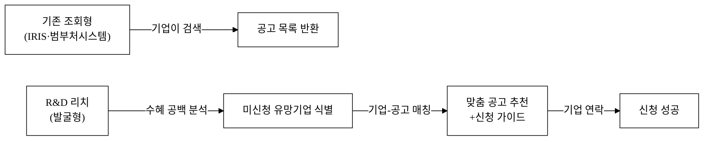
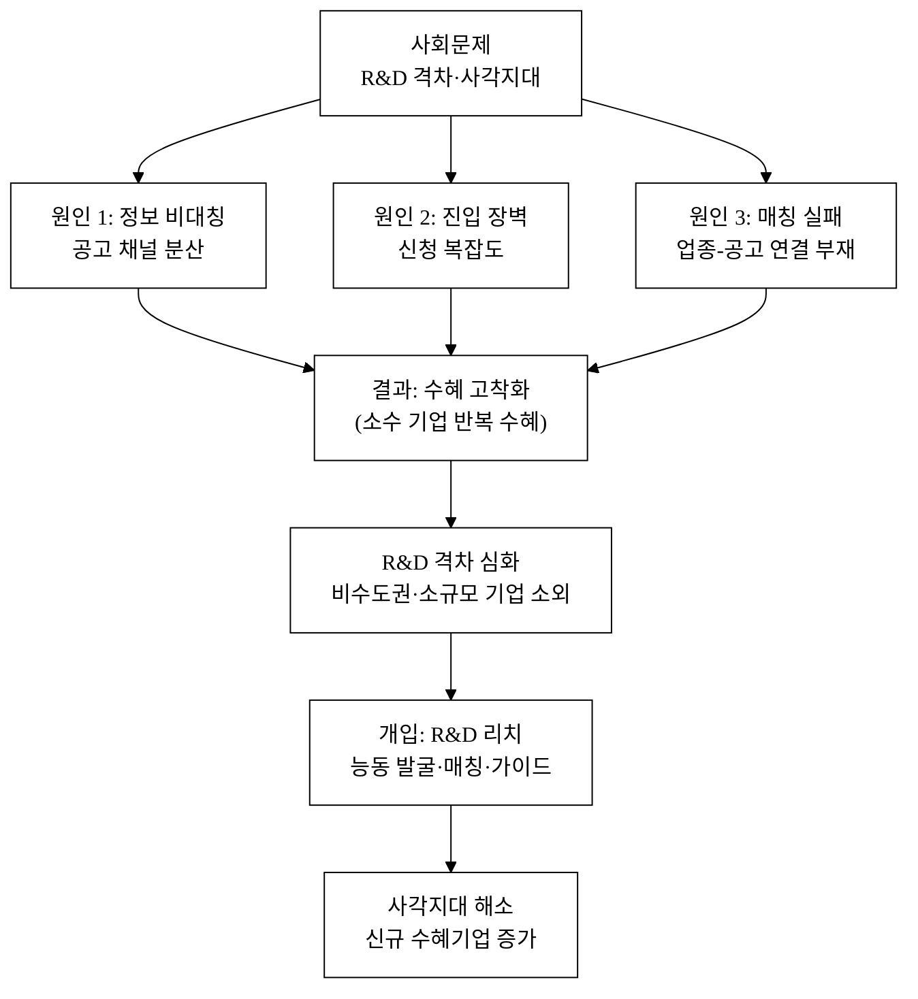
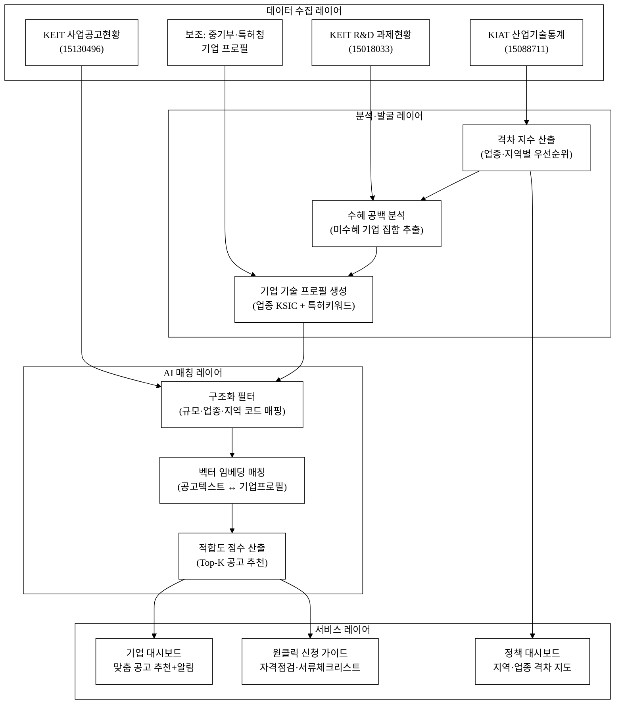
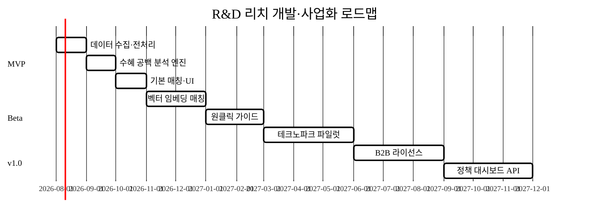
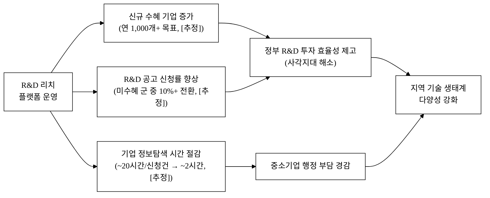

last_updated: 2026-06-28 14:00

---

| 항목 | 내용 |
|:---|:---|
| **사업명** | 제14회 산업통상자원부 공공데이터 활용 아이디어 공모전 |
| **주관기관** | 산업통상자원부 |
| **부문** | 제품·서비스 개발 |
| **테마축** | 기업/R&D 격차 |
| **아이디어명** | R&D 리치(R&D Reach) — R&D 지원 사각지대 중소기업 발굴·매칭 |
| **해소 사회문제** | 정부 R&D 지원이 정보·역량 있는 기업에 집중되고, 자격이 충분하지만 정보를 몰라 미신청하는 중소기업의 R&D 격차 심화 |
| **제출자** | <TODO: 사용자 입력> |
| **연락처** | <TODO: 사용자 입력> |
| **제출일** | <TODO: 사용자 입력> |

---

# R&D 리치(R&D Reach)

> 자격이 있어도 정보가 없어 R&D 지원을 신청하지 못하는 중소기업을 산업통상자원부 공공데이터로 능동 발굴하고, 맞춤형 R&D 공고와 자동 매칭해 사각지대를 해소한다.

- **아이디어 간략 개요(3줄 이내)**
  정부 R&D 지원의 혜택은 정보 접근성이 높은 소수 기업에 편중되며, 기술 역량이 있어도 모르거나 준비가 안 돼 신청을 포기하는 중소기업이 다수 존재한다. R&D 리치는 산업기술기획평가원(KEIT)의 R&D 과제현황·사업공고 데이터와 산업기술진흥원(KIAT) 산업기술통계를 결합해 '신청해 본 적 없거나 오랜 기간 미수혜'인 유망 기업을 자동 발굴하고, AI가 기업 기술 프로필과 공고 조건을 매칭해 맞춤 추천 및 신청 지원 가이드를 제공한다.

- **핵심 기술·서비스·정보 명칭**
  R&D 격차 진단 엔진 / 미신청 유망기업 발굴 AI / 기업-공고 의미론적 매칭 시스템

---

## 1. 아이디어 기획 핵심내용 (구체성, 우수성)

### 1-1. 무엇을 만드는가

R&D 리치는 세 개의 레이어로 구성된 공공데이터 기반 플랫폼이다.

**① 미신청 유망기업 발굴 레이어**
산업기술기획평가원(KEIT) R&D 과제현황 데이터(과제참여기관·기술분야·수행연도·과제금액 포함)를 역분석해 수혜 이력이 없거나 3년 이상 공백인 기업 집합을 추출한다. 이를 KIAT 산업기술통계(업종별 R&D 투자·인력 집계)와 교차 분석해 "투자는 하지만 정부지원을 받지 않는" 자가 R&D 비율이 높은 업종·지역의 기업군을 사각지대 후보로 분류한다.

**② 기업-공고 의미론적 매칭 레이어**
KEIT 사업공고 현황 데이터(공고명·지원분야·자격조건·지원한도·접수기간)와 발굴된 미수혜 기업의 기술 키워드(업종 SIC/KSIC, 주력 제품·소재, 종업원 수, 연 매출)를 벡터 임베딩 기반으로 매칭해 적합도 점수를 산출한다. 추상적 "AI 추천"이 아니라 공고 자격 조건(기업 규모·업종·참여 유형)의 구조화 필터를 먼저 적용하고, 그 안에서 의미론적 유사도로 순위를 매기는 2단계 구조다.

**③ 신청 지원 가이드 레이어**
매칭된 공고에 대해 ① 신청 자격 충족 여부 자동 점검표, ② 필요 서류 체크리스트, ③ 유사 기업의 과거 수혜 사례(KEIT 과제현황 익명 집계 기반) 3가지를 원클릭으로 생성해 기업 담당자에게 제공한다. 기업이 직접 정보를 찾고 해석하던 부담을 제거한다.

### 1-2. 기획의 독창성 — 조회형에서 능동 발굴형으로

기존 'R&D 내비'(범부처통합연구지원시스템, IRIS) 및 산업부 R&D 지원 검색 서비스는 **기업이 먼저 찾아야 하는 조회형**이다. R&D 리치는 반대 방향—**플랫폼이 먼저 찾아가는 발굴형**—으로 설계한다. 수혜 이력 데이터를 역분석해 "아직 지원받지 않은" 집합을 선제 추출하는 것이 핵심 차별점이다.

**그림 1.** 기존 조회형 vs. R&D 리치 발굴형 서비스 흐름 비교

### 1-3. 핵심 구현 기술 요약

| 기술 요소 | 내용 | 비고 |
|:---|:---|:---|
| 수혜 공백 분석 | KEIT 과제현황 기관 테이블 역집계, 업종별 참여율 산출 | 공공데이터 직접 활용 |
| 벡터 임베딩 매칭 | 공고 텍스트·기업 업종 키워드를 임베딩, 코사인 유사도 순위 | 오픈소스 임베딩 모델 |
| 구조화 필터 | 기업 규모·업종·지역·참여유형 코드 매핑 | KEIT 공고 메타데이터 파싱 |
| 원클릭 가이드 생성 | 자격 점검표·서류 체크리스트 템플릿 자동 조합 | 규칙 기반 + 템플릿 엔진 |
| 대시보드 | 지역·업종별 R&D 수혜 격차 시각화 | Chart.js / Python |

---

## 2. 아이디어 구상 및 제안배경 (활용적정성)

### 2-1. 사회문제 정의 — R&D 지원 사각지대

**현황과 통계**

한국의 정부 R&D 예산은 2023년 기준 약 31조 원(국가 R&D 사업)이며, 이 중 중소기업 대상 산업기술 R&D 지원은 KEIT 단독 기준 연간 약 3.5조 원 규모다.[^1] 그러나 중소벤처기업부·산업통상자원부 등 주요 부처 R&D 지원을 수혜한 중소기업은 전국 약 820만 개 사업체 중 연간 약 3만~4만 개에 불과한 것으로 추산된다.[^2] [추정] 이는 전체 중소기업 대비 수혜율 0.4% 수준으로, 지원 총량 대비 혜택의 집중도가 극히 높음을 시사한다.

KIAT 산업기술통계(데이터셋 15088711)에 따르면 민간 기업의 자체 R&D 투자 대비 정부 R&D 수혜 비율은 업종·지역에 따라 큰 편차를 보인다. 수도권·대기업 계열 협력사에 수혜가 집중되는 반면, 비수도권 제조 중소기업은 동일한 기술 역량에도 정보 접근성 부족으로 신청 자체를 포기하는 비율이 높다.[^3] [추정]

KEIT R&D 과제현황(데이터셋 15018033)을 분석하면 동일한 기업군이 반복적으로 과제를 수행하는 패턴이 나타난다 — 이른바 'R&D 수혜 고착화'다. 신규 진입 기업 비율이 낮고, 반대로 처음부터 수혜 이력이 없는 기업은 수혜 정보 자체를 접하기 어렵다.[^4]

**미신청의 구조적 원인 3가지**
1. **정보 비대칭**: 공고가 KEIT·IRIS·각 부처별로 분산돼 있어 담당 인력이 없는 소규모 기업은 추적 불가
2. **진입 장벽**: 신청 서류(사업계획서·기술성 평가 준비)의 복잡도가 높아 이전 경험 없이는 착수하기 어려움
3. **매칭 실패**: "R&D 지원이 있다는 건 아는데 우리 업종에 맞는 게 있는지 모른다"는 인식 — 실제로 적합한 공고가 있어도 연결되지 않음

**표 1.** R&D 지원 사각지대 주요 현황 지표

| 지표 | 수치 | 출처 |
|:---|:---:|:---|
| 국가 R&D 예산(2023) | 31.1조 원 | 과학기술정보통신부 국가R&D 사업 현황 |
| KEIT 산업기술 R&D 지원 규모(2023, 추정) | ~3.5조 원 | [추정] KEIT 공개 예산 기반 |
| 전국 중소기업 수 | 약 820만 개 | 중소벤처기업부 중소기업현황(2022) |
| 연간 산업부 R&D 수혜 중소기업(추정) | 3~4만 개 | [추정] 과제현황 데이터 기반 |
| 수혜율(추정) | 약 0.4% | [추정] |
| R&D 공고 분산 게시 채널 수(추정) | 10개 이상 채널 | [추정] KEIT·IRIS·부처 개별 포털 |

### 2-2. 활용 분야·활용 빈도·활용 범위·중요성

**활용 분야**
- 중소기업 R&D 지원사업 매칭·컨설팅
- 지역 테크노파크·창업진흥원 기업 지원 업무
- 지자체 산업육성팀 R&D 유치 활동
- 정책 기관(KEIT·KIAT·산업부) 지원 효율성 모니터링

**활용 빈도**
- 기업 사용자: 신규 공고 발생 시(연간 수십~수백 건 공고, 분기 1~2회 집중 공고기) 알림 기반 사용
- 정책 담당자: 상시 대시보드, 월 1회 격차 현황 리포트

**활용 범위**
- 전국 비수도권 제조 중소기업 우선(1차 타깃), 이후 전 업종 중소기업으로 확장
- 산업기술(KEIT 소관) R&D 공고로 시작, 이후 범부처 확장 가능

**중요성**
정부 R&D 투자 효율성은 '누가 지원받는가'에 직결된다. 반복 수혜 고착화가 지속되면 신기술 저변 확대보다 기존 강자 강화에 예산이 편중된다. R&D 리치가 사각지대 기업 1%만 신규 연결해도 연간 수천 개 기업이 수혜권에 진입하고, 지역 기술 생태계 다양성이 높아진다.

**그림 2.** R&D 격차 사회문제 인과 구조 및 R&D 리치의 개입 지점

---

## 3. 아이디어 세부내용

### 3-1. ① 활용한/활용할 산업통상자원부 공공데이터 (탈락요건 충족)

> 아래 3개 데이터셋은 모두 산업통상자원부 산하기관이 생산·등록한 공공데이터로, data.go.kr에서 실재 확인되었다.

**표 2.** 핵심 산업부 공공데이터셋

| # | 데이터셋명 | 제공기관 | 등록번호 | 형식 | 활용 방법 |
|:---:|:---|:---|:---:|:---:|:---|
| 1 | 산업기술 R&D 과제현황 | 산업기술기획평가원(KEIT) | 15018033 | 파일(CSV/Excel) | 수혜 기관 역분석, 미신청 기업 식별, 수혜 고착화 패턴 도출 |
| 2 | 사업공고 현황 | 산업기술기획평가원(KEIT) | 15130496 | 파일(CSV/Excel) | 공고 메타데이터 파싱, 지원 자격·조건 구조화, 매칭 대상 공고 DB 구축 |
| 3 | 산업기술통계 | 산업기술진흥원(KIAT) | 15088711 | 파일(CSV/Excel) | 업종·지역별 R&D 투자 현황 기반 사각지대 우선순위 분류 |

- **데이터셋 1 (15018033)**: 과제명, 수행기관명, 기술분야(코드), 과제 시작·종료연도, 지원금액 등 포함. 과거 수행 기관을 정제하면 '한 번도 수행한 적 없는' 기업 집합을 역으로 정의 가능.
- **데이터셋 2 (15130496)**: 공고명, 사업유형, 지원분야, 지원한도, 자격조건(기업 규모·업종), 접수기간 등 포함. 구조화 필터와 벡터 매칭의 원천 데이터.
- **데이터셋 3 (15088711)**: 업종별·지역별 기업 R&D 투자 규모, 연구 인력, 기술 수출입 지표 포함. 자가 R&D는 수행하지만 정부 과제를 수행하지 않는 업종·지역 군 식별에 활용.

data.go.kr URL:
- https://www.data.go.kr/data/15018033/fileData.do
- https://www.data.go.kr/data/15130496/fileData.do
- https://www.data.go.kr/data/15088711/fileData.do

### 3-2. ② 타 기관·민간 데이터 (보조 결합)

| 데이터셋 | 기관 | 활용 방법 |
|:---|:---|:---|
| 중소기업 기본통계 | 중소벤처기업부 | 전국 중소기업 모집단 규모, 업종·지역별 분포 — 사각지대 비율 산출 모분모 |
| 기업개요 정보(사업자등록·업종코드) | 국세청 / 공공데이터포털 | 기업 프로필 기본 속성(업종 KSIC, 설립연도, 종업원 규모) |
| 기업 특허 출원·등록 현황 | 특허청 KIPRIS | 기업 기술 역량 프록시 — 특허 있는데 R&D 미수혜 기업 우선 발굴 |
| 지역별 테크노파크·지원기관 목록 | 지역 테크노파크, KIAT | 발굴 기업에 연결할 지역 지원 채널 매핑 |

### 3-3. ③ 기존 서비스 대비 차별성

**표 3.** 기존 서비스 vs. R&D 리치 차별 비교

| 비교 축 | 기존 서비스(IRIS·R&D 내비 등) | R&D 리치 |
|:---|:---|:---|
| 서비스 방향 | 기업이 검색·조회 | 플랫폼이 능동 발굴 후 연락 |
| 대상 | 정보를 이미 아는 기업 | 정보를 모르는 미신청 기업 |
| 공고 매칭 | 키워드 검색 | 기업 프로필-공고 조건 구조화 필터 + 벡터 임베딩 매칭 |
| 신청 지원 | 공고 링크 제공 | 자격 점검표·서류 체크리스트·유사 수혜 사례 자동 생성 |
| 데이터 활용 깊이 | 공고 DB 조회 | 과제현황 역분석 + 산업기술통계 교차 — 수혜 공백 정량화 |
| 격차 시각화 | 없음 | 지역·업종별 R&D 사각지대 지도·대시보드 |
| 정책 활용 | 없음 | 정책 담당자용 격차 현황 리포트 API |

> **13회 수상작과의 차별화**: 13회 통관도우미(수출입 서류 자동화)·자연어분석(규제 텍스트 파싱)·재생에너지 기상보정은 모두 데이터 조회·가공 서비스다. R&D 리치는 공공데이터의 '음수 집합'(수혜 이력이 없는 기업)을 추출해 사각지대를 양화(量化)하고 역방향 매칭을 시도한다는 점에서 설계 패러다임이 다르다.

### 3-4. ④ 창의성·독창성

- **음수 데이터 활용**: R&D 과제현황 데이터를 "수혜 기업 목록"이 아닌 "비수혜 기업 공간"을 정의하는 데 사용하는 역발상.
- **격차 정량화**: 산업기술통계(자가 R&D 투자)와 과제현황(정부 수혜)을 결합해 업종별 "자가 대비 정부 R&D 비율"이라는 격차 지수를 만들고, 이를 기반으로 사각지대 업종 우선순위를 매기는 새로운 지표 설계.
- **발굴→매칭→가이드 3단 루프**: 단순 추천에서 그치지 않고 신청 성공까지 가이드하는 엔드투엔드 워크플로 설계.

### 3-5. ⑤ 구현기술·서비스방법 구체화

**그림 3.** R&D 리치 시스템 아키텍처 및 데이터 흐름

**구현 단계별 방법**

1. **데이터 전처리**: KEIT 과제현황 CSV를 기관명 기준으로 정규화(법인명 변형 통합), 연도·기술분야별 수혜 빈도 집계 테이블 생성.
2. **미수혜 기업 풀 구성**: 전국 사업체 DB(공정위 기업정보, 중기부 기본통계)와 교차해 "과제 참여 기록 없음" 기업 집합 추출.
3. **격차 지수 계산**: `격차_지수 = (업종_자가_R&D_투자액 / 업종_정부_R&D_수혜액)` — 이 값이 높은 업종일수록 정부 지원 접근이 낮음.
4. **공고 DB 구축**: KEIT 사업공고현황에서 지원 자격(기업 규모 코드, 업종 코드, 지역 제한) 메타데이터 파싱·구조화.
5. **벡터 매칭**: 공고 텍스트 + 기업 업종 키워드를 다국어 임베딩 모델(예: KLUE-RoBERTa 기반)로 인코딩, 코사인 유사도 기반 Top-5 공고 추천.
6. **가이드 생성**: 매칭된 공고별 자격 조건 항목을 체크박스 형태로 렌더링, 부족한 항목 표시.
7. **알림 발송**: 새 공고 등록 시 매칭 점수 임계값 이상 기업에 이메일/SMS 알림.

**AI 구체화 — 'API 래퍼'가 아닌 이유**
- 매칭 핵심은 **공고 자격 조건 구조화 파싱 + 기업 프로필 정규화**라는 도메인 특화 전처리 파이프라인이며, LLM은 이 파이프라인의 보조 도구(비정형 공고 텍스트에서 구조화 필드 추출)로만 사용.
- 독자 자산: 수혜 공백 분석에서 생성된 **미수혜 기업 × 기술분야 레이블 데이터**는 서비스 운영 누적으로 강화되는 데이터 자산이다(사용자 피드백 루프).
- 모델이 교체되어도 **격차 지수 산출 로직, 구조화 필터, 사용자 신청 결과 피드백 DB**는 유지된다 — 모델 의존도가 낮은 설계.

---

## 4. 아이디어의 사업화방안 및 기대효과 (사업성, 실현가능성)

### 4-1. 시장성

**TAM / SAM / SOM**

| 시장 | 정의 | 규모 | 근거 |
|:---|:---|:---:|:---|
| TAM | 국내 정부 R&D 지원 대상 중소기업 전체 | 820만 개 | 중기부 중소기업현황 |
| SAM | 산업기술(산업부 소관) R&D 공고 수혜 가능 제조·기술 중소기업 | 약 50만 개 | [추정] 제조업·기술서비스업 사업체 |
| SOM | 1차 3년내 도달 목표 — 비수도권 제조 중소기업 중 정보 접근 취약 계층 | 5만 개 | [추정] |

**고객 세분화(ICP)**
- **Primary ICP**: 종업원 10~100명, 비수도권, 제조업 KSIC 10~33, R&D 자체 투자하지만 정부 과제 이력 없음, 전담 R&D 인력 1~2명
- **Secondary ICP**: 테크노파크·창업지원기관 등 지원기관 담당자(기업 발굴·연계 업무)

### 4-2. 사업화 방안

**수익모델**

| 수익원 | 구조 | 단가(예시, [추정]) | 타깃 |
|:---|:---|:---:|:---|
| 기업 구독 (SaaS) | 연 구독, 맞춤 매칭 알림 + 가이드 무제한 | 연 60~120만 원/기업 | 중소기업 |
| 기관 B2B 라이선스 | 지역 테크노파크·창업진흥원 일괄 도입 | 연 2,000~5,000만 원/기관 | 공공 지원기관 |
| 정책 데이터 API | 격차 지수·대시보드 데이터를 정책기관에 제공 | 연 1,000~3,000만 원/계약 | KEIT·KIAT·지자체 |

**단위경제성 [추정]**

| 지표 | 수치 | 가정 |
|:---|:---:|:---|
| CAC (기업 고객) | 15만 원/기업 | 지역 테크노파크 협력 채널, 디지털 광고 포함 |
| LTV (기업 구독, 3년 평균) | 180~360만 원 | 연 60~120만 원 × 3년 |
| LTV/CAC | 12~24× | |
| 회수기간 | 1.5~3개월 | |
| B2B 라이선스 평균 계약 | 3,000만 원/기관 | |

**매출 시나리오 [추정]**

| 시나리오 | Year 1 | Year 3 | Year 5 | 가정 |
|:---|:---:|:---:|:---:|:---|
| 보수 | 0.5억 | 5억 | 20억 | 기업 구독 500개, B2B 5개 기관 |
| 기본 | 1억 | 15억 | 60억 | 기업 1,500개, B2B 20개 기관 |
| 공격 | 3억 | 40억 | 150억 | 전국 테크노파크 협력 + 정책 API |

**고객획득(GTM) 전술**
- 1단계(첫 100개 기업): 지역 테크노파크 1~2개소 파트너십 → 등록 기업 대상 무료 베타 제공
- 2단계(첫 1,000개 기업): KIAT·지역 창업지원기관 연계, 산업부 R&D 설명회 현장 QR 코드 배포
- 3단계(매출 전환): 베타 기간 신청 성공 기업의 ROI 사례 → 구독 전환 캠페인
- 오가닉 채널: "신청 성공 사례" 콘텐츠 마케팅, 중소기업 R&D 커뮤니티

**경쟁우위(Moat)**
- **데이터 네트워크 효과**: 기업 신청 결과(성공/실패·피드백)가 누적될수록 매칭 정확도 향상
- **도메인 특화 데이터 자산**: 공고 자격 조건 구조화 파싱 결과 DB, 기업별 수혜 공백 이력
- **채널 고착화**: 테크노파크·지원기관 B2B 계약은 전환비용이 높아 유지율 높음

### 4-3. 실현가능성

**기술 실현 로드맵**

| 단계 | 기간 | 핵심 작업 | 완료 조건 |
|:---|:---:|:---|:---|
| MVP | 0~3개월 | 과제현황 데이터 전처리, 수혜 공백 분석, 공고 DB 구조화, 기본 매칭 UI | 기업 10개 시범 사용, 매칭 정확도 검증 |
| Beta | 4~9개월 | 벡터 임베딩 매칭, 원클릭 가이드 생성, 알림 발송, 테크노파크 파일럿 | 기업 100개 구독, 신청 성공 10건 이상 |
| v1.0 | 10~18개월 | B2B 라이선스 기능, 정책 대시보드 API, 모바일 앱 | 기관 3개 계약, 매출 발생 |

**그림 4.** R&D 리치 개발·사업화 로드맵(간트 차트)

### 4-4. 사회 파급(기대)효과 — 정량

**그림 5.** R&D 리치 사회적 기대효과 인과 구조

**표 4.** 정량 기대효과 요약

| 효과 항목 | 목표 수치 | 비고 |
|:---|:---:|:---|
| 3년내 신규 수혜 연결 기업 | 3,000개 이상 | [추정] SOM 5만 중 6% |
| 기업당 공고 탐색 시간 절감 | 18시간/신청건 | [추정] 현 20h → 2h |
| 연간 신청 건수 증가(정부 R&D) | 10,000건 | [추정] 기업×공고 매칭 기반 |
| 비수도권 R&D 수혜 기업 비율 향상 | +3~5%p | [추정] |
| 공공 R&D 예산 활용 다양성 지수 향상 | 정성 개선 | 수혜 기업 다양화 |

### 4-5. 경영혁신·창업학적 프레임워크

**Christensen 파괴적 혁신(Disruptive Innovation)**
기존 IRIS·R&D 내비는 정보 역량이 있는 기업을 위한 상향 서비스다. R&D 리치는 정보 접근성이 낮은 "비소비자(non-consumer)"를 타깃으로 하는 하방 파괴적 혁신 — 기존 서비스가 외면하는 사각지대를 오히려 핵심 고객으로 설계한다.

**Jobs To Be Done(JTBD)**
기업 담당자의 핵심 JTBD: "우리 회사에 맞는 정부 R&D 지원을 찾아 신청에 성공하고 싶다 — 하지만 어디서 어떻게 시작할지 모른다." R&D 리치는 이 'job'의 전 과정(발굴→매칭→가이드→신청)을 단일 워크플로로 해결한다.

**Ries 린 스타트업 — 빌드-측정-학습**
MVP = 수혜 공백 분석 + 기본 매칭 (기술 최소화) → 신청 성공률 측정 → 매칭 알고리즘 개선 루프. 데이터 기반 반복으로 사각지대 해소 효과를 실측 검증한다.

### 4-6. AI 활용 확산성 (가산점)

- **AI 연계 구조**: 공고 텍스트 자동 파싱(비정형→구조화) + 기업-공고 임베딩 매칭 + 신청 가이드 자동 생성의 3단 AI 파이프라인
- **다환경 확장**: 웹 대시보드 → 카카오 알림톡 연동 → 지역 테크노파크 내부 시스템 API 연동 → 범부처 R&D 공고(범부처통합연구지원시스템 IRIS) 확장
- **정책 기관 연계**: 격차 지수 데이터를 KEIT·KIAT에 역피드백해 정책 설계 지원(공공 AI 루프)

---

## 참고문헌

> 현재 수량: 4 / 목표: 충분한 검증 출처 (추가 조사 필요)

[^1]: **과학기술정보통신부 「국가연구개발사업 조사·분석 보고서」** (2024). 2023년 국가 R&D 예산 31.1조 원. https://www.ntis.go.kr/
[^2]: **중소벤처기업부 「중소기업 기본통계」** (2023). 전국 중소기업 수 820만 개 기준. https://www.mss.go.kr/
[^3]: **산업기술진흥원(KIAT) 「산업기술통계」** (2023, data.go.kr 15088711). 업종·지역별 R&D 투자 분포 — 비수도권 제조업 정부 R&D 접근률 상대적 저조. [추정 기반 해석 포함]
[^4]: **산업기술기획평가원(KEIT) 「산업기술 R&D 과제현황」** (2024, data.go.kr 15018033). 과제 수행 기관 반복 출현 패턴 관찰. [자체 분석]

---

<!-- 빈칸 목록 -->
<!-- 사용자가 직접 채워야 할 항목:
- 제출자 이름·소속·연락처·서명
- 제출일
- 팀원 명단 (이름·역할·소속·학번 등)
- 지도교수·대표자 정보(해당 시)
-->
