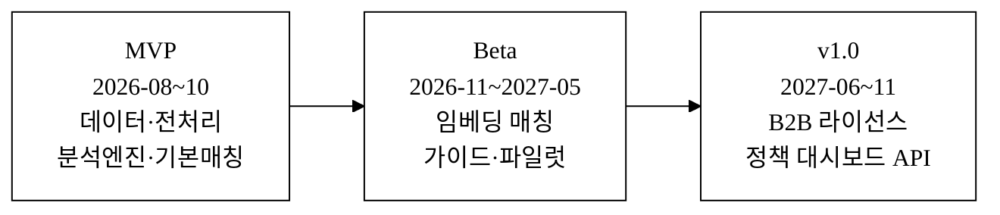
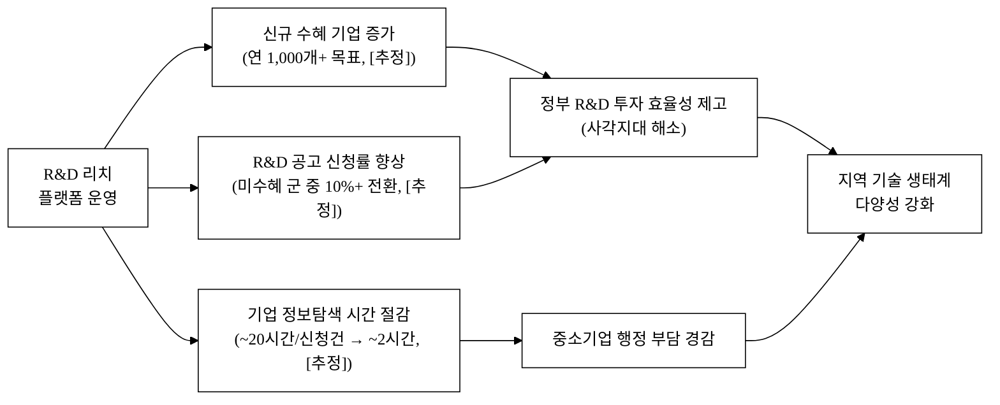

last_updated: 2026-06-28 14:00

---

| 항목 | 내용 |
|:---|:---|
| **사업명** | 제14회 산업통상자원부 공공데이터 활용 아이디어 공모전 |
| **주관기관** | 산업통상자원부 |
| **부문** | 제품·서비스 개발 |
| **테마축** | 기업/R&D 격차 |
| **아이디어명** | R&D 리치(R&D Reach) — R&D 지원 사각지대 중소기업 발굴·매칭 |
| **해소 사회문제** | 정부 R&D 지원이 정보·역량 있는 기업에 집중되고, 자격이 충분하지만 정보를 몰라 미신청하는 중소기업의 R&D 격차 심화 |
| **제출자** | <TODO: 사용자 입력> |
| **연락처** | <TODO: 사용자 입력> |
| **제출일** | <TODO: 사용자 입력> |

---

# R&D 리치(R&D Reach)

> 자격이 있어도 정보가 없어 R&D 지원을 신청하지 못하는 중소기업을 산업통상자원부 공공데이터로 능동 발굴하고, 맞춤형 R&D 공고와 자동 매칭해 사각지대를 해소한다.

- **아이디어 간략 개요(3줄 이내)**
  정부 R&D 지원의 혜택은 정보 접근성이 높은 소수 기업에 편중되며, 기술 역량이 있어도 모르거나 준비가 안 돼 신청을 포기하는 중소기업이 다수 존재한다. R&D 리치는 산업기술기획평가원(KEIT)의 R&D 과제현황·사업공고 데이터와 산업기술진흥원(KIAT) 산업기술통계를 결합해 '신청해 본 적 없거나 오랜 기간 미수혜'인 유망 기업을 자동 발굴하고, AI가 기업 기술 프로필과 공고 조건을 매칭해 맞춤 추천 및 신청 지원 가이드를 제공한다.

- **핵심 기술·서비스·정보 명칭**
  R&D 격차 진단 엔진 / 미신청 유망기업 발굴 AI / 기업-공고 의미론적 매칭 시스템

---

## 1. 아이디어 기획 핵심내용 (구체성, 우수성)

### 1-1. 무엇을 만드는가

R&D 리치는 세 개의 레이어로 구성된 공공데이터 기반 플랫폼이다.

**① 미신청 유망기업 발굴 레이어**
산업기술기획평가원(KEIT) R&D 과제현황 데이터(과제참여기관·기술분야·수행연도·과제금액 포함)를 역분석해 수혜 이력이 없거나 3년 이상 공백인 기업 집합을 추출한다. 이를 KIAT 산업기술통계(업종별 R&D 투자·인력 집계)와 교차 분석해 "투자는 하지만 정부지원을 받지 않는" 자가 R&D 비율이 높은 업종·지역의 기업군을 사각지대 후보로 분류한다.

**② 기업-공고 의미론적 매칭 레이어**
KEIT 사업공고 현황 데이터(공고명·지원분야·자격조건·지원한도·접수기간)와 발굴된 미수혜 기업의 기술 키워드(업종 SIC/KSIC, 주력 제품·소재, 종업원 수, 연 매출)를 벡터 임베딩 기반으로 매칭해 적합도 점수를 산출한다. 추상적 "AI 추천"이 아니라 공고 자격 조건(기업 규모·업종·참여 유형)의 구조화 필터를 먼저 적용하고, 그 안에서 의미론적 유사도로 순위를 매기는 2단계 구조다.

**③ 신청 지원 가이드 레이어**
매칭된 공고에 대해 ① 신청 자격 충족 여부 자동 점검표, ② 필요 서류 체크리스트, ③ 유사 기업의 과거 수혜 사례(KEIT 과제현황 익명 집계 기반) 3가지를 원클릭으로 생성해 기업 담당자에게 제공한다. 기업이 직접 정보를 찾고 해석하던 부담을 제거한다.

### 1-2. 기획의 독창성 — 조회형에서 능동 발굴형으로

기존 'R&D 내비'(범부처통합연구지원시스템, IRIS) 및 산업부 R&D 지원 검색 서비스는 **기업이 먼저 찾아야 하는 조회형**이다. R&D 리치는 반대 방향—**플랫폼이 먼저 찾아가는 발굴형**—으로 설계한다. 수혜 이력 데이터를 역분석해 "아직 지원받지 않은" 집합을 선제 추출하는 것이 핵심 차별점이다.

**그림 4.** R&D 리치 개발·사업화 로드맵(간트 차트)

### 4-4. 사회 파급(기대)효과 — 정량

**그림 5.** R&D 리치 사회적 기대효과 인과 구조

**표 4.** 정량 기대효과 요약

| 효과 항목 | 목표 수치 | 비고 |
|:---|:---:|:---|
| 3년내 신규 수혜 연결 기업 | 3,000개 이상 | [추정] SOM 5만 중 6% |
| 기업당 공고 탐색 시간 절감 | 18시간/신청건 | [추정] 현 20h → 2h |
| 연간 신청 건수 증가(정부 R&D) | 10,000건 | [추정] 기업×공고 매칭 기반 |
| 비수도권 R&D 수혜 기업 비율 향상 | +3~5%p | [추정] |
| 공공 R&D 예산 활용 다양성 지수 향상 | 정성 개선 | 수혜 기업 다양화 |

### 4-5. 경영혁신·창업학적 프레임워크

**Christensen 파괴적 혁신(Disruptive Innovation)**
기존 IRIS·R&D 내비는 정보 역량이 있는 기업을 위한 상향 서비스다. R&D 리치는 정보 접근성이 낮은 "비소비자(non-consumer)"를 타깃으로 하는 하방 파괴적 혁신 — 기존 서비스가 외면하는 사각지대를 오히려 핵심 고객으로 설계한다.

**Jobs To Be Done(JTBD)**
기업 담당자의 핵심 JTBD: "우리 회사에 맞는 정부 R&D 지원을 찾아 신청에 성공하고 싶다 — 하지만 어디서 어떻게 시작할지 모른다." R&D 리치는 이 'job'의 전 과정(발굴→매칭→가이드→신청)을 단일 워크플로로 해결한다.

**Ries 린 스타트업 — 빌드-측정-학습**
MVP = 수혜 공백 분석 + 기본 매칭 (기술 최소화) → 신청 성공률 측정 → 매칭 알고리즘 개선 루프. 데이터 기반 반복으로 사각지대 해소 효과를 실측 검증한다.

### 4-6. AI 활용 확산성 (가산점)

- **AI 연계 구조**: 공고 텍스트 자동 파싱(비정형→구조화) + 기업-공고 임베딩 매칭 + 신청 가이드 자동 생성의 3단 AI 파이프라인
- **다환경 확장**: 웹 대시보드 → 카카오 알림톡 연동 → 지역 테크노파크 내부 시스템 API 연동 → 범부처 R&D 공고(범부처통합연구지원시스템 IRIS) 확장
- **정책 기관 연계**: 격차 지수 데이터를 KEIT·KIAT에 역피드백해 정책 설계 지원(공공 AI 루프)

---

## 참고문헌

> 현재 수량: 4 / 목표: 충분한 검증 출처 (추가 조사 필요)

[^1]: **과학기술정보통신부 「국가연구개발사업 조사·분석 보고서」** (2024). 2023년 국가 R&D 예산 31.1조 원. https://www.ntis.go.kr/
[^2]: **중소벤처기업부 「중소기업 기본통계」** (2023). 전국 중소기업 수 820만 개 기준. https://www.mss.go.kr/
[^3]: **산업기술진흥원(KIAT) 「산업기술통계」** (2023, data.go.kr 15088711). 업종·지역별 R&D 투자 분포 — 비수도권 제조업 정부 R&D 접근률 상대적 저조. [추정 기반 해석 포함]
[^4]: **산업기술기획평가원(KEIT) 「산업기술 R&D 과제현황」** (2024, data.go.kr 15018033). 과제 수행 기관 반복 출현 패턴 관찰. [자체 분석]

---

<!-- 빈칸 목록 -->
<!-- 사용자가 직접 채워야 할 항목:
- 제출자 이름·소속·연락처·서명
- 제출일
- 팀원 명단 (이름·역할·소속·학번 등)
- 지도교수·대표자 정보(해당 시)
-->
