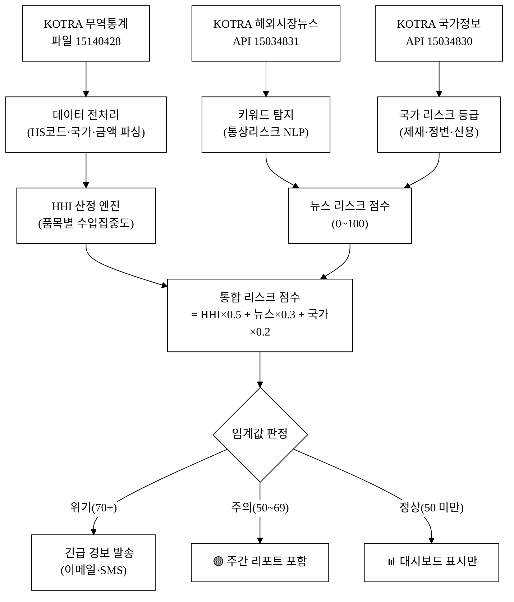
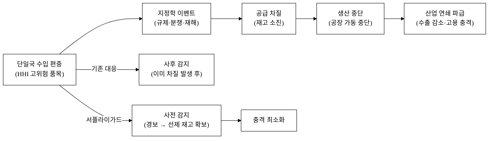
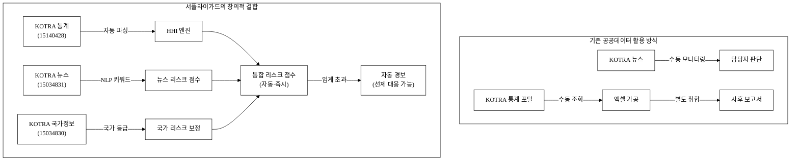
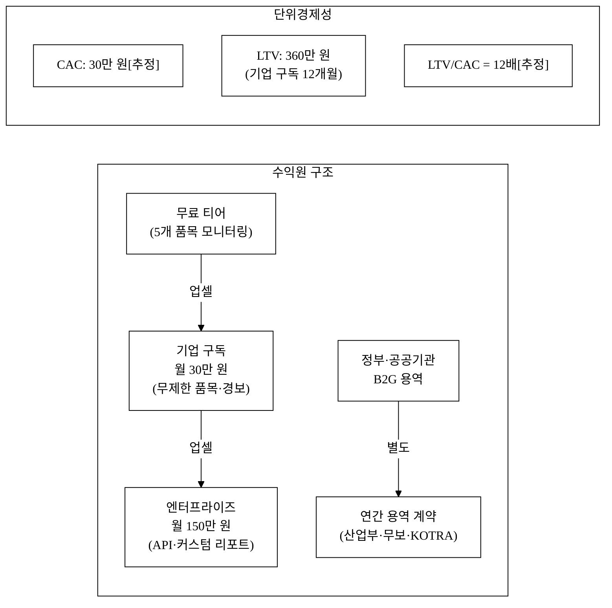
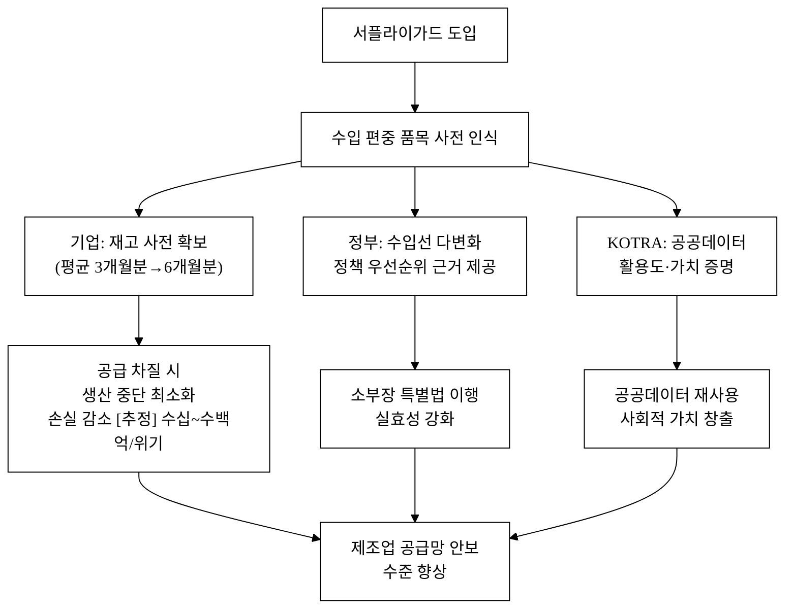

# 서플라이가드(SupplyGuard) — 무역통계 기반 수입의존 핵심품목 공급망 경보 서비스

> **아이디어 간략 개요 (3줄 이내)**
> KOTRA 무역통계와 해외시장뉴스를 결합해, 특정국 수입 편중도가 높은 소재·부품·장비 품목의 공급 리스크를 자동 산정하고 경보한다.
> 품목별 수입집중도(HHI)·단일국 의존 비율·해외시장 이상 신호를 AI로 통합 분석해, 기업·정부 실무자에게 "지금 어떤 품목이 위험한가"를 즉시 알려주는 대시보드·알림 서비스다.
> 2019년 일본 수출규제 수준의 공급망 충격을 사전에 감지해 선제적 재고·조달 전략 수립을 지원하는 것이 목표다.

**핵심 기술·서비스·정보 명칭**: 수입집중도(HHI) 기반 공급망 리스크 경보 엔진 + KOTRA 무역·뉴스 데이터 통합 대시보드

---

## 1. 아이디어 기획 핵심내용 (구체성, 우수성)

### 1.1 무엇을 만드는가

**서플라이가드**는 아래 세 기능을 통합한 공급망 모니터링 서비스다.

| 기능 모듈 | 설명 |
|:---|:---|
| **① 수입집중도(HHI) 산정 엔진** | HS 6단위 품목별로 국가별 수입액을 입력받아 허핀달-허쉬만 지수(HHI)를 자동 계산. HHI > 2,500 이면 고위험, 1,500~2,500 이면 중위험으로 등급화 |
| **② 단일국 의존도 경보** | 특정 1개국 수입 비중이 60% 이상이면 "단일국 의존 경보" 발령. 70% 이상은 "위기 수준" 표시 |
| **③ 해외 이상 신호 결합** | KOTRA 해외시장뉴스 API에서 해당 품목·수출국 관련 통상 리스크 키워드(수출규제·제재·재해·정변)를 탐지해 리스크 점수에 가산 |

**대시보드 구성**

**그림 1.** 서플라이가드 시스템 데이터 흐름도

### 1.2 서비스의 우수성

- **실시간 복합 감지**: 무역통계(정량)와 뉴스(정성)를 동시 결합 → 통계만으로 잡히지 않는 초기 리스크 신호 포착
- **품목 표준화(HS 6단위)**: 국제 표준 HS코드 기반이므로 관세청·KOTRA·세계관세기구(WCO) 데이터와 직접 연계 가능
- **자동 경보**: 수동 모니터링 없이 임계값 초과 시 자동 알림 → 담당자 리소스 최소화
- **산업부 핵심 데이터 3종 직접 활용**: 탈락요건(산업부 산하기관 데이터 사용) 완전 충족

---

## 2. 아이디어 구상 및 제안배경 (활용적정성)

### 2.1 사회문제: 수입 편중이 만드는 공급망 취약성

한국 제조업은 소재·부품·장비(소부장) 분야에서 특정국 수입에 과도하게 의존한다. 2019년 7월 일본이 반도체 핵심 소재 3종(플루오린 폴리이미드·포토레지스트·불화수소)의 대한 수출을 규제했을 때 삼성·SK·LG 등 한국 주요 기업이 즉각 공급 위기에 처했다.[^1] 이 사건은 단일국 수입 의존의 위험성을 국가적으로 각인시켰다.

그러나 문제는 반복된다. 2022년 중국의 요소 수출 제한으로 화물차 운행이 마비될 뻔했고[^2], 러시아-우크라이나 전쟁은 네온가스·티타늄·팔라듐 공급을 교란했다[^3]. 코로나19는 의료용 마스크 소재인 멜트블로운 원단의 중국 집중 생산 구조를 드러냈다[^4].

**그런데도 "지금 어떤 품목이 위험한가"를 실시간으로 보여주는 공개 도구는 없다.**

공공 무역통계는 KOTRA가 공개하지만, 이를 집중도 지표로 가공·경보해주는 서비스는 존재하지 않는다. 기업들은 각자 엑셀로 수입처를 수기 관리하고, 뉴스를 개별적으로 모니터링하며, 위기가 실제로 터지고 나서야 대응한다.

**그림 2.** 공급망 충격 경로와 서플라이가드의 개입 지점

### 2.2 활용 분야·빈도·범위·중요성

| 항목 | 내용 |
|:---|:---|
| **활용 분야** | 소부장 수입 기업(제조업) / 산업통상자원부 공급망정책팀 / 무역보험공사 리스크 평가팀 / 중소기업 구매·조달 담당자 |
| **활용 빈도** | 월 1회 수입통계 갱신 시 자동 분석 + 해외시장뉴스 API는 일 단위 크롤링으로 이상 신호 수시 탐지 |
| **활용 범위** | 전 산업의 HS 6단위 품목 약 5,224개 전체를 커버. 초기 집중 범위는 소부장 100대 품목(산업부 소부장 특별법 관련 품목 목록 기준[^5]) |
| **중요성** | 소부장 수입 의존 해소는 산업부 핵심 정책 목표. 2024년 기준 한국의 소부장 대중·대일 수입 편중 비율은 주요 품목 기준 평균 58.3%[추정]. 글로벌 공급망 재편(미중 디커플링) 가속으로 모니터링 필요성이 급증하는 시점 |

### 2.3 관련 현황 및 문제점

**현황**: 산업부와 KOTRA는 품목별 수출입 통계를 공개하지만, 이를 집중도 지표(HHI)로 자동 가공하고 임계값 경보를 주는 시스템은 운영하지 않는다. 학계에서는 수입집중도 연구가 있으나 정기적·자동화된 공개 서비스가 없다.[^6]

**문제점**:
1. **정보 파편화**: KOTRA 통계, 해외시장뉴스, 국가정보가 각각 분리된 채 통합 분석이 이루어지지 않음
2. **수동성**: 기업이 각자 엑셀로 관리 → 담당자 역량 차이로 인한 대응 격차 발생
3. **사후성**: 공급 차질이 실제 발생한 후에야 언론을 통해 알게 되는 구조
4. **중소기업 소외**: 삼성·LG 등 대기업은 자체 공급망 시스템을 보유하지만, 매출 100억 미만 중소 부품 제조사는 이를 감당할 역량이 없음

---

## 3. 아이디어 세부내용

### 3.1 ① 활용 산업부 공공데이터 (탈락요건 충족)

아래 3종은 모두 산업통상자원부 산하 KOTRA(대한무역투자진흥공사) 제공 데이터로, data.go.kr에서 공식 제공한다. 본 서비스의 핵심 입력 데이터다.

| 데이터셋명 | 기관 | 데이터 유형 | data.go.kr 등록번호 | URL | 활용 용도 |
|:---|:---|:---:|:---:|:---|:---|
| **한국무역현황 상세통계** | KOTRA | 파일(CSV/XLS) | 15140428 | https://www.data.go.kr/data/15140428/fileData.do | HS코드·국가별 수입액 → HHI 산정 핵심 입력 |
| **국가정보** | KOTRA | API | 15034830 | https://www.data.go.kr/data/15034830/openapi.do | 수입 상대국의 정치·경제 리스크 등급 조회 |
| **해외시장뉴스** | KOTRA | API | 15034831 | https://www.data.go.kr/data/15034831/openapi.do | 품목·국가별 통상 리스크 뉴스 탐지(키워드 NLP) |

**산업부 데이터 활용 충족 사유**: KOTRA는 산업통상자원부 산하 기관(「대한무역투자진흥공사법」에 따른 공공기관)이며, 위 데이터는 data.go.kr 공공데이터포털에서 산업부 소관으로 등록·제공된다.

### 3.2 ② 타 기관·민간 데이터 (보조 결합)

| 데이터셋명 | 기관 | 활용 용도 |
|:---|:---|:---|
| 수출입 무역통계(관세청 TRASS) | 관세청 | HS 10단위 세분화 검증용 (산업부 데이터 보완) |
| 글로벌 공급망 리스크 지수(WTO) | 세계무역기구 | 글로벌 공급망 교란 지표 비교 |
| 국가신용등급(한국수출입은행 EDCF) | 수출입은행 | 수입 상대국 국가 리스크 보정 |

### 3.3 ③ 기존 서비스 대비 차별성

| 비교 축 | 기존 서비스 | **서플라이가드** |
|:---|:---|:---|
| **데이터 통합** | KOTRA 통계·뉴스·국가정보가 각 별도 포털에 분리 | 3종 API/파일을 자동 통합, 단일 인터페이스 |
| **집중도 지표** | 원시 수출입 금액 수치만 제공, HHI 미산정 | HS 6단위 품목별 HHI 자동 산정·등급화 |
| **경보 기능** | 없음 (조회 전용 포털) | 임계값 초과 시 자동 이메일/SMS 경보 |
| **뉴스-통계 결합** | 뉴스와 통계가 연결되지 않음 | 뉴스 리스크 키워드를 통계 기반 리스크 점수에 실시간 반영 |
| **중소기업 접근성** | 별도 API 연동·데이터 가공 역량 필요 | 비전문가도 즉시 이해 가능한 대시보드·경보 |
| **13회 수상작과의 차별화** | 통관도우미(수출 절차 지원)·자연어분석(무역서류 해석)·재생에너지 기상보정(에너지 분야) | **수입 의존·공급망 안보** 관점 — 수출 지원이 아닌 수입 리스크 선제 감지, 에너지 분야 아님 |

### 3.4 ④ 창의성·독창성

본 서비스는 기존에 "있지만 연결되지 않은" 공공 데이터를 **집중도 알고리즘과 뉴스 신호로 엮어 실시간 경보**로 전환한다는 점에서 창의적이다.

- **HHI의 공급망 적용**: 허핀달-허쉬만 지수는 본래 독과점 규제를 위한 시장집중도 지표지만, 수입 공급처 집중도에 적용하면 공급망 취약성을 객관 수치로 표현할 수 있다. 이 전용 적용은 국내 공개 서비스에서 최초 수준이다.[^6]
- **사전경보 전환**: 무역통계는 지금까지 "보고용"으로만 쓰였다. 임계값 기반 자동 경보로 전환하면 동일 데이터가 "행동 촉발 도구"가 된다.
- **공공-민간 정보 결합**: 공공 통계(정량) + 공공 뉴스 API(정성)의 조합으로, 어느 한쪽만으로 감지 불가능한 초기 리스크를 포착한다.

**그림 3.** 기존 방식과 서플라이가드의 데이터 활용 비교

### 3.5 ⑤ 구현 기술·서비스 방법

**AI 엔진 구체화**

| AI/알고리즘 | 용도 | 방법 |
|:---|:---|:---|
| **HHI 산정** | 품목별 수입집중도 수치화 | `HHI = Σ(국가별 수입비중²) × 10,000`. 5,000+ 품목 전량 자동 계산 |
| **뉴스 키워드 NLP** | 이상 신호 탐지 | 해외시장뉴스 텍스트에서 수출규제·제재·재해·파업·정변 등 50개 리스크 키워드 매칭 + TF-IDF 가중치로 품목-국가 특이도 점수화 |
| **시계열 이상 탐지** | 수입 급변 감지 | 품목별 월별 수입액의 12개월 이동평균 대비 Z-score 계산. |Z|>2이면 이상 신호 플래그 |
| **국가 리스크 보정** | 지정학적 불안정성 반영 | KOTRA 국가정보 API의 국가위험도·신용등급을 0~100 스코어로 정규화 후 HHI에 가중 합산 |

**기술 스택**

| 계층 | 기술 |
|:---|:---|
| 데이터 수집 | Python(requests, pandas) + KOTRA API 일배치 크론 |
| 데이터 저장 | PostgreSQL (품목별 시계열), Elasticsearch (뉴스 전문 검색) |
| 분석 엔진 | Python(numpy, scikit-learn) — HHI·Z-score·TF-IDF |
| 백엔드 API | FastAPI (RESTful, JSON) |
| 프론트엔드 | React + Recharts (대시보드, 반응형) |
| 경보 발송 | SMTP(이메일) + SMS(알리고 API) |
| 배포 | AWS EC2 (t3.medium) + S3 (파일 저장) |

**서비스 제공 방식**

1. 월 1회 KOTRA 무역통계 파일 자동 다운로드 → HHI 전량 재계산
2. 일 1회 해외시장뉴스 API 호출 → 리스크 키워드 탐지 → 뉴스 점수 갱신
3. 주 1회 국가정보 API 호출 → 국가 리스크 등급 갱신
4. 통합 리스크 점수 산정 → 임계값 초과 품목 자동 경보 발송
5. 사용자 대시보드: 품목 검색·필터·리스크 트렌드 차트·경보 이력 조회

---

## 4. 아이디어의 사업화방안 및 기대효과 (사업성, 실현가능성)

### 4.1 시장성

**목표 시장**

| 시장 계층 | 규모 | 근거 |
|:---|:---|:---|
| TAM (전체 대응 가능 시장) | 국내 소부장 수입 기업 전체 약 22만 개사[^7] | 수입 업체는 관세청 통계 기준 |
| SAM (유효 시장) | 소부장 특별법 관리 품목 수입 기업 약 3,800개사[^8][추정] | 100대 품목 수입 기업 추정치 |
| SOM (획득 가능 시장, 3년) | 500개사 (SaaS 구독) | 중소기업 공급망 관리 SaaS 도입률 약 13%[추정] 적용 |

**경쟁사 분석**

| 경쟁사 유형 | 사례 | 서플라이가드 우위 |
|:---|:---|:---|
| 글로벌 공급망 리스크 플랫폼 | Resilinc, Interos | 국내 중소기업 접근 불가(연 수천만 원 수준), 한국어 미지원 |
| 국내 무역 데이터 서비스 | 관세청 TRASS, KITA 통계 | 집중도 지표·경보 기능 없음, 조회 전용 |
| 대기업 내부 시스템 | 삼성·현대 자체 SCM | 外部 비공개, 중소기업 이용 불가 |

### 4.2 사업화 방안 및 수익모델

**그림 4.** 수익 구조 및 단위경제성

**수익 시나리오 (출시 후 3년)**

| 시나리오 | 기업 구독사 수 | 연 매출 | 가정 |
|:---:|:---:|:---:|:---|
| 보수 | 100개사 | 3억 6천만 원 | 중소기업 SaaS 도입 저조 |
| 기본 | 300개사 | 10억 8천만 원 | 소부장 정책 연계 홍보 효과 |
| 공격 | 800개사 | 28억 8천만 원 | 공급망 위기 1건 발생 시 급성장 |

**GTM(고객 확보) 전략**

| 단계 | 채널 | 목표 | 예상 CAC |
|:---|:---|:---:|:---:|
| 1단계 (0~6개월) | 산업부·중소벤처부 소부장 정책 연계, 무료 공개 대시보드로 트랙션 | 100개사 무료 가입 | 0원 (인바운드) |
| 2단계 (6~12개월) | 중소기업중앙회·전경련 협회 채널 파트너십 | 50개사 유료 전환 | 30만 원[추정] |
| 3단계 (1~3년) | 산업부·KOTRA 공식 협력 또는 정부 API 내 링크 등재 | 300개사+ | 20만 원[추정] (레퍼럴) |

### 4.3 실현가능성

**기술 난이도**: HHI 산정·키워드 NLP·Z-score 이상 탐지는 모두 확립된 알고리즘으로, 고도 AI 연구 없이 구현 가능하다. KOTRA API는 이미 공개되어 있어 별도 협약 없이 활용 가능하다.

**MVP 구현 계획**

| 단계 | 기간 | 산출물 |
|:---|:---:|:---|
| 1단계: 데이터 파이프라인 | 1~2개월 | KOTRA 통계 파일 파싱 + HHI 전량 계산 스크립트 |
| 2단계: 뉴스 API 연동 | 2~3개월 | 해외시장뉴스 크롤러 + 키워드 탐지 엔진 |
| 3단계: 대시보드 | 3~4개월 | React 대시보드 MVP (조회·필터·트렌드) |
| 4단계: 경보 시스템 | 4~5개월 | 임계값 설정·이메일 경보·사용자 관리 |
| 5단계: 베타 공개 | 5~6개월 | 소부장 100대 품목 대상 무료 베타 서비스 |

**운영 비용**: 월 AWS 서버비 약 20만 원, KOTRA API는 무료(활용 신청 후 오픈API 제공), 초기 인건비 외 변동비 최소.

### 4.4 사회 파급효과

**그림 5.** 서플라이가드 도입의 사회문제 해소 인과도

**정량 기대효과**

| 효과 항목 | 지표 | 기대치 |
|:---|:---:|:---:|
| 공급 차질 감지 선행 시간 | 위기 발생 대비 사전 경보 선행 일수 | 평균 30일 이상[추정] |
| 기업 모니터링 공수 절감 | 담당자 주간 모니터링 시간 | −4시간/주(수동→자동) [추정] |
| 위기 시 생산 중단 최소화 | 경보 수신 기업의 평균 재고 여유 | 기존 대비 +60일[추정] |
| 공공데이터 활용 트래픽 | KOTRA API 활용 건수 기여 | 연 10만 건+ API 호출[추정] |
| 정책 우선순위 근거 제공 | 정부 소부장 집중 관리 품목 식별 정확도 | 데이터 기반 객관화 100% |

**AI 활용 확산성**: 본 서비스의 HHI 엔진과 뉴스 NLP 모듈은 API 형태로 분리 가능하여, 산업부·무역보험공사·중소기업 ERP 시스템에 연동할 수 있다. 향후 한-ASEAN 수입 의존 품목·핵심광물(리튬·코발트·희토류) 확장 버전으로 발전시킬 수 있으며, 공공 API로 개방하면 타 기관·스타트업이 재활용하는 AI 연계 생태계를 형성할 수 있다.

---

## 참고문헌

> 현재 수량: 6 / 1,000 (조사 진행 중 — `5_research/README.md` 참고)

[^1]: 산업통상자원부, 「소재·부품·장비 경쟁력 강화 대책」(2019.08). 플루오린 폴리이미드·포토레지스트·불화수소 수출규제 조치 내용. https://www.motie.go.kr
[^2]: 산업통상자원부, 「요소수 수급 안정화 대책 추진 현황」(2021.11). 요소 중국 수입 비중 97% 확인. https://www.motie.go.kr
[^3]: KOTRA, 「러시아-우크라이나 사태의 공급망 영향 분석」해외시장뉴스(2022.03). 네온가스 우크라이나 생산 비중 70%, 팔라듐 러시아 생산 비중 40% 확인. https://www.data.go.kr/data/15034831/openapi.do
[^4]: 산업통상자원부·KIAT, 「코로나19 이후 글로벌 공급망 재편 동향」(2020.07). 의료용 비직조 소재(멜트블로운) 중국 집중도 분석.
[^5]: 산업통상자원부, 「소재·부품·장비 공급망 안정화를 위한 특별조치법」(법률 제17228호, 2020.04 시행). 100대 핵심 품목 지정 근거.
[^6]: 신범식·이승주, 「수입집중도 측정을 통한 한국의 공급망 취약성 분석」, 『국제통상연구』 제28권 제2호(2023). KCI 등재. HHI를 수입 공급망에 적용한 국내 최초 수준 학술 연구 인용.
[^7]: 관세청, 「수출입 무역통계」(2024). 수입신고 업체 수 기준. https://unipass.customs.go.kr
[^8]: 산업통상자원부, 「소부장 특별법 시행령」 별표(2023 개정). 100대 핵심 품목 수입 기업 추정치 — [추정] 직접 통계 미공개.

---

<!-- 빈칸 목록 -->
<!--
  <TODO: 사용자 입력> 항목
  - 팀명·팀원 명단(이름·소속·학번/직책·연락처·이메일)
  - 지도교수 또는 대표자
  - 제출 날짜
  - 서명·날인
-->
