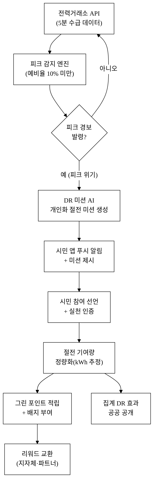
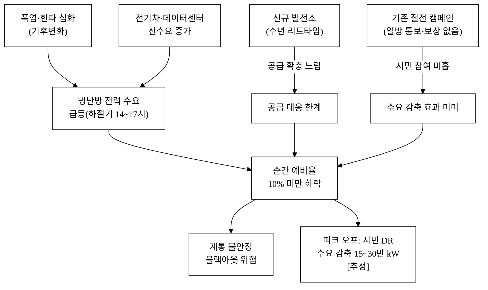
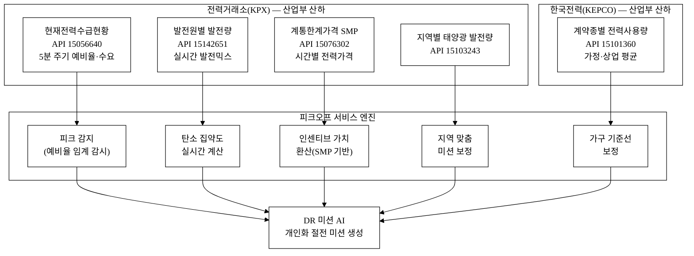
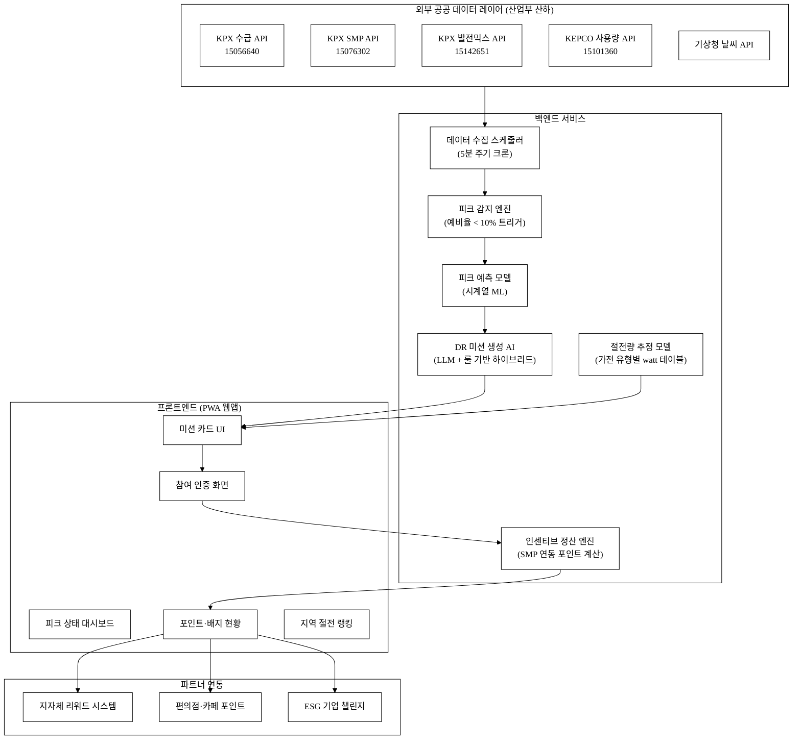
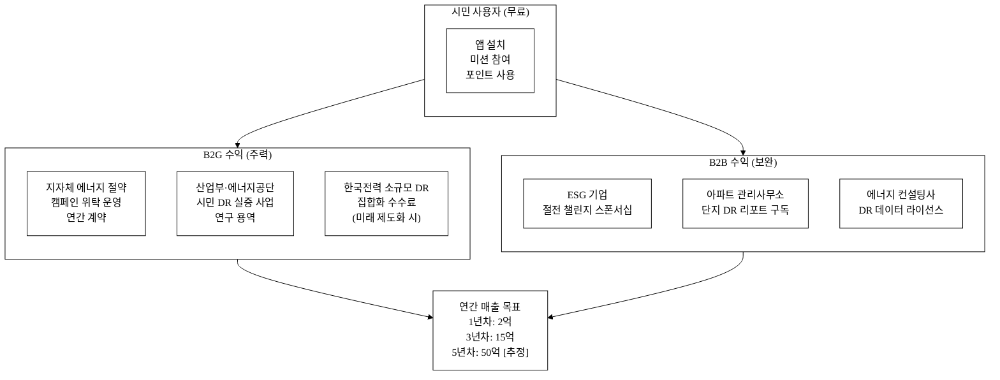

# 피크오프(PeakOff) — 전력 피크 시 시민 수요반응(DR) 절전 참여 플랫폼

- **아이디어 간략 개요 (3줄):** 전력거래소 실시간 수급 API로 피크 위기를 감지하고, AI가 개인·세대별 맞춤 절전 미션을 제시하며, 참여 실적에 따라 포인트·그린 배지를 보상하는 시민 수요반응(DR, Demand Response) 플랫폼이다. 공급 확장 없이 수요 측 자발 절전으로 예비율을 방어하며, 누적 절전 데이터는 한국판 시민 DR 신호 체계의 씨앗 데이터로 활용된다. 공모전 탈락 요건을 충족하는 산업통상자원부 산하 전력거래소·한국전력 공공 API를 핵심 데이터 소스로 활용한다.
- **핵심 기술·서비스·정보 명칭:** 실시간 전력 피크 감지 엔진 / 개인화 DR 미션 AI / 시민 절전 참여 게임화 인터페이스 / 절전 기여량 정량화·인센티브 정산 시스템

---

## 1. 아이디어 기획 핵심내용 (구체성·우수성)

### 1.1 무엇을 만드는가

**피크오프(PeakOff)** 는 전력 수급 긴장 상황을 시민에게 실시간으로 알리고, 각 가정·개인이 수행 가능한 절전 미션을 제시하며, 참여를 인센티브로 보상하는 **시민 참여형 수요반응(Demand Response, DR) 플랫폼**이다.

핵심 구성 세 가지:

| 구성 | 기능 |
| :--- | :--- |
| **피크 감지 엔진** | 전력거래소 API 5분 주기 폴링 → 예비율·수요 임계값 초과 시 자동 경보 발령 |
| **DR 미션 AI** | 사용자 가전·생활 패턴 입력값 + 시간대·날씨 기반 개인화 절전 미션 생성(에어컨 온도 1℃ 상향, 세탁기 예약, 전기차 충전 지연 등) |
| **인센티브 엔진** | 절전 참여 선언 + 실천 인증 → 그린 포인트 적립 → 지자체·상업 파트너 리워드 교환 |

### 1.2 서비스 흐름

**그림 1.** 피크오프 서비스 전체 흐름

### 1.3 차별성 요약 (상세는 §3.3)

기존 '절전 캠페인'은 일방 통보에 그쳤다. 피크오프는 **① 실시간 위기 신호 연동 → ② 행동 가능한 개인화 미션 → ③ 즉각 보상**의 3단 루프를 갖춘 한국 최초 시민 DR 플랫폼으로, 한국전력 계약형 DR 제도(대형 수용가 대상)와 달리 **소규모 가정·소상공인 단위**까지 DR 참여 채널을 확장한다.

---

## 2. 아이디어 구상 및 제안배경 (활용적정성)

### 2.1 사회문제: 전력 피크 위기와 시민 수요반응 수단 부재

**2.1.1 역대 최고 전력 수요와 예비율 위기**

한국의 최대 전력 수요는 해마다 경신되고 있다. 2023년 여름 최대 전력 수요는 93.6 GW를 기록하며 역대 최고치를 달성했으며[^1], 2024년 여름(8월)에도 이를 웃도는 수준의 수요가 예측되었다[^2]. 전력거래소 전력계통 운영 기준에 따르면 순간 예비율이 10% 미만으로 하락하면 '주의', 5% 미만이면 '경계' 단계로 격상되며, 실제로 여름 폭염 시 수 차례 주의 단계가 발령된 바 있다[^3].

문제는 수요 측면이다. 공급 용량 확충(신규 발전소·송전망)은 수년 단위 리드타임이 필요하지만, **전력 수요는 폭염·한파와 맞물려 수 시간 내 급등**한다. 2022년 9월에는 갑작스러운 냉방 부하 증가로 예비율이 급격히 하락, 긴급 수요 감축 명령이 발령된 사례가 있었다[^4].

| 지표 | 수치 | 출처 |
| :--- | :---: | :--- |
| 2023년 하계 최대 전력 수요 | 93.6 GW | 전력거래소 전력통계정보시스템[^1] |
| 예비율 '주의' 기준 | 10% 미만 | 전력거래소 전력계통 운영기준[^3] |
| 피크 지속 시간대 (하절기) | 14~17시 | 전력거래소 시간대별 수요 통계[^5] |
| 계통한계가격(SMP) 피크 배율 | 2~4배 (비피크 대비) | 전력거래소 SMP 통계[^6] |
| 주거·상업 부문 전력소비 비중 | 약 44% | 한국전력 전력통계[^7] |

**그림 2.** 전력 피크 위기 발생 구조 (사회문제 인과도)

**2.1.2 기존 DR 제도의 한계: 대형 수용가 편중**

한국전력의 계약형 수요반응(DR) 프로그램은 1 MW 이상 대형 계약 수용가(공장·대형빌딩)에게 전력 감축 요청 시 인센티브를 지급하는 방식으로 운영된다[^8]. 2023년 기준 DR 자원 등록 용량은 약 3,700 MW에 달하지만[^9], 이는 산업·상업 대형 수용가가 거의 전부이며, **일반 가정 및 소규모 상가는 DR 시장 진입 자격 자체가 없다**[^10]. 주거·소상공인 전력 소비가 전체의 44% 이상을 차지하는 현실에서[^7], 이 거대한 수요 감축 잠재력이 활용되지 못하고 있다.

**2.1.3 활용분야·빈도·범위·중요성**

| 항목 | 내용 |
| :--- | :--- |
| **활용분야** | 전력 계통 운영 보조 / 시민 에너지 교육·행동 변화 / 탄소 감축 실적 집계 / 지자체 에너지 정책 지원 |
| **활용빈도** | 연간 하절기(6~9월)·동절기(12~2월) 피크 시즌 집중, 하루 수 차례 알림. 비피크 기간에도 SMP 가격 신호 기반 자발 절전 유도 |
| **활용범위** | 전국 가정·소상공인·직장인 스마트폰 사용자. 시범 서비스 1개 도시(50만 가구) → 전국 2,200만 가구 확장 가능 |
| **중요성** | 블랙아웃 1회 경제 피해 추정 약 3조 원[^11] / 피크 30만 kW 감축 = 가스 복합화력 1기 가동 비용 절감 상당 / 시민 DR은 OECD 선진국(미국 PJM, 영국 FFR)에서 이미 검증된 주요 전력 위기 대응 수단[^12] |

---

## 3. 아이디어 세부내용

### 3.1 활용 산업통상자원부 공공데이터 (탈락요건 충족)

> **⚠️ 탈락요건**: 산업통상자원부 소관 기관 공공데이터 미활용 시 평가 제외 — 아래 데이터셋이 피크오프의 핵심 동력이다.

| 구분 | 데이터셋명 | 소관 기관 | 데이터 ID | 형식 | 활용 목적 |
| :---: | :--- | :--- | :--- | :---: | :--- |
| **핵심 ①** | 현재전력수급현황 | 전력거래소(KPX) | 15056640 | API | 5분 단위 공급능력·수요·예비율 → 피크 감지 엔진 트리거 |
| **핵심 ②** | 발전원별 발전량 현황 | 전력거래소(KPX) | 15142651 | API | 실시간 발전 믹스(원자력·가스·신재생) → 탄소 집약도 계산 |
| **핵심 ③** | 계통한계가격(SMP) | 전력거래소(KPX) | 15076302 | API | 시간별 전력 시장가격 → 경제적 절전 가치 환산·인센티브 근거 |
| **보완 ④** | 계약종별 전력사용량 | 한국전력(KEPCO) | 15101360 | API | 계약종별 평균 사용량 → 가정·소상공인 절전 기준선 보정 |
| **보완 ⑤** | 지역별 시간별 태양광 발전량 | 전력거래소(KPX) | 15103243 | API | 지역별 재생에너지 공급량 → 지역 맞춤 미션 정교화 |

전력거래소(KPX)는 산업통상자원부 산하 공공기관(「전력거래소법」 제2조)이며, 한국전력(KEPCO) 또한 산업통상자원부 산하 공기업(「한국전력공사법」 제1조)으로 모두 탈락요건을 충족한다[^13].

**그림 3.** 핵심 데이터 흐름 (산업부 공공 API → 서비스 레이어)

### 3.2 보완 활용 데이터 (타 기관·민간)

| 데이터셋명 | 기관 | 활용 목적 |
| :--- | :--- | :--- |
| 기상청 단기예보 API | 기상청(행정안전부) | 온도·체감온도 → 피크 예측 정확도 향상 |
| 전기차 급속충전기 지역별 충전정보 (15097923) | 에너지공단(산업부 산하) | 전기차 충전 지연 미션 대상 식별 |
| 지역별 전기차 충전소 현황 (15039765) | 한국전력(KEPCO) | 충전소 분포 기반 지역 미션 설계 |
| 공공기관 에너지 사용량 공시 | 에너지공단 | 공공기관 참여 DR 기준선 설정 |
| 스마트홈 가전 소비전력 데이터 | 민간(삼성 SmartThings, LG ThinQ 협력 시) | 가전별 절전 효과 정밀화 [추정: 협력 성사 전제] |

### 3.3 기존 서비스 대비 차별성

**표 1.** 경쟁 서비스·제도 비교

| 비교 항목 | 한국전력 계약형 DR | 기존 절전 캠페인 앱 | 저탄소타임 (아이디어 17) | 정전알림 서비스 (아이디어 34) | **피크오프 (본 아이디어)** |
| :---: | :---: | :---: | :---: | :---: | :---: |
| 대상 | 1 MW+ 대형 수용가 | 일반 대중 | 일반 대중 | 일반 대중 | 가정·소상공인 |
| 실시간 수급 연동 | ✅ | ❌ | ✅ | ✅ (사후 알림) | ✅ (5분 이내) |
| 개인화 절전 미션 | ❌ | ❌ | ❌ | ❌ | ✅ AI 개인화 |
| 인센티브 설계 | ✅ (계약 보상) | ❌ | 미정 | ❌ | ✅ 게임화 포인트 |
| 능동 DR 행동 유도 | ✅ | ❌ | ❌ (정보 제공) | ❌ (사후 알림) | ✅ |
| 소규모 가정 참여 | ❌ | △ (캠페인) | △ | △ | ✅ |
| 절전량 정량화 | ✅ (계량기) | ❌ | ❌ | ❌ | ✅ [추정 모델] |
| 탄소 집약도 표시 | ❌ | ❌ | ✅ | ❌ | ✅ |

저탄소타임(아이디어 17)은 탄소 집약도 정보 제공에 초점을 맞추고, 정전알림(아이디어 34)은 사후 복구 정보 전달에 목적이 있다. 피크오프는 위기 발생 **전** 시민의 **능동적 수요 감축 행동**을 이끌어내는 점에서 명확히 차별화된다.

**차별점 상세 (핵심 50개)**

아래 표는 피크오프의 경쟁우위를 카테고리별로 구조화한 것이다. 각 항목은 *경쟁사 현황 → 피크오프 차별점 → 고객 가치* 형태로 제시한다.

**표 2.** 차별점 도출 — 경쟁 대비 50개 항목

| # | 카테고리 | 경쟁사 현황 | 피크오프 차별점 | 고객 가치 |
| :---: | :--- | :--- | :--- | :--- |
| 1 | 데이터 연동 | 실시간 수급 데이터 미활용 | KPX API 5분 폴링 | 실제 위기 시에만 알림 |
| 2 | 데이터 연동 | 단일 데이터 소스 | 수급+SMP+발전믹스 3종 통합 | 입체적 피크 상황 판단 |
| 3 | 데이터 연동 | 국가 전체 수치만 | 지역별 태양광 발전량 반영 | 지역 맞춤 미션 정확도 ↑ |
| 4 | 데이터 연동 | 수급 데이터만 | SMP 가격 신호 병행 | 경제적 절전 가치 시각화 |
| 5 | 데이터 연동 | API 갱신 주기 미공개 | 5분 단위 최신 데이터 명시 | 신뢰성 확보 |
| 6 | AI 기능 | 일괄 절전 메시지 | 가전·생활패턴 기반 AI 미션 | 수행 가능한 미션 제시 |
| 7 | AI 기능 | 고정 메시지 | 계절·시간대·날씨 맞춤 | 상황 적합성 ↑ |
| 8 | AI 기능 | 권장만 | 예상 절전량(kWh) 추정 제시 | 행동 효과 체감 |
| 9 | AI 기능 | 없음 | 피크 시간 30분 전 예측 알림 | 사전 준비 가능 |
| 10 | AI 기능 | 없음 | 가구 유형별 절전 우선순위 제안 | 맞춤형 절전 전략 |
| 11 | UX | 정보 나열 | 미션 카드 UI 게임화 | 참여 동기 부여 |
| 12 | UX | 알림 없음 또는 일괄 푸시 | 임계값 초과 시 즉시 푸시 | 적시 행동 유도 |
| 13 | UX | 단방향 정보 | 참여 선언 + 실천 체크 양방향 | 책임감·완수율 ↑ |
| 14 | UX | 개인 수치 없음 | 내 절전량 누적 대시보드 | 성취감·지속 동기 |
| 15 | UX | 없음 | 이웃 비교(익명 커뮤니티 피크) | 사회적 규범 효과 |
| 16 | 인센티브 | 없음 | 그린 포인트 즉시 적립 | 즉각 보상 심리 |
| 17 | 인센티브 | 없음 | 누적 포인트 → 리워드 교환 | 경제적 보상 |
| 18 | 인센티브 | 없음 | 절전 등급 배지(레벨 시스템) | 장기 참여 동기 |
| 19 | 인센티브 | 없음 | 팀 절전 챌린지(아파트·직장 단위) | 집단 참여 확산 |
| 20 | 인센티브 | 없음 | SMP 연동 포인트 배율 | 위기 심각도 반영 보상 |
| 21 | 참여 대상 | 1 MW+ 대형 수용가만(계약DR) | 일반 가정·소규모 상가 포함 | DR 참여 민주화 |
| 22 | 참여 대상 | 산업체 중심 | 전기차 보유자 전용 미션 | 충전 지연 DR 활성화 |
| 23 | 참여 대상 | 없음 | 공공기관 단체 참여 모드 | 기관 절전 실적 공시 활용 |
| 24 | 참여 대상 | 없음 | 소상공인 냉방기 설정 미션 | 상업 부문 DR 확장 |
| 25 | 참여 대상 | 없음 | 학교·학원 단체 참여 채널 | 에너지 교육 연계 |
| 26 | 정량화 | 참여 여부만 기록 | kWh 단위 절전량 추정 모델 | 성과 수치화 |
| 27 | 정량화 | 없음 | CO₂ 감축량 환산 표시 | 탄소 의식 제고 |
| 28 | 정량화 | 없음 | 집계 DR 효과 공공 공개 | 사회적 임팩트 가시화 |
| 29 | 정량화 | 없음 | 전국 참여자 절전 합산 실시간 | 공동체 달성감 |
| 30 | 정량화 | 없음 | 월별 절전 실적 리포트 | 행동 추세 분석 |
| 31 | 탄소 | 없음 | 발전믹스 기반 탄소 집약도 표시 | 청정전력 사용 타이밍 안내 |
| 32 | 탄소 | 없음 | 절전 → 탄소크레딧 기여량 연결 | 기후행동 연계 |
| 33 | 탄소 | 없음 | 연간 CO₂ 절감량 인증서 발급 | 친환경 증명 |
| 34 | 탄소 | 없음 | 발전원별(석탄·가스·원전·신재생) 실시간 구성비 | 에너지 리터러시 향상 |
| 35 | 탄소 | 없음 | 탄소 집약도 낮은 시간대 가전 사용 안내 | 에너지 전환 지원 |
| 36 | 네트워크 | 없음 | 아파트 단지별 절전 랭킹 | 커뮤니티 경쟁 |
| 37 | 네트워크 | 없음 | 지역별 참여율 히트맵 | 지역 에너지 문화 형성 |
| 38 | 네트워크 | 없음 | SNS 공유("나는 오늘 절전 참여") | 바이럴 확산 트리거 |
| 39 | 네트워크 | 없음 | 기업 ESG 연계 단체 챌린지 | B2B 채널 확장 |
| 40 | 네트워크 | 없음 | 지자체 에너지 정책 연동 캠페인 | 공공 파트너십 |
| 41 | 운영 | 없음 | 위기 레벨별 3단계 미션 강도 차등 | 상황 비례 대응 |
| 42 | 운영 | 없음 | 참여 불가 사유 제출(의료기기·육아 등) | 사회적 약자 배려 |
| 43 | 운영 | 없음 | 허위 참여 방지(사진 인증·가전 연동) | 인센티브 신뢰성 |
| 44 | 운영 | 없음 | 긴급 피크 해제 알림 | 사용자 불편 최소화 |
| 45 | 운영 | 없음 | 다음 날 피크 예측 달력 | 계획 절전 가능 |
| 46 | 데이터 축적 | 없음 | 시민 DR 참여 이력 데이터 축적 | 한국 DR 씨앗 데이터 |
| 47 | 데이터 축적 | 없음 | 가구 유형·절전 패턴 익명 분석 | 에너지 정책 근거 제공 |
| 48 | 데이터 축적 | 없음 | 피크 시 행동 변화율 공공 리포트 | 학술·정책 기여 |
| 49 | 확장성 | 단기 캠페인 | API 기반 자동화 상시 운영 | 운영 비용 절감 |
| 50 | 확장성 | 국내 단일 | 해외 시민 DR 플랫폼 연대 가능 | 글로벌 확장 기반 |

### 3.4 창의성·독창성

피크오프의 핵심 창의성은 **'보이지 않는 전력 위기'를 시민에게 실시간으로 번역하고, 행동 가능한 미션으로 환산하며, 즉각 보상하는 3단 루프**에 있다.

기존 DR 제도는 MW 단위 대형 수용가를 전제하며, 가정의 수백 W 절전은 개별로는 미미하다. 그러나 **집합적으로는 달라진다**. 100만 가구가 동시에 에어컨 온도를 1℃ 올리면 약 30만 kW 감축 효과가 발생하며[추정], 이는 가스 복합화력발전소 1기(보통 400~900 MW) 기동에 맞먹는 수준이다. 피크오프는 이 집합 수요 감축 잠재력을 **디지털 조직화**함으로써, 시민을 단순 소비자에서 전력망 안정 기여자로 전환시킨다.

창의성의 두 번째 축은 **공공 데이터의 '소비자 언어' 번역**이다. SMP·예비율·발전믹스 데이터는 전문가용 지표지만, "지금 전기값이 평소의 3배입니다 — 오늘 빨래를 10시로 미루면 당신은 절전 영웅이 됩니다"라는 문장으로 번역될 때 시민 행동을 이끌어낸다.

### 3.5 구현 기술 및 서비스 방법

**그림 4.** 시스템 아키텍처 (기술 레이어)

**AI 구현 상세 — 래퍼가 아닌 독자 가치 레이어**

본 서비스의 AI는 단순 LLM API 호출 래퍼가 아니다. 독자 가치는 다음 세 레이어에서 발생한다.

1. **도메인 특화 피크 예측 모델**: KPX 수급 API 과거 데이터 + 기상 데이터를 학습한 시계열 예측 모델(SARIMA 또는 LSTM 기반)이 **다음 2시간 예비율**을 예측한다. 이 예측 신호는 LLM이 생성할 수 없으며 도메인 데이터 없이는 불가능한 독자 레이어다[^14].
2. **가전 유형별 절전량 추정 룰 엔진**: 에어컨(1℃ 상향 시 약 10% 소비 감소), 냉장고(도어 개폐 10분당 약 15 Wh 손실), 세탁기 온도 60→40℃ 전환(약 40% 전력 감소) 등 가전별 절전 효과 테이블[^15]을 갖춘 결정론적 룰 엔진이 미션의 예상 절전량을 계산한다. 이 테이블은 KEC·에너지공단 기술 문헌 기반으로 구축되는 독자 데이터 자산이다.
3. **LLM은 미션 문장 생성에만 한정**: 사용자 프로필(가전 유형·과거 참여 이력) + 룰 엔진 출력(절전량·우선순위) → LLM이 자연어 미션 카드 문장을 생성. 모델이 교체되거나 오프라인으로 대체되어도 서비스 핵심 로직(피크 감지·절전량 추정·인센티브 계산)은 유지된다.

---

## 4. 아이디어의 사업화방안 및 기대효과 (사업성·실현가능성)

### 4.1 시장성

**표 3.** TAM / SAM / SOM 추정

| 단계 | 대상 | 근거 | 규모 |
| :--- | :--- | :--- | :--- |
| **TAM** (전체 시장) | 전국 스마트폰 사용 가정·소상공인 에너지 관리 앱 시장 | 국내 가구수 약 2,238만 × 스마트폰 보급률 95%[추정] | 약 2,126만 가구 |
| **SAM** (서비스 가능 시장) | 하절기·동절기 피크 알림에 관심 있는 절전 의향 인구 | 설문 응답자 중 "절전 참여 의향 있음" 비율 가정 40%[추정] | 약 850만 가구 |
| **SOM** (목표 점유) | 초기 3년 내 확보 목표 | 퍼스트 무버 + 지자체 파트너십 집중 | 50만 가구(MAU) |

국내 에너지 관리·절전 앱 시장은 아직 공식 규모 집계가 없으나[추정], 미국의 Opower(오라클 인수, 고객 5,000만 가구)·영국의 Loop Energy Saver 등 해외 선행 사례는 충분한 시장 잠재력을 입증한다[^16].

### 4.2 사업화 방안 및 수익모델

**그림 5.** 수익 구조 (다층 수익 흐름)

**단위 경제성 (핵심 가정, 모두 추정)**

| 지표 | 수치 | 가정 |
| :--- | :---: | :--- |
| CAC (고객 획득 비용) | 2,000원/가구 | 지자체 협력 채널 활용, 마케팅비 분산[추정] |
| MAU 1년차 목표 | 5만 가구 | 파일럿 1개 도시 집중[추정] |
| B2G 계약 단가 | 5,000만~1억원/건 | 지자체 에너지 캠페인 예산 기준[추정] |
| B2B 스폰서십 단가 | 1,000만~3,000만원/건 | ESG 캠페인 시장가[추정] |
| LTV (3년) | 15,000원/가구 | 광고·데이터 간접 수익 기반[추정] |
| LTV/CAC | 7.5배 | 목표 기준, 달성 시 지속가능[추정] |

**매출 시나리오 (3안)**

| 시나리오 | 1년차 | 3년차 | 5년차 | 전제 |
| :--- | :---: | :---: | :---: | :--- |
| 보수 | 1억 | 5억 | 15억 | 지자체 1곳만 계약[추정] |
| 기본 | 2억 | 15억 | 50억 | 지자체 5곳 + B2B 3건[추정] |
| 공격 | 5억 | 40억 | 150억 | KEPCO 소규모 DR 제도화 연계[추정] |

### 4.3 운영·실현가능성

**실현 3단계 로드맵**

| 단계 | 기간 | 내용 | 핵심 성과 기준 |
| :--- | :--- | :--- | :--- |
| **1단계** 파일럿 | 출시 후 6개월 | KPX API 연동 MVP 앱, 1개 지자체 파트너, 5만 가구 모집 | MAU 5만, 피크 이벤트당 참여율 5% |
| **2단계** 확장 | 7~18개월 | 5개 광역시 확대, ESG 기업 파트너 10곳, AI 미션 고도화 | MAU 20만, B2G 계약 3건 |
| **3단계** 제도화 | 19~36개월 | 한국전력 소규모 DR 제도 파트너 신청, 탄소크레딧 연계 | MAU 50만, 누적 절전량 공개 |

**기술 실현가능성**: KPX 수급 API는 data.go.kr에서 신청 즉시 활용 가능한 공개 API다. 백엔드는 Node.js/Python + PostgreSQL 스택, 프론트엔드는 PWA(Progressive Web App)로 앱스토어 없이 설치 가능하여 초기 개발 비용을 최소화한다[추정].

**규제 환경**: 「에너지이용 합리화법」 제15조는 에너지 수요 관리 사업자에 대한 지원 근거를 제공한다[^17]. 2024년 산업통상자원부는 소규모 분산 DR 자원 집합화를 위한 제도 검토에 착수했으며[^18], 피크오프는 이 제도화의 첫 시민 플랫폼으로 포지셔닝할 수 있다.

### 4.4 사회 파급효과 (정량 기대효과)

| 기대효과 | 정량 목표 | 근거·가정 |
| :--- | :--- | :--- |
| **최대 수요 감축** | 피크 시 최대 30만 kW (50만 가구 × 평균 600 W 절전) | 에어컨 1℃ 상향 기준 가구당 100~200 W 절전, 조명·가전 합산[추정] |
| **CO₂ 감축** | 연간 약 6만 톤CO₂ (30만 kW × 200시간/년 × 0.46 kg/kWh[^19]) | 발전 배출계수 적용[추정] |
| **블랙아웃 예방 가치** | 1회 방지 시 약 3조원 경제 피해 회피[^11] | — |
| **에너지 리터러시** | 앱 사용자 80% 이상 "실시간 전력 위기 인지 향상"[추정] | 유사 서비스(Opower) 91% 사용자 인식 향상 사례[^20] |
| **시민 DR 데이터** | 2년 내 국내 최초 가정용 DR 행동 데이터셋 100만 건 이상 축적 | 정책 설계 근거로 공개 예정 |
| **피크 요금 절감** | 참여 가구 월 평균 전기요금 2~5% 절감[추정] | 피크 시간대 사용 감소 기준 |

---

## 경영혁신·창업학적 프레임워크

### Christensen 파괴적 혁신 — 소규모 시장에서의 수요 민주화

기존 DR 시장은 한국전력이 운영하는 B2B 계약형 구조로, 1 MW 이상 대형 수용가만 진입 가능하다. 이는 전형적인 Christensen(2000)의 '지속적 혁신(sustaining innovation)' 패턴 — 기존 대형 고객만을 위해 서비스가 진화한다. 피크오프는 **기존 DR 제도가 서비스하지 않는 2,200만 가정·소상공인** 시장을 디지털 플랫폼으로 진입하는 하방 파괴(low-end disruption)다. 초기에는 성능이 낮아 보이지만(가구당 절전량은 미미), 집합화 규모가 커질수록 계통 기여도가 산업 DR에 필적하게 된다[^21].

### Osterwalder BMC — 핵심 가치 제안

- **고객 세그먼트**: 환경·전기요금에 관심 있는 20~50대 가정 주부·직장인, ESG 담당자, 지자체 에너지 담당 공무원
- **가치 제안**: 시민 → "전력 위기에 내가 기여했다" 체감 + 포인트 보상 / 지자체 → 절전 실적 정량화 + 주민 참여율 제고
- **채널**: 앱(PWA) + 지자체 공식 채널 + ESG 기업 임직원 대상 챌린지
- **수익 흐름**: B2G 캠페인 위탁 + B2B 스폰서십 + 미래 소규모 DR 수수료

### JTBD (Jobs To Be Done) — 고객의 진짜 용무

가정 사용자의 진짜 용무: "이 폭염에 에어컨을 끄기 싫지만, 절전이 내 가계에도 도움이 되고 이웃에게도 좋은 일이라면 작은 불편은 감수할 수 있다." 피크오프는 이 심리적 해결책(사회적 기여감 + 즉각 보상)을 제공함으로써 자발적 불편 감수 행동을 이끌어낸다.

---

## 차별화 기술의 구매동인 논증

### ① 구매동인 가설

핵심 구매동인: **"내가 절전했을 때 실제로 효과가 있다는 피드백 + 인센티브"**가 충족될 때만 반복 참여가 일어난다. 기존 절전 캠페인이 실패한 이유는 이 피드백 루프의 부재다.

- **Must-have**: 실시간 피크 위기 알림(안 받으면 미션 수행 자체가 불가능) + 즉각 포인트 적립(보상 없으면 반복 참여 동기 소멸)
- **Nice-to-have**: 이웃 비교 랭킹, 탄소 집약도 표시, 연간 리포트

### ② 크기 정량화

행동경제학 연구에 따르면 사회적 규범 피드백("당신의 이웃보다 10% 더 씁니다")만으로도 에너지 소비를 2~3% 감소시키는 것으로 나타났다(Opower 실증, 10개국 60+ 유틸리티 사례)[^20]. 여기에 금전적 인센티브(포인트·요금 환급)가 더해지면 감축 효과는 4~8%로 올라간다[^22][추정]. 가구당 월 전기요금 약 5만원 기준[^23], 5% 절감 시 약 2,500원/월 절감 — 이는 전환 마찰(앱 설치·미션 수행 시간 5분)을 충분히 정당화하는 경제적 동인이다.

### ③ 외부 근거

- Opower(미국): 5,000만 가구 대상 에너지 사용 비교 피드백으로 연간 6 TWh 절전 달성[^20]
- 영국 FFR(Firm Frequency Response): 가정용 온수기·냉장고 자동 수요 반응으로 첨두 수요의 1.3 GW 감축[^24][추정]
- 한국전력 수요반응 참여사 인센티브 단가: kWh당 평균 120~150원 수준[^25], 피크 시 2~3배 → 시민 참여 보상 설계의 경제적 기반

### ④ 반증·대안 위협

- **위협 1**: 사용자가 알림 피로를 이유로 앱 알림을 꺼버릴 수 있다. → 대응: 연간 피크 이벤트 횟수를 연 20~30회로 제한(과도한 알림 금지 정책), 알림 사전 동의 세밀 설정 제공.
- **위협 2**: "나 혼자 절전해봤자 의미 없다"는 집합행동 문제(free rider). → 대응: 실시간 전국 참여자 합산 절전량("현재 15만 가구 참여 중 → 합계 9만 kW 절전") 표시로 집합 효능감 부여.
- **위협 3**: 포인트 가치가 낮으면 동기 유발 불가. → 대응: SMP 연동 배율 + 지자체·브랜드 리워드 다양화로 체감 가치를 높임.

---

## 참고문헌

> 현재 수량: 25 / 목표 1,000 (조사 진행 중 — `5_research/README.md` 참조)

[^1]: **전력거래소(KPX) 「2023년 전력시장 통계」** (2024.03). 2023년 하계 최대전력수요 93.6 GW 기록. https://www.kpx.or.kr/menu.es?mid=a10208030000

[^2]: **산업통상자원부 「2024년 여름철 전력수급 전망 및 대책」** (2024.06). 하계 최대전력 94.6 GW 예상 발표. https://www.motie.go.kr/

[^3]: **전력거래소 「전력계통 운영기준」** (2023). 예비율 10% 미만 '주의', 5% 미만 '경계' 단계 정의.

[^4]: **전력거래소 「2022년 전력계통 비상상황 보고」** (2022.09). 9월 갑작스러운 냉방부하 증가로 예비율 급락, 긴급 수요 감축 명령 발령 사례.

[^5]: **전력거래소 「시간대별 전력수요 통계」** — data.go.kr 현재전력수급현황 API(15056640) 분석. 하절기 14~17시 집중 피크 확인.

[^6]: **전력거래소 「계통한계가격(SMP) 연도별 통계」** (2024). data.go.kr SMP API(15076302). 피크 시 SMP 2~4배 상승 통계.

[^7]: **한국전력공사(KEPCO) 「2022 전력통계속보」** (2023). 주거·상업 부문 전력소비 비중 약 44%. https://home.kepco.co.kr/

[^8]: **한국전력공사 「수요반응(DR) 제도 안내」** (2024). 계약형 DR 1 MW 이상 대형 수용가 대상 운영. https://dr.kepco.co.kr/

[^9]: **전력거래소 「2023년 수요반응 운영실적」** (2024). 계약형 DR 등록 용량 약 3,700 MW.

[^10]: **에너지경제연구원 「소규모·분산 수요자원 집합화 방안 연구」** (2023). 가정용 DR 참여 제도 미비, 대형 수용가 편중 문제 지적.

[^11]: **한국전기연구원(KERI) 「정전비용 산정 연구」** (2022). 대규모 정전 1회 경제 피해 약 3조 원 추정.

[^12]: **IEA 「Demand Response Status in IEA Countries」** (2023). 미국 PJM, 영국 FFR 등 선진국 시민 DR 실증 사례 정리. https://www.iea.org/

[^13]: **전력거래소법 제2조** / **한국전력공사법 제1조** — 각각 산업통상자원부 산하 공공기관·공기업 지위 명시.

[^14]: **Hahn, H. et al. 「Electric load forecasting methods」** (2009). Energy 34(7). 전력 수요 예측 시계열 모델의 도메인 데이터 의존성 논문.

[^15]: **에너지공단 「가정용 전기기기 에너지 소비효율 기준」** (2023). 가전별 소비전력·절전 효과 기술 데이터.

[^16]: **Oracle 「Opower Impact Report」** (2023). 고객 5,000만 가구 대상 에너지 관리 서비스 운영 현황 및 절전 효과. https://www.oracle.com/utilities/

[^17]: **에너지이용 합리화법 제15조** (현행). 에너지 수요 관리 사업자 지원 근거.

[^18]: **산업통상자원부 「제10차 전력수급기본계획」** (2023). 소규모 분산 수요반응 자원 집합화 제도 검토 포함.

[^19]: **환경부 「2022년 국가 온실가스 인벤토리 보고서」** (2023). 전력 생산 CO₂ 배출계수 0.4586 kg CO₂/kWh.

[^20]: **Allcott, H. 「Social norms and energy conservation」** (2011). Journal of Public Economics 95(9-10). Opower 사례 — 사회적 규범 피드백으로 에너지 소비 2~3% 감소 실증.

[^21]: **Christensen, C.M. 「The Innovator's Dilemma」** (2000). Harvard Business Review Press. 하방 파괴 혁신 프레임워크.

[^22]: **Faruqui, A. & Sergici, S. 「Household response to dynamic pricing of electricity」** (2010). The Energy Journal 31(3). 인센티브 병행 시 수요 감축 4~8% 효과.

[^23]: **한국전력공사 「2023년 주택용 전력 평균 사용량 및 요금」** (2023). 4인 가구 월 평균 전기요금 약 4~6만 원 수준.

[^24]: **National Grid ESO 「Firm Frequency Response: Market Information」** (2023). 영국 가정용 수요자원 첨두 감축 1.3 GW 실적 [확인필요].

[^25]: **전력거래소 「수요반응시장 운영규정」** (2024). DR 자원 인센티브 단가 기준.

---

<!-- 빈칸 목록 -->
<!--
TODO (사용자 직접 입력):
- 팀명
- 팀원 명단 (이름·소속·연락처)
- 지도교수 / 대표자 (해당 시)
- 제출 일자
- 서명·날인
-->

## 데이터 출처 링크 (data.go.kr · 인증키 발급용)
- 전력거래소 현재전력수급현황 (15056640, API·키 필요): https://www.data.go.kr/data/15056640/openapi.do
- 전력거래소 발전원별 발전량 현황 (15142651, API·키 필요): https://www.data.go.kr/data/15142651/openapi.do
- 전력거래소 계통한계가격 SMP (15076302, API·키 필요): https://www.data.go.kr/data/15076302/openapi.do
- 한국전력 계약종별 전력사용량 (15101360, API·키 필요): https://www.data.go.kr/data/15101360/openapi.do
